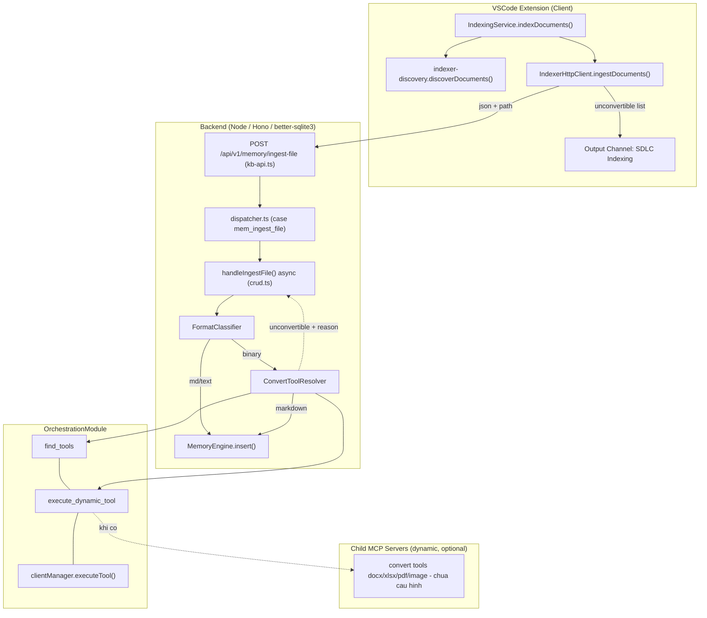
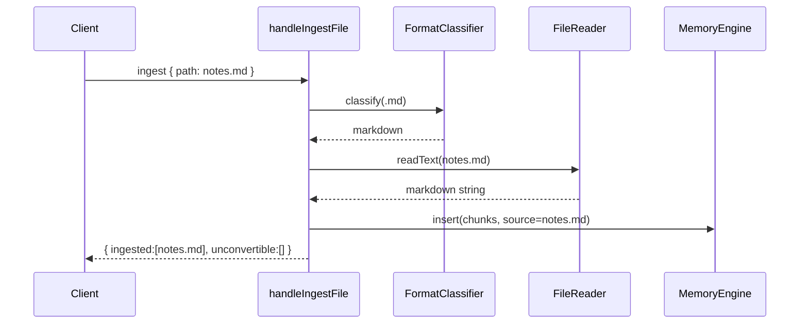
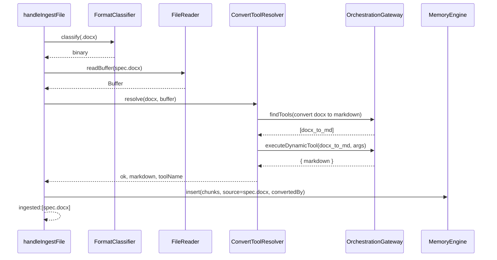
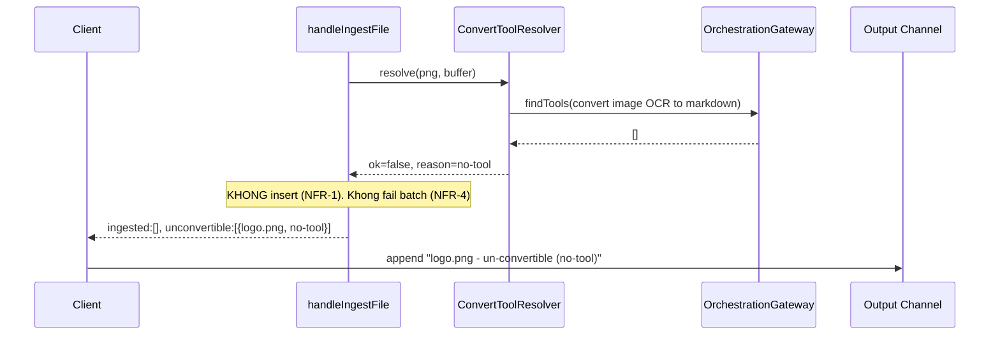

# Design Document

## Overview

Tài liệu này mô tả thiết kế kỹ thuật cho tính năng **ingest-document-conversion**: chuyển trách nhiệm convert tài liệu (docx/xlsx/pdf/ảnh...) sang markdown từ **client (VSCode extension)** về **server (backend Node/Hono)**, và xử lý an toàn các file không thể convert ("un-convertible").

Nguyên tắc cốt lõi:
1. **Convert là nghiệp vụ server.** Client chỉ upload file gốc và hiển thị log các file un-convertible server trả về. (R1)
2. **Server KHÔNG thêm thư viện convert built-in** (mammoth/xlsx/pdf-parse/OCR). Chỉ dùng tool động qua orchestration: `find_tools(query)` → `execute_dynamic_tool(toolName, arguments)`. (R2, R3)
3. **Không có tool phù hợp ⇒ Un-convertible.** Server KHÔNG ingest rác; trả danh sách un-convertible về client để log. (R4, NFR-1)
4. **Markdown/text ⇒ Direct Ingest**, bỏ qua convert. (R5)
5. **File nhị phân KHÔNG đọc bằng utf-8.** `handleIngestFile` phải async, đọc `Buffer`. (R6)
6. **Ảnh: chưa có tool ⇒ log-only (un-convertible)**, KHÔNG fail cả batch. (NFR-4)
7. **Client hiển thị log un-convertible** rõ ràng. (R1, NFR-5)

### Requirements Traceability

| ID | Requirement | Thành phần thiết kế chính |
|----|-------------|---------------------------|
| R1 | Server-side Conversion Ownership | ConvertToolResolver, handleIngestFile, client refactor (chỉ upload + log) |
| R2 | Convert Tool Resolution qua Dynamic Tool | ConvertToolResolver + OrchestrationGateway (find_tools/execute_dynamic_tool) |
| R3 | No Built-in Convert Library trên Server | ConvertToolResolver (không import lib convert) |
| R4 | Un-convertible File Handling | ConvertToolResolver (reason enum), handleIngestFile, Response schema |
| R5 | Direct Ingest cho Markdown/Text | FormatClassifier, handleIngestFile |
| R6 | Binary File Handling đúng cách | handleIngestFile async, FileReader.readBuffer (không utf-8) |
| R7 | discoverDocuments làm Input | Client IndexingService (đã tổng quát hóa) |
| NFR-1 | Không index nội dung rác | handleIngestFile chỉ insert markdown hợp lệ |
| NFR-2 | Không thêm built-in convert library | OrchestrationGateway (tool động) |
| NFR-3 | Hiệu năng khi index nhiều file | Per-file try/catch, async I/O, convert timeout |
| NFR-4 | Xử lý ảnh khi chưa có tool = log-only | reason=no-tool, batch resilience |
| NFR-5 | Observability / Logging | ConvertReason enum, structured logging, client Output Channel |

---

## Architecture

Bước convert được **dời khỏi client** và đặt sau `handleIngestFile` trên server, dựa hoàn toàn vào orchestration dynamic tools.



Nhánh "no tool available" là hành vi mặc định hiện tại (0 child server convert): `find_tools` không trả kết quả ⇒ resolver trả `reason=no-tool` ⇒ file un-convertible mà không fail batch (R4, NFR-1, NFR-4).

---

## Components and Interfaces

### 1. FormatClassifier (server, mới)

```typescript
// backend/src/modules/memory/ingest/FormatClassifier.ts
export type IngestFormat = 'markdown' | 'text' | 'binary';
export interface ClassifyInput { filePath: string; ext: string; mime?: string; }
export interface FormatClassifier { classify(input: ClassifyInput): IngestFormat; }
```
Quy tắc: `.md/.markdown` → markdown; `.txt/.csv/.json/.yaml/.yml/.log` + text mime → text (Direct Ingest — R5); còn lại → binary (qua ConvertToolResolver — R6).

### 2. FileReader (server, mới — tách I/O)

```typescript
// backend/src/modules/memory/ingest/FileReader.ts
export interface FileReader {
  readText(absPath: string): Promise<string>;   // readFile(path, 'utf-8')
  readBuffer(absPath: string): Promise<Buffer>;  // readFile(path) — KHÔNG encoding (R6)
  statSize(absPath: string): Promise<number>;    // size cap (NFR-3)
}
```

### 3. ConvertToolResolver (server, mới — trọng tâm)

```typescript
// backend/src/modules/memory/ingest/ConvertToolResolver.ts
export type ConvertReason = 'no-tool' | 'convert-failed' | 'empty-result' | 'schema-error' | 'timeout';
export interface ConvertSuccess { ok: true; markdown: string; toolName: string; }
export interface ConvertFailure { ok: false; reason: ConvertReason; detail?: string; }
export type ConvertResult = ConvertSuccess | ConvertFailure;
export interface ConvertRequest { filePath: string; ext: string; mime?: string; buffer: Buffer; }
export interface ConvertToolResolver { resolve(req: ConvertRequest): Promise<ConvertResult>; }
```

Thuật toán `resolve()`:
```
1. query = buildQuery(ext, mime)   // .docx->"convert docx to markdown"; .xlsx->"convert excel spreadsheet to markdown"; image->"convert image OCR to markdown"
2. tools = await gateway.findTools(query, { threshold:0.4, top_k:5 })
3. if (tools.length===0) return { ok:false, reason:'no-tool' }          // R4/NFR-4
4. tool = selectBestTool(tools, ext)
5. args = buildArgs(tool, req); if (!args) return { ok:false, reason:'schema-error' }
6. result = await withTimeout(gateway.executeDynamicTool(tool.name, args), CONVERT_TIMEOUT_MS)  // NFR-3
   - timeout -> reason:'timeout'; throw/err -> reason:'convert-failed'
7. markdown = extractMarkdown(result); if (empty) return { ok:false, reason:'empty-result' }
8. return { ok:true, markdown, toolName: tool.name }
```
`CONVERT_TIMEOUT_MS` mặc định 30_000ms (cấu hình được). Resolver không biết trước tool nào tồn tại → khi child convert server được cấu hình sau, hệ thống tự dùng, không sửa code (NFR-2). Phụ thuộc abstraction `OrchestrationGateway` (DIP) để dễ mock.

```typescript
// backend/src/modules/memory/ingest/OrchestrationGateway.ts
export interface ToolDescriptor { name: string; description: string; inputSchema?: Record<string, unknown>; }
export interface OrchestrationGateway {
  findTools(query: string, opts?: { threshold?: number; top_k?: number }): Promise<ToolDescriptor[]>;
  executeDynamicTool(toolName: string, args: Record<string, unknown>): Promise<unknown>;
}
```
Adapter bọc `registry.getModule('orchestration')` (handlers find_tools/execute_dynamic_tool; clientManager qua `OrchestrationModule.getClientManager()`).

### 4. handleIngestFile (server, sửa: SYNC → ASYNC)

File `backend/src/modules/memory/dispatchers/crud.ts` — fix bug đọc binary bằng utf-8 (R6).
```typescript
export async function handleIngestFile(
  args: IngestFileArgs,
  deps: { reader: FileReader; classifier: FormatClassifier; resolver: ConvertToolResolver; engine: MemoryEngine; }
): Promise<IngestFileResult>
```
Luồng:
```
1. resolve & validate path (path traversal guard + size cap)
2. format = classifier.classify(...)
3. md/text: text = await reader.readText(); insert chunks; return ingested:[file]
   binary: buffer = await reader.readBuffer();   // KHÔNG utf-8 (R6)
           res = await resolver.resolve({filePath, ext, mime, buffer})
           ok  -> insert chunks (convertedBy=toolName); return ingested:[file]
           fail-> KHÔNG insert (R4/NFR-1); return unconvertible:[{file, reason}]
```
Batch: mỗi file `try/catch` riêng; một file lỗi/un-convertible KHÔNG dừng file khác (NFR-3, NFR-4). Aggregate `{ ingested, unconvertible, summary }`.

### 5. Route POST /api/v1/memory/ingest-file (kb-api.ts)
Nhận field binary (xem Binary Upload); trả response mở rộng `unconvertible[]` (R1, NFR-5).

### 6. Client: IndexingService & IndexerHttpClient (extension, sửa)
- Gỡ `RemoteConverter`/`LocalFallbackConverter` khỏi luồng `indexDocuments` (R1).
- `IndexerHttpClient.ingestDocuments()`: gửi file gốc + đọc `unconvertible` từ response.
- `IndexingService`: append un-convertible + summary vào Output Channel "SDLC Indexing" (R1, NFR-5).

```typescript
// extension/src/models/IngestResult.ts
export interface UnconvertibleEntry { file: string; reason: string; }
export interface IngestResponse {
  ingested: string[];
  unconvertible: UnconvertibleEntry[];
  summary: { total: number; ingested: number; unconvertible: number };
}
```

---

## Data Models

### KB Entry (không đổi schema DB lớn)
Entry chỉ chứa markdown; không lưu nhị phân gốc. `source`=filePath. Metadata mềm `convertedBy` optional (NFR-5). **Không migration DB.**

### Ingest Response Schema (mở rộng)
```jsonc
{
  "ingested": ["/abs/path/a.md", "/abs/path/b.docx"],
  "unconvertible": [
    { "file": "/abs/path/logo.png", "reason": "no-tool" },
    { "file": "/abs/path/broken.pdf", "reason": "convert-failed" }
  ],
  "summary": { "total": 3, "ingested": 2, "unconvertible": 1 }
}
```

### Binary Upload — Quyết định thiết kế
**Phương án A (ĐỀ XUẤT): Path-based server-side read.** Client gửi path tuyệt đối; server đọc `Buffer` (`fs.promises.readFile(path)` không encoding). Ưu: cùng máy/repo (khớp code `resolved` hiện tại), không base64 bloat; thay đổi nhỏ nhất. Nhược: không dùng khi tách máy; cần path validation chặt.
**Phương án B (FALLBACK): Base64 trong JSON** (khi detached/remote), cần size cap nghiêm ngặt.
**Kết luận:** Triển khai A mặc định (client gửi path + ext/mime); định nghĩa field `encoding` mở đường cho B, không phá contract.
```jsonc
{ "files": [ { "path": "/abs/workspace/docs/spec.docx", "ext": ".docx", "mime": "application/vnd..." } ] }
// Option B (future): { "path": "spec.docx", "content": "<base64>", "encoding": "base64" }
```

---

## Sequence / Flow

### (a) File .md → Direct Ingest (R5)


### (b) File .docx CÓ tool → convert → ingest (R2)


### (c) File ảnh KHÔNG có tool → un-convertible → client log (R4, NFR-4, NFR-5)


---

## Error Handling

| Tình huống | Nơi xử lý | Kết quả | Reason |
|-----------|-----------|---------|--------|
| Không có tool convert | ConvertToolResolver | un-convertible, không insert | `no-tool` |
| Tool ném lỗi / trả error | ConvertToolResolver | un-convertible | `convert-failed` |
| Tool trả markdown rỗng | ConvertToolResolver | un-convertible | `empty-result` |
| Arguments/response sai schema | ConvertToolResolver | un-convertible | `schema-error` |
| Convert vượt timeout | ConvertToolResolver (withTimeout) | un-convertible | `timeout` |
| File không tồn tại / path traversal | handleIngestFile validate | lỗi cho file đó, batch tiếp tục | (error) |
| File vượt size cap | handleIngestFile | un-convertible/skip + log | `too-large` |
| Một file lỗi trong batch | per-file try/catch | file khác vẫn xử lý | — |

Client không nhận exception cho un-convertible; chỉ đọc `unconvertible[]` và render log. HTTP call thất bại toàn cục (network/500) → error toast + log (không nuốt exception). Server logging: mỗi un-convertible ghi structured log `{ file, reason, toolTried? }` — KHÔNG log buffer/nội dung (NFR-5).

---

## Testing Strategy

**Unit — ConvertToolResolver (mock OrchestrationGateway):** có tool→ok; không tool→no-tool; tool lỗi→convert-failed; timeout→timeout (fake timer); empty→empty-result; schema sai→schema-error; nhiều tool→chọn đúng theo ext/desc.

**Unit — handleIngestFile (mock reader/classifier/resolver/engine):** md/text gọi readText+insert, KHÔNG gọi resolver (R5); binary có markdown gọi readBuffer (không utf-8)+insert (R2,R6); binary un-convertible→KHÔNG insert, trả unconvertible[] (R4); assert readBuffer gọi cho binary, readText KHÔNG gọi cho binary (chống regression bug utf-8).

**Unit — FormatClassifier:** bảng ext→format (.md/.txt/.docx/.png/.pdf/.xlsx/no-ext/mime text vs binary).

**Integration — endpoint /api/v1/memory/ingest-file:** batch md + docx(no-tool) + png(no-tool) → ingested chứa md, unconvertible chứa docx+png, summary đúng; batch KHÔNG fail (NFR-3, NFR-4); KB không có entry cho un-convertible (NFR-1).

**Client — IndexingService/IndexerHttpClient:** mock response có unconvertible[] → Output Channel nhận đúng log + summary (R1, NFR-5); xác nhận KHÔNG gọi RemoteConverter/LocalFallbackConverter (R1).

**PBT:** (a) `summary.ingested + summary.unconvertible === summary.total` & reason ∈ enum; (b) không entry KB nào có `source` thuộc unconvertible (NFR-1); (c) binary input không bao giờ decode utf-8 (spy readText không gọi cho binary).

**Test data:** fixtures `.md` hợp lệ, `.docx` nhỏ, `.png` nhỏ, file rỗng, file lớn (size cap).

---

## Implementation Checklist

| # | Task | Trace |
|---|------|-------|
| 1 | `FormatClassifier` + unit test bảng ext/mime | R5, R6 |
| 2 | `FileReader` (readText/readBuffer async, statSize) | R6, NFR-3 |
| 3 | `OrchestrationGateway` adapter bọc OrchestrationModule | R2, NFR-2 |
| 4 | `ConvertToolResolver` (query build, tool select, timeout, reason enum) + unit tests | R2, R3, R4, NFR-3, NFR-5 |
| 5 | `handleIngestFile` async; binary đọc Buffer; nhánh md/text vs binary; per-file try/catch | R4, R5, R6, NFR-1, NFR-3 |
| 6 | `dispatcher.ts` await handleIngestFile(...) | R6 |
| 7 | Route `/api/v1/memory/ingest-file`: request path-based + response {ingested, unconvertible, summary} | R1, NFR-5 |
| 8 | Path validation (traversal guard, workspace root) + size cap | NFR-3 |
| 9 | Client: gỡ RemoteConverter/LocalFallbackConverter khỏi luồng ingest | R1 |
| 10 | Client: `IndexerHttpClient.ingestDocuments` gửi path + đọc unconvertible | R1 |
| 11 | Client: `IndexingService` append un-convertible + summary vào Output Channel | R1, NFR-5 |
| 12 | Integration test endpoint trả unconvertible; KB không rác | R4, NFR-1, NFR-3 |
| 13 | PBT invariants (tổng số, reason enum, no-garbage, no-utf8-binary) | R4, R6, NFR-1 |
| 14 | Structured logging cho un-convertible (không leak nội dung) | NFR-5 |
| 15 | Cấu hình `CONVERT_TIMEOUT_MS` + tài liệu thêm child convert tool | NFR-2, NFR-3 |

### Security note
Endpoint ingest-file: xác định cơ chế auth hiện có; path-based read cho phép đọc file theo path client cung cấp ⇒ BẮT BUỘC guard path traversal + giới hạn workspace root. Không log/echo nội dung file nhị phân hay giá trị nhạy cảm.
