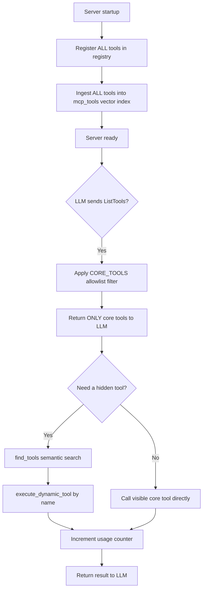
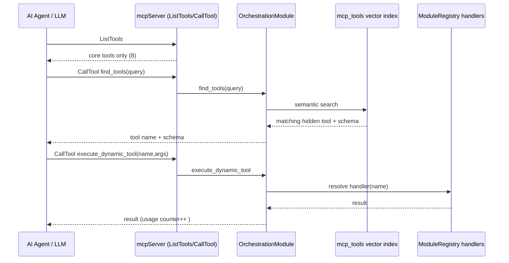

# Business Requirements Document (BRD)

## Kiro Backend MCP Server — SA4E-18: Tool Visibility Tiers — giảm context bằng cách ẩn tool ít dùng

---

## Document Information

| Field | Value |
|-------|-------|
| Jira Ticket | SA4E-18 |
| Title | Tool Visibility Tiers — giảm context bằng cách ẩn tool ít dùng |
| Author | BA Agent |
| Version | 1.0 |
| Date | 2026-07-07 |
| Status | Draft |

---

## Author Tracking

| Role | Name - Position | Responsibility |
|------|-----------------|----------------|
| Author | BA Agent – Business Analyst | Create document |
| Peer Reviewer | Duc Nguyen Minh – Reporter | Review document |

---

## Revision History

| Version | Date | Author | Changes |
|---------|------|--------|---------|
| 1.0 | 2026-07-07 | BA Agent | Initiate document — auto-generated from Jira ticket SA4E-18 |

---

## Sign-Off

| Name | Signature and date |
|------|--------------------|
| | ☐ I agree and confirm all criteria on this BRD as expected requirements |
| | ☐ I agree and confirm all criteria on this BRD as expected requirements |

---

## 1. Introduction

### 1.1 Scope

This change request addresses context bloat in the Kiro Backend MCP server (`kiro-backend-mcp`). Today the server advertises **all ~60 tools** to any connected LLM client through the standard MCP `ListTools` response (`ListToolsRequestSchema` in `backend/src/server/mcpServer.ts`, which calls `registry.getAllToolDefinitions()`). Every tool definition (name, description, full JSON input schema) is serialized into the model context on each session, consuming a large, fixed token budget before the agent does any useful work.

The scope of SA4E-18 is to introduce a **two-tier tool visibility model**:

- **CORE tier** — a small, curated allowlist of high-frequency tools that remain visible in the `ListTools` response.
- **EXTENDED tier** — all remaining tools, which are hidden from `ListTools` but stay fully **discoverable** via `find_tools` (backed by the existing vector index in the `mcp_tools` table, populated at `backend/src/index.ts`) and fully **callable** via `execute_dynamic_tool` (routed through `registry.getToolHandlers()` in `backend/src/modules/orchestration/OrchestrationModule.ts`).

The chosen solution is **Approach B — central allowlist**: a single configuration source (`CORE_TOOLS`) plus a filter applied at the `mcpServer` `ListTools` handler. No per-module changes are required.

The scope also includes **usage tracking**: counting how many times each tool is invoked, so that the CORE/EXTENDED classification can later be tuned automatically from real usage data.

**Confirmed CORE set (kept visible):** `mem_search`, `mem_ingest`, `mem_ingest_file`, `code_search`, `get_curated_context`, `find_tools`, `execute_dynamic_tool`, `orchestration_status`. All other tools become EXTENDED (hidden).

### 1.2 Out of Scope

- Removing, renaming, or changing the behavior of any existing tool handler.
- Modifying individual module code to opt in/out of visibility (Approach A is explicitly rejected in favor of the central allowlist).
- Building a UI or admin console for managing the allowlist (config-driven only in this CR).
- Automatic re-classification of tools based on usage data — this CR only **collects** usage counts; the auto-classification algorithm is a future enhancement.
- Changing the `find_tools` vector search / embedding logic.

### 1.3 Preliminary Requirement

- The `mcp_tools` vector index must continue to be populated at startup (`backend/src/index.ts`) with the FULL tool set so hidden tools remain discoverable.
- The orchestration module (`execute_dynamic_tool`) must continue to resolve handlers from `registry.getToolHandlers()` for the full tool set.
- A persistent store (existing memory DB used by `MemoryModule`) is available for recording usage counts.

---

## 2. Business Requirements

### 2.1 High Level Process Map

At server startup, the full tool set is registered and ingested into the `mcp_tools` vector index (unchanged). When an LLM client requests `ListTools`, the server now applies the `CORE_TOOLS` allowlist filter and returns **only CORE tools**. Hidden (EXTENDED) tools are surfaced on demand through the two-step dynamic pattern: `find_tools` (semantic discovery) → `execute_dynamic_tool` (invocation). Every tool call — whether CORE or dynamically executed — increments a per-tool usage counter for later analysis.

*[Edit in draw.io](diagrams/use-case.drawio)*

*[Edit in draw.io](diagrams/business-flow.drawio)*

**High-level process map (Mermaid):**

### 2.2 List of User Stories / Use Cases

| # | Story / Use Case / Epic | Priority | Source Ticket |
|---|-------------------------|----------|---------------|
| 1 | As an AI agent / LLM, I want ListTools to return only a small core set of tools so that my context budget is not consumed by ~60 rarely-used tool definitions. | MUST HAVE | SA4E-18 |
| 2 | As a platform maintainer, I want to configure the core tool set in one central place (CORE_TOOLS allowlist) so that I can control tool visibility without editing every module. | MUST HAVE | SA4E-18 |
| 3 | As an operations engineer, I want per-tool usage counts recorded so that I can monitor which tools are actually used and later auto-classify core vs extended. | SHOULD HAVE | SA4E-18 |
| 4 | As an AI agent, I want hidden tools to remain discoverable and callable so that reducing visibility does not break any existing capability (100% backward compatibility). | MUST HAVE | SA4E-18 |

---

### 2.3 Details of User Stories

---

#### Business Flow

**Step 1:** On startup, `ModuleRegistry` registers all modules and their tools; `backend/src/index.ts` ingests the full tool set (name, description, schema, vector embedding) into the `mcp_tools` table. This step is unchanged so discovery stays complete.

**Step 2:** When an MCP client connects and issues a `ListTools` request, the `ListToolsRequestSchema` handler in `mcpServer.ts` reads the central `CORE_TOOLS` allowlist and returns only the tools whose names are in that list.

**Step 3:** The LLM sees a small, focused tool list (8 core tools) and proceeds with far lower context consumption.

**Step 4:** If the agent needs a capability not in the core list, it calls `find_tools` (semantic search over the full `mcp_tools` index) to discover the appropriate tool name and schema.

**Step 5:** The agent invokes the discovered tool through `execute_dynamic_tool`, which resolves the handler from `registry.getToolHandlers()` and executes it exactly as before.

**Step 6:** Each tool invocation (core direct call or dynamic execution) increments a persistent usage counter keyed by tool name.

**Step 7:** Operators inspect usage counts over time to validate the core set and inform future auto-classification.

> **Note:** The filter is applied ONLY at the `ListTools` boundary. The `CallTool` handler and `execute_dynamic_tool` continue to accept any registered tool name, guaranteeing backward compatibility.

---

#### STORY 1: Reduce LLM context by returning only core tools in ListTools

> As an AI agent / LLM, I want ListTools to return only a small core set of tools so that my context budget is not consumed by ~60 rarely-used tool definitions.

**Requirement Details:**

1. The `ListToolsRequestSchema` handler in `backend/src/server/mcpServer.ts` MUST filter `registry.getAllToolDefinitions()` down to only tools present in the central `CORE_TOOLS` allowlist before serializing the response.
2. The core set returned MUST be exactly: `mem_search`, `mem_ingest`, `mem_ingest_file`, `code_search`, `get_curated_context`, `find_tools`, `execute_dynamic_tool`, `orchestration_status`.
3. The meta-tools `find_tools`, `execute_dynamic_tool`, and `orchestration_status` MUST always remain visible so agents retain the discovery + execution pathway.
4. All other tools (EXTENDED tier) MUST NOT appear in the `ListTools` response.

**Data Fields (if applicable):**

| Field | Type | Required | Description | Example |
|-------|------|----------|-------------|---------|
| tool.name | string | Yes | Tool identifier used for allowlist matching | `mem_search` |
| tool.description | string | Yes | Human/LLM-readable description | `Search knowledge base semantically` |
| tool.inputSchema | object | Yes | JSON schema of tool arguments | `{ "type": "object", ... }` |
| tool.tier | enum(CORE,EXTENDED) | No (derived) | Derived from allowlist membership | `CORE` |

**Acceptance Criteria:**

1. Given the server is running, when a client sends `ListTools`, then the response contains exactly the 8 configured core tools and no others.
2. Given the core set is returned, then the total token size of the `ListTools` response is measurably smaller than the pre-change baseline (~60 tools) — target reduction ≥ 70% (see NFR).
3. Given a tool is in the EXTENDED tier, when a client inspects `ListTools`, then that tool is absent from the list.
4. Given the meta-tools, when `ListTools` is called, then `find_tools`, `execute_dynamic_tool`, and `orchestration_status` are always present.

---

#### STORY 2: Central allowlist configuration for the core tool set

> As a platform maintainer, I want to configure the core tool set in one central place (CORE_TOOLS allowlist) so that I can control tool visibility without editing every module.

**Requirement Details:**

1. A single configuration constant/source named `CORE_TOOLS` MUST define the list of core tool names.
2. The `mcpServer` `ListTools` filter MUST read from this single source (Approach B — central allowlist). No per-module flags or edits are permitted.
3. Adding or removing a tool from the core set MUST require editing only the `CORE_TOOLS` config, not any module implementation.
4. If a name in `CORE_TOOLS` does not match any registered tool, the server MUST log a warning and continue (graceful degradation), rather than failing startup.

**Data Fields (if applicable):**

| Field | Type | Required | Description | Example |
|-------|------|----------|-------------|---------|
| CORE_TOOLS | string[] | Yes | Central allowlist of core tool names | `["mem_search","find_tools", ...]` |

**Acceptance Criteria:**

1. Given a maintainer edits `CORE_TOOLS` to add a tool name, when the server restarts, then that tool appears in `ListTools` without any module code change.
2. Given a maintainer removes a tool name from `CORE_TOOLS`, when the server restarts, then that tool no longer appears in `ListTools` but remains callable via `execute_dynamic_tool`.
3. Given `CORE_TOOLS` contains an unknown tool name, when the server starts, then a warning is logged and startup succeeds.
4. Given the allowlist is defined once, then no module file needs modification to change visibility (verified by code review).

**Validation Rules (if applicable):**

- `CORE_TOOLS` entries MUST be non-empty strings.
- Duplicate entries MUST be de-duplicated (no effect on output).

---

#### STORY 3: Per-tool usage tracking for data-driven classification

> As an operations engineer, I want per-tool usage counts recorded so that I can monitor which tools are actually used and later auto-classify core vs extended.

**Requirement Details:**

1. Every successful tool invocation — via the `CallTool` handler in `mcpServer.ts` and via `execute_dynamic_tool` in `OrchestrationModule.ts` — MUST increment a usage counter keyed by tool name.
2. Usage counts MUST be persisted (in the existing memory DB) so they survive restarts.
3. Usage tracking MUST NOT block or measurably slow tool execution (increment is best-effort / non-fatal).
4. A means to read aggregated usage counts MUST be available (e.g., via an existing analytics/memory read path) for operators.

**Data Fields (if applicable):**

| Field | Type | Required | Description | Example |
|-------|------|----------|-------------|---------|
| tool_name | string | Yes | Name of the invoked tool | `mem_search` |
| call_count | integer | Yes | Cumulative number of invocations | `142` |
| last_called_at | timestamp | No | Timestamp of most recent invocation | `2026-07-07T10:00:00Z` |

**Acceptance Criteria:**

1. Given a tool is invoked N times, when usage counts are read, then `call_count` for that tool equals N.
2. Given the server restarts, when usage counts are read, then previously accumulated counts are preserved.
3. Given usage tracking fails internally, when a tool is invoked, then the tool result is still returned successfully (tracking is non-blocking).
4. Given both direct core calls and dynamic executions occur, then both paths contribute to the same per-tool counter.

**Error Handling (if applicable):**

- Usage-counter write failure: log at warn level, do not propagate error to the tool caller.

---

#### STORY 4: Preserve full discoverability and callability of hidden tools (backward compatibility)

> As an AI agent, I want hidden tools to remain discoverable and callable so that reducing visibility does not break any existing capability.

**Requirement Details:**

1. All tools (including EXTENDED) MUST continue to be ingested into the `mcp_tools` vector index at startup so `find_tools` can return them.
2. `execute_dynamic_tool` MUST resolve and execute any registered tool by name, regardless of tier.
3. The direct `CallTool` handler MUST still execute any registered tool name if called directly (no allowlist enforcement on execution).
4. No existing agent workflow that relied on a now-hidden tool may break — the discovery + execute path must fully cover it.

**Acceptance Criteria:**

1. Given a hidden tool, when an agent calls `find_tools` with a relevant query, then the hidden tool is returned with its name and schema.
2. Given a hidden tool name, when an agent calls `execute_dynamic_tool` with that name and valid arguments, then the tool executes and returns the same result it did before this change.
3. Given a hidden tool name, when `CallTool` is invoked directly with it, then the tool still executes (no "Unknown tool" error introduced by the visibility change).
4. Given the full regression set of tool calls, then 100% of previously-working tool invocations continue to work (backward compatibility = 100%).

**Sequence — dynamic discovery + execution of a hidden tool (Mermaid):**

---

## 3. Dependencies

| Dependency | Type | Related Ticket | Description |
|------------|------|----------------|-------------|
| `mcp_tools` vector index population at startup | System | N/A | Must keep ingesting the FULL tool set (`backend/src/index.ts`) so hidden tools stay discoverable via `find_tools`. |
| `MemoryModule` DB | Infrastructure | N/A | Persistent store used to record per-tool usage counts. |
| `OrchestrationModule.execute_dynamic_tool` | System | N/A | Execution pathway for hidden tools; must resolve handlers from `registry.getToolHandlers()`. |
| MCP SDK `ListToolsRequestSchema` / `CallToolRequestSchema` | External | N/A | Standard MCP request handlers where filtering and usage tracking are applied. |

---

## 4. Stakeholders

| Role | Name / Team | Responsibility | Source |
|------|-------------|----------------|--------|
| Reporter / Product Owner | Duc Nguyen Minh | Defines requirements, approves BRD | Ticket reporter |
| Backend Developer | Backend / Platform team | Implements CORE_TOOLS allowlist + filter + usage tracking | Assumed |
| AI Agent / LLM consumers | All agents (BA, SA, DEV, QA, etc.) | Primary beneficiaries of reduced context | Derived from system design |
| Operations Engineer | Ops / Platform team | Monitors usage counts for classification | Derived from Story 3 |

---

## 5. Risks and Assumptions

### 5.1 Risks

| Risk | Impact | Likelihood | Mitigation |
|------|--------|------------|------------|
| A tool wrongly excluded from core breaks an agent that expected it visible | Medium | Medium | Meta-tools always visible; agents fall back to find_tools + execute_dynamic_tool; validate core set against real usage. |
| Hidden tool not discoverable due to weak embedding match | Medium | Low | Keep full vector ingestion; allow lower find_tools threshold (0.3) and rephrasing. |
| Usage tracking adds latency or contention on DB | Low | Low | Non-blocking best-effort increment; batch/async if needed. |
| Core set drift over time (stale allowlist) | Low | Medium | Usage tracking enables periodic review and future auto-classification. |

### 5.2 Assumptions

- The existing `find_tools` + `execute_dynamic_tool` pattern is reliable and already used by agents (per `tool-usage-dynamic.md`).
- All ~60 tools are already ingested into `mcp_tools` at startup.
- The confirmed core set of 8 tools covers the majority of high-frequency agent operations.
- Reducing `ListTools` output does not affect MCP protocol compliance (clients tolerate a smaller tool list).

---

## 6. Non-Functional Requirements

| Category | Requirement | Details |
|----------|-------------|---------|
| Performance (Context) | Reduce ListTools token footprint | `ListTools` response token count reduced by ≥ 70% vs baseline (~60 tools → 8 core tools). Measured by comparing serialized ListTools payload before/after. |
| Compatibility | 100% backward compatibility | Every tool callable before the change remains callable after (via direct CallTool and via execute_dynamic_tool). 0 regressions in tool invocation. |
| Discoverability | Hidden tools findable | 100% of hidden tools remain returnable by `find_tools` for a relevant query. |
| Performance (Latency) | No added call latency | Usage tracking adds < 5 ms overhead per call and is non-blocking. |
| Maintainability | Single point of change | Visibility controlled by exactly one config source (`CORE_TOOLS`); 0 per-module edits required to change the core set. |
| Reliability | Graceful degradation | Unknown core tool names and usage-write failures never crash the server or fail tool calls. |
| Observability | Usage metrics | Per-tool cumulative `call_count` persisted and readable for operators. |

---

## 7. Related Tickets

| Ticket Key | Summary | Status | Type | Relationship |
|------------|---------|--------|------|--------------|
| SA4E-18 | Tool Visibility Tiers — giảm context bằng cách ẩn tool ít dùng | To Do | Task | Main ticket |

> No linked issues, subtasks, or epic relationships were found on SA4E-18 at the time of authoring.

---

## 8. Appendix

The solution touches three existing files:
- `backend/src/server/mcpServer.ts` — apply `CORE_TOOLS` filter at `ListToolsRequestSchema`; add usage increment at `CallToolRequestSchema`.
- `backend/src/modules/orchestration/OrchestrationModule.ts` — add usage increment inside `execute_dynamic_tool`.
- A new central config for `CORE_TOOLS` (e.g., under `backend/src/config`).

Startup ingestion in `backend/src/index.ts` remains unchanged (full tool set → `mcp_tools`).

### Glossary

| Term | Definition |
|------|------------|
| CORE tier | Small allowlisted set of tools kept visible in `ListTools`. |
| EXTENDED tier | All tools hidden from `ListTools` but discoverable/callable dynamically. |
| ListTools | Standard MCP request returning available tool definitions to the client. |
| find_tools | Meta-tool performing semantic search over the `mcp_tools` vector index. |
| execute_dynamic_tool | Meta-tool that executes any registered tool by name. |
| CORE_TOOLS | Central config allowlist defining the core tier. |
| Context budget | Token capacity a model spends on tool definitions and prompt. |

### Reference Documents

| Document | Link / Location |
|----------|-----------------|
| Dynamic tool execution pattern | `.kiro/steering/tool-usage-dynamic.md` |
| MCP server implementation | `backend/src/server/mcpServer.ts` |
| Orchestration module | `backend/src/modules/orchestration/OrchestrationModule.ts` |
| Startup tool ingestion | `backend/src/index.ts` |

### Diagram Index

| # | Diagram | Image | Source (editable) |
|---|---------|-------|-------------------|
| 1 | Use Case Diagram | [use-case.png](diagrams/use-case.png) | [use-case.drawio](diagrams/use-case.drawio) |
| 2 | Business Flow | [business-flow.png](diagrams/business-flow.png) | [business-flow.drawio](diagrams/business-flow.drawio) |
