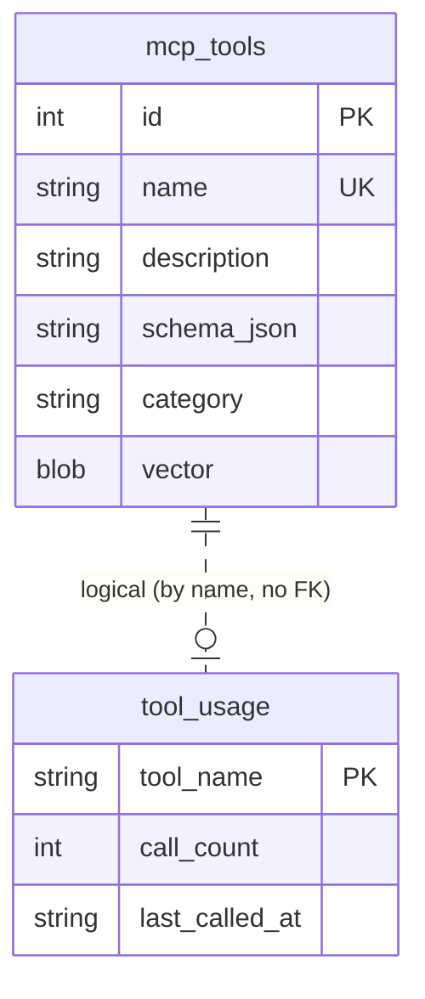

# Technical Design Document (TDD)

## Kiro Backend MCP Server — SA4E-18: Tool Visibility Tiers

---

## Document Information

| Field | Value |
|-------|-------|
| Jira Ticket | SA4E-18 |
| Title | Tool Visibility Tiers — reduce LLM context by hiding rarely-used tools |
| Author | SA Agent (Solution Architect) |
| Version | 1.0 |
| Date | 2026-07-09 |
| Status | Draft |
| Related BRD | BRD-v1-SA4E-18.docx |
| Related FSD | FSD-v1-SA4E-18.docx |
| Architecture Pattern | AI-Agent System (MCP server) |

---

## Revision History

| Version | Date | Author | Changes |
|---------|------|--------|---------|
| 1.0 | 2026-07-09 | SA Agent | Initial TDD — architecture, class/module design, API, DDL, checklist, Open Issue resolutions (OI-1..4), verified against actual source code |

---

## 1. Introduction

### 1.1 Purpose

This TDD specifies the concrete technical design to implement SA4E-18 as defined in the FSD. It turns the FSD Use Cases (UC-01..UC-04), Business Rules (BR-01..BR-16) and Open Issues (OI-1..OI-4) into an implementable design: new modules, exact method signatures, physical DDL, wiring changes, and an ordered implementation checklist for DEV.

The design is verified against the **actual** `kiro-backend-mcp` source (`backend/src`), not assumptions. Every design decision references a real file and its current shape.

### 1.2 Scope

In scope (additive, localized changes only):

- New config module `backend/src/config/CoreTools.ts` (CORE allowlist + resolver).
- New helper `backend/src/server/toolUsageTracker.ts` (non-blocking usage wrapper).
- Filter + usage hook in `backend/src/server/mcpServer.ts`.
- Usage hook in `backend/src/modules/orchestration/OrchestrationModule.ts`.
- New methods on `backend/src/modules/memory/MemoryEngine.ts`.
- New `tool_usage` table in `backend/src/engine/db/schema.ts`.
- New `tool_usage` read action on the existing `mem_admin` tool (OI-1).

Out of scope: auto re-classification, admin UI, changing tool handlers, `find_tools` embedding logic, startup ingestion in `index.ts` (UNCHANGED).

### 1.3 Technology Stack (verified)

| Layer | Technology | Evidence |
|-------|-----------|----------|
| Language | TypeScript (ESM, `.js` import specifiers) | `import ... from '../config/CoreTools.js'` style across `backend/src` |
| Runtime | Node.js | `backend/src/index.ts` startup |
| MCP SDK | `@modelcontextprotocol/sdk` | `mcpServer.ts` imports `Server`, `ListToolsRequestSchema`, `CallToolRequestSchema` |
| DB | SQLite via `better-sqlite3` (synchronous, WAL) | `MemoryEngine` uses `Database.prepare(...).run(...)` |
| Logging | `pino` (`Logger`, `logger.child(...)`, `logger.warn({...}, msg)`) | all modules |
| Embeddings | `EmbeddingService` (cosine similarity over float32 blobs) | `OrchestrationModule.find_tools` |

### 1.4 Design Principles & Constraints

- **Additive & localized** — no per-module edits (BR-06); filtering at exactly one place (BR-11).
- **Progressive disclosure** — CORE visible, EXTENDED on-demand via `find_tools` + `execute_dynamic_tool`.
- **Non-blocking side effects** — usage tracking never fails a tool call (BR-09).
- **Code standards** — file ≤ 200 lines, function ≤ 20 lines, SOLID, model/logic separation.
- **Visibility ≠ access control** — hidden tools remain fully callable; tiers are a context-optimization mechanism only.

### 1.5 References

| Document / Artifact | Location |
|---------------------|----------|
| FSD | documents/SA4E-18/FSD.md |
| MCP server | backend/src/server/mcpServer.ts |
| Orchestration module | backend/src/modules/orchestration/OrchestrationModule.ts |
| Memory engine | backend/src/modules/memory/MemoryEngine.ts |
| DB schema | backend/src/engine/db/schema.ts |
| Module registry | backend/src/modules/ModuleRegistry.ts |
| Dynamic tool pattern | .kiro/steering/tool-usage-dynamic.md |

---

## 2. System Architecture

### 2.1 Overview

The change is **additive and localized**. No new process, no new module lifecycle, no new external dependency. Four existing files gain small, well-isolated hooks and two small new files are added.

| Component | File | Change Type | What changes |
|-----------|------|-------------|--------------|
| CORE allowlist config | `backend/src/config/CoreTools.ts` | **NEW** | `CORE_TOOLS`, `META_TOOLS`, `resolveCoreToolNames()` |
| Usage tracker helper | `backend/src/server/toolUsageTracker.ts` | **NEW** | `trackToolUsage(registry, logger, toolName)` |
| ListTools filter + CallTool hook | `backend/src/server/mcpServer.ts` | MODIFIED | filter to CORE (BR-01); increment on success (BR-07/12) |
| execute_dynamic_tool hook | `backend/src/modules/orchestration/OrchestrationModule.ts` | MODIFIED | increment resolved inner tool on success |
| Usage persistence | `backend/src/modules/memory/MemoryEngine.ts` | MODIFIED | `incrementToolUsage()`, `getToolUsage()` |
| Schema | `backend/src/engine/db/schema.ts` | MODIFIED | `tool_usage` table (idempotent, no version bump) |
| Usage read path | `backend/src/modules/memory/MemoryToolDispatcher.ts` | MODIFIED | `mem_admin` action `tool_usage` (OI-1) |
| Startup ingestion | `backend/src/index.ts` | **UNCHANGED** | full tool set → `mcp_tools` (BR-13) |

### 2.2 Architecture Diagram


*[Edit in draw.io](diagrams/architecture.drawio)*

### 2.3 Component Diagram


*[Edit in draw.io](diagrams/component.drawio)*

### 2.4 Class Diagram


*[Edit in draw.io](diagrams/class-design.drawio)*

### 2.5 Data-Flow Summary

Two independent flows share one component (Memory DB):

1. **Visibility flow (read-only, no persistence):** `ListTools` -> `resolveCoreToolNames()` -> filter `registry.getAllToolDefinitions()` -> return CORE subset. Pure function of config + registered tools; no DB access.
2. **Usage flow (write, non-blocking):** `CallTool` / `execute_dynamic_tool` -> handler success -> `trackToolUsage()` -> `MemoryEngine.incrementToolUsage()` -> `tool_usage` UPSERT. Failures are swallowed with a warn log.

### 2.6 Communication Patterns

- Client <-> server: MCP JSON-RPC (`tools/list`, `tools/call`) over existing transport. No new transport, no new auth surface.
- Internal: synchronous in-process calls. Usage write is synchronous but exception-isolated (see §8 for the OI-2 async fallback).

---

## 3. Class / Module Design

### 3.1 Package / File Layout

```
backend/src/
├── config/
│   └── CoreTools.ts            (NEW)  CORE_TOOLS, META_TOOLS, resolveCoreToolNames()
├── server/
│   ├── mcpServer.ts            (MOD)  ListTools filter + CallTool usage hook
│   └── toolUsageTracker.ts     (NEW)  trackToolUsage() non-blocking wrapper
├── modules/
│   ├── orchestration/
│   │   └── OrchestrationModule.ts  (MOD)  execute_dynamic_tool usage hook
│   └── memory/
│       ├── MemoryEngine.ts     (MOD)  incrementToolUsage(), getToolUsage()
│       └── MemoryToolDispatcher.ts (MOD)  mem_admin action "tool_usage"
└── engine/db/
    └── schema.ts               (MOD)  tool_usage table
```

### 3.2 Class Diagram (Mermaid)

```mermaid
classDiagram
    class CoreTools {
        <<module>>
        +CORE_TOOLS: readonly string[]
        +META_TOOLS: readonly string[]
        +resolveCoreToolNames(logger?) Set~string~
    }
    class toolUsageTracker {
        <<module>>
        +trackToolUsage(registry, logger, toolName) void
    }
    class ModuleRegistry {
        +getAllToolDefinitions() ToolDefinition[]
        +getToolHandlers() Map~string,ToolHandler~
        +getModule(name) IModule
    }
    class MemoryEngine {
        -db: Database
        +getDb() Database
        +incrementToolUsage(toolName) void
        +getToolUsage(toolName?) ToolUsageRow[]
    }
    class MemoryModule {
        +getEngine() MemoryEngine
        +status: ModuleStatus
    }
    class OrchestrationModule {
        -registry: ModuleRegistry
        -logger: Logger
        +getToolHandlers() Map
    }
    class mcpServer {
        <<factory>>
        +getMcpServer(registry, logger) Server
    }

    mcpServer ..> CoreTools : resolveCoreToolNames()
    mcpServer ..> toolUsageTracker : trackToolUsage()
    OrchestrationModule ..> toolUsageTracker : trackToolUsage()
    toolUsageTracker ..> ModuleRegistry : getModule('memory')
    toolUsageTracker ..> MemoryModule : getEngine()
    MemoryModule --> MemoryEngine : owns
    MemoryEngine ..> "tool_usage table" : UPSERT / SELECT
```

### 3.3 Module: CoreTools (NEW)

**File:** `backend/src/config/CoreTools.ts` (~35 lines). Dedicated module for SRP — keeps env/zod config separate. Single source of truth (BR-06).

```typescript
import type { Logger } from 'pino';

/** Meta-tools that MUST always be visible regardless of config (BR-03). */
export const META_TOOLS: readonly string[] = [
  'find_tools', 'execute_dynamic_tool', 'orchestration_status',
] as const;

/** Central CORE allowlist — edit ONLY here to change ListTools visibility (BR-06). */
export const CORE_TOOLS: readonly string[] = [
  'mem_search', 'mem_ingest', 'mem_ingest_file',
  'code_search', 'get_curated_context',
  'find_tools', 'execute_dynamic_tool', 'orchestration_status',
] as const;

/**
 * Normalize allowlist: drop invalid (BR-05), de-dup (BR-08),
 * always include META_TOOLS (BR-03). Never throws (BR-04).
 */
export function resolveCoreToolNames(logger?: Logger): Set<string> {
  const src = Array.isArray(CORE_TOOLS) ? CORE_TOOLS : [];
  const valid = src.filter(n => {
    const ok = typeof n === 'string' && n.trim().length > 0;
    if (!ok) logger?.warn({ entry: n }, 'CORE_TOOLS: ignoring invalid entry (BR-05)');
    return ok;
  });
  return new Set<string>([...valid, ...META_TOOLS]);
}
```

**Design notes:**
- Pure function; deterministic; no I/O. Trivially unit-testable (TC-06/TC-07).
- `Set` gives O(1) `has()` for the filter (BR-01) — §8 NFR.
- Meta-tools always merged in, so even an empty/garbage `CORE_TOOLS` still yields a usable server (EF-1).

### 3.4 Module: toolUsageTracker (NEW)

**File:** `backend/src/server/toolUsageTracker.ts` (~15 lines). Single shared helper used by BOTH invocation paths (DRY; BR-07).

```typescript
import type { Logger } from 'pino';
import type { ModuleRegistry } from '../modules/ModuleRegistry.js';
import type { MemoryModule } from '../modules/memory/MemoryModule.js';

/** Non-blocking per-tool usage increment (BR-07/BR-09/BR-10). Never throws. */
export function trackToolUsage(
  registry: ModuleRegistry, logger: Logger, toolName: string,
): void {
  try {
    if (!toolName || typeof toolName !== 'string') return;
    const mem = registry.getModule('memory') as MemoryModule | undefined;
    if (mem?.status === 'ready') mem.getEngine().incrementToolUsage(toolName);
  } catch (err) {
    logger.warn({ err, toolName }, 'tool_usage increment failed — non-blocking (BR-09)');
  }
}
```

**Design notes:**
- Lazy `registry.getModule('memory')` resolution → no constructor/DI changes (§5.3 FSD).
- If memory not `ready`, silently no-ops (call still returns normally) — graceful degradation.
- Guards against empty/non-string tool names (defensive).

### 3.5 MemoryEngine additions (MODIFIED)

**File:** `backend/src/modules/memory/MemoryEngine.ts`. Two new methods reusing the existing shared `better-sqlite3` handle (`this.db`). Model type added to `models.ts` (model/logic separation per code standards).

```typescript
// models.ts (NEW type)
export interface ToolUsageRow {
  tool_name: string;
  call_count: number;
  last_called_at: string | null;
}
```

```typescript
// MemoryEngine.ts (NEW methods)
/** Increment (or insert) per-tool usage counter. Idempotent UPSERT. BR-07/10/12. */
incrementToolUsage(toolName: string): void {
  this.db.prepare(`
    INSERT INTO tool_usage (tool_name, call_count, last_called_at)
    VALUES (?, 1, datetime('now'))
    ON CONFLICT(tool_name) DO UPDATE SET
      call_count = call_count + 1,
      last_called_at = datetime('now')
  `).run(toolName);
}

/** Read usage rows for operator inspection (OI-1). */
getToolUsage(toolName?: string): ToolUsageRow[] {
  return (toolName
    ? this.db.prepare(
        'SELECT tool_name, call_count, last_called_at FROM tool_usage WHERE tool_name = ?'
      ).all(toolName)
    : this.db.prepare(
        'SELECT tool_name, call_count, last_called_at FROM tool_usage ORDER BY call_count DESC'
      ).all()) as ToolUsageRow[];
}
```

**Design notes:**
- Single indexed UPSERT on PK → O(1), <5 ms target (§8).
- No FK enforcement — logical reference by name (proxied child-server tools may have no `mcp_tools` row; OI-4).
- Prepared statements guard against SQL injection; `toolName` is bound, never interpolated.

---
### 3.6 mcpServer changes (MODIFIED)

**File:** `backend/src/server/mcpServer.ts`. Two changes inside `getMcpServer(registry, logger)`.

**(a) Resolve CORE names once + one-time diagnostic (at server creation):**

```typescript
import { resolveCoreToolNames } from '../config/CoreTools.js';
import { trackToolUsage } from './toolUsageTracker.js';

const tools = registry.getAllToolDefinitions();
const handlers = registry.getToolHandlers();

const coreNames = resolveCoreToolNames(logger);           // resolved once
const registered = new Set(tools.map(t => t.name));
for (const name of coreNames) {
  if (!registered.has(name)) {
    logger.warn({ name }, 'CORE_TOOLS name has no registered tool — skipped (BR-04)');
  }
}
```

**(b) Filtered ListTools handler (BR-01):**

```typescript
server.setRequestHandler(ListToolsRequestSchema, async () => {
  const filtered = tools.filter(t => coreNames.has(t.name));   // BR-01
  return {
    tools: filtered.map(t => ({
      name: t.name,
      description: t.description || '',
      inputSchema: t.inputSchema || { type: 'object', properties: {} },
    })),
  };
});
```

**(c) CallTool usage hook (BR-07/BR-12) — inside existing `CallToolRequestSchema`:**

```typescript
const result = await handler(args || {});

if (!result.isError) {                        // BR-12: count only success
  trackToolUsage(registry, logger, name);     // top-level invoked tool
  // ... existing KB notification logic UNCHANGED ...
}
return result as any;
```

**Design notes:**
- Filter is the ONLY allowlist enforcement point (BR-11). `CallTool` still resolves `handlers.get(name)` for ANY registered name (BR-15) — the "Unknown tool" branch is unchanged and only triggers for genuinely unregistered names.
- `coreNames` captured in closure — computed once, not per request (perf).

### 3.7 OrchestrationModule changes (MODIFIED)

**File:** `backend/src/modules/orchestration/OrchestrationModule.ts`. Add usage hook to `execute_dynamic_tool` after successful execution, on BOTH branches (native + proxied).

```typescript
import { trackToolUsage } from '../../server/toolUsageTracker.js';

// proxied (child-server) branch:
if (this.clientManager.ownsTool(toolName)) {
  try {
    const result = await this.clientManager.executeTool(toolName, toolArgs);
    if (this.registry && !result.isError) {
      trackToolUsage(this.registry, this.logger, toolName);   // BR-07 (OI-4: EXTENDED-only)
    }
    return result;
  } catch (err: any) { /* unchanged proxy error handling */ }
}

// native (registry) branch:
const result = await handler(toolArgs);
if (this.registry && !result.isError) {
  trackToolUsage(this.registry, this.logger, toolName);       // resolved INNER tool
}
return result;
```

**Design notes (BR-12 — no double count):** In the dynamic path the client calls `tools/call` with `name = "execute_dynamic_tool"`, so the CallTool hook increments the row `execute_dynamic_tool`, while this hook increments the row for the *inner* `toolName`. Different rows → the inner tool is counted exactly once. Direct `CallTool(hiddenTool)` increments `hiddenTool` once. Errors are never counted.

### 3.8 Design Patterns Used

| Pattern | Where | Rationale |
|---------|-------|-----------|
| Facade | `trackToolUsage()` | Hides registry→module→engine lookup behind one call for both hook sites. |
| Strategy (implicit) | CORE vs EXTENDED resolution | Visibility resolved by a single pure function; swap allowlist without touching call sites. |
| Singleton (existing) | `MemoryModule` engine / shared DB handle | Reuse the one shared `better-sqlite3` connection (BR-10). |
| Guard clause | `trackToolUsage`, hooks | Early no-op keeps functions ≤ 20 lines, non-blocking. |

### 3.9 Error Handling Strategy

| Site | Failure | Behavior | Rule |
|------|---------|----------|------|
| `resolveCoreToolNames` | invalid/empty entries | warn + skip; never throw; META_TOOLS still present | BR-04/05/08, EF-1 |
| ListTools filter | empty registered set | returns `{ tools: [] }`; never throws | EF-2 |
| `trackToolUsage` | DB write / module not ready | catch → `logger.warn`; swallow; tool result unaffected | BR-09, EF-1(§3.3) |
| CallTool | genuinely unknown tool | existing `isError:true` "Unknown tool {name}" | BR-15/EF-2(§3.4) |
| execute_dynamic_tool | name not found | existing `isError:true` "Tool {name} not found or not ready." | EF-2(§3.4) |

No exception is swallowed silently — every catch logs at warn/error (code-standards compliant). The only intentional non-propagation is the usage-write path, which is a best-effort side effect by design (BR-09).

---
## 4. API Design

The MCP contract surface is unchanged; only the **content** of the `tools/list` response is filtered, and one new EXTENDED read action is added.

### 4.1 tools/list (Filtered — UC-01, BR-01/02/03)

**Method:** JSON-RPC `tools/list` (`ListToolsRequestSchema`).
**Auth:** inherits existing MCP transport model — no new auth.

Request:
```json
{ "jsonrpc": "2.0", "id": 1, "method": "tools/list", "params": {} }
```

Response (CORE only — exactly 8 tools):
```json
{
  "jsonrpc": "2.0", "id": 1,
  "result": { "tools": [
    { "name": "mem_search",           "description": "...", "inputSchema": { "type": "object", "properties": { "query": { "type": "string" } }, "required": ["query"] } },
    { "name": "mem_ingest",           "description": "...", "inputSchema": { "type": "object", "properties": {} } },
    { "name": "mem_ingest_file",      "description": "...", "inputSchema": { "type": "object", "properties": {} } },
    { "name": "code_search",          "description": "...", "inputSchema": { "type": "object", "properties": {} } },
    { "name": "get_curated_context",  "description": "...", "inputSchema": { "type": "object", "properties": {} } },
    { "name": "find_tools",           "description": "...", "inputSchema": { "type": "object", "properties": { "query": { "type": "string" }, "top_k": { "type": "number" } }, "required": ["query"] } },
    { "name": "execute_dynamic_tool", "description": "...", "inputSchema": { "type": "object", "properties": { "toolName": { "type": "string" }, "arguments": { "type": "object" } }, "required": ["toolName", "arguments"] } },
    { "name": "orchestration_status", "description": "...", "inputSchema": { "type": "object", "properties": {} } }
  ] }
}
```

| Condition | Behavior | Status |
|-----------|----------|--------|
| Unknown name in CORE_TOOLS | skipped; `logger.warn` (BR-04) | not surfaced to client |
| Duplicate CORE names | de-duplicated via `Set` (BR-08) | — |
| CORE_TOOLS empty/undefined | META_TOOLS-only safe default (BR-03/EF-1); warn | — |
| `getAllToolDefinitions()` empty | `{ "tools": [] }`; never throw (EF-2) | — |

### 4.2 tools/call (Unchanged execution — UC-04, BR-11/14/15)

`find_tools` and `execute_dynamic_tool` contracts are unchanged (see FSD §3.4.6). Only the post-success usage hook is added inside the handlers. Direct `CallTool(hiddenTool)` continues to work.

### 4.3 Usage Read Path (OI-1 — RESOLVED)

**Decision:** Extend the existing `mem_admin` tool with a new `action: "tool_usage"` rather than register a brand-new tool.

**Rationale:**
- `mem_admin` already aggregates operational analytics (`status`, `audit`, `analytics`, `metrics`, `popular`) — usage counts are a natural fit (SRP at tool granularity).
- `mem_admin` is EXTENDED (hidden from ListTools) but fully callable via `execute_dynamic_tool` — operators reach it exactly like any other admin action; ZERO ListTools footprint added (keeps the 8-tool CORE payload intact — the whole point of SA4E-18).
- No new registry tool, no new `getToolDefinitions` entry, no embedding re-ingest churn beyond the description change.

**Contract:**
```json
// request
{ "toolName": "mem_admin", "arguments": { "action": "tool_usage", "limit": 20 } }
// arguments: tool_name?: string (filter one), limit?: number (default all, desc by call_count)
```
Response `content[0].text` = JSON array:
```json
[ { "tool_name": "mem_search", "call_count": 128, "last_called_at": "2026-07-09 08:12:03" },
  { "tool_name": "code_search", "call_count": 77, "last_called_at": "2026-07-09 07:59:41" } ]
```

**Dispatcher change** (`MemoryToolDispatcher.handleAdmin`, add one case — keeps function ≤ 20 lines by delegating):
```typescript
case 'tool_usage':
  return JSON.stringify(this.engine.getToolUsage(a.tool_name as string | undefined));
```
And add `tool_name` + extend the `action` description in the `mem_admin` inputSchema (`MemoryToolDefinitions.ts`).

### 4.4 API Sequence (Mermaid) — Filtered ListTools + Dynamic Discovery + Usage

```mermaid
sequenceDiagram
    participant A as AI Agent / LLM
    participant S as mcpServer
    participant C as CoreTools
    participant O as OrchestrationModule
    participant R as ModuleRegistry
    participant M as MemoryEngine (tool_usage)

    A->>S: tools/list
    S->>C: resolveCoreToolNames()
    C-->>S: Set(8 CORE names)
    S-->>A: { tools: [8 CORE only] }

    Note over A: needs a hidden (EXTENDED) tool
    A->>S: tools/call find_tools(query)
    S->>O: handler(find_tools)
    O->>R: getModule('memory').getDb() -> mcp_tools vectors
    O-->>S: { tools: [ {name,schema,score} ] }
    S->>M: trackToolUsage('find_tools')  (success)
    S-->>A: matches

    A->>S: tools/call execute_dynamic_tool(name=hiddenTool, args)
    S->>O: handler(execute_dynamic_tool)
    O->>R: getToolHandlers().get(hiddenTool)
    O->>O: run inner handler
    O->>M: trackToolUsage(hiddenTool)  (inner, success)
    O-->>S: result
    S->>M: trackToolUsage('execute_dynamic_tool')  (wrapper row, success)
    S-->>A: result
    Note over M: hiddenTool counted once; wrapper counted separately (BR-12)
```

---

## 5. Database Design

### 5.1 DDL — tool_usage (NEW)

**Location:** append to `SCHEMA_V1` in `backend/src/engine/db/schema.ts`, immediately after the `mcp_tools` table. Idempotent (`IF NOT EXISTS`), re-applied every startup — **no `schema_version` bump required** (consistent with existing `CREATE TABLE IF NOT EXISTS` convention in that file).

```sql
-- Per-tool usage counters (SA4E-18)
CREATE TABLE IF NOT EXISTS tool_usage (
  tool_name      TEXT PRIMARY KEY,
  call_count     INTEGER NOT NULL DEFAULT 0,
  last_called_at TEXT
);
```

### 5.2 Increment (UPSERT)

```sql
INSERT INTO tool_usage (tool_name, call_count, last_called_at)
VALUES (?, 1, datetime('now'))
ON CONFLICT(tool_name) DO UPDATE SET
  call_count = call_count + 1,
  last_called_at = datetime('now');
```

### 5.3 Index Strategy

| Index | Rationale |
|-------|-----------|
| `tool_name` PRIMARY KEY (implicit unique index) | O(1) UPSERT and point lookup. |
| (none additional) | At ~60 tools, a full scan for the read path (`ORDER BY call_count DESC`) is sub-millisecond. No secondary index needed. |

### 5.4 Constraints

- **PK:** `tool_name` (TEXT). Enforces one row per tool; drives `ON CONFLICT`.
- **NOT NULL / DEFAULT:** `call_count NOT NULL DEFAULT 0` (monotonic, ≥ 0 by construction — only ever `+1`).
- **No FK** to `mcp_tools(name)`: `mcp_tools` PK is autoincrement `id` with `UNIQUE(name)`; a logical (non-enforced) reference by name is intentional so proxied child-server tools without an `mcp_tools` row can still be counted (OI-4).

### 5.5 Migration Plan

- **Forward:** the `CREATE TABLE IF NOT EXISTS` runs on every startup via `SCHEMA_V1`. Existing DBs gain the empty table on next boot; no data migration, no downtime.
- **Rollback:** remove the DDL line; the table can be left in place harmlessly (unused) or dropped with `DROP TABLE IF EXISTS tool_usage;`. No other table references it.

### 5.6 Data Volume Estimates

| Metric | Estimate |
|--------|----------|
| Row count | ~60 (one per registered/proxied tool), bounded and stable |
| Row size | ~50 bytes | 
| Total | < 5 KB — negligible; lives in the existing shared WAL SQLite DB |
| Write rate | 1 UPSERT per successful tool call (non-blocking) |

### 5.7 ERD (Mermaid)



---
## 6. Integration Design

This CR adds **no new external integration**. It relies only on internal components.

### 6.1 Internal Wiring

| Consumer | Reaches store via | Change |
|----------|-------------------|--------|
| `mcpServer` CallTool | already receives `registry` + `logger`; resolves `registry.getModule('memory')` lazily inside `trackToolUsage` | add `trackToolUsage(...)` on success |
| `OrchestrationModule.execute_dynamic_tool` | already holds `this.registry` + `this.logger` | add `trackToolUsage(...)` on success (native + proxied) |
| `MemoryEngine` | owns shared `better-sqlite3` handle | add `incrementToolUsage` / `getToolUsage` |
| `MemoryToolDispatcher` | already holds `this.engine` | add `tool_usage` admin action |

No new DI container, no constructor signature changes. Ordering is safe: the memory module is `ready` before the HTTP/MCP server begins serving (`index.ts` runs `initializeAll()` then ingests, then serves). If memory is transiently not ready, `trackToolUsage` no-ops with a warn (BR-09).

### 6.2 Retry / Circuit Breaker / Timeout

Not applicable — all calls are in-process synchronous. The usage write is best-effort (no retry): a failed increment is logged and dropped; the next successful call will still increment. There is no external endpoint to time out or trip a breaker.

### 6.3 Fallback Strategy

| Scenario | Fallback |
|----------|----------|
| Memory module not ready | `trackToolUsage` no-ops (warn); tool call unaffected. |
| DB write error | catch + warn; count skipped for that call. |
| CORE_TOOLS misconfigured | META_TOOLS-only visibility; server still serves. |

---

## 7. Security Design

### 7.1 Visibility is NOT Access Control (CRITICAL)

Hiding a tool from `tools/list` does **not** restrict its execution. EXTENDED tools remain fully discoverable (`find_tools`) and callable (`execute_dynamic_tool`, direct `CallTool`) by design (BR-11/14/15). Therefore:

> **The visibility tier MUST NOT be relied upon as a permission boundary.** It is a context-optimization mechanism only. Any future access-control requirement must be implemented as a separate enforcement layer on the execution paths — this CR intentionally adds none.

### 7.2 Authentication & Authorization

No new auth surface. The MCP transport's existing access model is unchanged. Roles are advisory (operational), not enforced by this CR:

| Role | Capability |
|------|-----------|
| AI Agent / LLM | Invoke CORE directly; EXTENDED via discovery + execute |
| Platform Maintainer | Edit `CORE_TOOLS` (code-level, source-controlled) |
| Operations Engineer | Read usage via `mem_admin action=tool_usage` |

### 7.3 Input Validation & Injection

- `tool_name` is always passed as a **bound parameter** to prepared statements (`.run(toolName)` / `.all(toolName)`) — no string interpolation, no SQL injection surface.
- `resolveCoreToolNames` validates entries are non-empty strings before use (BR-05).
- `trackToolUsage` guards against non-string tool names.

### 7.4 Data Sensitivity

| Data | Classification | Note |
|------|---------------|------|
| CORE_TOOLS config | Internal | Non-sensitive, source-controlled |
| tool_usage counts | Internal | Operational metric, no PII |

### 7.5 Audit Logging

| Event | Log level | Fields |
|-------|-----------|--------|
| Unknown core name (startup/creation) | warn | `{ name }` |
| Usage write failure | warn | `{ err, toolName }` |

---

## 8. Performance & Scalability

### 8.1 Targets (from FSD §8.1)

| Category | Target | Design decision |
|----------|--------|-----------------|
| ListTools payload | ~60 tools → 8 CORE; ≥ 70% byte reduction | Pure filter, computed content only |
| Filter cost | O(n) with `Set.has`, n≈60, < 1 ms | `coreNames` resolved once, cached in closure |
| Usage-write overhead | < 5 ms p95 per call | single PK UPSERT, synchronous, try/catch-wrapped |
| Persistence | survives restart | shared WAL SQLite (BR-10) |
| Reliability | 0 crashes on bad/empty/dup config | `resolveCoreToolNames` never throws |

### 8.2 Caching

`coreNames` is resolved once at `getMcpServer(...)` creation and captured in the handler closure — not recomputed per `tools/list` request. `mcp_tools` vector index build is unchanged (startup, once).

### 8.3 OI-2 Resolution — Sync vs Async UPSERT

**Decision:** Ship **synchronous** UPSERT wrapped in try/catch (as designed). `better-sqlite3` is synchronous and a single PK UPSERT on a <5 KB table is well under 5 ms. 

**Contingency (documented, not implemented now):** if a micro-benchmark under load shows p95 ≥ 5 ms, wrap the increment in `queueMicrotask(() => trackToolUsage(...))` inside the helper to make it fire-and-forget. This is a one-line, isolated change to `toolUsageTracker.ts` and does not affect call sites. DEV should add the micro-benchmark (see checklist) and only switch if the target is missed.

### 8.4 Horizontal Scaling

Out of scope — single-process MCP server. If multiple instances ever share the DB, the UPSERT remains correct (atomic per statement); counts would aggregate across instances, which is acceptable for the "data-driven re-classification" goal.

---
## 9. Monitoring & Observability

### 9.1 Logging Standards

Use the existing `pino` logger (structured, `logger.warn({ fields }, msg)`). New log points:

| Event | Level | Message | Fields |
|-------|-------|---------|--------|
| Unknown CORE name | warn | `CORE_TOOLS name has no registered tool — skipped (BR-04)` | `name` |
| Invalid CORE entry | warn | `CORE_TOOLS: ignoring invalid entry (BR-05)` | `entry` |
| Usage write failure | warn | `tool_usage increment failed — non-blocking (BR-09)` | `err, toolName` |

### 9.2 Metrics

- `tool_usage.call_count` per tool is itself the primary metric — readable via `mem_admin action=tool_usage`.
- Derived (operator-side): top-N tools, zero-use tools (candidates to drop from CORE), CORE tools with low use (candidates to demote).

### 9.3 Health Checks

No new health endpoint. Existing module health (`ModuleRegistry.getHealth()`) already reports memory module readiness, which gates usage tracking.

### 9.4 Alerting Thresholds

None mandated. Optional: alert if `tool_usage` write-failure warns exceed a threshold (indicates DB degradation).

---

## 10. Deployment

### 10.1 Environment Configuration

No new env vars. `CORE_TOOLS` is a code-level constant (source-controlled) — changing it is a code change + restart (UC-02), not a runtime config.

### 10.2 Feature Flags

None. The change is always-on and backward-compatible. (If a kill-switch is later desired, an env-gated bypass in `resolveCoreToolNames` to return all names would disable filtering — not implemented in this CR.)

### 10.3 Migration Execution

The `tool_usage` table is created automatically on startup by `SCHEMA_V1` (`CREATE TABLE IF NOT EXISTS`). No manual migration step.

### 10.4 Rollback Strategy

1. Revert the source changes (git). 
2. `tool_usage` table may be left in place (harmless) or dropped: `DROP TABLE IF EXISTS tool_usage;`.
3. On revert, `ListTools` returns the full set again; all execution paths are unaffected (they never depended on the change).

Rollback = restore previous files (consistent with AI-agent pattern: steering/code are versioned).

---

## 11. E2E Test Architecture

> This feature is a backend/API change (MCP JSON-RPC). There is **no UI**. E2E coverage is API-level only.

### 11.1 Framework & Language

- **Backend runtime:** Node.js + TypeScript. E2E-API tests should use the project's existing TypeScript test setup (the backend is TS/ESM; tests colocated under `backend/`). No JVM/Cucumber module applies here (that pattern is for Kotlin/Java projects).
- **API test approach:** drive the MCP server through its request handlers (or an in-process transport) and assert on `tools/list` / `tools/call` responses.

### 11.2 E2E-API Test Design

| Test | Verifies | BR |
|------|----------|-----|
| listtools_core_only | `tools/list` returns exactly the 8 CORE tools | BR-01/02 |
| listtools_meta_always | meta-tools present even if CORE_TOOLS emptied | BR-03 |
| token_reduction | serialized `tools/list` ≥ 70% smaller vs full set | NFR |
| hidden_discoverable | `find_tools` returns an EXTENDED tool | BR-13 |
| hidden_callable_dynamic | `execute_dynamic_tool(hidden, args)` succeeds | BR-14 |
| hidden_callable_direct | `CallTool(hidden)` succeeds (no "Unknown tool") | BR-11/15 |
| usage_both_paths | count reflects CallTool + execute_dynamic_tool | BR-07 |
| usage_persist_restart | count preserved after reopen DB | BR-10 |
| usage_nonblocking | simulated write failure → call still returns | BR-09 |
| no_double_count | dynamic call increments inner once, wrapper separately | BR-12 |

### 11.3 Unit Test Targets

- `resolveCoreToolNames`: valid set, empty, duplicates, invalid entries, unknown names (TC-06/07).
- `MemoryEngine.incrementToolUsage` / `getToolUsage`: insert-then-update, ordering, filter by name.
- `trackToolUsage`: memory-not-ready no-op, DB-throw swallow.

### 11.4 Micro-benchmark (OI-2)

Add a timing test measuring p95 of `incrementToolUsage` over N iterations; assert < 5 ms. If it fails, switch helper to `queueMicrotask` (§8.3).

---

## 12. Implementation Checklist (for DEV — ordered)

1. **Schema** — `backend/src/engine/db/schema.ts`: add `tool_usage` `CREATE TABLE IF NOT EXISTS` right after `mcp_tools`. (BR-10)
2. **Model** — `backend/src/modules/memory/models.ts`: add `ToolUsageRow` interface.
3. **Engine** — `MemoryEngine.ts`: add `incrementToolUsage(toolName)` (UPSERT) + `getToolUsage(toolName?)`. (BR-07/10/12)
4. **Config** — NEW `backend/src/config/CoreTools.ts`: `CORE_TOOLS`, `META_TOOLS`, `resolveCoreToolNames(logger?)`. (BR-02/03/04/05/06/08)
5. **Tracker** — NEW `backend/src/server/toolUsageTracker.ts`: `trackToolUsage(registry, logger, toolName)`. (BR-09)
6. **ListTools filter** — `mcpServer.ts`: import resolver, resolve `coreNames` once, warn unmatched, filter response. (BR-01/11, EF-1/2)
7. **CallTool hook** — `mcpServer.ts`: `if (!result.isError) trackToolUsage(registry, logger, name)` before existing KB notification. (BR-07/12)
8. **execute_dynamic_tool hook** — `OrchestrationModule.ts`: `trackToolUsage(this.registry, this.logger, toolName)` on success in BOTH native + proxied branches. (BR-07/12, OI-4)
9. **Read path (OI-1)** — `MemoryToolDispatcher.handleAdmin`: add `case 'tool_usage'` → `getToolUsage`; update `mem_admin` inputSchema (`action` desc + `tool_name`) in `MemoryToolDefinitions.ts`.
10. **Verify UNCHANGED** — `index.ts` startup ingestion of full tool set into `mcp_tools` remains untouched. (BR-13)
11. **Tests** — unit (step 3,4,5) + E2E-API (§11.2) + micro-benchmark (§11.4). 
12. **Build & lint** — `npm run build` in `backend/`; confirm file ≤ 200 lines, function ≤ 20 lines for all new/edited files.

---

## 13. Open Issues — Design Decisions (OI-1..OI-4)

| ID | Issue | Decision | Rationale |
|----|-------|----------|-----------|
| **OI-1** | Operator read path for `tool_usage` (new tool vs analytics endpoint) | **Extend `mem_admin` with `action="tool_usage"`** (EXTENDED, callable via `execute_dynamic_tool`). Add `MemoryEngine.getToolUsage`. | Zero ListTools footprint (preserves the 8-tool CORE goal); reuses the existing admin/analytics tool; no new registry entry. |
| **OI-2** | Sync UPSERT vs `queueMicrotask` fire-and-forget | **Ship synchronous** try/catch-wrapped UPSERT. Add micro-benchmark; switch to `queueMicrotask` ONLY if p95 ≥ 5 ms. | `better-sqlite3` is sync; single PK UPSERT on <5 KB table is well under budget. Contingency is one isolated line in the helper. |
| **OI-3** | Count the `execute_dynamic_tool` wrapper itself? | **Yes — keep as a distinct row.** Wrapper counted on CallTool; inner tool counted in orchestration. | Different rows → no double count of the inner tool (BR-12). Wrapper usage is itself useful signal (how often dynamic dispatch is used). |
| **OI-4** | Proxied child-server tools have no CORE mapping | **Accept — EXTENDED-only.** Count them by name with no FK to `mcp_tools`. | Child tools are never in CORE and are always reached via `execute_dynamic_tool`; counting by name is correct and needs no schema coupling. |

---

## 14. Traceability (FSD → TDD)

| FSD | Design element |
|-----|----------------|
| UC-01 / BR-01,02,03,11 | §3.6 ListTools filter, §4.1 |
| UC-02 / BR-04,05,06,08 | §3.3 CoreTools module |
| UC-03 / BR-07,09,10,12 | §3.4 tracker, §3.5 engine, §3.6c/§3.7 hooks, §5 DDL |
| UC-04 / BR-13,14,15,16 | §3.6/§3.7 unchanged execution, §4.2 |
| OI-1..OI-4 | §13 |
| NFR §8.1 | §8 |

---

## 15. Appendix — Diagram Index

| # | Diagram | Image | Source (editable) |
|---|---------|-------|-------------------|
| 1 | Architecture | [architecture.png](diagrams/architecture.png) | [architecture.drawio](diagrams/architecture.drawio) |
| 2 | Component | [component.png](diagrams/component.png) | [component.drawio](diagrams/component.drawio) |
| 3 | Class Design | [class-design.png](diagrams/class-design.png) | [class-design.drawio](diagrams/class-design.drawio) |

*Note: `.drawio` sources are provided as bare `<mxGraphModel>`. PNG export is performed by SM (or draw.io CLI) if not present in this sub-agent environment.*
