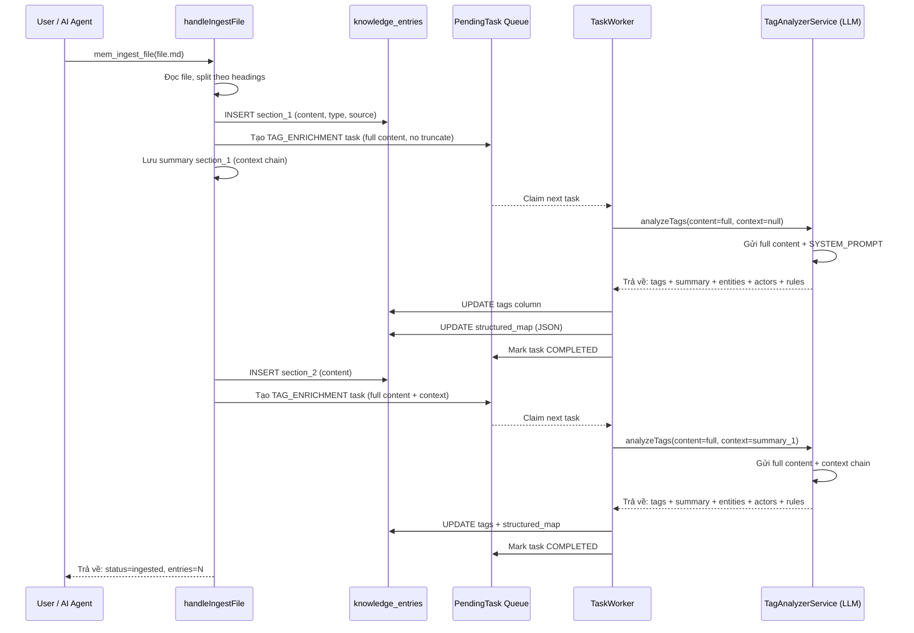
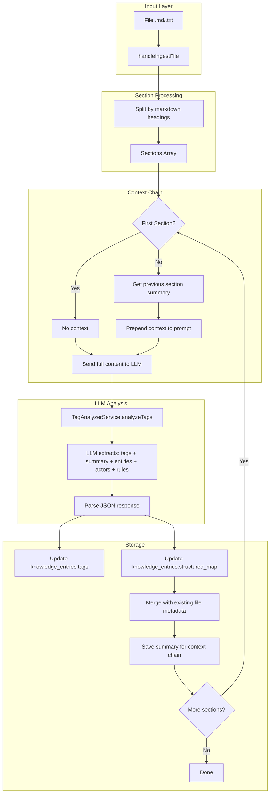

# Business Requirements Document (BRD)

## KB Evolution Memory — SA4E-47: Cải tiến Document Indexing với LLM Context Chain

---

## Document Information

| Field | Value |
|-------|-------|
| Jira Ticket | SA4E-47 |
| Title | Cải tiến Document Indexing với LLM Context Chain |
| Author | BA Agent |
| Version | 1.0 |
| Date | 2026-07-18 |
| Status | Draft |

---

## Author Tracking

| Role | Name - Position | Responsibility |
|------|-----------------|----------------|
| Author | BA Agent – Business Analyst | Create document |
| Peer Reviewer | TA Agent – Technical Architect | Review technical feasibility |

---

## Revision History

| Version | Date | Author | Changes |
|---------|------|--------|---------|
| 1.0 | 2026-07-18 | BA Agent | Initiate document — auto-generated from Jira ticket SA4E-47 and codebase analysis |

---

## Sign-Off

| Name | Signature and date |
|------|--------------------|
| | ☐ I agree and confirm all criteria on this BRD as expected requirements |
| | ☐ I agree and confirm all criteria on this BRD as expected requirements |

---

## 1. Introduction

### 1.1 Scope

Cải tiến pipeline **Document Indexing** trong Knowledge Base Memory module (`backend/src/modules/memory/`) để giải quyết các vấn đề về mất ngữ cảnh (context loss) và trích xuất thông tin hạn chế khi xử lý file documents.

Phạm vi bao gồm:
- Loại bỏ giới hạn 2000 ký tự khi gửi section content lên LLM để phân tích
- Xây dựng **Context Chain**: truyền summary của section trước vào prompt của section sau
- Mở rộng **LLM Prompt** để extract thêm: `summary`, `business_entities`, `actors`, `business_rules` bên cạnh `tags`
- Lưu kết quả mở rộng vào cột `structured_map` (JSON) của bảng `knowledge_entries`
- Cập nhật **TaskWorker** để xử lý TAG_ENRICHMENT tasks với nội dung đầy đủ
- Cập nhật **TagAnalyzerService** để hỗ trợ extraction mở rộng và context chain

### 1.2 Out of Scope

- Thay đổi kiến trúc tổng thể backend (Hono routing, MCP tools, DatabaseAdapter)
- Migration sang database khác (vẫn dùng better-sqlite3)
- Thay đổi FTS5 indexing strategy hoặc vector search
- UI/Admin Portal cho structured_map visualization (sẽ là ticket riêng)
- Cải tiến file metadata scanning (`loadFileMetadata`) — giữ nguyên cơ chế hiện tại
- Tính năng search trên structured_map (sẽ là ticket riêng)

### 1.3 Preliminary Requirement

- Bảng `knowledge_entries` đã có cột `structured_map TEXT NOT NULL DEFAULT '{}'` — sẵn sàng lưu JSON mở rộng
- `pending_tasks` table và `TaskWorker` đã hoạt động (SA4E-44) — worker pool sẵn sàng cho TAG_ENRICHMENT tasks
- `TagAnalyzerService` và `LLMService` đã có sẵn — cần mở rộng prompt và output format
- LLM backend (LM Studio, qwen3-8b) đã kết nối qua port 1234
- Database WAL mode đã active — background jobs không block reads

---

## 2. Business Requirements

### 2.1 High Level Process Map

Quy trình xử lý file hiện tại có 4 vấn đề chính được mô tả trong sơ đồ Use Case và Business Flow bên dưới.


*[Edit in draw.io](diagrams/use-case.drawio)*

**Current Flow (As-Is):**

1. Người dùng gửi file markdown/text qua `mem_ingest_file`
2. File được split theo markdown headings (`^#{1,3}`) thành các sections riêng
3. Mỗi section → một `knowledge_entries` riêng biệt
4. Mỗi section → một `PendingTask (TAG_ENRICHMENT)` với content bị truncate còn 2000 ký tự
5. `TaskWorker` gọi `TagAnalyzerService.analyzeTags()` → LLM chỉ nhận 2000 ký tự đầu
6. LLM chỉ extract tags — không có summary, business entities, actors, business rules
7. Kết quả chỉ lưu vào cột `tags` — cột `structured_map` chỉ chứa file metadata cơ bản
8. **Không có context chain**: mỗi section bị xử lý độc lập, không biết section trước

**Proposed Flow (To-Be):**


*[Edit in draw.io](diagrams/business-flow.drawio)*

1. File được split theo markdown headings như hiện tại
2. **Xử lý theo thứ tự**: section 1 → section 2 → ... → section N
3. Cho section đầu tiên: gửi **full content** (không truncate) lên LLM
4. LLM trả về: tags + summary + business_entities + actors + business_rules
5. Lưu kết quả vào `structured_map` dưới dạng JSON
6. **Context chain**: summary của section N-1 được inject vào prompt của section N
7. Section N nhận được context: "Section trước có summary: {summary_N-1}"
8. Kết quả của tất cả sections được lưu đầy đủ trong `structured_map`

### 2.2 List of User Stories / Use Cases

| # | Story / Use Case | Priority | Source Ticket |
|---|-----------------|----------|---------------|
| 1 | As a Developer, I want full section content sent to LLM (không truncate) so that business rules and entities ở cuối section không bị mất | MUST HAVE (P0) | SA4E-47 |
| 2 | As a Developer, I want context chain giữa các sections so that LLM hiểu được document structure và mối quan hệ giữa các sections | MUST HAVE (P0) | SA4E-47 |
| 3 | As a Developer, I want LLM to extract summary, business_entities, actors, business_rules ngoài tags so that KB entries giàu thông tin hơn | MUST HAVE (P0) | SA4E-47 |
| 4 | As a Developer, I want extracted data stored in structured_map column (JSON) so that search và analysis tools có thể truy xuất structured data | MUST HAVE (P0) | SA4E-47 |
| 5 | As a System, I want backward compatibility cho entries không có structured_map so that existing data không bị ảnh hưởng | SHOULD HAVE (P1) | SA4E-47 |
| 6 | As a Developer, I want context chain có thể bật/tắt (configurable) so that có thể fallback nếu LLM context window bị giới hạn | COULD HAVE (P2) | SA4E-47 |

---

### 2.3 Details of User Stories

---

#### Business Flow

**Bước 1:** User/AI Agent gọi `mem_ingest_file(file_path="/path/to/doc.md")`

**Bước 2:** `handleIngestFile` đọc file, split theo markdown headings (`^#{1,3}`) thành mảng sections

**Bước 3:** Với mỗi section:
- **3a:** Nếu là section đầu tiên trong file → gửi full content lên LLM (không truncate)
- **3b:** Nếu là section N (N>1) → gửi full content + context chain từ section N-1

**Bước 4:** LLM phân tích và trả về JSON với cấu trúc:
```json
{
  "tags": ["tag1", "tag2", "tag3"],
  "summary": "Tóm tắt nội dung section",
  "business_entities": ["EntityA", "EntityB"],
  "actors": ["Actor1", "Actor2"],
  "business_rules": ["Rule1", "Rule2"]
}
```

**Bước 5:** Lưu kết quả vào `knowledge_entries.structured_map` dưới dạng JSON string

**Bước 6:** Lưu summary của section hiện tại để dùng làm context cho section tiếp theo

**Bước 7:** Lặp lại bước 3-6 cho đến khi hết sections

> **Note:** Thứ tự xử lý sections là thứ tự xuất hiện trong file. Context chain chỉ forward (section trước → section sau), không backward.

**Sequence Diagram — Document Indexing with Context Chain:**



---

#### STORY 1: Full Content LLM Analysis (Remove 2000-char Truncation)

> As a Developer, I want full section content sent to LLM (không truncate) so that business rules and entities ở cuối section không bị mất.

**Requirement Details:**

1. Loại bỏ `content.slice(0, 2000)` trong `handleIngest` (crud.ts line 63) khi tạo TAG_ENRICHMENT task payload
2. Loại bỏ `sec.trim().slice(0, 2000)` trong `handleIngestFile` (crud.ts line 197)
3. Loại bỏ `content.slice(0, 2000)` trong `TagAnalyzerService.analyzeWithLLM` (analyzer.ts line 69)
4. LLM nhận toàn bộ nội dung của section — không giới hạn độ dài
5. Xem xét giới hạn context window của LLM backend (hiện tại qwen3-8b): nếu section quá dài (>LLM context window), cần có cơ chế chunking với overlap

**Affected Files:**

| File | Line(s) | Change |
|------|---------|--------|
| `backend/src/modules/memory/dispatchers/crud.ts` | 63 | Remove `content.slice(0, 2000)` |
| `backend/src/modules/memory/dispatchers/crud.ts` | 197 | Remove `sec.trim().slice(0, 2000)` |
| `backend/src/modules/memory/llm/analyzer.ts` | 69 | Remove `content.slice(0, 2000)` |

**Data Fields:**

| Field | Type | Required | Description | Example |
|-------|------|----------|-------------|---------|
| content | TEXT | Yes | Full section content (no truncation) | "Bước 1: Xác thực người dùng... (5000 ký tự)" |
| context_window | INTEGER | No | LLM context window limit (configurable) | 8192 |

**Acceptance Criteria:**

1. GIVEN section content dài 5000 ký tự WHEN gửi lên LLM THEN LLM nhận đủ 5000 ký tự — không truncate
2. GIVEN section content dài 500 ký tự WHEN gửi lên LLM THEN behavior giống hệt hiện tại (không degradation)
3. GIVEN section content > LLM context window (ví dụ 12000 tokens) WHEN gửi lên LLM THEN hệ thống tự động chunk với overlap 200 ký tự
4. Performance: LLM analysis latency tăng không quá 2x so với baseline cho section 5000 ký tự

**Validation Rules:**

- Content MUST không NULL và có độ dài > 10 ký tự (giữ nguyên validation hiện tại)
- Nếu content > LLM context window limit → chunk tự động với overlap
- Chunking overlap = 200 chars (configurable)

**Error Handling:**

- LLM timeout (30s) → fallback về keyword extraction như hiện tại
- Content > context window nhưng chunking disabled → log warning, gửi với content bị truncate đến window limit

---

#### STORY 2: Context Chain Between Sections

> As a Developer, I want context chain giữa các sections so that LLM hiểu được document structure và mối quan hệ giữa các sections.

**Requirement Details:**

1. Khi xử lý section N (N > 1) trong `handleIngestFile`, inject summary của section N-1 vào LLM prompt
2. Context chain format: `[Previous section summary: {summary_N-1}]\n\n{current_section_content}`
3. Nếu section N-1 không có summary (error/fallback) → context chain empty, vẫn gửi content bình thường
4. Context chain chỉ forward (previous → current), không backward
5. Context chain có thể bật/tắt qua config flag `enableContextChain` (default: true)
6. Nếu context chain disabled → behavior giống hiện tại (mỗi section độc lập)

**Affected Files:**

| File | Line(s) | Change |
|------|---------|--------|
| `backend/src/modules/memory/dispatchers/crud.ts` | 183-203 | Add context chain loop (sequential processing) |
| `backend/src/modules/memory/llm/analyzer.ts` | 65-83 | Add context parameter to analyzeWithLLM |
| `backend/src/modules/memory/llm/prompts.ts` | 56-71 | Add context chain section to SYSTEM_PROMPT |

**Data Fields:**

| Field | Type | Required | Description | Example |
|-------|------|----------|-------------|---------|
| context_summary | TEXT | No | Summary of previous section | "Section mô tả quy trình đăng nhập" |
| context_business_entities | JSON | No | Business entities from previous section | ["User", "Account"] |
| enableContextChain | BOOLEAN | No | Toggle context chain (default true) | true |

**Acceptance Criteria:**

1. GIVEN file có 3 sections WHEN xử lý section 2 THEN prompt chứa summary của section 1
2. GIVEN context chain enabled WHEN xử lý section 1 THEN prompt KHÔNG có context (là section đầu)
3. GIVEN context chain disabled WHEN xử lý sections THEN mỗi section xử lý độc lập (behavior hiện tại)
4. GIVEN section N-1 bị lỗi (LLM timeout) WHEN xử lý section N THEN context chain empty, không fail
5. Context chain overhead: thời gian xử lý file tăng không quá 10% so với baseline

**Validation Rules:**

- Context chain chỉ áp dụng trong cùng một file (không chain giữa các file khác nhau)
- Context chain không vượt quá 500 ký tự (nếu summary dài → truncate context chain)
- Nếu context chain empty → prompt format giống hiện tại

**Error Handling:**

- Nếu section N-1 chưa được xử lý xong (race condition) → context chain empty, retry sau
- Nếu context chain quá dài → truncate context_summary xuống còn 500 ký tự

---

#### STORY 3: Expanded LLM Extraction

> As a Developer, I want LLM to extract summary, business_entities, actors, business_rules ngoài tags so that KB entries giàu thông tin hơn.

**Requirement Details:**

1. Mở rộng `TagSuggestion` interface để bao gồm:
   - `summary: string` — Tóm tắt nội dung section (1-3 câu)
   - `business_entities: string[]` — Các thực thể business được đề cập
   - `actors: string[]` — Các tác nhân/role tham gia
   - `business_rules: string[]` — Các business rules/ràng buộc
2. Cập nhật `TagAnalysisResult` interface để chứa các trường mới
3. Cập nhật `SYSTEM_PROMPT` trong `prompts.ts` để yêu cầu LLM trả về format mới
4. LLM response format mới:
```json
{
  "tags": [{"tag":"...","category":"...","confidence":0.9,"reason":"..."}],
  "summary": "This section describes the authentication flow...",
  "business_entities": ["User", "Account", "Session"],
  "actors": ["End User", "System Admin"],
  "business_rules": ["Password must be 8+ characters", "Session expires after 24h"]
}
```
5. Fallback: nếu LLM không trả về format mới → extract tối đa từ response có sẵn
6. Quantity limits: max 5 entities, max 5 actors, max 10 business rules per section

**Affected Files:**

| File | Line(s) | Change |
|------|---------|--------|
| `backend/src/modules/memory/llm/analyzer.ts` | 11-22 | Update TagSuggestion, TagAnalysisResult interfaces |
| `backend/src/modules/memory/llm/analyzer.ts` | 85-118 | Update parseResponse for new format |
| `backend/src/modules/memory/llm/prompts.ts` | 56-71 | Update SYSTEM_PROMPT with new extraction requirements |
| `backend/src/modules/memory/task-queue/TaskWorker.ts` | 181-199 | Update processTagEnrichment to handle structured_map |

**Data Fields (TagAnalysisResult mới):**

| Field | Type | Required | Description | Example |
|-------|------|----------|-------------|---------|
| tags | TagSuggestion[] | Yes | Extracted tags (existing) | [...] |
| summary | string | No | LLM-generated summary | "Section describes..." |
| business_entities | string[] | No | Business entities found | ["User", "Invoice"] |
| actors | string[] | No | Actors/found | ["Admin", "Customer"] |
| business_rules | string[] | No | Business rules extracted | ["Rule: ..."] |
| fallbackUsed | boolean | Yes | Whether fallback was used | false |

**Acceptance Criteria:**

1. GIVEN content về "authentication flow" WHEN LLM phân tích THEN `business_entities` chứa "User", "Session"; `actors` chứa "End User"
2. GIVEN content có business rules "Password must be 8+ characters" WHEN LLM phân tích THEN `business_rules` chứa rule đó
3. GIVEN content ngắn (< 50 ký tự) THEN LLM trả về empty arrays (không force extraction vô nghĩa)
4. GIVEN LLM trả về format không đúng (missing fields) THEN hệ thống tự động fill empty arrays, không crash
5. GIVEN LLM timeout/error THEN fallback về keyword extraction như hiện tại (chỉ tags)
6. Giới hạn: `business_entities` tối đa 5, `actors` tối đa 5, `business_rules` tối đa 10

**Validation Rules:**

- `summary` tối đa 500 ký tự
- Mỗi `business_entity` tối đa 100 ký tự, phải là noun phrase
- Mỗi `actor` tối đa 100 ký tự
- Mỗi `business_rule` tối đa 300 ký tự
- Nếu LLM trả về > max allowed → truncate (lấy N items đầu)
- Nếu field missing → default empty array

**Error Handling:**

- LLM response không parse được JSON → fallback regex extraction + `fallbackUsed = true`
- LLM trả về tags hợp lệ nhưng các field mới sai format → lấy tags, bỏ qua field lỗi, log warning
- `fallbackUsed = true` → `business_entities = []`, `actors = []`, `business_rules = []`, `summary = ""`

---

#### STORY 4: Store Extracted Data in structured_map

> As a Developer, I want extracted data stored in structured_map column (JSON) so that search và analysis tools có thể truy xuất structured data.

**Requirement Details:**

1. Lưu toàn bộ kết quả extraction từ LLM vào cột `knowledge_entries.structured_map`
2. structured_map là JSON string với format:
```json
{
  "tags": ["tag1", "tag2"],
  "summary": "Section summary...",
  "business_entities": ["EntityA"],
  "actors": ["Actor1"],
  "business_rules": ["Rule 1"],
  "context_chain": {
    "previous_section_id": 42,
    "previous_summary": "Summary of prev section"
  },
  "extraction_meta": {
    "model": "qwen3-8b",
    "timestamp": "2026-07-18T10:00:00Z",
    "fallback_used": false,
    "context_chain_enabled": true
  }
}
```
3. Trong `processTagEnrichment` của TaskWorker, sau khi nhận kết quả từ LLM:
   - Update `tags` column như hiện tại
   - **THÊM**: Update `structured_map` với đầy đủ dữ liệu mới
4. Update `handleIngestFile` để lưu context chain reference vào `structured_map`
5. Backward compatible: entries cũ có `structured_map = '{}'` vẫn hoạt động bình thường
6. Các field cũ trong `structured_map` (`fileCreatedAt`, `fileAuthor`, `fileVersion`) phải được merge vào thay vì ghi đè

**Affected Files:**

| File | Line(s) | Change |
|------|---------|--------|
| `backend/src/modules/memory/task-queue/TaskWorker.ts` | 181-199 | Add structured_map update in processTagEnrichment |
| `backend/src/modules/memory/dispatchers/crud.ts` | 193-195 | Merge context chain + LLM data into structured_map |
| `backend/src/modules/memory/dispatchers/crud.ts` | 188 | Expand structuredMap to include document-level context |

**Data Fields (structured_map schema):**

| Field | Type | Required | Description | Example |
|-------|------|----------|-------------|---------|
| tags | string[] | No | Applied tags | ["auth", "login"] |
| summary | string | No | LLM summary of section | "..." |
| business_entities | string[] | No | Extracted entities | ["User"] |
| actors | string[] | No | Related actors | ["Admin"] |
| business_rules | string[] | No | Business rules | ["Rule:..."] |
| context_chain | object | No | Previous section reference | {"previous_section_id": 42} |
| extraction_meta | object | No | Metadata about extraction | {"model":"qwen3-8b"} |
| fileCreatedAt | string | No | File metadata (existing) | "2026-07-18" |
| fileAuthor | string | No | File author (existing) | "developer" |

**Acceptance Criteria:**

1. GIVEN LLM trả về tags + summary + entities WHEN processTagEnrichment chạy THEN structured_map chứa đầy đủ dữ liệu
2. GIVEN structured_map cũ có `fileCreatedAt` WHEN update với data mới THEN `fileCreatedAt` vẫn được giữ
3. GIVEN entry có `structured_map = '{}'` (cũ) THEN vẫn search được bình thường (backward compatible)
4. GIVEN context chain enabled WHEN section N xử lý xong THEN structured_map chứa `context_chain.previous_section_id`
5. structured_map JSON phải valid (validate khi write)
6. structured_map size không vượt quá 100KB per entry (overflow → truncate business_rules)

**Validation Rules:**

- structured_map MUST be valid JSON (JSON.parse không throw)
- Nếu structured_map > 100KB → truncate các array fields (business_rules trước, actors sau)
- Merge strategy: LLM fields (summary, entities...) overwrite, file metadata fields (fileCreatedAt...) giữ nguyên

**Error Handling:**

- Nếu structured_map update fail (DB error) → log warning, tags vẫn được update
- Nếu structured_map JSON quá lớn → truncate business_rules array, log warning

---

#### STORY 5: Backward Compatibility

> As a System, I want backward compatibility cho entries không có structured_map so that existing data không bị ảnh hưởng.

**Requirement Details:**

1. Tất cả entries cũ có `structured_map = '{}'` hoặc `structured_map = NULL` vẫn hoạt động bình thường
2. Search, read, update operations không bị ảnh hưởng bởi format structured_map mới
3. Code đọc `structured_map` MUST handle trường hợp missing fields (dùng default values)
4. Migration không required — structured_map đã tồn tại trong schema

**Acceptance Criteria:**

1. GIVEN entry cũ có structured_map = '{}' WHEN search THEN entry xuất hiện bình thường
2. GIVEN entry mới có structured_map đầy đủ WHEN search THEN entry xuất hiện bình thường
3. GIVEN code đọc structured_map với field không tồn tại THEN trả về default (empty array/empty string)
4. Zero migration needed cho feature này

---

## 3. Dependencies

| Dependency | Type | Related Ticket | Description |
|------------|------|----------------|-------------|
| LLM Service (LM Studio) | External | N/A | qwen3-8b qua port 1234 — cần support context window đủ lớn (>4K tokens) |
| Pending Task Queue | System | SA4E-44 | TaskWorker + PendingTaskRepository — xử lý TAG_ENRICHMENT tasks |
| TagAnalyzerService | System | N/A | Service hiện tại cần mở rộng prompt và output format |
| MemoryEngine CRUD | System | N/A | Engine insert/update operations cho knowledge_entries |
| structured_map column | System | N/A | Đã tồn tại trong schema — cần mở rộng usage |
| File Scanner (loadFileMetadata) | System | N/A | Cung cấp file metadata cho structured_map merge |

---

## 4. Stakeholders

| Role | Name / Team | Responsibility | Source |
|------|-------------|----------------|--------|
| AI Agents (BA, SA, DEV, QA, DevOps) | Agent Team | Primary consumers — ingest files vào KB, search structured data | System consumers |
| Developer Team | Maintainers | Implement và maintain document indexing pipeline | Implementors |
| Technical Architect | TA Agent | Review technical feasibility, đảm bảo không ảnh hưởng existing features | Reviewer |
| End Users | Developers using KB | Receive improved KB quality với structured data | Indirect stakeholders |

---

## 5. Risks and Assumptions

### 5.1 Risks

| Risk | Impact | Likelihood | Mitigation |
|------|--------|------------|------------|
| LLM context window không đủ cho section dài (>8K tokens) | High | Medium | Implement chunking với overlap, configurable chunk size |
| Context chain làm tăng latency do sequential processing | Medium | High | Async processing cho mỗi section, context chain chỉ thêm ~100ms/section |
| LLM output format thay đổi (model upgrade) | Medium | Low | Robust JSON parser với fallback, validation trước khi lưu |
| structured_map column size growth | Low | Medium | Giới hạn 100KB/entry, truncation strategy |
| LLM hallucination trên summary/entities extraction | Medium | Medium | confidence threshold cho mỗi extracted field, human review flag |
| Breaking change cho agents đọc structured_map format cũ | Low | Low | Merge strategy thay vì overwrite, backward compatible format |

### 5.2 Assumptions

- LLM backend (qwen3-8b) có context window đủ lớn (>4K tokens) để xử lý section content đầy đủ
- `structured_map` column đã tồn tại trong DB schema — không cần migration
- Các agents đọc `structured_map` dùng `JSON.parse()` — format mới backward compatible với `'{}'`
- File documents thường có 3-20 sections (không quá lớn)
- Summary của section thường < 500 ký tự — context chain overhead nhỏ
- TaskWorker đã support processing TAG_ENRICHMENT tasks — chỉ cần cập nhật logic
- Thứ tự sections trong file là thứ tự logical — context chain forward là đủ

---

## 6. Non-Functional Requirements

| Category | Requirement | Details |
|----------|-------------|---------|
| Performance | Context chain overhead < 100ms per section | Chỉ thêm một string prepend vào prompt, không tính toán phức tạp |
| Performance | LLM analysis latency không tăng quá 2x cho section 5000 ký tự | So với baseline 2000 ký tự hiện tại |
| Performance | LLM timeout giữ nguyên 30s | Fallback về keyword extraction nếu timeout |
| Scalability | Hỗ trợ section content lên đến LLM context window limit | Chunking + overlap cho content quá dài |
| Scalability | structured_map tối đa 100KB per entry | Truncation strategy cho array fields |
| Reliability | Graceful degradation nếu LLM fail | Fallback về keyword extraction, `fallbackUsed = true` |
| Reliability | structured_map update fail không ảnh hưởng tags update | Atomic update per column |
| Configurability | Context chain có thể bật/tắt qua config | `enableContextChain` flag |
| Configurability | Chunk size và overlap size configurable | `llmChunkSize`, `llmChunkOverlap` |
| Backward Compatibility | Entries cũ với structured_map = '{}' vẫn hoạt động | Default values cho missing fields |
| Observability | Log structured_map update cho mỗi entry | Debug structured_map content khi cần |
| Data Integrity | structured_map phải là valid JSON | Validate trước khi write |

---

## 7. Related Tickets

| Ticket Key | Summary | Status | Type | Relationship |
|------------|---------|--------|------|--------------|
| SA4E-47 | Cải tiến Document Indexing với LLM Context Chain | To Do | Story | Main ticket |
| SA4E-44 | Persistent Task Queue for Background Processing | In Progress | Story | Prerequisite (task queue infrastructure) |
| SA4E-36 | Temporal Versioning & Outcome Tracking | Done | Story | Related (cùng module memory, cùng dùng structured_map) |
| SA4E-31 | KB Scope Isolation | Done | Story | Related (scope isolation cho KB entries) |
| SA4E-18 | Tool Usage Tracking | Done | Story | Related (usage tracking trong memory module) |
| SA4E-45 | Deprecate MemoryEngineCrud.getDb() | Done | Story | Related (cùng module, xóa getDb tham chiếu trong SA4E-47) |

---

## 8. Appendix

### Affected Modules Overview

Module `backend/src/modules/memory/` — các files bị ảnh hưởng:

| Module | File | Role in Feature |
|--------|------|-----------------|
| Dispatchers | `dispatchers/crud.ts` | handleIngestFile, handleIngest — tạo tasks với full content |
| LLM Analysis | `llm/analyzer.ts` | TagAnalyzerService — mở rộng extraction + context chain |
| LLM Prompts | `llm/prompts.ts` | SYSTEM_PROMPT — format mới cho LLM output |
| Task Queue | `task-queue/TaskWorker.ts` | processTagEnrichment — update structured_map |
| Task Queue | `task-queue/models.ts` | TaskType — giữ nguyên (TAG_ENRICHMENT đã đủ) |
| Engine | `engine/core.ts` | MemoryEngine — không đổi (chỉ dùng structured_map qua dispatcher) |
| Engine | `engine/crud.ts` | MemoryEngineCrud — insert có thể mở rộng để nhận structured_map |
| Models | `models.ts` | KnowledgeEntry — structured_map field đã có |

### Data Flow Diagram



### Priority Matrix

| Priority | Features | Effort Estimate | Business Value |
|----------|----------|-----------------|----------------|
| P0 (CRITICAL) | Full content LLM + Expanded extraction | 3-4 days | Business rules/entities không bị mất, KB entries giàu metadata |
| P0 (CRITICAL) | structured_map storage | 1-2 days | Search và analysis tools có structured data để xử lý |
| P1 (HIGH) | Context chain giữa sections | 2-3 days | LLM hiểu document structure, extraction chính xác hơn |
| P1 (HIGH) | Backward compatibility | 0.5 day | Zero migration, existing data không bị ảnh hưởng |
| P2 (MEDIUM) | Context chain config flag | 0.5 day | Fallback option nếu context window limited |

### Implementation Sequence

**Phase 1 (P0) — Core Extraction Improvement:**
1. Remove 2000-char truncation in crud.ts (line 63, 197) and analyzer.ts (line 69)
2. Update TagSuggestion/TagAnalysisResult interfaces with new fields
3. Update SYSTEM_PROMPT for expanded extraction
4. Update parseResponse to handle new JSON format

**Phase 2 (P0) — structured_map Storage:**
1. Update processTagEnrichment in TaskWorker.ts to write structured_map
2. Merge strategy: LLM data + existing file metadata
3. Validation and truncation logic for structured_map

**Phase 3 (P1) — Context Chain:**
1. Refactor section processing loop in handleIngestFile from parallel to sequential
2. Track current section summary for next section's context
3. Add context parameter to TagAnalyzerService.analyzeTags()
4. Update SYSTEM_PROMPT to include context chain instructions

**Phase 4 (P1/P2) — Polish:**
1. Add config flags (enableContextChain, chunkSize, etc.)
2. Backward compatibility testing
3. Error handling and fallback refinement

### Technical Notes

**Current Truncation Points (cần loại bỏ):**
```
1. crud.ts:63    — content.slice(0, 2000)  [handleIngest - task payload]
2. crud.ts:197   — sec.trim().slice(0, 2000)  [handleIngestFile - task payload]
3. analyzer.ts:69 — content.slice(0, 2000)  [analyzeWithLLM - LLM input]
```

**Context Chain Implementation Approach:**
```typescript
// Pseudocode for handleIngestFile context chain
let previousSummary: string | null = null;

for (const section of sections) {
  const context = previousSummary 
    ? `[Previous section context: ${previousSummary}]\n\n${section}` 
    : section;
  
  const result = await tagAnalyzer.analyzeTags(context);
  
  // Save to structured_map
  const structuredMap = {
    ...result,
    context_chain: previousSummary 
      ? { previous_section_id: prevId, previous_summary: previousSummary }
      : null
  };
  
  // Update DB
  updateEntry(id, { tags: result.appliedTags, structured_map: JSON.stringify(structuredMap) });
  
  // Store for next iteration
  previousSummary = result.summary;
  prevId = id;
}
```

**LLM Prompt Enhancement:**
```
Current prompt: "You tag knowledge entries with SPECIFIC feature names..."
Enhanced prompt: "You analyze knowledge entries. Extract: 
1. tags (specific feature names)
2. summary (1-3 sentence summary)  
3. business_entities (nouns/entities mentioned)
4. actors (roles/people involved)
5. business_rules (constraints, conditions, rules)

Output ONLY JSON: {"tags":[...],"summary":"...","business_entities":[],"actors":[],"business_rules":[]}"
```

### Glossary

| Term | Definition |
|------|------------|
| Context Chain | Kỹ thuật truyền thông tin từ section trước vào prompt của section sau để duy trì ngữ cảnh document |
| structured_map | Cột JSON trong bảng knowledge_entries lưu structured data (tags, entities, rules...) |
| TagAnalyzerService | Service dùng LLM để tự động extract tags và metadata từ KB entry content |
| TaskWorker | Background worker xử lý pending tasks (TAG_ENRICHMENT, VECTOR_EMBEDDING) |
| Chunking | Chia nhỏ content quá dài thành các phần (chunks) với overlap để xử lý |
| Business Entities | Các thực thể business được đề cập trong document (User, Invoice, Order...) |
| Business Rules | Các quy tắc/ràng buộc business được mô tả trong document |
| Actors | Các tác nhân/role tham gia vào business flow (Admin, Customer, System...) |
| Pending Task Queue | Hàng đợi tasks persistent, cho phép xử lý background không blocking |
| Context Window | Giới hạn số tokens mà LLM có thể xử lý trong một request |

### Reference Documents

| Document | Link / Location |
|----------|-----------------|
| BRD Template | documents/templates/BRD-TEMPLATE.md |
| FSD Template | documents/templates/FSD-TEMPLATE.md |
| Current handleIngestFile | backend/src/modules/memory/dispatchers/crud.ts |
| TagAnalyzerService | backend/src/modules/memory/llm/analyzer.ts |
| LLM Prompts | backend/src/modules/memory/llm/prompts.ts |
| TaskWorker | backend/src/modules/memory/task-queue/TaskWorker.ts |
| KnowledgeEntry Model | backend/src/modules/memory/models.ts |
| SA4E-44 Task Queue | backend/src/modules/memory/task-queue/ |
| SA4E-36 Temporal Versioning | documents/SA4E-36/BRD.md |

### Diagram Index

| # | Diagram | Image | Source (editable) |
|---|---------|-------|-------------------|
| 1 | Use Case | [use-case.png](diagrams/use-case.png) | [use-case.drawio](diagrams/use-case.drawio) |
| 2 | Business Flow | [business-flow.png](diagrams/business-flow.png) | [business-flow.drawio](diagrams/business-flow.drawio) |
