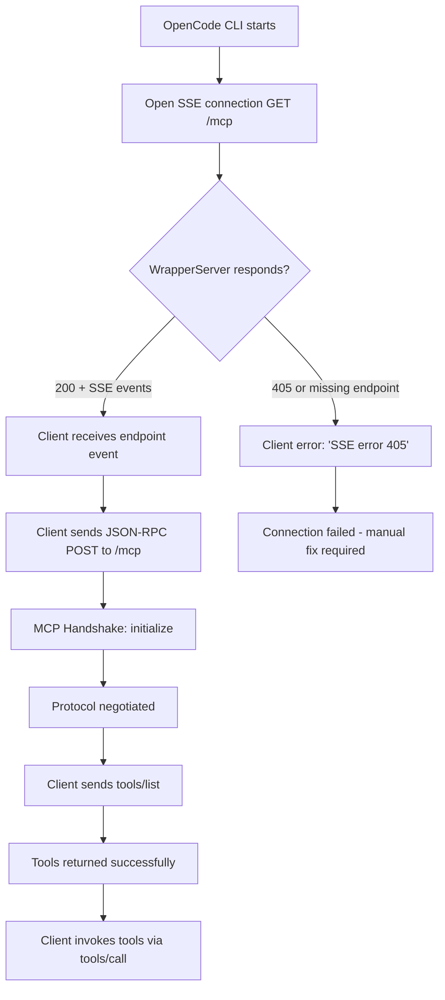
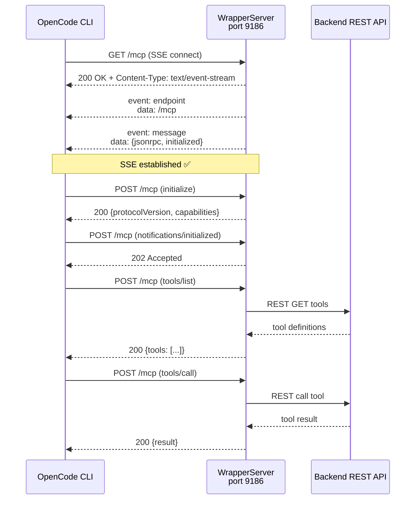

# Business Requirements Document (BRD)

## SDLC Agents 4 Enterprise — SA4E-48: OpenCode v1.17.15 SSE error 405 — WrapperServer missing endpoint event

---

## Document Information

| Field | Value |
|-------|-------|
| Jira Ticket | SA4E-48 |
| Title | OpenCode v1.17.15 SSE error 405 — WrapperServer missing endpoint event |
| Author | BA Agent |
| Version | 1.0 |
| Date | 2026-07-20 |
| Status | Draft |

---

## Author Tracking

| Role | Name - Position | Responsibility |
|------|-----------------|----------------|
| Author | BA Agent – Business Analyst | Create document |
| Peer Reviewer | TBD – Technical Lead | Review document |

---

## Revision History

| Version | Date | Author | Changes |
|---------|------|--------|---------|
| 1.0 | 2026-07-20 | BA Agent | Initiate document — auto-generated from Jira ticket SA4E-48 |

---

## Sign-Off

| Name | Signature and date |
|------|--------------------|
| | ☐ I agree and confirm all criteria on this BRD as expected requirements |
| | ☐ I agree and confirm all criteria on this BRD as expected requirements |

---

## 1. Introduction

### 1.1 Scope

This BRD covers the bug fix for the **WrapperServer** component of the **SDLC Agents 4 Enterprise** system. The issue is that OpenCode CLI v1.17.15 (a remote MCP client) fails to connect to the WrapperServer running on port 9186, reporting:

> `"code-intel SSE error: Non-200 status code (405)"`

The root cause is two-fold:
1. **Stale compiled output:** The running extension (`Code.exe` on port 9186) was using old compiled code where `handleMcp()` returned HTTP 405 for all non-POST requests. The source code already had a `handleMcpGet()` method, but the compiled `out/services/WrapperServer.js` was outdated.
2. **Missing SSE `endpoint` event:** The source's `handleMcpGet()` implementation sent an `event: message` with an `initialized` notification, but did **not** send the mandatory `event: endpoint` with `data: /mcp` as required by the MCP Streamable HTTP transport specification. The SSE client (`SSEClientTransport` in the MCP SDK) waits for the `endpoint` event to know where to send JSON-RPC POST requests.

The fix requires:
- Adding `event: endpoint` + `data: /mcp` to the SSE response in `WrapperServer.handleMcpGet()`
- Recompiling the extension
- Updating/adding regression tests to prevent silent regressions
- Building a new VSIX and tagging the release

### 1.2 Out of Scope

- Changes to the MCP JSON-RPC POST handler (`handleMcp` for POST requests) — this was already working correctly
- Changes to the backend REST API that WrapperServer proxies to
- Changes to the health endpoint (`/health`)
- Changes to CORS or authentication mechanisms
- Any functional enhancements beyond the SSE connection fix
- Other MCP transport modes (e.g., stdio)

### 1.3 Preliminary Requirement

- Access to the source code repository at `extension/src/services/WrapperServer.ts`
- Node.js/npm build environment for recompilation
- VS Code Extension Manager for VSIX packaging and installation
- MCP-compatible client (OpenCode CLI v1.17.15 or later) for verification
- Existing unit test suite must pass (minimum 545 tests)

---

## 2. Business Requirements

### 2.1 High Level Process Map

> **Diagrams (draw.io):**
> 
> *[Edit in draw.io](diagrams/use-case.drawio)*
>
> 
> *[Edit in draw.io](diagrams/business-flow.drawio)*

The business process for the MCP connection between OpenCode CLI and the SDLC Agents 4 Enterprise extension follows this flow:

**Step 1:** OpenCode CLI (MCP client) starts and reads the MCP server configuration pointing to `http://localhost:9186/mcp`

**Step 2:** OpenCode CLI opens an SSE connection via `GET /mcp` to establish a server-sent events channel for receiving unsolicited server messages

**Step 3:** The WrapperServer must respond with:
- HTTP 200 and `Content-Type: text/event-stream`
- An `event: endpoint` with `data: /mcp` to tell the client where to send POST requests
- An `event: message` with `data: {"jsonrpc":"2.0","method":"initialized"}` to signal the server is ready

**Step 4:** OpenCode CLI reads the `endpoint` event and starts sending JSON-RPC POST requests to the specified endpoint

**Step 5:** The WrapperServer processes the MCP handshake (`initialize` method), negotiates protocol version, and responds with server capabilities

**Step 6:** After initialization, the client sends `tools/list` and `tools/call` requests to invoke available tools

**Step 7:** If any step in the SSE handshake fails, the OpenCode CLI reports an error and the connection cannot be established

> **Note:** The missing `event: endpoint` caused the SSE client to never receive the POST URL, resulting in the 405 error when the client sent POST requests to the wrong path or kept waiting forever.



### 2.2 List of User Stories / Use Cases

| # | Story / Use Case / Epic | Priority | Source Ticket |
|---|-------------------------|----------|---------------|
| 1 | As an OpenCode CLI user, I want the MCP connection to WrapperServer to succeed without errors so that I can use SDLC Agents tools. | MUST HAVE | SA4E-48 |
| 2 | As a developer, I want regression tests that guard against MCP handshake failures so that future changes do not silently break the connection. | MUST HAVE | SA4E-48 |
| 3 | As a maintainer, I want the compiled extension output to be in sync with source code so that deployed code always matches the latest fix. | SHOULD HAVE | SA4E-48 |

---

### 2.3 Details of User Stories

---

#### Business Flow



> **Note:** The SSE handshake must include `event: endpoint` BEFORE `event: message`. The MCP SDK's `SSEClientTransport` blocks on reading the endpoint event to determine the POST URL. Without it, the client never knows where to send JSON-RPC requests and eventually times out or errors.

---

#### STORY 1: MCP SSE Connection Handshake

> As an OpenCode CLI user, I want the MCP connection to WrapperServer to succeed without errors so that I can use SDLC Agents tools.

**Requirement Details:**

1. The WrapperServer `GET /mcp` endpoint must return HTTP 200 with `Content-Type: text/event-stream`
2. The SSE stream must include an `event: endpoint` followed by `data: /mcp` as the first event
3. The SSE stream must include an `event: message` followed by `data: {"jsonrpc":"2.0","method":"initialized"}` as a subsequent event
4. The SSE stream must include periodic keep-alive comments (`: keep-alive\n\n`) every 15 seconds
5. The WrapperServer `POST /mcp` endpoint must accept JSON-RPC requests after the SSE client has received the endpoint event
6. The WrapperServer must correctly negotiate the MCP protocol version during the `initialize` handshake

**Acceptance Criteria:**

1. `GET /mcp` returns HTTP 200 with `Content-Type: text/event-stream` (not 405)
2. SSE stream contains `event: endpoint\ndata: /mcp\n\n` in the first events
3. SSE stream contains `event: message\ndata: {"jsonrpc":"2.0","method":"initialized"}\n\n`
4. POST `/mcp` returns HTTP 200 for valid JSON-RPC `initialize` requests with negotiated protocol version
5. POST `/mcp` returns HTTP 202 for `notifications/initialized`
6. POST `/mcp` returns HTTP 200 for `tools/list` with a valid tools array
7. POST `/mcp` returns HTTP 200 for `ping` with empty result `{}`
8. All unit tests pass (minimum 545 tests)

---

#### STORY 2: MCP Handshake Regression Tests

> As a developer, I want regression tests that guard against MCP handshake failures so that future changes do not silently break the connection.

**Requirement Details:**

1. Create regression test file `mcp-handshake.regression.test.ts` with 7 test cases
2. Test REG-01: `initialize` method must be implemented (must NOT return `-32601 Method not supported`)
3. Test REG-02: `initialize` must return `protocolVersion`, `capabilities`, and `serverInfo`
4. Test REG-03: Full handshake flow `initialize → initialized → tools/list` must work end-to-end
5. Test REG-04: `ping` must respond with empty result `{}`
6. Test REG-05: `GET /mcp` must open an SSE stream (verify Content-Type and event structure)
7. Test REG-06: Every required MCP method (`initialize`, `ping`, `tools/list`, `tools/call`) must not return `-32601`
8. Test REG-07: Unknown/custom methods must still correctly return `-32601 Method not supported`

**Acceptance Criteria:**

1. All 7 regression tests pass
2. Tests guard specifically against the `-32601 Method not supported: initialize` error that previously broke VS Code connection
3. Tests are independent and can run alongside existing wrapper-server tests

---

#### STORY 3: Compiled Output Synchronization

> As a maintainer, I want the compiled extension output to be in sync with source code so that deployed code always matches the latest fix.

**Requirement Details:**

1. After fixing source code, run `npm run compile` to recompile TypeScript to JavaScript
2. The compiled `out/services/WrapperServer.js` must include the SSE endpoint fix
3. Build VSIX using `npm run package:debug`
4. Tag the release and update changelogs

**Acceptance Criteria:**

1. `npm run compile` completes without errors
2. VSIX file is built successfully
3. All 545 tests pass after recompilation
4. Release is tagged as v1.14.0

---

## 3. Dependencies

| Dependency | Type | Related Ticket | Description |
|------------|------|----------------|-------------|
| WrapperServer.ts source | Code | SA4E-48 | The source file containing the MCP HTTP handler that needs the SSE fix |
| MCP Streamable HTTP Transport Spec | Protocol | N/A | Specification requirement: SSE stream must include `event: endpoint` with POST URL |
| OpenCode CLI v1.17.15 | External | N/A | The MCP client that connects to WrapperServer and triggers the bug |
| VS Code Extension Runtime | System | N/A | The environment hosting the WrapperServer on port 9186 |
| Node.js / npm | Build | N/A | Build toolchain required to compile TypeScript and package VSIX |

---

## 4. Stakeholders

| Role | Name / Team | Responsibility | Source |
|------|-------------|----------------|--------|
| Reporter | Duc Nguyen Minh | Identified the bug, provided root cause analysis, implemented fix | Ticket reporter |
| Developer | Duc Nguyen Minh | Implemented the SSE fix, wrote regression tests, built VSIX | Ticket reporter |
| User | OpenCode CLI Users | Affected by the connection error, need working MCP connection | Ticket description |
| QA Engineer | TBD | Verify the fix across different environments | Assumption |

---

## 5. Risks and Assumptions

### 5.1 Risks

| Risk | Impact | Likelihood | Mitigation |
|------|--------|------------|------------|
| Regression: MCP handshake changes break other MCP clients | High | Low | 7 regression tests guard the exact failure mode; 545 tests total |
| Stale compiled output after future changes | Medium | Medium | Add build step validation to CI; document compile requirement |
| Other MCP clients besides OpenCode CLI affected | Medium | Low | Only Streamable HTTP transport is affected; stdio transport is unchanged |

### 5.2 Assumptions

- All MCP clients using the Streamable HTTP transport (not just OpenCode CLI) require the `event: endpoint` event
- The POST handler (`handleMcp` for POST) was already functional and needs no changes
- The compiled output mismatch was a one-time issue due to manual build process; CI pipeline will prevent recurrence
- The fix is backward-compatible — existing clients continue to work

---

## 6. Non-Functional Requirements

| Category | Requirement | Details |
|----------|-------------|---------|
| Performance | SSE stream must not block the HTTP server | The SSE handler is non-blocking; keep-alive runs on a 15s interval timer |
| Security | No authentication bypass | The SSE endpoint does not expose sensitive data; authentication is handled at the MCP JSON-RPC layer |
| Scalability | Single-user local server | WrapperServer is a local-only server (127.0.0.1); no multi-user scaling needed |
| Availability | Server must restart on VS Code reload | WrapperServer lifecycle is tied to VS Code extension activation |

> If no non-functional requirements are identified from the tickets, state: "No specific non-functional requirements identified. To be confirmed with technical team."

---

## 7. Related Tickets

| Ticket Key | Summary | Status | Type | Relationship |
|------------|---------|--------|------|--------------|
| SA4E-48 | OpenCode v1.17.15 SSE error 405 — WrapperServer missing endpoint event | To Do | Bug | Main ticket |

> No linked issues, subtasks, or epic relationships identified from Jira data.

---

## 8. Appendix

### Glossary

| Term | Definition |
|------|------------|
| MCP | Model Context Protocol — a protocol that enables communication between LLM clients and tool servers |
| SSE | Server-Sent Events — a standard that allows servers to push events to clients over HTTP |
| Streamable HTTP | An MCP transport mode using SSE for server-to-client messages and HTTP POST for client-to-server messages |
| WrapperServer | A local HTTP server in the VS Code extension that bridges MCP JSON-RPC requests to the remote backend |
| SSEClientTransport | The MCP SDK client-side implementation that consumes SSE streams |
| JSON-RPC | A lightweight remote procedure call protocol using JSON encoding |
| VSIX | VS Code Extension package format |
| 405 | HTTP status code "Method Not Allowed" |
| 200 | HTTP status code "OK" |

### Reference Documents

| Document | Link / Location |
|----------|-----------------|
| MCP Streamable HTTP Specification | https://spec.modelcontextprotocol.io/ |
| WrapperServer Source Code | extension/src/services/WrapperServer.ts |
| Regression Tests | extension/src/__tests__/mcp-handshake.regression.test.ts |
| WrapperServer Tests | extension/src/__tests__/wrapper-server.test.ts |

### Technical Notes

The MCP Streamable HTTP transport specification requires the following SSE event sequence on `GET /mcp`:

```
event: endpoint
data: /mcp

event: message
data: {"jsonrpc":"2.0","method":"initialized"}

: keep-alive
```

The `event: endpoint` event is **mandatory** — it tells the SSE client the URL path where it should send subsequent HTTP POST requests containing JSON-RPC messages. Without this event, the `SSEClientTransport` in the MCP SDK cannot determine the POST endpoint, causing the connection to fail.

The fix adds exactly two lines to `handleMcpGet()` in `WrapperServer.ts`:
```typescript
res.write("event: endpoint\n");
res.write("data: /mcp\n\n");
```
