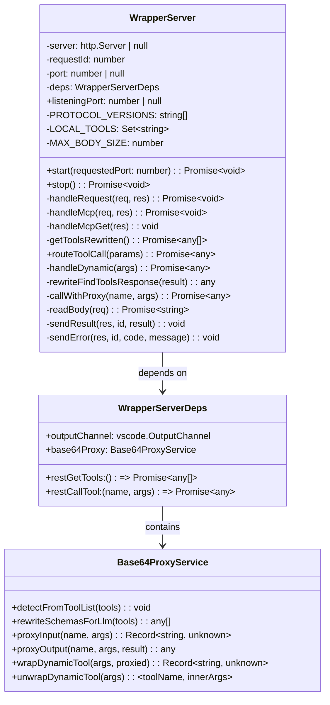
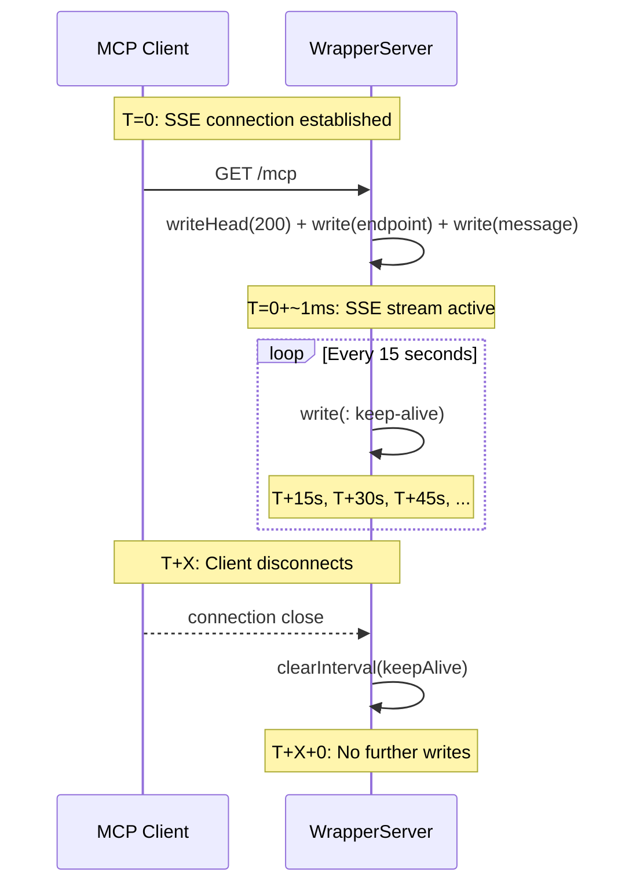

# Technical Design Document (TDD)

## SDLC Agents 4 Enterprise — SA4E-48: OpenCode v1.17.15 SSE error 405 — WrapperServer missing endpoint event

---

## Document Information

| Field | Value |
|-------|-------|
| Jira Ticket | SA4E-48 |
| Title | OpenCode v1.17.15 SSE error 405 — WrapperServer missing endpoint event |
| Author | SA Agent |
| Version | 1.0 |
| Date | 2026-07-20 |
| Status | Draft |
| Related BRD | documents/SA4E-48/BRD.md |
| Related FSD | documents/SA4E-48/FSD.md |

---

## Author Tracking

| Role | Name - Position | Responsibility |
|------|-----------------|----------------|
| Author | SA Agent – Solution Architect | Create document |
| Peer Reviewer | TBD – Technical Lead | Review document |

---

## Revision History

| Version | Date | Author | Changes |
|---------|------|--------|---------|
| 1.0 | 2026-07-20 | SA Agent | Initiate document — auto-generated from BRD and FSD |

---

## Sign-Off

| Name | Signature and date |
|------|--------------------|
| | ☐ I agree and confirm the technical design in this TDD |
| | ☐ I agree and confirm the technical design in this TDD |

---

## 1. Introduction

> **Scope Boundary:** This TDD specifies HOW the SSE endpoint event fix is implemented in the WrapperServer component. It does NOT repeat functional requirements, business rules, or use cases — refer to the FSD for those. This document focuses on: module design, internal routing logic, sequence flows, API contracts, and test architecture.

### 1.1 Purpose

The purpose of this TDD is to document the technical implementation of the WrapperServer SSE `endpoint` event fix (SA4E-48). The fix ensures compliance with the MCP Streamable HTTP transport specification — specifically, the mandatory `event: endpoint` SSE event that tells the client where to send JSON-RPC POST requests.

### 1.2 Scope

This TDD covers the following technical aspects:

1. **Module Design** — Full breakdown of `WrapperServer.ts` class, methods, and routing logic
2. **Sequence Flows** — SSE handshake, JSON-RPC request lifecycle, error handling
3. **API Contract** — Wire-level specification of SSE events and JSON-RPC request/response formats
4. **Class/Interface Design** — Internal state, dependency injection, interface contracts
5. **Testing Strategy** — Unit, integration, and regression test architecture
6. **Build & Deployment** — Compilation, packaging, release process

**Out of scope:**
- Backend REST API (Code Intelligence MCP Server) — unchanged
- Base64ProxyService internals — unchanged
- MCP stdio transport — unchanged
- Authentication or security mechanisms — unchanged

### 1.3 Technology Stack

| Layer | Technology | Version |
|-------|-----------|---------|
| Language | TypeScript | 5.x (from project) |
| Runtime | Node.js (VS Code Extension host) | 20.x |
| HTTP Server | Node.js native `http` module | Built-in |
| Test Framework | Vitest | ^1.x |
| Build Tool | npm / esbuild (VS Code extension) | — |
| Packaging | vsce (VS Code Extension Manager) | ^2.x |

### 1.4 Design Principles

- **MCP Streamable HTTP Compliance** — The SSE stream must strictly follow the MCP specification: `event: endpoint` MUST precede `event: message`
- **Zero Dependency** — The fix uses only Node.js built-in `http` module; no additional npm dependencies
- **Backward Compatibility** — Existing JSON-RPC POST handlers remain unchanged; the fix only adds SSE events
- **Minimal Change Surface** — The fix adds exactly 2 lines of new code (`event: endpoint` + `data: /mcp`) to `handleMcpGet()`

### 1.5 Constraints

- Server is bound to `127.0.0.1` only — no external network exposure
- Body size is hard-limited to 1 MB (connection destroy on overflow)
- Protocol version list is hardcoded (not configurable) — identified as OI-01 in FSD
- No multi-user scaling — single-user local server

### 1.6 References

| Document | Location |
|----------|----------|
| BRD | documents/SA4E-48/BRD.md |
| FSD | documents/SA4E-48/FSD.md |
| WrapperServer Source | extension/src/services/WrapperServer.ts |
| Regression Tests | extension/src/__tests__/mcp-handshake.regression.test.ts |
| Integration Tests | extension/src/__tests__/wrapper-server.test.ts |
| Test Helpers | extension/src/__tests__/wrapper-server.helpers.ts |
| MCP Spec | https://spec.modelcontextprotocol.io/ |
| JSON-RPC 2.0 | https://www.jsonrpc.org/specification |

---

## 2. System Architecture

### 2.1 Architecture Overview

The WrapperServer is a lightweight HTTP server embedded inside the VS Code extension process. It acts as a **bridge** between MCP clients (OpenCode CLI) and the backend Code Intelligence MCP Server.

Key architectural characteristics:
- **Single-process**: Runs inside the VS Code extension host — no separate process
- **Synchronous routing**: Request handler chain is synchronous (no middleware framework)
- **Stateless**: No persistent state between requests (except `requestId` counter)
- **Proxy pattern**: Most MCP tool calls are proxied to the backend REST API; only `stream_write_file` and `embed_image` execute locally

```
┌─────────────────────────────────────────────────────────────────────┐
│  OpenCode CLI (MCP Client)                                          │
│  ┌──────────────────────────────┐                                   │
│  │ SSEClientTransport           │──GET /mcp──► SSE stream           │
│  │                              │──POST /mcp──► JSON-RPC            │
│  └──────────────────────────────┘                                   │
└─────────────────────────────────┬───────────────────────────────────┘
                                  │ 127.0.0.1:9186
                                  ▼
┌─────────────────────────────────────────────────────────────────────┐
│  VS Code Extension Process                                          │
│  ┌──────────────────────────────────────────────────────────────┐   │
│  │  WrapperServer                                                │   │
│  │  ┌─────────────┐  ┌──────────────────┐  ┌─────────────────┐  │   │
│  │  │ handleReq() │─▶│ handleMcpGet()   │  │ handleMcpPost() │  │   │
│  │  │ CORS, Route │  │ SSE stream       │  │ JSON-RPC router │  │   │
│  │  └─────────────┘  └──────────────────┘  └────────┬────────┘  │   │
│  │         ┌─────────────────────────────────────────┼────────┐  │   │
│  │         ▼                                         ▼        │  │   │
│  │  ┌──────────────┐  ┌──────────────┐  ┌──────────────────┐  │   │
│  │  │Local Tools   │  │REST Backend  │  │Base64ProxyService│  │   │
│  │  └──────────────┘  └──────┬───────┘  └──────────────────┘  │   │
│  └───────────────────────────┼────────────────────────────────┘   │
└──────────────────────────────┼─────────────────────────────────────┘
                               │ HTTP
                               ▼
               ┌──────────────────────────────────────┐
               │  Code Intelligence MCP Server         │
               │  (Backend REST API)                   │
               └──────────────────────────────────────┘
```


*[Edit in draw.io](diagrams/tdd-component.drawio)*

### 2.2 Component Responsibilities

| Component | Responsibility | Technology |
|-----------|---------------|------------|
| `handleRequest()` | CORS headers, route dispatching (`/mcp`, `/health`, `404`), error catch-all | Node.js `http` |
| `handleMcp()` | HTTP method dispatch (GET→SSE, POST→JSON-RPC, else→405), `Content-Type` validation, body reading, JSON-RPC routing | Node.js `http` |
| `handleMcpGet()` | SSE stream setup: headers, `event: endpoint`, `event: message`, keep-alive timer, connection cleanup | Node.js `http` + SSE |
| `getToolsRewritten()` | Fetch tools from backend REST, apply `Base64ProxyService.rewriteSchemasForLlm()` | `Base64ProxyService` |
| `routeToolCall()` | Dispatch to local tool, dynamic tool (with Base64Proxy unwrap), or proxied REST call | `Base64ProxyService` + `executeLocalTool` |
| `Base64ProxyService` | Schema rewrite (hide `content_base64`, add `output_path`), file proxy (read/write Base64) | Injected dependency |

### 2.3 Deployment Architecture

The WrapperServer runs as part of the VS Code extension and has a simplified deployment model:

```
┌────────────────────────────────────────────────────────┐
│  Developer Workstation                                  │
│  ┌──────────────────────────────────────────────────┐  │
│  │  VS Code (stable / insiders)                     │  │
│  │  ┌────────────────────────────────────────────┐  │  │
│  │  │  Extension: SDLC Agents 4 Enterprise        │  │  │
│  │  │  ┌──────────────────────────────────────┐  │  │  │
│  │  │  │  WrapperServer (127.0.0.1:9186)      │  │  │  │
│  │  │  └──────────────────────────────────────┘  │  │  │
│  │  │  ┌──────────────────────────────────────┐  │  │  │
│  │  │  │  OpenCode Extension (MCP v1.17.15+)  │  │  │  │
│  │  │  └──────────────────────────────────────┘  │  │  │
│  │  └────────────────────────────────────────────┘  │  │
│  └──────────────────────────────────────────────────┘  │
│                                                         │
│  ┌──────────────────────────────────────────────────┐  │
│  │  Backend Server (remote or localhost)             │  │
│  │  Code Intelligence MCP Server                     │  │
│  └──────────────────────────────────────────────────┘  │
└────────────────────────────────────────────────────────┘
```

**Key deployment points:**
- No containerization — runs as in-process HTTP server within VS Code
- No clustering — one instance per VS Code window (unique port)
- Backend REST API may be local or remote depending on configuration

### 2.4 Communication Patterns

| From | To | Protocol | Pattern | Description |
|------|----|----------|---------|-------------|
| OpenCode CLI | WrapperServer | HTTP (SSE + JSON-RPC) | Sync (request-response) + Async (SSE push) | SSE for server→client events; POST for client→server RPC |
| WrapperServer | Backend REST | HTTP (JSON) | Sync (request-response) | Proxy REST calls for tools/list, tools/call |

---

## 3. API Design

> **Prerequisite:** Functional API contracts (parameters, business errors, data flows) are defined in FSD §3. This section specifies the technical implementation: wire-level SSE event ordering, JSON-RPC request/response schemas, HTTP status codes, and error code mapping.

### 3.1 API Overview

| # | Endpoint | Method | Description | Source |
|---|----------|--------|-------------|--------|
| 1 | `/mcp` | GET | Open SSE stream for server-to-client MCP events | UC-01 |
| 2 | `/mcp` | POST | Handle JSON-RPC 2.0 MCP requests | UC-02 |
| 3 | `/health` | GET | Health check endpoint | — |
| 4 | `*` | OPTIONS | CORS preflight handler | — |

### 3.2 MCP SSE Event Schema

**Implements:** UC-01, BR-1, BR-2, BR-3, BR-4, BR-6, BR-9, BR-10

| Attribute | Value |
|-----------|-------|
| Method | GET |
| Path | `/mcp` |
| Auth | None (127.0.0.1 only) |
| Rate Limit | N/A (local server) |

**SSE Byte-Level Event Sequence (exact wire format):**

```
event: endpoint\ndata: /mcp\n\n
event: message\ndata: {"jsonrpc":"2.0","method":"initialized"}\n\n
: keep-alive\n\n
(keeps repeating every 15 seconds)
```

**SSE Event Specifications:**

| Event Type | Field | Value | Purpose |
|------------|-------|-------|---------|
| `endpoint` | `event` | `endpoint` | Mandatory per MCP Streamable HTTP spec |
| | `data` | `/mcp` | URL path for JSON-RPC POST requests |
| `message` | `event` | `message` | Server-to-client MCP notification |
| | `data` | `{"jsonrpc":"2.0","method":"initialized"}` | Signals server readiness |
| (comment) | `: keep-alive` | (empty line follows) | Prevents proxy/load-balancer timeout |

**SSE Format Rules:**

| Aspect | Requirement |
|--------|-------------|
| Event delimiter | Double newline `\n\n` (blank line) |
| Field separator | Single newline `\n` between event field lines |
| Data length | `data:` field = `/mcp` (4 bytes) |
| Keep-alive format | SSE comment line (`: text`) not event format |
| Content-Type | `text/event-stream` |
| Cache-Control | `no-cache, no-transform` |
| Connection | `keep-alive` |

**Response — SSE Stream (first 2 events are guaranteed before keep-alive starts):**

```
HTTP/1.1 200 OK
Content-Type: text/event-stream
Cache-Control: no-cache, no-transform
Connection: keep-alive
Access-Control-Allow-Origin: *
Access-Control-Allow-Methods: GET, POST, OPTIONS
Access-Control-Allow-Headers: Content-Type

event: endpoint
data: /mcp

event: message
data: {"jsonrpc":"2.0","method":"initialized"}

: keep-alive

```

**Error Responses:**

| Status | Condition | Description |
|--------|-----------|-------------|
| 405 | Non-GET, non-POST to `/mcp` | `{"error":"Method not allowed"}` |
| 404 | Unknown path | `{"error":"Not found"}` |
| 500 | Unhandled exception | `{"error":"<message>"}` (only if headers not yet sent) |

### 3.3 MCP JSON-RPC POST Handler

**Implements:** UC-02, BR-11, BR-12, BR-13, BR-14, BR-15, BR-16, BR-20, BR-21, BR-22, BR-25

| Attribute | Value |
|-----------|-------|
| Method | POST |
| Path | `/mcp` |
| Auth | None (127.0.0.1 only) |
| Max Body Size | 1,048,576 bytes (1 MB) |
| Content-Type | Must include `application/json` |

**Request Headers:**

| Header | Required | Description |
|--------|----------|-------------|
| Content-Type | Yes | Must include `application/json` |
| Content-Length | Recommended | HTTP/1.1 content length |

**Request Body (JSON-RPC 2.0):**

```json
{
  "jsonrpc": "2.0",
  "id": 1,
  "method": "initialize",
  "params": {
    "protocolVersion": "2024-11-05",
    "capabilities": {},
    "clientInfo": { "name": "vscode", "version": "1.128.0" }
  }
}
```

**Response — 200 OK (initialize):**

```json
{
  "jsonrpc": "2.0",
  "id": 1,
  "result": {
    "protocolVersion": "2024-11-05",
    "capabilities": {
      "tools": { "listChanged": false }
    },
    "serverInfo": {
      "name": "sdlc-agents-4-enterprise",
      "version": "1.11.0"
    }
  }
}
```

**Response — 202 Accepted (notifications/initialized):**

```
HTTP/1.1 202 Accepted
(empty body)
```

**Response — 200 OK (ping):**

```json
{
  "jsonrpc": "2.0",
  "id": 2,
  "result": {}
}
```

**Response — 200 OK (tools/list):**

```json
{
  "jsonrpc": "2.0",
  "id": 3,
  "result": {
    "tools": [
      {
        "name": "drawio_export_png",
        "description": "Export drawio to PNG. Returns output_base64 field.",
        "inputSchema": {
          "type": "object",
          "properties": {
            "file_path": { "type": "string" },
            "output_path": { "type": "string" }
          }
        }
      }
    ]
  }
}
```

**Error Response — Method not found:**

```json
{
  "jsonrpc": "2.0",
  "id": 4,
  "error": {
    "code": -32601,
    "message": "Method not supported: some_future_method"
  }
}
```

**Error Response — Parse error (HTTP 400):**

```json
{
  "jsonrpc": "2.0",
  "id": null,
  "error": {
    "code": -32700,
    "message": "Parse error"
  }
}
```

**JSON-RPC Error Code Matrix:**

| Code | HTTP Status | Meaning | Condition |
|------|-------------|---------|-----------|
| `-32700` | 400 | Parse error | Invalid JSON body or wrong Content-Type |
| `-32601` | 200 | Method not found | Unknown MCP method name |
| `-32603` | 200 | Internal error | Backend REST failure, unexpected exception |
| (none) | 202 | Accepted | `notifications/initialized` response |
| (none) | 405 | Method not allowed | Non-POST to /mcp (except GET) |
| (none) | 404 | Not found | Unknown URL path |
| (none) | 500 | Internal error | Unhandled exception before headers sent |

---

## 4. MCP Routing & Protocol Negotiation

### 4.1 MCP Method Routing Table

| Method | Handler | Response | Notes |
|--------|---------|----------|-------|
| `initialize` | Inline protocol negotiation | `protocolVersion`, `capabilities`, `serverInfo` | Line 107-118 |
| `notifications/initialized` | Inline | HTTP 202, empty body | Also accepts `initialized` (defensive) |
| `ping` | Inline | `{"result":{}}` | Line 122 |
| `tools/list` | `getToolsRewritten()` | Array of tool definitions (Base64Proxy-rewritten) | Line 123-127 |
| `tools/call` | `routeToolCall()` | Varies by tool | Line 128-132 |
| Unknown | — | `-32601 Method not supported` | Line 133 |

### 4.2 Protocol Version Negotiation

```mermaid
flowchart LR
    A[Client sends initialize\nwith protocolVersion] --> B{Exact match?}
    B -->|Yes| C[Return matched version]
    B -->|No| D[Return PROTOCOL_VERSIONS[0]\nnewest: 2025-06-18]
    C --> E[Negotiation complete]
    D --> E
```

**Supported versions (hardcoded, newest first):**
```
["2025-06-18", "2025-03-26", "2024-11-05"]
```

**Algorithm:**
1. Try exact match against supported versions using `Array.find()`
2. If no match, fall back to `PROTOCOL_VERSIONS[0]` (newest — `2025-06-18`)
3. If client sends `undefined` (empty params), also falls back to newest

### 4.3 Tool Routing Logic

```mermaid
flowchart TD
    A[tools/call request] --> B{routeToolCall()}
    B --> C{Local tool?}
    C -->|stream_write_file, embed_image| D[executeLocalTool()]
    C -->|execute_dynamic_tool| E[handleDynamic()]
    C -->|Other backend tool| F[callWithProxy()]
    E --> G{base64Proxy.unwrapDynamicTool}
    G -->|find_tools| H[rewriteFindToolsResponse()]
    G -->|other dynamic| I[proxyInput → REST → proxyOutput]
    D --> J[Return result]
    F --> J
    H --> J
    I --> J
```

---

## 5. Class / Module Design

### 5.1 Package Structure

The WrapperServer is a single-file module within the extension's service layer:

```
extension/src/
├── services/
│   ├── WrapperServer.ts          # Main class (233 lines) — THE FIX TARGET
│   ├── Base64ProxyService.ts     # Schema rewrite & file proxy (unchanged)
│   └── ...
├── __tests__/
│   ├── wrapper-server.test.ts     # Integration + E2E-API tests (263 lines)
│   ├── wrapper-server.helpers.ts  # Test utilities — createTestServer, postMcp, openSse
│   └── mcp-handshake.regression.test.ts  # 7 regression tests (SA4E-48)
├── backend-local-tools.ts        # Local tool executor (stream_write_file, embed_image)
└── ...
```

### 5.2 Class Diagram



### 5.3 Key Interfaces

```typescript
/** Dependency injection contract for WrapperServer */
export interface WrapperServerDeps {
  outputChannel: vscode.OutputChannel;
  base64Proxy: Base64ProxyService;
  restGetTools: () => Promise<any[]>;
  restCallTool: (name: string, args: Record<string, unknown>) => Promise<any>;
}
```

### 5.4 Design Patterns

| Pattern | Where Used | Rationale |
|---------|-----------|-----------|
| **Proxy** | `Base64ProxyService` — schema rewrite & file I/O proxy | Transparently intercepts `content_base64` fields to read/write files locally |
| **Strategy** | `routeToolCall()` — local vs. remote dispatch | Different execution strategies for local tools, dynamic tools, and backend-proxied tools |
| **Observer** | `res.on("close") → clearInterval()` | Cleanup on SSE connection close prevents timer leaks |
| **Dependency Injection** | `WrapperServer` constructor takes `WrapperServerDeps` | Testability — mock deps injected in tests |

### 5.5 Error Handling

| Condition | Handler | HTTP Status | JSON-RPC Code | Logged? |
|-----------|---------|-------------|---------------|---------|
| Invalid JSON body | `handleMcp()` | 400 | `-32700` | No |
| Wrong Content-Type | `handleMcp()` | 400 | `-32700` | No |
| Unknown method | `handleMcp()` | 200 | `-32601` | No |
| Backend call failure | `handleMcp()` catch | 200 | `-32603` | Yes (`outputChannel.appendLine`) |
| Non-GET/POST to /mcp | `handleMcp()` | 405 | — | No |
| Unknown path | `handleRequest()` | 404 | — | No |
| Unhandled exception | `handleRequest()` catch | 500 | — | No (unless headersSent) |
| Body > 1MB | `readBody()` | Connection destroyed | — | No |
| SSE write after close | `handleMcpGet()` keepAlive | — | — | Silently caught in try/catch |

### 5.6 Critical Code Path — SSE Handshake (The Fix)

```typescript
private handleMcpGet(res: http.ServerResponse): void {
    // Step 1: SSE response headers
    res.writeHead(200, {
      "Content-Type": "text/event-stream",
      "Cache-Control": "no-cache, no-transform",
      Connection: "keep-alive",
    });

    // Step 2: [THE FIX] Mandatory endpoint event
    // MCP SDK SSEClientTransport BLOCKS until this event is received
    res.write("event: endpoint\n");
    res.write("data: /mcp\n\n");          // Double \n\n = SSE event delimiter

    // Step 3: Server ready notification
    res.write("event: message\n");
    res.write("data: {\"jsonrpc\":\"2.0\",\"method\":\"initialized\"}\n\n");

    // Step 4: Keep-alive timer (every 15 seconds)
    const keepAlive = setInterval(() => {
      try { res.write(": keep-alive\n\n"); } catch { /* ignore */ }
    }, 15000);

    // Step 5: Cleanup on connection close
    res.on("close", () => clearInterval(keepAlive));
  }
```

---

## 6. Integration Design

> **Prerequisite:** Business integration requirements are defined in FSD §5. This section specifies the technical integration between WrapperServer and external systems.

### 6.1 External System: OpenCode CLI (MCP Client)

| Attribute | Value |
|-----------|-------|
| Protocol | HTTP/1.1 + SSE (Streamable HTTP transport) |
| Endpoint | `http://127.0.0.1:9186/mcp` |
| Authentication | None (localhost only) |
| Timeout | SSE: indefinite (keep-alive every 15s) / POST: inherited from HTTP client |
| Retry Policy | Client-side (MCP SDK SSEClientTransport handles reconnection) |

**SSE Handshake Sequence:**


*[Edit in draw.io](diagrams/tdd-sequence-handshake.drawio)*

**Sequence Steps:**
1. Client sends `GET /mcp` to open SSE stream
2. Server responds with `200 OK` + `Content-Type: text/event-stream`
3. Server writes `event: endpoint\ndata: /mcp` (THE FIX — was missing)
4. Server writes `event: message\ndata: {"jsonrpc":"2.0","method":"initialized"}`
5. Server starts keep-alive timer (every 15s)
6. Client receives endpoint event, now knows where to POST
7. Client sends `POST /mcp` with `initialize` JSON-RPC request
8. Server responds with negotiated protocol version, capabilities, serverInfo
9. Client sends `notifications/initialized` → server responds 202
10. Client sends `tools/list` → server proxies to backend

### 6.2 External System: Backend REST API

| Attribute | Value |
|-----------|-------|
| Protocol | HTTP (JSON) |
| Endpoint | Injected via `WrapperServerDeps.restGetTools` / `restCallTool` |
| Authentication | Injected (not handled by WrapperServer) |
| Timeout | Not configured in WrapperServer (inherited from backend client) |
| Retry Policy | None (errors bubble to `-32603`) |
| Circuit Breaker | None (single-user local server) |

**Tools/list + tools/call Sequence:**


*[Edit in draw.io](diagrams/tdd-sequence-toolscall.drawio)*

**Data Mapping (Base64Proxy):**

| Source Field | Target Field | Transformation |
|-------------|-------------|----------------|
| `inputSchema.properties.content_base64` | Removed | Replaced with `output_path` for LLM-friendly interface |
| `output_base64` (in result) | `file_path`, `size_bytes` | Base64 decoded and written to temp file; result rewritten with path |
| File path (in args) | `content_base64` | File read and Base64-encoded before sending to backend |

---

## 7. Security Design

> **Prerequisite:** Business security requirements are defined in FSD §7. This section specifies the technical implementation.

### 7.1 Network Security

The WrapperServer binds exclusively to `127.0.0.1` (localhost-only). No TLS, no external network exposure. This is enforced at the `server.listen()` call:

```typescript
srv.listen(requestedPort, "127.0.0.1", () => { ... });
```

### 7.2 CORS Implementation

CORS headers are set on **every** HTTP response (including errors) before any routing:

| Header | Value | Purpose |
|--------|-------|---------|
| `Access-Control-Allow-Origin` | `*` | Allow any origin (no CSRF risk on localhost) |
| `Access-Control-Allow-Methods` | `GET, POST, OPTIONS` | Supported methods |
| `Access-Control-Allow-Headers` | `Content-Type` | Required for JSON-RPC POST |

**OPTIONS preflight:** Returns HTTP 204 with CORS headers, empty body.

### 7.3 Input Validation

| Input | Validation | Enforcement |
|-------|-----------|-------------|
| URL path | Match against known routes (`/mcp`, `/health`) | Unknown → 404 |
| HTTP method | GET or POST for `/mcp` | Non-GET/POST → 405 |
| Content-Type | Must include `application/json` for POST | Non-JSON → 400 (`-32700`) |
| JSON body | Parsed via `JSON.parse()` | Invalid → 400 (`-32700`) |
| Body size | Incremental accumulation, check on each chunk | >1MB → `req.destroy()` |

### 7.4 Audit Trail

| Event | Logged Fields | Destination |
|-------|--------------|-------------|
| Server start | Port number | VS Code Output Channel (`[WrapperServer]`) |
| Server stop | — | VS Code Output Channel (via `close` callback) |
| Server error | Error message | VS Code Output Channel (`[WrapperServer] Error: ...`) |
| Handler error | Error message | VS Code Output Channel (`[WrapperServer] Error: ...`) |

---

## 8. Performance & Scalability

> **Prerequisite:** Business NFR targets are defined in FSD §8.

### 8.1 Performance Targets

| Operation | Target | Measurement |
|-----------|--------|-------------|
| SSE handshake (headers + first event) | < 50ms | `res.writeHead` to first `res.write` timestamp |
| POST /mcp initialize | < 100ms | Request-to-response latency (local) |
| POST /mcp tools/list | < 500ms p95 | Includes backend REST round-trip |
| POST /mcp tools/call (local tool) | < 50ms | Local execution only |
| SSE keep-alive jitter | ±500ms | `setInterval` drift in Node.js event loop |
| Memory (baseline) | < 50 MB RSS | Process memory |
| Memory (per SSE connection) | < 10 KB | Response object + timer |

### 8.2 Connection Lifecycle



### 8.3 Caching Strategy

| Cache | What | TTL | Technology |
|-------|------|-----|------------|
| Tool definitions | Fetched from backend on each `tools/list` call | No caching (always fresh) | In-memory (not cached) |
| Base64Proxy detection state | Tool schema patterns | Extension session | `Base64ProxyService` instance state |

---

## 9. Monitoring & Observability

### 9.1 Logging

The WrapperServer uses VS Code `OutputChannel` for diagnostic logging:

| Log Event | Level | Fields | Destination |
|-----------|-------|--------|-------------|
| Server listening | INFO | `[WrapperServer] Listening on port {port}` | Output Channel |
| Server error | ERROR | `[WrapperServer] Error: {message}` | Output Channel |
| Handler error | ERROR | `[WrapperServer] Error: {message} + stack` | Output Channel |

**Log format:**
```
[WrapperServer] Listening on port 9186
[WrapperServer] Error: connect ECONNREFUSED
[WrapperServer] Error: TypeError: Cannot read properties of undefined
```

### 9.2 Health Check

| Endpoint | Response | Purpose |
|----------|----------|---------|
| `GET /health` | `{"status":"ok","mode":"wrapper"}` | Liveness check for monitoring |

### 9.3 Metrics (Future Enhancement)

No metrics are currently collected. Potential future metrics (identified as OI-03):
- SSE connection count (active streams)
- Keep-alive write failures
- JSON-RPC request latency
- Backend REST call latency

---

## 10. Deployment Considerations

### 10.1 Build & Release Process

| Step | Command | Expected Result |
|------|---------|-----------------|
| 1. Compile | `npm run compile` | TypeScript → `out/` directory (includes `out/services/WrapperServer.js`) |
| 2. Run tests | `npx vitest run` | ≥ 545 tests passing |
| 3. Package VSIX | `npm run package:debug` | `extension/sdlc-agents-4-enterprise-1.14.0.vsix` |
| 4. Tag release | `git tag v1.14.0` | Release tag created |
| 5. Update docs | Update CHANGELOG.md, README.md | Version references updated |

### 10.2 Environment Configuration

| Property | DEV | UAT | PROD |
|----------|-----|-----|------|
| Server port | 9186 (default) | 9186 | 9186 |
| Bind address | 127.0.0.1 | 127.0.0.1 | 127.0.0.1 |
| Backend URL | Configurable via extension settings | Same | Same |

### 10.3 Feature Flags

None required — the SSE endpoint fix is a pure additive change (new events written to the SSE stream). No toggle needed.

### 10.4 Rollback Strategy

1. **For VSIX installation:** Reinstall previous version of the extension VSIX
2. **For source:** Revert the two lines added to `handleMcpGet()`:
   ```typescript
   // res.write("event: endpoint\n");
   // res.write("data: /mcp\n\n");
   ```
3. **For compiled output:** Run `npm run compile` to rebuild from reverted source
4. **Verify:** All 545 tests should still pass (tests guard against regression)

### 10.5 Database Migration

**None required.** This fix is strictly at the HTTP protocol layer — no database, file format, or persistent state changes.

---

## 11. E2E Test Architecture

### 11.1 Framework & Language

| Attribute | Detail |
|-----------|--------|
| **Framework** | Vitest (native `http` requests — no supertest) |
| **Language** | TypeScript (matches extension source) |
| **HTTP client** | Node.js native `http` module (for both POST and raw SSE) |
| **Mock strategy** | `createTestServer()` factory with `MockDeps` |
| **Server lifecycle** | `beforeAll` → `server.start(0)` on random port → `afterAll` → `server.stop()` |

### 11.2 Test Module Structure

```
extension/src/__tests__/
├── wrapper-server.helpers.ts          # Test utilities, server factory, mock deps
├── mcp-handshake.regression.test.ts   # 7 regression tests (SA4E-48 fix guard)
├── wrapper-server.test.ts             # Integration + E2E-API tests (TC-22 to TC-31)
```

### 11.3 Reusable Test Components

| Component | File | Purpose |
|-----------|------|---------|
| `createTestServer()` | `wrapper-server.helpers.ts` | Creates WrapperServer with mocked deps on random port |
| `postMcp(port, body)` | `wrapper-server.helpers.ts` | Send JSON-RPC POST to `/mcp`, returns `{status, body}` |
| `postRaw(port, data)` | `wrapper-server.helpers.ts` | Send raw buffer (for oversized body test), returns `{status, error}` |
| `openSse(port, timeoutMs?)` | `wrapper-server.helpers.ts` | Open GET /mcp SSE, resolve on first `event: message` |
| `createMockOutputChannel()` | `wrapper-server.helpers.ts` | Minimal `vscode.OutputChannel` mock |
| `MockDeps` | `wrapper-server.helpers.ts` | Full mock deps with `restGetToolsMock` and `restCallToolMock` |

### 11.4 Regression Test Design (SA4E-48)

| ID | Test | What it Verifies |
|----|------|------------------|
| REG-01 | initialize is implemented | `initialize` does NOT return `-32601 Method not supported` |
| REG-02 | initialize response structure | Returns `protocolVersion`, `capabilities`, `serverInfo` |
| REG-03 | Full handshake flow | `initialize → notifications/initialized → tools/list` works end-to-end |
| REG-04 | ping response | `ping` returns `{}` result |
| REG-05 | SSE stream | `GET /mcp` returns `200` + `text/event-stream` + `event: message` |
| REG-06 | All required methods | No required method returns `-32601` |
| REG-07 | Unknown method | Unknown method still returns `-32601` |

### 11.5 Integration Test Design (WrapperServer)

| ID | Scenario | Source |
|----|----------|--------|
| TC-22 | tools/call routes file tool through full proxy chain | wrapper-server.test.ts |
| TC-23 | tools/list returns rewritten schemas via HTTP | wrapper-server.test.ts |
| TC-24 | execute_dynamic_tool unwraps and proxies via HTTP | wrapper-server.test.ts |
| TC-25 | Health endpoint returns ok | wrapper-server.test.ts |
| TC-26 | 404 on unknown path | wrapper-server.test.ts |
| TC-27 | 405 on non-POST to /mcp | wrapper-server.test.ts |
| TC-28 | Body too large destroys connection | wrapper-server.test.ts |
| TC-29 | JSON-RPC parse error returns -32700 | wrapper-server.test.ts |
| TC-30 | Unknown method returns -32601 | wrapper-server.test.ts |
| TC-31 | SSE event ordering (endpoint before message) | wrapper-server.test.ts |

---

## 12. Appendix

### 12.1 Glossary

| Term | Definition |
|------|------------|
| MCP | Model Context Protocol — protocol for LLM ↔ tool server communication |
| SSE | Server-Sent Events — W3C standard for server push over HTTP |
| Streamable HTTP | MCP transport: SSE for server→client, HTTP POST for client→server |
| WrapperServer | Local HTTP server in VS Code extension bridging MCP to backend REST |
| JSON-RPC 2.0 | Lightweight RPC protocol using JSON encoding |
| SSEClientTransport | MCP SDK client class that consumes SSE streams |
| VSIX | VS Code Extension Package format |
| Base64ProxyService | Service that rewrites tool schemas to hide Base64 encoding from LLM |

### 12.2 Open Issues (from FSD §11)

| ID | Issue | Status | Impact on TDD |
|----|-------|--------|---------------|
| OI-01 | Protocol version list hardcoded; should be configurable | Open | No action — out of scope |
| OI-02 | Body size limit enforced via `req.destroy()` — no graceful 413 | Open | Documented in §5.5 |
| OI-03 | No metric/monitoring for SSE connection count | Open | Documented in §9.3 |
| OI-04 | Server version hardcoded in initialize response | Open | No action — out of scope |
| OI-05 | No timeout on `readBody()` | Open | No action — out of scope |
| OI-06 | SSE keep-alive uses `setInterval` which accumulates drift | Open | Documented but accepted for simplicity |

### 12.3 File Change Summary

| File | Change Type | Lines Changed | Description |
|------|-------------|---------------|-------------|
| `extension/src/services/WrapperServer.ts` | **MODIFY** | +2 lines (150-152) | Added `event: endpoint\ndata: /mcp\n\n` to `handleMcpGet()` |
| `extension/src/__tests__/mcp-handshake.regression.test.ts` | **NEW** | +115 lines | 7 regression tests guarding MCP handshake |
| `extension/src/__tests__/wrapper-server.test.ts` | **EXISTING** | 0 (unchanged) | Existing 263-line test suite passes without modification |
| `extension/src/__tests__/wrapper-server.helpers.ts` | **EXISTING** | 0 (unchanged) | Test utilities reused by regression tests |

---

## ⛔ MANDATORY: Diagram Requirements

### Required draw.io Diagrams

| # | Diagram | File | Section |
|---|---------|------|---------|
| 1 | Component Architecture | `diagrams/tdd-component.drawio` + `.png` | §2.1 |
| 2 | SSE Handshake Sequence | `diagrams/tdd-sequence-handshake.drawio` + `.png` | §6.1 |
| 3 | Tools Call Sequence | `diagrams/tdd-sequence-toolscall.drawio` + `.png` | §6.2 |

### Inline Mermaid Diagrams

The following Mermaid diagrams are embedded inline in this TDD:
- **Flowchart** — Protocol version negotiation (§4.2)
- **Flowchart** — Tool routing logic (§4.3)
- **Class diagram** — WrapperServer class design (§5.2)
- **Sequence diagram** — Connection lifecycle (§8.2)