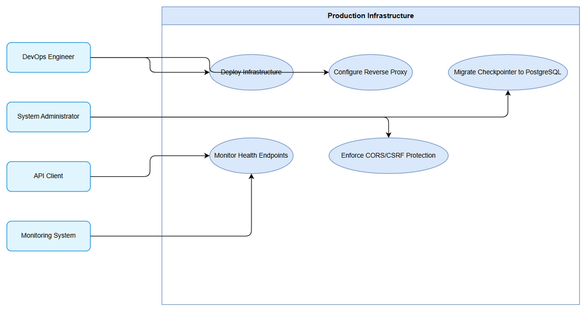
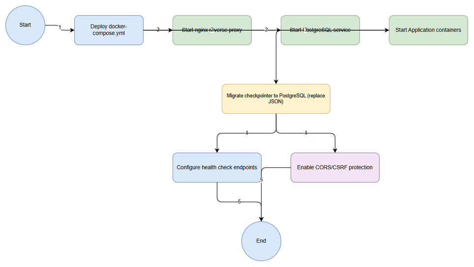

# Business Requirements Document (BRD)

## SDLC Agents 4 Enterprise — SA4E-11: Production Infrastructure

---

## Document Information

| Field | Value |
|-------|-------|
| Jira Ticket | SA4E-11 |
| Title | Production Infrastructure |
| Author | BA Agent |
| Version | 1.0 |
| Date | 2026-09-28 |
| Status | Draft |

---

## Author Tracking

| Role | Name - Position | Responsibility |
|------|-----------------|----------------|
| Author | BA Agent – Business Analyst | Create document |
| Peer Reviewer | – | Review document |

---

## Revision History

| Version | Date | Author | Changes |
|---------|------|--------|---------|
| 1.0 | 2026-09-28 | BA Agent | Initiate document — auto-generated from Jira ticket SA4E-11 and linked tickets |

---

## Sign-Off

| Name | Signature and date |
|------|--------------------|
| | ☐ I agree and confirm all criteria on this BRD as expected requirements |
| | ☐ I agree and confirm all criteria on this BRD as expected requirements |

---

## 1. Introduction

### 1.1 Scope

This BRD defines the business requirements for SA4E-11 Production Infrastructure as part of SA4E-5 DeerFlow Bridge Integration Option C - Hybrid Architecture. The scope includes:

- Docker Compose manifest for orchestrating production services
- nginx reverse proxy configuration for traffic routing, TLS termination and load balancing
- Migration of persistent checkpointer from JSON files to PostgreSQL for durability and scalability
- Health check endpoints for service monitoring and readiness/liveness probes
- CORS and CSRF protection for API security
Reference implementation: DeerFlow production infra - https://github.com/bytedance/deer-flow

### 1.2 Out of Scope

- Application business logic changes beyond checkpointer persistence
- CI/CD pipeline definition — out of scope for this ticket
- Kubernetes migration — Docker Compose is the target for this release
- Database schema design beyond checkpointer tables — to be confirmed with technical team

### 1.3 Preliminary Requirement

- SA4E-5 DeerFlow Bridge Integration parent epic must be in progress
- Existing DeerFlow codebase accessible
- PostgreSQL instance or Docker image available
- nginx configuration baseline from reference repo

---

## 2. Business Requirements

### 2.1 High Level Process Map

Production infrastructure is deployed via Docker Compose which starts nginx, PostgreSQL and application containers. nginx acts as reverse proxy in front of application services. Application checkpointer persists state to PostgreSQL instead of JSON files. Health endpoints expose service status for monitoring. CORS/CSRF middleware protects API consumers.

*[Edit in draw.io](diagrams/use-case.drawio)*

*[Edit in draw.io](diagrams/business-flow.drawio)*

### 2.2 List of User Stories / Use Cases

| # | Story / Use Case / Epic | Priority | Source Ticket |
|---|-------------------------|----------|---------------|
| 1 | As a DevOps Engineer, I want a Docker Compose manifest that orchestrates all services so that I can deploy production infrastructure with one command | MUST HAVE | SA4E-11 |
| 2 | As a System Administrator, I want nginx reverse proxy configured so that traffic is routed securely with TLS termination | MUST HAVE | SA4E-11 |
| 3 | As a Developer, I want PostgreSQL persistent checkpointer replacing JSON files so that state is durable and scalable | MUST HAVE | SA4E-11 |
| 4 | As a Monitoring Engineer, I want health check endpoints exposed so that service availability can be verified automatically | SHOULD HAVE | SA4E-11 |
| 5 | As a Security Engineer, I want CORS/CSRF protection enabled so that API is protected from cross-site attacks | MUST HAVE | SA4E-11 |

---

### 2.3 Details of User Stories

---

#### Business Flow

**Step 1:** DevOps Engineer creates and validates docker-compose.yml referencing nginx, PostgreSQL and application services.

**Step 2:** `docker compose up -d` starts nginx reverse proxy, PostgreSQL database and application containers.

**Step 3:** Application connects to PostgreSQL for checkpointer persistence instead of local JSON files.

**Step 4:** nginx routes external traffic to application, terminates TLS, applies rate limiting.

**Step 5:** Health check endpoints `/healthz` and `/ready` are exposed via nginx for monitoring.

**Step 6:** CORS and CSRF middleware is enabled on API layer.

> **Note:** Migration from JSON checkpointer to PostgreSQL must be backward compatible during rollout.

---

#### STORY 1: Docker Compose Orchestration

> As a DevOps Engineer, I want a Docker Compose manifest that orchestrates all services so that I can deploy production infrastructure with one command

**Requirement Details:**

1. Provide docker-compose.yml defining services: nginx, postgres, app
2. Define network bridge and volume mounts for persistent data
3. Environment variables for configuration injection
4. Health dependencies between services

**Acceptance Criteria:**

1. `docker compose up -d` starts all services successfully
2. Services restart automatically on failure with restart policy
3. Compose file is versioned and documented
4. Reference implementation aligns with DeerFlow production infra

**Validation Rules:**

- Compose file must pass `docker compose config` validation
- Service names must be unique and descriptive

**Error Handling:**

- Service start failure: logs exposed via `docker compose logs`
- Port conflict: clear error message with suggested alternatives

---

#### STORY 2: nginx Reverse Proxy

> As a System Administrator, I want nginx reverse proxy configured so that traffic is routed securely with TLS termination

**Requirement Details:**

1. nginx acts as reverse proxy in front of application containers
2. TLS termination with configurable certificates
3. Proxy headers passed correctly to upstream
4. Static asset caching optional

**Acceptance Criteria:**

1. External requests to public domain reach application via nginx
2. HTTPS redirect from HTTP to HTTPS enforced
3. nginx config reloads without downtime
4. Logs capture access and error trails

**UI Specifications:**

Not applicable

**Validation Rules:**

- TLS certificate validity checked on startup
- Upstream host must be reachable

**Error Handling:**

- Upstream unavailable: return 502 with retry
- Invalid certificate: fail fast on startup

---

#### STORY 3: PostgreSQL Persistent Checkpointer

> As a Developer, I want PostgreSQL persistent checkpointer replacing JSON files so that state is durable and scalable

**Requirement Details:**

1. Replace JSON file checkpointer with PostgreSQL table
2. Checkpointer stores workflow state, checkpoint ID and payload
3. Migration script for existing JSON data
4. Connection pooling configured

**Data Fields:**

| Field | Type | Required | Description | Example |
|-------|------|----------|-------------|---------|
| checkpoint_id | UUID | Yes | Unique identifier | `550e8400-e29b-41d4-a716-446655440000` |
| workflow_id | VARCHAR | Yes | Workflow reference | `wf_12345` |
| payload | JSONB | Yes | State payload | `{...}` |
| created_at | TIMESTAMP | Yes | Creation time | `2026-09-28T12:00:00Z` |

**Acceptance Criteria:**

1. Application writes checkpoint to PostgreSQL successfully
2. Application reads checkpoint from PostgreSQL successfully
3. Existing JSON checkpoints can be migrated
4. Data persists across container restarts

**Validation Rules:**

- checkpoint_id must be UUID format
- payload must be valid JSON

**Error Handling:**

- DB connection loss: fallback to in-memory with warning
- Migration failure: rollback and alert

---

#### STORY 4: Health Check Endpoints

> As a Monitoring Engineer, I want health check endpoints exposed so that service availability can be verified automatically

**Requirement Details:**

1. `/healthz` returns 200 OK when service is up
2. `/ready` returns 200 when dependencies are ready
3. Health endpoints accessible via nginx
4. Metrics for latency

**Acceptance Criteria:**

1. GET /healthz returns `{"status":"ok"}` with 200
2. GET /ready returns 200 only after DB connection established
3. Monitoring system can poll endpoints every 30s

**Validation Rules:**

- Response time < 200ms

**Error Handling:**

- DB down: /ready returns 503 Service Unavailable

---

#### STORY 5: CORS/CSRF Protection

> As a Security Engineer, I want CORS/CSRF protection enabled so that API is protected from cross-site attacks

**Requirement Details:**

1. CORS policy defines allowed origins, methods, headers
2. CSRF tokens required for state-changing operations
3. Configuration via environment variables

**Acceptance Criteria:**

1. Requests from unauthorized origins are rejected
2. CSRF token validation enforced for POST/PUT/DELETE
3. Security headers present in responses

**Validation Rules:**

- Origin whitelist enforced
- CSRF token must match session

**Error Handling:**

- CORS violation: return 403 with message
- Missing CSRF token: return 403

---

## 3. Dependencies

| Dependency | Type | Related Ticket | Description |
|------------|------|----------------|-------------|
| SA4E-5 DeerFlow Bridge Integration | System | SA4E-5 | Parent epic, provides application context |
| PostgreSQL Docker Image | Infrastructure | N/A | Required for persistent checkpointer |
| nginx Configuration Baseline | Infrastructure | N/A | Reference DeerFlow production infra |

---

## 4. Stakeholders

| Role | Name / Team | Responsibility | Source |
|------|-------------|----------------|--------|
| Product Owner | SA4E Team | Approve requirements | SA4E-11 |
| DevOps Engineer | Unassigned | Implement Docker Compose and nginx | SA4E-11 |
| Developer | Unassigned | Implement PostgreSQL checkpointer | SA4E-11 |
| Security Engineer | Unassigned | Review CORS/CSRF | SA4E-11 |

---

## 5. Risks and Assumptions

### 5.1 Risks

| Risk | Impact | Likelihood | Mitigation |
|------|--------|------------|------------|
| PostgreSQL migration data loss | High | Medium | Backup JSON files before migration, test migration script |
| nginx TLS misconfiguration | High | Low | Use reference config, automated tests for HTTPS |
| Health check false positives | Medium | Medium | Implement deep health checks for DB dependency |

### 5.2 Assumptions

- DeerFlow production infra reference is applicable
- Application supports PostgreSQL checkpointer interface
- Docker Compose is acceptable deployment model for production

---

## 6. Non-Functional Requirements

| Category | Requirement | Details |
|----------|-------------|---------|
| Performance | Container startup < 30s | Docker Compose services start within 30 seconds |
| Security | TLS 1.2+ enforced | nginx terminates TLS with modern protocols |
| Scalability | Horizontal scaling via compose replicas | Services support replica count increase |
| Availability | Uptime > 99% | Health checks enable auto-restart |

---

## 7. Related Tickets

| Ticket Key | Summary | Status | Type | Relationship |
|------------|---------|--------|------|--------------|
| SA4E-11 | Production Infrastructure | To Do | Story | Main ticket |
| SA4E-5 | DeerFlow Bridge Integration (Option C - Hybrid Architecture) | Epic | Epic | Parent epic |

---

## 8. Appendix

### Glossary

| Term | Definition |
|------|------------|
| Checkpointer | Component persisting workflow execution state |
| Reverse Proxy | Intermediary server forwarding requests to backend |

### Reference Documents

| Document | Link / Location |
|----------|-----------------|
| DeerFlow production infra | https://github.com/bytedance/deer-flow |

### Diagram Index

| # | Diagram | Image | Source (editable) |
|---|---------|-------|-------------------|
| 1 | Use Case Diagram | [use-case.png](diagrams/use-case.png) | [use-case.drawio](diagrams/use-case.drawio) |
| 2 | Business Flow | [business-flow.png](diagrams/business-flow.png) | [business-flow.drawio](diagrams/business-flow.drawio) |
