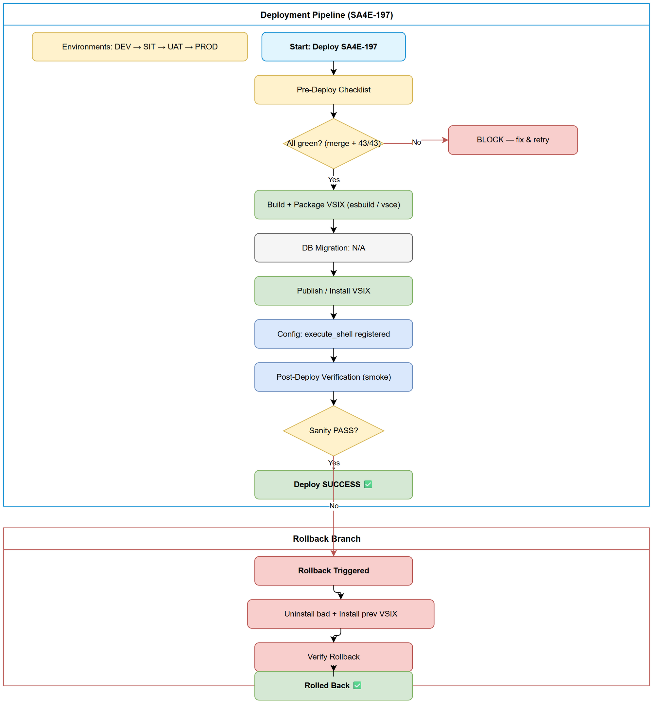
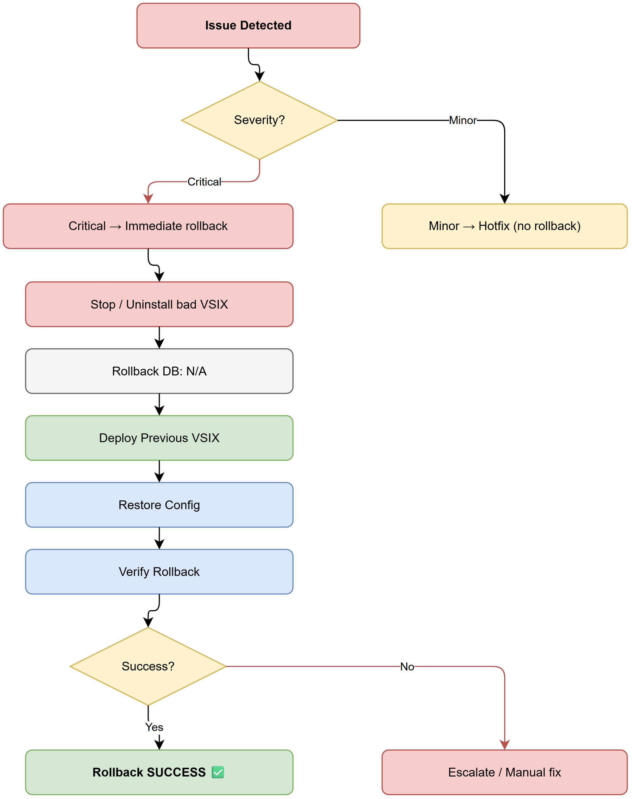

# Deployment Guide (DPG)

## SDLC-Agents-4-Enterprise — SA4E-197: Add execute_shell tool with pattern-based auto-approve to chat agent

---

## Document Information

| Field | Value |
|-------|-------|
| Jira Ticket | SA4E-197 |
| Title | Add execute_shell tool with pattern-based auto-approve to chat agent |
| Author | DevOps Agent |
| Version | 1.0 |
| Date | 2026-08-30 |
| Status | Draft |
| Related TDD | TDD-v1-SA4E-197.docx |

---

## Revision History

| Version | Date | Author | Changes |
|---------|------|--------|---------|
| 1.0 | 2026-08-30 | DevOps Agent | Initiate document — adapted for VS Code extension publish |

---

## Sign-Off

| Name | Role | Signature and date |
|------|------|--------------------|
| | Dev Lead | ☐ Approved for deployment |
| | QA Lead | ☐ Testing completed |
| | Ops Lead | ☐ Infrastructure ready |

---

## 1. Overview

### 1.1 Feature Summary

Adds an `execute_shell` chat tool and a session-scoped, pattern-based auto-approve mechanism (`CommandPatternMatcher`) to the VS Code extension's chat agent, plus three UI bug fixes (Resume hang, tool overflow, model-name overflow).

### 1.2 Deployment Scope

| Item | Type | Description |
|------|------|-------------|
| `CommandPatternMatcher.ts` | New | Pattern storage + matching (session-scoped) |
| `vscode-tool-definitions.ts` | Modified | `execute_shell` added |
| `vscode-tools.ts` | Modified | `executeShell()` function |
| `chat-graph-nodes.ts` | Modified | Pattern check + auto-approve |
| `ToolApprovalClassifier.ts` | Modified | `execute_shell` → DANGEROUS |
| `PermissionGuard.svelte` | Modified | "Allow all" session button |
| Extension bundle (VSIX) | New build | Packaged output |

### 1.3 Target Environments

| Environment | URL | Deploy Order | Approval Required |
|-------------|-----|-------------|-------------------|
| DEV | Local Extension Host | 1st | No |
| SIT | Local shared build | 2nd | No |
| UAT | Pre-release VSIX | 3rd | QA Sign-off |
| PROD | VS Code Marketplace | 4th | Publisher + Business Sign-off |

---

## 2. Prerequisites

### 2.1 Infrastructure

| Requirement | Status | Notes |
|-------------|--------|-------|
| Node.js 20.x | Ready | Build + test runtime |
| VS Code ^1.85.0 | Ready | Extension host target |
| `@vscode/vsce` | Installed (devDep) | Packaging tool |
| Marketplace publisher credential | Ready | `dnguyenminh` |

### 2.2 Software Dependencies

| Dependency | Version | Status |
|-----------|---------|--------|
| Node.js | 20.x | Installed |
| Vitest | ^4.1.8 | Installed |
| esbuild | ^0.21.0 | Installed |

### 2.3 Access Requirements

| Access | Type | Who Needs It |
|--------|------|-------------|
| VS Code Marketplace publisher token | PAT | Release Engineer |
| Repo write (tag/push) | Git | DevOps |

### 2.4 Backup Requirements

- [x] Previous VSIX / git tag preserved (rollback artifact)
- [x] `package.json` version backed up before bump

---

## 3. Pre-Deployment Checklist

| # | Item | Responsible | Status |
|---|------|-------------|--------|
| 1 | Code merged to release branch | Developer | ☐ |
| 2 | All unit tests passed (43/43) | Developer | ☐ |
| 3 | SIT/UAT sign-off obtained | QA + BA | ☐ |
| 4 | Version bumped in package.json | DevOps | ☐ |
| 5 | CHANGELOG/README updated | DevOps | ☐ |
| 6 | Rollback plan reviewed | Team | ☐ |
| 7 | Marketplace publish window confirmed | PM | ☐ |

---

## 4. Database Migration

**N/A** — This release contains no database changes (extension-only feature).

---

## 5. Application Deployment

### 5.1 Deployment Flow



### 5.2 Deployment Steps

| Step | Action | Command | Verification |
|------|--------|---------|-------------|
| 1 | Install deps | `cd extension && npm install` | exit 0 |
| 2 | Run tests | `npm test` | 43/43 pass |
| 3 | Build (prod) | `npm run esbuild-production && npm run copy-resources && npm run gen-checksums` | `out/extension.js` exists |
| 4 | Package VSIX | `npm run package:prod` | `*.vsix` generated |
| 5 | Publish | `vsce publish` (or install VSIX locally) | Marketplace version updated |
| 6 | Verify | Reload Extension Host | `execute_shell` available |

### 5.3 Local / VSIX Install (alternative to Marketplace)

```bash
code --install-extension sdlc-agents-4-enterprise-<ver>.vsix
```

---

## 6. Configuration Changes

### 6.1 New Environment Variables

None required. Patterns are session-scoped in-memory only.

### 6.2 Application Properties Changes

| Property | Old Value | New Value | File |
|----------|-----------|-----------|------|
| `execute_shell` tool def | N/A | Added | `vscode-tool-definitions.ts` |
| `execute_shell` in DANGEROUS_TOOLS | N/A | Added | `ToolApprovalClassifier.ts` |

### 6.3 Feature Flags

None — feature is always on once deployed.

---

## 7. Post-Deployment Verification

### 7.1 Health Checks

| Check | Endpoint/Command | Expected Result | Timeout |
|-------|-----------------|-----------------|---------|
| Extension activates | Reload window | No activation errors | 30s |
| Tool registered | Invoke chat agent | `execute_shell` offered | 10s |

### 7.2 Smoke Tests

| # | Scenario | Steps | Expected Result |
|---|----------|-------|-----------------|
| 1 | Shell command runs | Ask agent to run `npm test` in cwd | PermissionGuard appears; on Allow → output returned |
| 2 | Pattern auto-approve | Click "Allow all npm *" | Subsequent `npm …` skip modal |
| 3 | Resume works | Trigger interrupted flow | Resume button responsive |

### 7.3 Log Verification

| Log Entry | Level | Expected |
|-----------|-------|----------|
| Pattern matched auto-approve | DEBUG | `matched pattern: <pattern>` |

### 7.4 Monitoring Dashboard

- [ ] No new activation errors in Output panel
- [ ] Error rate normal

---

## 8. Rollback Plan

### 8.1 Rollback Flow



### 8.2 Rollback Decision Criteria

| Condition | Action |
|-----------|--------|
| Activation error / crash on load | Immediate rollback |
| Shell execution broken in PROD | Immediate rollback |
| Minor UI issue | Hotfix — no rollback |

### 8.3 Rollback Steps

| Step | Action | Command | Verification |
|------|--------|---------|-------------|
| 1 | Uninstall bad VSIX | `code --uninstall-extension sdlc-agents-4-enterprise` | removed |
| 2 | Install previous VSIX | `code --install-extension sdlc-agents-4-enterprise-<prev>.vsix` | version matches |
| 3 | Verify | Reload + smoke test | working |

### 8.4 Rollback Time Estimate

| Action | Estimated Time |
|--------|---------------|
| Uninstall/install | 3 min |
| Verification | 2 min |
| **Total** | **~5 min** |

---

## 9. Environment-Specific Notes

### 9.1 DEV
Run via Extension Host (F5) with `--extensionDevelopmentPath`.

### 9.2 SIT
Local shared build from `main`; manual verification.

### 9.3 UAT
Pre-release VSIX shared with QA.

### 9.4 PROD
- **Deployment Window:** Off-peak; coordinate with publisher
- **Approval:** Publisher + Business Sign-off
- **Communication:** Changelog entry in Marketplace

---

## 10. Appendix

### Contacts

| Role | Name | Contact |
|------|------|---------|
| DevOps | DevOps Agent | — |
| Publisher | Extension Team | — |

### Related Tickets

| Ticket | Summary | Relationship |
|--------|---------|-------------|
| SA4E-197 | execute_shell + pattern auto-approve | Main |
| SA4E-85 | PermissionGuard UI | Prerequisite |
| SA4E-185 | Tool execution pipeline | Prerequisite |

### Diagram Index

| # | Diagram | Image | Source (editable) |
|---|---------|-------|-------------------|
| 1 | Deployment Flow | [deployment-flow.png](diagrams/deployment-flow.png) | [deployment-flow.drawio](diagrams/deployment-flow.drawio) |
| 2 | Rollback Flow | [rollback-flow.png](diagrams/rollback-flow.png) | [rollback-flow.drawio](diagrams/rollback-flow.drawio) |
