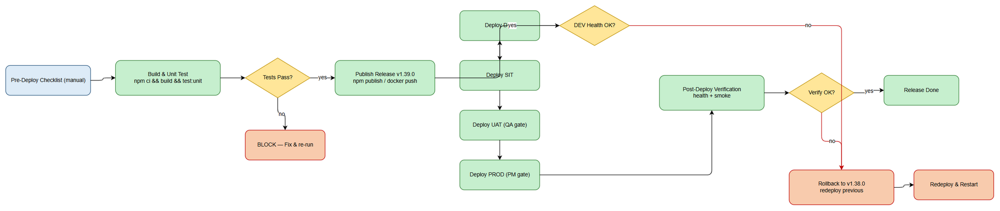
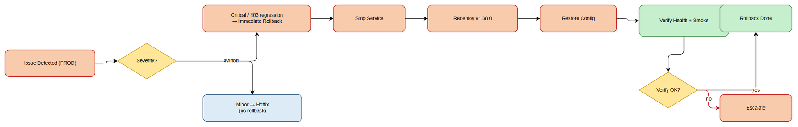

# Deployment Guide (DPG)

## SDLC Agents 4 Enterprise — SA4E-229: Implement jira_download_attachment tool to fix 403 error when fetching attachments

---

## Document Information

| Field | Value |
|-------|-------|
| Jira Ticket | SA4E-229 |
| Title | Implement jira_download_attachment tool to fix 403 error when fetching attachments |
| Author | DevOps Agent |
| Version | 1.0 |
| Date | 2026-08-28 |
| Status | Draft |
| Related TDD | TDD-v1.0-SA4E-229 |

---

## Revision History

| Version | Date | Author | Changes |
|---------|------|--------|---------|
| 1.0 | 2026-08-28 | DevOps Agent | Initiate document — auto-generated from TDD, BRD, STP, STC, TEST-REPORT |

---

## Sign-Off

| Name | Role | Signature and date |
|------|------|--------------------|
| | Dev Lead | ☐ Approved for deployment |
| | QA Lead | ☐ Testing completed |
| | Ops Lead | ☐ Infrastructure ready |

---

## 1. Overview

### 1.1 Feature Summary

SA4E-229 delivers a new MCP tool, `jira_download_attachment`, in the **Code Intelligence MCP Server** (`sdlc-agent-4-enterprise-server`). The tool downloads Jira attachment content using the existing authenticated session (by attachment ID or URL) and returns `content_base64`, `mime_type`, `size_bytes`, and `filename`. It eliminates the `403 Forbidden` error that occurred when agents used unauthenticated `webfetch` to fetch attachment URLs.

### 1.2 Deployment Scope

| Item | Type | Description |
|------|------|-------------|
| `jira_download_attachment` MCP tool | New (compiled into backend) | Added to `backend/src/servers/atlassian/tools/jira-attachment-tools.ts`; registered via `registerJiraAttachmentTools` in `backend/src/servers/atlassian/server.ts`. |
| Backend build artifact (`dist/`) | Modified | Rebuilt from TypeScript; the tool is bundled into the published package. |
| Database | No change | TDD §4 — no persistent DB required for this tool. |
| Configuration | No new variables | Reuses existing `JIRA_*` auth + `NODE_ENV`/`PORT` env. |
| Docker image | Rebuilt (same Dockerfile) | No Dockerfile change required; new image tag `:1.39.0`. |
| VS Code / Kiro Extension | Out of Scope | The extension's in-process Jira attachment tools (`extension/src/mcp/atlassian/jira-attachment-tools.ts`) do NOT yet expose `jira_download_attachment`; the tool is available through the backend MCP server. |

### 1.3 Target Environments

| Environment | URL / Host | Deploy Order | Approval Required |
|-------------|-----------|--------------|-------------------|
| DEV | Local docker-compose / `npx` dev | 1st | No |
| SIT | {SIT_BACKEND_URL} | 2nd | No |
| UAT | {UAT_BACKEND_URL} | 3rd | QA Sign-off |
| PROD | {PROD_BACKEND_URL} | 4th | PM + Business Sign-off |

---

## 2. Prerequisites

### 2.1 Infrastructure

| Requirement | Status | Notes |
|-------------|--------|-------|
| Backend host / container runtime (Docker or Node 20) | Ready | DEV uses docker-compose; SIT/UAT/PROD use the deployed `sdlc-agent-4-enterprise-server` service. |
| Network access to Jira Cloud | Ready | The tool calls `https://<instance>.atlassian.net/secure/attachment/...`. |
| Jira authenticated session | Ready | Existing OAuth/PAT session used by the MCP server (no new secret). |

### 2.2 Software Dependencies

| Dependency | Version | Status |
|-----------|---------|--------|
| Node.js | >= 20 (CI uses 20/22) | Installed in image |
| `sdlc-agent-4-enterprise-server` | 1.38.0 (current) → 1.39.0 (this release) | To be published |
| better-sqlite3 / onnxruntime-node (native) | per package-lock | Built in Dockerfile stages |

### 2.3 Access Requirements

| Access | Type | Who Needs It |
|--------|------|-------------|
| npm publish token (`NPM_TOKEN`) | Secret | Release pipeline (`publish.yml`) |
| Backend host SSH / kubectl / docker | Key-based | DevOps team |
| Jira (read attachments) | OAuth/PAT | MCP server service account |

### 2.4 Backup Requirements

- [x] No database migration — backup not required for this tool.
- [ ] Previous backend artifact retained (npm cache / previous Docker tag `:1.38.0`) for rollback.
- [ ] Configuration backup (existing env file / compose override) captured.

---

## 3. Pre-Deployment Checklist

| # | Item | Responsible | Status |
|---|------|-------------|--------|
| 1 | Code merged to `SA4E-229` branch and CI gate green (`ci-sa4e-229.yml`) | Developer | ☐ |
| 2 | All unit tests passed (`npm run test:unit`) | Developer | ☐ |
| 3 | Integration tests passed — download-attachment IT (8/8) | QA | ☐ |
| 4 | SIT/UAT sign-off obtained | QA + BA | ☐ |
| 5 | Database backup completed | DBA | N/A (no DB change) |
| 6 | Configuration files prepared (no new vars) | DevOps | ☐ |
| 7 | Feature flags configured | Developer | N/A (no flag) |
| 8 | Monitoring/alerting configured | DevOps | ☐ (reuse existing `/health`) |
| 9 | Rollback plan reviewed | Team | ☐ |
| 10 | Deployment window confirmed | PM | ☐ |

---
## 4. Database Migration

### 4.1 Migration Scripts

No database migration is required. Per TDD §4, the `jira_download_attachment` tool is stateless and uses the existing authenticated session; it introduces no tables, columns, or schema changes.

### 4.2 Execution Steps

```bash
# No-op — verify backend connectivity only
curl -fsS http://localhost:48721/health
```

### 4.3 Verification Queries

_N/A — no schema to verify._

### 4.4 Rollback Scripts

_N/A — no schema to roll back._

---

## 5. Application Deployment

### 5.1 Deployment Flow



### 5.2 Deployment Steps

The backend is delivered as an npm package (default) and as a Docker image. Choose the path that matches the target environment's runtime.

#### Path A — npm-based (default, per README)

| Step | Action | Command | Verification |
|------|--------|---------|-------------|
| 1 | Build backend | `cd backend && npm ci && npm run build` | `dist/index.js` produced |
| 2 | Run unit + integration tests | `npm run test:unit && npm run test:integration` | 0 failures |
| 3 | Publish release | `npm publish --access public` (via `publish.yml` on tag `v1.39.0`) | Package `sdlc-agent-4-enterprise-server@1.39.0` on npm |
| 4 | Update running service | `npm install -g sdlc-agent-4-enterprise-server@1.39.0` (or `npx sdlc-agent-4-enterprise-server@1.39.0`) | version reported by `npx sdlc-agent-4-enterprise-server --version` |
| 5 | Restart service | `systemctl restart sa4e-backend` (or `pm2 restart sa4e-backend`, or docker restart) | process up |
| 6 | Health check | `curl -fsS http://localhost:48721/health` | `200 OK` |

#### Path B — Docker-based

| Step | Action | Command | Verification |
|------|--------|---------|-------------|
| 1 | Build image | `docker build -f backend/Dockerfile -t <registry>/sdlc-agent-4-enterprise-server:1.39.0 --target production backend` | image built |
| 2 | Push image | `docker push <registry>/sdlc-agent-4-enterprise-server:1.39.0` | pushed |
| 3 | Redeploy | `docker pull <registry>/sdlc-agent-4-enterprise-server:1.39.0 && docker stop sa4e-backend && docker rm sa4e-backend && docker run -d --name sa4e-backend -p 48721:48721 -e NODE_ENV=production <registry>/sdlc-agent-4-enterprise-server:1.39.0` | container running |
| 4 | Health check | `docker inspect --format='{{.State.Health.Status}}' sa4e-backend` | `healthy` |

> The existing `backend/Dockerfile` already implements a multi-stage build and a `HEALTHCHECK` on `/health` (port 48721). **No Dockerfile change is needed** for this ticket — only a new image tag.

### 5.3 Docker Deployment (reference)

```bash
# Existing Dockerfile supports these targets:
#   production  — multi-stage, non-root, /health healthcheck
#   development — tsx watch hot reload
#   test        — runs vitest inside container
docker build -f backend/Dockerfile -t sdlc-agent-4-enterprise-server:1.39.0 --target production backend
```

---

## 6. Configuration Changes

### 6.1 New Environment Variables

| Variable | Description | DEV | SIT | UAT | PROD |
|----------|-------------|-----|-----|-----|------|
| — | No new variables introduced | — | — | — | — |

The tool reuses the existing Jira authentication configuration already consumed by `jira_get_attachments` / `jira_attach_file`. No new secrets are required.

### 6.2 Application Properties Changes

| Property | Old Value | New Value | File |
|----------|-----------|-----------|------|
| (none) | N/A | N/A | N/A |

### 6.3 Feature Flags

| Flag | DEV | SIT | UAT | PROD |
|------|-----|-----|-----|------|
| (none) | N/A | N/A | N/A | N/A |

---

## 7. Post-Deployment Verification

### 7.1 Health Checks

| Check | Endpoint/Command | Expected Result | Timeout |
|-------|-----------------|-----------------|---------|
| Application health | `GET /health` | `200 OK`, `status: UP` | 30s |
| Tool registered | MCP `tools/list` includes `jira_download_attachment` | present | 10s |

### 7.2 Smoke Tests

| # | Scenario | Steps | Expected Result |
|---|----------|-------|-----------------|
| 1 | Download by valid ID | Invoke `jira_download_attachment` with a known `attachment_id` via MCP client | `200`, `content_base64` + `mime_type` + `filename` present, no 403 |
| 2 | Download by valid URL | Invoke with `attachment_url` from `jira_get_attachments` | content matches, no 403 |
| 3 | 403 regression | Confirm tool uses auth headers (no 403) | no 403 Forbidden |
| 4 | Regression — `jira_get_attachments` still works | Invoke `jira_get_attachments` | unchanged behaviour |

> Automated equivalent: backend integration suite `jira-download-attachment-tool.it.test.ts` (8/8) + `integration-jira-download-attachment.test.ts`. Run `npm run test:integration` against the deployed build as a release gate.

### 7.3 Log Verification

| Log Entry | Level | Expected | Location |
|-----------|-------|----------|----------|
| Backend start / module ready | INFO | Within 60s of start | stdout (container) / `sa4e-backend.log` |
| Tool call start/end (size, mime) | INFO | After each call | stdout / log file |
| Error (4xx/5xx) | ERROR | Only on invalid input | stdout / log file |

Per TDD §9, **attachment content is never logged** (only metadata: size, mime, error codes).

### 7.4 Monitoring Dashboard

- [ ] `/health` reports `UP` across DEV→SIT→UAT→PROD
- [ ] Error rate within normal range (no spike after deploy)
- [ ] Response time < 5s for attachments < 10MB (NFR, BRD §6)
- [ ] No unexpected alerts triggered

---

## 8. Rollback Plan

### 8.1 Rollback Flow



### 8.2 Rollback Decision Criteria

| Condition | Action |
|-----------|--------|
| Health check fails after deploy (service down) | Immediate rollback |
| `403` regression reappears / tool errors > 5% | Immediate rollback |
| Smoke test fails (cannot download by ID/URL) | Immediate rollback |
| Performance degradation > 50% | Immediate rollback |
| Minor issue, workaround available | Hotfix — no rollback |

### 8.3 Rollback Steps

| Step | Action | Command | Verification |
|------|--------|---------|-------------|
| 1 | Stop new version | `systemctl stop sa4e-backend` (or `docker stop sa4e-backend`) | service stopped |
| 2 | Redeploy previous version | `npm install -g sdlc-agent-4-enterprise-server@1.38.0` (or `docker run ...:1.38.0`) | previous binary/image active |
| 3 | Restart service | `systemctl start sa4e-backend` (or `docker start sa4e-backend`) | process up |
| 4 | Restore configuration | (no config change — skip) | N/A |
| 5 | Verify rollback | `curl -fsS http://localhost:48721/health` + `tools/list` no longer shows `jira_download_attachment` | `200 OK` |

> No database rollback is needed (no schema change).

### 8.4 Rollback Time Estimate

| Action | Estimated Time |
|--------|---------------|
| Stop service | 1 min |
| Redeploy previous version | 3–5 min (npm install / docker pull) |
| Restart + verification | 2 min |
| **Total** | **~6–8 min** |

---

## 9. Environment-Specific Notes

### 9.1 DEV
- Run via `docker compose -f backend/docker-compose.yml up` or `npm run dev` in `backend`.
- Validate with `npm run test:integration` (download-attachment IT).

### 9.2 SIT
- Deploy via Path A or B to the SIT backend host.
- No approval required; QA sign-off gates UAT.

### 9.3 UAT
- Requires QA sign-off before deploy.
- Validate user stories TC-001/002/202 (download by ID/URL, 403 fix).

### 9.4 PROD
- **Deployment Window:** coordinated with PM; off-peak hours.
- **Approval Required From:** PM + Business Owner.
- **Communication Plan:** Notify DevOps channel before/after; post in release channel.
- **On-Call Contact:** {ON_CALL_DEVOPS}.

---

## 10. Appendix

### Contacts

| Role | Name | Contact |
|------|------|---------|
| DevOps Lead | {Name} | {Email/Phone} |
| DBA | {Name} | {Email/Phone} |
| On-Call Dev | {Name} | {Email/Phone} |

### Related Tickets

| Ticket | Summary | Relationship |
|--------|---------|-------------|
| SA4E-229 | Implement jira_download_attachment tool to fix 403 error when fetching attachments | Main ticket |

### CI/CD Reference

- Per-ticket gate: `.github/workflows/ci-sa4e-229.yml` (install → lint → line-count → build → unit + integration → docker build → audit).
- Release pipeline: `.github/workflows/publish.yml` (triggered on `v*` tag → npm publish + VSIX).
- Main CI: `.github/workflows/ci.yml`.
