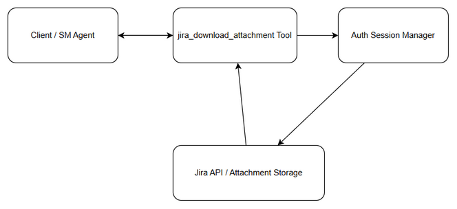
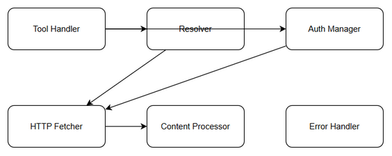
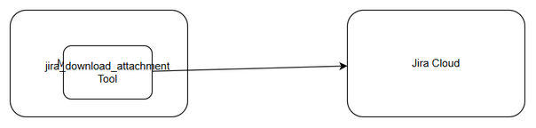
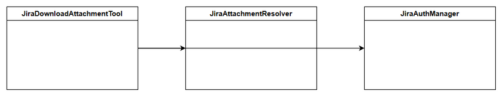
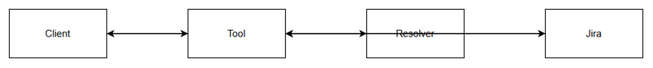

# Technical Design Document (TDD)

## JiraAssist Extension — SA4E-229: Implement jira_download_attachment tool to fix 403 error when fetching attachments

---

## Document Information

| Field | Value |
|-------|-------|
| Jira Ticket | SA4E-229 |
| Title | Implement jira_download_attachment tool to fix 403 error when fetching attachments |
| Author | SA Agent |
| Version | 1.0 |
| Date | 2026-08-28 |
| Status | Draft |
| Related BRD | BRD-v1.0-SA4E-229 |
| Related FSD | FSD not available |

## 1. Introduction

### 1.1 Purpose
Design the `jira_download_attachment` MCP tool to download Jira attachment content using existing authenticated session, eliminating 403 Forbidden errors from unauthenticated webfetch calls.

### 1.2 Scope
Technical scope covers tool implementation within SDLC Agents orchestration layer: request validation, ID-to-URL resolution, authenticated HTTP fetch, content processing, error handling.

## 2. System Architecture

### 2.1 Architecture Overview

### 2.2 Component Diagram

### 2.3 Deployment Architecture

## 3. API Design

Tool input: attachment_id or attachment_url. Output: content base64/text, mime_type, size_bytes, filename.

## 4. Database Design
No persistent DB required.

## 5. Class / Module Design

## 6. Integration Design

## 7. Security Design
Reuse existing authenticated session. No credential leakage.

## 8. Performance & Scalability
Response time <5s for attachments <10MB.

## 9. Monitoring & Observability
Log start/end, size, mime, error codes. Never log content.

## 10. Deployment
Tool added to existing MCP server.

## Diagrams
- Architecture: diagrams/architecture.drawio
- Component: diagrams/component.drawio
- Deployment: diagrams/deployment.drawio
- API Sequence: diagrams/api-sequence-download.drawio
- Class: diagrams/class-diagram.drawio
- DB Schema: diagrams/db-schema.drawio
