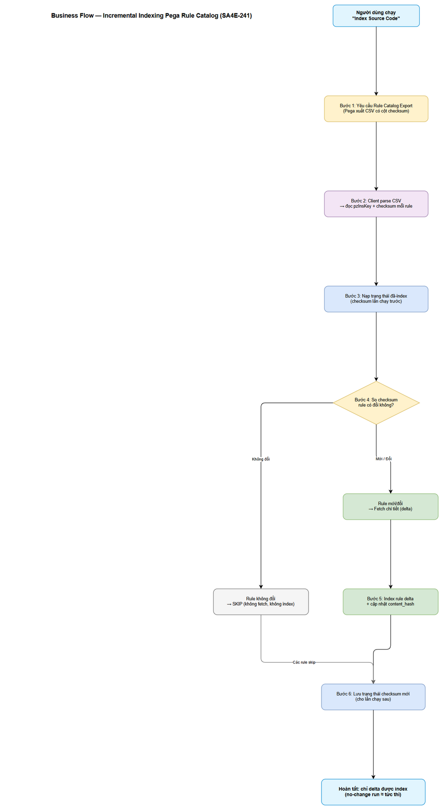
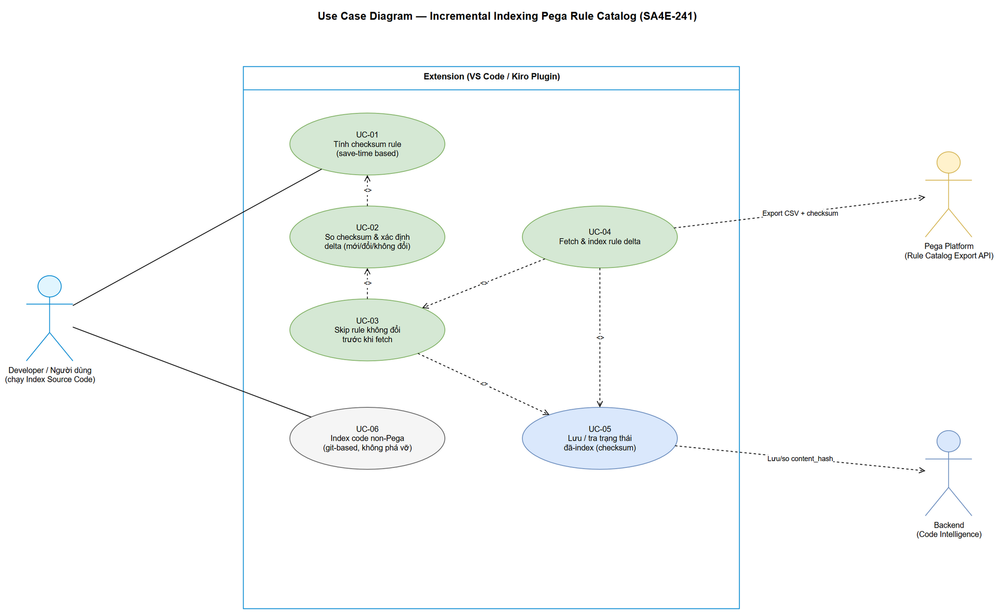

# Business Requirements Document (BRD)

## SDLC-Agents-4-Enterprise / Code Intelligence Extension — SA4E-241: Incremental Indexing cho Pega Rule Catalog (skip rule không đổi bằng checksum, save-time based)

---

## Document Information

| Field | Value |
|-------|-------|
| Jira Ticket | SA4E-241 |
| Title | Incremental indexing cho Pega Rule Catalog — skip rule không đổi bằng checksum (save-time based) |
| Author | BA Agent |
| Version | 1.0 |
| Date | 2026-04-30 |
| Status | Draft |
| Kiến trúc | Plugin / Extension (VS Code / Kiro) + Monolith backend |

---

## Author Tracking

| Role | Name - Position | Responsibility |
|------|-----------------|----------------|
| Author | BA Agent – Business Analyst | Create document |
| Peer Reviewer | TA Agent – Technical Architect | Review document (Specification phase) |

---

## Revision History

| Version | Date | Author | Changes |
|---------|------|--------|---------|
| 1.0 | 2026-04-30 | BA Agent | Khởi tạo tài liệu — tổng hợp từ Jira ticket SA4E-241 và REFERENCE-ANALYSIS.md (Git / Bazel / salsa+gopls) |

---

## Sign-Off

| Name | Signature and date |
|------|--------------------|
| | ☐ I agree and confirm all criteria on this BRD as expected requirements |
| | ☐ I agree and confirm all criteria on this BRD as expected requirements |

---

## 1. Introduction

### 1.1 Scope

Extension "Code Intelligence" (VS Code / Kiro plugin) hiện có command **"Index Source Code"**. Đối với dự án Pega, command này index khoảng **17,978 rule** thông qua tính năng **Rule Catalog Export** (POC đã hoạt động). Vấn đề: **mỗi lần chạy đều fetch lại TOÀN BỘ rule** dù phần lớn rule không thay đổi → mất nhiều phút cho mỗi lần index.

Change request này bổ sung cơ chế **incremental indexing (index tăng dần)**: chỉ **fetch và index những rule MỚI hoặc ĐÃ THAY ĐỔI**, bỏ qua (skip) rule không đổi. Cơ chế phát hiện thay đổi dựa trên **checksum** tính từ **save-time** của rule.

Phạm vi thay đổi ở mức nghiệp vụ:

1. **Checksum tính ở phía extension (client).** Backend chỉ **lưu và so sánh** checksum, KHÔNG tự tính.
2. **Phía Pega:** file CSV rule catalog xuất ra được bổ sung cột `checksum`, với giá trị = `sha256_hex( utf8( trim(pzInsKey) + "|" + trim(pxUpdateDateTime ?? "") + "|" + trim(pxSaveDateTime ?? "") ) )` — hex chữ thường, dấu phân tách `|`, giá trị null quy về chuỗi rỗng `""`, giữ nguyên chuỗi timestamp. Lưu ý field đúng là **`pxUpdateDateTime`** (prefix `px`), KHÔNG phải `pyUpdateDateTime`. Việc phát hiện thay đổi dựa trên save-time bảo đảm bắt được cả **data rule** (loại rule mà `pzInsKey` không chứa timestamp).
3. **Code thường (non-Pega):** dùng **git blob hash per-file** làm checksum; khi không có git thì fallback `sha256(relativePath + NUL + fileContent)`.
4. **Backend tái dùng cột `content_hash`** để chứa checksum mới (thay cho ngữ nghĩa hash full-JSON cũ — vốn tốn kém, không cần thiết cho Pega).
5. **Skip trước fetch:** client parse CSV → so checksum với trạng thái đã index → **chỉ fetch phần delta** (rule mới/đổi).

### 1.2 Out of Scope

- Không thay đổi thuật toán index cốt lõi (AST parsing, symbol extraction, enrichment) — chỉ thêm lớp lọc delta phía trước.
- Không thay đổi luồng index code non-Pega hiện tại về mặt hành vi (chỉ tái xác nhận checksum = git blob hash, giữ tương thích).
- Không xây dựng UI mới; command "Index Source Code" giữ nguyên điểm khởi động.
- **Quyết định nguồn lưu trạng thái đã-index** (Backend bulk-check vs Client-side cache) — nêu như Open Decision / dependency; **SA sẽ chốt trong TDD** (xem mục 3 và 5.2).

### 1.3 Preliminary Requirement

- Tính năng **Rule Catalog Export API** của Pega phải được nâng cấp để **xuất thêm cột `checksum`** trong CSV, dựa trên `pxUpdateDateTime` và `pxSaveDateTime` (xem mục 3 — Dependencies).
- POC hiện có của Rule Catalog Export và luồng index Pega/non-Pody đang hoạt động (các file liên quan liệt kê ở mục 8).

---

## 2. Business Requirements

### 2.1 High Level Process Map

Khi người dùng chạy **"Index Source Code"**, hệ thống thực hiện luồng tăng dần: yêu cầu Pega xuất CSV (đã có cột `checksum`) → client parse CSV → nạp trạng thái checksum của lần index trước → so sánh từng rule → **skip** rule không đổi và **fetch + index** rule mới/đổi → lưu lại trạng thái checksum mới cho lần chạy sau. Nhờ đó, lần index thứ hai (khi không có rule nào đổi) gần như tức thì. Chi tiết luồng xem mục 2.3.

### 2.2 List of User Stories / Use Cases

| # | Story / Use Case / Epic | Priority | Source Ticket |
|---|-------------------------|----------|---------------|
| 1 | Là **Developer**, tôi muốn lần index thứ 2 (không có rule đổi) hoàn tất gần như tức thì, để tôi không phải chờ nhiều phút mỗi lần đồng bộ. | MUST HAVE | SA4E-241 |
| 2 | Là **Developer**, tôi muốn rule nào bị cập nhật (đổi save-time) sẽ được fetch và index lại đầy đủ, để dữ liệu index luôn phản ánh đúng trạng thái Pega. | MUST HAVE | SA4E-241 |
| 3 | Là **Developer** làm việc với **data rule** (không có timestamp trong `pzInsKey`), tôi muốn thay đổi của data rule vẫn được phát hiện qua save-time, để không bị bỏ sót. | MUST HAVE | SA4E-241 |
| 4 | Là **Developer** dự án hỗn hợp (Pega + code thường), tôi muốn luồng index code non-Pega (git-based) không bị ảnh hưởng, để tính năng hiện tại vẫn ổn định. | MUST HAVE | SA4E-241 |
| 5 | Là **Nhóm vận hành**, tôi muốn trạng thái "đã index" (checksum) được lưu bền vững giữa các lần chạy, để cơ chế incremental hoạt động đúng qua nhiều phiên. | SHOULD HAVE | SA4E-241 |

---

### 2.3 Details of User Stories

---

#### Business Flow

**Step 1:** Người dùng chạy command **"Index Source Code"** trong extension.

**Step 2:** Extension yêu cầu Pega thực hiện **Rule Catalog Export**; Pega xuất CSV trong đó **mỗi rule có cột `checksum`** (tính từ `pzInsKey` + `pxUpdateDateTime` + `pxSaveDateTime`).

**Step 3:** Extension (client) **parse CSV**, đọc `pzInsKey` và `checksum` của từng rule.

**Step 4:** Extension **nạp trạng thái đã-index** (tập checksum đã lưu ở lần chạy trước) từ nguồn lưu trạng thái (Open Decision — xem mục 3).

**Step 5:** Với mỗi rule, extension **so checksum** hiện tại với checksum đã lưu:
- Nếu **giống** → rule không đổi → **SKIP** (không fetch, không index lại).
- Nếu **khác hoặc chưa từng có** (rule mới) → đưa vào tập **delta**.

**Step 6:** Extension **fetch chi tiết** chỉ cho các rule trong tập delta, rồi **index** và **cập nhật `content_hash`** (chứa checksum mới) ở backend.

**Step 7:** Extension **lưu trạng thái checksum mới** (bao gồm cả rule bị skip và rule vừa index) cho lần chạy sau.

**Step 8:** Đối với **code non-Pega**, extension tiếp tục dùng **git blob hash per-file** (fallback `sha256(relativePath + NUL + content)`) theo luồng git-based hiện có — không thay đổi hành vi.

> **Note:** Việc "skip trước fetch" là điểm mấu chốt để đạt hiệu năng: quyết định bỏ qua được đưa ra **trước** khi tốn công fetch chi tiết rule (theo mô hình skip-before-work của Bazel và stat-cache của Git — xem REFERENCE-ANALYSIS.md).



---

#### STORY 1: Lần index thứ 2 gần như tức thì (no-change run)

> Là **Developer**, tôi muốn lần index thứ 2 (không có rule đổi) hoàn tất gần như tức thì, để tôi không phải chờ nhiều phút mỗi lần đồng bộ.

**Requirement Details:**

1. Sau khi index đầy đủ lần đầu, trạng thái checksum của toàn bộ rule được lưu lại.
2. Ở lần chạy tiếp theo, nếu **không có rule nào thay đổi**, extension so checksum và **skip toàn bộ** — không fetch chi tiết rule nào.
3. Việc so sánh diễn ra trên tập checksum (rẻ), không cần fetch nội dung rule.

**Acceptance Criteria:**

1. Với tập ~17,978 rule không đổi, lần index thứ 2 **skip ~100%** số rule (không fetch chi tiết rule nào).
2. Thời gian hoàn tất lần index thứ 2 (no-change run) **giảm rõ rệt so với lần đầu** và ở mức "gần như tức thì" (đo bằng % rule được skip và thời gian tổng — chỉ tiêu định lượng chốt ở NFR mục 6).
3. Kết quả index sau lần chạy thứ 2 **không thay đổi** so với sau lần đầu (idempotent: chạy lại trên dữ liệu không đổi không phát sinh thay đổi index).

---

#### STORY 2: Rule bị cập nhật được fetch và index lại

> Là **Developer**, tôi muốn rule nào bị cập nhật (đổi save-time) sẽ được fetch và index lại đầy đủ, để dữ liệu index luôn phản ánh đúng trạng thái Pega.

**Requirement Details:**

1. Khi một rule bị chỉnh sửa/lưu trên Pega, `pxSaveDateTime` (và/hoặc `pxUpdateDateTime`) thay đổi → `checksum` thay đổi.
2. Extension phát hiện checksum khác → đưa rule vào tập delta → fetch chi tiết → index lại → cập nhật `content_hash`.

**Data Fields:**

| Field | Type | Required | Description | Example |
|-------|------|----------|-------------|---------|
| pzInsKey | String | Yes | Khóa định danh rule trong Pega | RULE-OBJ-... |
| pxUpdateDateTime | String (timestamp) | No | Thời điểm cập nhật rule (prefix `px`) | 20260430T101500.000 GMT |
| pxSaveDateTime | String (timestamp) | No | Thời điểm lưu rule | 20260430T101500.000 GMT |
| checksum | String (sha256 hex) | Yes | `sha256_hex(trim(pzInsKey)\|trim(pxUpdateDateTime)\|trim(pxSaveDateTime))`, hex thường | 9f2c... (64 ký tự) |

**Acceptance Criteria:**

1. Khi một rule đổi `pxSaveDateTime` hoặc `pxUpdateDateTime`, rule đó **được fetch lại và index lại** ở lần chạy kế tiếp.
2. Rule mới (chưa từng có trong trạng thái đã-index) **được fetch và index**.
3. Rule không đổi trong cùng lần chạy đó **vẫn được skip** (chỉ delta được xử lý).
4. Không có rule đổi nào bị **bỏ sót** (no false-negative) — mọi thay đổi save-time đều dẫn tới re-index.

---

#### STORY 3: Phát hiện thay đổi cho data rule (không có timestamp trong khóa)

> Là **Developer** làm việc với data rule, tôi muốn thay đổi của data rule vẫn được phát hiện qua save-time, để không bị bỏ sót.

**Requirement Details:**

1. Với data rule, `pzInsKey` **không chứa timestamp**, nên không thể dựa vào việc so key để phát hiện đổi.
2. Vì `checksum` **gộp cả `pxSaveDateTime`/`pxUpdateDateTime`**, thay đổi save-time vẫn làm checksum đổi → phát hiện được.

**Acceptance Criteria:**

1. Khi một **data rule** được lưu lại (save-time đổi) mà `pzInsKey` không đổi, checksum vẫn thay đổi và rule **được index lại**.
2. Data rule không đổi vẫn được **skip** như rule thường.

---

#### STORY 4: Không phá vỡ luồng index code non-Pega (git-based)

> Là **Developer** dự án hỗn hợp, tôi muốn luồng index code non-Pega không bị ảnh hưởng, để tính năng hiện tại vẫn ổn định.

**Requirement Details:**

1. Code non-Pega tiếp tục dùng **git blob hash per-file** làm checksum.
2. Khi không có git, dùng fallback `sha256(relativePath + NUL + fileContent)`.
3. Cột `content_hash` ở backend được tái dùng cho cả hai loại (Pega checksum & non-Pega hash) — cùng cơ chế so sánh.

**Acceptance Criteria:**

1. Index code non-Pega cho kết quả **không đổi về hành vi** so với trước change request (regression pass).
2. Cơ chế skip-if-unchanged áp dụng nhất quán: file non-Pega không đổi (cùng git blob hash) cũng được skip.

---

#### STORY 5: Lưu trạng thái đã-index bền vững giữa các lần chạy

> Là **Nhóm vận hành**, tôi muốn trạng thái "đã index" (checksum) được lưu bền vững giữa các lần chạy, để cơ chế incremental hoạt động đúng qua nhiều phiên.

**Requirement Details:**

1. Trạng thái checksum của tất cả rule (sau mỗi lần index) phải được lưu lại để lần chạy sau so sánh.
2. Nguồn lưu trạng thái là **Open Decision** (Backend bulk-check vs Client-side cache đĩa) — xem mục 3 và 5.2; SA chốt ở TDD.

**Acceptance Criteria:**

1. Sau khi tắt/mở lại extension (phiên mới), lần index kế tiếp vẫn tận dụng được trạng thái đã lưu để skip rule không đổi.
2. Trạng thái lưu trữ phản ánh **đầy đủ** tập rule đã index (bao gồm rule bị skip lẫn rule vừa index).

---

## 3. Dependencies

| Dependency | Type | Related Ticket | Description |
|------------|------|----------------|-------------|
| Nâng cấp Rule Catalog Export API (Pega) | External / Compliance | SA4E-241 | CSV export PHẢI thêm cột `checksum` và bảo đảm có dữ liệu `pxSaveDateTime` + `pxUpdateDateTime` (prefix `px`). Checksum tính đúng công thức để client verify lại (Cách A + Cách B). |
| Nguồn lưu trạng thái đã-index — **Open Decision** | System (Architecture) | SA4E-241 | **Phương án 1 — Backend bulk-check:** thêm cột `pega_ins_key` + endpoint mới để client bulk-check checksum theo `pzInsKey` (mô hình FindMissingBlobs của Bazel). **Phương án 2 — Client-side cache đĩa:** `.pega-cache/rulecatalog-checksums.json` (mô hình `.git/index`). SA chốt trong TDD. |
| Tái dùng cột `content_hash` (Backend) | System | SA4E-241 | Backend dùng cột `content_hash` hiện có để lưu checksum mới (bỏ ngữ nghĩa hash full-JSON cũ). Cần bảo đảm tương thích với luồng non-Pega. |
| POC Rule Catalog Export & luồng index hiện có | System | SA4E-241 | Các file client/backend liệt kê ở mục 8 là nền tảng để mở rộng. |
| Git khả dụng cho code non-Pega | Infrastructure | SA4E-241 | Cần git để lấy blob hash; nếu không có → fallback sha256(path+NUL+content). |

---

## 4. Stakeholders

| Role | Name / Team | Responsibility | Source |
|------|-------------|----------------|--------|
| Reporter | Duc Nguyen Minh | Đề xuất, làm rõ yêu cầu nghiệp vụ | Jira reporter |
| Assignee | (chưa gán) | Thực hiện change request | Jira assignee |
| Business Analyst | BA Agent | Viết BRD/FSD | Pipeline |
| Solution Architect | SA Agent | Thiết kế TDD, chốt Open Decision | Pipeline |
| Đội Pega Platform | Team Pega | Nâng cấp Rule Catalog Export API (cột checksum) | Dependency |
| Đội Extension/Backend | Team Code Intelligence | Triển khai logic delta + lưu trạng thái | Dependency |

---

## 5. Risks and Assumptions

### 5.1 Risks

| Risk | Impact | Likelihood | Mitigation |
|------|--------|------------|------------|
| Độ phân giải timestamp không đủ (thay đổi trong cùng đơn vị thời gian không đổi save-time) → bỏ sót re-index | High | Low | Bài học "racy-git": checksum gộp nhiều trường giảm thiểu; ghi rõ giả định về độ tin cậy trong NFR; SA cân nhắc bổ sung trường vào checksum nếu cần. |
| Công thức checksum ở Pega và client lệch nhau (trim, null→"", encoding, separator) → toàn bộ rule bị coi là "đổi" | High | Medium | Định nghĩa công thức deterministic thống nhất (mục 1.1); client verify lại (Cách A + Cách B); có test đối chiếu. |
| Cache client-side (nếu chọn P2) bị lệch giữa nhiều máy/nhiều user → drift trạng thái | Medium | Medium | Nêu rõ trade-off trong Open Decision; SA cân nhắc P1 (bulk-check backend) hoặc hybrid. |
| Tái dùng `content_hash` làm hỏng dữ liệu non-Pega cũ (khác ngữ nghĩa) | Medium | Low | Regression test luồng non-Pega; migration/backfill nếu cần (SA quyết ở TDD). |
| Field nhầm `pyUpdateDateTime` thay vì `pxUpdateDateTime` | Medium | Low | Ghi rõ trong BRD/FSD; test kiểm tra tên field chính xác. |

### 5.2 Assumptions

- Checksum được **tính ở client**; backend chỉ **lưu + so** (không tính).
- Công thức checksum: `sha256_hex(trim(pzInsKey) + "|" + trim(pxUpdateDateTime ?? "") + "|" + trim(pxSaveDateTime ?? ""))`, hex chữ thường, null → `""`.
- `pxUpdateDateTime`/`pxSaveDateTime` phản ánh trung thực thời điểm rule thay đổi trên Pega.
- Quyết định nguồn lưu trạng thái (P1 vs P2) sẽ do **SA chốt ở TDD** dựa trên trade-off multi-machine drift vs đơn giản/offline.
- Số lượng rule (~17,978) và loại rule (bao gồm data rule) đại diện cho tải thực tế cần tối ưu.

---

## 6. Non-Functional Requirements

| Category | Requirement | Details |
|----------|-------------|---------|
| Performance (Hiệu năng) | Lần index thứ 2 (no-change) gần như tức thì | Với ~17,978 rule không đổi: **skip ~100%** (không fetch chi tiết rule nào). Thời gian giảm mạnh so với lần đầu (mục tiêu: từ "nhiều phút" xuống mức chỉ còn thời gian export + parse + so checksum). |
| Performance | So sánh delta rẻ | Việc phát hiện delta dựa trên so tập checksum, không cần tải nội dung rule (skip-before-fetch). |
| Reliability (Độ tin cậy) | Không bỏ sót rule đổi (no false-negative) | Mọi thay đổi save-time (`pxSaveDateTime`/`pxUpdateDateTime`) — kể cả data rule — PHẢI dẫn tới re-index. |
| Reliability | Idempotency | Chạy index nhiều lần trên tập không đổi cho kết quả index như nhau; không phát sinh công việc thừa. |
| Compatibility (Tương thích) | Không phá vỡ luồng code non-Pega | Index git-based giữ nguyên hành vi; `content_hash` tái dùng nhất quán cho cả Pega & non-Pega. |
| Maintainability | Công thức checksum deterministic & thống nhất | Cùng một công thức được dùng ở Pega và client; dễ verify, dễ test. |
| Persistence | Trạng thái đã-index bền vững | Trạng thái checksum tồn tại qua các phiên chạy (P1 hoặc P2 — SA chốt). |

> Chỉ tiêu định lượng chính: **% rule được skip ở no-change run ≈ 100%** và **thời gian no-change run giảm rõ rệt** so với full run. Ngưỡng thời gian tuyệt đối cụ thể sẽ được xác nhận cùng đội kỹ thuật ở giai đoạn thiết kế/kiểm thử.

---

## 7. Related Tickets

| Ticket Key | Summary | Status | Type | Relationship |
|------------|---------|--------|------|--------------|
| SA4E-241 | Incremental indexing cho Pega Rule Catalog — skip rule không đổi bằng checksum (save-time based) | In Progress | Story | Main ticket |

---

## 8. Appendix

### 8.1 Công thức Checksum (nghiệp vụ)

**Pega rule:**
```
checksum = sha256_hex( utf8( trim(pzInsKey) + "|" + trim(pxUpdateDateTime ?? "") + "|" + trim(pxSaveDateTime ?? "") ) )
```
- Hex chữ thường; separator `|`; null → `""`; giữ nguyên chuỗi timestamp.
- Field đúng: **`pxUpdateDateTime`** (prefix `px`), KHÔNG phải `pyUpdateDateTime`.

**Code non-Pega:**
```
checksum = git_blob_hash(file)        // ưu tiên
fallback = sha256(relativePath + NUL + fileContent)   // khi không có git
```

### 8.2 Files liên quan (từ POC — tham chiếu, SA/DEV dùng ở phase sau)

**Extension (client):**
- `extension/src/services/PegaCatalogIndexer.ts`
- `extension/src/services/PegaCatalogCsvParser.ts`
- `extension/src/services/PegaRuleCatalogClient.ts`
- `extension/src/services/PegaCatalogDownloader.ts`
- `extension/src/models/PegaCatalogModels.ts`

**Backend (monolith):**
- `PegaSymbolSync.ts` (`content_hash`)
- `pega-api.ts` (crawl-plan bulk-check)
- `PegaIndexer.checkRuleChecksum`

### 8.3 Prior-art (từ REFERENCE-ANALYSIS.md)

| Pattern | Prior-art | Áp dụng SA4E-241 |
|---------|-----------|------------------|
| Skip-before-work / two-tier detection | Git stat-cache, Bazel skip-before-work | Skip rule dựa trên checksum TRƯỚC khi fetch |
| Bulk change lookup | Bazel FindMissingBlobs | Phương án 1 (backend bulk-check theo pzInsKey) |
| Persistent index state | Git `.git/index` | Phương án 2 (`.pega-cache/rulecatalog-checksums.json`) |
| Hash-based invalidation | gopls, salsa | Data rule không timestamp vẫn bắt đổi qua checksum gộp save-time |

### Glossary

| Term | Definition |
|------|------------|
| Rule Catalog Export | Tính năng của Pega xuất toàn bộ danh mục rule ra file CSV (đóng gói zip). |
| Checksum | Giá trị sha256 hex nhận diện thay đổi của một rule; tính từ khóa + save-time. |
| Delta | Tập rule mới hoặc đã thay đổi cần fetch + index (khác với tập rule bị skip). |
| pzInsKey | Khóa định danh instance rule trong Pega. |
| pxSaveDateTime / pxUpdateDateTime | Trường thời điểm lưu/cập nhật rule (prefix `px`). |
| content_hash | Cột ở backend tái dùng để lưu checksum mới (Pega) hoặc git blob hash (non-Pega). |
| Skip-before-fetch | Quyết định bỏ qua rule không đổi TRƯỚC khi tốn công fetch chi tiết. |
| Data rule | Loại rule mà `pzInsKey` không chứa timestamp; phát hiện đổi qua save-time. |

### Reference Documents

| Document | Link / Location |
|----------|-----------------|
| Reference Analysis | documents/SA4E-241/REFERENCE-ANALYSIS.md |
| Rule Catalog Export API Usage | documents/API-USAGE.md |
| Jira Ticket | https://jiraassist.atlassian.net/browse/SA4E-241 |

### Diagram Index

| # | Diagram | Image | Source (editable) |
|---|---------|-------|-------------------|
| 1 | Business Flow — Incremental Indexing | [business-flow.png](diagrams/business-flow.png) | [business-flow.drawio](diagrams/business-flow.drawio) |
| 2 | Use Case Diagram | [use-case.png](diagrams/use-case.png) | [use-case.drawio](diagrams/use-case.drawio) |

---

## Use Case Diagram


