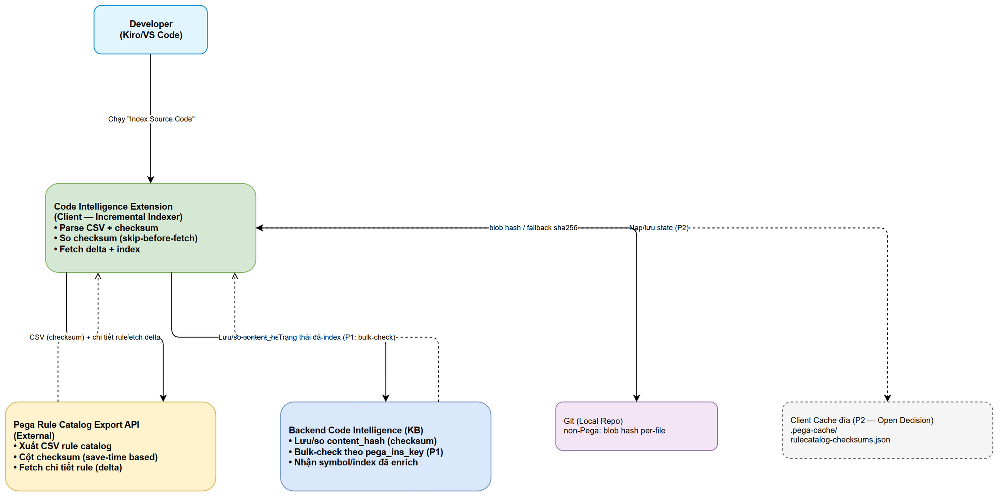
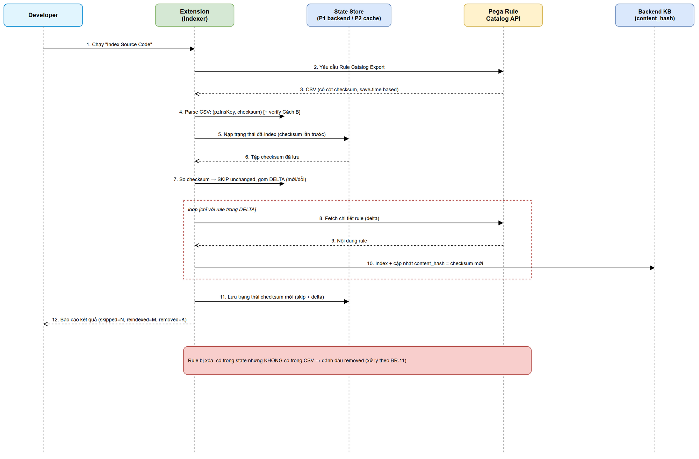
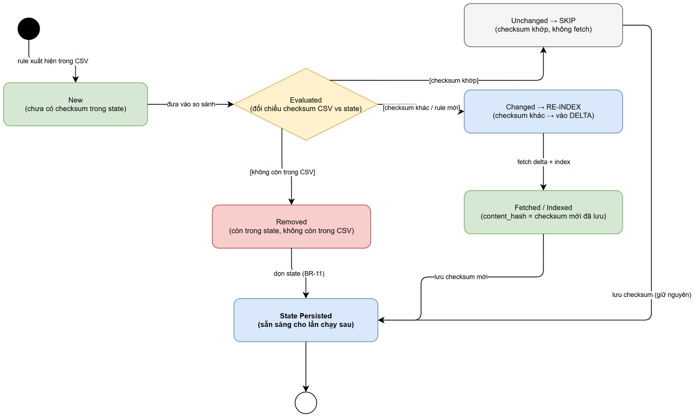

# Functional Specification Document (FSD)

## SDLC-Agents-4-Enterprise / Code Intelligence Extension — SA4E-241: Incremental Indexing cho Pega Rule Catalog (skip rule không đổi bằng checksum, save-time based)

---

## Document Information

| Field | Value |
|-------|-------|
| Jira Ticket | SA4E-241 |
| Title | Incremental indexing cho Pega Rule Catalog — skip rule không đổi bằng checksum (save-time based) |
| Author | BA Agent |
| Version | 1.0 (Draft — business/functional) |
| Date | 2026-04-30 |
| Status | Draft |
| Kiến trúc | Plugin / Extension (VS Code / Kiro) + Monolith backend |
| Related BRD | BRD-v1-SA4E-241.docx |

---

## Author Tracking

| Role | Name - Position | Responsibility |
|------|-----------------|----------------|
| Author | BA Agent – Business Analyst | Viết phần business/functional (Use Cases, Business Rules, Data Specs, Error Handling) |
| Enricher | TA Agent – Technical Architect | Bổ sung phần technical (API contracts chi tiết, integration, pseudocode) |

---

## Revision History

| Version | Date | Author | Changes |
|---------|------|--------|---------|
| 1.0 | 2026-04-30 | BA Agent | Khởi tạo FSD draft từ BRD v1.0 và REFERENCE-ANALYSIS.md — phần business/functional. Phần technical để trống cho TA enrich. |
| 1.1 | 2026-04-30 | TA Agent | Enrich phần technical: API Contracts chi tiết F1–F4 (§12), Integration Requirements đầy đủ schema (§13), Pseudocode (§14), Review Data Model đối chiếu schema thật (§15), NFR quantified targets + Open Issues technical (§16). Đối chiếu POC code thật (PegaCatalogDownloader, PegaCatalogModels, backend crawl-plan). |

---

## 1. Introduction

### 1.1 Purpose

FSD này đặc tả chức năng cho tính năng **incremental indexing (index tăng dần)** của command **"Index Source Code"** trong extension Code Intelligence, áp dụng cho **Pega Rule Catalog** (~17,978 rule). Mục tiêu: chỉ **fetch và index rule mới/đã thay đổi**, **skip** rule không đổi dựa trên **checksum tính từ save-time**, để lần index thứ 2 (no-change) gần như tức thì.

Tài liệu mô tả: các Use Case chi tiết (main/alternative/exception flows), Business Rules, Data Specifications, Error Handling và Processing Logic ở mức nghiệp vụ. Chi tiết kỹ thuật (API request/response schema đầy đủ, headers, retry, migration DDL, pseudocode) sẽ do **TA enrich** và **SA chốt trong TDD**.

### 1.2 Scope

Kế thừa scope BRD mục 1.1–1.2. Bổ sung làm rõ về mặt chức năng:

**Trong phạm vi:**
- Lớp lọc delta phía trước luồng index Pega hiện có (skip-before-fetch).
- Parse cột `checksum` trong CSV export; verify checksum (Cách A: dùng cột CSV; Cách B: client tự tính đối chiếu).
- Nạp/so/lưu **trạng thái đã-index** giữa các lần chạy.
- Xử lý các trạng thái vòng đời của 1 rule: New → Evaluated → (Unchanged/Changed/Removed) → Indexed → State Persisted.
- Giữ nguyên hành vi luồng code non-Pega (git blob hash).

**Ngoài phạm vi:**
- Thuật toán index cốt lõi (AST parsing, symbol extraction, enrichment).
- UI mới (command "Index Source Code" giữ nguyên điểm khởi động).
- Nâng cấp Rule Catalog Export API phía Pega (dependency — do đội Pega thực hiện).

### 1.3 Definitions & Acronyms

> Thuật ngữ tuân theo Glossary trong BRD (mục 8, Appendix). Tóm tắt các thuật ngữ dùng nhiều trong FSD:

| Term | Definition |
|------|------------|
| Checksum | Giá trị sha256 hex nhận diện thay đổi của một rule; tính từ khóa + save-time. |
| Skip-before-fetch | Quyết định bỏ qua rule không đổi TRƯỚC khi tốn công fetch chi tiết. |
| Delta | Tập rule mới hoặc đã thay đổi cần fetch + index. |
| State (trạng thái đã-index) | Tập checksum của toàn bộ rule sau lần index gần nhất, lưu bền vững để lần sau so sánh. |
| Data rule | Loại rule mà `pzInsKey` không chứa timestamp; phát hiện đổi qua save-time. |
| content_hash | Cột ở backend tái dùng để lưu checksum mới (Pega) hoặc git blob hash (non-Pega). |
| Cách A / Cách B | Cách A = dùng cột `checksum` trong CSV; Cách B = client tự tính checksum để đối chiếu. |
| P1 / P2 | P1 = Backend bulk-check theo `pega_ins_key`; P2 = Client-side cache đĩa (Open Decision). |

### 1.4 References

| Document | Location |
|----------|----------|
| BRD | BRD-v1-SA4E-241.docx |
| Reference Analysis | documents/SA4E-241/REFERENCE-ANALYSIS.md |
| Rule Catalog Export API Usage | documents/API-USAGE.md |
| Jira Ticket | https://jiraassist.atlassian.net/browse/SA4E-241 |

---

## 2. System Overview

### 2.1 System Context Diagram



Extension (client) là thành phần chủ đạo triển khai incremental indexing. Nó tương tác với:
- **Developer** — kích hoạt bằng command "Index Source Code".
- **Pega Rule Catalog Export API** (external) — cung cấp CSV có cột `checksum` và cho phép fetch chi tiết rule (chỉ phần delta).
- **Backend Code Intelligence (KB)** — lưu/so `content_hash`, nhận symbol/index đã enrich; là ứng viên nguồn trạng thái đã-index theo **Phương án 1 (bulk-check)**.
- **Client Cache đĩa** (`.pega-cache/rulecatalog-checksums.json`) — ứng viên nguồn trạng thái theo **Phương án 2** (Open Decision).
- **Git (local repo)** — cung cấp blob hash per-file cho code non-Pega (fallback sha256).

### 2.2 System Architecture (mức chức năng)

Về mặt chức năng, tính năng thêm **một lớp "change detection / delta filter"** đứng trước bước fetch chi tiết trong luồng index Pega hiện có:

1. **Export & Parse layer** — yêu cầu Pega export CSV; parse `pzInsKey` + `checksum` từng dòng.
2. **State layer** — nạp trạng thái checksum lần trước (P1 backend hoặc P2 cache); sau khi index, lưu trạng thái mới.
3. **Compare/Delta layer** — so checksum CSV vs state; phân loại rule thành Unchanged (skip), Changed/New (delta), Removed.
4. **Fetch & Index layer** — chỉ fetch + index rule trong tập delta; cập nhật `content_hash`.

> **Note:** Kiến trúc chi tiết (component, class, sequence kỹ thuật, endpoint) do SA/TA hoàn thiện ở TDD.

---

## 3. Functional Requirements

### 3.1 Feature: Incremental Indexing — Skip-before-fetch cho Pega Rule Catalog

**Source:** BRD Story 1, 2, 5

#### 3.1.1 Description

Khi Developer chạy "Index Source Code", extension yêu cầu Pega export CSV (đã có cột `checksum`), parse CSV, nạp trạng thái đã-index, so checksum để xác định tập delta, chỉ fetch + index rule mới/đổi, rồi lưu trạng thái mới. Rule không đổi được **skip trước khi fetch**. Luồng tổng thể được minh hoạ ở sơ đồ tuần tự dưới đây.



#### 3.1.2 Use Case

**Use Case ID:** UC-01 — Incremental Index Pega Rule Catalog
**Actor:** Developer (chính), Pega Rule Catalog Export API, State Store, Backend KB (phụ)
**Preconditions:**
- Extension đã cấu hình kết nối tới Pega và Backend KB.
- Rule Catalog Export API đã hỗ trợ cột `checksum` (dependency).
- Có (hoặc chưa có) trạng thái đã-index từ lần chạy trước.

**Postconditions:**
- Chỉ rule mới/đổi được index lại; rule không đổi được skip.
- Trạng thái checksum mới (bao phủ toàn bộ rule còn tồn tại trong CSV) được lưu bền vững.
- Kết quả index nhất quán (idempotent) với trạng thái Pega hiện tại.

**Main Flow (MF):**

| Step | Actor | System | Description |
|------|-------|--------|-------------|
| 1 | Developer chạy "Index Source Code" | | Command khởi động luồng index. |
| 2 | | Extension yêu cầu Rule Catalog Export | Extension gọi Pega thực hiện export catalog. |
| 3 | Pega trả CSV | | CSV chứa mỗi rule kèm cột `checksum` (save-time based). |
| 4 | | Extension parse CSV | Đọc `pzInsKey` + `checksum` từng dòng (BR-01). Verify checksum theo Cách A/B (BR-04). |
| 5 | | Extension nạp trạng thái đã-index | Lấy tập checksum lần trước từ State Store (BR-08, BR-09). |
| 6 | | Extension so checksum | Phân loại từng rule: Unchanged / Changed / New / Removed (BR-02, BR-03, BR-05, BR-11). |
| 7 | | Extension bỏ qua rule Unchanged | Không fetch, không index lại — skip-before-fetch (BR-05). |
| 8 | | Extension fetch chi tiết rule delta | Chỉ fetch rule New/Changed (BR-06). |
| 9 | | Extension index + cập nhật content_hash | Index rule delta; lưu `content_hash` = checksum mới ở backend (BR-07, BR-10). |
| 10 | | Extension lưu trạng thái checksum mới | State mới bao phủ toàn bộ rule còn tồn tại (skip + delta) (BR-08, BR-09). |
| 11 | | Extension báo cáo kết quả | Hiển thị số rule skipped / reindexed / removed / error (BR-12). |

**Alternative Flows (AF):**

| ID | Condition | Steps |
|----|-----------|-------|
| AF-1 | Lần chạy đầu tiên (chưa có state) | Tại Step 5 state rỗng → tất cả rule là New → toàn bộ được fetch + index (full run). Sau đó lưu state đầy đủ. |
| AF-2 | No-change run (không rule nào đổi) | Tại Step 6 mọi checksum khớp → tập delta rỗng → bỏ qua Step 8–9 (không fetch rule nào) → chỉ cập nhật/giữ nguyên state (Story 1). |
| AF-3 | Có rule bị xóa (Removed) | Tại Step 6, rule có trong state nhưng không có trong CSV → đánh dấu Removed → xử lý dọn state/index theo BR-11 ở Step 10. |
| AF-4 | Chỉ một phần rule đổi (delta nhỏ) | Step 7 skip phần lớn; Step 8–9 chỉ chạy trên delta (Story 2). |
| AF-5 | Data rule đổi save-time | `pzInsKey` không đổi nhưng checksum đổi (do `pxSaveDateTime`/`pxUpdateDateTime`) → rule vào delta (Story 3, BR-03). |

**Exception Flows (EF):**

| ID | Condition | Steps |
|----|-----------|-------|
| EF-1 | Export/CSV thất bại hoặc CSV rỗng | Dừng luồng an toàn, KHÔNG ghi đè state cũ, báo lỗi cho user (BR-13, xem §9 E-01). |
| EF-2 | CSV thiếu cột `checksum` hoặc checksum sai định dạng | Rule đó không xác định được trạng thái → fallback re-index rule đó (fail-safe, coi như Changed) + cảnh báo (BR-04, BR-14, E-02). |
| EF-3 | Lệch công thức checksum (Cách A ≠ Cách B) | Verify Cách B phát hiện lệch → cảnh báo cấu hình; áp dụng chiến lược fail-safe re-index để tránh bỏ sót (BR-04, E-03). |
| EF-4 | Nạp state thất bại (cache lỗi/không đọc được) | Coi như không có state → chạy full run (như AF-1) + cảnh báo (BR-15, E-04). |
| EF-5 | Fetch chi tiết một rule delta thất bại | Rule đó KHÔNG cập nhật content_hash/state (giữ nguyên trạng thái cũ để lần sau thử lại); các rule khác vẫn tiếp tục; báo lỗi từng phần (BR-16, E-05). |
| EF-6 | Lưu state mới thất bại | Báo lỗi; lần chạy sau có thể phải re-index nhiều hơn (không mất đúng đắn dữ liệu, chỉ mất hiệu năng) (E-06). |

#### 3.1.3 Business Rules

| Rule ID | Rule | Source |
|---------|------|--------|
| BR-01 | CSV export PHẢI được parse để lấy tối thiểu `pzInsKey` và `checksum` cho từng rule. | BRD §2.3 Step 3 |
| BR-02 | Rule được coi là **Unchanged** khi checksum hiện tại (CSV) **bằng** checksum trong state. | BRD Story 1 |
| BR-03 | Rule được coi là **Changed** khi checksum hiện tại **khác** checksum trong state; áp dụng cho cả data rule (đổi qua save-time). | BRD Story 2, 3 |
| BR-04 | Checksum PHẢI tính theo công thức: `sha256_hex(trim(pzInsKey) + "\|" + trim(pxUpdateDateTime ?? "") + "\|" + trim(pxSaveDateTime ?? ""))` — hex chữ thường, separator `\|`, null → `""`. Field đúng là `pxUpdateDateTime` (prefix `px`). Client verify Cách A (cột CSV) và có thể đối chiếu Cách B (tự tính). | BRD §1.1, §8.1 |
| BR-05 | Rule **Unchanged** PHẢI được **skip TRƯỚC khi fetch** — không fetch, không index lại. | BRD §2.3 Note (skip-before-fetch) |
| BR-06 | Chỉ rule thuộc tập **delta** (New/Changed) mới được fetch chi tiết. | BRD Story 2 |
| BR-07 | Sau khi index rule delta, `content_hash` ở backend PHẢI được cập nhật = checksum mới. | BRD §1.1 (tái dùng content_hash) |
| BR-08 | Trạng thái đã-index (checksum của TẤT CẢ rule còn tồn tại, gồm rule skip lẫn rule vừa index) PHẢI được lưu sau mỗi lần chạy. | BRD Story 5 |
| BR-09 | Trạng thái đã-index PHẢI bền vững giữa các phiên (persist qua tắt/mở extension). | BRD Story 5 AC-1 |
| BR-10 | Cột `content_hash` được tái dùng cho cả Pega checksum và non-Pega git blob hash; cùng cơ chế so sánh. | BRD Story 4 |
| BR-11 | Rule có trong state nhưng **không còn** trong CSV được coi là **Removed**; state/index của rule đó PHẢI được dọn để phản ánh đúng catalog hiện tại. | BRD edge case (rule bị xóa) |
| BR-12 | Kết thúc lần chạy PHẢI báo cáo tối thiểu: số rule skipped, reindexed (new/changed), removed, error. | BRD §6 (đo % skip) |
| BR-13 | Nếu export/CSV thất bại, KHÔNG được ghi đè state cũ (bảo toàn trạng thái đúng cho lần sau). | Suy ra từ BRD §5.1 (an toàn dữ liệu) |
| BR-14 | Rule không xác định được checksum (thiếu cột / sai định dạng) PHẢI được xử lý **fail-safe = re-index** (coi như Changed) để tránh bỏ sót. | BRD §5.1 (no false-negative) |
| BR-15 | Nếu không nạp được state, hệ thống PHẢI chạy full run (coi như không có state) thay vì bỏ qua index. | BRD §5.1 (no false-negative) |
| BR-16 | Lỗi fetch/index một rule delta KHÔNG được cập nhật state/content_hash của rule đó (để lần sau thử lại); không được làm hỏng các rule khác. | BRD §5.1 (reliability) |
| BR-17 | Code non-Pega tiếp tục dùng git blob hash per-file; khi không có git → fallback `sha256(relativePath + NUL + fileContent)`; hành vi không đổi so với trước (regression). | BRD Story 4 |
| BR-18 | Idempotency: chạy lại trên tập dữ liệu không đổi PHẢI cho kết quả index như nhau, không phát sinh công việc thừa. | BRD §6 (idempotency) |

#### 3.1.4 Data Specifications

**Input Data — Dòng CSV Rule Catalog (mỗi rule):**

| Field | Type | Required | Validation | Description |
|-------|------|----------|------------|-------------|
| pzInsKey | String | Yes | Không rỗng; là khóa định danh rule | Khóa instance rule trong Pega (data rule không chứa timestamp). |
| pxUpdateDateTime | String (timestamp) | No | Chuỗi timestamp Pega hoặc rỗng; prefix `px` | Thời điểm cập nhật rule. Dùng trong công thức checksum. |
| pxSaveDateTime | String (timestamp) | No | Chuỗi timestamp Pega hoặc rỗng | Thời điểm lưu rule. Dùng trong công thức checksum (bắt data rule). |
| checksum | String (sha256 hex) | Yes | 64 ký tự hex thường; đúng công thức BR-04 | Giá trị nhận diện thay đổi của rule (Cách A). |

**State Data — Trạng thái đã-index (mỗi entry):**

| Field | Type | Required | Description |
|-------|------|----------|-------------|
| pzInsKey | String | Yes | Khóa rule đã index (định danh entry state). |
| checksum | String (sha256 hex) | Yes | Checksum của rule tại lần index gần nhất (dùng để so sánh lần sau). |
| lastIndexedAt | Timestamp | No | (Tùy chọn — quan sát/audit) thời điểm index gần nhất; chi tiết do TA/SA quyết. |

**Output Data — Kết quả lần chạy (báo cáo cho user):**

| Field | Type | Description |
|-------|------|-------------|
| totalRules | Integer | Tổng số rule trong CSV lần này. |
| skippedCount | Integer | Số rule Unchanged bị skip (không fetch). |
| reindexedCount | Integer | Số rule New/Changed đã fetch + index. |
| removedCount | Integer | Số rule Removed đã dọn khỏi state/index. |
| errorCount | Integer | Số rule lỗi (fetch/index/checksum). |
| durationMs | Integer | Thời gian tổng của lần chạy (đo hiệu năng NFR). |

**Phân loại trạng thái rule (giá trị nghiệp vụ):**

| Trạng thái | Điều kiện | Hành động |
|-----------|-----------|-----------|
| New | `pzInsKey` chưa có trong state | Fetch + index (delta) |
| Changed | checksum khác state | Fetch + index (delta) |
| Unchanged | checksum khớp state | Skip (không fetch) |
| Removed | có trong state, không có trong CSV | Dọn state/index (BR-11) |
| Undetermined | thiếu/sai checksum | Fail-safe re-index (BR-14) |

#### 3.1.5 UI Specifications

Tính năng **không thêm màn hình mới**. Command "Index Source Code" giữ nguyên điểm khởi động. Yêu cầu UI ở mức thông báo (notification/output channel):

| No. | Element | Type | Behavior |
|-----|---------|------|----------|
| 1 | Progress notification | Thông báo tiến trình | Hiển thị "Đang index (skip-before-fetch)…"; có thể kèm số rule đã so sánh / đang fetch. |
| 2 | Summary message | Thông báo kết quả | Sau khi xong: "Index xong: skipped N, reindexed M, removed K, error E (⏱ T)". |
| 3 | Warning/Error message | Thông báo lỗi | Hiển thị các cảnh báo/ lỗi theo §9 (checksum lệch, export fail, fetch fail…). |

> Chi tiết wording, kênh hiển thị (status bar / output / toast) do đội Extension quyết ở giai đoạn thiết kế; không phát sinh yêu cầu UI phức tạp.

#### 3.1.6 API Contract (Functional View)

> **Note:** Phần này chỉ nêu **góc nhìn chức năng** (dữ liệu vào/ra, kịch bản lỗi nghiệp vụ). **TA sẽ enrich** chi tiết endpoint (method, URL, headers, request/response JSON schema, phân trang, rate limit, retry) và **SA chốt Open Decision P1/P2** ở TDD.

**(F1) Rule Catalog Export (Pega → Extension)**
- **Mục đích:** Lấy danh mục rule kèm `checksum` để so sánh delta.
- **Output (chức năng):** File CSV; mỗi dòng gồm `pzInsKey`, `pxUpdateDateTime`, `pxSaveDateTime`, `checksum` (+ các cột hiện có).
- **Business error:** Export lỗi/CSV rỗng → E-01 (không ghi đè state).

**(F2) Fetch chi tiết rule delta (Pega → Extension)**
- **Mục đích:** Lấy nội dung đầy đủ CHỈ cho rule New/Changed để index.
- **Input (chức năng):** danh sách `pzInsKey` thuộc delta.
- **Business error:** fetch 1 rule lỗi → E-05 (giữ nguyên state rule đó, tiếp tục rule khác).

**(F3) Trạng thái đã-index — Open Decision (SA chốt ở TDD)**
- **Phương án 1 (Backend bulk-check):** Extension gửi tập `{pega_ins_key, checksum}` → Backend trả danh sách rule đổi/mới (mô hình FindMissingBlobs). *Cần cột `pega_ins_key` + endpoint bulk-check (dependency).*
- **Phương án 2 (Client-side cache đĩa):** Extension đọc/ghi `.pega-cache/rulecatalog-checksums.json` (mô hình `.git/index`).
- **Business error:** nạp state lỗi → E-04 (full run); lưu state lỗi → E-06.

**(F4) Cập nhật index + content_hash (Extension → Backend KB)**
- **Mục đích:** Lưu index rule delta và `content_hash` = checksum mới.
- **Business error:** index lỗi → E-05.

---

## 4. Data Model (logical)

> **Note:** Mô hình logic ở mức nghiệp vụ. Physical (DDL, cột `pega_ins_key`, index, migration cột `content_hash`) do SA đặc tả ở TDD §4.

### 4.1 Logical Entities

#### Entity: IndexedRuleState (trạng thái đã-index của 1 rule)

| Attribute | Type | Required | Business Rule | Description |
|-----------|------|----------|---------------|-------------|
| pzInsKey | String | Yes | BR-08 | Khóa định danh rule đã index. |
| checksum (content_hash) | String (sha256 hex) | Yes | BR-04, BR-07, BR-10 | Checksum tại lần index gần nhất; lưu ở cột `content_hash`. |
| lastIndexedAt | Timestamp | No | — | Thời điểm index gần nhất (audit/quan sát). |

#### Entity: RuleCatalogEntry (dòng CSV export — transient)

| Attribute | Type | Required | Business Rule | Description |
|-----------|------|----------|---------------|-------------|
| pzInsKey | String | Yes | BR-01 | Khóa rule. |
| pxUpdateDateTime | String | No | BR-04 | Thời điểm cập nhật (prefix `px`). |
| pxSaveDateTime | String | No | BR-04 | Thời điểm lưu (bắt data rule). |
| checksum | String | Yes | BR-01, BR-04 | Checksum từ CSV (Cách A). |

**Relationships:**

| From Entity | To Entity | Cardinality | Description |
|-------------|-----------|-------------|-------------|
| RuleCatalogEntry | IndexedRuleState | 1:0..1 | Mỗi entry CSV đối chiếu với tối đa 1 entry state theo `pzInsKey` để xác định New/Changed/Unchanged. |
| IndexedRuleState | RuleCatalogEntry | 1:0..1 | State entry không có entry CSV tương ứng → rule Removed (BR-11). |

### 4.2 Trạng thái vòng đời của 1 Rule (State Diagram)



Một rule đi qua các trạng thái: **New** (chưa có checksum trong state) → **Evaluated** (đối chiếu checksum CSV vs state) → phân nhánh:
- **Unchanged → SKIP** (checksum khớp) → giữ nguyên checksum → **State Persisted**.
- **Changed → RE-INDEX** (checksum khác / rule mới) → **Fetched/Indexed** (content_hash = checksum mới) → **State Persisted**.
- **Removed** (còn trong state, không còn trong CSV) → dọn state (BR-11) → **State Persisted**.

---

## 5. Integration Specifications

> **Note:** Góc nhìn nghiệp vụ về hệ thống ngoài. Chi tiết kỹ thuật (timeout, retry, circuit breaker, schema request/response, phân trang) do TA/SA đặc tả ở TDD §6.

### 5.1 External System: Pega Rule Catalog Export API

| Attribute | Value |
|-----------|-------|
| Purpose | Cung cấp danh mục rule + `checksum` (F1) và nội dung chi tiết rule delta (F2). |
| Direction | Inbound (Extension nhận CSV & nội dung rule) + Outbound (Extension gửi yêu cầu export/fetch). |
| Data Format | CSV (catalog) + định dạng chi tiết rule hiện có. |
| Frequency | On-demand (khi Developer chạy "Index Source Code"). |

**Data Exchange:**

| Our Data | External Data | Direction | Business Rule |
|----------|--------------|-----------|---------------|
| — | pzInsKey, pxUpdateDateTime, pxSaveDateTime, checksum (CSV) | Receive | BR-01, BR-04 |
| danh sách pzInsKey (delta) | nội dung chi tiết rule | Send/Receive | BR-06 |

### 5.2 External/Internal: State Store (Open Decision — SA chốt ở TDD)

| Attribute | Value |
|-----------|-------|
| Purpose | Lưu/nạp trạng thái đã-index để so checksum giữa các lần chạy (F3). |
| Options | **P1** — Backend bulk-check theo `pega_ins_key`; **P2** — Client cache `.pega-cache/rulecatalog-checksums.json`. |
| Direction | Bidirectional (nạp state đầu run, lưu state cuối run). |
| Business Rule | BR-08, BR-09; trade-off multi-machine drift (P1) vs đơn giản/offline (P2). |

### 5.3 Internal: Git (code non-Pega)

| Attribute | Value |
|-----------|-------|
| Purpose | Lấy blob hash per-file làm checksum cho code non-Pega. |
| Direction | Inbound (Extension đọc git). |
| Business Rule | BR-17 (fallback sha256 khi không có git; không đổi hành vi). |

---

## 6. Processing Logic

### 6.1 Delta Detection & Skip-before-fetch

**Trigger:** Developer chạy "Index Source Code".
**Input:** CSV rule catalog (có checksum), trạng thái đã-index.
**Output:** Tập delta (fetch + index), tập skip, tập removed, state mới, báo cáo kết quả.

**Processing Steps:**

| Step | Description | Error Handling |
|------|-------------|----------------|
| 1 | Yêu cầu export → parse CSV (BR-01) | Export/CSV lỗi hoặc rỗng → E-01, giữ state cũ (BR-13) |
| 2 | Verify checksum (Cách A/B) (BR-04) | Thiếu/sai checksum → fail-safe re-index rule đó (BR-14, E-02); lệch công thức → E-03 |
| 3 | Nạp trạng thái đã-index (BR-08, BR-09) | Nạp lỗi → full run (BR-15, E-04) |
| 4 | So checksum → phân loại New/Changed/Unchanged/Removed (BR-02, BR-03, BR-11) | — |
| 5 | Skip rule Unchanged (BR-05) | — |
| 6 | Fetch + index rule delta; cập nhật content_hash (BR-06, BR-07, BR-10) | Fetch/index 1 rule lỗi → giữ state rule đó, tiếp tục rule khác (BR-16, E-05) |
| 7 | Dọn state/index cho rule Removed (BR-11) | — |
| 8 | Lưu trạng thái checksum mới (BR-08, BR-09) | Lưu state lỗi → E-06 |
| 9 | Báo cáo skipped/reindexed/removed/error (BR-12) | — |

### 6.2 Non-Pega (git-based) — giữ nguyên hành vi

**Trigger:** cùng command, với file code non-Pega.
**Input/Output:** file → git blob hash (fallback sha256) → so với content_hash → skip nếu không đổi.

| Step | Description | Error Handling |
|------|-------------|----------------|
| 1 | Tính checksum = git blob hash per-file (BR-17) | Không có git → fallback `sha256(relativePath + NUL + content)` |
| 2 | So content_hash → skip nếu không đổi (BR-10, BR-17) | — |
| 3 | Index file mới/đổi; cập nhật content_hash | Regression: hành vi không đổi so với trước (BR-17) |

---

## 7. Security Requirements

> **Note:** Mức nghiệp vụ. Chi tiết kỹ thuật (auth token Pega, lưu credential, quyền ghi file cache) do TA/SA đặc tả ở TDD §7.

### 7.1 Authentication & Authorization

| Role | Permissions | Screens/Features |
|------|-------------|-------------------|
| Developer | Chạy index (đọc từ Pega, ghi index vào backend/cache theo quyền hiện có) | Command "Index Source Code" |

- Việc kết nối Pega dùng cơ chế xác thực hiện có của extension (không thay đổi trong scope này).

### 7.2 Data Sensitivity Classification

| Data Type | Classification | Business Requirement |
|-----------|---------------|---------------------|
| Nội dung rule Pega | Internal/Confidential (tùy dự án) | Chỉ index/lưu theo phạm vi & quyền đã cấu hình; không mở rộng phơi bày dữ liệu. |
| Checksum / content_hash | Internal | Là digest — không chứa nội dung rule; dùng cho change detection. |
| Client cache `.pega-cache/` (nếu P2) | Internal | Lưu cục bộ; SA cân nhắc vị trí & quyền truy cập file ở TDD. |

### 7.3 Audit Trail

| Event | Logged Fields | Business Reason |
|-------|--------------|-----------------|
| Kết thúc lần index | skipped/reindexed/removed/error, duration | Đo hiệu năng NFR & truy vết vận hành (BR-12). |
| Cảnh báo checksum lệch | pzInsKey, loại lệch | Phát hiện lỗi cấu hình công thức (BR-04). |

---

## 8. Non-Functional Requirements

> **Note:** Mục tiêu mức nghiệp vụ (kế thừa BRD §6). Ngưỡng thời gian tuyệt đối chốt cùng đội kỹ thuật ở thiết kế/kiểm thử.

| Category | Business Requirement | Acceptance Criteria |
|----------|---------------------|---------------------|
| Performance | No-change run gần như tức thì | Với ~17,978 rule không đổi: **skip ~100%** (không fetch rule nào); thời gian giảm rõ rệt so với full run. |
| Performance | So sánh delta rẻ | Phát hiện delta chỉ dựa trên so tập checksum, không tải nội dung rule (skip-before-fetch). |
| Reliability | No false-negative | Mọi thay đổi save-time (gồm data rule) PHẢI dẫn tới re-index (BR-03, BR-14, BR-15). |
| Reliability | Idempotency | Chạy lại trên tập không đổi cho kết quả index như nhau (BR-18). |
| Compatibility | Không phá vỡ luồng non-Pega | Index git-based giữ nguyên hành vi (regression pass) (BR-17). |
| Maintainability | Công thức checksum deterministic & thống nhất | Cùng công thức ở Pega và client; verify Cách A/B (BR-04). |
| Persistence | State bền vững giữa phiên | State tồn tại qua tắt/mở extension (BR-09). |

---

## 9. Error Handling (User-Facing)

### 9.1 Error Scenarios

| ID | Scenario | Severity | User Message | Expected Behavior |
|----|----------|----------|-------------|-------------------|
| E-01 | Export/CSV thất bại hoặc rỗng | Critical | "Không thể lấy Rule Catalog từ Pega. Index bị hủy, trạng thái trước được giữ nguyên." | Dừng an toàn; KHÔNG ghi đè state cũ (BR-13). Cho phép thử lại. |
| E-02 | Thiếu cột `checksum` / checksum sai định dạng cho một số rule | Warning | "Một số rule thiếu/không hợp lệ checksum — sẽ được index lại để an toàn." | Fail-safe re-index rule đó (BR-14); ghi cảnh báo. |
| E-03 | Lệch công thức checksum (Cách A ≠ Cách B) | Warning | "Phát hiện checksum không khớp công thức — kiểm tra cấu hình export. Các rule liên quan sẽ được index lại." | Fail-safe re-index; cảnh báo cấu hình (BR-04). |
| E-04 | Nạp trạng thái đã-index thất bại | Warning | "Không đọc được trạng thái index trước — sẽ chạy index đầy đủ lần này." | Full run (BR-15). |
| E-05 | Fetch/index một rule delta thất bại | Warning | "Một số rule không index được (N rule). Sẽ thử lại lần sau." | Giữ nguyên state rule đó; tiếp tục rule khác (BR-16). |
| E-06 | Lưu trạng thái mới thất bại | Warning | "Không lưu được trạng thái index — lần sau có thể index lâu hơn." | Không mất đúng đắn dữ liệu; báo lỗi (chỉ ảnh hưởng hiệu năng). |
| E-07 | Rule Removed (còn state, không còn CSV) | Info | "Đã dọn N rule không còn trong catalog." | Dọn state/index (BR-11). |

### 9.2 Notification Requirements

| Event | Who is Notified | Channel | Timing |
|-------|----------------|---------|--------|
| Hoàn tất index (summary) | Developer | In-app (notification/output) | Immediate (khi xong) |
| Cảnh báo/lỗi (E-01…E-07) | Developer | In-app (output channel) | Immediate |

---

## 10. Testing Considerations

### 10.1 Test Scenarios

| ID | Scenario | Input | Expected Output | Priority |
|----|----------|-------|-----------------|----------|
| TC-01 | Full run lần đầu | State rỗng, CSV ~17,978 rule | Tất cả rule được fetch + index; state đầy đủ được lưu | High |
| TC-02 | No-change run | State đầy đủ; CSV không đổi | Skip ~100%; reindexed = 0; kết quả index không đổi | High |
| TC-03 | Một rule đổi save-time | 1 rule đổi `pxSaveDateTime` | Rule đó reindexed; các rule khác skip | High |
| TC-04 | Data rule đổi (pzInsKey không đổi) | Data rule đổi save-time | Checksum đổi → reindexed | High |
| TC-05 | Rule mới | CSV có rule chưa có trong state | Rule mới được fetch + index | High |
| TC-06 | Rule bị xóa | Rule có trong state, không có trong CSV | Đánh dấu removed; dọn state/index (BR-11) | Medium |
| TC-07 | Thiếu/sai checksum | CSV có rule thiếu cột/sai format | Fail-safe re-index rule đó + cảnh báo E-02 | Medium |
| TC-08 | Lệch công thức checksum | Cách A ≠ Cách B | Cảnh báo E-03 + fail-safe re-index | Medium |
| TC-09 | Export thất bại | Pega export lỗi | E-01; state cũ giữ nguyên | High |
| TC-10 | Nạp state lỗi | Cache hỏng/không đọc được | Full run + cảnh báo E-04 | Medium |
| TC-11 | Fetch 1 rule delta lỗi | 1 rule fetch fail | E-05; state rule đó giữ nguyên; rule khác tiếp tục | Medium |
| TC-12 | Regression non-Pega | Repo code thường (git) | Hành vi index không đổi so với trước (BR-17) | High |
| TC-13 | Timestamp resolution | 2 lần lưu trong cùng đơn vị thời gian | (Rủi ro racy) — kiểm tra checksum gộp có bắt đổi; ghi nhận giới hạn nếu có | Medium |

---

## 11. Appendix

### Diagram Index

| # | Diagram | Image | Source (editable) |
|---|---------|-------|-------------------|
| 1 | System Context | [system-context.png](diagrams/system-context.png) | [system-context.drawio](diagrams/system-context.drawio) |
| 2 | Sequence — Incremental Index (skip-before-fetch) | [sequence-incremental-index.png](diagrams/sequence-incremental-index.png) | [sequence-incremental-index.drawio](diagrams/sequence-incremental-index.drawio) |
| 3 | State — Rule Lifecycle | [state-rule.png](diagrams/state-rule.png) | [state-rule.drawio](diagrams/state-rule.drawio) |

### Change Log from BRD

- Bổ sung **trạng thái Removed** (rule bị xóa) và Business Rule BR-11 — BRD nêu ở edge case nhưng chưa có rule tường minh.
- Bổ sung các Business Rule **fail-safe** (BR-13…BR-16) để bảo đảm NFR "no false-negative" và an toàn dữ liệu khi lỗi export/state/fetch.
- Cụ thể hóa **Output báo cáo** (skipped/reindexed/removed/error/duration) để đo NFR hiệu năng.
- Giữ nguyên 2 **Open Decision (P1/P2)** ở mức functional; **SA chốt ở TDD**.

### Open Items cho TA/SA

| # | Item | Owner |
|---|------|-------|
| 1 | Chốt Open Decision P1 (backend bulk-check) vs P2 (client cache) hoặc hybrid | SA (TDD) — chi tiết §16.2 OI-01 |
| 2 | Endpoint/API schema chi tiết cho F1–F4 (headers, phân trang, retry) | ✅ TA enriched — xem §12, §13 |
| 3 | Migration/backfill cột `content_hash` (đổi ngữ nghĩa từ hash full-JSON) | SA (TDD) — TA phân tích §15.3 |
| 4 | Cột `pega_ins_key` + index nếu chọn P1 | SA (TDD) — TA đề xuất DDL §15.2 (OI-04) |
| 5 | Chiến lược timestamp resolution (bài học racy-git) — có cần thêm trường vào checksum? | SA (TDD) — §16.2 OI-06 |
| 6 | **Lệch khóa checksum** insKey vs fqn vs pzInsKey giữa crawl-plan/crawl-batch/state | SA (TDD) — TA phát hiện §12.4, §16.2 OI-05 (critical) |

---

## 12. API Contracts (Technical — TA Enrichment)

> **Nguồn đối chiếu:** `documents/API-USAGE.md` (Rule Catalog Export API thật), POC code `extension/src/services/PegaCatalogDownloader.ts`, `extension/src/models/PegaCatalogModels.ts`, và backend `backend/src/server/routes/pega-api.ts` (`/pega/crawl-plan`, `/pega/crawl-batch`, `/pega/fetch-rule`). Phần này chi tiết hóa §3.1.6 (Functional View) thành contract kỹ thuật đầy đủ. **SA chốt Open Decision P1/P2 ở TDD.**

### 12.1 (F1) Rule Catalog Export — luồng 4 bước thật (Pega → Extension)

Base URL Pega Code Intelligence API: `{PEGA_ENDPOINT}/api/CodeIntelligence/v1` (ví dụ `https://yyamtim5.pegaacademy.net/prweb/api/CodeIntelligence/v1`).
Auth: **HTTP Basic** trên MỌI request — header `Authorization: Basic base64(user:password)` (POC dùng `SSA@TGB:pega123!`). Thiếu auth → HTTP 401.

**Bước 1 — Enqueue export job**

| Attribute | Value |
|-----------|-------|
| Method / URL | `GET /file/rulecatalog/export` |
| Headers | `Accept: text/plain`, `Authorization: Basic …` |
| Response | **HTTP 200** (KHÔNG phải 202), body = `jobId` (UUID dạng text/plain). VD: `e4d7d3d9-1aba-49ce-947a-9b4b63a730d4`. |
| Error | 401 (thiếu auth), 5xx (server) → E-01. |

**Bước 2 — Poll status tới khi kết thúc**

| Attribute | Value |
|-----------|-------|
| Method / URL | `GET /file/rulecatalog/export/{jobId}/status` |
| Headers | `Accept: text/plain`, `Authorization: Basic …` |
| Response | body = 1 trong `QUEUED` \| `RUNNING` \| `DONE` \| `FAILED` (uppercase — khớp `ExportStatus` trong POC). |
| Polling | Lặp mỗi **10–15 giây**; job chạy nền ~1–3 phút. Có timeout tổng (xem §13.4). |
| Error | `FAILED` → tải `rulecatalog_log.zip` để đọc diagnostics (Bước 4 với fileName cố định) → E-01. |

**Bước 3 — Lấy tên file kết quả**

| Attribute | Value |
|-----------|-------|
| Method / URL | `GET /file/rulecatalog/export/{jobId}/result` |
| Response (DONE) | body = **fileName** (relative path), VD `rulecatalog_a1b2c3d4-….zip`. |
| Response (chưa xong) | body chứa `Job not completed yet (status=RUNNING)…` → quay lại Bước 2. |

**Bước 4 — Resumable download (base64) → decode → unzip → CSV**

| Attribute | Value |
|-----------|-------|
| Method / URL | `GET /file/resumableDownload/{fileName}` |
| Headers | `Accept: application/octet-stream`, `Range: bytes={start}-{end}`, `Authorization: Basic …` |
| Response | **HTTP 206 Partial Content** (hoặc 200). Body = **BASE64-encoded** (KHÔNG phải binary thô). |
| ⚠️ Tổng kích thước | Nằm ở **header `x-file-size`** (KHÔNG ở `content-range`; `content-range` chỉ trả `bytes=0-4047` không có `/total`). |
| Decode | `zipBuf = base64Decode(concatB64)`; verify `zipBuf.length === x-file-size`; verify magic `50 4B 03 04` (`PK\x03\x04`). |
| Unzip | Giải nén ZIP → `rulecatalog.csv`. |

> Chi tiết thuật toán chunk/decode/verify: xem §13.1 và pseudocode §14.4.

**CSV format (đối chiếu POC `PegaCatalogModels.ts` — 16 cột hiện tại, thứ tự cố định bởi server):**

```
pzInsKey,pxObjClass,pyClassName,pyRuleSet,pyRuleSetVersion,pyRuleAvailable,
pyBaseRule,pyCircumstanceType,pyCircumstanceProp,pyCircumstanceVal,
pyCircumstanceDateProp,pyCircumstanceDate,pyRuleStarts,pyRuleEnds,pyLabel,pxCreateDateTime
```

**Thay đổi bắt buộc (dependency phía Pega — SA4E-241):** thêm **3 cột mới** để phục vụ checksum, ưu tiên **append vào cuối** để không phá vỡ index cột hiện có trong POC (`CATALOG_COLUMNS`):

| Cột mới (đề xuất, index 16→18) | Kiểu | Ý nghĩa |
|--------------------------------|------|---------|
| `pxUpdateDateTime` | timestamp string | Thời điểm cập nhật rule (prefix `px`). |
| `pxSaveDateTime` | timestamp string | Thời điểm lưu rule (bắt data rule). |
| `checksum` | sha256 hex (64 ký tự thường) | Giá trị BR-04 do Pega tính sẵn (Cách A). |

> ⚠️ **Ràng buộc parser (từ POC):** thêm cột PHẢI **append cuối header**; nếu chèn giữa sẽ lệch `CATALOG_COLUMNS` index cố định → hỏng parse toàn bộ. Client parse header động (đọc tên cột) là an toàn hơn — khuyến nghị SA chuyển parser sang **header-name-based** thay vì fixed-index ở TDD.

### 12.2 (F2) Fetch chi tiết rule delta (Pega → Extension / qua Backend)

Có 2 đường thực thi trong POC:

**(a) Trực tiếp Pega** — endpoint fetch rule chi tiết theo `pzInsKey`:

| Attribute | Value |
|-----------|-------|
| Method / URL | `GET {PEGA_ENDPOINT}/api/…/rules/{pzInsKey}` |
| ⚠️ Encoded-slash | `pzInsKey` chứa ký tự `/` và space → path segment sau encode dễ bị gateway từ chối/normalize (`%2F`). **Fallback:** dùng **query API** (`?pzInsKey=…`) hoặc endpoint fetch-by-key khi insKey chứa `/`. |
| Nguyên tắc (POC) | `catalogRowToSummary` đặt `pyRuleName = ""` **có chủ đích** → downstream fetch **CHỈ theo `pzInsKey`** (single source of truth), KHÔNG suy ra tên từ `pyLabel` (tránh dựng sai insKey → 404/500). |

**(b) Qua Backend `/pega/fetch-rule`** (POST — đã có trong POC):

```jsonc
// Request
{
  "pxObjClass": "Rule-Obj-Activity",
  "pyRuleName": "",              // để rỗng khi có insKey (BR-06, theo POC)
  "insKey": "RULE-OBJ-ACTIVITY ...",  // pzInsKey — nguồn chân lý
  "pegaEndpoint": "https://<host>/prweb",   // optional (fallback env PEGA_ENDPOINT)
  "authHeader": "Basic <base64>"            // optional (fallback env PEGA_AUTH)
}
// Response 200
{ "data": { /* rule JSON đầy đủ */ }, "error": null }
// Error → { "data": null, "error": { "code": "INTERNAL_ERROR", "message": "..." } } (HTTP 500)
```

- **Business error:** fetch 1 rule lỗi → E-05 (giữ nguyên state rule đó, tiếp tục rule khác — BR-16).

### 12.3 (F3) Trạng thái đã-index — 2 phương án (SA chốt ở TDD)

#### P1 — Backend bulk-check (mô hình FindMissingBlobs)

**Hiện trạng POC:** endpoint `/pega/crawl-plan` **đã tồn tại** và đã làm bulk-check checksum. Match hiện tại theo **`fqn`** (`symbols.signature`), **chưa** theo `pzInsKey`:

```jsonc
// POST /pega/crawl-plan — Request (schema thật từ POC)
{
  "projectId": "PegaCollProj",
  "ruleKeys": [ { "pxObjClass": "...", "pyClassName": "...", "pyRuleName": "...", "insKey": "..." } ],
  "visitedKeys": ["..."],
  "ruleChecksums": { "<insKey>": "<sha256hex>" }   // key = insKey
}
// Response 200
{ "data": { "missing": [ /* PegaCrawlKey[] cần fetch */ ], "cached": [ "<insKey>", ... ] }, "error": null }
```

**Logic backend hiện tại (đối chiếu code):** với mỗi key `missing` theo plan, backend query
`SELECT f.content_hash FROM symbols s JOIN files f ON f.id=s.file_id WHERE s.project_id=$1 AND s.signature=$2 AND s.kind LIKE 'pega_%' LIMIT 1` (với `$2 = fqn = pxObjClass:pyClassName:pyRuleName`); nếu `content_hash === ruleChecksums[insKey]` → `cached` (skip), ngược lại → `missing` (delta).

**Đề xuất chuẩn hóa cho SA4E-241 (endpoint bulk-check theo pzInsKey — rõ ràng hơn cho data rule):**

```jsonc
// POST /pega/rulecatalog/bulk-check — Request (đề xuất mới; SA chốt)
{
  "projectId": "PegaCollProj",
  "entries": [ { "pzInsKey": "RULE-...", "checksum": "<sha256hex>" }, ... ]  // batch (khuyến nghị ≤ 1000/req)
}
// Response 200
{
  "data": {
    "changed":   [ "RULE-A", "RULE-B" ],   // checksum khác / chưa có → New|Changed (delta)
    "unchanged": [ "RULE-C" ]              // checksum khớp → skip
  },
  "error": null
}
// Error → { "data": null, "error": { "code": "...", "message": "..." } }
```

> ⚠️ **Root-cause note (No-Workaround):** match theo `fqn` không phân biệt được **data rule** cùng class+name nhưng khác instance, và không nắm bắt `pzInsKey` là single source of truth (POC đã chọn `pyRuleName=""`). Do đó P1 chuẩn hóa **cần cột `pega_ins_key`** trên `symbols` (hoặc `files`) + index — KHÔNG dùng workaround match `fqn`. SA quyết migration ở TDD (Open Issue OI-04).

#### P2 — Client-side cache đĩa (mô hình `.git/index`)

File: `.pega-cache/rulecatalog-checksums.json` (đặt trong workspace hoặc thư mục extension storage — SA chốt vị trí + quyền).

```jsonc
// Schema đề xuất
{
  "schemaVersion": 1,
  "projectId": "PegaCollProj",
  "generatedAt": "2026-04-30T10:15:00.000Z",
  "formulaVersion": "sha256|pipe|save-time|v1",   // để detect đổi công thức → invalidate toàn bộ
  "entries": {
    "<pzInsKey>": { "checksum": "<sha256hex>", "lastIndexedAt": "2026-04-30T10:15:00.000Z" }
  }
}
```

- Nạp lỗi/parse fail → coi như rỗng → full run (BR-15, E-04). Lưu **atomic** (ghi file tạm rồi rename) để tránh cache hỏng khi crash giữa chừng (BR-13/E-06).
- Nếu `formulaVersion` khác với version công thức hiện tại của client → **invalidate toàn bộ** (tránh false-negative do đổi công thức).

### 12.4 (F4) Cập nhật index + content_hash (Extension → Backend KB)

Qua endpoint POC **`POST /pega/crawl-batch`** (đã tồn tại) — ingest rule delta + set checksum vào `content_hash`:

```jsonc
// POST /pega/crawl-batch — Request (schema thật từ POC)
{
  "projectId": "PegaCollProj",
  "rules": [ { /* rule JSON đầy đủ đã fetch ở F2 */ } ],
  "rulesChecksums": { "<fqn>": "<sha256hex>" },   // ⚠️ key theo fqn (pxObjClass:pyClassName:pyRuleName)
  "rulesVersions":  { "<fqn>": "<version>" },
  "visitedKeys": ["..."]
}
// Response 200
{ "data": { "stored": N, "totalRulesInDb": N, "totalKbEntriesInDb": N, "totalGraphNodesInDb": N, "nextBatch": [...] }, "error": null }
```

- **Backend behavior (code):** `ingestRule({ projectId, ruleJson, checksum, version })` → lưu symbol; `content_hash` trên `files` = checksum truyền vào. Cùng cột `content_hash` dùng chung cho non-Pega git blob hash (BR-10).

> ⚠️ **Mâu thuẫn key cần SA giải quyết (OI-05):** `crawl-plan.ruleChecksums` key theo **`insKey`**, còn `crawl-batch.rulesChecksums` key theo **`fqn`**. Trong khi state/CSV/checksum (BR-04) định danh theo **`pzInsKey`**. Cần **thống nhất khóa = `pzInsKey`** xuyên suốt F3↔F4 để tránh lệch (đặc biệt data rule). Đây là điều kiện tiên quyết cho tính đúng của incremental (No-Workaround: fix root cause ở contract, không map tạm ở client).

---

## 13. Integration Requirements (Technical — TA Enrichment)

### 13.1 Resumable Download — xử lý HTTP 206 + base64 + x-file-size (đối chiếu POC `PegaCatalogDownloader`)

| Aspect | Spec |
|--------|------|
| Chunk size | `CHUNK_BYTES = 1 MiB (1_048_576)` theo Range `bytes={offset}-{offset+CHUNK-1}`. |
| Offset tracking | Offset tăng theo **độ dài base64 thực nhận** (không theo bytes ZIP), vì stream trả base64. `offset += chunkB64.length`. |
| Tổng size | Đọc `x-file-size` ở **response đầu tiên**; dùng để bound vòng lặp và verify. |
| Điều kiện dừng | (a) `floor(base64.length*3/4) >= x-file-size`; hoặc (b) chunk cuối `< CHUNK_BYTES`; hoặc (c) chunk rỗng. |
| Guard | `MAX_CHUNKS = 5000` (CWE-400 — chống vòng lặp vô hạn). |
| Verify | `zipBuf.length === x-file-size` (mismatch → throw → E-01); magic bytes `PK\x03\x04`. |
| Status chấp nhận | HTTP **206** hoặc 200; khác → throw `Resumable download failed: HTTP {status}`. |
| Zip-Slip | Khi extract, chỉ dùng `path.basename(entryName)` (SD-01) — chống path traversal. |

### 13.2 Request/Response schema tổng hợp (JSON)

Đã đặc tả từng endpoint ở §12. Quy ước response backend chung (từ POC): `{ "data": <payload> | null, "error": null | { "code": string, "message": string } }`. Validate response bằng **zod `safeParse`** ở client trước khi dùng (code-standards: protocol/API communication).

### 13.3 Pagination / Batching

| Kênh | Chiến lược |
|------|-----------|
| F1 CSV | Không phân trang — toàn bộ catalog trong 1 CSV (nén ZIP, tải resumable theo Range). |
| F2 fetch delta | Fetch **theo batch song song** (POC `fetchRulesInParallel`); giới hạn concurrency (đề xuất 4–8) để tránh quá tải Pega. |
| F3 bulk-check (P1) | Chia `entries` thành batch (đề xuất **≤ 1000 pzInsKey/request**) để tránh payload quá lớn; gộp kết quả `changed`/`unchanged`. |
| F4 crawl-batch | Ingest theo lô (POC lặp từng rule trong `rules[]`); đề xuất lô 100–200 rule/request. |

### 13.4 Retry / Backoff / Timeout

| Thao tác | Timeout | Retry | Backoff |
|----------|---------|-------|---------|
| F1 enqueue (B1) | 30s | 2 | exponential (1s, 2s) |
| F1 poll status (B2) | 15s/req; **tổng cap 10 phút** | poll loop | fixed 10–15s interval |
| F1 result (B3) | 15s | 2 | 1s |
| F1 resumableDownload (B4) | 60s/chunk | 3/chunk | exponential (1s,2s,4s); resume từ offset đã nhận |
| F2 fetch rule | 30s/rule | 2/rule | 1s; lỗi cuối → E-05 (skip rule đó) |
| F3 bulk-check | 30s/batch | 2 | 1s; lỗi → E-04 full-run fallback |
| F4 crawl-batch | 60s/batch | 2 | 1s; lỗi rule lẻ → skip rule đó, không cập nhật state (BR-16) |

- **Idempotency:** F1 poll/result an toàn lặp lại. F4 ingest dùng upsert theo (project, insKey/path) → retry không tạo trùng.
- **Circuit note:** nếu > X% rule fetch lỗi liên tiếp (đề xuất >50%) → dừng sớm, báo E-01/E-05 tổng hợp, giữ state (SA chốt ngưỡng ở TDD).

---

## 14. Pseudocode (Technical — TA Enrichment)

> Ngôn ngữ TypeScript-like. Tuân code-standards (hàm ≤20 dòng khi implement — pseudocode gộp để dễ đọc, DEV tách nhỏ khi code).

### 14.1 Delta detection (so checksum CSV vs state)

```text
function classifyRules(csvRows: RuleCatalogEntry[], state: Map<pzInsKey, checksum>):
    delta = [], skip = [], undetermined = []
    seen = new Set()
    for row in csvRows:
        seen.add(row.pzInsKey)
        if row.checksum is missing OR not isValidSha256Hex(row.checksum):
            undetermined.push(row)          // BR-14 → fail-safe re-index (coi như Changed)
            continue
        prev = state.get(row.pzInsKey)
        if prev is undefined:               // New
            delta.push(row)
        else if prev !== row.checksum:       // Changed (gồm data rule đổi save-time)
            delta.push(row)
        else:                                // Unchanged
            skip.push(row)                   // BR-05 skip-before-fetch
    removed = [ k for k in state.keys() if not seen.has(k) ]   // BR-11
    return { delta: delta.concat(undetermined), skip, removed }
```

### 14.2 Skip-before-fetch loop (chỉ fetch delta, xử lý lỗi từng phần)

```text
function runIncrementalIndex():
    csv = exportAndParseCatalog()            // §14.4; lỗi → E-01, KHÔNG ghi state (BR-13) → return
    verifyChecksums(csv)                      // Cách A + optional Cách B → E-02/E-03
    state = loadState()                       // §14.3; lỗi → state = {} (full run, BR-15/E-04)
    { delta, skip, removed } = classifyRules(csv, state)

    newState = new Map()
    for row in skip: newState.set(row.pzInsKey, row.checksum)   // giữ checksum rule skip (BR-08)

    result = { skipped: skip.length, reindexed: 0, removed: removed.length, error: 0 }
    for row in delta:                         // BR-06 chỉ delta
        try:
            ruleJson = fetchRuleDetail(row.pzInsKey)            // F2; encoded-slash fallback
            indexAndUpsert(ruleJson, checksum=row.checksum)     // F4: content_hash = checksum (BR-07)
            newState.set(row.pzInsKey, row.checksum)
            result.reindexed++
        catch e:
            result.error++                     // BR-16: KHÔNG set newState cho rule này (giữ state cũ)
            if state.has(row.pzInsKey): newState.set(row.pzInsKey, state.get(row.pzInsKey))
            logWarn(E-05, row.pzInsKey, e)

    cleanupRemoved(removed)                    // BR-11 (dọn index/state cho rule Removed)
    saveState(newState)                        // BR-08/09; lỗi → E-06 (không mất đúng đắn)
    report(result)                             // BR-12
```

### 14.3 State load/save cho P1 và P2

```text
// ---- P2 (client cache) ----
function loadStateP2(): Map<pzInsKey, checksum>:
    file = ".pega-cache/rulecatalog-checksums.json"
    if not exists(file): return new Map()               // full run
    parsed = safeParseJson(readFile(file))               // parse fail → return empty (E-04)
    if parsed.formulaVersion !== CURRENT_FORMULA_VERSION: return new Map()  // invalidate
    return toMap(parsed.entries)                          // { pzInsKey -> checksum }

function saveStateP2(newState):
    tmp = file + ".tmp"
    writeFile(tmp, JSON.stringify({ schemaVersion:1, projectId, generatedAt: now(),
              formulaVersion: CURRENT_FORMULA_VERSION, entries: fromMap(newState) }))
    atomicRename(tmp, file)                               // tránh cache hỏng khi crash

// ---- P1 (backend bulk-check) ----
function loadStateP1_classify(csvRows): { delta, skip }:
    changed = [], unchanged = []
    for batch in chunk(csvRows, 1000):
        req = { projectId, entries: batch.map(r => ({ pzInsKey: r.pzInsKey, checksum: r.checksum })) }
        res = POST("/pega/rulecatalog/bulk-check", req)   // lỗi → throw → full run (E-04)
        changed.push(...res.data.changed); unchanged.push(...res.data.unchanged)
    // delta = rows có pzInsKey ∈ changed; skip = rows ∈ unchanged
    return splitRows(csvRows, changed, unchanged)

function saveStateP1(reindexedRows):
    // state của P1 = content_hash trong DB, đã set bởi F4 (crawl-batch) khi ingest.
    // Không cần file riêng — backend là source of truth. (SA xác nhận: set content_hash = checksum)
    noop()
```

### 14.4 Export + resumable download + decode (đối chiếu POC)

```text
function exportAndParseCatalog(): RuleCatalogEntry[]:
    jobId = GET("/file/rulecatalog/export")               // B1 → 200, body=jobId
    repeat every 10-15s (cap 10 min):                     // B2
        st = GET(".../export/{jobId}/status")
        if st == "DONE": break
        if st == "FAILED": downloadLog(); throw E-01
    fileName = GET(".../export/{jobId}/result")           // B3 (retry if "not completed")
    { csvPath, zipBytes } = downloadCatalogCsv(".../resumableDownload/"+fileName)  // B4
    return parseCsvHeaderBased(csvPath)                    // header-name-based (khuyến nghị §12.1)

function downloadCatalogCsv(url):                          // theo POC PegaCatalogDownloader
    offset = 0; total = 0; b64 = ""; iter = 0
    while iter++ < MAX_CHUNKS(5000):
        res = GET(url, Range="bytes="+offset+"-"+(offset+1MiB-1))
        assert res.status in {206,200} else throw "HTTP "+res.status
        if total == 0: total = Number(res.header["x-file-size"])   // ⚠️ x-file-size, KHÔNG content-range
        chunk = res.text(); if chunk.length == 0: break
        b64 += chunk; offset += chunk.length
        if total>0 and floor(b64.length*3/4) >= total: break
        if chunk.length < 1MiB: break
    zip = base64Decode(b64)
    assert zip.length == total                              // verify toàn vẹn
    assert zip[0..3] == PK\x03\x04                          // magic
    csv = unzipSingleEntry(zip, sanitize=basename)          // Zip-Slip guard
    return { csvPath: csv, zipBytes: zip.length }
```

---

## 15. Data Model Review (Technical — TA Enrichment)

### 15.1 Đối chiếu schema thật (`backend/src/engine/db/schema.ts`)

Bảng `files` hiện có cột **`content_hash TEXT NOT NULL`** (đối chiếu code: `index-helper.ts isFileUnchanged` so `content_hash`, `indexing-engine.ts` upsert). Rule Pega được lưu trên `symbols` (kind `pega_%`) join `files` — checksum lưu ở `files.content_hash` qua `ingestRule`.

| Bảng.Cột | Hiện trạng | Dùng cho SA4E-241 |
|----------|-----------|-------------------|
| `files.content_hash` | sha256 nội dung file (non-Pega); với Pega = checksum rule (POC set qua ingestRule) | **Tái dùng** làm checksum (BR-07, BR-10). Cần migration ngữ nghĩa (§15.3). |
| `symbols.signature` | `fqn = pxObjClass:pyClassName:pyRuleName` | Khóa match hiện tại của `/pega/crawl-plan`. **Không đủ** cho pzInsKey (§15.2). |
| `symbols.kind` | `pega_*` phân biệt rule Pega | Lọc rule Pega khi bulk-check. |
| `symbols.project_id` | tenant scope | Scope state theo project. |

### 15.2 Cột `pega_ins_key` — cần thêm nếu chọn P1

Hiện **không có** cột `pzInsKey` chuyên biệt; match qua `fqn` (`signature`). Với data rule (pzInsKey không mang timestamp, nhiều instance cùng class+name) và nguyên tắc POC "pyRuleName rỗng, fetch theo insKey" → **P1 chuẩn hóa PHẢI thêm cột `pega_ins_key`** để bulk-check chính xác theo pzInsKey.

```sql
-- Đề xuất (SA chốt DDL + index ở TDD)
ALTER TABLE symbols ADD COLUMN pega_ins_key TEXT;          -- NULL cho symbol non-Pega
CREATE INDEX idx_symbols_pega_ins_key ON symbols(project_id, pega_ins_key)
  WHERE kind LIKE 'pega_%';                                 -- partial index (Postgres); SQLite bỏ WHERE
```

> ⚠️ Migration/backfill `pega_ins_key` cho rule đã index từ POC: backfill từ dữ liệu rule JSON hiện có nếu còn, hoặc chấp nhận full re-index 1 lần (đánh dấu Undetermined). SA quyết (OI-04).

### 15.3 Migration `content_hash` — đổi ngữ nghĩa (No-Workaround)

`content_hash` trước đây (một số luồng) là hash full-JSON của rule → **tốn kém, khác công thức BR-04**. Chuyển sang checksum save-time (BR-04) làm **mọi giá trị cũ không khớp** → toàn bộ rule sẽ coi là Changed ở lần chạy đầu sau migration (full re-index 1 lần — chấp nhận được, đúng fail-safe BR-15).

| Bước migration (SA chốt ở TDD) | Mô tả |
|-------------------------------|-------|
| M1 | Thêm cột `pega_ins_key` (§15.2) + index. |
| M2 | (Tùy chọn) thêm cột `checksum_formula_version` để phân biệt hash cũ/mới, tránh nhầm khi so. |
| M3 | Full re-index 1 lần sau deploy (state cũ coi như không tương thích) — đúng BR-15, không cần backfill hash cũ. |
| M4 | Regression test non-Pega: git blob hash vẫn ghi vào `content_hash` như trước (BR-17). |

> **Root-cause note:** KHÔNG map/convert hash cũ sang mới (workaround) — hai công thức khác bản chất. Full re-index 1 lần là cách đúng, an toàn (fail-safe), sau đó incremental hoạt động chuẩn.

---

## 16. Non-Functional Quantified Targets & Open Issues (Technical — TA Enrichment)

### 16.1 NFR — chỉ tiêu định lượng bổ sung

| Category | Metric | Target (đề xuất — SA/QA xác nhận khi test) |
|----------|--------|--------------------------------------------|
| Performance — no-change run | % rule skip | **≥ 99.5%** với ~17,978 rule không đổi (mục tiêu ~100%). |
| Performance — no-change run | Thời gian tổng | Chủ yếu = thời gian export+poll+download+parse+bulk-check; **≤ ~export_time + 30s** (không fetch rule nào). |
| Performance — delta detection | So checksum in-memory | O(n) trên số rule; **< 2s** cho 18k rule (không tính I/O mạng). |
| Performance — bulk-check (P1) | Round-trips | ≤ ⌈n/1000⌉ requests; mỗi request **< 30s**. |
| Performance — download | Throughput | Resume theo 1 MiB chunk; verify size == x-file-size (0 lỗi toàn vẹn). |
| Reliability | False-negative rate | **0** — mọi save-time change → re-index (BR-03/14/15). |
| Reliability | Partial-failure isolation | 1 rule fetch lỗi KHÔNG làm hỏng rule khác; error tính riêng (BR-16). |
| Persistence | State durability | State sống qua restart extension (P2 file / P1 DB) — 100% (BR-09). |
| Compatibility | Non-Pega regression | 100% test cũ pass (BR-17). |

### 16.2 Open Issues (Technical — cho SA quyết ở TDD)

| ID | Issue | Impact | Đề xuất |
|----|-------|--------|---------|
| OI-01 | Chốt P1 (backend bulk-check) vs P2 (client cache) vs hybrid | Kiến trúc state store | Hybrid: P1 làm source of truth (multi-machine consistent) + P2 làm cache tăng tốc offline. |
| OI-02 | Parser CSV fixed-index (`CATALOG_COLUMNS`) vs header-name-based | Thêm cột checksum có thể lệch index | Chuyển sang **header-name-based** parse; cột mới append cuối để backward-compat. |
| OI-03 | Encoded-slash trong `pzInsKey` khi fetch F2 | Fetch 404/500 cho insKey chứa `/` | Dùng query API / fetch-by-key; test riêng insKey có `/` và space. |
| OI-04 | Thêm cột `pega_ins_key` + backfill (nếu P1) | Migration schema | ALTER + partial index (§15.2); full re-index 1 lần thay vì backfill hash cũ. |
| OI-05 | **Lệch khóa checksum**: `crawl-plan` key theo `insKey`, `crawl-batch` key theo `fqn`, state theo `pzInsKey` | Sai lệch delta, đặc biệt data rule | **Thống nhất khóa = `pzInsKey`** xuyên suốt F3↔F4 (fix contract, không map tạm). |
| OI-06 | Timestamp resolution (racy-git) — 2 lần lưu cùng đơn vị thời gian | Có thể bỏ sót re-index | Checksum gộp `pxUpdate`+`pxSave` giảm thiểu; SA cân nhắc thêm `pyRuleSetVersion`/counter nếu Pega cấp. |
| OI-07 | Ngưỡng circuit-break khi tỉ lệ fetch lỗi cao | Tránh chạy vô ích khi Pega down | Đề xuất >50% lỗi liên tiếp → dừng, giữ state, báo tổng hợp. |
| OI-08 | Vị trí + quyền file `.pega-cache/` (nếu P2) | Bảo mật / multi-root workspace | Đặt ở extension global-storage per-project; không commit vào repo (gitignore). |

### 16.3 Diagram Index (bổ sung tham chiếu — không đổi diagrams BA)

Không phát sinh diagram mới ở bước enrich; các sequence/technical diagram chi tiết (F1 4-bước, bulk-check) sẽ do **SA vẽ ở TDD** (architecture + component + sequence kỹ thuật).
