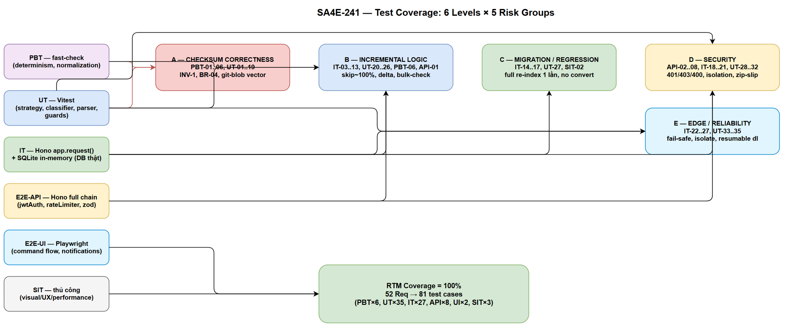
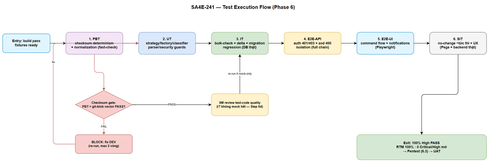

# System Test Plan (STP)

## SDLC-Agents-4-Enterprise / Code Intelligence Extension — SA4E-241: Incremental Indexing bằng Checksum (Pega rule CSV + Pega nội suy + code non-Pega + document)

---

## Document Information

| Field | Value |
|-------|-------|
| Jira Ticket | SA4E-241 |
| Title | Kế hoạch kiểm thử hệ thống — Incremental indexing skip item không đổi bằng checksum (3 nguồn) |
| Author | QA Agent |
| Version | 1.0 |
| Date | 2026-04-30 |
| Kiến trúc | Plugin / Extension (VS Code / Kiro, TypeScript/Vitest/fast-check) + Monolith backend (Hono/TypeScript/Vitest) |
| Related BRD | BRD-v1-SA4E-241.docx |
| Related FSD | FSD-v1-SA4E-241.docx |
| Related TDD | TDD-v1-SA4E-241.docx (v1.1 — mô hình checksum, §2 ma trận, §9 Implementation Checklist, §8 Security) |
| Related Security | SECURITY-REVIEW.md (SEC-01..SEC-12) |
| Test frameworks | Vitest (UT/IT), fast-check (PBT), Hono `app.request()` + Vitest (E2E-API), Playwright (E2E-UI), thủ công có kịch bản (SIT) |

---

## Author Tracking

| Role | Name - Position | Responsibility |
|------|-----------------|----------------|
| Author | QA Agent – Quality Engineer | Viết STP + STC, thiết kế RTM, chiến lược test data, diagrams |
| Reviewer | SM Agent – Scrum Master | Review STP/STC (Phase 4 quality gate) |
| Consumer | DEV Agent | Dùng STP/STC làm chuẩn cho unit/integration test khi implement (Phase 5) |

---

## Revision History

| Version | Date | Author | Changes |
|---------|------|--------|---------|
| 1.0 | 2026-04-30 | QA Agent | Khởi tạo STP từ TDD v1.1 (§1 mô hình chốt, §2 ma trận checksum, §9 IC TESTABLE), FSD v1.1 (§10 TC-01..TC-13, BR-01..BR-18, E-01..E-07), BRD (5 user stories), SECURITY-REVIEW (SEC-01..SEC-12). Nhấn mạnh **checksum correctness** (PBT determinism + normalization + INV-1 CSV≡nội suy + git-blob vector), incremental logic, migration/regression, security (401/403/400), edge/reliability. |

---

## 1. Introduction

### 1.1 Purpose

STP này định nghĩa **chiến lược, phạm vi, cách tiếp cận và tiêu chí** kiểm thử cho SA4E-241 — cơ chế incremental indexing dùng checksum để skip item không đổi trên **4 nguồn** (Nguồn A: Pega rule từ CSV, Nguồn B: Pega rule nội suy/fetch, Nguồn C: code non-Pega, Nguồn D: document).

> ⛔ **Ưu tiên tối cao (theo chỉ đạo):** **CHECKSUM CORRECTNESS** là rủi ro số một. Sai lệch công thức/normalization giữa Pega ↔ extension, hoặc giữa Nguồn A (CSV) ↔ Nguồn B (nội suy), sẽ khiến **toàn bộ rule bị coi là "đổi"** (mất hết lợi ích incremental) hoặc **bỏ sót re-index** (sai dữ liệu — vi phạm no-false-negative). Test checksum được phủ **kỹ nhất**, gồm property-based (PBT) determinism + normalization + đối chiếu vector thật `git hash-object`.

### 1.2 Scope of Testing

**Trong phạm vi test:**

| # | Nhóm | Nội dung |
|---|------|----------|
| 1 | Checksum correctness | Công thức Pega bit-for-bit, normalization (trim/null→""/`\|`/UTF-8/lowercase hex), determinism (PBT), INV-1 (A≡B), git-blob vector (IC-C1), fallback (IC-C2), uniqueness-in-project |
| 2 | Incremental logic | No-change skip ~100% (TC-02/IC-M1), re-index khi đổi save-time (TC-03/04), rule mới (TC-05), removed (TC-06/BR-11), delta classification (IC-05), backend không tự tính (IC-04), bulk-check existing (IC-03) |
| 3 | Migration / Regression | Full re-index 1 lần sau migration content_hash (IC-M1), không convert hash cũ (IC-M2), non-Pega HashCache cũ → git-blob/fallback mới (IC-C3) |
| 4 | Security | SEC-01 (auth 401/identity 403), SEC-02 (mutation scope), SEC-04 (zod 400), SEC-05 (size/zip-bomb), SEC-06 (Zip-Slip/containment) |
| 5 | Edge / Reliability | E-01 export fail giữ state, E-04 bulk-check fail → full run, E-05 fetch item lỗi isolate, encoded-slash (OI-03), timestamp racy (TC-13/OI-06), resumable download 206+base64+x-file-size |

**Ngoài phạm vi test (được xác nhận từ FSD §1.2 / BRD §1.2):**

- Thuật toán index cốt lõi (AST parsing, symbol extraction, enrichment) — chỉ test lớp delta filter đứng trước.
- UI mới (không có màn hình mới; chỉ notification/output channel).
- Nâng cấp Rule Catalog Export API phía Pega (dependency đội Pega) — test **contract** phía extension (parse CSV, verify), không test server Pega thật.
- Kiểm thử hiệu năng tải thật 17,978 rule trên môi trường production (đo proxy bằng fixtures + benchmark logic; ngưỡng tuyệt đối xác nhận ở SIT).

### 1.3 References

| Document | Location |
|----------|----------|
| BRD | BRD-v1-SA4E-241.docx (5 user stories, AC, NFR §6) |
| FSD | FSD-v1-SA4E-241.docx (§3.1.3 BR-01..BR-18, §9 E-01..E-07, §10 TC-01..TC-13, §12–§16 technical) |
| TDD | TDD-v1-SA4E-241.docx (§1 mô hình chốt NT-1..NT-5, §2 ma trận, §2.3 INV-1..INV-4, §8 Security, §9 IC TESTABLE) |
| Security Review | documents/SA4E-241/SECURITY-REVIEW.md (SEC-01..SEC-12) |
| Test Cases | STC-v1-SA4E-241.xlsx / documents/SA4E-241/STC.md |

---

## 2. Test Strategy

### 2.1 Nguyên tắc chỉ đạo

| # | Nguyên tắc | Diễn giải |
|---|-----------|-----------|
| TS-1 | **Checksum-first** | Đầu tư nhiều nhất vào checksum correctness. Dùng PBT (fast-check) để chứng minh **tính chất** (determinism, invariance), không chỉ vài ví dụ. |
| TS-2 | **Đối chiếu vector thật** | git-blob checksum PHẢI so với output `git hash-object` THẬT (không tự-đối-chiếu). Pega checksum so với vector tính tay trong fixture CSV. |
| TS-3 | **No-false-negative là tối thượng** | Mọi thay đổi save-time (kể cả data rule) PHẢI dẫn tới re-index. Test ưu tiên chứng minh KHÔNG bỏ sót hơn là tối ưu skip. |
| TS-4 | **Fail-safe khi lỗi** | Lỗi (export/bulk-check/fetch/state) PHẢI nghiêng về re-index/giữ-state, KHÔNG ghi đè sai. Test explicit từng nhánh E-01..E-07. |
| TS-5 | **Security scope theo identity** | Test authz ở E2E-API: 401 thiếu identity, 403 mismatch, existing chỉ trong đúng tenant (không cross-tenant leak). |
| TS-6 | **Test theo Implementation Checklist** | Mỗi IC-xx trong TDD §9 (đã TESTABLE) ánh xạ tối thiểu 1 test case; RTM đảm bảo 100% coverage. |
| TS-7 | **Isolation trước speed** | 1 item lỗi KHÔNG được làm hỏng item khác; test partial-failure isolation rõ ràng. |

### 2.2 6 Test Levels

| Level | Ký hiệu | Mục tiêu | Công cụ | Ai chạy | Tự động hoá |
|-------|---------|----------|---------|---------|-------------|
| **PBT** | Property-Based Test | Chứng minh **tính chất** của hàm thuần (checksum determinism, normalization invariance, classify totality) qua hàng nghìn input ngẫu nhiên | `fast-check` + Vitest | DEV/QA | ✅ 100% |
| **UT** | Unit Test | Kiểm thử đơn vị hàm/lớp cô lập (Strategy, Factory, DeltaClassifier, StateComparer, parser, ChecksumStore query builder) — mock dependency | Vitest + sinon | DEV/QA | ✅ 100% |
| **IT** | Integration Test | Kiểm thử tích hợp thật giữa module: bulk-check route ↔ ChecksumStore ↔ DB thật (SQLite in-memory); StateComparer ↔ BulkCheckClient ↔ Hono app thật; migration chạy trên DB thật | Vitest + Hono `app.request()` + SQLite in-memory | DEV/QA | ✅ 100% |
| **E2E-API** | End-to-end API | Kiểm thử hợp đồng API đầy đủ qua HTTP layer: auth (401/403), validation (400), bulk-check happy path, ingest → save content_hash, security scope | Vitest + Hono `app.request()` (full middleware chain incl. jwtAuth/rateLimiter) | QA | ✅ 100% |
| **E2E-UI** | End-to-end UI | Kiểm thử luồng command "Index Source Code" từ góc user: progress/summary notification, wording kết quả (skipped/reindexed/removed/error) | Playwright + VS Code Extension Host (hoặc harness webview) | QA | ✅ (Gherkin → Playwright); phần Extension Host có thể bán tự động |
| **SIT** | System Integration Test | Kiểm thử end-to-end trực quan/UX + hiệu năng thực tế trên môi trường có Pega export + backend thật: no-change run ~tức thì, số liệu report đúng, trải nghiệm | Thủ công có kịch bản + đo thời gian | QA + user | ⚠️ Thủ công (visual/UX/perf) |

### 2.3 Phân bổ trọng tâm (test pyramid điều chỉnh cho checksum-critical)

```
        SIT (visual/UX/perf)         ~5%
      E2E-UI (command flow)          ~7%
    E2E-API (auth/contract)          ~15%
   IT (bulk-check/delta/migration)   ~20%
  UT (strategy/classifier/parser)    ~28%
 PBT (checksum determinism/norm)     ~25%   ← đầu tư đậm (checksum-first, TS-1)
```

> PBT + UT chiếm ~53% vì checksum correctness là hàm thuần → property-based + unit là cách chứng minh mạnh nhất và rẻ nhất. IT/E2E-API tập trung contract + security.

### 2.4 Entry / Exit Criteria

**Entry (bắt đầu test execution — Phase 6):**
- Code implement xong theo TDD §9 (IC-01..IC-M2), push lên branch SA4E-241.
- Build extension + backend pass (`npm run build`).
- Test fixtures (CSV, checksum vectors, git-blob vectors) đã chuẩn bị (§6).

**Exit (kết thúc test — điều kiện chuyển UAT):**
- 100% test case ưu tiên High **PASS**.
- RTM coverage = 100% (mọi BR/AC/IC/SEC ánh xạ ít nhất 1 test PASS).
- 0 lỗi Critical/High mở.
- Checksum determinism PBT chạy ≥ 1000 case/run không phản ví dụ.
- git-blob checksum khớp `git hash-object` thật cho toàn bộ vector.
- Security: 401/403/400 verify PASS; không cross-tenant leak.
- Non-Pega regression: file không đổi sau migration → skip (IC-C3) PASS.

### 2.5 Test Environment

| Thành phần | Cấu hình test |
|-----------|---------------|
| Extension | Node ≥ 20, TypeScript 5.4, Vitest 4.x, fast-check 4.x, jsdom, sinon |
| Backend | Node ≥ 20, Hono, Vitest 4.x, SQLite in-memory (`better-sqlite3` `:memory:`) cho IT; Postgres test container (tuỳ chọn) cho index/EXPLAIN |
| Git | git CLI có sẵn (để sinh & đối chiếu `git hash-object` vector); và 1 thư mục KHÔNG git (test fallback) |
| Auth | JWT test key + header `X-Project-Id` giả lập; `CODE_INTEL_REQUIRE_AUTH=true` cho E2E-API security |
| Pega | KHÔNG gọi Pega thật; dùng fixture CSV + mock HTTP cho resumable download (206 + base64 + x-file-size) |

### 2.6 Chiến lược Mock/Real theo level (chống "all-mock integration test")

| Level | Được mock | PHẢI real |
|-------|-----------|-----------|
| PBT/UT | Tất cả I/O (DB, HTTP, fs, git) | Hàm thuần checksum/classify (không mock) |
| IT | Pega HTTP (fixture) | **DB thật** (SQLite in-memory), **Hono app thật** (route + ChecksumStore), migration chạy thật |
| E2E-API | Pega HTTP | **Full middleware chain** (jwtAuth, rateLimiter, zod), DB thật, HTTP qua `app.request()` |
| E2E-UI | Backend (stub) hoặc backend thật | Command flow + notification thật |
| SIT | — | Pega export thật + backend thật + extension thật |

> ⛔ IT KHÔNG được mock ChecksumStore/DB — nếu mock hết thì đó là UT trá hình (SM sẽ reject ở Step 6d).

---
## 3. Requirements Traceability Matrix (RTM)

> Mục tiêu **100% coverage**: mọi Business Rule (BR), Acceptance Criteria (AC), Implementation Checklist (IC), Security finding (SEC), FSD test scenario (TC), và Error scenario (E) đều ánh xạ ≥ 1 test case trong STC. Cột "Test Cases" tham chiếu ID trong STC.md.

### 3.1 RTM — Checksum Correctness (nhóm A — ưu tiên tối cao)

| Req ID | Nguồn | Mô tả | Test Level | Test Cases (STC) |
|--------|-------|-------|-----------|------------------|
| BR-04 | FSD | Công thức Pega `sha256_hex(trim(pzInsKey)\|trim(pxUpdateDateTime??"")\|trim(pxSaveDateTime??""))` | PBT+UT | PBT-01, PBT-02, PBT-03, UT-01, UT-02, UT-03 |
| IC-02 | TDD §9.1 | `computePegaChecksum` dùng chung A+B | PBT+UT | PBT-04, UT-04 |
| INV-1 | TDD §2.3 | Checksum CSV ≡ nội suy cùng rule | PBT+UT+IT | PBT-04, UT-05, IT-01 |
| BR-04 (norm) | FSD | Normalization: trim, null→"", sep `\|`, UTF-8, lowercase hex | PBT+UT | PBT-02, PBT-03, UT-06, UT-07, UT-08 |
| IC-A2 | TDD §9.2 | Verify Cách B khớp cột CSV; lệch → E-03 | UT+IT | UT-09, IT-02 |
| IC-A3/E-02 | TDD §9.2 / FSD | Cột CSV thiếu/sai → extension tự tính, không crash | UT | UT-10, UT-11 |
| E-03 | FSD | Lệch công thức (Cách A≠B) → cảnh báo + dùng giá trị extension | UT+IT | UT-09, IT-02 |
| NT-3 (uniqueness) | TDD §1.1 | 2 rule khác nhau → checksum khác (kể cả data rule pzInsKey không unique) | PBT+UT | PBT-05, UT-12 |
| IC-C1 | TDD §9.4 | git-blob = `sha1("blob "+size+"\0"+content)` khớp `git hash-object` | UT (vector) | UT-13, UT-14 |
| IC-C2 | TDD §9.4 | Fallback `sha256(relativePath+NUL+content)` khi không git | UT (vector) | UT-15, UT-16 |
| IC-B1 | TDD §9.3 | `compute(ruleJson)` từ 3 field JSON = checksum CSV | UT+IT | UT-05, IT-01 |
| IC-B2 | TDD §9.3 | Nhánh nội suy không cần fail-safe thiếu field | UT | UT-17 |
| IC-01 | TDD §9.1 | Factory trả đúng impl theo (nguồn, hasGit) | UT | UT-18, UT-19 |

### 3.2 RTM — Incremental Logic (nhóm B)

| Req ID | Nguồn | Mô tả | Test Level | Test Cases (STC) |
|--------|-------|-------|-----------|------------------|
| Story 1 / AC1-3 | BRD | No-change run skip ~100%, idempotent | IT+SIT | IT-03, SIT-01 |
| TC-02 / IC-M1 | FSD/TDD | No-change → skip ~100% | IT | IT-03 |
| BR-18 | FSD | Idempotency chạy lại = kết quả như nhau | IT | IT-03, IT-04 |
| BR-02 | FSD | Unchanged khi checksum == state | UT+IT | UT-20, IT-03 |
| BR-03 / TC-03 | FSD | Changed khi checksum != state → re-index | IT | IT-05 |
| TC-04 / Story 3 | FSD/BRD | Data rule đổi (pzInsKey không đổi, save-time đổi) → re-index | UT+IT | UT-21, IT-06 |
| TC-05 | FSD | Rule mới → fetch + index | IT | IT-07 |
| TC-06 / BR-11 | FSD | Rule removed (còn state, không còn CSV) → dọn | UT+IT | UT-22, IT-08 |
| IC-05 / BR-05/06 | TDD | skip=existing, fetch=checksums−existing (skip-before-fetch) | PBT+UT | PBT-06, UT-23, UT-24 |
| IC-06 / NT-3 | TDD | Chỉ so bằng checksum, không pzInsKey/fqn | UT (grep/behavior) | UT-25 |
| IC-04 / NT-4 | TDD | Backend KHÔNG tự tính checksum | UT+IT (grep/behavior) | UT-26, IT-09 |
| IC-03 | TDD §9.1 | bulk-check N checksum (M có) → existing=M | IT+E2E-API | IT-10, API-01 |
| BR-07/10 | FSD | Sau index content_hash = checksum mới (mọi nguồn) | IT | IT-11 |
| IC-07 | TDD §9.1 | index idx_files_project_content_hash được dùng | IT (EXPLAIN) | IT-12 |
| BR-12 | FSD | Report skipped/reindexed/removed/error | IT+E2E-UI | IT-13, UI-01 |

### 3.3 RTM — Migration / Regression (nhóm C)

| Req ID | Nguồn | Mô tả | Test Level | Test Cases (STC) |
|--------|-------|-------|-----------|------------------|
| IC-M1 | TDD §9.6 | Full re-index 1 lần sau migration; lần 2 skip ~100% | IT | IT-14 |
| IC-M2 | TDD §9.6 | KHÔNG convert hash cũ (no-workaround) | UT (grep/behavior) | UT-27 |
| IC-C3 / BR-17 | TDD §9.4 / FSD | HashCache cũ (sha256 thuần) → git-blob/fallback; không đổi→skip; đổi→re-index | IT | IT-15, IT-16 |
| TC-12 / Story 4 | FSD/BRD | Non-Pega regression: hành vi index không đổi | IT+SIT | IT-15, SIT-02 |
| IC-D1 | TDD §9.5 | Document dùng cùng Strategy với code | IT | IT-17 |

### 3.4 RTM — Security (nhóm D — test ở E2E-API/IT)

| Req ID | Nguồn | Mô tả | Test Level | Test Cases (STC) |
|--------|-------|-------|-----------|------------------|
| SEC-01a | SEC-REVIEW | Thiếu identity (X-Project-Id/JWT) → 401 | E2E-API | API-02 |
| SEC-01b | SEC-REVIEW | body.projectId ≠ identity → 403 | E2E-API | API-03 |
| SEC-01c/SEC-10 | SEC-REVIEW | existing chỉ chứa checksum đúng project (no cross-tenant) | E2E-API+IT | API-04, IT-18 |
| SEC-02 | SEC-REVIEW | Mutation không xoá/ghi cross-tenant; bỏ `OR 'PegaCollProj'` | E2E-API+IT | API-05, IT-19 |
| SEC-04a | SEC-REVIEW | zod: projectId regex, checksums hex → 400 | E2E-API | API-06, API-07 |
| SEC-04b | SEC-REVIEW | array > 5000 → 400 | E2E-API | API-08 |
| SEC-04c | SEC-REVIEW | checksum không hex → 400 | E2E-API | API-07 |
| SEC-05a | SEC-REVIEW | x-file-size vượt MAX_TOTAL_SIZE → abort | UT+IT | UT-28, IT-20 |
| SEC-05b | SEC-REVIEW | zip-bomb (uncompressed/entry count) → abort | UT+IT | UT-29, IT-21 |
| SEC-06a | SEC-REVIEW | Zip-Slip entry (`../`, absolute) → reject | UT | UT-30, UT-31 |
| SEC-06b | SEC-REVIEW | file ngoài workspaceRoot → skip | UT | UT-32 |

### 3.5 RTM — Edge / Reliability (nhóm E)

| Req ID | Nguồn | Mô tả | Test Level | Test Cases (STC) |
|--------|-------|-------|-----------|------------------|
| E-01 / BR-13 / TC-09 | FSD | Export/CSV fail → giữ state, không ghi đè | IT | IT-22 |
| E-04 / BR-15 / TC-10 | FSD | bulk-check lỗi → full run fallback | IT | IT-23 |
| E-05 / BR-16 / TC-11 | FSD | Fetch 1 item delta lỗi → isolate, item khác tiếp tục | IT | IT-24 |
| OI-03 | TDD §11 | Encoded-slash insKey (chứa `/`) fetch fallback | UT+IT | UT-33, IT-25 |
| TC-13 / OI-06 | FSD/TDD | Timestamp resolution racy — checksum gộp bắt đổi; ghi nhận giới hạn | UT | UT-34 |
| §13.1 FSD | FSD | Resumable download: 206 + base64 decode + x-file-size (không content-range) | UT+IT | UT-35, IT-26 |
| E-06 | FSD | Lưu state/ingest lỗi → item lại vào delta lần sau (không sai đúng đắn) | IT | IT-27 |
| E-07 | FSD | Rule removed → báo "đã dọn N rule" | IT | IT-08 |

### 3.6 RTM — Coverage Summary

| Nhóm | Số Req | Số Test Case ánh xạ | Coverage |
|------|--------|---------------------|----------|
| A — Checksum correctness | 13 | PBT-01..06, UT-01..19 (một phần) | 100% |
| B — Incremental logic | 15 | IT-03..13, UT-20..26, PBT-06, API-01 | 100% |
| C — Migration/Regression | 5 | IT-14..17, UT-27, SIT-02 | 100% |
| D — Security | 11 | API-02..08, IT-18..21, UT-28..32 | 100% |
| E — Edge/Reliability | 8 | IT-22..27, UT-33..35 | 100% |
| **Tổng** | **52 Req** | **PBT×6, UT×35, IT×27, API×8, UI×2, SIT×3** | **100%** |

---

## 4. Test Coverage Diagram



## 5. Test Execution Flow Diagram



---

## 6. Test Data Strategy

### 6.1 Nguyên tắc test data

| # | Nguyên tắc |
|---|-----------|
| TD-1 | **Vector cố định, tính tay:** checksum expected trong fixture được tính tay/độc lập (không sinh bằng chính code under test) → tránh "tautology test". |
| TD-2 | **git-blob vector đối chiếu CLI:** file fixture chạy qua `git hash-object <file>` thật để lấy expected hash (setup script). |
| TD-3 | **Bao phủ edge normalization:** null, chuỗi rỗng, khoảng trắng đầu/cuối, ký tự UTF-8 (dấu tiếng Việt, emoji), separator `\|` trong dữ liệu. |
| TD-4 | **Data rule fixture:** 2+ rule cùng `pzInsKey`-pattern nhưng khác save-time → chứng minh checksum đổi. |
| TD-5 | **Multi-tenant fixture:** ≥ 2 project (PegaCollProj, OtherProj) với checksum trùng giá trị để test cross-tenant isolation. |
| TD-6 | **Boundary:** batch 0/1/1000/5000/5001 checksum (test giới hạn zod + batching client). |

### 6.2 Fixture files (kèm STC)

| File | Mục đích | Mô tả |
|------|----------|-------|
| `fixtures/pega-rules-baseline.csv` | Nguồn A parse + verify | ~20 rule đủ 16 cột gốc + 3 cột mới (pxUpdateDateTime, pxSaveDateTime, checksum); checksum tính tay đúng BR-04 |
| `fixtures/pega-checksum-vectors.csv` | Đối chiếu công thức Pega | Cột: pzInsKey, pxUpdateDateTime, pxSaveDateTime, expected_checksum (tính tay); gồm case null/empty/whitespace/UTF-8 |
| `fixtures/pega-rules-changed.csv` | Delta: 1 rule đổi save-time | Giống baseline nhưng 1 rule đổi pxSaveDateTime → checksum khác |
| `fixtures/pega-datarule-vectors.csv` | Data rule | 2 rule cùng pzInsKey khác save-time → 2 checksum khác nhau |
| `fixtures/git-blob-vectors.csv` | Nguồn C/D git-blob | Cột: relativePath, content_ref, expected_git_hash (từ `git hash-object`); gồm file rỗng, file UTF-8, file lớn |
| `fixtures/file-fallback-vectors.csv` | Fallback không git | Cột: relativePath, content_ref, expected_sha256 (tính tay `sha256(path+NUL+content)`) |
| `fixtures/csv-malformed/` | E-02/IC-A3 | CSV thiếu cột checksum; checksum sai format; header thứ tự khác (append cuối) |
| `fixtures/zip-slip-entries.json` | SEC-06 | Danh sách entry độc hại: `../../etc/passwd`, `/absolute/path`, symlink |
| `fixtures/malformed-download/` | SEC-05 | Metadata: x-file-size vượt ngưỡng; zip-bomb (uncompressed lớn / nhiều entry) |
| `fixtures/multi-tenant.json` | SEC-01c/SEC-02 | 2 project + checksum sets (có phần trùng giá trị) |

### 6.3 CSV test data — cột chuẩn hoá

Tất cả CSV fixture PHẢI:
- Encoding **UTF-8** (kiểm chứng normalization).
- Header **name-based** (không phụ thuộc index cố định) — cột mới append cuối để test IC-A1/OI-02.
- Cột `checksum` hex **lowercase** 64 ký tự (sha256) cho Pega; 40 ký tự (sha1) cho git-blob vector.

### 6.4 Ví dụ checksum vector (tính tay — đưa vào STC.md phần fixtures)

Payload Pega = `trim(pzInsKey) + "|" + trim(pxUpdateDateTime ?? "") + "|" + trim(pxSaveDateTime ?? "")`, rồi `sha256_hex` (lowercase).

| # | pzInsKey | pxUpdateDateTime | pxSaveDateTime | Payload chuẩn hoá | Ghi chú |
|---|----------|------------------|----------------|-------------------|---------|
| V1 | `RULE-A` | `20260430T101500.000 GMT` | `20260430T101500.000 GMT` | `RULE-A\|20260430T101500.000 GMT\|20260430T101500.000 GMT` | Base case |
| V2 | `RULE-A` | (null) | `20260430T101500.000 GMT` | `RULE-A\|\|20260430T101500.000 GMT` | null→"" |
| V3 | ` RULE-A ` | ` 2026... ` | (empty) | `RULE-A\|2026...\|` | trim + empty |
| V4 | `RULE-Ⅴ-Ç` (UTF-8) | ... | ... | ... | UTF-8 bytes |
| V5 | `RULE-A` | `x\|y` (chứa sep) | `z` | `RULE-A\|x\|y\|z` | separator trong data (ghi nhận rủi ro OI-06) |

> Giá trị sha256 expected đầy đủ được sinh 1 lần bằng script độc lập (`node -e` hoặc `openssl`) và ghi cứng vào `pega-checksum-vectors.csv` — DEV/QA KHÔNG được tính bằng `computePegaChecksum` để tránh tautology (TD-1).

---

## 7. Risk-Based Prioritization

| Rủi ro | Mức | Chiến lược test | Test ưu tiên |
|--------|-----|-----------------|--------------|
| Lệch công thức/normalization Pega↔extension | 🔴 Cao | PBT determinism + vector tính tay + verify Cách B | PBT-01..04, UT-01..09 |
| INV-1 (A≠B) → sai delta data rule | 🔴 Cao | PBT + IT đối chiếu CSV vs nội suy | PBT-04, IT-01 |
| Bỏ sót re-index (false-negative) | 🔴 Cao | TC-03/04, data rule, migration full re-index | IT-05, IT-06, IT-14 |
| Cross-tenant leak/poison (SEC-01/02) | 🔴 Cao | E2E-API 401/403 + isolation | API-02..05, IT-18/19 |
| git-blob sai (IC-C1) | 🟠 TB | Đối chiếu `git hash-object` thật | UT-13, UT-14 |
| Zip-bomb/Zip-Slip (SEC-05/06) | 🟠 TB | UT guard + IT abort | UT-28..32, IT-20/21 |
| Resumable download decode sai | 🟠 TB | UT decode + IT mock 206 | UT-35, IT-26 |
| Timestamp racy (OI-06) | 🟡 Thấp | UT ghi nhận giới hạn | UT-34 |

---

## 8. Test Deliverables

| Deliverable | Mô tả |
|-------------|-------|
| STP.md (này) | Chiến lược, 6 levels, RTM 100%, test data strategy, diagrams |
| STC.md | Test case chi tiết theo 6 level (PBT/UT/IT/E2E-API/E2E-UI/SIT) |
| CSV fixtures | pega-checksum-vectors, git-blob-vectors, file-fallback-vectors, pega-rules-*, multi-tenant |
| TEST-REPORT.md | Kết quả execution (Phase 6) |
| Test coverage + execution flow diagrams | draw.io + PNG |

---

## 9. Appendix — Diagram Index

| # | Diagram | Image | Source (editable) |
|---|---------|-------|-------------------|
| 1 | Test Coverage (6 levels × 5 nhóm rủi ro) | [test-coverage.png](diagrams/test-coverage.png) | [test-coverage.drawio](diagrams/test-coverage.drawio) |
| 2 | Test Execution Flow (PBT→UT→IT→E2E-API→E2E-UI→SIT) | [test-execution-flow.png](diagrams/test-execution-flow.png) | [test-execution-flow.drawio](diagrams/test-execution-flow.drawio) |
