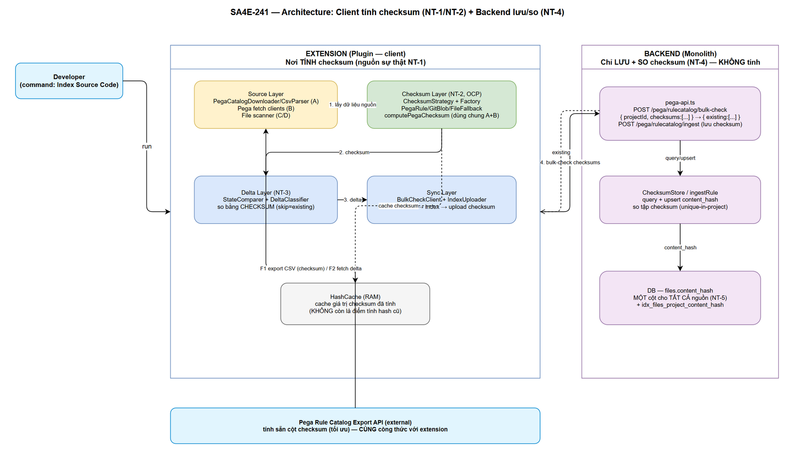
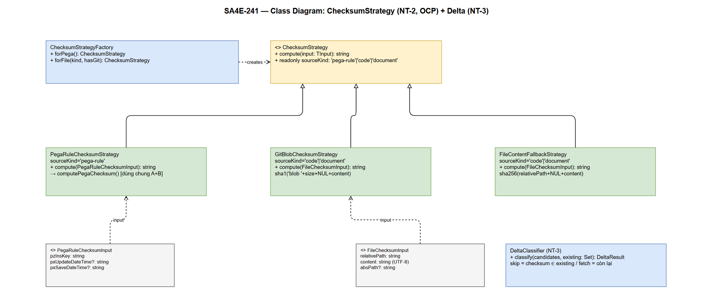

# Technical Design Document (TDD)

## SDLC-Agents-4-Enterprise / Code Intelligence Extension — SA4E-241: Incremental Indexing bằng Checksum (Pega rule + code non-Pega + document)

---

## Document Information

| Field | Value |
|-------|-------|
| Jira Ticket | SA4E-241 |
| Title | Incremental indexing — skip item không đổi bằng checksum (3 nguồn: Pega rule, code non-Pega, document) |
| Author | SA Agent |
| Version | 1.0 |
| Date | 2026-04-30 |
| Kiến trúc | Plugin / Extension (VS Code / Kiro) + Monolith backend |
| Related BRD | BRD-v1-SA4E-241.docx |
| Related FSD | FSD-v1-SA4E-241.docx |
| Scope | Cả 3 nguồn: Pega rule (CSV + nội suy/fetch ngoài CSV), code non-Pega, document |

---

## Author Tracking

| Role | Name - Position | Responsibility |
|------|-----------------|----------------|
| Author | SA Agent – Solution Architect | Thiết kế kỹ thuật (architecture, class/module, API, data model, migration, diagrams) |
| Reviewer | BA Agent – Business Analyst | Đối chiếu TDD với BRD/FSD (Design phase review loop) |
| Reviewer | Security Agent | Security Design Review (Phase 3.7) |

---

## Revision History

| Version | Date | Author | Changes |
|---------|------|--------|---------|
| 1.0 | 2026-04-30 | SA Agent | Khởi tạo TDD từ FSD v1.1 (§12–§16) + BRD v1.0 + REFERENCE-ANALYSIS.md + POC code thật. Chốt mô hình checksum/identity đã được user thống nhất; giải quyết OI-05; đặc tả Strategy pattern, contract bulk-check, migration content_hash, diagrams. |
| 1.1 | 2026-04-30 | SA Agent | **Address Security Design Review (Phase 3.7).** Viết lại §8 (Security Design) đặc tả cơ chế authz thực tế: `/pega/*` áp `jwtAuth`, `projectId` **derive từ identity đã xác thực** (không tin body, fail-closed, bỏ default `'PegaCollProj'`) — SEC-01. Bỏ mệnh đề `OR project_id='PegaCollProj'` trong mọi mutation — SEC-02. Đặc tả credential handling (SecretStorage + authHeader per-request, rotate password đã lộ) — SEC-03. Đặc tả zod schema server-side chặt chẽ — SEC-04. Đặc tả MAX_TOTAL_SIZE/MAX_CHUNKS + zip-bomb guard — SEC-05. Containment check chuẩn (Zip-Slip) + canonicalize file-scan — SEC-06. Khẳng định checksum git-blob in-process crypto, không shell-out — SEC-07. Cập nhật §5.5 (migration scope theo identity), §6 (API auth headers + validation). |
| 1.2 | 2026-04-30 | SA Agent | **Làm rõ scope NT-4 theo quyết định Phase 6 (fresh-context review — user chốt accept + document, KHÔNG refactor).** Fresh-context review xác nhận NT-4 (extension tính checksum, backend chỉ lưu+so) đã implement + verify ĐÚNG cho **Pega rule (Nguồn A CSV + Nguồn B nội suy)** — mục tiêu chính của ticket. Với **code non-Pega (Nguồn C)** và **document (Nguồn D)**, luồng production hiện tại là **backend tính `content_hash` server-side** (từ nội dung upload qua `/api/index/source` + `/api/index/documents`, skip file không đổi qua `checksumStats: files_skipped/processed/pending` — incremental cross-session đã hoạt động, verified qua `index-operation-manager.test`). User QUYẾT ĐỊNH: giữ cơ chế server-computed cho C/D (server đã có sẵn nội dung file, không lãng phí như Pega — nơi backend không nên băm data JSON lớn); thư viện extension-computed git-blob (`GitBlobChecksumStrategy`/`FileContentFallbackStrategy`) đã implement + test nhưng chưa nối vào luồng C/D production. Thống nhất cả 3 nguồn về extension-computed git-blob + bulk-check = **tech-debt ticket riêng**, KHÔNG làm trong SA4E-241. Cập nhật: Scope Note (Phase 6) ở §1.5, ghi chú NT-4/NT-5 (§1.1), cột "Ai tính" §2.1.3/§2.1.4. |

---

## 1. Tuyên bố mô hình đã chốt (Source of Truth) — ĐỌC TRƯỚC TIÊN

> ⛔ Phần này là **nguồn sự thật** cho toàn bộ thiết kế. Mọi mục sau PHẢI nhất quán với §1. Các điểm dưới đây **đã được chốt** qua thảo luận với user — **không** có phương án thay thế, **không** để lại open decision cho các điểm đã chốt.

### 1.1 Năm nguyên tắc nền tảng

| # | Nguyên tắc | Nội dung chốt |
|---|-----------|---------------|
| **NT-1** | **Công thức checksum là nguồn sự thật, KHÔNG phải cột CSV** | Extension **luôn tự tính được** checksum từ dữ liệu gốc. Cột `checksum` trong CSV chỉ là **giá trị tối ưu do Pega tính sẵn**; extension **verify** lại bằng chính công thức (phát hiện lệch). Không có bất kỳ luồng nào phụ thuộc tuyệt đối vào cột CSV. |
| **NT-2** | **Checksum theo nguồn (Strategy pattern)** | Mỗi nguồn có công thức riêng, chọn qua `ChecksumStrategy` (interface + impl), tuân OCP. Chi tiết §1.2. Hàm `computePegaChecksum(rule)` là **hàm dùng chung** — gọi ở CẢ luồng CSV-verify LẪN rule nội suy. |
| **NT-3** | **Identity ≠ Checksum** | Checksum **duy nhất trong 1 project** (Pega checksum đã gồm `pzInsKey` → unique-in-project). `pzInsKey` **KHÔNG unique tuyệt đối** cho data rule → **KHÔNG** dùng `pzInsKey` làm khóa tra state. Extension tra state **bằng chính checksum**. Identity key (ID nội bộ DB backend) là **thuần nội bộ backend**; extension không biết/không dùng. |
| **NT-4** | **Backend chỉ LƯU + SO checksum, KHÔNG tự tính** | Contract chính: `POST /pega/rulecatalog/bulk-check { projectId, checksums:[...] } → { existing:[...] }`. Client: `skip = existing`, `fetch = checksums − existing`. Sau index → backend lưu checksum mới. **BỎ HẲN** hướng so theo `signature = fqn`.<br/>⚠️ **Scope NT-4 (quyết định Phase 6):** nguyên tắc "backend KHÔNG tự tính" áp dụng cho **Pega rule (Nguồn A/B)** — nơi backend TỪNG tính sai/lãng phí (băm cả JSON data rule khổng lồ) và là mục tiêu chính của ticket. Với **code non-Pega (Nguồn C)** và **document (Nguồn D)**, backend tính `content_hash` **server-side** từ nội dung upload là **CHẤP NHẬN ĐƯỢC** (server đã có sẵn nội dung file → không lãng phí; incremental skip đã hoạt động qua `checksumStats`). Trạng thái implement: **Pega = extension-computed** (đã verify INV-1 end-to-end); **code/document = server-computed** (đã incremental). Thống nhất C/D về extension-computed = tech-debt ticket riêng. |
| **NT-5** | **content_hash: MỘT cột cho TẤT CẢ loại** | `files.content_hash` lưu checksum cho Pega/code/document. Cơ chế so+skip **đồng nhất**, chỉ khác **cách tính**: Pega — **extension tính** (git blob không áp dụng cho rule); code/document — **server tính** `content_hash` từ nội dung upload (quyết định Phase 6). Dù ai tính, cột `content_hash` vẫn là **1 cột chung** và cơ chế so+skip không đổi. Migration: đổi ngữ nghĩa content_hash → **FULL RE-INDEX 1 LẦN** sau deploy (fail-safe), **KHÔNG** convert hash cũ (no-workaround). |

### 1.2 Chiến lược checksum theo nguồn (chốt)

| Nguồn | Công thức checksum (chốt) | Ai tính |
|-------|---------------------------|---------|
| **Pega rule (từ CSV)** | `sha256_hex(trim(pzInsKey) + "\|" + trim(pxUpdateDateTime ?? "") + "\|" + trim(pxSaveDateTime ?? ""))` | Pega tính sẵn (cột CSV, tối ưu) **+ extension VERIFY** bằng cùng công thức (Cách B) |
| **Pega rule (nội suy / fetch ngoài CSV)** | **CÙNG công thức** trên, tính từ rule JSON. `pzInsKey`/`pxUpdateDateTime`/`pxSaveDateTime` **luôn có** (field cơ bản — user xác nhận) → **không cần fail-safe thiếu field** | Extension tự tính (`computePegaChecksum`) |
| **Code non-Pega** | `git hash-object` = `sha1("blob " + size + "\0" + content)`; **fallback** (chưa có git): `sha256(relativePath + NUL(\0) + fileContent)` | Extension tự tính |
| **Document** | **GIỐNG code non-Pega** (git blob hash; fallback `sha256(relativePath + NUL + content)`) | Extension tự tính |

Chuẩn hoá (normalization) cho Pega: hex **lowercase**, separator **`|`**, `null → ""`, encoding **UTF-8**, **trim từng field**.

### 1.3 Hiện trạng vs Mục tiêu (điểm thay đổi bắt buộc)

| Thành phần | Hiện trạng (POC) | Mục tiêu (SA4E-241) | Thay đổi |
|-----------|------------------|---------------------|----------|
| `HashCache.computeHash` (extension) | `sha256(content)` **thuần** — không path, không git | Git-blob hash + fallback `sha256(relativePath + NUL + content)` | ✅ THAY ĐỔI → §5.6 migration + regression |
| Bulk-check (backend) | `/pega/crawl-plan` so theo `signature = fqn` | `/pega/rulecatalog/bulk-check` so theo **checksum** (NT-4) | ✅ THAY ĐỔI → bỏ fqn matching |
| `content_hash` ngữ nghĩa (Pega) | `sha256(full rule JSON)` (`PegaSymbolSync`) | = checksum save-time (NT-1/NT-2) | ✅ THAY ĐỔI → §5.5 full re-index 1 lần |
| Khóa state (extension) | (POC: dedup theo insKey) | **checksum** (NT-3) | ✅ THAY ĐỔI |

### 1.4 Trạng thái OI-05 = RESOLVED

> **OI-05 (lệch khóa checksum: `crawl-plan` key theo `insKey`, `crawl-batch` key theo `fqn`, state theo `pzInsKey`) = ✅ RESOLVED.**
>
> Theo NT-3 + NT-4: chỉ còn **MỘT thứ để so là checksum**. Extension gửi tập checksum, backend so tập checksum, backend lưu tập checksum. Không còn khóa `fqn` hay `insKey` tham gia vào việc so → **hết lệch khóa**. Backend **KHÔNG cần** cột `pega_ins_key` cho việc so (chi tiết trạng thái tất cả OI ở §11).

### 1.5 Scope Note — Quyết định Phase 6 (fresh-context review) — ĐỌC KỸ

> 🔖 **Ghi chú phạm vi bắt buộc.** Trong Phase 6, fresh-context review phát hiện rằng nguyên tắc **NT-4** (extension tính checksum, backend chỉ lưu + so) mới được implement + verify **ĐÚNG cho Pega rule** (Nguồn A CSV + Nguồn B nội suy). Với **code non-Pega (Nguồn C)** và **document (Nguồn D)**, luồng production **hiện tại** khác với mô tả lý tưởng ban đầu. User đã **QUYẾT ĐỊNH: ACCEPT + DOCUMENT, KHÔNG refactor** trong SA4E-241.

**Thực tế implement hiện tại (đã verify):**

| Nguồn | Ai tính checksum (production) | Cơ chế | Trạng thái |
|-------|------------------------------|--------|-----------|
| **Pega rule (A/B)** | **Extension** (`computePegaChecksum`) — đúng NT-4 | bulk-check `/pega/rulecatalog/bulk-check` | ✅ Verify INV-1 end-to-end |
| **Code non-Pega (C)** | **Backend (server-side)** từ nội dung upload | `/api/index/source` → indexer tính `content_hash`, skip file không đổi qua `checksumStats` (files_skipped/processed/pending) | ✅ Incremental cross-session đã hoạt động (verified `index-operation-manager.test`) |
| **Document (D)** | **Backend (server-side)** từ nội dung upload | `/api/index/documents` → tương tự Nguồn C | ✅ Incremental đã hoạt động |

**Lý do user chấp nhận (không phải workaround):**
1. **Pega**: backend TỪNG tính sai/lãng phí (băm cả JSON data rule khổng lồ) → đẩy việc tính về extension là mục tiêu chính của ticket. NT-4 áp dụng đầy đủ ở đây.
2. **Code/document**: server **đã có sẵn nội dung file** khi extension upload → backend tính `content_hash` server-side **không lãng phí** (khác Pega: Pega data JSON lớn + backend không nên băm). Incremental skip **đã hoạt động** → mục tiêu nghiệp vụ (skip item không đổi) **đã đạt** cho C/D.

**Thư viện extension-computed đã có nhưng CHƯA nối vào production C/D:**
- `GitBlobChecksumStrategy` / `FileContentFallbackStrategy` (§2.1.3/§2.1.4, §4.1) **đã implement + test** như thư viện checksum dùng chung.
- **NHƯNG** luồng code/document production hiện dùng **server-computed `content_hash`**, chưa dùng thư viện extension-computed + bulk-check.

**Tech-debt (ticket riêng — KHÔNG làm trong SA4E-241):**
- Thống nhất cả 3 nguồn về **extension-computed git-blob + bulk-check** (đưa C/D theo đúng NT-4 như Pega).
- Sẽ tạo ticket tech-debt riêng để theo dõi.

> ✅ **Tóm tắt:** SA4E-241 hoàn thành mục tiêu incremental cho cả 3 nguồn; NT-4 (backend không tính) đạt đủ cho Pega; C/D dùng server-computed content_hash (chấp nhận được, incremental đã chạy). Sự thống nhất kiến trúc về extension-computed cho C/D được hoãn sang tech-debt ticket.

---
## 2. Bảng ma trận Checksum (chi tiết) — theo NGUỒN × theo NƠI

> Đây là phần trọng tâm của thiết kế. Bảng thể hiện rõ: **ai tính / ai lưu / ai so**, **công thức**, **normalization**, **khóa tra cứu** và **file/hàm code** cho từng NGUỒN tại từng NƠI. Điểm mấu chốt (NT-1): **Pega-service và extension tính checksum GIỐNG HỆT NHAU** — cùng công thức, cùng normalization — nên cột CSV chỉ là tối ưu, extension luôn verify/tự tính được.

### 2.1 Ma trận theo NGUỒN

#### 2.1.1 Nguồn A — Pega rule TỪ CSV (Rule Catalog Export)

| Điểm (NƠI) | Ai tính | Ai lưu | Ai so | Công thức | Normalization | Khóa tra cứu | File / Hàm code |
|-----------|---------|--------|-------|-----------|---------------|--------------|-----------------|
| Pega export (server) | **Pega** tính sẵn cột `checksum` (tối ưu) | Ghi vào cột CSV | — | `sha256_hex(trim(pzInsKey)+"\|"+trim(pxUpdateDateTime ?? "")+"\|"+trim(pxSaveDateTime ?? ""))` | hex lowercase; sep `\|`; null→`""`; UTF-8; trim từng field | (không tra — chỉ ghi) | Rule Catalog Export API (đội Pega) |
| Extension — parse + VERIFY (Cách B) | **Extension tự tính lại** bằng `computePegaChecksum(row)` rồi so với cột CSV | — (giá trị tạm trong RAM) | So `computed` vs cột CSV để phát hiện lệch công thức | **CÙNG công thức trên** | **CÙNG normalization** | không | `PegaCatalogCsvParser.parseCatalogCsv` (header-based) → `PegaRuleChecksumStrategy.compute(row)` |
| Extension — classify delta | — | — | So checksum(computed) vs **tập `existing`** trả từ backend | dùng checksum đã tính | **checksum** (NT-3) | không dùng pzInsKey | `DeltaClassifier.classify()` + `StateComparer` |
| Backend — bulk-check | KHÔNG tính (NT-4) | Lưu tập checksum (cột `content_hash`) | So tập checksum extension gửi vs DB | — | — | **checksum** (unique-in-project) | `pega-api.ts` → `POST /pega/rulecatalog/bulk-check` |
| Backend — sau index | KHÔNG tính | Lưu checksum mới vào `files.content_hash` | — | — | — | id nội bộ DB (không lộ ra extension) | `ingestRule()` / `PegaSymbolSync` |

> ⚠️ **Verify (Cách B) chính là bằng chứng NT-1:** vì extension chạy `PegaRuleChecksumStrategy.compute()` trên chính 3 field `pzInsKey/pxUpdateDateTime/pxSaveDateTime` (luôn có trong CSV), nếu cột `checksum` do Pega ghi khác giá trị extension tính → **lệch công thức** → cảnh báo cấu hình (E-03) + fail-safe re-index. Extension **không phụ thuộc** cột CSV: kể cả khi cột thiếu/sai, extension vẫn tự tính được từ 3 field.

#### 2.1.2 Nguồn B — Pega rule NỘI SUY / FETCH NGOÀI CSV (relatives BFS, query API, fetch-by-insKey)

| Điểm (NƠI) | Ai tính | Ai lưu | Ai so | Công thức | Normalization | Khóa tra cứu | File / Hàm code |
|-----------|---------|--------|-------|-----------|---------------|--------------|-----------------|
| Extension — sau khi fetch rule JSON (không qua CSV) | **Extension tự tính** `computePegaChecksum(ruleJson)` | — | So checksum vs tập `existing` (bulk-check) trước khi index | **CÙNG công thức Nguồn A** (dùng chung hàm) | **CÙNG normalization** | **checksum** | `PegaRuleChecksumStrategy.compute(ruleJson)` (nhận `{pzInsKey,pxUpdateDateTime,pxSaveDateTime}` từ JSON) |
| Backend | KHÔNG tính | Lưu checksum (`content_hash`) | So tập checksum | — | — | checksum | `pega-api.ts` bulk-check + `ingestRule` |

> 3 field `pzInsKey`, `pxUpdateDateTime`, `pxSaveDateTime` là **field cơ bản luôn có** trong rule JSON (user xác nhận) → nhánh nội suy **KHÔNG cần fail-safe thiếu field**. Cùng dùng `computePegaChecksum` với Nguồn A ⇒ checksum của CÙNG một rule qua CSV hay qua nội suy **luôn bằng nhau** (điều kiện đúng đắn của incremental).

#### 2.1.3 Nguồn C — Code non-Pega

> ⚠️ **Scope Phase 6 (§1.5):** với Nguồn C, luồng **production hiện tại tính checksum SERVER-side** (backend), KHÔNG phải extension. Extension upload nội dung file qua `/api/index/source`; backend indexer tính `content_hash` và skip file không đổi qua `checksumStats`. Thư viện extension-computed git-blob (`GitBlobChecksumStrategy`/`FileContentFallbackStrategy`) **đã implement + test** như thư viện dùng chung nhưng **CHƯA** nối vào luồng C production. Bảng dưới phản ánh **thực tế implement**.

| Điểm (NƠI) | Ai tính | Ai lưu | Ai so | Công thức | Normalization | Khóa tra cứu | File / Hàm code |
|-----------|---------|--------|-------|-----------|---------------|--------------|-----------------|
| Extension — quét + upload file | KHÔNG tính (production) — chỉ upload nội dung | — | — | (thư viện extension-computed đã có nhưng chưa dùng ở đây) | — | — | `/api/index/source` (upload nội dung) |
| **Backend — indexer (production)** | **Backend tự tính (server-side)** `content_hash` từ nội dung upload | Lưu vào `files.content_hash` | So `content_hash`, skip file không đổi (`checksumStats`: files_skipped/processed/pending) | server content_hash từ nội dung file đã upload | server-side | **content_hash** | `/api/index/source` → indexer + `checksumStats`; `index-helper.ts isFileUnchanged`; verified `index-operation-manager.test` |
| Thư viện checksum (đã implement, CHƯA nối C production) | Extension — sẵn sàng dùng | — | — | `git hash-object` = `sha1("blob "+size+"\0"+content)`; **fallback** `sha256(relativePath + "\0" + fileContent)` | UTF-8; NUL (`\0`) separator cho fallback; relativePath chuẩn hoá `/` | (dành cho tech-debt thống nhất) | `GitBlobChecksumStrategy.compute()` / `FileContentFallbackStrategy.compute()` — thư viện dùng chung, test xong |

#### 2.1.4 Nguồn D — Document

> ⚠️ **Scope Phase 6 (§1.5):** giống Nguồn C, luồng **production hiện tại tính checksum SERVER-side** (backend), KHÔNG phải extension. Extension upload nội dung document qua `/api/index/documents`; backend tính `content_hash` và skip document không đổi. Thư viện extension-computed git-blob **đã implement + test** nhưng **CHƯA** nối vào luồng D production. Bảng dưới phản ánh **thực tế implement**.

| Điểm (NƠI) | Ai tính | Ai lưu | Ai so | Công thức | Normalization | Khóa tra cứu | File / Hàm code |
|-----------|---------|--------|-------|-----------|---------------|--------------|-----------------|
| Extension — quét + upload document | KHÔNG tính (production) — chỉ upload nội dung | — | — | (thư viện extension-computed đã có nhưng chưa dùng ở đây) | — | — | `/api/index/documents` (upload nội dung) |
| **Backend — indexer (production)** | **Backend tự tính (server-side)** `content_hash` từ nội dung upload | Lưu vào `files.content_hash` | So `content_hash`, skip document không đổi (`checksumStats`) | server content_hash từ nội dung document đã upload | server-side | **content_hash** | `/api/index/documents` → indexer + `checksumStats` (đồng cơ chế với Nguồn C) |
| Thư viện checksum (đã implement, CHƯA nối D production) | Extension — sẵn sàng dùng | — | — | **GIỐNG HỆT Nguồn C** (git blob hash; fallback `sha256(relativePath + "\0" + content)`) | **GIỐNG Nguồn C** | (dành cho tech-debt thống nhất) | `GitBlobChecksumStrategy` / `FileContentFallbackStrategy` (dùng chung với code) |

### 2.2 Ma trận tổng hợp theo NƠI (đối chiếu nhanh)

| NƠI | Tính checksum? | Lưu checksum? | So checksum? | Ghi chú |
|-----|----------------|---------------|--------------|---------|
| **Pega export server** | ✅ (chỉ Nguồn A, tối ưu) | ✅ ghi cột CSV | ❌ | Cùng công thức với extension |
| **Extension (client)** | ✅ (mọi nguồn — luôn tự tính được) | Chỉ giữ tạm trong RAM để gửi bulk-check | ✅ so kết quả bulk-check để classify | Nguồn sự thật của việc tính (NT-1) |
| **Backend (monolith)** | ❌ (NT-4) | ✅ `files.content_hash` (mọi nguồn — NT-5) | ✅ so tập checksum extension gửi | Không tự tính, chỉ lưu + so |

### 2.3 Bất biến (invariants) rút ra từ ma trận

1. **INV-1 (NT-1):** `PegaRuleChecksumStrategy.compute(rule)` cho Nguồn A và Nguồn B **luôn cho cùng kết quả** với cùng rule ⇒ CSV chỉ tối ưu.
2. **INV-2 (NT-3):** khóa so sánh **duy nhất** là `checksum`. Không có luồng nào so bằng `pzInsKey` hay `fqn`.
3. **INV-3 (NT-4):** **cho Pega (Nguồn A/B)** backend không bao giờ tính checksum; nó chỉ nhận, lưu, và trả `existing`. **Cho code/document (Nguồn C/D)** — theo quyết định Phase 6 (§1.5) — backend tính `content_hash` server-side từ nội dung upload (chấp nhận được; incremental đã hoạt động). Thống nhất C/D về backend-không-tính = tech-debt.
4. **INV-4 (NT-5):** mọi nguồn dùng chung cột `files.content_hash`; cơ chế so + skip đồng nhất, chỉ khác **cách tính** (Pega: extension tính; code/document: server tính content_hash — §1.5).

---

## 3. Architecture Overview

### 3.1 Tổng quan

Tính năng thêm một **lớp Delta Filter** phía client (extension) đứng trước bước fetch/index, cộng một **endpoint bulk-check** phía backend chỉ để lưu + so checksum. Kiến trúc giữ nguyên: **Plugin/Extension** (client, nơi tính checksum) + **Monolith backend** (nơi lưu/so).



### 3.2 Thành phần & trách nhiệm

| Layer | Thành phần | Trách nhiệm | Vị trí |
|-------|-----------|-------------|--------|
| Client — Source | `PegaCatalogDownloader`, `PegaCatalogCsvParser` (Nguồn A); Pega fetch clients (Nguồn B); file scanner (Nguồn C/D) | Lấy dữ liệu gốc từng nguồn | extension |
| Client — Checksum | `ChecksumStrategy` (interface) + `PegaRuleChecksumStrategy` / `GitBlobChecksumStrategy` / `FileContentFallbackStrategy`; `ChecksumStrategyFactory` | Tính checksum theo nguồn (NT-2); `computePegaChecksum` dùng chung A+B | extension |
| Client — Delta | `StateComparer`, `DeltaClassifier` | So checksum vs `existing`; phân loại skip/delta | extension |
| Client — Sync | `BulkCheckClient`, `IndexUploader` | Gọi `bulk-check`; fetch delta; upload index + checksum | extension |
| Backend — API | `pega-api.ts` route `POST /pega/rulecatalog/bulk-check` | Nhận tập checksum → trả `existing` | backend |
| Backend — Store | `ChecksumStore` (query/lưu `files.content_hash`), `ingestRule`/`PegaSymbolSync` | Lưu + so checksum, không tính | backend |
| Backend — DB | `files.content_hash` (mọi nguồn) | Nguồn lưu trạng thái đã-index (state = DB) | backend |

### 3.3 Luồng dữ liệu (mức kiến trúc)

1. Client lấy dữ liệu nguồn → **tính checksum** (Strategy theo nguồn).
2. Client gọi `POST /pega/rulecatalog/bulk-check { projectId, checksums:[...] }` → backend trả `{ existing:[...] }`.
3. Client: `skip = existing`; `fetch = checksums − existing`.
4. Client fetch chi tiết (chỉ tập `fetch`) → index → upload; backend **lưu checksum mới** vào `content_hash`.
5. Lần sau lặp lại: state chính là tập checksum trong DB (P1 = source of truth, NT-4). Không cần file cache riêng.

> **Chốt Open Decision (OI-01):** chọn **P1 (backend bulk-check)** làm nguồn trạng thái duy nhất — nhất quán multi-machine, khớp NT-4 (backend lưu + so). **KHÔNG** dùng P2 client-cache (loại bỏ drift, không cần `formulaVersion` file, không cần đồng bộ đĩa).

---

## 4. Class / Module Design

> Tuân code-standards: file ≤200 dòng, hàm ≤20 dòng, model tách `models/`, Strategy/Factory patterns (OCP/DIP), TSDoc đầy đủ.



### 4.1 Client — Checksum Strategy (NT-2, OCP)

```typescript
// extension/src/code-intel/checksum/models/ChecksumStrategy.ts
/** Đầu vào chuẩn hoá cho một Pega rule (3 field cơ bản luôn có). */
export interface PegaRuleChecksumInput {
  pzInsKey: string;
  pxUpdateDateTime?: string | null;
  pxSaveDateTime?: string | null;
}

/** Đầu vào cho file (code non-Pega + document). */
export interface FileChecksumInput {
  relativePath: string;   // chuẩn hoá dấu "/"
  content: string;        // UTF-8
  absPath?: string;       // để gọi git hash-object nếu có repo
}

/**
 * ChecksumStrategy — hợp đồng tính checksum theo nguồn (NT-2).
 * OCP: thêm nguồn mới = thêm impl, không sửa caller.
 */
export interface ChecksumStrategy<TInput> {
  /** @returns sha hex lowercase, deterministic theo công thức của nguồn. */
  compute(input: TInput): string;
  /** Tên nguồn (chẩn đoán/log). */
  readonly sourceKind: "pega-rule" | "code" | "document";
}
```

```typescript
// extension/src/code-intel/checksum/PegaRuleChecksumStrategy.ts
/**
 * PegaRuleChecksumStrategy — checksum cho Pega rule (Nguồn A CSV + Nguồn B nội suy).
 * Công thức (NT-2): sha256_hex(trim(pzInsKey)+"|"+trim(pxUpdateDateTime ?? "")+"|"+trim(pxSaveDateTime ?? "")).
 */
export class PegaRuleChecksumStrategy implements ChecksumStrategy<PegaRuleChecksumInput> {
  readonly sourceKind = "pega-rule" as const;
  compute(input: PegaRuleChecksumInput): string {
    return computePegaChecksum(input);   // hàm dùng chung A + B (NT-2)
  }
}

/** computePegaChecksum — hàm dùng chung ở CSV-verify LẪN rule nội suy (NT-1/NT-2). */
export function computePegaChecksum(r: PegaRuleChecksumInput): string {
  const norm = (v?: string | null) => (v ?? "").trim();          // null→"" , trim
  const payload = `${norm(r.pzInsKey)}|${norm(r.pxUpdateDateTime)}|${norm(r.pxSaveDateTime)}`;
  return crypto.createHash("sha256").update(payload, "utf-8").digest("hex"); // lowercase hex
}
```

```typescript
// extension/src/code-intel/checksum/GitBlobChecksumStrategy.ts
/**
 * GitBlobChecksumStrategy — checksum cho code non-Pega + document (Nguồn C/D).
 * git blob hash: sha1("blob " + byteLength + "\0" + content). Ưu tiên khi có repo git.
 */
export class GitBlobChecksumStrategy implements ChecksumStrategy<FileChecksumInput> {
  readonly sourceKind: "code" | "document";
  constructor(kind: "code" | "document") { this.sourceKind = kind; }
  compute(input: FileChecksumInput): string {
    const bytes = Buffer.from(input.content, "utf-8");
    const header = `blob ${bytes.length}\0`;                     // git object header
    return crypto.createHash("sha1").update(header).update(bytes).digest("hex");
  }
}
```

```typescript
// extension/src/code-intel/checksum/FileContentFallbackStrategy.ts
/**
 * FileContentFallbackStrategy — fallback khi KHÔNG có git (Nguồn C/D).
 * sha256(relativePath + NUL(\0) + fileContent). Gồm path để tránh đụng nội dung giống nhau.
 */
export class FileContentFallbackStrategy implements ChecksumStrategy<FileChecksumInput> {
  readonly sourceKind: "code" | "document";
  constructor(kind: "code" | "document") { this.sourceKind = kind; }
  compute(input: FileChecksumInput): string {
    const payload = Buffer.concat([
      Buffer.from(input.relativePath, "utf-8"),
      Buffer.from([0x00]),                                        // NUL separator
      Buffer.from(input.content, "utf-8"),
    ]);
    return crypto.createHash("sha256").update(payload).digest("hex");
  }
}
```

```typescript
// extension/src/code-intel/checksum/ChecksumStrategyFactory.ts
/**
 * ChecksumStrategyFactory — chọn strategy theo loại project + tài liệu (OCP).
 * @param source loại nguồn; @param hasGit repo có git không (quyết định fallback cho file)
 */
export class ChecksumStrategyFactory {
  static forPega(): ChecksumStrategy<PegaRuleChecksumInput> {
    return new PegaRuleChecksumStrategy();
  }
  static forFile(kind: "code" | "document", hasGit: boolean): ChecksumStrategy<FileChecksumInput> {
    return hasGit ? new GitBlobChecksumStrategy(kind) : new FileContentFallbackStrategy(kind);
  }
}
```

### 4.2 Client — Delta classification (NT-3: so bằng checksum)

```typescript
// extension/src/code-intel/delta/models/DeltaResult.ts
/** Kết quả phân loại delta — dùng CHECKSUM làm khóa (NT-3), không dùng pzInsKey/fqn. */
export interface DeltaResult<TItem> {
  skip: TItem[];       // checksum ∈ existing
  fetch: TItem[];      // checksum ∉ existing (mới/đổi)
}

/** Một phần tử cần index kèm checksum đã tính. */
export interface IndexCandidate {
  checksum: string;    // KHÓA duy nhất (unique-in-project)
  ref: unknown;        // tham chiếu để fetch chi tiết (insKey / path) — KHÔNG dùng để so
}
```

```typescript
// extension/src/code-intel/delta/DeltaClassifier.ts
/**
 * DeltaClassifier — phân loại skip/fetch dựa TRÊN CHECKSUM (NT-3).
 * existing = tập checksum backend đã có (trả từ bulk-check).
 */
export class DeltaClassifier {
  classify(candidates: IndexCandidate[], existing: ReadonlySet<string>): DeltaResult<IndexCandidate> {
    const skip: IndexCandidate[] = [];
    const fetch: IndexCandidate[] = [];
    for (const c of candidates) {
      (existing.has(c.checksum) ? skip : fetch).push(c);          // skip-before-fetch (NT-3)
    }
    return { skip, fetch };
  }
}
```

```typescript
// extension/src/code-intel/delta/StateComparer.ts
/**
 * StateComparer — gọi backend bulk-check để lấy tập existing, rồi classify.
 * Chia batch ≤ 1000 checksum/request (§6 giới hạn payload).
 */
export class StateComparer {
  constructor(private readonly bulk: BulkCheckClient) {}
  async compare(projectId: string, candidates: IndexCandidate[]): Promise<DeltaResult<IndexCandidate>> {
    const checksums = candidates.map(c => c.checksum);
    const existing = await this.bulk.fetchExisting(projectId, checksums);  // Set<string>
    return new DeltaClassifier().classify(candidates, existing);
  }
}
```

### 4.3 Client — Bulk-check client

```typescript
// extension/src/code-intel/delta/BulkCheckClient.ts
/**
 * BulkCheckClient — gọi POST /pega/rulecatalog/bulk-check.
 * Validate response bằng zod safeParse (code-standards: protocol/API).
 */
export class BulkCheckClient {
  constructor(private readonly http: HttpClient, private readonly baseUrl: string) {}
  async fetchExisting(projectId: string, checksums: string[]): Promise<Set<string>> {
    const out = new Set<string>();
    for (const batch of chunk(checksums, 1000)) {                 // ≤1000/req
      const res = await this.http.post(`${this.baseUrl}/pega/rulecatalog/bulk-check`,
        { projectId, checksums: batch });
      const parsed = BulkCheckResponseSchema.safeParse(res);       // zod
      if (!parsed.success) { throw new AppError("BULK_CHECK_BAD_RESPONSE", parsed.error.message); }
      for (const c of parsed.data.data.existing) { out.add(c); }
    }
    return out;
  }
}
```

### 4.4 Backend — bulk-check store (NT-4: chỉ lưu + so)

```typescript
// backend/src/server/routes/pega-api.ts  (thêm route)
/**
 * POST /pega/rulecatalog/bulk-check — nhận tập checksum, trả tập đã có (existing).
 * Backend KHÔNG tính checksum (NT-4). So bằng cột content_hash (NT-5).
 */
// body: { projectId: string, checksums: string[] }
// resp: { data: { existing: string[] }, error: null }
```

```typescript
// backend/src/modules/pega/ChecksumStore.ts
/**
 * ChecksumStore — truy vấn/lưu checksum ở files.content_hash (mọi nguồn, NT-5).
 * KHÔNG tính checksum. So bằng tập content_hash trong project.
 */
export class ChecksumStore {
  constructor(private readonly db: DbAdapter) {}
  /** Trả các checksum đã tồn tại trong project (giao với input). */
  async findExisting(projectId: string, checksums: string[]): Promise<string[]> {
    if (checksums.length === 0) { return []; }
    // SELECT content_hash FROM files WHERE project_id=$1 AND content_hash = ANY($2)
    return this.db.selectExistingHashes(projectId, checksums);    // unique-in-project (NT-3)
  }
  /** Lưu checksum mới sau khi index (đồng nhất mọi nguồn). */
  async saveChecksum(projectId: string, checksum: string, fileMeta: FileMeta): Promise<void> {
    await this.db.upsertFileHash(projectId, checksum, fileMeta);  // content_hash = checksum
  }
}
```

### 4.5 Thay đổi bắt buộc — `HashCache` (hiện trạng vs mục tiêu)

| Khía cạnh | Hiện trạng | Mục tiêu |
|-----------|-----------|----------|
| `HashCache.computeHash(content)` | `sha256(content)` thuần (không path, không git) | **Không còn là điểm tính checksum** cho index. Việc tính chuyển sang `ChecksumStrategy` (git-blob + fallback-with-path). `HashCache` (nếu giữ) chỉ làm cache RAM cho giá trị checksum đã tính bởi Strategy. |
| Ảnh hưởng | Giá trị hash cũ khác giá trị mới (thêm git-blob/path) | Là **thay đổi** → cần migration + regression (§5.5, §5.6). |

---

## 5. Data Model & Migration

### 5.1 Bảng liên quan (đối chiếu `backend/src/engine/db/schema.ts`)

| Bảng.Cột | Vai trò SA4E-241 |
|----------|------------------|
| `files.content_hash TEXT NOT NULL` | **MỘT cột cho TẤT CẢ loại** (Pega/code/document) — lưu checksum (NT-5). Là khóa so ở bulk-check. |
| `symbols.kind` (`pega_%`) | Phân loại symbol Pega vs non-Pega (không tham gia việc so checksum). |
| `symbols.project_id` / `files.project_id` | Scope checksum theo project (checksum unique-in-project — NT-3). |

### 5.2 KHÔNG thêm cột `pega_ins_key` cho việc so (OI-04 = RESOLVED)

Theo NT-3/NT-4 chỉ so bằng **checksum** → **không cần** `pega_ins_key` cho bulk-check. (Nếu backend muốn cột này cho mục đích observability/debug nội bộ thì tùy chọn, KHÔNG bắt buộc và KHÔNG tham gia so.) OI-04 vì vậy **RESOLVED — không cần**.

### 5.3 Chỉ mục hỗ trợ so checksum

```sql
-- Postgres (monolith backend): tăng tốc bulk-check content_hash = ANY($2)
CREATE INDEX IF NOT EXISTS idx_files_project_content_hash
  ON files(project_id, content_hash);
-- SQLite (dev): tương đương, bỏ điều kiện partial nếu có
CREATE INDEX IF NOT EXISTS idx_files_project_content_hash ON files(project_id, content_hash);
```

### 5.4 content_hash: một cột — bảng ngữ nghĩa theo nguồn

| Nguồn | Giá trị lưu trong `content_hash` |
|-------|----------------------------------|
| Pega rule (A + B) | Pega save-time checksum (§1.2) |
| Code non-Pega (C) | git blob sha1 (fallback sha256 path+NUL+content) |
| Document (D) | như code non-Pega |

### 5.5 Migration — đổi ngữ nghĩa `content_hash` → FULL RE-INDEX 1 LẦN (no-workaround)

Hiện trạng: một số luồng Pega lưu `content_hash = sha256(full rule JSON)` (`PegaSymbolSync`); non-Pega lưu `sha256(content)` thuần. Mục tiêu đổi sang checksum (§1.2) → **giá trị cũ không khớp giá trị mới**.

| Bước | Mô tả | Fail-safe |
|------|-------|-----------|
| M1 | Deploy code mới (Strategy + bulk-check theo checksum) | — |
| M2 | **Full re-index 1 lần** cho mỗi project: lần chạy đầu sau deploy, mọi checksum mới ∉ `existing` (vì DB đang giữ hash cũ) → tất cả được coi là delta → fetch + index + ghi đè `content_hash` = checksum mới. **Mọi ghi/xoá scope theo `identityProjectId` đã xác thực** (§8.2/§8.3) — KHÔNG dùng body.projectId, KHÔNG `OR 'PegaCollProj'` | Đúng BR-15 (no false-negative); spike re-index chỉ trong tenant hợp lệ (SEC-12) |
| M3 | Từ lần chạy thứ 2 trở đi: incremental hoạt động chuẩn (skip ~100% khi no-change) | — |

> **No-Workaround (root cause):** KHÔNG convert/map hash cũ sang mới — hai công thức khác bản chất, convert là workaround và có thể sai. Full re-index 1 lần là cách đúng, an toàn. Không cần cột `checksum_formula_version` phức tạp; state "cũ không khớp" tự nhiên kích hoạt re-index.

### 5.6 Regression — non-Pega (Nguồn C/D)

`HashCache.computeHash = sha256(content)` (cũ) → `git blob hash` + fallback `sha256(relativePath+NUL+content)` (mới) là **thay đổi hành vi giá trị hash**. Vì cùng cột `content_hash`, lần đầu sau deploy file non-Pega cũng re-index 1 lần (giá trị đổi) rồi ổn định. Cần regression test: (a) file không đổi giữa 2 lần chạy (sau migration) → skip; (b) file đổi nội dung → re-index; (c) không có git → fallback đúng công thức.

---

## 6. API Design

### 6.1 `POST /pega/rulecatalog/bulk-check` (endpoint CHÍNH — NT-4)

**Mục đích:** backend nhận tập checksum extension gửi, trả tập đã tồn tại (`existing`). Backend KHÔNG tính checksum, KHÔNG dùng `fqn`.

**Auth (SA4E-241 SEC-01):** endpoint nằm trong nhóm `/pega/*` đã áp `jwtAuth` + `rateLimiter`. Client PHẢI gửi:
- `X-Project-Id: <projectId>` (bắt buộc — nguồn identity projectId), và/hoặc
- `Authorization: Bearer <JWT>` (JWT `pid` claim làm identity khi `CODE_INTEL_REQUIRE_AUTH=true`).

Backend derive `projectId` từ `c.get('projectContext').projectId` (identity) — **KHÔNG** tin `body.projectId`.

```jsonc
// Request  (headers: X-Project-Id: PegaCollProj , Authorization: Bearer <jwt>)
{
  "projectId": "PegaCollProj",              // OPTIONAL — chỉ để backend ĐỐI CHIẾU với identity
  "checksums": ["9f2c…", "a13b…", "…"]      // batch ≤ 1000 (client tự chia; §4.3), server max 5000
}
// Response 200
{
  "data": { "existing": ["9f2c…"] },        // checksum đã có TRONG identityProjectId → client SKIP
  "error": null
}
// Errors
{ "data": null, "error": { "code": "MISSING_PROJECT_IDENTITY", "message": "…" } } // 401 — thiếu identity (fail-closed)
{ "data": null, "error": { "code": "PROJECT_MISMATCH",        "message": "…" } } // 403 — body.projectId ≠ identity
{ "data": null, "error": { "code": "VALIDATION_FAILED",       "message": "…" } } // 400 — zod safeParse fail (§8.5)
{ "data": null, "error": { "code": "BULK_CHECK_FAILED",       "message": "…" } } // 5xx — lỗi backend
```

**Client suy ra:** `skip = existing`; `fetch = checksums − existing`. (NT-4)

**Validation (SEC-04, §8.5):** dùng `BulkCheckRequestSchema.safeParse` → 400 khi fail.
- `projectId` (nếu gửi): regex `^[A-Za-z0-9_-]+$`, max 128; nếu ≠ identity → **403** (không phải 400).
- `checksums`: mảng hex lowercase `^[0-9a-f]{40}$|^[0-9a-f]{64}$`, min 1, **max 5000** (chống payload lớn — CWE-400).
- Scope truy vấn = `identityProjectId` (fail-closed nếu thiếu → 401).

### 6.2 Lưu checksum sau index (tái dùng luồng ingest hiện có)

Sau khi fetch + index tập `fetch`, extension upload rule/file; backend lưu `content_hash = checksum` (đồng nhất mọi nguồn — NT-5). **BỎ** trường key theo `fqn` trong contract ingest cũ (`crawl-batch.rulesChecksums` key theo fqn) → thay bằng checksum trực tiếp trên từng item.

```jsonc
// POST /pega/rulecatalog/ingest (chuẩn hoá — thay hướng fqn)
{
  "projectId": "PegaCollProj",
  "items": [
    { "checksum": "9f2c…", "ruleJson": { /* rule đầy đủ */ } }     // Pega
    // hoặc { "checksum": "…", "file": { "relativePath": "...", ... } } cho code/document
  ]
}
// Response: { "data": { "stored": N }, "error": null }
```

> ⛔ **BỎ so signature=fqn** (NT-4): endpoint `crawl-plan` (match theo `symbols.signature`) **không dùng nữa** cho SA4E-241 delta. Nếu còn caller khác, giữ nguyên cho tương thích nhưng luồng incremental mới đi qua `bulk-check` + `ingest` theo checksum.

### 6.3 Nguồn dữ liệu Pega (không đổi — tham chiếu §12 FSD)

F1 (export 4 bước: enqueue → poll → result → resumable download base64 + `x-file-size`), F2 (fetch rule theo `pzInsKey`, encoded-slash fallback) giữ nguyên contract POC. TDD chỉ thêm bước tính checksum + bulk-check trước fetch.

> ⚠️ **Credential (SEC-03, §8.4):** luồng fetch F1/F2 tái dùng từ POC **PHẢI bỏ default credential** (`SSA@TGB/pega123!`). Credential chỉ đến từ extension SecretStorage → gửi qua `authHeader` per-request; thiếu auth → fail-closed `MISSING_AUTH`. **Resumable download PHẢI áp guard SEC-05 (§8.6): `MAX_TOTAL_SIZE`/`MAX_CHUNKS` + zip-bomb + Zip-Slip containment (§8.7).**

---

## 7. Error Handling

| ID | Tình huống | Xử lý | Nguồn |
|----|-----------|-------|-------|
| E-01 | Export/CSV lỗi hoặc rỗng (Nguồn A) | Dừng an toàn, **KHÔNG** ghi/ xoá checksum trong DB; báo user | A |
| E-02 | Cột `checksum` CSV thiếu/sai định dạng | Bỏ qua cột CSV, **extension tự tính** bằng `computePegaChecksum` (NT-1) — không fail-safe đặc biệt vì 3 field luôn có | A |
| E-03 | Lệch công thức: cột CSV ≠ extension tính | Cảnh báo cấu hình export (Pega tính sai) + dùng giá trị extension tính (nguồn sự thật) | A |
| E-04 | `bulk-check` lỗi/timeout | Coi như `existing = ∅` → **full run** lần này (fail-safe, BR-15); báo warning | mọi nguồn |
| E-05 | Fetch/index 1 item delta lỗi | KHÔNG lưu checksum item đó (để lần sau retry); item khác tiếp tục; báo lỗi từng phần | mọi nguồn |
| E-06 | Lưu checksum mới lỗi (ingest) | Báo lỗi; lần sau item đó lại vào delta (chỉ mất hiệu năng, không sai đúng đắn) | mọi nguồn |
| E-07 | Không có git (Nguồn C/D) | Dùng `FileContentFallbackStrategy` (không phải lỗi — nhánh hợp lệ) | C/D |

**Quy tắc chung (code-standards):** không nuốt exception; mọi lỗi báo user qua output channel; DB ingest dùng upsert idempotent; **không** try-fallback bên trong transaction (để error propagate → ROLLBACK).

---

## 8. Security Design

> **Cập nhật v1.1 — address Security Design Review (Phase 3.7).** Mục này đặc tả **cơ chế authz thực tế** (không chỉ nói "scope theo project_id"). Nguyên tắc No-Workaround: fix tận gốc design flaw về **authorization phân tán** — `projectId` KHÔNG được tin từ body ở bất kỳ route nào; **single source of truth cho projectId = identity đã xác thực** (giống pattern `jwtAuth` đã áp cho `/api/index/*`).

### 8.1 Bảng tổng quan bảo mật (đối chiếu finding SEC-01..SEC-07)

| Khía cạnh | Finding | Thiết kế (v1.1) |
|-----------|---------|----------------|
| Access control / Tenant isolation | SEC-01 | `/pega/*` áp `jwtAuth`; `projectId` derive từ identity đã xác thực; body.projectId chỉ dùng để **đối chiếu** (mismatch → 403); bỏ default `'PegaCollProj'` (fail-closed). Chi tiết §8.2. |
| Mutation cross-tenant | SEC-02 | Bỏ `OR project_id='PegaCollProj'` trong mọi DELETE/UPDATE; mọi mutation scope theo `projectId` đã xác thực. Chi tiết §8.3. |
| Credential handling | SEC-03 | Bỏ default credential `SSA@TGB/pega123!` trong `pega-api.ts`; extension đọc credential từ **VS Code SecretStorage**; backend nhận `authHeader` per-request, không literal; rotate password đã lộ. Chi tiết §8.4. |
| Input validation (zod) | SEC-04 | zod schema server-side chặt: `projectId` regex + max 128; `checksums` hex array min1/max5000; `safeParse` → 400. Chi tiết §8.5. |
| DoS resumable download / zip-bomb | SEC-05 | `MAX_TOTAL_SIZE` (200MB) + `MAX_CHUNKS`; abort khi `x-file-size` vượt ngưỡng; giải nén ZIP giới hạn uncompressed size + entry count. Chi tiết §8.6. |
| Path traversal / Zip-Slip | SEC-06 | Containment check chuẩn `path.resolve(dest,entry)` phải bắt đầu `path.resolve(dest)+sep`; reject `..`/absolute/symlink; file-scan canonicalize + assert trong `workspaceRoot`. Chi tiết §8.7. |
| OS command injection (git) | SEC-07 | Checksum git-blob tính **in-process bằng `crypto`** (KHÔNG `git hash-object` shell-out); mọi lời gọi git dùng `execFile('git',[args])` array-args, không `execString`. Chi tiết §8.8. |
| Dữ liệu checksum | — | Checksum là digest — **không** chứa nội dung rule; bulk-check chỉ truyền `checksum + projectId(header)` → giảm phơi bày dữ liệu. |
| Logging | SEC-09 | Redact `Authorization`/`authHeader`; log `checksums.length` thay vì mảng đầy đủ; không log rule JSON ở debug production. |
| Rate limiting | SEC-08 | Áp `rateLimiter` cho `/pega/*` (per-identity sau auth) — defense-in-depth chống enumeration. |

---

### 8.2 SEC-01 (Critical) — Access Control + Identity-bound projectId cho `/pega/*`

#### 8.2.1 Root cause (No-Workaround)

`HttpServer.ts` hiện chỉ áp middleware:
```
app.use('/api/index/*', jwtAuth);
app.use('/api/tags/*', apiKeyAuth);
app.use('/mcp/*', apiKeyAuth);
```
→ **toàn bộ nhóm `/pega/*` KHÔNG có auth middleware**. Endpoint mới `POST /pega/rulecatalog/bulk-check` kế thừa lỗ hổng: `projectId` lấy từ body (`body.projectId || 'PegaCollProj'`), **không** ràng buộc với danh tính. Đây là **design flaw authorization phân tán** — không fix tạm ở từng route, mà thống nhất **1 nguồn sự thật cho projectId = identity**.

#### 8.2.2 Thiết kế fix (bind projectId vào identity đã xác thực)

**(1) Áp `jwtAuth` cho nhóm `/pega/*`** trong `HttpServer.ts` (đặt CÙNG chỗ với các `app.use` auth khác, TRƯỚC `app.route`):

```typescript
// backend/src/server/HttpServer.ts (thêm — SA4E-241 SEC-01)
app.use('/api/index/*', jwtAuth);
app.use('/api/tags/*', apiKeyAuth);
app.use('/mcp/*', apiKeyAuth);
app.use('/pega/*', jwtAuth);          // ← SA4E-241 SEC-01: bind identity cho toàn nhóm pega
app.use('/pega/*', rateLimiter);      // ← SA4E-241 SEC-08: per-identity rate limit (defense-in-depth)
```

> `jwtAuth` set `c.set('projectContext', ctx)` với `ctx.projectId` = `X-Project-Id` header **hoặc** JWT `pid` claim (xem `jwt-auth.ts` → `createProjectContext(projectId || payload.pid, ...)`). Đây là **identity projectId** — nguồn sự thật.

**(2) Route KHÔNG tin `body.projectId`** — derive projectId từ `projectContext`, body chỉ để đối chiếu:

```typescript
// backend/src/server/routes/pega-api.ts — POST /pega/rulecatalog/bulk-check (SA4E-241 SEC-01)
app.post('/pega/rulecatalog/bulk-check', async (c) => {
  // SEC-01: nguồn sự thật projectId = identity đã xác thực (KHÔNG tin body)
  const ctx = c.get('projectContext');
  const identityProjectId = ctx?.projectId ?? '';
  if (!identityProjectId) {
    // fail-closed: không có identity → 401 (KHÔNG fallback 'PegaCollProj')
    return c.json({ data: null, error: { code: 'MISSING_PROJECT_IDENTITY',
      message: 'X-Project-Id header hoặc JWT pid claim là bắt buộc.' } }, 401);
  }

  // SEC-04: strict validate body bằng zod safeParse (§8.5)
  const parsed = BulkCheckRequestSchema.safeParse(await c.req.json());
  if (!parsed.success) {
    return c.json({ data: null, error: { code: 'VALIDATION_FAILED',
      message: parsed.error.message } }, 400);
  }

  // SEC-01: nếu body.projectId có gửi và KHÁC identity → 403 (chống cross-tenant)
  if (parsed.data.projectId && parsed.data.projectId !== identityProjectId) {
    return c.json({ data: null, error: { code: 'PROJECT_MISMATCH',
      message: 'projectId trong body không khớp danh tính đã xác thực.' } }, 403);
  }

  // Mọi truy vấn scope theo identityProjectId (KHÔNG dùng body.projectId)
  const existing = await checksumStore.findExisting(identityProjectId, parsed.data.checksums);
  return c.json({ data: { existing }, error: null });
});
```

**(3) Bỏ default `'PegaCollProj'`** ở mọi nơi đọc projectId trong luồng pega (fail-closed).

#### 8.2.3 Bất biến bảo mật

| ID | Bất biến |
|----|----------|
| SEC-INV-1 | Không route `/pega/*` nào đọc `body.projectId` làm nguồn scope truy vấn. Nguồn duy nhất = `c.get('projectContext').projectId`. |
| SEC-INV-2 | Thiếu identity projectId → 401; body.projectId ≠ identity → 403. Không bao giờ 200 với projectId không xác thực. |
| SEC-INV-3 | `existing` chỉ chứa checksum thuộc **đúng** `identityProjectId` (SEC-10 — không rò rỉ cross-project kể cả khi giá trị trùng). |

---

### 8.3 SEC-02 (High) — Mutation scope theo identity, bỏ `OR 'PegaCollProj'`

**Root cause:** endpoint xoá/ghi (VD `pega/clear-project`, `ingest`/`saveChecksum`) dùng mệnh đề `WHERE project_id = $1 OR project_id = 'PegaCollProj'` với `$1` client-controlled → attacker xoá/ghi đè state project khác; hard-coded `'PegaCollProj'` bị đụng ở mọi request.

**Thiết kế fix:**

| # | Quy tắc |
|---|---------|
| 1 | **Bỏ hoàn toàn** mệnh đề `OR project_id = 'PegaCollProj'` trong MỌI DELETE/UPDATE của luồng pega. |
| 2 | Mọi mutation scope theo `identityProjectId` (từ §8.2), KHÔNG từ body. |
| 3 | `ChecksumStore.saveChecksum` / `ingestRule` nhận `projectId` = identityProjectId; upsert idempotent + kiểm tra ownership (`WHERE project_id = $identity`) trước ghi đè. |

```sql
-- ❌ CẤM (v1.0 cũ) — cross-tenant + hard-coded project
DELETE FROM files WHERE project_id = $1 OR project_id = 'PegaCollProj';

-- ✅ ĐÚNG (v1.1) — scope đúng identity, tham số hoá
DELETE FROM files WHERE project_id = $1;   -- $1 = identityProjectId (đã xác thực)
```

> Kết hợp với migration full-re-index (§5.5): sau khi SEC-01/02 fix, spike re-index chỉ trong phạm vi tenant hợp lệ → chấp nhận được (SEC-12).

---

### 8.4 SEC-03 (High) — Credential handling (bỏ hardcode + SecretStorage + rotate)

**Root cause:** `pega-api.ts` (luồng fetch-rule) có default credential: `username: body.username || 'SSA@TGB'`, `password: body.password || 'pega123!'`. Thiết kế mới tái dùng luồng fetch (§6.3) → thừa hưởng credential mặc định.

**Thiết kế fix (DEV bắt buộc thực hiện ở Phase 5):**

| # | Quy tắc | Nơi |
|---|---------|-----|
| 1 | **Xoá mọi default credential** (`'SSA@TGB'`, `'pega123!'`) trong `pega-api.ts` và bất kỳ file nào trong luồng fetch. Thiếu auth → fail-closed `MISSING_AUTH` (giống discover route đã có). | backend `pega-api.ts` |
| 2 | Extension đọc Pega credential từ **VS Code SecretStorage** (`context.secrets.get/store`), KHÔNG literal, KHÔNG commit. | extension |
| 3 | Backend chỉ nhận `authHeader` **per-request** (từ extension) hoặc từ secret manager/env — **KHÔNG** literal trong code. | backend |
| 4 | **Rotate** password `pega123!` (đã lộ trong repo + FSD §12) — action vận hành ngoài code, ghi note vào runbook/DevOps. | vận hành |
| 5 | Redact `Authorization`/`authHeader` trong mọi log (SEC-09). | backend + extension |

> Note rotate (bắt buộc chuyển DevOps): credential `SSA@TGB:pega123!` đã xuất hiện trong source/docs → coi như **đã lộ**, phải đổi mật khẩu tài khoản Pega tương ứng trước khi lên production.

---

### 8.5 SEC-04 (Medium) — zod schema server-side (bulk-check + ingest)

Đặc tả **top-level zod schema** (code-standards: khai báo top-level, dùng `safeParse` cho external input → 400 khi fail). Áp cho **cả** bulk-check và ingest.

```typescript
// backend/src/modules/pega/pegaBulkCheckSchema.ts (SA4E-241 SEC-04) — top-level, không inline
import { z } from 'zod';

/** projectId: chỉ chữ/số/_/- , tối đa 128 ký tự. */
const ProjectIdSchema = z.string().min(1).max(128).regex(/^[A-Za-z0-9_-]+$/);

/** checksum: hex lowercase 40 (sha1 git-blob) hoặc 64 (sha256). */
const ChecksumSchema = z.string().regex(/^[0-9a-f]{40}$|^[0-9a-f]{64}$/);

/** Request bulk-check. projectId optional (chỉ để đối chiếu identity — §8.2). */
export const BulkCheckRequestSchema = z.object({
  projectId: ProjectIdSchema.optional(),
  checksums: z.array(ChecksumSchema).min(1).max(5000),
});

/** Response bulk-check (validate ở client BulkCheckClient). */
export const BulkCheckResponseSchema = z.object({
  data: z.object({ existing: z.array(ChecksumSchema) }),
  error: z.null(),
});

/** Ingest item: checksum + payload theo nguồn. */
export const IngestRequestSchema = z.object({
  projectId: ProjectIdSchema.optional(),
  items: z.array(z.object({
    checksum: ChecksumSchema,
    ruleJson: z.record(z.unknown()).optional(),
    file: z.object({ relativePath: z.string().max(1024) }).partial().optional(),
  })).min(1).max(5000),
});
```

| Quy tắc | Ghi chú |
|---------|---------|
| `safeParse` → 400 khi fail | KHÔNG `parse` (throw) cho external input |
| Query vẫn tham số hoá `= ANY($2)` | zod là defense-in-depth; đã không SQL-injection do parameterized |
| Áp cho ingest lẫn bulk-check | Chống payload lớn (CWE-400) + ký tự lạ vào log/registry |

---

### 8.6 SEC-05 (Medium) — Resumable download + zip-bomb guard

Luồng resumable download (F1, §6.3) hiện chỉ verify `x-file-size` + magic `PK\x03\x04`. Bổ sung hằng số + guard rõ ràng (`x-file-size` do server Pega khai → không tin tuyệt đối).

```typescript
// extension — hằng số bảo vệ tài nguyên (SA4E-241 SEC-05)
const MAX_TOTAL_SIZE = 200 * 1024 * 1024;   // 200MB — trần tổng bytes tải về
const MAX_CHUNKS     = 4096;                // trần số chunk (chống loop vô hạn)
const MAX_UNCOMPRESSED_SIZE = 500 * 1024 * 1024; // trần tổng bytes sau giải nén ZIP
const MAX_ZIP_ENTRIES = 50000;              // trần số entry trong ZIP
```

| # | Quy tắc |
|---|---------|
| 1 | Abort ngay khi `x-file-size` > `MAX_TOTAL_SIZE` (trước khi tải). |
| 2 | Đếm chunk; abort khi số chunk > `MAX_CHUNKS` hoặc tổng bytes nhận > `x-file-size` (không cho tràn). |
| 3 | Giải nén ZIP: cộng dồn **uncompressed size** mỗi entry; abort khi > `MAX_UNCOMPRESSED_SIZE` hoặc số entry > `MAX_ZIP_ENTRIES` (chống zip-bomb — không chỉ magic bytes). |
| 4 | Không tin `compressedSize/uncompressedSize` trong header ZIP; đo thực tế khi stream giải nén, dừng khi vượt trần. |
| 5 | Mọi abort → báo user qua output channel (không nuốt lỗi), giữ state (không ghi checksum). |

---

### 8.7 SEC-06 (Medium) — Zip-Slip containment + canonicalize file-scan

**Root cause:** "extract dùng basename" (v1.0) có thể mất cấu trúc thư mục hoặc vẫn rủi ro; fallback đọc `fileContent` theo `relativePath` cần đảm bảo nằm trong `workspaceRoot`.

**Thiết kế fix — containment check chuẩn:**

```typescript
// extension — Zip-Slip containment (SA4E-241 SEC-06)
import path from 'node:path';

/** True khi target nằm HOÀN TOÀN trong dest (chống ../ escape). */
function isContained(dest: string, entryName: string): boolean {
  const resolvedDest = path.resolve(dest);
  const resolvedTarget = path.resolve(resolvedDest, entryName);
  // phải bắt đầu bằng dest + separator (tránh prefix giả /dest-evil)
  return resolvedTarget === resolvedDest ||
         resolvedTarget.startsWith(resolvedDest + path.sep);
}
```

| # | Quy tắc |
|---|---------|
| 1 | Với mỗi ZIP entry: reject nếu `entryName` chứa `..`, là absolute path, hoặc là symlink. |
| 2 | Sau resolve, assert `isContained(dest, entryName)` = true; false → reject entry (không extract). |
| 3 | Giữ cấu trúc thư mục hợp lệ (không dùng basename) — chỉ cho phép entry được containment-verified. |
| 4 | **File-scan (Nguồn C/D):** canonicalize `path.resolve(workspaceRoot, relativePath)` và assert `isContained(workspaceRoot, relativePath)` **trước khi đọc** `fileContent`. Ngoài workspace → bỏ qua + báo. |

---

### 8.8 SEC-07 (Medium) — Checksum in-process, không shell-out git

**Khẳng định thiết kế (giữ nguyên — an toàn):** lõi checksum `GitBlobChecksumStrategy` tính **in-process bằng `crypto`** theo công thức git-blob `sha1("blob "+size+"\0"+content)` (§4.1) — **KHÔNG** gọi `git hash-object` (không shell-out) → **không có OS command injection** ở lõi checksum.

| # | Quy tắc |
|---|---------|
| 1 | Checksum git-blob = `crypto.createHash('sha1')` in-process. Cấm shell-out `git hash-object`. |
| 2 | Nếu feature phụ thuộc trạng thái git (VD `hasGit`), MỌI lời gọi git dùng `execFile('git', [args])` (array-args, không shell) — **KHÔNG** `execSync(\`git ${...}\`)` string interpolation. |
| 3 | Không đưa dữ liệu Pega/CSV/relativePath vào tham số shell. |
| 4 | Codebase kế cận (`file-meta.ts` dùng `execSync` string) — khuyến nghị DEV chuyển sang `execFile` array-args (defense-in-depth, ngoài scope lõi nhưng ghi nhận). |

---

### 8.9 Bảng truy vết remediation → thiết kế

| Finding | Severity | Mục TDD address | Trạng thái |
|---------|----------|-----------------|-----------|
| SEC-01 | 🔴 Critical | §8.2 (auth `/pega/*` + identity-bound projectId + fail-closed) | ✅ Addressed |
| SEC-02 | 🟠 High | §8.3 (mutation scope identity, bỏ `OR 'PegaCollProj'`) | ✅ Addressed |
| SEC-03 | 🟠 High | §8.4 (bỏ hardcode + SecretStorage + authHeader per-request + rotate) | ✅ Addressed (DEV impl Phase 5) |
| SEC-04 | 🟡 Medium | §8.5 (zod schema top-level, safeParse → 400) | ✅ Addressed |
| SEC-05 | 🟡 Medium | §8.6 (MAX_TOTAL_SIZE/MAX_CHUNKS + zip-bomb guard) | ✅ Addressed |
| SEC-06 | 🟡 Medium | §8.7 (containment check + canonicalize file-scan) | ✅ Addressed |
| SEC-07 | 🟡 Medium | §8.8 (in-process crypto, execFile array-args) | ✅ Addressed |
| SEC-08 | 🔵 Low | §8.2.2 (rateLimiter cho `/pega/*`) | ✅ Addressed |
| SEC-09 | 🔵 Low | §8.4 #5 + §8.1 (redact log, log length) | ✅ Addressed |
| SEC-10 | 🔵 Low | §8.2.3 SEC-INV-3 (existing chỉ đúng identity) | ✅ Addressed |
| SEC-11 | ℹ️ Info | §8.4 (TLS ingest) — ghi nhận, không chặn | ℹ️ Noted |
| SEC-12 | ℹ️ Info | §8.3 (spike re-index trong tenant hợp lệ) | ℹ️ Noted |

---

## 9. Implementation Checklist (theo 3 nguồn — TESTABLE cho QA Phase 4)

### 9.1 Chung (Strategy + Backend)

- [ ] IC-01: `ChecksumStrategy` interface + `ChecksumStrategyFactory` (OCP). **Test:** factory trả đúng impl theo (nguồn, hasGit).
- [ ] IC-02: `computePegaChecksum` dùng chung. **Test:** cùng input → cùng output ở CSV-verify và nội suy (INV-1).
- [ ] IC-03: `POST /pega/rulecatalog/bulk-check` trả `existing` đúng. **Test:** gửi 3 checksum (2 đã có, 1 mới) → `existing` = 2 đã có.
- [ ] IC-04: Backend KHÔNG tính checksum (NT-4). **Test:** grep route — không có lời gọi hash; chỉ query content_hash.
- [ ] IC-05: `skip = existing`, `fetch = checksums − existing`. **Test:** DeltaClassifier với existing set → phân loại đúng.
- [ ] IC-06: Chỉ so bằng checksum (NT-3). **Test:** không có code path so pzInsKey/fqn trong delta.
- [ ] IC-07: Index `idx_files_project_content_hash` tồn tại. **Test:** EXPLAIN bulk-check dùng index.

### 9.2 Nguồn A — Pega rule từ CSV

- [ ] IC-A1: Parse CSV header-based (không fixed-index) + đọc `pxUpdateDateTime`/`pxSaveDateTime`/`checksum`. **Test:** thêm cột cuối header → parse vẫn đúng.
- [ ] IC-A2: Verify Cách B (extension tự tính) khớp cột CSV. **Test:** rule hợp lệ → computed == cột; sai lệch → E-03 warning.
- [ ] IC-A3: Cột CSV thiếu/sai → extension tự tính (E-02, không crash). **Test:** xoá cột checksum → vẫn tính được từ 3 field.

### 9.3 Nguồn B — Pega rule nội suy / fetch ngoài CSV

- [ ] IC-B1: `PegaRuleChecksumStrategy.compute(ruleJson)` từ 3 field JSON. **Test:** rule JSON → checksum == checksum CSV của cùng rule (INV-1).
- [ ] IC-B2: Nhánh nội suy KHÔNG cần fail-safe thiếu field. **Test:** rule JSON luôn có 3 field → tính thành công.

### 9.4 Nguồn C — Code non-Pega

- [ ] IC-C1: `GitBlobChecksumStrategy` = `sha1("blob "+size+"\0"+content)`. **Test:** so với `git hash-object <file>` → khớp.
- [ ] IC-C2: `FileContentFallbackStrategy` = `sha256(relativePath+NUL+content)` khi không git. **Test:** repo không git → fallback đúng công thức.
- [ ] IC-C3: Regression: file không đổi → skip; file đổi → re-index. **Test:** 2 lần chạy sau migration.

### 9.5 Nguồn D — Document

- [ ] IC-D1: Document dùng cùng Strategy với code (C). **Test:** document không đổi → skip; đổi → re-index.

### 9.6 Migration

- [ ] IC-M1: Full re-index 1 lần sau deploy (mọi checksum mới ∉ existing cũ). **Test:** DB có hash cũ → lần đầu re-index toàn bộ; lần 2 skip ~100%.
- [ ] IC-M2: KHÔNG convert hash cũ (no-workaround). **Test:** grep — không có code map hash cũ→mới.

---

## 10. Diagrams

> Tuân `.kiro/steering/shared-diagrams.md`: draw.io, orthogonal edges, 7-color palette, mỗi diagram có `.drawio` + `.png`.

### Diagram Index

| # | Diagram | Image | Source (editable) |
|---|---------|-------|-------------------|
| 1 | Architecture (client checksum + backend store) | [architecture.png](diagrams/architecture.png) | [architecture.drawio](diagrams/architecture.drawio) |
| 2 | Component (module breakdown) | [component.png](diagrams/component.png) | [component.drawio](diagrams/component.drawio) |
| 3 | Class — Checksum Strategy (NT-2, OCP) | [class-checksum-strategy.png](diagrams/class-checksum-strategy.png) | [class-checksum-strategy.drawio](diagrams/class-checksum-strategy.drawio) |
| 4 | Sequence — Bulk-check + skip-before-fetch | [sequence-bulk-check.png](diagrams/sequence-bulk-check.png) | [sequence-bulk-check.drawio](diagrams/sequence-bulk-check.drawio) |

---

## 11. Trạng thái Open Issues (OI-01..OI-08)

| OI | Nội dung (FSD §16.2) | Trạng thái | Quyết định (theo mô hình đã chốt §1) |
|----|----------------------|-----------|--------------------------------------|
| **OI-01** | P1 (backend bulk-check) vs P2 (client cache) vs hybrid | ✅ **RESOLVED** | Chọn **P1** — backend là nguồn trạng thái duy nhất (NT-4). Không dùng P2. |
| **OI-02** | Parser CSV fixed-index vs header-name-based | ✅ **RESOLVED** | **Header-name-based** (IC-A1); cột mới append cuối. |
| **OI-03** | Encoded-slash trong `pzInsKey` khi fetch F2 | 🟡 **OPEN (fetch-layer)** | Không thuộc lõi checksum. Dùng query API/fetch-by-key + encode `%2F`; test insKey có `/`. Giữ nguyên hành vi POC — DEV xử lý ở tầng fetch. |
| **OI-04** | Thêm cột `pega_ins_key` + backfill (nếu P1) | ✅ **RESOLVED — KHÔNG cần** | So bằng checksum (NT-3), không cần `pega_ins_key` cho delta (§5.2). |
| **OI-05** | Lệch khóa checksum (insKey vs fqn vs pzInsKey) | ✅ **RESOLVED** | Chỉ còn **checksum** để so (NT-3/NT-4). Hết lệch khóa (§1.4). Bỏ fqn matching. |
| **OI-06** | Timestamp resolution (racy-git) | 🟡 **OPEN (đã giảm thiểu)** | Checksum gộp `pxUpdate`+`pxSave` giảm thiểu. 3 field cơ bản luôn có. Nếu Pega cấp counter/version → cân nhắc sau. Không chặn scope. |
| **OI-07** | Ngưỡng circuit-break khi tỉ lệ fetch lỗi cao | 🟡 **OPEN (vận hành)** | Đề xuất >50% lỗi liên tiếp → dừng, giữ state (không ghi checksum). DEV/DevOps chốt ngưỡng khi implement. |
| **OI-08** | Vị trí + quyền file `.pega-cache/` (nếu P2) | ✅ **RESOLVED — KHÔNG áp dụng** | Đã chọn P1 (OI-01) → không có file cache client → OI-08 không còn liên quan. |

> **Tóm tắt:** 5/8 RESOLVED (OI-01,02,04,05,08). 3 OI còn OPEN (OI-03 fetch-layer, OI-06 giảm thiểu, OI-07 vận hành) **không** thuộc lõi mô hình checksum đã chốt và **không chặn** implementation.

---

## 12. Error/Consistency Notes vs FSD (không tạo DISCREPANCY blocking)

TDD này **thắt chặt** một số điểm FSD còn để mở, theo mô hình user đã chốt — không mâu thuẫn cần BA sửa, chỉ ghi nhận:

| # | FSD nêu | TDD chốt | Loại |
|---|---------|----------|------|
| 1 | State theo `pzInsKey`/entry (§4.1 IndexedRuleState) | State so bằng **checksum** (NT-3); pzInsKey không là khóa so | Thắt chặt (không blocking) |
| 2 | Open Decision P1/P2 (F3) | Chốt **P1** (§3.3) | Resolve open decision |
| 3 | bulk-check trả `changed/unchanged` (§12.3 đề xuất) | Chuẩn hoá trả **`existing`** (client tự suy `fetch = all − existing`) — NT-4 | Thắt chặt contract |
| 4 | crawl-batch key theo `fqn` (§12.4) | BỎ fqn; lưu checksum trực tiếp (§6.2) | Resolve OI-05 |
| 5 | Scope FSD = Pega (CSV) | TDD mở rộng **3 nguồn** (Pega A+B, code, document) theo yêu cầu ticket | Mở rộng scope (đã duyệt) |

> Không tạo `DISCREPANCY.md` (không có mâu thuẫn blocking; các điểm trên là quyết định thiết kế nằm trong thẩm quyền SA + đã được user chốt).

---

## Appendix — Traceability

| BR (FSD) | Thiết kế TDD |
|----------|--------------|
| BR-02/03 (Unchanged/Changed) | §4.2 DeltaClassifier (so checksum) |
| BR-04 (công thức checksum) | §1.2, §4.1 computePegaChecksum |
| BR-05 (skip-before-fetch) | §3.3, §4.2 |
| BR-07/10 (content_hash mọi nguồn) | §5.4, NT-5 |
| BR-14/15 (fail-safe) | §5.5 (full re-index), §7 E-04 |
| BR-17 (non-Pega git blob) | §4.1 GitBlobChecksumStrategy, §5.6 |
| NT-1..NT-5 (mô hình chốt) | §1, §2 ma trận, §6 API |
| SEC-01..SEC-07 (Security Review) | §8.2–§8.8, §6.1 (auth headers), §5.5 (mutation scope), §8.9 traceability |
