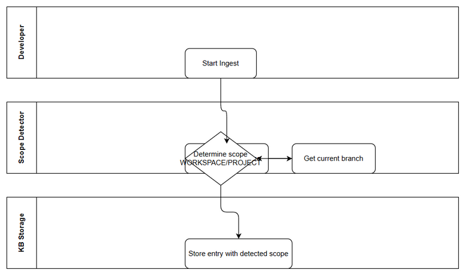
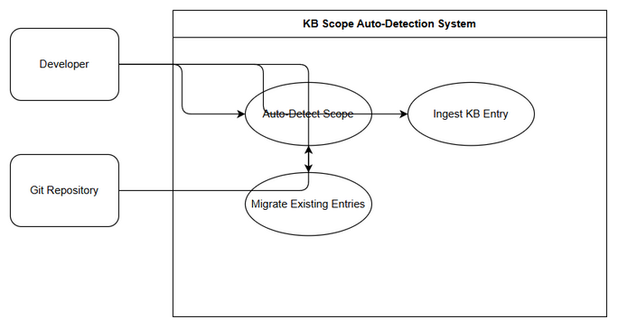

# Business Requirements Document (BRD)

## SA4E-242 — KB Scope Auto-Detection based on VCS presence and branch for Extension ingest

---
## Document Information

| Field | Value |
|-------|-------|
| Jira Ticket | SA4E-242 |
| Title | KB Scope Auto-Detection based on VCS presence and branch for Extension ingest |
| Author | BA Agent |
| Version | 1.1 |
| Date | 2026-09-05 |
| Status | Draft |

---
## Revision History

| Version | Date | Author | Changes |
|---------|------|--------|---------|
| 1.0 | 2026-09-05 | BA Agent | Initial draft |
| 1.1 | 2026-09-05 | BA Agent | Added US-2, US-3 with Acceptance Criteria; added business-flow and use-case diagrams; added Diagram Index |

---
## 1. Introduction

### 1.1 Scope
Extension currently hard-codes scope PROJECT for many KB ingest flows. Requirement is to auto-detect scope WORKSPACE / PROJECT based on VCS presence and current branch to ensure KB data is stored in correct scope.

### 1.2 Out of Scope
- Changing IsolationLayer backend logic
- Modifying data retention policies
- UI changes for manual scope override

### 1.3 Preliminary Requirements
- SA4E-30 scope hierarchy implemented
- SA4E-31 cross-workspace isolation available

---
## 2. Business Requirements

### 2.1 High Level Process Map
KB ingest flow will invoke scope-detector utility before persisting entries. Detector checks for .git presence and current branch to decide WORKSPACE vs PROJECT scope.

*[Edit in draw.io](diagrams/business-flow.drawio)*

### 2.2 List of User Stories

| # | User Story | Priority | Source Ticket |
|---|------------|----------|---------------|
| 1 | As a developer, I want KB entries automatically assigned WORKSPACE when working on feature branch, so that I do not pollute main project data | MUST HAVE | SA4E-242 |
| 2 | As a developer, I want KB entries automatically assigned PROJECT when working on git main/master branch, so that shared project data is consistent | MUST HAVE | SA4E-242 |
| 3 | As a maintainer, I want existing KB entries migrated seamlessly to correct scope on first ingest after detector activation, so that data continuity is preserved | SHOULD HAVE | SA4E-242 |

### 2.3 Details of User Stories

#### STORY US-1: Auto-assign WORKSPACE on non-main branch / no VCS

> As a developer, I want KB entries automatically assigned WORKSPACE when working on feature branch, so that I do not pollute main project data

**Requirement Details:**
1. Scope detector checks for VCS presence
2. If no .git folder or branch != main/master, scope = WORKSPACE
3. All ingest services use detected scope

**Acceptance Criteria:**
1. `detectKbScope()` returns WORKSPACE when .git is absent
2. `detectKbScope()` returns WORKSPACE when current branch is feature, develop, or any non-main/master
3. PegaSchemaIndexer, AttachmentFetcher, KbEntryBuilder use detected scope instead of hard-coded PROJECT
4. Existing ingest flow remains functional for WORKSPACE entries

#### STORY US-2: Auto-assign PROJECT on git main/master

> As a developer, I want KB entries automatically assigned PROJECT when working on git main/master branch, so that shared project data is consistent

**Requirement Details:**
1. Scope detector verifies git repository exists
2. Detects current branch name via git rev-parse
3. If branch == main or master, scope = PROJECT

**Acceptance Criteria:**
1. `detectKbScope()` returns PROJECT when .git exists and branch == main
2. `detectKbScope()` returns PROJECT when .git exists and branch == master
3. JiraProjectIndexer and indexer-http use detected scope
4. No regression for existing PROJECT ingest on main branch
5. Build TypeScript passes lint

#### STORY US-3: Seamless migration for existing entries

> As a maintainer, I want existing KB entries migrated seamlessly to correct scope on first ingest after detector activation, so that data continuity is preserved

**Requirement Details:**
1. BaseNode default scope updated to use detector
2. On first ingest after activation, existing entries re-evaluated
3. No duplicate entries created during migration

**Acceptance Criteria:**
1. Existing WORKSPACE entries remain under WORKSPACE after upgrade
2. Existing PROJECT entries on main branch remain under PROJECT
3. Migration is idempotent — repeated runs do not create duplicates
4. Logs indicate scope decision per entry: `{ticket, detectedScope, reason}`

---
## 3. Business Flow

**Step 1:** Developer triggers KB ingest via Extension
**Step 2:** Scope detector checks for .git folder presence
**Step 3:** If present, get current branch name
**Step 4:** Determine scope: WORKSPACE if no VCS or branch != main/master; PROJECT otherwise
**Step 5:** Ingest service persists entry with detected scope

> Note: Detector result is cached per workspace session for performance

*[Edit in draw.io](diagrams/use-case.drawio)*

---
## 4. Dependencies

| Dependency | Type | Related Ticket | Description |
|------------|------|----------------|-------------|
| Scope hierarchy | System | SA4E-30 | WORKSPACE/PROJECT hierarchy |
| Cross-workspace isolation | System | SA4E-31 | IsolationLayer support |

---
## 5. Non-Functional Requirements

| Category | Requirement | Details |
|----------|-------------|---------|
| Performance | Detector overhead < 50ms | Cached per session |
| Security | No VCS credentials exposed | Read-only branch check |
| Compatibility | No breaking change to existing PROJECT ingest | Maintain backward compatibility |

---
## 6. Appendix

### Diagram Index

| Diagram | File | Description |
|---------|------|-------------|
| Business Flow | diagrams/business-flow.drawio / diagrams/business-flow.png | Swimlane flow of scope detection and ingest |
| Use Case | diagrams/use-case.drawio / diagrams/use-case.png | Actors and use cases for scope auto-detection |

### Glossary

| Term | Definition |
|------|------------|
| WORKSPACE | Personal scope for feature branches / no VCS |
| PROJECT | Shared scope for main/master branches |

