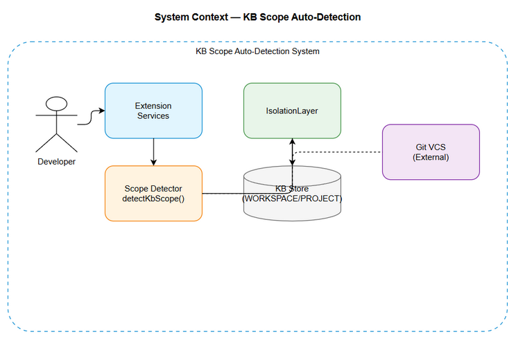
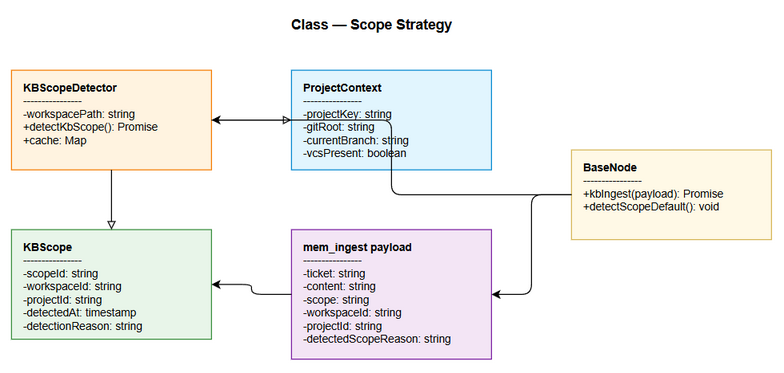

# Functional Specification Document (FSD)

## SA4E-242 — KB Scope Auto-Detection based on VCS presence and branch for Extension ingest

---

## Document Information

| Field | Value |
|-------|-------|
| Jira Ticket | SA4E-242 |
| Title | KB Scope Auto-Detection based on VCS presence and branch for Extension ingest |
| Author | BA Agent |
| Version | 1.1 |
| Date | 2026-09-05 |
| Status | Draft |
| Related BRD | documents/SA4E-242/BRD.md v1.1 |

---

## Revision History

| Version | Date | Author | Changes |
|---------|------|--------|---------|
| 1.0 | 2026-09-05 | BA Agent | Initial FSD generated from BRD v1.1 |
| 1.1 | 2026-09-05 | TA Agent | Technical enrichment: added Technical Architecture, detectKbScope pseudocode, error handling, scope override inputs, API signatures <!-- TA enrichment --> |

---

## 1. Introduction

### 1.1 Purpose
This FSD specifies the functional requirements for automatic KB scope detection based on VCS presence and branch name. The feature ensures KB entries are stored under WORKSPACE scope on feature branches / no VCS, and PROJECT scope on git main/master branches, preventing data pollution and ensuring consistent shared data.

### 1.2 Scope
Referencing BRD v1.1 §1.1 Scope:
- Auto-detect scope WORKSPACE / PROJECT before KB ingest
- Scope detector utility invoked by all ingest services
- Detector caches result per workspace session for performance
Out of scope per BRD §1.2: Changing IsolationLayer backend logic, modifying data retention policies, UI manual override.

### 1.3 Definitions & Acronyms

| Term | Definition |
|------|------------|
| WORKSPACE | Personal scope for feature branches / no VCS |
| PROJECT | Shared scope for main/master branches |
| VCS | Version Control System, git |
| KB | Knowledge Base |
| mem_ingest | Memory ingest API for KB entries |

### 1.4 References

| Document | Location |
|----------|----------|
| BRD | documents/SA4E-242/BRD.md v1.1 |
| STATUS | documents/SA4E-242/STATUS.json |

---

## 2. System Overview

### 2.1 System Context Diagram


*[Edit in draw.io](diagrams/system-context.drawio)*

The extension initiates KB ingest. Scope Detector checks VCS presence and branch. Result feeds IsolationLayer and KB Store.

### 2.2 System Architecture
Components:
- Extension services: PegaSchemaIndexer, AttachmentFetcher, KbEntryBuilder, JiraProjectIndexer
- Scope Detection utility: detectKbScope()
- Backend: IsolationLayer, indexer-http
- Storage: KB Store with scope dimension

### 2.3 Technical Architecture <!-- TA enrichment -->
**Technology Stack:**
- Extension: TypeScript + Hono backend, Svelte 4 + Vite webview, LangGraph orchestration
- Scope Detector: TypeScript utility `src/services/scope-detector.ts` using Node.js `fs` and `child_process.exec`
- VCS Detection: git CLI via `git rev-parse --abbrev-ref HEAD`, fallback to filesystem `.git` check
- Caching: In-memory session cache (`Map<workspacePath, {scope, reason, ts}>`) with TTL 5 minutes
- Backend Integration: IsolationLayer receives scope via `mem_ingest` payload; no backend changes to IsolationLayer logic per BRD

**Component Interaction:**
1. Extension services invoke `detectKbScope(workspacePath, options)`
2. Detector checks cache → .git presence → branch detection → returns scope
3. Result augmented to `mem_ingest` payload before calling backend indexer-http
4. Backend persists with scope dimension; logs `{ticket, detectedScope, reason}`

**Performance Constraints:**
- Detector overhead < 50ms p95; cache hit < 5ms
- Git command timeout 500ms; on timeout → fallback to WORKSPACE with warning log

---

## 3. Functional Requirements

### 3.1 Feature: Auto-assign WORKSPACE on non-main branch / no VCS
**Source:** BRD US-1

#### 3.1.1 Description
Scope detector checks for .git folder presence. If absent or branch != main/master, scope = WORKSPACE.

#### 3.1.2 Use Case
**Use Case ID:** UC-1
**Actor:** Developer
**Preconditions:** Developer triggers KB ingest via Extension
**Postconditions:** KB entry persisted with WORKSPACE scope

**Main Flow:**
| Step | Actor | System | Description |
|------|-------|--------|-------------|
| 1 | Developer | | Triggers ingest |
| 2 | | Scope Detector | Checks .git presence |
| 3 | | Scope Detector | Gets branch name if present |
| 4 | | Scope Detector | Returns WORKSPACE |
| 5 | | Ingest Service | Persists entry with WORKSPACE |

**Alternative Flows:**
| ID | Condition | Steps |
|----|-----------|-------|
| AF-1 | .git absent | Skip branch check, return WORKSPACE |

**Exception Flows:**
| ID | Condition | Steps |
|----|-----------|-------|
| EF-1 | git command fails | Log warning, default to WORKSPACE |

#### 3.1.3 Business Rules
| Rule ID | Rule | Source |
|---------|------|--------|
| BR-1 | detectKbScope returns WORKSPACE when .git absent | BRD US-1 AC1 |
| BR-2 | detectKbScope returns WORKSPACE when branch != main/master | BRD US-1 AC2 |
| BR-3 | PegaSchemaIndexer, AttachmentFetcher, KbEntryBuilder use detected scope | BRD US-1 AC3 |

### 3.2 Feature: Auto-assign PROJECT on git main/master
**Source:** BRD US-2

#### 3.2.1 Description
If .git exists and branch == main or master, scope = PROJECT.

#### 3.2.2 Use Case
**Use Case ID:** UC-2
**Actor:** Developer
**Preconditions:** Working on main/master branch
**Postconditions:** KB entry persisted with PROJECT scope

**Main Flow:**
| Step | Actor | System | Description |
|------|-------|--------|-------------|
| 1 | Developer | | Triggers ingest on main |
| 2 | | Scope Detector | Verifies .git exists |
| 3 | | Scope Detector | Detects branch via git rev-parse |
| 4 | | Scope Detector | Returns PROJECT |
| 5 | | Ingest Service | Persists entry with PROJECT |

#### 3.2.3 Business Rules
| Rule ID | Rule | Source |
|---------|------|--------|
| BR-4 | detectKbScope returns PROJECT when branch == main | BRD US-2 AC1 |
| BR-5 | detectKbScope returns PROJECT when branch == master | BRD US-2 AC2 |
| BR-6 | JiraProjectIndexer and indexer-http use detected scope | BRD US-2 AC3 |

### 3.3 Feature: Seamless migration for existing entries
**Source:** BRD US-3

#### 3.3.1 Description
BaseNode default scope updated to use detector. Existing entries re-evaluated on first ingest, idempotent migration.

#### 3.3.2 Use Case
**Use Case ID:** UC-3
**Actor:** Maintainer
**Preconditions:** Detector activated
**Postconditions:** Existing entries remain under correct scope, no duplicates

#### 3.3.3 Business Rules
| Rule ID | Rule | Source |
|---------|------|--------|
| BR-7 | Existing WORKSPACE entries remain under WORKSPACE | BRD US-3 AC1 |
| BR-8 | Existing PROJECT entries on main remain under PROJECT | BRD US-3 AC2 |
| BR-9 | Migration idempotent | BRD US-3 AC3 |
| BR-10 | Logs indicate scope decision per entry {ticket, detectedScope, reason} | BRD US-3 AC4 |

---

## 4. Data Model

### 4.1 Logical Entities

#### Entity: KBScope
| Attribute | Type | Required | Business Rule | Description |
|-----------|------|----------|---------------|-------------|
| scopeId | string | Y | | WORKSPACE or PROJECT |
| workspaceId | string | Y | | Workspace identifier |
| projectId | string | N | | Project identifier if PROJECT |
| detectedAt | timestamp | Y | | Detection timestamp |
| detectionReason | string | Y | | VCS absent / branch name |

#### Entity: ProjectContext
| Attribute | Type | Required | Business Rule | Description |
|-----------|------|----------|---------------|-------------|
| projectKey | string | Y | | e.g., SA4E |
| gitRoot | string | N | | Path to .git root |
| currentBranch | string | N | | Branch name |
| vcsPresent | boolean | Y | | .git folder exists |

#### Entity: mem_ingest payload
| Field | Type | Required | Validation | Description |
|-------|------|----------|------------|-------------|
| ticket | string | Y | SA4E-\d+ | Jira ticket key |
| content | string | Y | | KB content |
| scope | string | Y | WORKSPACE|PROJECT | Detected scope |
| workspaceId | string | Y | | |
| projectId | string | N | | |
| source | string | Y | extension|backend | |
| detectedScopeReason | string | N | | Reason for scope decision |

---

## 5. API Contracts

### 5.1 detectKbScope
**Signature:** `detectKbScope(workspacePath: string, options?: {scopeOverride?: 'WORKSPACE'|'PROJECT', forceRefresh?: boolean}): Promise<{scope: 'WORKSPACE'|'PROJECT', reason: string, source: 'cache'|'detected'}>` <!-- TA enrichment -->

**Functional View:**
**Input Parameters:**
| Parameter | Type | Required | Business Rule | Description |
|-----------|------|----------|---------------|-------------|
| workspacePath | string | Y | | Extension workspace root |
| options.scopeOverride | 'WORKSPACE'|'PROJECT' | N | Override detector result for testing | Manual override input, not persisted |
| options.forceRefresh | boolean | N | Default false | Bypass session cache |

**Output Data:**
| Field | Type | Description |
|-------|------|-------------|
| scope | string | WORKSPACE or PROJECT |
| reason | string | e.g., 'no .git', 'branch=feature/x', 'branch=main', 'override' |
| source | string | 'cache' or 'detected' |

**Processing Steps:**
1. Check for .git folder under workspacePath
2. If absent → return WORKSPACE, reason='no VCS'
3. Execute git rev-parse --abbrev-ref HEAD
4. If branch == main/master → return PROJECT, reason='branch=main'
5. Else → return WORKSPACE, reason='branch=feature'

**Pseudocode:** <!-- TA enrichment -->
```
// Pseudocode for detectKbScope with VCS detection logic
function detectKbScope(workspacePath, options = {}):
    if options.scopeOverride:
        return {scope: options.scopeOverride, reason: 'override', source: 'detected'}
    
    cacheKey = workspacePath
    if not options.forceRefresh and cache.has(cacheKey):
        return cache.get(cacheKey)
    
    gitDir = findUp(workspacePath, '.git')
    if not gitDir:
        result = {scope: 'WORKSPACE', reason: 'no VCS', source: 'detected'}
        cache.set(cacheKey, result)
        return result
    
    try:
        branch = execWithTimeout('git rev-parse --abbrev-ref HEAD', cwd=workspacePath, timeout=500)
        branch = branch.trim()
    catch GitError as e:
        log.warn('git detection failed', {workspacePath, error: e.message})
        result = {scope: 'WORKSPACE', reason: 'git error', source: 'detected'}
        cache.set(cacheKey, result)
        return result
    
    if branch in ['main', 'master']:
        scope = 'PROJECT'
        reason = `branch=${branch}`
    else:
        scope = 'WORKSPACE'
        reason = `branch=${branch}`
    
    result = {scope, reason, source: 'detected'}
    cache.set(cacheKey, result)
    return result
```

**Error Handling:** <!-- TA enrichment -->
| Error Scenario | Trigger | Handling | Log Level |
|----------------|---------|----------|-----------|
| Git command not found | exec throws ENOENT | Default WORKSPACE, reason='git not installed' | WARN |
| Git timeout (>500ms) | exec timeout | Default WORKSPACE, reason='git timeout' | WARN |
| Git repo corrupt | rev-parse returns error | Default WORKSPACE, reason='git error' | WARN |
| Permission denied | fs access error | Default WORKSPACE, reason='access denied' | ERROR |
| Cache failure | Map operation error | Continue without cache | DEBUG |

**API Signature Details (Technical):**
- **Method:** Internal function (in-process)
- **Auth:** None (internal service)
- **Rate Limit:** N/A
- **Error Codes:**
  - `SCOPE_DETECT_OK` 0 — Success
  - `SCOPE_DETECT_GIT_ERROR` 1001 — Git detection failed, fallback to WORKSPACE
  - `SCOPE_DETECT_IO_ERROR` 1002 — Filesystem access error

### 5.2 BaseNode.kbIngest scope default
**Signature:** `BaseNode.kbIngest(payload: mem_ingest) => Promise<Result>`

Scope default logic:
- If payload.scope provided → use it
- Else → call detectKbScope for workspacePath and set scope
- Log {ticket, detectedScope, reason}

---

## 6. Integration Specifications

### 6.1 Extension Services
| Service | Integration Point | Direction | Data |
|---------|-------------------|-----------|------|
| PegaSchemaIndexer | detectKbScope | Inbound | scope |
| AttachmentFetcher | detectKbScope | Inbound | scope |
| KbEntryBuilder | detectKbScope | Inbound | scope |
| JiraProjectIndexer | detectKbScope | Inbound | scope |

### 6.2 Backend
| Component | Purpose | Data Exchange |
|-----------|---------|---------------|
| IsolationLayer | Enforce scope isolation | Receives scope from detector |
| indexer-http | HTTP ingest endpoint | Receives scope in payload |
| PegaSchemaIndexer | Index Pega schema | Uses detected scope |
| KbEntryBuilder | Build KB entries | Uses detected scope |

All services replace hard-coded PROJECT with detected scope.

---

## 7. Non-Functional Requirements

| Category | Business Requirement | Acceptance Criteria |
|----------|---------------------|---------------------|
| Performance | Detector overhead < 50ms | Cached per session, measure avg latency |
| Security | No VCS credentials exposed | Read-only branch check |
| Compatibility | No breaking change | Existing PROJECT ingest on main unaffected |
| Reliability | Idempotent migration | Repeated runs no duplicates |

---

## 8. Diagrams References

### 8.1 Sequence Diagram — Scope Detection


*[Edit in draw.io](diagrams/sequence-scope-detection.drawio)*

### 8.2 Class Diagram — Scope Strategy


*[Edit in draw.io](diagrams/class-scope-strategy.drawio)*

---

## 9. Testing Considerations

| ID | Scenario | Input | Expected Output | Priority |
|----|----------|-------|-----------------|----------|
| TC-1 | No .git folder | workspacePath without .git | scope=WORKSPACE | High |
| TC-2 | Branch feature | .git present, branch feature/x | scope=WORKSPACE | High |
| TC-3 | Branch main | .git present, branch main | scope=PROJECT | High |
| TC-4 | Branch master | .git present, branch master | scope=PROJECT | High |
| TC-5 | Migration idempotency | Run ingest twice | No duplicate entries | Medium |

---

## 10. Appendix

### Diagrams

| Diagram | File |
|---------|------|
| System Context | [system-context.png](diagrams/system-context.png) |
| Sequence - Scope Detection | [sequence-scope-detection.png](diagrams/sequence-scope-detection.png) |
| Class - Scope Strategy | [class-scope-strategy.png](diagrams/class-scope-strategy.png) |

### Change Log from BRD
FSD adds functional API contracts, data model entities, integration points, and diagrams not present in BRD.
