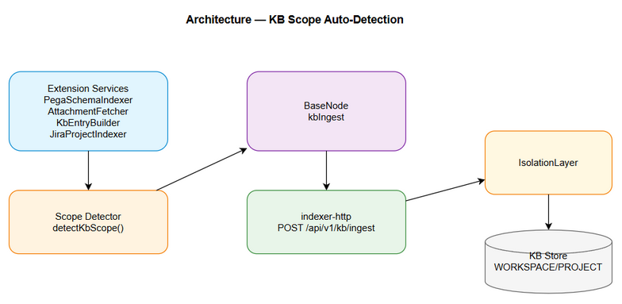
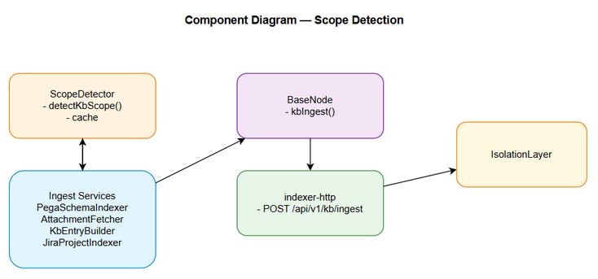
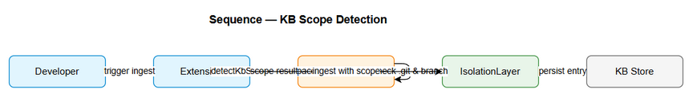
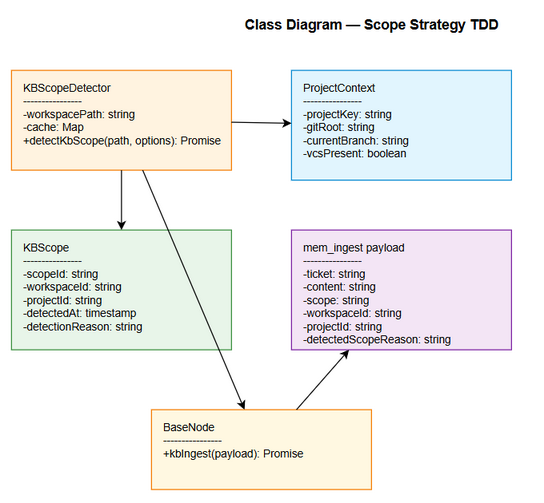

# Technical Design Document (TDD)

## SA4E-242 — KB Scope Auto-Detection based on VCS presence and branch for Extension ingest

---

## Document Information

| Field | Value |
|-------|-------|
| Jira Ticket | SA4E-242 |
| Title | KB Scope Auto-Detection based on VCS presence and branch for Extension ingest |
| Author | SA Agent |
| Version | 1.0 |
| Date | 2026-09-05 |
| Status | Draft |
| Related BRD | documents/SA4E-242/BRD.md v1.1 |
| Related FSD | documents/SA4E-242/FSD.md v1.1 |

---

## 1. Overview

### 1.1 Purpose
This TDD defines the technical design for automatic KB scope detection based on VCS presence and current git branch. The design implements scope-detector utility, integrates with BaseNode.kbIngest, indexer-http, and IsolationLayer to ensure KB entries are stored under WORKSPACE for feature branches / no VCS, and PROJECT for git main/master branches.

### 1.2 Scope
- Design scope-detector service `detectKbScope`
- Integrate scope detection into Extension ingest services: PegaSchemaIndexer, AttachmentFetcher, KbEntryBuilder, JiraProjectIndexer
- Update BaseNode default scope logic to use detector
- Ensure indexer-http receives scope in mem_ingest payload
- IsolationLayer consumes detected scope

Out of scope per BRD: IsolationLayer backend logic change, data retention policy change, UI manual override.

### 1.3 Design Principles
- Non-breaking: hard-coded PROJECT replaced only where detector is available
- Performance: cache per workspace session, overhead <50ms p95
- Safety: fallback to WORKSPACE on errors, no credentials exposure
- Idempotent migration: repeat ingest does not duplicate entries

---

## 2. Architecture

### 2.1 High Level Components

- **scope-detector**: `src/services/scope-detector.ts` `detectKbScope(workspacePath, options)`
- **BaseNode**: `BaseNode.kbIngest` default scope resolution
- **indexer-http**: HTTP ingest endpoint receiving scope
- **services**: Extension ingest services consuming detector
- **IsolationLayer**: Enforces scope isolation downstream


*[Edit in draw.io](diagrams/architecture.drawio)*

### 2.2 Component Diagram


*[Edit in draw.io](diagrams/component.drawio)*

### 2.3 Deployment Overview
Extension runs in VS Code workspace. Detector executes in-process TypeScript using Node.js fs and child_process.exec. Backend services indexer-http and IsolationLayer run as Hono services. No new infrastructure required.

---

## 3. API Contracts

### 3.1 detectKbScope

**Signature**
```ts
detectKbScope(workspacePath: string, options?: { scopeOverride?: 'WORKSPACE'|'PROJECT', forceRefresh?: boolean }): Promise<{scope: 'WORKSPACE'|'PROJECT', reason: string, source: 'cache'|'detected'}>
```

**Input**
| Parameter | Type | Required | Description |
|-----------|------|----------|-------------|
| workspacePath | string | Y | Extension workspace root |
| options.scopeOverride | 'WORKSPACE'|'PROJECT' | N | Manual override for testing |
| options.forceRefresh | boolean | N | Bypass session cache |

**Output**
| Field | Type | Description |
|-------|------|-------------|
| scope | string | WORKSPACE or PROJECT |
| reason | string | e.g., 'no VCS', 'branch=feature/x', 'branch=main' |
| source | string | 'cache' or 'detected' |

**Processing**
1. Check cache if not forceRefresh
2. Find `.git` folder via findUp
3. If absent → WORKSPACE, reason='no VCS'
4. Execute `git rev-parse --abbrev-ref HEAD` with 500ms timeout
5. If branch in ['main','master'] → PROJECT else WORKSPACE
6. Cache result TTL 5 minutes

**Error Handling**
| Scenario | Handling | Log |
|----------|----------|-----|
| git not found | default WORKSPACE, reason='git not installed' | WARN |
| timeout | default WORKSPACE, reason='git timeout' | WARN |
| git error | default WORKSPACE, reason='git error' | WARN |
| permission denied | default WORKSPACE, reason='access denied' | ERROR |

### 3.2 BaseNode.kbIngest

**Signature**
```ts
BaseNode.kbIngest(payload: mem_ingest) => Promise<Result>
```

**Scope default logic**
- If payload.scope provided → use it
- Else → call detectKbScope for workspacePath, set scope
- Log `{ticket, detectedScope, reason}`

### 3.3 indexer-http

**Endpoint**
`POST /api/v1/kb/ingest`

**Payload**
```json
{
  "ticket": "SA4E-242",
  "content": "...",
  "scope": "WORKSPACE|PROJECT",
  "workspaceId": "...",
  "projectId": "...",
  "source": "extension|backend",
  "detectedScopeReason": "..."
}
```

**Response**
```json
{ "status": "ok", "id": "...", "scope": "WORKSPACE|PROJECT" }
```

---

## 4. Data Model

### 4.1 KBScope Enum
```ts
type KBScope = 'WORKSPACE' | 'PROJECT';
```

### 4.2 ProjectContext
| Attribute | Type | Required | Description |
|-----------|------|----------|-------------|
| projectKey | string | Y | e.g., SA4E |
| gitRoot | string | N | Path to .git root |
| currentBranch | string | N | Branch name |
| vcsPresent | boolean | Y | .git folder exists |

### 4.3 mem_ingest payload
| Field | Type | Required | Validation |
|-------|------|----------|------------|
| ticket | string | Y | SA4E-\d+ |
| content | string | Y | |
| scope | string | Y | WORKSPACE|PROJECT |
| workspaceId | string | Y | |
| projectId | string | N | |
| source | string | Y | extension|backend |
| detectedScopeReason | string | N | |

---

## 5. Sequence Diagram — Scope Detection Flow


*[Edit in draw.io](diagrams/sequence-scope-detection.drawio)*

**Flow**
1. Developer triggers ingest via Extension
2. Service calls detectKbScope
3. Detector checks cache → .git → git rev-parse
4. Returns scope + reason
5. Service builds mem_ingest payload with scope
6. POST to indexer-http
7. IsolationLayer persists with scope

---

## 6. Class Diagram — Scope Strategy


*[Edit in draw.io](diagrams/class-scope-strategy-tdd.drawio)*

**Key Classes**
- `KBScopeDetector`: detectKbScope(), cache
- `ProjectContext`: projectKey, gitRoot, currentBranch, vcsPresent
- `KBScope`: scopeId, workspaceId, projectId, detectedAt, detectionReason
- `BaseNode`: kbIngest()
- `IsolationLayer`: enforce scope

---

## 7. Implementation Notes

### 7.1 Scope Detector Implementation
- File: `src/services/scope-detector.ts`
- Dependencies: Node.js fs, child_process.exec, find-up
- Cache: `Map<string, {scope, reason, ts}>` TTL 5 min
- Timeout git command 500ms

### 7.2 Service Integration
Services PegaSchemaIndexer, AttachmentFetcher, KbEntryBuilder, JiraProjectIndexer must import detectKbScope and replace hard-coded PROJECT.

### 7.3 Error Handling
- All errors fallback to WORKSPACE
- Log structured fields: ticket, workspacePath, detectedScope, reason, errorCode
- Error codes: SCOPE_DETECT_OK 0, SCOPE_DETECT_GIT_ERROR 1001, SCOPE_DETECT_IO_ERROR 1002

### 7.4 Performance
- Cache hit <5ms
- Detector overhead <50ms p95
- No blocking I/O beyond git check

### 7.5 Testing Notes
- Unit tests for detectKbScope with mocked fs and exec
- Integration tests for BaseNode.kbIngest scope default
- E2E tests for indexer-http with scope payload

---

## 8. Monitoring & Observability

- Log scope decision per entry: `{ticket, detectedScope, reason, source}`
- Metrics: detector latency, cache hit ratio, git error rate
- Health check: detector self-test on startup

---

## References
- BRD v1.1
- FSD v1.1
