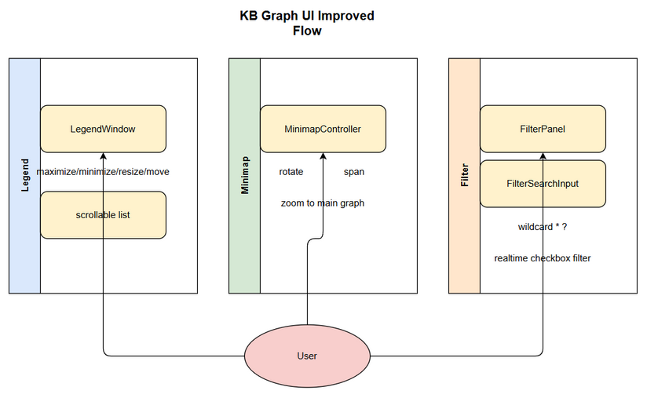

# Business Requirements Document (BRD)

## SDLC-Agents-4-Enterprise — SA4E-247: Cải thiện UI KB Graph: Legend window, Minimap và Filter với tách component

---

## Document Information

| Field | Value |
|-------|-------|
| Jira Ticket | SA4E-247 |
| Title | Cải thiện UI KB Graph: Legend window, Minimap và Filter với tách component |
| Author | BA Agent |
| Version | 1.0 |
| Date | 2026-09-06 |
| Status | Draft |

---

## Author Tracking

| Role | Name - Position | Responsibility |
|------|-----------------|----------------|
| Author | BA Agent – Business Analyst | Create document |
| Peer Reviewer | – | Review document |

---

## Revision History

| Version | Date | Author | Changes |
|---------|------|--------|---------|
| 1.0 | 2026-09-06 | BA Agent | Initiate document — auto-generated from Jira ticket SA4E-247 |

---

## Sign-Off

| Name | Signature and date |
|------|--------------------|
| | ☐ I agree and confirm all criteria on this BRD as expected requirements |
| | ☐ I agree and confirm all criteria on this BRD as expected requirements |

---

## 1. Introduction

### 1.1 Scope
Nâng cao trải nghiệm UI cho KB Graph trong đồ án Pega với nhiều loại rule. Phạm vi bao gồm:
- Chuyển Legend Node Types từ vùng cố định góc trái dưới thành cửa sổ độc lập có thể maximize/minimize/resize/move và scrollable.
- Tách component LegendWindow riêng.
- Nâng cấp Minimap góc phải dưới với chức năng rotate, span, zoom to main graph.
- Tách component MinimapController riêng.
- Thêm ô tìm kiếm text trong dropdown Filter như Excel column filter, hỗ trợ wildcard * và ?, lọc checkbox realtime khi gõ.
- Tách component FilterPanel với FilterSearchInput riêng.
- Không sửa trực tiếp file monolithic, giữ tương thích với backend viewer hiện tại.

### 1.2 Out of Scope
- Thay đổi logic backend graph data hoặc API viewer hiện tại.
- Thay đổi thuật toán layout graph.
- Thêm tính năng xuất/nhập graph.

### 1.3 Preliminary Requirement
- KB Graph viewer hiện tại đang hoạt động và hiển thị đúng dữ liệu Pega rules.
- Codebase frontend cho KB Graph có thể được refactor thành components.

---

## 2. Business Requirements

### 2.1 High Level Process Map
Người dùng mở KB Graph → UI hiển thị graph với Legend, Minimap, Filter sidebar → Người dùng tương tác với Legend window độc lập / Minimap nâng cấp / Filter có tìm kiếm text → UI phản hồi realtime và giữ trạng thái.

*[Edit in draw.io](diagrams/business-flow.drawio)*

### 2.2 List of User Stories / Use Cases

| # | Story / Use Case / Epic | Priority | Source Ticket |
|---|-------------------------|----------|---------------|
| 1 | As a KB Graph user, I want Legend Node Types as an independent resizable window so that I can view and navigate types without clutter | MUST HAVE | SA4E-247 |
| 2 | As a KB Graph user, I want Minimap with rotate/span/zoom capabilities so that I can orient myself in large Pega rule graphs | MUST HAVE | SA4E-247 |
| 3 | As a KB Graph user, I want Filter panel with text search and wildcard support so that I can quickly find node types | SHOULD HAVE | SA4E-247 |

---

### 2.3 Details of User Stories

---

#### Business Flow

**Step 1:** Người dùng mở trang KB Graph.
**Step 2:** UI render graph với Legend window, Minimap, Filter panel.
**Step 3:** Người dùng tương tác Legend window: move, resize, maximize/minimize, scroll.
**Step 4:** Người dùng tương tác Minimap: rotate view, span, click zoom to main graph.
**Step 5:** Người dùng gõ text vào Filter search input, checkbox được lọc realtime theo wildcard.
**Step 6:** UI cập nhật graph hiển thị theo lựa chọn filter.

> **Note:** Các component phải được tách riêng để dễ review và bảo trì.

---

#### STORY 1: Legend Window Independent

> As a KB Graph user, I want Legend Node Types as an independent resizable window so that I can view and navigate types without clutter

**Requirement Details:**
1. Legend hiện tại quá dài và cố định góc trái dưới cần chuyển thành cửa sổ độc lập.
2. Cửa sổ hỗ trợ maximize/minimize/resize/move và scrollable.
3. Tách component LegendWindow riêng khỏi monolithic file.

**Data Fields (if applicable):**
| Field | Type | Required | Description | Example |
|-------|------|----------|-------------|---------|
| nodeType | string | Yes | Loại node Pega | ACTIVITY, CLASS |
| count | integer | Yes | Số lượng node | 1349 |

**Acceptance Criteria:**
1. Legend hiển thị trong cửa sổ độc lập có title bar với nút minimize/maximize/close.
2. Cửa sổ có thể drag move và resize bằng chuột.
3. Nội dung legend scrollable khi danh sách dài.
4. Component LegendWindow tách riêng và import được.

**UI Specifications (if applicable):**
| No. | Name | Type | Required | Description | Note |
|-----|------|------|----------|-------------|------|
| 1 | LegendWindow | Container | Yes | Cửa sổ độc lập chứa legend | Có thể move/resize |
| 2 | LegendList | Scrollable List | Yes | Hiển thị danh sách node types | Scrollable |
| 3 | MinimizeButton | Button | Yes | Thu nhỏ cửa sổ |  |
| 4 | MaximizeButton | Button | Yes | Phóng to cửa sổ |  |

**Validation Rules (if applicable):**
- LegendWindow phải giữ state vị trí sau reload session.

**Error Handling (if applicable):**
- Nếu legend data rỗng: hiển thị thông báo "No types".

---

#### STORY 2: Minimap Enhanced

> As a KB Graph user, I want Minimap with rotate/span/zoom capabilities so that I can orient myself in large Pega rule graphs

**Requirement Details:**
1. Minimap hiện ở góc phải dưới cần thêm chức năng rotate, span, zoom to main graph.
2. Tách component MinimapController riêng.

**Acceptance Criteria:**
1. Minimap hiển thị thumbnail của toàn bộ graph.
2. Hỗ trợ rotate view 90 độ.
3. Hỗ trợ span mode hiển thị vùng nhìn hiện tại.
4. Click vào minimap zoom to main graph tại vị trí click.
5. Component MinimapController tách riêng.

**UI Specifications:**
| No. | Name | Type | Required | Description | Note |
|-----|------|------|----------|-------------|------|
| 1 | MinimapContainer | Container | Yes | Vùng hiển thị thumbnail graph |  |
| 2 | RotateButton | Button | Yes | Xoay minimap |  |
| 3 | SpanToggle | Toggle | Yes | Bật/tắt span mode |  |
| 4 | ZoomViewport | Rectangle | Yes | Khung vùng nhìn hiện tại |  |

---

#### STORY 3: Filter Panel with Text Search

> As a KB Graph user, I want Filter panel with text search and wildcard support so that I can quickly find node types

**Requirement Details:**
1. Thêm ô tìm kiếm text trong dropdown Filter như Excel column filter.
2. Hỗ trợ wildcard * và ? cho tên loại node.
3. Lọc checkbox realtime khi gõ.
4. Tách component FilterPanel với FilterSearchInput riêng.

**Acceptance Criteria:**
1. Filter panel có input search trên cùng.
2. Gõ text lọc danh sách checkbox theo tên node type.
3. Hỗ trợ wildcard * khớp nhiều ký tự, ? khớp 1 ký tự.
4. Checkbox lựa chọn vẫn hoạt động bình thường sau lọc.
5. Component tách riêng FilterPanel và FilterSearchInput.

**UI Specifications:**
| No. | Name | Type | Required | Description | Note |
|-----|------|------|----------|-------------|------|
| 1 | FilterPanel | Container | Yes | Panel chứa filter |  |
| 2 | FilterSearchInput | Input | Yes | Ô tìm kiếm text | Hỗ trợ wildcard |
| 3 | FilterCheckboxList | Checkbox Group | Yes | Danh sách loại node | Lọc realtime |

**Validation Rules:**
- Search input chấp nhận ký tự thường/hoa, wildcard hợp lệ.

---

## 3. Dependencies

| Dependency | Type | Related Ticket | Description |
|------------|------|----------------|-------------|
| KB Graph Viewer Frontend | System | SA4E-247 | Backend viewer hiện tại phải giữ tương thích |
| Pega Rule Index | Infrastructure | – | Dữ liệu node types từ Pega indexer |

---

## 4. Stakeholders

| Role | Name / Team | Responsibility | Source |
|------|-------------|----------------|--------|
| Reporter | Duc Nguyen Minh | Yêu cầu cải thiện UI | Jira reporter |
| BA | BA Agent | Viết BRD | SA4E-247 |
| Frontend Dev | – | Implement components tách rời | – |

---

## 5. Risks and Assumptions

### 5.1 Risks

| Risk | Impact | Likelihood | Mitigation |
|------|--------|------------|------------|
| Refactor component làm vỡ layout hiện tại | High | Medium | Unit test UI, review code trước merge |
| Performance giảm khi legend window scrollable với nhiều node types | Medium | Low | Virtualized list cho legend |
| Minimap rotate làm lỗi coordinate mapping | Medium | Medium | Kiểm thử tích hợp với graph library |

### 5.2 Assumptions
- Backend API không thay đổi.
- Người dùng sử dụng màn hình đủ lớn để hiển thị cửa sổ di động.
- Graph library hỗ trợ sự kiện rotate/span.

---

## 6. Non-Functional Requirements

| Category | Requirement | Details |
|----------|-------------|---------|
| Performance | UI responsive <200ms khi tương tác filter | Lọc realtime checkbox |
| Security | Không yêu cầu | UI only |
| Scalability | Hỗ trợ >10k nodes | Minimap viewport optimization |
| Availability | Giữ tương thích với viewer hiện tại | Không downtime API |

---

## 7. Related Tickets

| Ticket Key | Summary | Status | Type | Relationship |
|------------|---------|--------|------|--------------|
| SA4E-247 | Cải thiện UI KB Graph: Legend window, Minimap và Filter với tách component | To Do | Story | Main ticket |

---

## 8. Appendix

### Glossary

| Term | Definition |
|------|------------|
| Legend | Bảng chú giải loại node trong graph |
| Minimap | Bản đồ thu nhỏ tổng quan graph |
| Filter | Bộ lọc hiển thị node theo loại |

### Reference Documents
| Document | Link / Location |
|----------|-----------------|
| Jira Issue | https://jiraassist.atlassian.net/browse/SA4E-247 |
