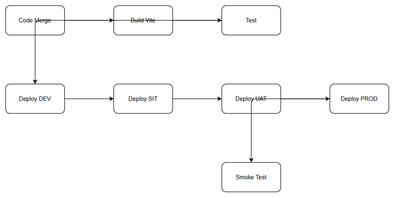
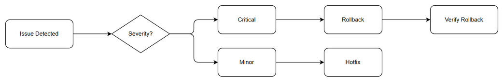

# Deployment Guide (DPG)

## SDLC-Agents-4-Enterprise — SA4E-247: Cải thiện UI KB Graph: Legend window, Minimap và Filter với tách component

---

## Document Information

| Field | Value |
|-------|-------|
| Jira Ticket | SA4E-247 |
| Title | Cải thiện UI KB Graph: Legend window, Minimap và Filter với tách component |
| Author | DevOps Agent |
| Version | 1.0 |
| Date | 2026-09-06 |
| Status | Draft |
| Related TDD | TDD-v1.0-SA4E-247 |

---

## Revision History

| Version | Date | Author | Changes |
|---------|------|--------|---------|
| 1.0 | 2026-09-06 | DevOps Agent | Initiate document — auto-generated from TDD, BRD, FSD, STP |

---

## Sign-Off

| Name | Role | Signature and date |
|------|------|--------------------|
| | Dev Lead | ☐ Approved for deployment |
| | QA Lead | ☐ Testing completed |
| | Ops Lead | ☐ Infrastructure ready |

---

## 1. Overview

### 1.1 Feature Summary

Nâng cao trải nghiệm UI KB Graph trong đồ án Pega: Legend Node Types chuyển thành cửa sổ độc lập có thể maximize/minimize/resize/move/scrollable và tách component LegendWindow; nâng cấp Minimap với rotate, span, zoom to main graph và tách MinimapController; thêm ô tìm kiếm text trong dropdown Filter hỗ trợ wildcard * và ?, lọc checkbox realtime; tách FilterPanel và FilterSearchInput. Không thay đổi logic backend.

### 1.2 Deployment Scope

| Item | Type | Description |
|------|------|-------------|
| LegendWindow.svelte | New/Modified | Independent draggable/resizable window |
| MinimapController.svelte | New/Modified | Minimap rotate/span/zoom-to-click |
| FilterPanel.svelte + FilterSearchInput.svelte | New/Modified | Wildcard searchable filter |
| Svelte Stores | Modified | legendStore, minimapStore, filterStore |
| extension/webview assets | Modified | Vite build output |
| Backend API | Unchanged | /api/v1/admin/kb-graph |
| Database | No change | Client-side localStorage only |

### 1.3 Target Environments

| Environment | URL | Deploy Order | Approval Required |
|-------------|-----|-------------|-------------------|
| DEV | vscode-webview://localhost | 1st | No |
| SIT | VS Code test channel | 2nd | No |
| UAT | VS Code pre-release | 3rd | QA Sign-off |
| PROD | VS Code internal release | 4th | PM + Business Sign-off |

---

## 2. Prerequisites

### 2.1 Infrastructure

| Requirement | Status | Notes |
|-------------|--------|-------|
| VS Code extension host | Ready | Windows/Mac |
| Node.js 18+ | Ready | Backend MCP |
| Git repository | Ready | Monorepo |
| Backend API access | Ready | http://127.0.0.1:48721 |

### 2.2 Software Dependencies

| Dependency | Version | Status |
|-----------|---------|--------|
| Node.js | >=18.14.1 | Installed |
| TypeScript | 5.x | Installed |
| Svelte | 4.x | Installed |
| Vite | 5.x | Installed |
| Three.js | 0.160+ | Installed |

### 2.3 Access Requirements

| Access | Type | Who Needs It |
|--------|------|-------------|
| Git repo | SSH key | DevOps |
| npm registry | token | CI/CD |

### 2.4 Backup Requirements

- [ ] Git tag saved
- [ ] Previous .vsix archived

---

## 3. Pre-Deployment Checklist

| # | Item | Responsible | Status |
|---|------|-------------|--------|
| 1 | Code merged to release branch | Developer | ☐ |
| 2 | Unit tests passed | Developer | ☐ |
| 3 | Integration tests passed | QA | ☐ |
| 4 | SIT/UAT sign-off | QA+BA | ☐ |
| 5 | Build artifacts ready | DevOps | ☐ |
| 6 | Rollback plan reviewed | Team | ☐ |

---

## 4. Database Migration

No database migration. Frontend only.

### 4.1 Migration Scripts
N/A

### 4.2 Execution Steps
N/A

---

## 5. Application Deployment

### 5.1 Deployment Flow

### 5.2 Deployment Steps

| Step | Action | Command | Verification |
|------|--------|---------|-------------|
| 1 | Checkout release | git checkout release/SA4E-247 | Branch exists |
| 2 | Install deps | npm ci --workspaces | Success |
| 3 | Build webview | npm run build --workspace=extension | dist generated |
| 4 | Package VSIX | vsce package | .vsix created |
| 5 | Install | Code --install-extension | Extension loads |
| 6 | Health check | Open KB Graph | Components render |

---

## 6. Configuration Changes

### 6.1 Feature Flags

| Flag | DEV | SIT | UAT | PROD |
|------|-----|-----|-----|------|
| feature.legendWindow | true | true | true | false |
| feature.minimapEnhanced | true | true | true | false |
| feature.filterWildcard | true | true | true | false |

---

## 7. Post-Deployment Verification

### 7.1 Health Checks

| Check | Expected Result |
|-------|-----------------|
| Extension loads | Webview opens <5s |
| Legend draggable | Position persists |
| Minimap rotate | 90° rotation works |
| Filter wildcard | Realtime <200ms |

### 7.2 Smoke Tests

Legend window drag/resize, Minimap click zoom, Filter search ACT*.

---

## 8. Rollback Plan

### 8.1 Rollback Flow

### 8.2 Rollback Steps

1. Uninstall new VSIX
2. git checkout previous tag
3. npm run build
4. vsce package
5. Install previous version
6. Verify smoke tests

Estimated time: 15 min.

---

## 9. Environment-Specific Notes

### 9.4 PROD

Deployment window Tue/Thu 20:00-22:00 ICT. Approval PM+BA. Notify users 24h before.

---

## 10. Appendix

Contacts: DevOps Lead devops@sa4e, QA Lead qa@sa4e.

Related Ticket: SA4E-247
