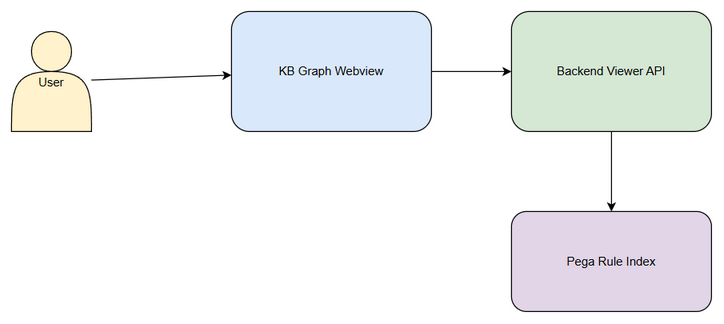
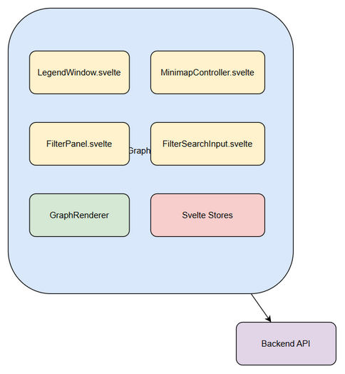
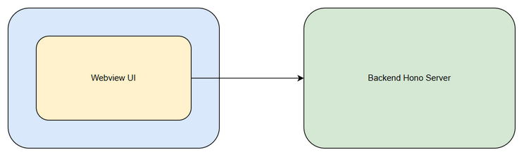
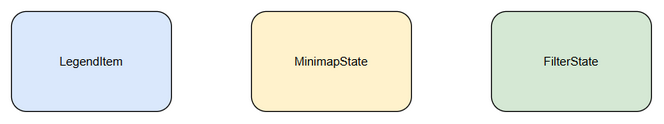
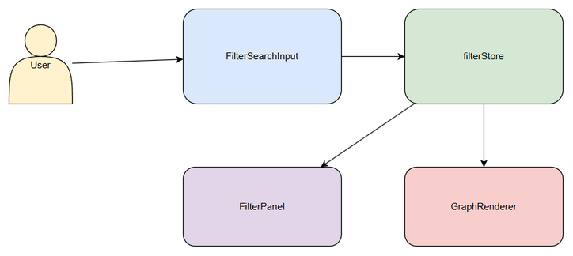

# Technical Design Document (TDD)

## SDLC-Agents-4-Enterprise — SA4E-247: Cải thiện UI KB Graph: Legend window, Minimap và Filter với tách component

---

## Document Information

| Field | Value |
|-------|-------|
| Jira Ticket | SA4E-247 |
| Title | Cải thiện UI KB Graph: Legend window, Minimap và Filter với tách component |
| Author | SA Agent |
| Version | 1.0 |
| Date | 2026-09-06 |
| Status | Draft |
| Related BRD | documents/SA4E-247/BRD.md |
| Related FSD | documents/SA4E-247/FSD.md |

---

## Author Tracking

| Role | Name - Position | Responsibility |
|------|-----------------|----------------|
| Author | SA Agent – Solution Architect | Create document |
| Peer Reviewer | - | Review document |

---

## Revision History

| Version | Date | Author | Changes |
|---------|------|--------|---------|
| 1.0 | 2026-09-06 | SA Agent | Initiate document — auto-generated from BRD and FSD |

---

## Sign-Off

| Name | Signature and date |
|------|--------------------|
| | ☐ I agree and confirm the technical design in this TDD |
| | ☐ I agree and confirm the technical design in this TDD |

---

## 1. Introduction

> **Scope Boundary:** This TDD specifies HOW to implement requirements defined in FSD.

### 1.1 Purpose
Design technical solution for refactoring monolithic KB Graph viewer into independent Svelte 4 components: LegendWindow, MinimapController, FilterPanel + FilterSearchInput, with state management via Svelte stores, maintaining backend API compatibility.

### 1.2 Scope
Frontend-only changes in VS Code extension webview. Component separation, draggable/resizable Legend window, enhanced Minimap, filter with wildcard search, state persistence via localStorage.

### 1.3 Technology Stack

| Layer | Technology | Version |
|-------|-----------|---------|
| Language | TypeScript | 5.x |
| Framework | Svelte 4 + Vite | 4.x |
| UI Library | 3d-force-graph / Three.js | 0.160+ |
| State Management | Svelte stores | - |
| Build Tool | Vite | 5.x |

### 1.4 Design Principles
- Single Responsibility
- Reactive State
- Backward Compatibility
- Performance

### 1.5 Constraints
- No change to /api/v1/admin/kb-graph contract
- localStorage limit 5MB
- Reuse existing graph.js

### 1.6 References
| Document | Location |
|----------|----------|
| BRD | documents/SA4E-247/BRD.md |
| FSD | documents/SA4E-247/FSD.md |

---

## 2. System Architecture

### 2.1 Architecture Overview
Frontend webview consumes backend KB Graph API, renders via ForceGraph3D. New components via Svelte stores.



### 2.2 Component Diagram


| Component | Responsibility | Technology |
|-----------|---------------|------------|
| LegendWindow.svelte | Draggable/resizable window | Svelte 4 |
| MinimapController.svelte | Canvas minimap rotate/span/zoom | Canvas + Svelte |
| FilterPanel.svelte | Filter container | Svelte 4 |
| FilterSearchInput.svelte | Wildcard search input | Svelte 4 |
| GraphRenderer | ForceGraph3D integration | graph.js |
| legendStore | Position/size state | Svelte store |
| minimapStore | Rotation/span state | Svelte store |
| filterStore | Query/selectedTypes | Svelte store |

### 2.3 Deployment Architecture


### 2.4 Communication Patterns
| From | To | Protocol | Pattern |
|------|----|----------|---------|
| UI Component | Svelte Store | In-memory | Sync |
| Store | GraphRenderer | Event | Sync |
| Webview | Backend | HTTP | Sync |

---

## 3. API Design

### 3.1 API Overview
| # | Endpoint | Method | Description | Source |
|---|----------|--------|-------------|--------|
| 1 | /api/v1/admin/kb-graph/nodes/summary | GET | Fetch node type counts | UC-001 |

### 3.2 API: GET /api/v1/admin/kb-graph/nodes/summary
**Implements:** UC-001, BR-01

| Attribute | Value |
|-----------|-------|
| Method | GET |
| Path | /api/v1/admin/kb-graph/nodes/summary |
| Auth | Bearer JWT |
| Rate Limit | 60/min |

**Response 200:**
```json
{ "types": [{"type":"ACTIVITY","count":1349,"color":"#3b82f6"}] }
```

No changes to contract. Client-side filtering only.

---

## 4. Database Design
No DB schema changes. Client-side entities only.



Entities:
- LegendItem { type, count, color }
- MinimapState { isRotated, scale, viewport }
- FilterState { query, selectedTypes, wildcardEnabled }

---

## 5. Class / Module Design

### 5.1 Package Structure
```
extension/src/webview/components/kb-graph/
├── LegendWindow.svelte
├── MinimapController.svelte
├── FilterPanel.svelte
├── FilterSearchInput.svelte
├── stores/
│   ├── legendStore.ts
│   ├── minimapStore.ts
│   └── filterStore.ts
├── types/
│   └── kbGraph.types.ts
└── utils/
    ├── wildcardMatcher.ts
    └── localStorageSync.ts
```

### 5.2 Key Interfaces
```typescript
interface LegendItem { type:string; count:number; color:string; }
interface LegendWindowProps { items:LegendItem[]; isMaximized?:boolean; position?:{x:number;y:number}; size?:{w:number;h:number}; }
interface FilterState { query:string; selectedTypes:string[]; wildcardEnabled:boolean; }
```

### 5.3 Design Patterns
| Pattern | Where Used | Rationale |
|---------|-----------|-----------|
| Observer | Svelte stores | Reactive updates |
| Strategy | Wildcard matching | Pluggable algorithm |

---

## 6. Integration Design

### 6.1 External System: KB Graph Viewer Frontend
| Attribute | Value |
|-----------|-------|
| Protocol | vscode.postMessage / HTTP |
| Timeout | 10s |
| Retry Policy | 2 retries |



---

## 7. Security Design
UI only. JWT inherited. No PII.

---

## 8. Performance & Scalability
Filter <200ms p95. Minimap 60fps via RAF. Virtualized legend list.

---

## 9. Monitoring & Observability
Console logging, webview metrics.

---

## 10. Deployment Considerations
No new deployment. Vite build.

---

## 11. E2E Test Architecture

### 11.1 Framework & Language
Framework: vitest + Playwright. Language: TypeScript.

### 11.2 Test Structure
API E2E: backend/tests/e2e/kb-graph.e2e.test.ts
UI E2E: backend/tests/e2e/kb-graph.ui.e2e.test.ts

### 11.3 Reusable Components
e2e setup, helpers for drag/resize.

### 11.4 E2E-API Test Design
TC-01 Legend persistence, TC-02 Minimap rotate, TC-03 Filter wildcard.

### 11.5 E2E-UI Test Design
Helpers: dragWindow, typeFilterSearch. Selectors: #legend-window, #minimap-canvas, #filter-search-input.

---
