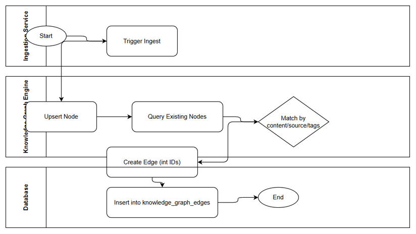
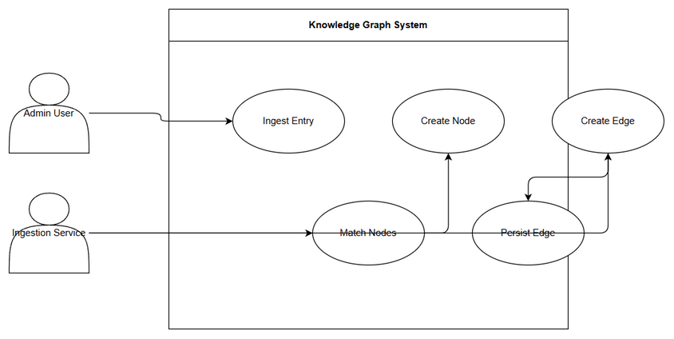

# Business Requirements Document (BRD)
## SA4E-250 — Knowledge graph edges not calculated: entries remain unlinked

---

## Document Information

| Field | Value |
|-------|-------|
| Jira Ticket | SA4E-250 |
| Title | Knowledge graph edges not calculated: entries remain unlinked |
| Author | BA Agent |
| Version | 1.0 |
| Date | 2026-09-06 |
| Status | Draft |

---

## 1. Introduction

### 1.1 Problem Statement
Knowledge Graph edge ingestion is failing. Entries are ingested as nodes but edges remain unlinked. Bug Analysis identifies 5 root causes:
1. Wrong table & identifier type – edge-on-ingest inserts into `graph_edges` with string doc-id instead of `knowledge_graph_edges` with integer `source_id`/`target_id`
2. ID type mismatch – source/target references are strings vs INTEGER FK
3. Matching strategy flaw – matching uses `graph_nodes.label/summary` not content/source/tags
4. Node creation ordering – `upsertGraphNode` runs after edge insert
5. Existing nodes query limitations – LIMIT 2000, no project filter, no pagination

### 1.2 Scope
Fix edge ingestion pipeline so that knowledge graph nodes are correctly linked with edges after ingestion, matching strategy uses appropriate fields, correct table and integer IDs are used, node upserts precede edge creation, and node queries are scalable with project filter and pagination.

### 1.3 Out of Scope
Changes to node ingestion content parsing, UI changes, migration of historical edge data beyond current ticket scope. To be confirmed with stakeholders.

### 1.4 Business Impact
- Entries remain unlinked, reducing discoverability and contextual search quality
- Graph-based features (context assembly, recommendations) operate on incomplete data
- Manual linking effort increases, impacting knowledge operations team productivity
- Risk of stale/incorrect graph relationships affecting downstream AI agents

---

## 2. Business Requirements

### 2.1 High Level Process Map
Ingestion Service triggers entry ingest → Knowledge Graph Engine upserts node → queries existing nodes with project filter & pagination → matches nodes using content/source/tags → creates edge with integer IDs → persists to `knowledge_graph_edges`. See business flow diagram below.

*Edit in draw.io: diagrams/business-flow.drawio*

### 2.2 User Stories

| # | Story | Priority | Source Ticket |
|---|-------|----------|---------------|
| 1 | As a Knowledge Engineer, I want edges to be created automatically during ingestion so that entries are linked in the knowledge graph | MUST HAVE | SA4E-250 |
| 2 | As a System Admin, I want edge ingestion to use correct table and integer IDs so that graph queries are reliable | MUST HAVE | SA4E-250 |
| 3 | As a Data Analyst, I want node matching to use content/source/tags instead of label/summary so that related entries are correctly linked | SHOULD HAVE | SA4E-250 |

### 2.3 Details of User Stories

#### STORY 1: Automatic edge creation on ingestion

**Requirement Details:**
1. Edge ingestion must execute after successful node upsert
2. Edge records must be inserted into `knowledge_graph_edges` table
3. Source and target IDs must be integer FK references to graph nodes

**Acceptance Criteria:**
1. Given an ingested entry, when ingestion completes, then a node exists in graph_nodes with integer id
2. When matching nodes are found, then edge record is created in knowledge_graph_edges with integer source_id and target_id
3. No edge records are created in `graph_edges` table

**Validation Rules:**
- source_id and target_id must be integers > 0
- edge record must reference existing node ids

*Edit in draw.io: diagrams/use-case.drawio*

#### STORY 2: Correct table and ID type

**Requirement Details:**
1. Replace inserts into `graph_edges` with inserts into `knowledge_graph_edges`
2. Convert string doc-id to integer node id before edge creation
3. Ensure FK constraints are satisfied

**Acceptance Criteria:**
1. Edge insert SQL targets `knowledge_graph_edges`
2. Source/target values are integers, not strings
3. Database FK constraints pass without type mismatch errors

#### STORY 3: Improved matching strategy

**Requirement Details:**
1. Matching query uses node content, source, tags fields
2. Remove dependency on label/summary only matching
3. Query supports project filter and pagination

**Acceptance Criteria:**
1. Existing nodes query accepts project_id filter
2. Query uses pagination instead of hard LIMIT 2000
3. Matching algorithm considers content/source/tags with higher weight than label/summary

---

## 3. Non-Functional Requirements

| Category | Requirement | Details |
|----------|-------------|---------|
| Performance | Edge ingestion latency | Edge creation should complete within ingestion transaction, no >5s added latency |
| Reliability | Data integrity | FK constraints enforced, no orphan edges |
| Scalability | Node query | Support pagination and project filter for >2000 nodes |
| Maintainability | Code clarity | Edge creation logic separated from node upsert, clear table naming |

---

## 4. Assumptions & Constraints

**Assumptions:**
- Knowledge Graph schema includes `knowledge_graph_edges` with integer `source_id`, `target_id`
- Node IDs are stable integers generated on upsert
- Project filter field exists on graph_nodes

**Constraints:**
- Existing data in `graph_edges` with string ids must not be migrated in this scope
- No breaking changes to ingestion API contract

---

## 5. Dependencies

| Dependency | Type | Related Ticket | Description |
|------------|------|----------------|-------------|
| Knowledge Graph schema | System | SA4E-250 | `knowledge_graph_edges` table must exist with correct columns |
| Ingestion service | System | SA4E-250 | Edge-on-ingest hook must be updated |
| Node upsert service | System | SA4E-250 | Must return integer node id before edge creation |

---

## 6. Risks

| Risk | Impact | Likelihood | Mitigation |
|------|--------|------------|------------|
| Data type mismatch causing FK failures | High | Medium | Add type validation before insert, unit tests for edge creation |
| Matching strategy change causes false positives | Medium | Medium | Implement weight tuning and manual review sample |
| Pagination change impacts performance | Medium | Low | Load test query with project filter |

---

## 7. Open Questions
1. What is the exact schema of `knowledge_graph_edges`? Confirm column names and constraints.
2. Should existing `graph_edges` data be backfilled or archived?
3. What matching weight should be assigned to content/source/tags vs label/summary?
4. Who approves matching threshold changes?

---

## 8. Related Tickets

| Ticket Key | Summary | Status | Type | Relationship |
|------------|---------|--------|------|--------------|
| SA4E-250 | Knowledge graph edges not calculated: entries remain unlinked | To Do | Bug | Main ticket |

---

## Appendix

### Glossary
| Term | Definition |
|------|------------|
| Knowledge Graph | Graph representation of knowledge entries as nodes linked by edges |
| Edge Ingestion | Process of creating relationships between nodes during entry ingest |

