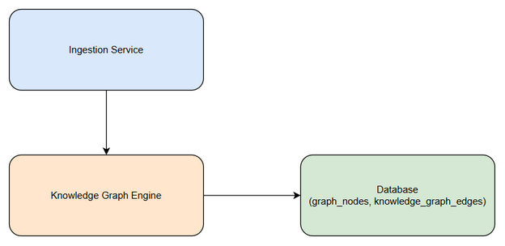
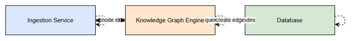
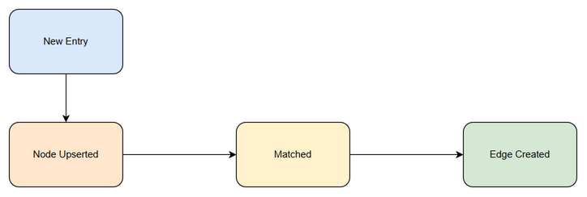

# Functional Specification Document (FSD)
## SA4E-250 — Knowledge graph edges not calculated: entries remain unlinked

---

## Document Information

| Field | Value |
|-------|-------|
| Jira Ticket | SA4E-250 |
| Title | Knowledge graph edges not calculated: entries remain unlinked |
| Author | BA Agent |
| Version | 1.1 |
| Date | 2026-09-06 |
| Status | Draft |
| Related BRD | documents/SA4E-250/BRD.md |
| Enriched By | TA Agent |

---

## 1. Overview

### 1.1 Purpose
This FSD defines functional and technical specifications to fix knowledge graph edge ingestion pipeline where entries are ingested as nodes but edges remain unlinked.

### 1.2 Scope from BRD
Fix edge ingestion pipeline so knowledge graph nodes are correctly linked with edges after ingestion, matching strategy uses appropriate fields, correct table and integer IDs are used, node upserts precede edge creation, and node queries are scalable with project filter and pagination.

### 1.3 System Context


*[Edit in draw.io](diagrams/system-context.drawio)*

---

## 2. Use Cases

### UC-01 Automatic Edge Creation on Ingestion

**Actors:** Knowledge Engineer, Ingestion Service

**Preconditions:** Entry is being ingested; node upsert service is available.

**Main Flow:**
1. Ingestion Service receives entry
2. Knowledge Graph Engine upserts node → returns integer node id
3. Engine queries existing nodes with project filter & pagination
4. Matching performed using content/source/tags
5. Edge record created in `knowledge_graph_edges` with integer source_id/target_id
6. Transaction commits

**Alternative Flows:**
 A1. No matching nodes found → No edge created, node remains isolated
 A2. Multiple matches → Create edges for each match above threshold
 A3. Matching score below threshold → Skip edge creation, log metric `edge_skipped_low_score`
 <!-- TA enrichment -->

**Exception Flows:**
 E1. Node upsert fails → Abort ingestion, no edge attempt
 E2. FK constraint violation → Log error, raise ingestion failure
 E3. Transaction deadlock on `knowledge_graph_edges` INSERT → Retry up to 3 times with exponential backoff (100ms, 200ms, 400ms), then fail ingestion
 E4. Pagination query timeout → Reduce page size to 500 and retry, emit warning metric
 <!-- TA enrichment -->

### UC-02 Correct Table and ID Type

**Actors:** System Admin, Database

**Main Flow:**
1. Edge creation logic references `knowledge_graph_edges` table
2. Source/target values converted from string doc-id to integer node id
3. INSERT executed with integer types
4. FK constraints validated

**Alternative Flows:**
 A1. Edge already exists → UPDATE `metadata` with `last_seen_at` timestamp, do not create duplicate
 <!-- TA enrichment -->

**Exception Flows:**
 E1. Type mismatch → Validation fails before INSERT
 E2. Duplicate key violation (unique source-target-edge_type) → Perform upsert (INSERT ... ON CONFLICT DO UPDATE)
 <!-- TA enrichment -->

### UC-03 Improved Matching Strategy

**Actors:** Data Analyst

**Main Flow:**
1. Existing nodes query accepts project_id filter
2. Pagination applied instead of hard LIMIT 2000
3. Matching weights content/source/tags higher than label/summary
4. Candidate nodes returned

**Alternative Flows:**
 A1. Project_id not provided → Fallback to global search with warning log
 A2. Page size exceeds max (5000) → Cap to max and log
 <!-- TA enrichment -->

**Exception Flows:**
 E1. Project filter returns zero rows → Return empty candidate set, no error
 E2. Pagination cursor becomes invalid → Restart query from page 1 with new cursor
 <!-- TA enrichment -->

---

## 3. Business Rules

| ID | Rule |
|----|------|
| BR-01 | Edge ingestion must execute after successful node upsert |
| BR-02 | Edge records must be inserted into `knowledge_graph_edges` table |
| BR-03 | Source and target IDs must be integer FK references to graph nodes |
| BR-04 | No edge records are created in `graph_edges` table |
| BR-05 | source_id and target_id must be integers > 0 |
| BR-06 | Edge record must reference existing node ids |
| BR-07 | Edge insert SQL targets `knowledge_graph_edges` |
| BR-08 | Source/target values are integers, not strings |
| BR-09 | Database FK constraints pass without type mismatch errors |
| BR-10 | Matching query uses node content, source, tags fields |
| BR-11 | Existing nodes query accepts project_id filter |
| BR-12 | Query uses pagination instead of hard LIMIT 2000 |
| BR-13 | Matching algorithm considers content/source/tags with higher weight than label/summary |

---

## 4. Functional Requirements

### FR-01 Edge Creation Pipeline
- FR-01.1 Node upsert precedes edge creation
- FR-01.2 Edge creation within same ingestion transaction
- FR-01.3 Edge latency <5s added

### FR-02 Data Integrity
- FR-02.1 FK constraints enforced
- FR-02.2 No orphan edges

### FR-03 Matching
- FR-03.1 Project filter supported
- FR-03.2 Pagination supported with page size configurable
- FR-03.3 Weight configuration for content/source/tags vs label/summary

---

## 5. Data Model / Schema Requirements

### Table: graph_nodes
| Column | Type | Notes |
|--------|------|-------|
| id | INTEGER PRIMARY KEY | Stable integer node id |
| project_id | INTEGER | Project filter |
| content | TEXT | |
| source | TEXT | |
| tags | TEXT | JSON array |
| label | TEXT | |
| summary | TEXT | |

### Table: knowledge_graph_edges
| Column | Type | Notes |
|--------|------|-------|
| id | INTEGER PRIMARY KEY | |
| source_id | INTEGER FK → graph_nodes.id | |
| target_id | INTEGER FK → graph_nodes.id | |
| edge_type | TEXT | |
| created_at | DATETIME | |
| metadata | TEXT | |

**Constraints:** FK on source_id/target_id, source_id >0, target_id >0

---

## 6. API Contracts

### POST /api/knowledge/ingest
**Request**
```json
{
  "project_id": 123,
  "content": "string",
  "source": "string",
  "tags": ["tag1","tag2"]
}
```

**Response**
```json
{
  "node_id": 4567,
  "edges_created": 3,
  "status": "success"
}
```

**Error Response**
```json
{
  "error_code": "FK_VIOLATION",
  "message": "source_id references non-existent node"
}
```

### POST /api/knowledge/graph/edges/create <!-- TA enrichment -->
**Method:** POST  
**Path:** `/api/knowledge/graph/edges/create`  
**Auth:** Bearer JWT `scope: graph:write`  
**Headers:** `Content-Type: application/json`

**Request Schema**
```json
{
  "source_node_id": 4567,
  "target_node_id": 8910,
  "edge_type": "semantic_similarity",
  "metadata": {
    "score": 0.87,
    "match_fields": ["content","source","tags"],
    "project_id": 123
  }
}
```
**Validation:**
- `source_node_id` integer >0, exists in `graph_nodes.id`
- `target_node_id` integer >0, exists in `graph_nodes.id`
- `source_node_id != target_node_id`
- `edge_type` enum: `semantic_similarity` | `citation` | `reference`
- `metadata.score` number 0-1 optional

**Response 201 Created**
```json
{
  "edge_id": 12345,
  "source_id": 4567,
  "target_id": 8910,
  "edge_type": "semantic_similarity",
  "created_at": "2026-09-06T12:34:56Z"
}
```

**Error Responses**
| Code | error_code | Description |
|------|------------|-------------|
| 400 | VALIDATION_ERROR | source/target missing or type mismatch |
| 404 | NODE_NOT_FOUND | source or target node_id does not exist |
| 409 | DUPLICATE_EDGE | edge already exists, upserted |
| 500 | DB_ERROR | FK constraint violation or deadlock |

**Notes:**
- Transactionally inserts into `knowledge_graph_edges` with integer FKs
- Returns 409 with upserted edge_id if duplicate
<!-- TA enrichment -->

### Node Matching Algorithm Pseudocode <!-- TA enrichment -->
```typescript
// Pseudocode for node matching using content/source/tags, not label/summary
function findMatchingNodes(
  newNode: GraphNode,
  projectId: number,
  pageSize: number = 1000
): CandidateEdge[] {
  // 1. Query existing nodes with project filter & pagination
  let offset = 0;
  const candidates: CandidateEdge[] = [];
  
  while (true) {
    const page = await db.query(
      `SELECT id, content, source, tags FROM graph_nodes 
       WHERE project_id = ? AND id != ?
       ORDER BY id
       LIMIT ? OFFSET ?`,
      [projectId, newNode.id, pageSize, offset]
    );
    if (page.length === 0) break;
    
    // 2. Score each candidate using content/source/tags weighting
    for (const node of page) {
      const score = computeScore(newNode, node);
      if (score >= THRESHOLD) {
        candidates.push({ target_id: node.id, score, fields: ['content','source','tags'] });
      }
    }
    
    offset += pageSize;
    // Stop if page not full
    if (page.length < pageSize) break;
  }
  
  // 3. Sort by score descending
  candidates.sort((a,b) => b.score - a.score);
  return candidates;
}

function computeScore(a: GraphNode, b: GraphNode): number {
  const weights = {
    content: 0.5,
    source: 0.3,
    tags: 0.2
  };
  // NOTE: label/summary intentionally NOT used per BR-13
  
  const contentSim = cosineSimilarity(embedding(a.content), embedding(b.content));
  const sourceMatch = a.source === b.source ? 1 : 0;
  const tagsOverlap = jaccardSimilarity(parseTags(a.tags), parseTags(b.tags));
  
  return weights.content * contentSim +
         weights.source * sourceMatch +
         weights.tags * tagsOverlap;
}
```
<!-- TA enrichment -->

---

## 7. Integration Requirements
- Ingestion Service → Knowledge Graph Engine via internal event
- Knowledge Graph Engine → Database via SQL adapter
- Node upsert service must return integer node id before edge creation
- Project filter field must exist on graph_nodes

### knowledge_graph_edges Table Integration <!-- TA enrichment -->
**Table:** `knowledge_graph_edges`
**Primary Key:** `id INTEGER PRIMARY KEY AUTOINCREMENT`
**Foreign Keys:**
- `source_id INTEGER NOT NULL REFERENCES graph_nodes(id) ON DELETE CASCADE`
- `target_id INTEGER NOT NULL REFERENCES graph_nodes(id) ON DELETE CASCADE`

**Indexes:**
- `idx_knowledge_graph_edges_source_target (source_id, target_id, edge_type)` UNIQUE
- `idx_knowledge_graph_edges_project (source_id)` for join performance

**Constraints:**
- `CHECK (source_id > 0 AND target_id > 0)`
- `CHECK (source_id != target_id)`
- `edge_type IN ('semantic_similarity','citation','reference')`

**Data Flow:**
1. Ingestion Service emits `node.upserted` event with `node_id` (int)
2. Knowledge Graph Engine queries `graph_nodes` with `project_id` filter + pagination (`LIMIT ? OFFSET ?`)
3. Matching algorithm computes score using `content`, `source`, `tags`
4. Engine executes:
   ```sql
   INSERT INTO knowledge_graph_edges (source_id, target_id, edge_type, created_at, metadata)
   VALUES (?, ?, ?, CURRENT_TIMESTAMP, ?)
   ON CONFLICT(source_id, target_id, edge_type) DO UPDATE SET created_at = CURRENT_TIMESTAMP;
   ```
5. FK validation enforced by DB; type mismatch prevented by application validation

**Retry Policy:**
- Deadlock → exponential backoff up to 3 attempts
- FK violation → abort transaction, log error code `FK_VIOLATION`

**Monitoring:**
- Metric `knowledge_graph_edges_insert_latency_ms` histogram
- Alert if p95 > 500ms
<!-- TA enrichment -->

---

## 8. Non-Functional Requirements
| Category | Requirement |
|----------|-------------|
| Performance | Edge creation completes within ingestion transaction, no >5s added latency |
| Reliability | FK constraints enforced, no orphan edges |
| Scalability | Node query supports pagination and project filter for >2000 nodes |
| Maintainability | Edge creation logic separated from node upsert, clear table naming |

### Quantified Targets <!-- TA enrichment -->
| Metric | Target | Notes |
|--------|--------|-------|
| Edge creation latency (p95) | < 500 ms | From node upsert return to edge INSERT commit |
| Edge creation latency (p99) | < 1000 ms | Includes matching query for up to 1000 candidates |
| Pagination page size | Configurable 100-5000 | Default 1000, max 5000 per BR-12 |
| Node query throughput | >= 5000 nodes / sec | With project_id filter and index on `graph_nodes.project_id` |
| Matching query timeout | 2 s | Per page, with retry |
| FK violation rate | 0% | Zero tolerance, validation before INSERT |
| Edge duplicate rate | < 0.1% | Upsert prevents duplicates |

<!-- TA enrichment -->

---

## 9. Sequence Diagram


*[Edit in draw.io](diagrams/sequence-edge-create.drawio)*

---

## 10. State Diagram


*[Edit in draw.io](diagrams/state.drawio)*

---

## 11. Traceability Matrix

| BRD Requirement | FSD Section | Use Case | Business Rule |
|-----------------|-------------|----------|---------------|
| Edge created after node upsert | 4.1 | UC-01 | BR-01 |
| Insert into knowledge_graph_edges | 5 | UC-02 | BR-02, BR-07 |
| Integer IDs | 5 | UC-02 | BR-03, BR-08 |
| Matching uses content/source/tags | 4.3 | UC-03 | BR-10, BR-13 |
| Project filter & pagination | 4.3 | UC-03 | BR-11, BR-12 |
| No graph_edges inserts | 3 | UC-02 | BR-04 |

---

## 12. Open Questions
1. Exact schema of `knowledge_graph_edges` columns?
2. Matching weight values?
3. Backfill strategy for existing `graph_edges`?
## 13. Open Issues
 <!-- TA enrichment -->
| Issue ID | Description | Owner | Target Date | Status |
|----------|-------------|-------|-------------|--------|
| OI-01 | Confirm metadata column type: TEXT JSON vs separate columns | DBA | 2026-09-15 | Open |
| OI-02 | Define matching threshold and weight tuning process | Data Science | 2026-09-20 | Open |
| OI-03 | Load test pagination with 5000+ nodes to validate <500ms p95 | QA | 2026-09-25 | Open |
| OI-04 | Backfill decision for existing graph_edges data | Product Owner | 2026-09-30 | Open |
| OI-05 | Add monitoring dashboard for knowledge_graph_edges_insert_latency_ms | DevOps | 2026-09-18 | Open |

**Notes:**
- OI-01 blocks final schema lock for TDD
- OI-02 requires stakeholder approval before production deployment
<!-- TA enrichment -->
