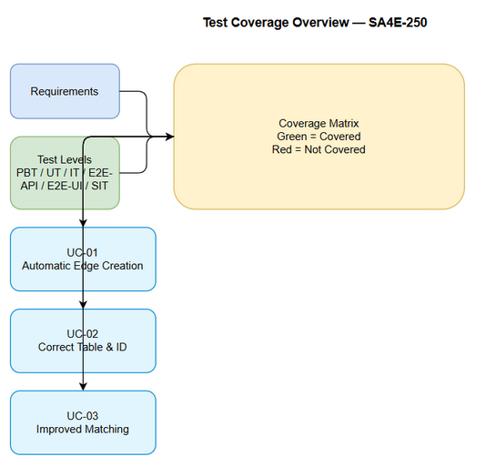

# Software Test Plan (STP)

## SA4E-250 — Knowledge graph edges not calculated: entries remain unlinked

---

## Document Information

| Field | Value |
|-------|-------|
| Jira Ticket | SA4E-250 |
| Title | Knowledge graph edges not calculated: entries remain unlinked |
| Author | QA Agent |
| Version | 1.0 |
| Date | 2026-09-06 |
| Status | Draft |
| Related BRD | BRD.md |
| Related FSD | FSD.md |
| Related TDD | TDD.md |

---

## Author Tracking

| Role | Name - Position | Responsibility |
|------|-----------------|----------------|
| Author | QA Agent – QA Engineer | Create document |
| Peer Reviewer | – | Review document |

---

## Revision History

| Version | Date | Author | Changes |
|---------|------|--------|---------|
| 1.0 | 2026-09-06 | QA Agent | Initiate document — auto-generated from BRD, FSD, and TDD |

---

## 1. Introduction

### 1.1 Purpose
This Test Plan defines strategy, scope, resources and schedule to verify fix for knowledge graph edge ingestion pipeline where entries are ingested as nodes but edges remain unlinked. The plan validates correct table usage, integer FK IDs, matching strategy, node creation ordering and pagination scalability.

### 1.2 Test Objectives
- Verify all functional requirements from FSD are implemented correctly
- Validate business rules BR-01 to BR-13 are enforced
- Ensure edge ingestion uses `knowledge_graph_edges` with integer IDs
- Validate matching uses content/source/tags with project filter & pagination
- Ensure node upsert precedes edge creation
- Verify non-functional requirements for latency, FK integrity and scalability

### 1.3 References
| Document | Location |
|----------|----------|
| BRD | documents/SA4E-250/BRD.md |
| FSD | documents/SA4E-250/FSD.md |
| TDD | documents/SA4E-250/TDD.md |

---

## 2. Test Strategy

### 2.1 Test Levels

| Level | Scope | Automation | Tools |
|-------|-------|------------|-------|
| PBT | Correctness properties (random inputs) | Automated | fast-check |
| UT | Unit/edge case tests | Automated | vitest |
| IT | API integration (Hono app in-process) | Automated | vitest + Hono `app.request()` |
| E2E-API | REST endpoint E2E (real server) | Automated | vitest + fetch |
| E2E-UI | Browser UI E2E (Playwright) | Automated | Playwright |
| SIT | Manual exploratory / edge cases only | Manual | Browser |

### 2.2 Test Types
| Type | Description | Applicable |
|------|-------------|------------|
| Functional Testing | Verify features work per FSD use cases | Yes |
| Regression Testing | Ensure existing ingestion features not broken | Yes |
| Performance Testing | Verify edge creation latency p95 <500ms, pagination throughput | Yes |
| Security Testing | Verify auth scope graph:write | Yes |
| Non-Functional | Scalability >2000 nodes, FK integrity | Yes |

### 2.3 Test Approach
Risk-based approach focusing on the 5 root causes identified in BRD. Prioritize automation for deterministic flows: CRUD edge creation, validation errors, auth, pagination. Manual SIT reserved for visual UX and timing verification. E2E-API covers `/api/knowledge/ingest` and `/api/knowledge/graph/edges/create`.

### 2.4 Entry Criteria
| Level | Entry Criteria |
|-------|---------------|
| UT/IT/E2E | TDD v1.0 approved, code merged to SIT branch, unit tests pass locally |
| SIT | Code deployed to SIT environment, test data prepared, STP/STC approved |

### 2.5 Exit Criteria
| Level | Exit Criteria |
|-------|--------------|
| SIT | 100% test cases executed, 0 Critical defects, ≤2 Major defects open |
| UAT | All UAT scenarios passed, business sign-off obtained |

#### STP Test Cases Summary Table
| Level | Count | Automated | Manual |
|-------|-------|-----------|--------|
| PBT | 3 | 3 | 0 |
| UT | 8 | 8 | 0 |
| IT | 6 | 6 | 0 |
| E2E-API | 12 | 12 | 0 |
| E2E-UI | 0 | 0 | 0 |
| SIT | 5 | 0 | 5 |
| **Total** | **34** | **29 (85%)** | **5 (15%)** |

---

## 3. Test Scope

### 3.1 Features In Scope
| # | Feature / Story | Priority | FSD Reference | Test Type |
|---|----------------|----------|---------------|-----------|
| 1 | Automatic edge creation on ingestion | High | UC-01, BR-01, BR-02, BR-03 | Functional / Integration |
| 2 | Correct table and ID type | High | UC-02, BR-07, BR-08, BR-05 | Functional / Business Rule |
| 3 | Improved matching strategy | High | UC-03, BR-10, BR-11, BR-12, BR-13 | Functional / Performance |
| 4 | Node creation ordering | High | BR-01, FR-01.1 | Integration |
| 5 | Pagination >2000 with project filter | Medium | BR-11, BR-12, FR-03.2 | Non-Functional |

### 3.2 Test Scope Visual

### 3.3 Features Out of Scope
| # | Feature | Reason |
|---|---------|--------|
| 1 | Node ingestion content parsing changes | Not in scope per BRD 1.3 |
| 2 | UI changes | Not in scope |
| 3 | Migration of historical `graph_edges` data | Deferred per BRD 1.3 |

---

## 4. Test Environment
### 4.1 Environment Requirements
| Environment | URL | Database | Purpose |
|-------------|-----|----------|---------|
| SIT | http://localhost:3000 | SQLite / PostgreSQL | System Integration Testing |

### 4.2 Test Data Requirements
| Data Type | Description | Source | Preparation |
|-----------|-------------|--------|-------------|
| graph_nodes | Pre-seeded nodes with project_id | SQL seed | Insert 2500+ nodes |
| knowledge_graph_edges | Empty baseline | DB init | Clean table |

---

## 5. Test Schedule
| Phase | Start Date | End Date | Duration | Milestone |
|-------|-----------|----------|----------|-----------|
| Test Planning | 2026-09-06 | 2026-09-06 | 1 day | STP + STC approved |
| SIT Execution | 2026-09-08 | 2026-09-10 | 3 days | SIT sign-off |

---

## 6. Resources & Responsibilities
| Role | Name | Responsibility |
|------|------|---------------|
| Test Lead | QA Agent | Planning, reporting |
| QA Engineer | QA Agent | Test design, execution |
| BA | BA Agent | UAT support |

---

## 7. Risk & Mitigation
| # | Risk | Impact | Likelihood | Mitigation |
|---|------|--------|------------|------------|
| 1 | Test data >2000 nodes not available | High | Medium | Prepare seed script |
| 2 | FK violation due to type mismatch | High | Medium | Unit tests for validation |

---

## 8. Defect Management
### 8.1 Severity Levels
| Severity | Definition | Example |
|----------|-----------|---------|
| Critical | Edge ingestion fails | Edge created in wrong table |
| Major | Feature not working | FK violation |

### 8.2 Priority Levels
| Priority | Definition | SLA |
|----------|-----------|-----|
| P1 | Must fix immediately | 4 hours |
| P2 | Must fix before release | 1 business day |

---

## 9. Test Metrics & Reporting
### 9.1 Metrics
| Metric | Target |
|--------|--------|
| Test Execution Rate | 100% |
| Pass Rate | ≥95% |
| Critical Defect Count | 0 |

---

## 10. Appendix
### Assumptions
- Knowledge Graph schema includes `knowledge_graph_edges` with integer IDs
- Node IDs are stable integers
- Project filter field exists on graph_nodes
