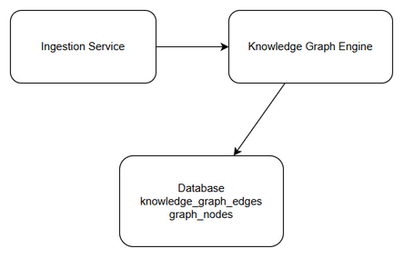
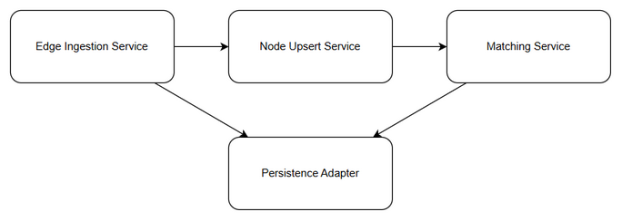
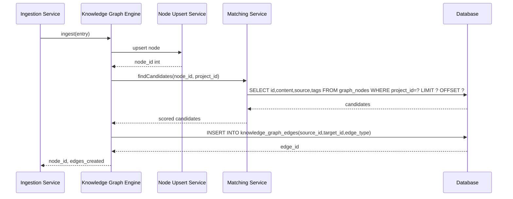
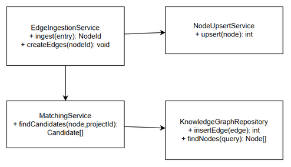

# Technical Design Document (TDD)
## SA4E-250 — Knowledge graph edges not calculated: entries remain unlinked

---

## Document Information

| Field | Value |
|-------|-------|
| Jira Ticket | SA4E-250 |
| Title | Knowledge graph edges not calculated: entries remain unlinked |
| Author | SA Agent |
| Version | 1.0 |
| Date | 2026-09-06 |
| Status | Draft |
| Related BRD | documents/SA4E-250/BRD.md |
| Related FSD | documents/SA4E-250/FSD.md |

---

## 1. Introduction

### 1.1 Purpose
This TDD defines the technical design to fix knowledge graph edge ingestion pipeline where entries are ingested as nodes but edges remain unlinked. It specifies architecture, component design for edge ingestion service, data model, API contracts, and non-functional considerations to implement requirements from BRD v1.0 and FSD v1.1.

### 1.2 Scope
Technical scope covers:
- Edge ingestion service redesign
- Knowledge Graph Engine integration
- Data model for `graph_nodes` and `knowledge_graph_edges`
- API `/api/knowledge/ingest` and `/api/knowledge/graph/edges/create`
- Matching strategy implementation with project filter & pagination
- Database DDL, indexes, constraints

### 1.3 Technology Stack

| Layer | Technology | Version |
|-------|-----------|---------|
| Language | TypeScript | 5.x |
| Framework | Hono | 4.x |
| Database | SQLite better-sqlite3 / PostgreSQL | |
| Build Tool | npm | |
| Container | Docker | |

### 1.4 Design Principles
- Correct table and integer ID usage
- Node upsert precedes edge creation
- Matching uses content/source/tags weighting
- Pagination and project filter for scalability

### 1.5 Constraints
- No breaking changes to ingestion API contract
- Existing `graph_edges` data must not be migrated in scope

---

## 2. System Architecture

### 2.1 Architecture Overview


*Edit in draw.io: diagrams/architecture.drawio*

High-level architecture comprises Ingestion Service triggering Knowledge Graph Engine which upserts node then creates edges via Persistence Adapter to `knowledge_graph_edges`.

### 2.2 Component Design


*Edit in draw.io: diagrams/component.drawio*

| Component | Responsibility | Technology |
|-----------|---------------|------------|
| Edge Ingestion Service | Orchestrates node upsert → matching → edge creation | TypeScript/Hono |
| Node Upsert Service | Upserts graph_nodes, returns integer node id | SQLite |
| Matching Service | Queries nodes with project filter & pagination, scores using content/source/tags | TypeScript |
| Persistence Adapter | INSERT into knowledge_graph_edges with FK validation | better-sqlite3 |

### 2.3 Sequence Diagram - Edge Creation Flow



---

## 3. Data Model

### 3.1 Table: graph_nodes

| Column | Type | Notes |
|--------|------|-------|
| id | INTEGER PRIMARY KEY | Stable integer node id |
| project_id | INTEGER | Project filter |
| content | TEXT | |
| source | TEXT | |
| tags | TEXT | JSON array |
| label | TEXT | |
| summary | TEXT | |

### 3.2 Table: knowledge_graph_edges

| Column | Type | Notes |
|--------|------|-------|
| id | INTEGER PRIMARY KEY AUTOINCREMENT | |
| source_id | INTEGER FK → graph_nodes.id | |
| target_id | INTEGER FK → graph_nodes.id | |
| edge_type | TEXT | semantic_similarity|citation|reference |
| created_at | DATETIME | |
| metadata | TEXT | JSON |

**Constraints:**
- FK source_id/target_id ON DELETE CASCADE
- CHECK source_id >0 AND target_id >0
- CHECK source_id != target_id
- UNIQUE(source_id,target_id,edge_type)

**DDL:**
```sql
CREATE TABLE knowledge_graph_edges (
  id INTEGER PRIMARY KEY AUTOINCREMENT,
  source_id INTEGER NOT NULL REFERENCES graph_nodes(id) ON DELETE CASCADE,
  target_id INTEGER NOT NULL REFERENCES graph_nodes(id) ON DELETE CASCADE,
  edge_type TEXT NOT NULL CHECK(edge_type IN ('semantic_similarity','citation','reference')),
  created_at DATETIME DEFAULT CURRENT_TIMESTAMP,
  metadata TEXT,
  CONSTRAINT chk_ids CHECK(source_id>0 AND target_id>0 AND source_id!=target_id),
  UNIQUE(source_id,target_id,edge_type)
);
CREATE INDEX idx_kge_source_target ON knowledge_graph_edges(source_id,target_id,edge_type);
CREATE INDEX idx_graph_nodes_project ON graph_nodes(project_id);
```

---

## 4. API Design

### 4.1 POST /api/knowledge/ingest

Implements UC-01, BR-01, BR-02, BR-03

| Attribute | Value |
|-----------|-------|
| Method | POST |
| Path | /api/knowledge/ingest |
| Auth | Bearer JWT scope graph:write |

**Request**
```json
{
  "project_id": 123,
  "content": "string",
  "source": "string",
  "tags": ["tag1","tag2"]
}
```

**Response 200**
```json
{
  "node_id": 4567,
  "edges_created": 3,
  "status": "success"
}
```

### 4.2 POST /api/knowledge/graph/edges/create

Implements UC-02, BR-07, BR-08

| Attribute | Value |
|-----------|-------|
| Method | POST |
| Path | /api/knowledge/graph/edges/create |
| Auth | Bearer JWT scope graph:write |

**Request**
```json
{
  "source_node_id": 4567,
  "target_node_id": 8910,
  "edge_type": "semantic_similarity",
  "metadata": { "score": 0.87 }
}
```

**Response 201**
```json
{
  "edge_id": 12345,
  "source_id": 4567,
  "target_id": 8910,
  "edge_type": "semantic_similarity",
  "created_at": "2026-09-06T12:34:56Z"
}
```

Error codes: 400 VALIDATION_ERROR, 404 NODE_NOT_FOUND, 409 DUPLICATE_EDGE, 500 DB_ERROR

---

## 5. Class / Module Design

### 5.1 Package Structure

```
knowledge/
├── EdgeIngestionService.ts
├── NodeUpsertService.ts
├── MatchingService.ts
├── KnowledgeGraphRepository.ts
└── models/
    ├── GraphNode.ts
    └── KnowledgeGraphEdge.ts
```

### 5.2 Key Classes


*Edit in draw.io: diagrams/class.drawio*

- EdgeIngestionService: orchestrates ingest flow
- NodeUpsertService: upserts node, returns int id
- MatchingService: findCandidates with pagination
- KnowledgeGraphRepository: insertEdge with UPSERT

---

## 6. Implementation Checklist

- [ ] Update Edge Ingestion Service to upsert node before edge creation
- [ ] Change INSERT target to knowledge_graph_edges
- [ ] Convert doc-id strings to integer node ids
- [ ] Implement project_id filter on graph_nodes query
- [ ] Implement pagination with configurable page size
- [ ] Update matching weights to content/source/tags
- [ ] Add FK constraints and CHECK constraints
- [ ] Add retry with exponential backoff for deadlock
- [ ] Add metrics knowledge_graph_edges_insert_latency_ms
- [ ] Unit tests for edge creation, validation, duplicate upsert

---

## 7. Non-Functional Design

| Category | Requirement |
|----------|-------------|
| Performance | Edge creation p95 <500ms, p99 <1000ms |
| Reliability | FK enforced, zero orphan edges |
| Scalability | Pagination supports >2000 nodes, project filter indexed |
| Maintainability | Separated edge creation from node upsert |

Caching: None required. Connection pooling via better-sqlite3 WAL.

---

## 8. Testing Strategy

- Unit tests: EdgeIngestionService flow, MatchingService scoring
- Integration tests: DB INSERT with FK validation
- E2E tests: Ingest API returns node_id and edges_created
- Performance tests: Pagination query throughput >=5000 nodes/sec
- Negative tests: String id rejection, FK violation handling

---

## 9. Monitoring & Observability

- Metric: knowledge_graph_edges_insert_latency_ms histogram, alert p95>500ms
- Log edge_skipped_low_score metric
- Health check /api/knowledge/health

---

## References

- BRD v1.0 documents/SA4E-250/BRD.md
- FSD v1.1 documents/SA4E-250/FSD.md
