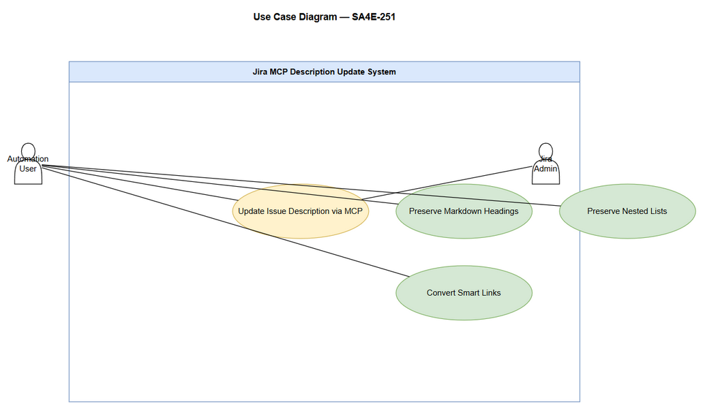
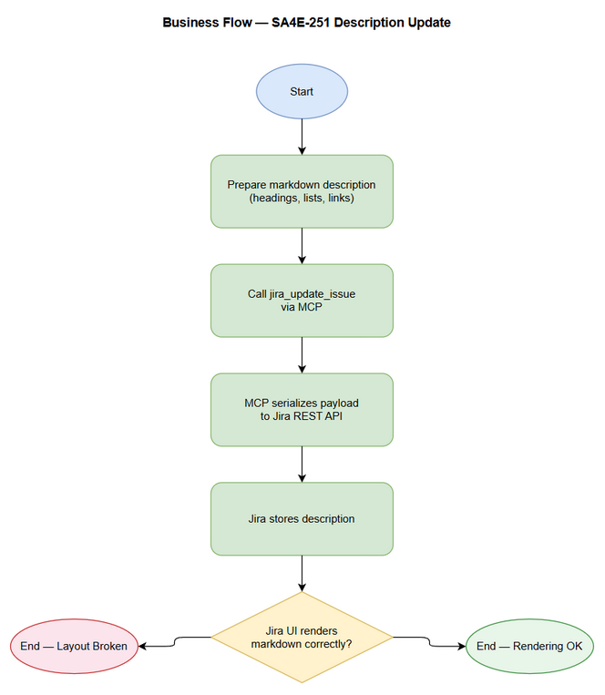

# Business Requirements Document (BRD)

## SA4E-251 — Jira MCP tool description layout broken on update

---

## Document Information

| Field | Value |
|-------|-------|
| Jira Ticket | SA4E-251 |
| Title | Jira MCP tool description layout broken on update |
| Author | BA Agent |
| Version | 1.0 |
| Date | 2026-09-06 |
| Status | Draft |

---

## Author Tracking

| Role | Name - Position | Responsibility |
|------|-----------------|----------------|
| Author | BA Agent – Business Analyst | Create document |
| Peer Reviewer | Duc Nguyen Minh – Reporter | Review document |

---

## Revision History

| Version | Date | Author | Changes |
|---------|------|--------|---------|
| 1.0 | 2026-09-06 | BA Agent | Initiate document — auto-generated from Jira ticket SA4E-251 |

---

## Sign-Off

| Name | Signature and date |
|------|--------------------|
| | ☐ I agree and confirm all criteria on this BRD as expected requirements |
| | ☐ I agree and confirm all criteria on this BRD as expected requirements |

---

## 1. Introduction

### 1.1 Scope

When updating an issue description via the `jira_update_issue` MCP tool, markdown content with headings, nested lists, and SA4E-XXX smart links is rendered broken in Jira UI. The BRD aims to define requirements to ensure markdown formatting is preserved during automated updates, matching manual paste behavior.

Reproduction steps from ticket:
1. Create/update issue description containing markdown headings (#, ##), nested lists, and smart links referencing SA4E issues.
2. Update description using `jira_update_issue`.
3. Result: headings lose formatting, nested lists flattened/mis-indented, smart links not converted.

Workaround: manual copy-paste works correctly.

### 1.2 Out of Scope

- Changes to Jira server-side rendering engine.
- Support for non-markdown description formats.
- Enhancing MCP tool beyond description field.

### 1.3 Preliminary Requirement

- Access to Jira MCP `jira_update_issue` implementation.
- Test issues in SA4E project.

---

## 2. Business Requirements

### 2.1 High Level Process Map

Automation user prepares markdown description → Calls `jira_update_issue` via MCP → MCP serializes payload → Jira API updates issue description → Jira renders markdown correctly with headings, nested lists, smart links.

Diagram reference: `diagrams/business-flow.png`

### 2.2 List of User Stories / Use Cases

| # | Story / Use Case / Epic | Priority | Source Ticket |
|---|-------------------------|----------|---------------|
| 1 | As an automation user, I want issue descriptions updated via MCP to preserve markdown headings so that headings render correctly in Jira | MUST HAVE | SA4E-251 |
| 2 | As an automation user, I want nested lists preserved during MCP updates so that list indentation renders correctly | MUST HAVE | SA4E-251 |
| 3 | As an automation user, I want SA4E-XXX smart links to be converted during MCP updates so that links work in Jira | MUST HAVE | SA4E-251 |

---

### 2.3 Details of User Stories

#### Business Flow

**Step 1:** User prepares markdown description with headings, nested lists, smart links.
**Step 2:** User invokes `jira_update_issue` MCP tool with description payload.
**Step 3:** MCP serializes description and sends to Jira REST API.
**Step 4:** Jira stores and renders description.
**Step 5:** User verifies rendering matches manual paste.

> **Note:** Current failure occurs at Step 4 rendering.

---

#### STORY 1: Preserve markdown headings on MCP update

> As an automation user, I want issue descriptions updated via MCP to preserve markdown headings so that headings render correctly in Jira

**Requirement Details:**

1. When description contains `#`, `##`, `###` headings, `jira_update_issue` must deliver content that Jira renders with correct heading styles.
2. Heading hierarchy must be preserved.

**Data Fields (if applicable):**

| Field | Type | Required | Description | Example |
|-------|------|----------|-------------|---------|
| description | string | Yes | Markdown description payload | `## Example\nReference issue SA4E-250` |

**Acceptance Criteria:**

1. Updating issue description via `jira_update_issue` with `## Example` renders as H2 in Jira UI.
2. Updating with `# Title` renders as H1 in Jira UI.
3. Rendered output matches manual paste of same markdown.

**Validation Rules (if applicable):**

- Description must be valid UTF-8 string.

**Error Handling (if applicable):**

- Jira API error: return error message to caller.

---

#### STORY 2: Preserve nested lists on MCP update

> As an automation user, I want nested lists preserved during MCP updates so that list indentation renders correctly

**Requirement Details:**

1. Markdown nested lists with 2+ levels must retain indentation after MCP update.
2. Lists must not be flattened.

**Acceptance Criteria:**

1. Input:
   ```
   - Parent item
     - Child item
     - Child item with link to SA4E-123
   ```
   Renders with proper nested indentation in Jira UI after MCP update.
2. Manual paste baseline is matched.

---

#### STORY 3: Preserve SA4E-XXX smart links on MCP update

> As an automation user, I want SA4E-XXX smart links to be converted during MCP updates so that links work in Jira

**Requirement Details:**

1. References like `SA4E-250`, `SA4E-123` in description must be converted to Jira smart links after MCP update.
2. Plain text fallback not acceptable.

**Acceptance Criteria:**

1. Description containing `Reference issue SA4E-250` shows clickable smart link after MCP update.
2. Links navigate to correct issue.

---

## 3. Dependencies

| Dependency | Type | Related Ticket | Description |
|------------|------|----------------|-------------|
| jira_update_issue MCP tool | System | SA4E-251 | Tool used for automated description updates |
| Jira Cloud REST API | External | N/A | API endpoint for issue updates |
| SA4E project | System | N/A | Project context for smart links |

---

## 4. Stakeholders

| Role | Name / Team | Responsibility | Source |
|------|-------------|----------------|--------|
| Reporter | Duc Nguyen Minh | Reported bug | SA4E-251 reporter |
| Automation Users | BA/SA/DEV agents | Consumers of jira_update_issue | Derived |
| Jira Admin | SA4E Team | System maintenance | Project |

---

## 5. Risks and Assumptions

### 5.1 Risks

| Risk | Impact | Likelihood | Mitigation |
|------|--------|------------|------------|
| Jira API strips markdown formatting | High | Medium | Validate payload format; test with multiple clients |
| Smart link conversion depends on Jira server settings | Medium | Medium | Document prerequisite settings |
| Regression in other description fields | Medium | Low | Add regression tests for headings, lists, links |

### 5.2 Assumptions

- Manual paste works correctly today.
- Jira supports markdown rendering for descriptions.
- Smart links conversion is server-side after content stored.

---

## 6. Non-Functional Requirements

| Category | Requirement | Details |
|----------|-------------|---------|
| Performance | Update latency | No additional latency beyond existing MCP call |
| Security | Data integrity | Description content must not be altered except formatting preservation |
| Availability | MCP availability | Maintain existing uptime SLAs |
| Usability | Automation parity | MCP update must match manual paste result |

---

## 7. Related Tickets

| Ticket Key | Summary | Status | Type | Relationship |
|------------|---------|--------|------|--------------|
| SA4E-251 | Jira MCP tool description layout broken on update | In Review | Bug | Main ticket |
| SA4E-250 | Reference issue mentioned in example | Unknown | Unknown | Referenced in description example |
| SA4E-123 | Reference issue mentioned in example | Unknown | Unknown | Referenced in description example |

---

## 8. Appendix

### Glossary

| Term | Definition |
|------|------------|
| MCP | Model Context Protocol tool integration |
| Smart Link | Jira auto-converted issue reference |

### Reference Documents

| Document | Link / Location |
|----------|-----------------|
| Jira API Docs | https://developer.atlassian.com/cloud/jira/platform/rest/ |
| BRD Template | documents/templates/BRD-TEMPLATE.md |

---

**Diagrams**


*[Edit in draw.io](diagrams/use-case.drawio)*


*[Edit in draw.io](diagrams/business-flow.drawio)*
