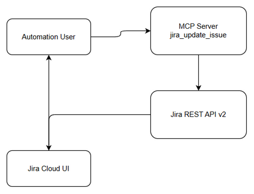
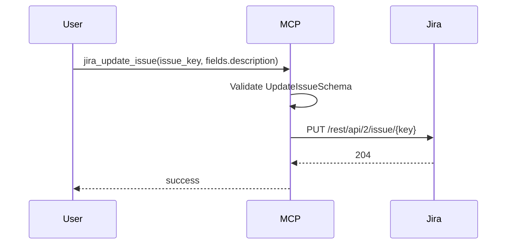

# Functional Specification Document (FSD)

## SA4E-251 — Jira MCP tool description layout broken on update

---

## Document Information

| Field | Value |
|-------|-------|
| Jira Ticket | SA4E-251 |
| Title | Jira MCP tool description layout broken on update |
| Author | BA Agent |
| Version | 1.0 |
| Date | 2026-09-06 |
| Status | Draft |
| Related BRD | documents/SA4E-251/BRD.md |

---

## Revision History

| Version | Date | Author | Changes |
|---------|------|--------|---------|
| 1.0 | 2026-09-06 | BA Agent | Initiate document — auto-generated from BRD and Jira tickets |

---

## 1. Introduction

### 1.1 Purpose

This FSD specifies the functional requirements and design for ensuring markdown formatting preservation when updating Jira issue descriptions via the `jira_update_issue` MCP tool. The specification defines use cases, business rules, API contracts, data flows, integration points, and acceptance criteria mapping from BRD SA4E-251, ensuring headings, nested lists, and SA4E-XXX smart links render correctly in Jira UI and match manual paste behavior.

### 1.2 Scope

In scope:
- Functional behavior of `jira_update_issue` MCP tool for description field updates
- Preservation of markdown headings `#`, `##`, `###`
- Preservation of nested list indentation 2+ levels
- Conversion of SA4E-XXX issue references to Jira smart links
- API contract between MCP server and Jira REST API v2
- Error handling and validation for description payloads

Out of scope:
- Changes to Jira server-side rendering engine
- Support for non-markdown description formats
- Enhancements beyond description field in MCP tool

Reference BRD Scope Section 1.1-1.2.

### 1.3 Definitions & Acronyms

| Term | Definition |
|------|------------|
| MCP | Model Context Protocol tool integration |
| Smart Link | Jira auto-converted issue reference e.g., SA4E-251 |
| BRD | Business Requirements Document |
| FSD | Functional Specification Document |
| Jira REST API | Atlassian Jira Cloud REST v2 API |

### 1.4 References

| Document | Location |
|----------|----------|
| BRD | documents/SA4E-251/BRD.md |
| Jira API Docs | https://developer.atlassian.com/cloud/jira/platform/rest/ |
| Jira Issue Tools | backend/src/servers/atlassian/tools/jira-issue-tools.ts |
| Jira Client | backend/src/servers/atlassian/clients/jira-client.ts |
| Jira Schemas | backend/src/servers/atlassian/models/jira-schemas.ts |

---

## 2. System Overview

### 2.1 System Context Diagram


*[Edit in draw.io](diagrams/system-context.drawio)*

```mermaid
graph TB
    User[Automation User / BA/SA/DEV Agent]
    MCP[MCP Server - jira_update_issue]
    JiraAPI[Jira REST API v2]
    JiraUI[Jira Cloud UI]
    User -->|Calls jira_update_issue with markdown description| MCP
    MCP -->|PUT /rest/api/2/issue/{key} with fields.description| JiraAPI
    JiraAPI -->|Store & Render| JiraUI
    JiraUI -->|Visual feedback| User
```

### 2.2 System Architecture

Components:
- **MCP Server**: `backend/src/servers/atlassian/tools/jira-issue-tools.ts` registers `jira_update_issue` tool with `UpdateIssueSchema`
- **Jira API Client**: `backend/src/servers/atlassian/clients/jira-client.ts` `updateIssue(key, fields)` sends PUT to `/rest/api/2/issue/{key}` with body `{ fields }`
- **Validation Layer**: Zod schema `UpdateIssueSchema` requires `issue_key` matching `^[A-Z][A-Z0-9]+-\d+$` and `fields` as record
- **Jira Cloud**: Receives description string, renders markdown server-side, performs smart link auto-conversion

---

## 3. Functional Requirements

### 3.1 Feature: Preserve markdown headings on MCP update

**Source:** BRD Story 1

#### 3.1.1 Description
When description contains markdown heading syntax `#`, `##`, `###`, the `jira_update_issue` tool must deliver content to Jira such that heading styles render correctly.

#### 3.1.2 Use Case
**Use Case ID:** UC-01
**Actor:** Automation User
**Preconditions:** Issue exists; description contains markdown headings
**Postconditions:** Issue description rendered with correct H1/H2/H3 styles

**Main Flow:**
1. User prepares markdown with headings
2. User calls `jira_update_issue`
3. MCP validates and forwards
4. Jira API updates issue
5. Jira UI renders headings
6. User verifies

#### 3.1.3 Business Rules
| Rule ID | Rule |
|---------|------|
| BR-01 | Heading hierarchy preserved |
| BR-02 | `#`→H1, `##`→H2, `###`→H3 |
| BR-03 | Render matches manual paste |

#### 3.1.5 API Contract
**Endpoint:** `PUT /rest/api/2/issue/{issue_key}` via `jira_update_issue`
**Input:** `issue_key`, `fields.description`



### 3.2 Feature: Preserve nested lists
**Source:** BRD Story 2
BR-04 Nested lists retain indentation
BR-05 Lists not flattened

### 3.3 Feature: Preserve smart links
**Source:** BRD Story 3
BR-06 SA4E-XXX converted to smart links
BR-07 Links navigate correctly

---

## 4. Data Model

No new entities. Jira Issue description field used.

---

## 5. Integration Specifications

### 5.1 Jira Cloud REST API
Method PUT `/rest/api/2/issue/{issue_key}`
Body `{ "fields": { "description": "..." } }`

---

## 6. Processing Logic

Update Issue Description Process:
1. Parse with UpdateIssueSchema
2. Call JiraApiClient.updateIssue
3. Return success/error

---

## 7. Security Requirements

Authentication via MCP, data classification Internal.

---

## 8. Non-Functional Requirements

Performance: No added latency
Usability: Automation parity with manual paste

---

## 9. Error Handling

Invalid issue key → validation error
Jira API failure → AtlassianErrorCode

---

## 10. Testing Considerations

TC-01 Heading preservation
TC-02 Nested list preservation
TC-03 Smart link conversion
TC-04 Manual paste parity

---

## 11. Appendix

Diagrams: system-context, sequence
