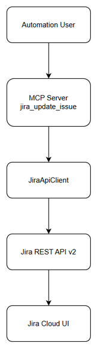
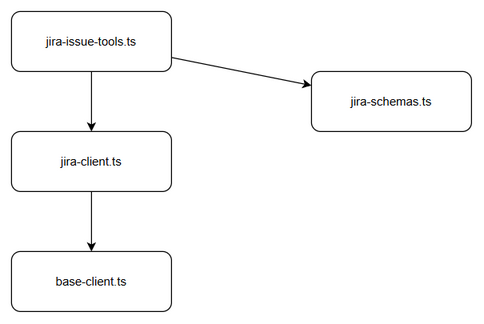
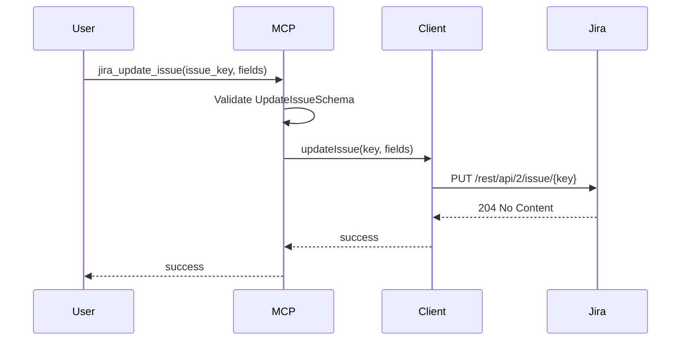

# Technical Design Document (TDD)

## SA4E-251 — Jira MCP tool description layout broken on update

---

## Document Information

| Field | Value |
|-------|-------|
| Jira Ticket | SA4E-251 |
| Title | Jira MCP tool description layout broken on update |
| Author | SA Agent |
| Version | 1.0 |
| Date | 2026-09-06 |
| Status | Draft |
| Related BRD | documents/SA4E-251/BRD.md |
| Related FSD | documents/SA4E-251/FSD.md |

---

## Author Tracking

| Role | Name - Position | Responsibility |
|------|-----------------|----------------|
| Author | SA Agent – Solution Architect | Create document |
| Peer Reviewer |  | Review document |

---

## Revision History

| Version | Date | Author | Changes |
|---------|------|--------|---------|
| 1.0 | 2026-09-06 | SA Agent | Initiate document — auto-generated from BRD and FSD |

---

## Sign-Off

| Name | Signature and date |
|------|--------------------|
| | ☐ I agree and confirm the technical design in this TDD |
| | ☐ I agree and confirm the technical design in this TDD |

---

## 1. Introduction

> **Scope Boundary:** This TDD specifies HOW to implement the requirements defined in the FSD. It does NOT repeat functional requirements, business rules, use cases, or UI specifications — refer to the FSD for those.

### 1.1 Purpose
Design technical solution to preserve markdown formatting — headings, nested lists, SA4E-XXX smart links — when updating Jira issue descriptions via `jira_update_issue` MCP tool, achieving parity with manual paste behavior.

### 1.2 Scope
Technical scope covers:
- `backend/src/servers/atlassian/tools/jira-issue-tools.ts` — `jira_update_issue` handler
- `backend/src/servers/atlassian/clients/jira-client.ts` — `updateIssue` HTTP transport
- `backend/src/servers/atlassian/clients/base-client.ts` — retry, rate limiting, auth refresh
- `backend/src/servers/atlassian/models/jira-schemas.ts` — `UpdateIssueSchema` validation
- Integration with Jira Cloud REST API v2
- Error handling, logging, monitoring for description updates

Out of scope: Jira server-side rendering engine changes, non-markdown formats.

### 1.3 Technology Stack

| Layer | Technology | Version |
|-------|-----------|---------|
| Language | TypeScript | 5.x |
| Framework | Hono + MCP SDK | Hono 4.x, @modelcontextprotocol/sdk |
| HTTP Client | Native fetch | Node 20+ |
| Validation | Zod | 3.x |
| Logging | Pino | 8.x |
| Runtime | Node.js | 20.x |

### 1.4 Design Principles
- Preserve input fidelity — description string passed unchanged to Jira API
- No transformation of markdown content by MCP layer
- Fail-fast validation with clear error codes
- Reuse existing Atlassian client patterns — retry, rate limiting, auth refresh
- Single Responsibility — tool handler validates, client transports

### 1.5 Constraints
- Existing `UpdateIssueSchema` uses `z.record(z.unknown())` for fields
- Jira Cloud renders markdown server-side; MCP must not pre-convert to ADF
- No new database entities required
- Must maintain existing latency SLA for MCP calls

### 1.6 References

| Document | Location |
|----------|----------|
| BRD | documents/SA4E-251/BRD.md |
| FSD | documents/SA4E-251/FSD.md |
| Jira API Docs | https://developer.atlassian.com/cloud/jira/platform/rest/ |

---

## 2. System Architecture

### 2.1 Architecture Overview

High-level flow: Automation User → MCP Server `jira_update_issue` → JiraApiClient.updateIssue → Jira REST API PUT /rest/api/2/issue/{key} → Jira Cloud renders markdown.



*Edit in draw.io](diagrams/architecture.drawio)*

```mermaid
graph TB
    User[Automation User / BA/SA/DEV Agent]
    MCP[MCP Server - jira_update_issue]
    Client[JiraApiClient]
    JiraAPI[Jira REST API v2]
    JiraUI[Jira Cloud UI]
    User -->|Calls jira_update_issue with markdown description| MCP
    MCP -->|Validate UpdateIssueSchema| Client
    Client -->|PUT /rest/api/2/issue/{key} with fields.description| JiraAPI
    JiraAPI -->|Store & Render| JiraUI
    JiraUI -->|Visual feedback| User
```

### 2.2 Component Diagram



*Edit in draw.io](diagrams/component.drawio)*

| Component | Responsibility | Technology |
|-----------|---------------|------------|
| jira-issue-tools.ts | Register MCP tool, validate args, invoke client | TypeScript + MCP SDK |
| jira-client.ts | Domain API methods, build request payload | TypeScript |
| base-client.ts | Retry, rate limiting, auth refresh, error mapping | TypeScript |
| jira-schemas.ts | Zod validation for UpdateIssueSchema | Zod |
| Jira Cloud | Render markdown, convert smart links | Atlassian |

### 2.3 Deployment Architecture

MCP server runs in Backend service within existing monolith deployment. No new infrastructure.


### 2.4 Communication Patterns

| From | To | Protocol | Pattern | Description |
|------|----|----------|---------|-------------|
| MCP Server | JiraApiClient | In-process | Sync | Method call with validated args |
| JiraApiClient | Jira REST API | HTTPS | Sync | PUT /rest/api/2/issue/{key} |
| Jira REST API | Jira Cloud | Internal | Sync | Store & render |

---

## 3. API Design

> Prerequisite: Functional API contracts are defined in FSD §3.x.6.

### 3.1 API Overview

| # | Endpoint | Method | Description | Source |
|---|----------|--------|-------------|--------|
| 1 | `jira_update_issue` MCP tool | N/A | Update fields on Jira issue via REST | UC-01, UC-02, UC-03 |

### 3.2 API: jira_update_issue

**Implements:** UC-01, UC-02, UC-03, BR-01 to BR-07

| Attribute | Value |
|-----------|-------|
| Tool Name | jira_update_issue |
| Input Schema | UpdateIssueSchema |
| Auth | MCP session auth |
| Rate Limit | Inherited from base-client rate limiter |

**Input Schema:**

```json
{
  "issue_key": "SA4E-123",
  "fields": {
    "description": "## Example\n- Parent\n  - Child\nReference SA4E-250"
  }
}
```

**Request Validation:**
- `issue_key` matches `/^[A-Z][A-Z0-9]+-\d+$/`
- `fields` is object, `fields.description` must be string if present

**Success Response:**
```json
{
  "success": true,
  "issue_key": "SA4E-123"
}
```

**Error Responses:**

| Code | HTTP Status | Description |
|------|-------------|-------------|
| VALIDATION_ERROR | 400 | Zod validation failure |
| UNKNOWN | 500 | Unexpected error |
| AtlassianErrorCode | 4xx/5xx | Jira API error |

---

## 4. Database Design

No new tables. Jira Issue description field is managed by Jira Cloud. No local persistence required.

### 4.1 Schema Overview

N/A

### 4.2 DDL Scripts

None.

### 4.3 Migration Plan

None.

---

## 5. Class / Module Design

### 5.1 Package Structure

```
backend/src/servers/atlassian/
├── tools/
│   └── jira-issue-tools.ts       # MCP tool registration
├── clients/
│   ├── jira-client.ts            # JiraApiClient
│   └── base-client.ts            # BaseAtlassianClient
├── models/
│   ├── jira-schemas.ts           # Zod schemas
│   ├── types.ts
│   └── error-schemas.ts
```

### 5.2 Key Interfaces

```typescript
export interface JiraApiClient {
  updateIssue(key: string, fields: unknown): Promise<HttpResponse>
}
```

### 5.3 Design Patterns

| Pattern | Where Used | Rationale |
|---------|-----------|-----------|
| Adapter | JiraApiClient wraps fetch | Isolate Atlassian API specifics |
| Validation | Zod schemas | Fail-fast input validation |
| Retry | BaseAtlassianClient | Transient error resilience |

### 5.4 Error Handling

| Exception | Error Code | When Thrown |
|-----------|------------|-------------|
| AtlassianApiError | VALIDATION_ERROR | Zod parse failure |
| AtlassianApiError | TIMEOUT | Fetch abort |
| AtlassianApiError | NETWORK_ERROR | Connection failure |

---

## 6. Integration Design

### 6.1 External System: Jira Cloud REST API

| Attribute | Value |
|-----------|-------|
| Protocol | HTTPS |
| Endpoint | {JIRA_BASE_URL}/rest/api/2/issue/{issue_key} |
| Authentication | OAuth2 / API token via authHeaders |
| Timeout | Default 30s, upload 120s |
| Retry Policy | 3 attempts, exponential backoff, retry on 429/5xx |
| Circuit Breaker | Not implemented; rely on retry + rate limiter |

**Data Mapping:**

| Source Field | Target Field | Transformation |
|-------------|-------------|----------------|
| issue_key | path param | As-is |
| fields.description | body.fields.description | As-is string, no markdown transform |

**Sequence Diagram:**



---

## 7. Security Design

### 7.1 Authentication
MCP server authenticates via existing JWT/auth mechanism. Jira API calls use per-workspace credentials managed by `authHeaders()` in base client.

### 7.2 Authorization
Tool access controlled by MCP server permissions. No additional RBAC required for description updates.

### 7.3 Data Protection
Description content classified Internal. Transmitted over TLS. No logging of description content — log issue_key and operation result only.

### 7.4 Input Validation
Zod schema validates issue key format and fields shape. Description string length limited by Jira API, not enforced upstream.

---

## 8. Performance & Scalability

### 8.1 Caching Strategy
None for write operations.

### 8.2 Connection Pooling
Native fetch with rate limiter; no explicit pool.

### 8.3 Performance Targets

| Operation | Target | Measurement |
|-----------|--------|-------------|
| jira_update_issue | < existing MCP latency + 0ms | p95 latency |

---

## 9. Monitoring & Observability

### 9.1 Logging
Log tool invocation, validation errors, Jira API errors with issue_key, duration.

### 9.2 Metrics
- MCP tool call count
- Jira API error rate
- Latency histogram

### 9.3 Health Checks
Existing backend health endpoint covers MCP server liveness.

---

## 10. Deployment Considerations

### 10.1 Environment Configuration
Jira base URL and credentials per workspace via config.

### 10.2 Feature Flags
None.

### 10.3 Rollback Strategy
Revert code change to previous handler if regression detected. No DB migration needed.

---

## 11. Appendix

### Glossary
MCP: Model Context Protocol
ADF: Atlassian Document Format

### Open Questions
None.

---

## ⛔ MANDATORY: Diagram Requirements
Diagrams created: architecture.drawio, component.drawio. PNG exports required.
