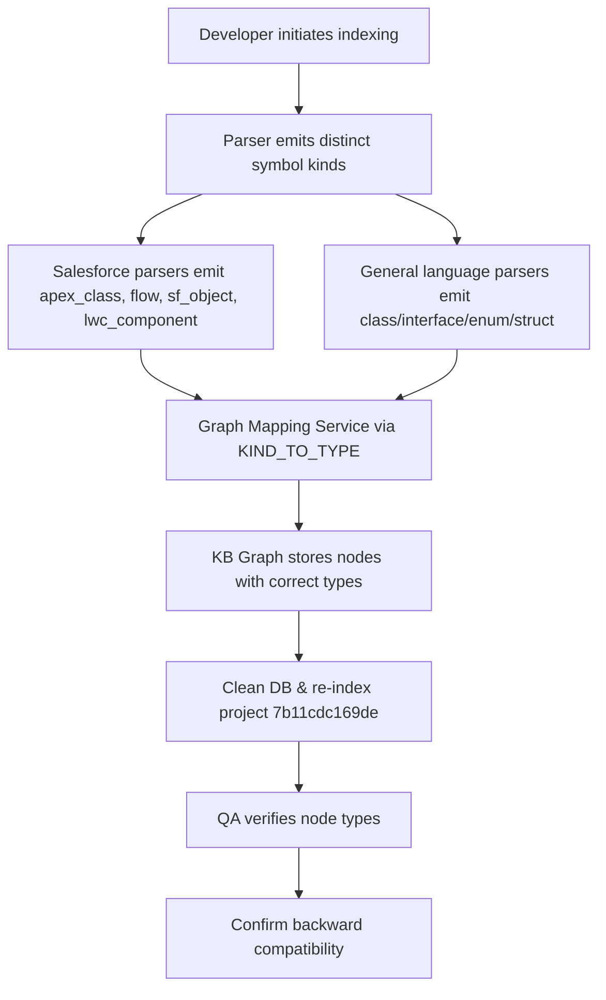
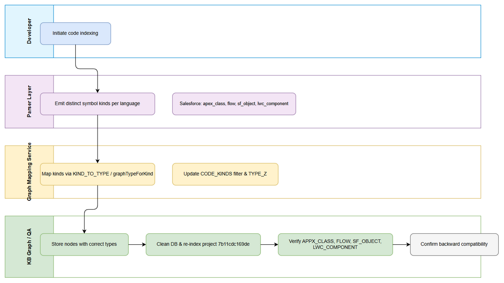
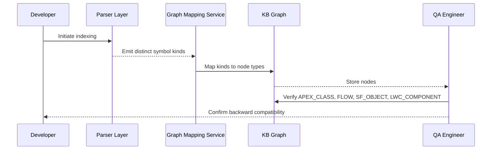
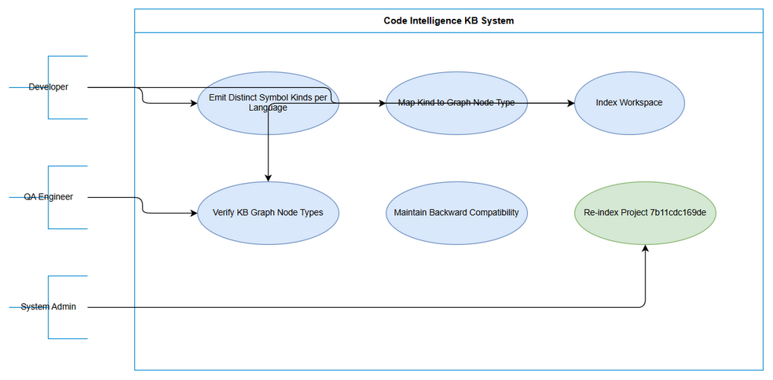

# Business Requirements Document (BRD)

## SDLC Agents 4 Enterprise — SA4E-253: Emit distinct symbol kinds per language so KB Graph node types are correct (all languages)

---

## Document Information

| Field | Value |
|-------|-------|
| Jira Ticket | SA4E-253 |
| Title | Emit distinct symbol kinds per language so KB Graph node types are correct (all languages) |
| Author | BA Agent |
| Version | 1.0 |
| Date | 2026-09-09 |
| Status | Draft |

---

## Author Tracking

| Role | Name - Position | Responsibility |
|------|-----------------|----------------|
| Author | BA Agent – Business Analyst | Create document |
| Peer Reviewer | TBD – Senior BA | Review document |

---

## Revision History

| Version | Date | Author | Changes |
|---------|------|--------|---------|
| 1.0 | 2026-09-09 | BA Agent | Initiate document — auto-generated from Jira ticket SA4E-253 and linked tickets |

---

## Sign-Off

| Name | Signature and date |
|------|--------------------|
| | ☐ I agree and confirm all criteria on this BRD as expected requirements |
| | ☐ I agree and confirm all criteria on this BRD as expected requirements |

---

## 1. Introduction

### 1.1 Scope

The code indexing pipeline currently normalizes symbol kinds to generic values (class/method/property/function) at the parser layer for language-specific entities. This causes KB Graph nodes to reflect only generic types, e.g., indexing a Salesforce workspace produces KB Graph dominated by FUNCTION even though workspace contains Apex classes, Flows, Custom Objects, and LWC components.

Scope is to fix parser + mapping layers so that distinct, semantically-correct symbol kinds are emitted per language across all ~20 registered parsers, and graph node types correctly reflect real entity semantics.

Specific targets:
- Salesforce: apex_class, trigger, flow, sf_object, sf_field, lwc_component, aura_component, visualforce_page
- General languages: TS/JS/Python/Java/Kotlin/Go/Rust/C/C++/C#/PHP/Ruby/Scala/Swift: ensure distinct kinds for class/interface/enum/struct/trait/module map to correct graph node types without collapsing to CODE_ENTITY

### 1.2 Out of Scope

- Changing language detection, file-scanner, parser dispatch, grammar-registry, or temp-copy step in api-index.ts — these are verified working and not root cause
- Direct patching of graph_nodes table; fix must be at parser + mapping layers per no-workaround rule
- UI changes; changes are backend indexing/graph projection

### 1.3 Preliminary Requirement

No additional preliminary requirements identified. Code Intelligence index must be fresh before SA design and DEV implementation.

---

## 2. Business Requirements

### 2.1 High Level Process Map

Developer initiates code indexing → Parser layer emits distinct symbol kinds per language → Graph Mapping Service maps kinds to node types via KIND_TO_TYPE / graphTypeForKind → KB Graph stores nodes with correct types → QA verifies node types for Salesforce project 7b11cdc169de and other languages → Backward compatibility confirmed.

*[Edit in draw.io](diagrams/business-flow.drawio)*

### 2.2 List of User Stories / Use Cases

| # | Story / Use Case / Epic | Priority | Source Ticket |
|---|-------------------------|----------|---------------|
| 1 | As a Developer, I want the code indexer to emit distinct symbol kinds per language so that KB Graph reflects true entity types | MUST HAVE | SA4E-253 |
| 2 | As a QA Engineer, I want to verify KB Graph node types after re-index so that Salesforce entities appear as APEX_CLASS, FLOW, SF_OBJECT, LWC_COMPONENT | MUST HAVE | SA4E-253 |
| 3 | As a System Admin, I want backward compatibility with existing Pega data and previously indexed projects so that no regression occurs | MUST HAVE | SA4E-253 |

### 2.3 Details of User Stories

#### Business Flow

**Step 1:** Developer triggers code indexing for workspace
**Step 2:** Parser layer processes files per language, emitting distinct symbol kinds instead of generic class/method/property
**Step 3:** Graph Mapping Service translates kinds via KIND_TO_TYPE / graphTypeForKind
**Step 4:** CODE_KINDS filter and TYPE_Z positioning updated to include new kinds
**Step 5:** KB Graph stores nodes with correct types
**Step 6:** Clean DB and re-index project 7b11cdc169de
**Step 7:** QA verifies multiple correct node types appear
**Step 8:** Confirm backward compatibility with Pega and existing projects

> **Note:** Root cause verified via code trace. Salesforce parsers emit generic kinds in backend/src/engine/parsers/languages/salesforce-meta/parsers/*.ts and apex/declarations.ts. Graph mapping has no entries for language-specific kinds.

#### STORY 1: Emit Distinct Symbol Kinds per Language

> As a Developer, I want the code indexer to emit distinct symbol kinds per language so that KB Graph reflects true entity types

**Requirement Details:**
1. Parser layer must emit semantically-correct symbol kinds per language, no more forcing to class/method/property/function
2. Salesforce parsers must emit apex_class, trigger, flow, sf_object, sf_field, lwc_component, aura_component, visualforce_page
3. General language parsers must emit distinct kinds for class/interface/enum/struct/trait/module without collapsing to CODE_ENTITY
4. KIND_TO_TYPE / graphTypeForKind updated so every emitted kind maps to distinct graph node type
5. No unintended CODE_ENTITY fallback

**Acceptance Criteria:**
1. Parser layer emits distinct, semantically-correct symbol kinds per language
2. KIND_TO_TYPE / graphTypeForKind updated for all emitted kinds
3. CODE_KINDS filter and TYPE_Z positioning updated
4. Backward compatible with existing Pega data

**Validation Rules:**
- Each language parser unit test asserts correct kinds emitted
- Graph projection tests assert kind → node-type mapping

**Error Handling:**
- If parser emits unknown kind → fallback to generic kind with warning log, do not break indexing

#### STORY 2: Verify KB Graph Node Types

> As a QA Engineer, I want to verify KB Graph node types after re-index so that Salesforce entities appear correctly

**Requirement Details:**
1. After code merge, clean DB for project 7b11cdc169de and re-index
2. KB Graph shows multiple correct node types: APEX_CLASS, FLOW, SF_OBJECT, LWC_COMPONENT etc.

**Acceptance Criteria:**
1. KB Graph shows multiple correct node types for Salesforce workspace
2. Node counts reflect real entity distribution, not dominated by FUNCTION

#### STORY 3: Maintain Backward Compatibility

> As a System Admin, I want backward compatibility so that existing Pega data remains intact

**Requirement Details:**
1. Existing Pega pega_ kinds continue mapping 1:1 to graph node types
2. Previously indexed projects remain valid

**Acceptance Criteria:**
1. Regression tests pass for Pega data
2. No breaking changes to existing graph projections

---

## 3. Dependencies

| Dependency | Type | Related Ticket | Description |
|------------|------|----------------|-------------|
| Parser layer changes | System | SA4E-253 | Update salesforce-meta parsers and apex/declarations.ts |
| Graph mapping constants | System | SA4E-253 | Update KIND_TO_TYPE / graphTypeForKind in backend/src/modules/kb-graph/service/constants.ts |
| Graph sync service | System | SA4E-253 | Update CODE_KINDS filter and TYPE_Z positioning |
| Code Intelligence index freshness | Infrastructure | N/A | Ensure index fresh before SA design |

---

## 4. Stakeholders

| Role | Name / Team | Responsibility | Source |
|------|-------------|----------------|--------|
| Reporter | Duc Nguyen Minh | Requirement owner | SA4E-253 |
| Developer | TBD | Implement parser + mapping fixes | SA4E-253 |
| QA Engineer | TBD | Verify graph node types | SA4E-253 |
| BA Agent | BA Agent | BRD author | SA4E-253 |

---

## 5. Risks and Assumptions

### 5.1 Risks

| Risk | Impact | Likelihood | Mitigation |
|------|--------|------------|------------|
| Parser changes break existing indexing | High | Medium | Comprehensive regression tests; backward compatibility checks |
| Missing kind mapping leads to CODE_ENTITY fallback | Medium | Medium | Exhaustive KIND_TO_TYPE coverage; unit tests |
| ~20 languages scope expands effort | Medium | High | Prioritize Salesforce first, then generalize incrementally |

### 5.2 Assumptions

- Language detection, file-scanner, parser dispatch, and temp-copy work correctly
- Pega mapping already correct and should be preserved
- No UI changes required

---

## 6. Non-Functional Requirements

| Category | Requirement | Details |
|----------|-------------|---------|
| Performance | Indexing performance must not degrade >10% | To be confirmed with technical team |
| Security | No security impact | Indexing internal code only |
| Scalability | Support ~20 languages | As per scope |
| Availability | No downtime for KB Graph | Re-index per project |

> If no non-functional requirements are identified from the tickets, state: "No specific non-functional requirements identified. To be confirmed with technical team."

---

## 7. Related Tickets

| Ticket Key | Summary | Status | Type | Relationship |
|------------|---------|--------|------|--------------|
| SA4E-253 | Emit distinct symbol kinds per language so KB Graph node types are correct (all languages) | In Progress | Task | Main ticket |

---

## 8. Appendix

### Diagram Index

| # | Diagram | Image | Source (editable) |
|---|---------|-------|-------------------|
| 1 | Use Case Diagram | [use-case.png](diagrams/use-case.png) | [use-case.drawio](diagrams/use-case.drawio) |
| 2 | Business Flow Swimlane | [business-flow.png](diagrams/business-flow.png) | [business-flow.drawio](diagrams/business-flow.drawio) |

### Glossary

| Term | Definition |
|------|------------|
| Symbol Kind | Type of code entity emitted by parser, e.g., class, method, apex_class |
| KB Graph | Knowledge Base Graph storing indexed code entities as nodes |
| KIND_TO_TYPE | Mapping constant translating symbol kinds to graph node types |
| CODE_ENTITY | Generic fallback node type |

### Reference Documents

| Document | Link / Location |
|----------|-----------------|
| Jira Ticket SA4E-253 | https://jiraassist.atlassian.net/browse/SA4E-253 |
| Template | documents/templates/BRD-TEMPLATE.md |

---

*[Edit in draw.io](diagrams/use-case.drawio)*
