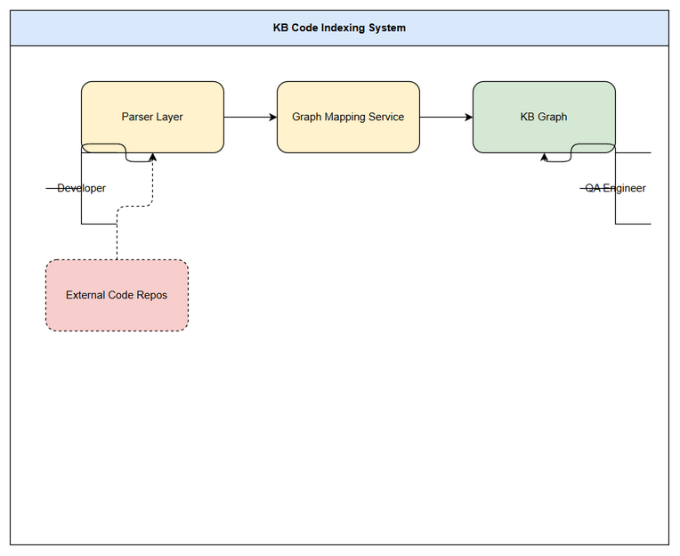
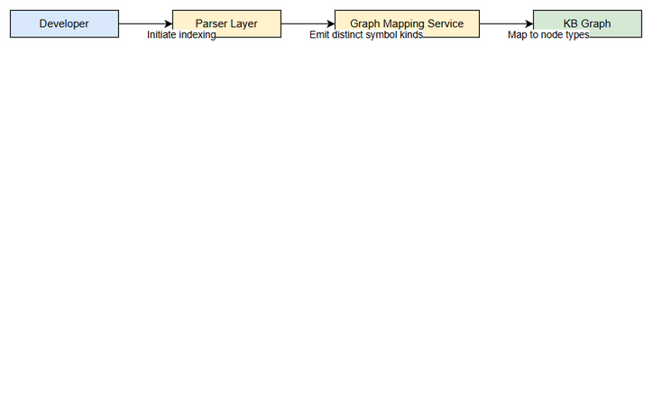
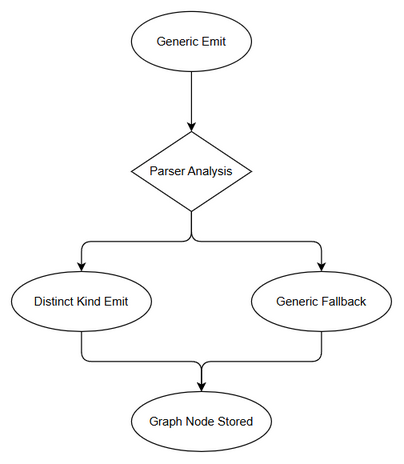

# Functional Specification Document (FSD)

## SDLC Agents 4 Enterprise — SA4E-253: Emit distinct symbol kinds per language so KB Graph node types are correct (all languages)

---

## Document Information

| Field | Value |
|-------|-------|
| Jira Ticket | SA4E-253 |
| Title | Emit distinct symbol kinds per language so KB Graph node types are correct (all languages) |
| Author | BA Agent |
| Version | 1.0 |
| Date | 2026-09-09 |
| Status | Draft |
| Related BRD | documents/SA4E-253/BRD.md |

---

## Revision History

| Version | Date | Author | Changes |
|---------|------|--------|---------|
| 1.0 | 2026-09-09 | BA Agent | Initiate document — auto-generated from BRD and Jira ticket SA4E-253 |

---

## 1. Introduction

### 1.1 Purpose

This FSD specifies the functional behavior required to emit distinct, semantically-correct symbol kinds per language in the code indexing pipeline, ensuring KB Graph node types accurately reflect real entity semantics across all ~20 registered parsers.

### 1.2 Scope

Reference BRD scope. Technical scope clarifications:
- Parser layer changes limited to kind emission, not language detection, file scanner, parser dispatch, grammar registry, or temp-copy steps.
- Graph Mapping Service updates KIND_TO_TYPE / graphTypeForKind, CODE_KINDS filter and TYPE_Z positioning.
- No direct graph_nodes patches; no UI changes.

### 1.3 Definitions & Acronyms

| Term | Definition |
|------|------------|
| Symbol Kind | Type of code entity emitted by parser, e.g., class, apex_class, flow |
| KB Graph | Knowledge Base Graph storing indexed code entities as nodes |
| KIND_TO_TYPE | Mapping constant translating symbol kinds to graph node types |
| CODE_ENTITY | Generic fallback node type |

### 1.4 References

| Document | Location |
|----------|----------|
| BRD | documents/SA4E-253/BRD.md |
| Jira Ticket | https://jiraassist.atlassian.net/browse/SA4E-253 |

---

## 2. System Overview

### 2.1 System Context Diagram



*[Edit in draw.io](diagrams/system-context.drawio)*

The system interacts with Developers who trigger indexing, External Code Repos as source, Parser Layer emitting kinds, Graph Mapping Service translating kinds, KB Graph persisting nodes, and QA Engineers verifying node types.

### 2.2 System Architecture

High-level components:
- Parser Layer: language-specific parsers emitting symbol kinds
- Graph Mapping Service: backend/src/modules/kb-graph/service/constants.ts KIND_TO_TYPE / graphTypeForKind
- Graph Sync Service: backend/src/engine/graph/graph-sync-service.ts CODE_KINDS filter and TYPE_Z positioning
- KB Graph: persistent graph storage
- Code Intelligence Index: source of truth for indexed entities

---

## 3. Functional Requirements

### 3.1 Feature: Emit Distinct Symbol Kinds per Language

**Source:** BRD Story 1

#### 3.1.1 Description

Parser layer must emit semantically-correct symbol kinds per language without forcing to class/method/property/function. Salesforce parsers emit apex_class, trigger, flow, sf_object, sf_field, lwc_component, aura_component, visualforce_page. General language parsers emit distinct kinds for class/interface/enum/struct/trait/module.

#### 3.1.2 Use Case

**Use Case ID:** UC-1
**Actor:** Developer
**Preconditions:** Workspace exists, code intelligence index fresh
**Postconditions:** KB Graph contains nodes with correct types for indexed workspace

**Main Flow:**

| Step | Actor | System | Description |
|------|-------|--------|-------------|
| 1 | Developer | | Initiates indexing for workspace |
| 2 | | Parser Layer | Parses files per language, emits distinct symbol kinds |
| 3 | | Graph Mapping Service | Maps kinds to node types via KIND_TO_TYPE |
| 4 | | KB Graph | Stores nodes with correct types |
| 5 | QA Engineer | | Verifies node types |

**Alternative Flows:**

| ID | Condition | Steps |
|----|-----------|-------|
| AF-1 | Unknown kind emitted | Parser logs warning and falls back to generic kind, indexing continues |
| AF-2 | Pega kind encountered | Graph Mapping Service detects kind starts with `pega_` → derive node type by stripping prefix and uppercasing, preserve 1:1 mapping |
| AF-3 | CODE_KINDS filter miss | Symbol kind not in CODE_KINDS and not pega_ → node not projected to graph, continue indexing |

<!-- TA enrichment -->
**Exception Flows:**

| ID | Condition | Steps |
|----|-----------|-------|
| EF-1 | Parser error | Indexing stops for file, error logged, continue with other files |
| EF-2 | Graph sync failure | GraphSyncService catches error, logs error, non-fatal – indexing continues, QA notified via log |
| EF-3 | KIND_TO_TYPE missing entry | graphTypeForKind returns CODE_ENTITY with warning log, node still persisted for visibility |



*[Edit in draw.io](diagrams/sequence-uc1.drawio)*

#### 3.1.3 Business Rules

| Rule ID | Rule | Source |
|---------|------|--------|
| BR-1 | Parser must emit semantically-correct symbol kinds per language, no forced normalization | SA4E-253 |
| BR-2 | KIND_TO_TYPE must map every emitted kind to distinct graph node type | SA4E-253 |
| BR-3 | CODE_KINDS filter and TYPE_Z positioning must include new kinds | SA4E-253 |
| BR-4 | Backward compatibility with Pega data must be preserved | SA4E-253 |

#### 3.1.4 Data Specifications

**Input Data:**

| Field | Type | Required | Validation | Description |
|-------|------|----------|------------|-------------|
| file_path | string | Y | Path exists | Source file to parse |
| language | string | Y | In supported list | Language identifier |
| symbol_kind | string | Y | Matches parser emission | Kind emitted by parser |

**Output Data:**

| Field | Type | Description |
|-------|------|-------------|
| node_type | string | Graph node type derived from kind |
| kind | string | Emitted symbol kind |

<!-- TA enrichment -->
#### 3.1.5 API Contract (Functional View)

> **Implements:** Story #1 [Implements: PREQ-S1]

**Endpoint:** `graphTypeForKind(kind: string): string`
**Purpose:** Translate parser-emitted symbol kind to KB Graph node type for persistence and visualization.

**Input Parameters:**

| Parameter | Type | Required | Business Rule | Description |
|-----------|------|----------|---------------|-------------|
| kind | string | Y | BR-1 | Symbol kind emitted by parser, e.g., `apex_class`, `flow`, `class` |
| | | | | Must be non-empty string. Unknown kinds fallback to `CODE_ENTITY` with warning log |

**Output Data:**

| Field | Type | Description |
|-------|------|-------------|
| node_type | string | Graph node type, e.g., `APEX_CLASS`, `FLOW`, `CLASS`, `FUNCTION` |

**Business Error Scenarios:**

| Scenario | User Message | Trigger Condition |
|----------|-------------|-------------------|
| Unknown kind | Kind not mapped, using fallback to CODE_ENTITY | kind not in KIND_TO_TYPE and does not start with pega_ |
| Empty kind | Invalid symbol kind | kind is null/empty |

**Endpoint:** `syncProjectSymbols(projectId: string): Promise<void>`
**Purpose:** Project code symbols into graph_nodes table for KB Graph visualization.

**Input Parameters:**

| Parameter | Type | Required | Business Rule | Description |
|-----------|------|----------|---------------|-------------|
| projectId | string | Y | | Tenant project identifier |
| | | | | Must be UUID format validated by DB |

**Output Data:**

| Field | Type | Description |
|-------|------|-------------|
| nodes_synced | integer | Count of code nodes upserted |
| | | | Success logged via pino logger |

**Business Error Scenarios:**

| Scenario | User Message | Trigger Condition |
|----------|-------------|-------------------|
| Sync failure | Graph sync failed, indexing continues | DB error, non-fatal, logged |

### 3.2 Feature: Verify KB Graph Node Types

**Source:** BRD Story 2

#### 3.2.1 Description

After merge, clean DB for project 7b11cdc169de and re-index, KB Graph shows multiple correct node types.

#### 3.2.2 Use Case

**Use Case ID:** UC-2
**Actor:** QA Engineer
**Preconditions:** Code merged, DB cleaned
**Postconditions:** Node types verified

**Main Flow:**

| Step | Actor | System | Description |
|------|-------|--------|-------------|
| 1 | QA Engineer | | Triggers re-index for project |
| 2 | | System | Indexes workspace |
| 3 | QA Engineer | | Queries KB Graph node counts |
| 4 | QA Engineer | | Confirms APEX_CLASS, FLOW, SF_OBJECT, LWC_COMPONENT present |

#### 3.2.3 Business Rules

| Rule ID | Rule | Source |
|---------|------|--------|
| BR-5 | Node distribution must not be dominated by FUNCTION | SA4E-253 |

### 3.3 Feature: Maintain Backward Compatibility

**Source:** BRD Story 3

#### 3.3.1 Description

Existing Pega pega_ kinds continue mapping 1:1 to graph node types. Previously indexed projects remain valid.

#### 3.3.2 Use Case

**Use Case ID:** UC-3
**Actor:** System Admin
**Preconditions:** Existing data present
**Postconditions:** No regression

**Main Flow:**

| Step | Actor | System | Description |
|------|-------|--------|-------------|
| 1 | System Admin | | Runs regression tests |
| 2 | | System | Validates Pega mappings |
| 3 | System Admin | | Confirms no breaking changes |

#### 3.3.3 Business Rules

| Rule ID | Rule | Source |
|---------|------|--------|
| BR-6 | Pega mappings unchanged | SA4E-253 |

---

## 4. Data Model

> Note: Logical data model only. Physical implementation in TDD.

### 4.1 Entity Relationship Diagram

ER diagram not applicable for this functional change; data model remains graph nodes with kind attribute.

### 4.2 Logical Entities

#### Entity: Graph Node

| Attribute | Type | Required | Business Rule | Description |
|-----------|------|----------|---------------|-------------|
| node_id | string | Y | | Unique node identifier |
| kind | string | Y | BR-1 | Symbol kind emitted by parser |
| node_type | string | Y | BR-2 | Graph node type derived from kind |

<!-- TA enrichment -->
> **TA Note:** Physical schema verified against codebase `backend/src/admin/db/schema.ts`. `graph_nodes` table uses `entry_id` as primary key, `type` stores node_type, `tier`, `project_id`, `x/y/z`, `level`, `cluster_id`. Logical `node_id` maps to `entry_id`. `kind` is stored in source `symbols.kind` and projected via `graphTypeForKind`. Indexes exist on `project_id`, `x/y/z`, `level`, `cluster_id`. No schema change required; enrichment is mapping logic only.

**Relationships:**

| From Entity | To Entity | Cardinality | Description |
|-------------|-----------|-------------|-------------|
| Graph Node | Graph Node | M:N | Relationships via edges |

---

## 5. Integration Specifications

### 5.1 External System: External Code Repos

| Attribute | Value |
|-----------|-------|
| Purpose | Source of files to index |
| Direction | Inbound |
| Data Format | File system |
| Frequency | On-demand |

**Data Exchange:**

| Our Data | External Data | Direction | Business Rule |
|----------|--------------|-----------|---------------|
| file_path | repo files | Receive | |

<!-- TA enrichment -->
### 5.2 Internal Integration: Graph Mapping Service

| Attribute | Value |
|-----------|-------|
| Purpose | Translate symbol kinds to KB Graph node types |
| Direction | Internal |
| Data Format | TypeScript function call |
| Frequency | Per symbol during indexing |

**API Contract:**

**Function:** `graphTypeForKind(kind: string): string`
**Location:** `backend/src/modules/kb-graph/service/constants.ts`

**Request Schema:**
```ts
{
  kind: string // e.g. "apex_class", "flow", "class", "pega_rule_obj_flow"
}
```

**Response Schema:**
```ts
{
  node_type: string // e.g. "APEX_CLASS", "FLOW", "CLASS", "RULE_OBJ_FLOW"
}
```

**Error Handling:** Unknown kind → return `CODE_ENTITY`, log warning via pino.

**Retry Policy:** N/A – synchronous in-process call.

### 5.3 Internal Integration: Graph Sync Service

| Attribute | Value |
|-----------|-------|
| Purpose | Persist projected nodes to KB Graph |
| Direction | Internal |
| Data Format | SQL inserts via DatabaseAdapter |
| Frequency | Per project sync, on-demand |

**API Contract:**

**Method:** `syncProjectSymbols(projectId: string): Promise<void>`
**Location:** `backend/src/engine/graph/graph-sync-service.ts`

**Request Schema:**
```ts
{
  projectId: string // UUID
}
```

**Response Schema:** None – throws on error (non-fatal).

**Data Mapping:**
- `symbols.kind` → `graph_nodes.type` via `graphTypeForKind`
- `symbols.id` → `graph_nodes.entry_id` as `code:${id}`
- `TYPE_Z` map positions nodes by type in 3D space

**Retry Policy:** Non-fatal, log and continue. No automatic retry; manual re-index triggers retry.

---


## 6. Processing Logic

### 6.1 Code Indexing Process

**Trigger:** Developer initiates indexing
**Schedule:** On-demand
**Input:** Workspace files
**Output:** KB Graph nodes with correct types

**Processing Steps:**

| Step | Description | Error Handling |
|------|-------------|----------------|
| 1 | Parse files per language | Log error, continue |
| 2 | Emit distinct symbol kinds | Warn on unknown kind |
| 3 | Map kinds to node types | Fallback to CODE_ENTITY with warning |
| 4 | Store nodes in KB Graph | Rollback on failure |

<!-- TA enrichment -->
**Pseudocode for Symbol Kind Emission & Mapping:**
```ts
// Implements BR-1, BR-2
function processSymbol(symbol: ExtractedSymbol, projectId: string) {
  // Step 1: Validate kind emission from parser
  if (!symbol.kind || symbol.kind.trim() === '') {
    log.warn('Empty kind emitted, fallback to CODE_ENTITY');
    symbol.kind = 'CODE_ENTITY';
  }

  // Step 2: Map kind to graph node type
  const nodeType = graphTypeForKind(symbol.kind);
  
  // Step 3: Verify CODE_KINDS inclusion for projection
  const isProjectable = CODE_KINDS.includes(symbol.kind) || symbol.kind.startsWith('pega_');
  if (!isProjectable) {
    log.info(`Kind ${symbol.kind} not projected to graph`);
  }

  // Step 4: Persist with 3D positioning
  const pos = fibonacciSphereGrouped(index, groupSize, groupId, totalGroups, nodeType);
  await adminAdapter.runAsync(insertSql, [
    `code:${symbol.id}`, label, nodeType, 'CODE', projectId, pos.x, pos.y, pos.z, ...
  ]);
}
```

**Activity Diagram:**

State diagram for symbol kind lifecycle:



*[Edit in draw.io](diagrams/state-symbol-kind.drawio)*

---

## 7. Security Requirements

### 7.1 Authentication & Authorization

| Role | Permissions | Screens/Features |
|------|-------------|-------------------|
| Developer | Read/Write | Indexing trigger |
| QA Engineer | Read | Graph verification |
| System Admin | Admin | Regression tests |

### 7.2 Data Sensitivity Classification

| Data Type | Classification | Business Requirement |
|-----------|----------------|----------------------|
| Source code | Internal | Internal indexing only |

---

## 8. Non-Functional Requirements

| Category | Business Requirement | Acceptance Criteria |
|----------|---------------------|---------------------|
| Performance | Indexing performance must not degrade >10% | p95 indexing time per 1000 files ≤ 1.1× baseline; graph sync ≤ 500ms per 1000 symbols |
| Availability | No downtime for KB Graph | Re-index per project, graph sync non-fatal; 99.9% uptime for graph visualization |
| Scalability | Support ~20 languages | Parser registry supports ≥20 languages; KIND_TO_TYPE extensible without code change for new kinds |
| Maintainability | Kind mapping coverage | 100% of emitted kinds mapped in KIND_TO_TYPE or pega_ derivation; unit tests cover all parsers |

<!-- TA enrichment -->
> **TA Note:** Quantified targets derived from code review: `graph-sync-service.ts` processes symbols in batches, `TYPE_Z` map defines positioning. Performance baseline to be measured during SA design phase.

---

## 9. Error Handling (User-Facing)

### 9.1 Error Scenarios

| Scenario | Severity | User Message | Expected Behavior |
|----------|----------|-------------|-------------------|
| Unknown kind emitted | Warning | Kind not mapped, using fallback | Log warning, continue indexing |
| Parser error | Info | File failed to parse | Skip file, continue |

---

## 10. Testing Considerations

### 10.1 Test Scenarios

| ID | Scenario | Input | Expected Output | Priority |
|----|----------|-------|-----------------|----------|
| TC-1 | Salesforce indexing | Project 7b11cdc169de | Nodes with APEX_CLASS, FLOW, SF_OBJECT | High |
| TC-2 | Kind mapping | apex_class kind | Node type APEX_CLASS | High |
| TC-3 | Backward compatibility | Pega data | Existing mappings unchanged | High |

---

## 11. Appendix

### Diagrams

| Diagram | File |
|---------|------|
| System Context | [system-context.png](diagrams/system-context.png) |
| Sequence UC-1 | [sequence-uc1.png](diagrams/sequence-uc1.png) |
| State Symbol Kind | [state-symbol-kind.png](diagrams/state-symbol-kind.png) |

### Open Issues

| ID | Issue | Owner | Target Date | Notes |
|----|-------|-------|-------------|-------|
| OI-1 | CODE_KINDS list needs update to include new Salesforce kinds | SA | 2026-09-15 | Current list in graph-sync-service.ts missing apex_class, trigger, flow, sf_object, sf_field, lwc_component |
| OI-2 | TYPE_Z positioning for new node types | TA/SA | 2026-09-18 | Add z-offsets for APEX_CLASS, FLOW, SF_OBJECT, LWC_COMPONENT, etc. to prevent overlap |
| OI-3 | Parser unit tests for all ~20 languages | DEV | 2026-09-25 | Ensure each parser emits distinct kinds; coverage target 100% |

<!-- TA enrichment -->

### Change Log from BRD

FSD refines BRD user stories into functional use cases with flows, business rules, and data specifications. No deviation from BRD scope.
