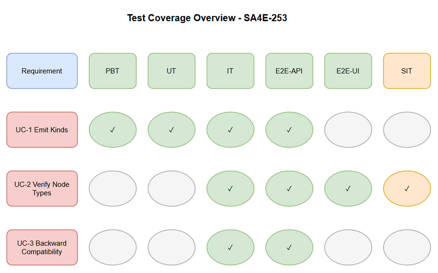

# Software Test Plan (STP)

## SDLC Agents 4 Enterprise — SA4E-253: Emit distinct symbol kinds per language so KB Graph node types are correct (all languages)

---

## Document Information

| Field | Value |
|-------|-------|
| Jira Ticket | SA4E-253 |
| Title | Emit distinct symbol kinds per language so KB Graph node types are correct (all languages) |
| Author | QA Agent |
| Version | 1.0 |
| Date | 2026-09-09 |
| Status | Draft |
| Related BRD | BRD-v1.0-SA4E-253.md |
| Related FSD | FSD-v1.0-SA4E-253.md |
| Related TDD | TDD-v1.0-SA4E-253.md |

---

## Author Tracking

| Role | Name - Position | Responsibility |
|------|-----------------|----------------|
| Author | QA Agent – QA Engineer | Create document |
| Peer Reviewer | TBD – Senior QA | Review document |

---

## Revision History

| Version | Date | Author | Changes |
|---------|------|--------|---------|
| 1.0 | 2026-09-09 | QA Agent | Initiate document — auto-generated from BRD, FSD, and TDD |

---

## Sign-Off

| Name | Signature and date |
|------|--------------------|
| | ☐ I agree and confirm the test plan in this STP |
| | ☐ I agree and confirm the test plan in this STP |

---

## 1. Introduction

### 1.1 Purpose

This Test Plan defines the testing strategy, scope, approach, environment, schedule, resources, risks and defect management for SA4E-253: Emit distinct symbol kinds per language so KB Graph node types are correct across all languages. The purpose is to verify parser layer emits semantically-correct symbol kinds per language, Graph Mapping Service correctly maps kinds to node types, and backward compatibility with existing Pega data is maintained after re-indexing project 7b11cdc169de.

### 1.2 Test Objectives

- Verify all functional requirements from FSD are implemented correctly for distinct kind emission and graph mapping
- Validate business rules BR-1 to BR-6 are enforced
- Ensure non-functional requirements on indexing performance ≤10% degradation are met
- Confirm KB Graph shows multiple correct node types for Salesforce workspace and is not dominated by FUNCTION
- Ensure backward compatibility with Pega data and existing projects
- Validate security review findings do not introduce new vulnerabilities

### 1.3 References

| Document | Location |
|----------|----------|
| BRD | documents/SA4E-253/BRD.md |
| FSD | documents/SA4E-253/FSD.md |
| TDD | documents/SA4E-253/TDD.md |
| SECURITY-REVIEW | documents/SA4E-253/SECURITY-REVIEW.md |

---

## 2. Test Strategy

### 2.1 Test Levels

| Level | Scope | Automation | Tools |
|-------|-------|------------|-------|
| PBT | Correctness properties (random inputs) | Automated | fast-check |
| UT | Unit/edge case tests | Automated | vitest |
| IT | API integration (Hono app in-process) | Automated | vitest + Hono `app.request()` |
| E2E-API | REST endpoint E2E (real server) | Automated | vitest + fetch |
| E2E-UI | Browser UI E2E (Playwright) | Automated | Playwright |
| SIT | Manual exploratory / edge cases only | Manual | Browser |

### 2.2 Test Types

| Type | Description | Applicable |
|------|-------------|------------|
| Functional Testing | Verify features work per FSD use cases UC-1, UC-2, UC-3 | Yes |
| Regression Testing | Ensure existing features are not broken, Pega mappings preserved | Yes |
| Performance Testing | Verify response times and load capacity, indexing ≤10% degradation | Yes |
| Security Testing | Verify auth, authorization, input validation per SECURITY-REVIEW | Yes |
| Usability Testing | Verify UI/UX meets specifications for graph visualization | No |
| Compatibility Testing | Verify browser/device compatibility for graph view | No |

### 2.3 Test Approach

Risk-based testing prioritizing Salesforce parser kinds and graph mapping. Automation maximizes coverage for parser unit tests, graph mapping integration, and E2E API flows. Manual SIT reserved for visual 3D positioning verification and exploratory node distribution checks. Property-based tests validate mapping invariants for unknown kinds and pega_ prefix handling.

### 2.4 Entry Criteria

| Level | Entry Criteria |
|-------|---------------|
| SIT | Code merged to SIT, unit tests passed, test data prepared for project 7b11cdc169de, environment ready |
| UAT | SIT completed with 0 Critical defects, ≤2 Major defects open, test report approved |

### 2.5 Exit Criteria

| Level | Exit Criteria |
|-------|--------------|
| SIT | 100% test cases executed, 0 Critical defects, ≤2 Major defects open |
| UAT | All UAT scenarios passed, business sign-off obtained |

### 2.6 Test Cases Summary

| Level | Count | Automated | Manual |
|-------|-------|-----------|--------|
| PBT | 3 | 3 | 0 |
| UT | 12 | 12 | 0 |
| IT | 5 | 5 | 0 |
| E2E-API | 6 | 6 | 0 |
| E2E-UI | 2 | 2 | 0 |
| SIT | 2 | 0 | 2 |
| **Total** | **30** | **28 (93%)** | **2 (7%)** |

---

## 3. Test Scope

### 3.1 Features In Scope

| # | Feature / Story | Priority | FSD Reference | Test Type |
|---|----------------|----------|---------------|-----------|
| 1 | Emit Distinct Symbol Kinds per Language | High | UC-1, BR-1..BR-4 | Functional, Unit, Integration |
| 2 | Verify KB Graph Node Types after re-index project 7b11cdc169de | High | UC-2, BR-5 | Functional, E2E-API, E2E-UI, SIT |
| 3 | Maintain Backward Compatibility with Pega data | High | UC-3, BR-6 | Regression, Integration |

### 3.2 Features Out of Scope

| # | Feature | Reason |
|---|---------|--------|
| 1 | Language detection, file-scanner, parser dispatch, grammar-registry, temp-copy changes | Verified working, not root cause per BRD |
| 2 | Direct patching of graph_nodes table | Fix must be at parser + mapping layers per no-workaround rule |
| 3 | UI changes | Changes are backend indexing/graph projection only |



---

## 4. Test Environment

### 4.1 Environment Requirements

| Environment | URL | Database | Purpose |
|-------------|-----|----------|---------|
| SIT | http://localhost:3000 | SQLite / PostgreSQL | System Integration Testing |
| UAT | TBC | PostgreSQL | User Acceptance Testing |

### 4.2 Browser / Device Requirements

| Browser | Version | OS | Required |
|---------|---------|-----|----------|
| Chrome | 120+ | Windows/Mac | Yes |
| Firefox | 120+ | Windows/Mac | No |

### 4.3 Test Data Requirements

| Data Type | Description | Source | Preparation |
|-----------|-------------|--------|-------------|
| Salesforce project 7b11cdc169de | Clean DB and re-indexed workspace | Internal repo | Clean DB, trigger re-index |
| Pega test data | Existing indexed Pega symbols | Production copy | Snapshot for regression |
| Parser kind test fixtures | apex_class, flow, sf_object, lwc_component, pega_rule | testdata CSVs | Pre-seeded |

### 4.4 External Dependencies

| System | Dependency | Mock/Stub Available |
|--------|-----------|---------------------|
| External Code Repos | File system access | N/A |
| KB Graph DB | graph_nodes table | No |

---

## 5. Test Schedule

| Phase | Start Date | End Date | Duration | Milestone |
|-------|-----------|----------|----------|-----------|
| Test Planning | 2026-09-09 | 2026-09-09 | 1 day | STP + STC approved |
| Test Data Preparation | 2026-09-10 | 2026-09-10 | 1 day | Test data ready |
| SIT Execution | 2026-09-11 | 2026-09-12 | 2 days | SIT sign-off |
| Defect Fix & Retest | 2026-09-13 | 2026-09-14 | 2 days | All Critical/Major fixed |
| UAT Execution | 2026-09-15 | 2026-09-16 | 2 days | UAT sign-off |
| Go-Live | 2026-09-17 | 2026-09-17 | 1 day | Production deployment |

---

## 6. Resources & Responsibilities

| Role | Name | Responsibility |
|------|------|---------------|
| Test Lead | QA Agent | Test planning, coordination, reporting |
| QA Engineer | QA Agent | Test case design, execution, defect reporting |
| BA | BA Agent | UAT support, acceptance criteria clarification |
| Developer | TBD | Bug fixing, unit test coverage |
| DevOps | TBD | Environment setup, deployment |

---

## 7. Risk & Mitigation

| # | Risk | Impact | Likelihood | Mitigation |
|---|------|--------|------------|------------|
| 1 | Parser changes break existing indexing | High | Medium | Comprehensive regression tests; backward compatibility checks |
| 2 | Missing kind mapping leads to CODE_ENTITY fallback | Medium | Medium | Exhaustive KIND_TO_TYPE coverage; unit tests |
| 3 | ~20 languages scope expands effort | Medium | High | Prioritize Salesforce first, then generalize incrementally |
| 4 | Test data for project 7b11cdc169de not available | High | Medium | Coordinate with DevOps for clean DB snapshot |

---

## 8. Defect Management

### 8.1 Severity Levels

| Severity | Definition | Example |
|----------|-----------|---------|
| Critical | System crash, data loss, security breach | Graph sync fails with data loss |
| Major | Feature not working, workaround exists | Kind mapping returns CODE_ENTITY for known kind |
| Minor | UI issue, cosmetic defect | Node color mismatch |
| Trivial | Typo, minor alignment issue | Log message typo |

### 8.2 Priority Levels

| Priority | Definition | SLA (Fix Time) |
|----------|-----------|----------------|
| P1 | Must fix immediately | 4 hours |
| P2 | Must fix before release | 1 business day |
| P3 | Should fix if time permits | 3 business days |
| P4 | Nice to fix, can defer | Next release |

### 8.3 Defect Lifecycle

```
New → Open → In Progress → Fixed → Ready for Retest → Verified → Closed
                                                      → Reopened → In Progress
```

---

## 9. Test Metrics & Reporting

### 9.1 Metrics

| Metric | Formula | Target |
|--------|---------|--------|
| Test Execution Rate | Executed / Total × 100% | 100% |
| Pass Rate | Passed / Executed × 100% | ≥ 95% |
| Defect Density | Defects / Test Cases | ≤ 0.1 |
| Critical Defect Count | Count of Critical severity | 0 |
| Defect Fix Rate | Fixed / Total Defects × 100% | ≥ 90% |

### 9.2 Reporting Schedule

| Report | Frequency | Audience |
|--------|-----------|----------|
| Daily Test Status | Daily during SIT/UAT | Project team |
| Defect Summary | Daily | Dev team + PM |
| Test Completion Report | End of SIT / End of UAT | All stakeholders |

---

## 10. Appendix

### Glossary

| Term | Definition |
|------|------------|
| SIT | System Integration Testing |
| UAT | User Acceptance Testing |
| STP | Software Test Plan |
| STC | Software Test Cases |
| KB Graph | Knowledge Base Graph |

### Assumptions

- Language detection, file-scanner, parser dispatch, and temp-copy work correctly
- Pega mapping already correct and should be preserved
- No UI changes required
