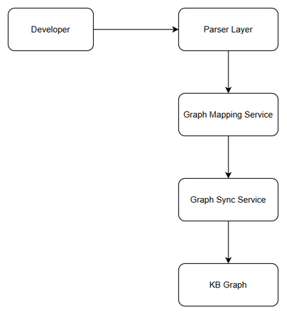
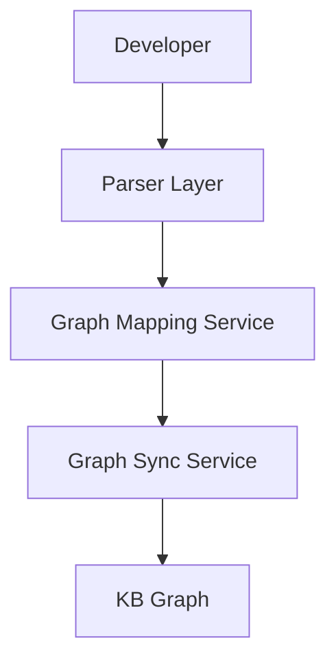
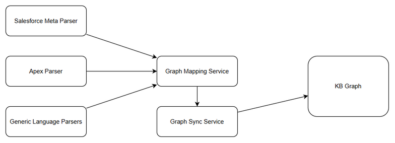
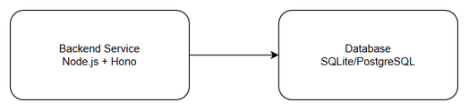
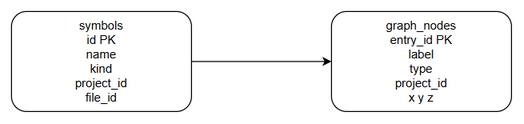
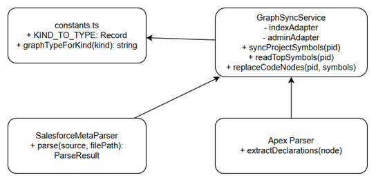
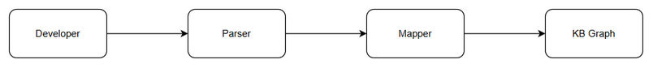

# Technical Design Document (TDD)

## SDLC Agents 4 Enterprise — SA4E-253: Emit distinct symbol kinds per language so KB Graph node types are correct (all languages)

---

## Document Information

| Field | Value |
|-------|-------|
| Jira Ticket | SA4E-253 |
| Title | Emit distinct symbol kinds per language so KB Graph node types are correct (all languages) |
| Author | SA Agent |
| Version | 1.0 |
| Date | 2026-09-09 |
| Status | Draft |
| Related BRD | BRD.md |
| Related FSD | FSD.md |

---

## 1. Introduction

### 1.1 Purpose
Design implementation to emit distinct, semantically-correct symbol kinds per language, ensuring KB Graph node types reflect real entity semantics across ~20 parsers.

### 1.2 Scope
Parser kind emission changes; Graph Mapping Service KIND_TO_TYPE / graphTypeForKind updates; Graph Sync Service CODE_KINDS and TYPE_Z updates. No language detection, scanner, dispatch, grammar registry, temp-copy changes. No schema changes.

### 1.3 Technology Stack
TypeScript 5.x, Hono 4.x, Node.js 20.x, SQLite/PostgreSQL, Pino, Zod

### 1.4 Design Principles
Open/Closed, Single Responsibility, Backward Compatibility, No Workaround

### 1.5 Constraints
No schema change to graph_nodes/symbols. Performance degradation <=10%. Support ~20 languages.

### 1.6 References
BRD.md, FSD.md

---

## 2. System Architecture

### 2.1 Architecture Overview
Developer triggers indexing → Parser Layer emits distinct kinds → Graph Mapping Service translates via KIND_TO_TYPE → Graph Sync Service projects to graph_nodes with TYPE_Z → KB Graph

*[Edit in draw.io](diagrams/architecture.drawio)*

### 2.2 Component Diagram

*[Edit in draw.io](diagrams/component.drawio)*

| Component | Responsibility | Technology |
|-----------|---------------|------------|
| Salesforce Meta Parser | Emit sf_object/sf_field/flow/lwc_component/aura_component | TypeScript |
| Apex Parser | Emit apex_class/trigger | TypeScript |
| Generic Parsers | Emit class/interface/enum/struct/trait/module | TypeScript |
| Graph Mapping Service | graphTypeForKind, KIND_TO_TYPE | constants.ts |
| Graph Sync Service | CODE_KINDS filter, TYPE_Z positioning | graph-sync-service.ts |
| KB Graph | Persistent storage | SQLite/PostgreSQL |

### 2.3 Deployment Architecture
No new infrastructure. Backend service in-process changes.

*[Edit in draw.io](diagrams/deployment.drawio)*

### 2.4 Communication Patterns
In-process sync calls Parser → Mapper → Sync → DB

---

## 3. API Design

### 3.1 graphTypeForKind(kind: string): string
Implements UC-1 BR-1 BR-2
Input kind string, output node_type string. Unknown kind → CODE_ENTITY with warning.

### 3.2 syncProjectSymbols(projectId: string): Promise<void>
Implements UC-1 BR-3
Reads symbols with CODE_KINDS + pega_ filter, maps via graphTypeForKind, upserts graph_nodes with TYPE_Z positioning. Non-fatal errors logged.

---

## 4. Database Design

No schema change. Tables symbols and graph_nodes reused.

*[Edit in draw.io](diagrams/db-schema.drawio)*

Physical schema verified in backend/src/admin/db/schema.ts. graph_nodes uses entry_id, type, project_id, x,y,z,level,cluster_id.

Query patterns:
readTopSymbols SELECT with kind IN CODE_KINDS OR kind LIKE 'pega_%'
replaceCodeNodes DELETE + INSERT IGNORE

---

## 5. Class / Module Design

Package structure:
backend/src/engine/parsers/languages/salesforce-meta/parsers/object.ts
backend/src/engine/parsers/languages/apex/declarations.ts
backend/src/modules/kb-graph/service/constants.ts
backend/src/engine/graph/graph-sync-service.ts

Key interfaces:
KIND_TO_TYPE Record<string,string>
graphTypeForKind(kind) -> string

Design patterns: Strategy for parsers, Mapping Table for kinds, Facade for sync.

Error handling: Unknown kind → CODE_ENTITY warning; parser error → skip file; sync failure → non-fatal log.

*[Edit in draw.io](diagrams/class-diagram.drawio)*

---

## 6. Integration Design

Graph Mapping Service internal call: symbols.kind → graphTypeForKind → graph_nodes.type
Graph Sync Service uses DatabaseAdapter for index and admin DBs. No retry, manual re-index for retry.

Sequence UC-1:

*[Edit in draw.io](diagrams/api-sequence-uc1.drawio)*

---

## 7. Security Design

Internal services. Indexing trigger requires JWT authentication. Roles: Developer read/write indexing, QA read graph, System Admin admin. Source code internal classification.

---

## 8. Performance & Scalability

Indexing p95 <=1.1x baseline per 1000 files. Graph sync <=500ms per 1000 symbols. Connection pooling via DatabaseAdapter. No caching change.

---

## 9. Monitoring & Observability

Logging:
Unknown kind fallback WARN with kind, filePath
Graph sync failure ERROR with projectId

Metrics:
graph_sync_duration_ms histogram
unknown_kinds_total counter

---

## 10. Implementation Checklist

- Update KIND_TO_TYPE with apex_class, trigger, flow, sf_object, sf_field, lwc_component, aura_component, visualforce_page
- Update CODE_KINDS array in graph-sync-service.ts
- Update TYPE_Z map for new node types
- Patch Salesforce meta parsers object.ts field kind to sf_field, object kind to sf_object
- Patch flow, lwc-meta, aura-meta parsers
- Patch Apex declarations to emit apex_class/trigger
- Add unit tests per parser
- Clean DB and re-index project 7b11cdc169de
- Verify KB Graph node types
- Regression test Pega mappings
- Update docs

Rollback: revert code, re-index.

---

## 11. E2E Test Architecture

Framework vitest + Playwright, TypeScript. Tests in backend/tests/e2e/.
File salesforce-kinds.e2e.test.ts validates APEX_CLASS, FLOW, SF_OBJECT, LWC_COMPONENT presence after re-index.

---

## Diagram Index
Architecture, Component, Deployment, DB Schema, Class Diagram, API Sequence all present as draw.io + PNG.
