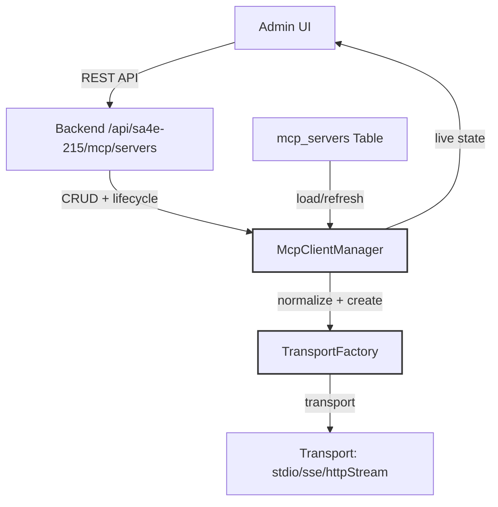

# Functional Specification Document (FSD)

## MCP Server Integration — SA4E-257: Wire DB-backed MCP server config (mcp_servers) to McpClientManager so configured servers actually connect

---

## Document Information

| Field | Value |
|-------|-------|
| Jira Ticket | SA4E-257 |
| Title | Wire DB-backed MCP server config (mcp_servers) to McpClientManager so configured servers actually connect |
| Author | BA Agent + TA Agent |
| Version | 1.0 |
| Date | 2026-09-09 |
| Status | Draft |

---

## Revision History

| Version | Date | Author | Changes |
|---------|------|--------|---------|
| 1.0 | 2026-09-09 | BA + TA Agent | Initiate document — functional spec derived from BRD.md SA4E-257 |

---

## Sign-Off

| Name | Signature and date |
|------|--------------------|
| | ☐ I agree and confirm all criteria on this FSD as expected functional requirements |
| | ☐ I agree and confirm all criteria on this FSD as expected functional requirements |

---

## 1. Overview

### 1.1 Purpose
This Functional Specification Document (FSD) translates the Business Requirements (BRD.md) into concrete functional specifications, API contracts, data models, and component interactions required to implement the ticket SA4E-257: **Wire DB-backed MCP server config (mcp_servers) to McpClientManager so configured servers actually connect**.

### 1.2 Source
- **BRD.md** — SA4E-257 Business Requirements Document (completed Phase 1)
- **Jira SA4E-257** — Full issue description (see attached)
- **Key Files** from codebase referenced throughout

### 1.3 Out of Scope (confirmed)
- Redesign of the KB tool-search index (`mcp_tools`)
- Modification of existing `orchestration.json` file format structure beyond mapping
- Changes to Admin UI layout/design beyond data source switch
- Any changes unrelated to unifying DB `mcp_servers` with `McpClientManager` lifecycle

---

## 2. Functional Requirements

### 2.1 High-Level Process Map
```
Admin UI (POST/PUT/DELETE /api/sa4e-215/mcp/servers)
    ↓ persists to DB table mcp_servers
    ↓ route handlers (backend/src/server/routes/mcp/servers.ts)
    ↓ trigger connectServer / disconnectServer / reconnectServer
    ↓ McpClientManager loads/refreshes config
    ↓ TransportFactory creates transport (stdio/sse/httpStream)
    ↓ connection established / monitored
    ↓ UI queries McpClientManager live state (isServerConnected, getServerToolCount)
    ↓ UI displays status, tools count, logs
```

### 2.2 API Contracts

#### 2.2.1 GET /api/sa4e-215/mcp/servers
- **Description**: List all MCP servers from DB
- **Query Parameters**: `?enabled=true|false`, `?transport_type=stdio|sse|streamable-http`
- **Response**: Array of `mcp_servers` rows with fields: `id`, `name`, `transport_type`, `config`, `disabled`, `created_at`, `updated_at`
- **Status Codes**: 200 (success), 500 (server error)

#### 2.2.2 POST /api/sa4e-215/mcp/servers
- **Description**: Create new MCP server config
- **Request Body**: `{ "name": "string", "transport_type": "string", "config": "json", "disabled": boolean }`
- **Validation**:
  - `name` must be unique per project (check existing rows)
  - `transport_type` must be one of: `stdio`, `sse`, `streamable-http`
  - `disabled` must be 0 or 1
- **Success**: 201 Created + trigger `connectServer()` for new server
- **Error**: 400 Validation error, 409 Duplicate name

#### 2.2.3 PUT /api/sa4e-215/mcp/servers/:id
- **Description**: Update MCP server config
- **Request Body**: Same fields as POST (partial update allowed)
- **Behavior**:
  - Compare `transport_type` and `config` changes
  - If changed → call `reconnectServer()` with new config
  - If only `disabled` toggled → call `disconnectServer()` if new value is 1, or `connectServer()` if 0
- **Success**: 200 OK
- **Error**: 400 Validation error, 404 Not found

#### 2.2.4 DELETE /api/sa4e-215/mcp/servers/:id
- **Description**: Delete MCP server config
- **Behavior**: Call `disconnectServer()` then remove DB row
- **Success**: 204 No Content
- **Error**: 404 Not found

### 2.3 Data Models

#### 2.3.1 mcp_servers Table Schema (reference)
| Column | Type | Constraints | Description |
|--------|------|-------------|-------------|
| id | INTEGER | PRIMARY KEY, AUTOINCREMENT | Primary key |
| name | TEXT | NOT NULL, UNIQUE(project_id) | Server name |
| transport_type | TEXT | NOT NULL | Must be: `stdio`, `sse`, `streamable-http` |
| config | JSON | NOT NULL | Connection configuration (URL, auth, etc.) |
| disabled | BOOLEAN | DEFAULT 0 | Enable/disable flag (0 = enabled, 1 = disabled) |
| created_at | DATETIME | DEFAULT CURRENT_TIMESTAMP | Creation timestamp |
| updated_at | DATETIME | DEFAULT CURRENT_TIMESTAMP | Last update timestamp |

#### 2.3.2 McpClientManager Interface (key methods)
| Method | Signature | Description |
|--------|-----------|-------------|
| `connectServer(config)` | `(config: ServerConfig) => Promise<ServerStatus>` | Establish connection for a server |
| `disconnectServer(id)` | `(id: number) => Promise<void>` | Gracefully disconnect server |
| `reconnectServer(id)` | `(id: number) => Promise<ServerStatus>` | Reconnect existing server with new config |
| `isServerConnected(id)` | `(id: number) => Promise<boolean>` | Check connection status |
| `getServerToolCount(id)` | `(id: number) => Promise<number>` | Get tool count from connected server |
| `listServers()` | `() => Promise<ServerConfig[]>` | List all configured servers |
| `onConnectChanged(listener)` | `(listener: (id: number, connected: boolean) => void) => void` | Subscribe to connection state changes |

#### 2.3.3 ServerConfig Type (TypeScript)
```typescript
interface ServerConfig {
  id: number;
  name: string;
  transport_type: 'stdio' | 'sse' | 'streamable-http';
  config: {
    url: string;
    [key: string]: any; // transport-specific options
  };
  disabled: boolean;
  connected?: boolean;
  tool_count?: number;
  last_connected?: string | null;
  last_error?: string | null;
}
```

### 2.4 Component Interactions

#### 2.4.1 Admin UI ↔ Backend API
- Admin UI calls REST endpoints as defined in Section 2.2
- UI state derived from `McpClientManager` live state (not DB directly)
- UI displays: status (Connected/Disconnected), tool count, connection logs

#### 2.4.2 Backend API ↔ McpClientManager
- **On startup**: `OrchestrationModule.initializeAll()` → `McpClientManager.loadFromDB()` → for each enabled row, normalize transport type and call `connectServer()`
- **On CRUD**: Route handlers call `McpClientManager.connectServer()`, `disconnectServer()`, or `reconnectServer()` respectively
- **Transport normalization**: Map `streamable-http` (UI/DB) → `httpStream` (internal) in `TransportFactory` or adapter layer

#### 2.4.3 TransportFactory
- Accept normalized transport type `httpStream`
- If incoming `streamable-http`, convert to `httpStream` before creating transport instance
- Preserve original `streamable-http` value in DB for audit purposes
- Support transports: `stdio`, `sse`, `httpStream` (normalized from `streamable-http`)

#### 2.4.4 Health Check & Auto-Reconnect
- `McpClientManager` performs health check after each connection attempt
- On failure, mark server disconnected, schedule retry per auto-reconnect policy
- Log errors to connection engine, not DB

### 2.5 Error Handling

| Scenario | Handling |
|----------|----------|
| DB query failure on startup | Log error, continue startup with warning; mark server as disconnected |
| Connection failure after create/update | Return error to UI, keep DB row with failed status; `McpClientManager` retries per auto-reconnect policy |
| Duplicate server name | Return 409 Conflict to UI |
| Invalid transport_type | Return 400 Bad Request with detail |
| Transport type mismatch (streamable-http vs httpStream) | Normalize in `TransportFactory`; log warning if mismatch detected |
| Server disappears / offline | `isServerConnected()` returns false; UI shows Disconnected; logs captured |

### 2.6 Validation Rules
- `name`: required, unique per project, max 255 characters
- `transport_type`: must be one of `stdio`, `sse`, `streamable-http`
- `config`: must be valid JSON; required fields depend on transport_type
- `disabled`: must be 0 or 1
- No duplicate servers with same `name` within same project/context

### 2.7 Non-Functional Requirements (Functional Context)
- **Startup performance**: Load and connect all enabled DB servers within 2 seconds (async init)
- **Reliability**: Connection failures isolated per server; no cascade failure
- **Scalability**: Support 100+ MCP servers with connection pooling
- **Security**: Config contains sensitive URLs; stored encrypted at rest using existing DB encryption
- **Observability**: All connection lifecycle events logged; UI queries `McpClientManager` for live state

---

## 3. Interface Specifications

### 3.1 Backend Routes (MCP Servers)
| Endpoint | Method | Description | Auth |
|----------|--------|-------------|------|
| `/api/sa4e-215/mcp/servers` | GET | List servers with optional filters | Session auth |
| `/api/sa4e-215/mcp/servers` | POST | Create new server + connect | Session auth |
| `/api/sa4e-215/mcp/servers/:id` | PUT | Update server + reconnect | Session auth |
| `/api/sa4e-215/mcp/servers/:id` | DELETE | Disconnect + delete | Session auth |

### 3.2 McpClientManager Events
| Event | Payload | When Fired |
|-------|---------|------------|
| `connectSuccess` | `{ id, name, transport }` | After successful `connectServer()` |
| `connectFailure` | `{ id, name, error }` | After failed connection attempt |
| `disconnect` | `{ id, name }` | After `disconnectServer()` |
| `reconnectSuccess` | `{ id, name }` | After `reconnectServer()` succeeds |
| `reconnectFailure` | `{ id, name, error }` | After `reconnectServer()` fails |
| `serverListLoaded` | `{ servers: ServerConfig[] }` | After `loadFromDB()` startup |

### 3.3 Frontend (Admin UI) Requirements
- Fetch server list on component mount using GET endpoint
- Subscribe to `McpClientManager` events for real-time status updates
- Display: name, transport type, status badge (Connected/Disconnected), tool count, connect/disconnect toggle
- On create/update: show loading state, display success/error toast
- On delete: confirm before disconnecting and removing

---

## 4. Diagrams

### 4.1 Sequence: MCP Server Connection Lifecycle
```
@startuml
actor Admin
participant UI
participant "Backend API /api/sa4e-215/mcp/servers" as API
participant "McpClientManager" as MCM
participant "TransportFactory" as TF
participant "DB mcp_servers" as DB

Admin -> UI: Configure MCP server
UI -> API: POST /api/sa4e-215/mcp/servers
API -> DB: INSERT mcp_servers row
API -> MCM: connectServer(config)
MCM -> TF: createTransport(normalized_type)
TF -> DB: normalize streamable-http → httpStream
TF -> actor: Establish connection (stdio/sse)
actor -> UI: Status update (Connected)
UI -> MCM: isServerConnected(id)
MCM -> UI: boolean connected
@enduml
```

### 4.2 Component Architecture: MCP Integration


---

## 5. Acceptance Criteria (Derived from Jira + BRD)

| # | Criterion | Description |
|---|-----------|-------------|
| 1 | **Startup auto-connect** | On startup, all enabled DB servers loaded; `connectServer()` called for each; status reflects live state |
| 2 | **CRUD drives lifecycle** | Create → `connectServer()`; Update → `reconnectServer()` if config changed; Delete → `disconnectServer()` |
| 3 | **Live UI status** | UI shows Connected/Disconnected from `McpClientManager.isServerConnected()`, not mock/DB values |
| 4 | **Tool count display** | `McpClientManager.getServerToolCount()` reflects actual discovered tools |
| 5 | **Transport normalization** | `streamable-http` mapped to `httpStream`; both vocabularies supported; original value preserved in DB |
| 6 | **No workaround** | Root cause unified; DB becomes single source of truth for server config driving McpClientManager |
| 7 | **Decision documented** | Architecture Decision Record created; BRD references decision on DB vs orchestration.json coexistence |

---

## 6. Dependencies

| Dependency | Type | Related Ticket | Description |
|------------|------|----------------|-------------|
| `mcp_servers` schema | Infrastructure | SA4E-215 | DB table for server config |
| `McpClientManager` | System | N/A | Connection engine (methods: connect/disconnect/reconnect/list/health) |
| `TransportFactory` | System | N/A | Creates stdio/sse/httpStream transports; normalization layer |
| `OrchestrationModule` | System | N/A | Startup wiring (`initializeAll()`) |
| Admin UI MCP Servers panel | System | SA4E-215 | Frontend CRUD panel |
| Key Files | Code | Various | See BRD.md §7 Reference Documents |

---

## 7. Risks and Assumptions (Functional Impact)

| Risk | Functional Impact | Mitigation |
|------|-------------------|------------|
| Transport mapping regression | Existing `httpStream` servers must still work | Unit tests for both vocabularies; backward-compatible mapping |
| Slow startup with many servers | Async connect; lazy initialization | Configurable concurrency; progress reporting |
| DB and orchestration.json conflict | Possible duplicate connections | Document source-of-truth decision (see §2.5 Story 5) |
| Invalid config causes connection failure | Graceful error handling; retry policy | Log errors; mark server disconnected; UI shows status |

| Assumption | Validation |
|------------|------------|
| `McpClientManager` API stable | Review existing interface; add adapters if needed |
| Admin UI update willing to call new endpoints | Coordinate with UI team; reference admin/mcp-crud.ts pattern |
| No production dependency on DB config being persistence-only | Assess current deployments; plan migration if needed |

---

## 8. Test Strategy (Pre-UAT)

### 8.1 Unit Tests
- `McpClientManager.connectServer()` success/failure scenarios
- `McpClientManager.disconnectServer()` cleanup
- `McpClientManager.reconnectServer()` with config change detection
- TransportFactory normalization: `streamable-http` → `httpStream`
- Route handler: CREATE triggers connect, UPDATE triggers reconnect, DELETE triggers disconnect

### 8.2 Integration Tests
- End-to-end: Create server via API → UI reflects connected status
- End-to-end: Update config → UI shows reconnect in progress
- End-to-end: Delete server → UI shows disconnected + removed from list
- Startup: All enabled DB servers connect on app restart

### 8.3 Manual Test Cases (for QA)
1. Start application → verify all configured DB servers appear as Connected
2. Create new server via Admin UI → verify immediate connection attempt
3. Update server transport_type → verify reconnect with new transport
4. Delete server → verify disconnect + removal from list
5. Switch transport_type from streamable-http to httpStream → verify connectivity

---

## 9. Architecture Decision Record (ADR) Placeholder

> **Decision needed**: Does the `mcp_servers` DB table replace `orchestration.json` entirely, or do they coexist?
> - **Option A**: DB replaces orchestration.json → single source of truth for all projects
> - **Option B**: Coexist → `orchestration.json` for system/default servers, DB for per-project/override
> - **Decision**: To be confirmed with Architecture team before implementation start
> - **Reference**: BRD.md §1.3 Preliminary Requirement #5 documents this open question

---

## 10. Related Documents

| Document | Location | Description |
|----------|----------|-------------|
| BRD.md | `documents/SA4E-257/BRD.md` | Business Requirements (Phase 1) |
| Jira SA4E-257 | `https://jiraassist.atlassian.net/browse/SA4E-257` | Full ticket |
| Key Files | `backend/src/server/routes/mcp/servers.ts` | DB CRUD (root cause) |
| Key Files | `backend/src/modules/orchestration/McpClientManager.ts` | Connection engine |
| Key Files | `backend/src/modules/orchestration/health/TransportFactory.ts` | Transport creation + normalization |
| Key Files | `backend/src/server/routes/admin/mcp-crud.ts` | Reference pattern for orchestration.json surface |

---