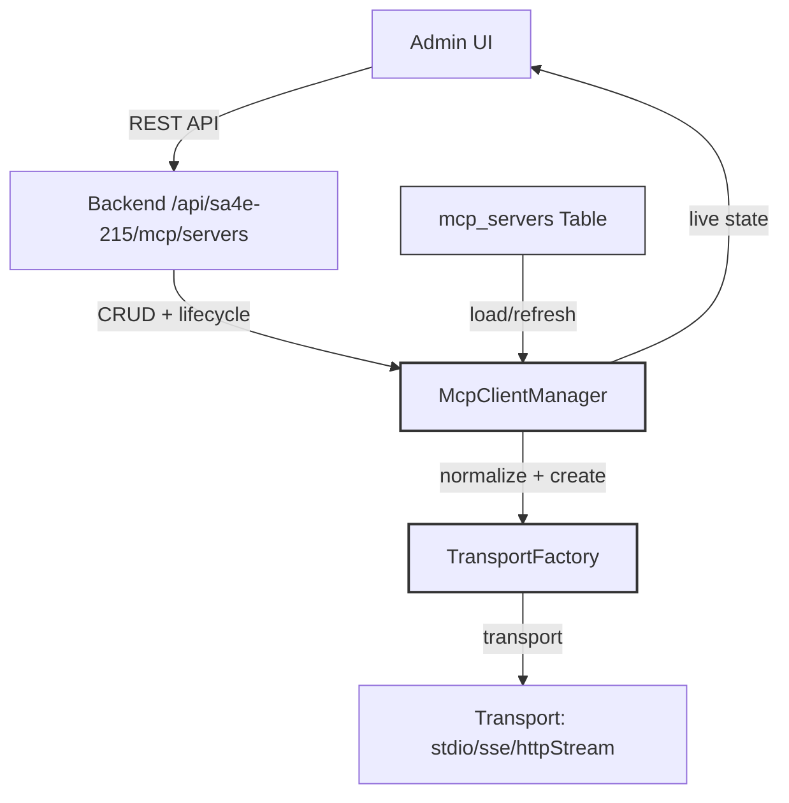

# Technical Design Document (TDD)

## MCP Server Integration — SA4E-257: Wire DB-backed MCP server config (mcp_servers) to McpClientManager so configured servers actually connect

---

## Document Information

| Field | Value |
|-------|-------|
| Jira Ticket | SA4E-257 |
| Title | Wire DB-backed MCP server config (mcp_servers) to McpClientManager so configured servers actually connect |
| Author | SA Agent |
| Version | 1.0 |
| Date | 2026-09-09 |
| Status | Draft |

---

## Revision History

| Version | Date | Author | Changes |
|---------|------|--------|---------|
| 1.0 | 2026-09-09 | SA Agent | Initiate document — technical design derived from FSD.md SA4E-257 |

---

## Sign-Off

| Name | Signature and date |
|------|--------------------|
| | ☐ I agree and confirm all criteria on this TDD as expected technical design |
| | ☐ I agree and confirm all criteria on this TDD as expected technical design |

---

## 1. Overview

### 1.1 Purpose
This Technical Design Document (TDD) provides the implementation blueprint for ticket SA4E-257, translating the Functional Specifications (FSD.md) into concrete code changes, class structures, database modifications, and integration patterns.

### 1.2 Source Documents
- **FSD.md** — Functional Specification (Phase 2)
- **BRD.md** — Business Requirements (Phase 1)
- **Jira SA4E-257** — Full issue description
- **Key Files** referenced throughout

### 1.3 Out of Scope (confirmed)
- Redesign of the KB tool-search index (`mcp_tools`)
- Modification of existing `orchestration.json` file format structure beyond mapping
- Changes to Admin UI layout/design beyond data source switch

---

## 2. System Design

### 2.1 Architectural Overview
The system will be modified so that the `mcp_servers` DB table becomes the single source of truth for MCP server configuration, driving the `McpClientManager` connection engine lifecycle.

```
+---------------------+       +----------------------+       +------------------+
|   Admin UI (Front) | <-->  |  Backend API Routes  | <-->  | McpClientManager |
+---------------------+       +----------------------+       +------------------+
        |                             |                            |
        |  REST CRUD + lifecycle    |                          connection mgmt
        |                           |                           |
        v                           v                            v
+---------------------+       +----------------------+       +------------------+
|  DB mcp_servers     |       | TransportFactory     |       | Health Check /   |
| (single source)     |       | (normalize type)    |       | auto-reconnect   |
+---------------------+       +----------------------+       +------------------+
```

### 2.2 Key Components Modified

#### 2.2.1 `backend/src/server/routes/mcp/servers.ts`
- **Current**: Persistence-only CRUD (no lifecycle)
- **Changes**:
  - **GET /servers**: Query `mcp_servers` table; return rows + live status from `McpClientManager` (optional)
  - **POST /servers**: Insert new row → call `McpClientManager.connectServer(newConfig)`
  - **PUT /servers/:id**: Update row → compare `transport_type`/`config` → call `McpClientManager.reconnectServer(id)` if changed; toggle `disabled` → call `disconnectServer()`/`connectServer()`
  - **DELETE /servers/:id**: Call `McpClientManager.disconnectServer(id)` → delete row

- **New functions added**:
  ```typescript
  // In route handler
  import { McpClientManager } from '../modules/orchestration/McpClientManager';

  // POST create + connect
  async function createServer(req, res) { /* ... */ }

  // PUT update + lifecycle
  async function updateServer(req, res) { /* ... */ }

  // DELETE + disconnect
  async function deleteServer(req, res) { /* ... */ }
  ```

#### 2.2.2 `backend/src/modules/orchestration/McpClientManager.ts`
- **Current**: Supports `orchestration.json` servers via `initializeAll()`
- **Changes**:
  - Add `loadFromDB()` method: query `mcp_servers` where `disabled=0`; for each row, normalize transport type and call `connectServer()`
  - Modify `initializeAll()` to optionally load from DB instead of (or in addition to) `orchestration.json`
  - Add `normalizeTransportType(type: string)`: map `streamable-http` → `httpStream`; pass through other types
  - Ensure `connectServer()`, `disconnectServer()`, `reconnectServer()` methods exist and work

- **New/modified methods**:
  ```typescript
  async loadFromDB() {
    const rows = await db.mcp_servers.findAll({ where: { disabled: 0 } });
    for (const row of rows) {
      const normalized = this.normalizeTransportType(row.transport_type);
      await this.connectServer({
        id: row.id,
        name: row.name,
        transport_type: normalized,
        config: row.config,
      });
    }
  }

  normalizeTransportType(type: string): string {
    if (type === 'streamable-http') return 'httpStream';
    return type; // stdio, sse pass through
  }
  ```

#### 2.2.3 `backend/src/modules/orchestration/health/TransportFactory.ts`
- **Current**: Creates transports based on type string; recognizes `stdio`, `sse`, `httpStream`
- **Changes**:
  - Add mapping layer: if type is `streamable-http`, convert to `httpStream` before creating transport
  - Preserve original type in logs/audit

- **Modified createTransport**:
  ```typescript
  function createTransport(type: string, config: any) {
    const normalized = normalizeTransportType(type);
    // existing creation logic using normalized type
    // optionally store original type for reference
    return new Transport(normalized, config);
  }
  ```

### 2.3 Database Schema (reference - SA4E-215)
No schema changes needed; `mcp_servers` table already exists with columns:
- `id`, `name`, `transport_type`, `config` (JSON), `disabled`, `created_at`, `updated_at`

**Index considerations**: Add index on `disabled` column for startup load performance.

### 2.4 Sequence Diagram: Connection Lifecycle (Updated)
```
@startuml
actor Admin
participant UI
participant "Backend API" as API
participant "McpClientManager" as MCM
participant "TransportFactory" as TF
participant "DB mcp_servers" as DB

note right of Admin: Configure server via UI
Admin -> UI: Fill form + Save
UI -> API: POST /api/sa4e-215/mcp/servers
API -> DB: INSERT mcp_servers row
API -> MCM: connectServer(config)
MCM -> TF: createTransport(normalized_type)
TF -> TF: normalize streamable-http → httpStream
TF -> DB: (audit: original value stored)
TF -> actor: Connection established
actor -> UI: Status update Connected
UI -> MCM: isServerConnected(id)
MCM -> UI: true

note right of Admin: Update server config
Admin -> UI: Modify transport_type
UI -> API: PUT /api/sa4e-215/mcp/servers/:id
API -> DB: UPDATE mcp_servers row
API -> MCM: reconnectServer(id)
MCM -> TF: createTransport(new_type)
TF -> TF: normalize if needed
TF -> MCM: disconnect old transport
TF -> TF: create new transport
TF -> actor: New connection established
actor -> UI: Status update Connected (new)

note right of Admin: Delete server
Admin -> UI: Delete
UI -> API: DELETE /api/sa4e-215/mcp/servers/:id
API -> MCM: disconnectServer(id)
MCM -> TF: close transport
TF -> actor: Transport closed
actor -> UI: Status update Disconnected
API -> DB: DELETE mcp_servers row
@enduml
```

### 2.5 Error Handling Design

| Scenario | Design |
|----------|--------|
| DB query failure (startup) | Log error via `winston`; continue startup; mark server as disconnected in UI; do not fail process |
| Connection failure after create | `McpClientManager` retries per auto-reconnect policy (exponential backoff); log error; UI shows failed status |
| Invalid transport_type in DB | Route handler returns 400; log warning; do not persist invalid type |
| TransportFactory normalization mismatch | Log warning; fallback to original type; ensure both `streamable-http` and `httpStream` work |
| Duplicate server name | Route handler returns 409 Conflict; UI shows error toast |
| Server goes offline during operation | `isServerConnected()` returns false; UI shows Disconnected; logs captured; retry per policy |

### 2.6 Migration Strategy (ADR Decision Placeholder)
> **Decision needed**: Does `mcp_servers` DB table replace `orchestration.json` entirely or coexist?
> - **Option A**: DB replaces → all servers configured via DB; `orchestration.json` deprecated
> - **Option B**: Coexist → `orchestration.json` for system/default servers; DB for per-project/override
> - **Decision**: To be confirmed with Architecture team before implementation (see FSD.md §9 ADR Placeholder)
> - **If Option A**: `initializeAll()` → `loadFromDB()` only; remove orchestration.json loading
> - **If Option B**: `initializeAll()` → both `loadFromDB()` and load `orchestration.json`; deduplicate connections

---

## 3. API Contract Details (Expanded from FSD)

### 3.1 GET /api/sa4e-215/mcp/servers
- **Query Parameters**:
  - `enabled=true` (alias for `disabled=0`) or `enabled=false` (`disabled=1`)
  - `transport_type=stdio|sse|streamable-http`
- **Success Response (200)**:
  ```json
  [
    {
      "id": 1,
      "name": "my-server",
      "transport_type": "streamable-http",
      "config": {"url": "http://mcp:8080"},
      "disabled": 0,
      "connected": true,
      "tool_count": 5,
      "created_at": "2026-09-09T10:30:00Z",
      "updated_at": "2026-09-09T10:30:00Z"
    }
  ]
  ```
- **Fields `connected` and `tool_count`** derived from `McpClientManager` live state (not DB)

### 3.2 POST /api/sa4e-215/mcp/servers
- **Request Body**:
  ```json
  {
    "name": "new-mcp-server",
    "transport_type": "streamable-http",
    "config": {"url": "http://new-server:9000"},
    "disabled": 0
  }
  ```
- **Validation**: name uniqueness, transport_type enum, config JSON validity
- **Success**: 201 + row inserted + `connectServer()` called; response includes server id + immediate status

### 3.3 PUT /api/sa4e-215/mcp/servers/:id
- **Request Body** (partial update allowed):
  ```json
  {
    "transport_type": "sse",
    "config": {"url": "http://updated:8080/sse"}
  }
  ```
- **Behavior**:
  - Update DB row
  - If `transport_type` or `config` changed → `reconnectServer(id)`
  - If only `disabled` toggled → appropriate connect/disconnect
- **Success**: 200 OK

### 3.4 DELETE /api/sa4e-215/mcp/servers/:id
- **Behavior**: `disconnectServer(id)` → delete DB row
- **Success**: 204 No Content

---

## 4. Class/Interface Design (Key Types)

### 4.1 ServerConfig (TypeScript)
```typescript
interface ServerConfig {
  id: number;
  name: string;
  transport_type: 'stdio' | 'sse' | 'streamable-http';
  config: {
    url: string;
    [key: string]: any;
  };
  disabled: boolean;
  connected?: boolean;
  tool_count?: number;
  last_connected?: string | null;
  last_error?: string | null;
}
```

### 4.2 McpClientManager (Core Methods Signature)
```typescript
class McpClientManager {
  async connectServer(config: ServerConfig): Promise<ServerStatus>;
  async disconnectServer(id: number): Promise<void>;
  async reconnectServer(id: number): Promise<ServerStatus>;
  isServerConnected(id: number): Promise<boolean>;
  getServerToolCount(id: number): Promise<number>;
  listServers(): Promise<ServerConfig[]>;
  onConnectChanged(listener: (id: number, connected: boolean) => void): void;
  async loadFromDB(): Promise<void>; // NEW: load from mcp_servers
  normalizeTransportType(type: string): string; // NEW: map streamable-http → httpStream
}
```

### 4.3 TransportFactory (Modified)
```typescript
class TransportFactory {
  createTransport(type: string, config: any): Transport {
    const normalized = this.normalizeTransportType(type);
    // existing creation logic
    return new Transport(normalized, config);
  }

  normalizeTransportType(type: string): string {
    if (type === 'streamable-http') return 'httpStream';
    return type;
  }
}
```

---

## 5. Diagram: Component Architecture (Updated)


---

## 5. Test Design (Pre-Implementation)

### 5.1 Unit Tests (Jest)
- `McpClientManager.loadFromDB()`: mock DB rows; verify `connectServer()` called for each enabled row
- `McpClientManager.normalizeTransportType()`: verify `streamable-http` → `httpStream`; others pass through
- Route handlers: POST creates + connects; PUT updates + reconnects; DELETE disconnects + deletes
- TransportFactory normalization in isolation

### 5.2 Integration Tests (Supertest)
- End-to-end: Create server via API → UI reflects Connected status after startup
- End-to-end: Update transport_type → UI shows reconnect in progress
- End-to-end: Delete server → UI shows Disconnected + removed from list
- Startup: All enabled DB servers connect on app restart (integration with actual MCM)

### 5.3 Manual Test Cases
1. Start application → verify all configured DB servers appear as Connected
2. Create new server via Admin UI → verify immediate connection attempt + status update
3. Update server transport_type → verify reconnect without restart
4. Delete server → verify disconnect + removal from list
5. Switch transport_type from streamable-http to httpStream → verify connectivity preserved
6. Disable server (disabled=1) → verify UI shows Disconnected

---

## 6. Risks and Assumptions (Technical Impact)

| Risk | Technical Impact | Mitigation |
|------|------------------|------------|
| Transport mapping regression | Existing `httpStream` servers must still work after `streamable-http` addition | Unit tests for both vocabularies; backward-compatible mapping in TransportFactory |
| Startup load performance | Loading many servers synchronously could block app init | `loadFromDB()` called async; configurable concurrency; lazy connect option |
| DB and orchestration.json conflict | Possible duplicate connections if both sources active | Document source-of-truth decision (see ADR placeholder); deduplication logic if co-existing |
| DB schema evolution | Future columns may need adding | Design with flexible JSON config; add migrations if schema changes needed |

| Assumption | Validation |
|------------|------------|
| `McpClientManager` API supports required methods | Review existing interface; add adapters if needed |
| DB `mcp_servers` table schema stable | Reference SA4E-215 schema; no changes needed initially |
| Admin UI willing to call new lifecycle endpoints | Coordinate with UI team; reference admin/mcp-crud.ts pattern |
| No existing production dependency on DB config being persistence-only | Assess current deployments; plan migration if needed |

---

## 7. Implementation Phasing (Optional for Large Rollout)

| Phase | Description | Risk |
|-------|-------------|------|
| **Phase 1** | Add `loadFromDB()` + `normalizeTransportType()` to McpClientManager; update TransportFactory; basic CRUD + lifecycle in routes (no UI changes yet) | Low |
| **Phase 2** | Wire Admin UI to new endpoints; update UI to query live McpClientManager state | Medium |
| **Phase 3** | Decision on DB vs orchestration.json coexistence; migrate existing configs if needed | High |
| **Phase 4** | Performance optimization; connection pooling; monitoring/dashboards | Low |

---

## 8. Related Documents

| Document | Location | Description |
|----------|----------|-------------|
| FSD.md | `documents/SA4E-257/FSD.md` | Functional Specification (Phase 2) |
| BRD.md | `documents/SA4E-257/BRD.md` | Business Requirements (Phase 1) |
| Jira SA4E-257 | `https://jiraassist.atlassian.net/browse/SA4E-257` | Full ticket |
| Key Files | `backend/src/server/routes/mcp/servers.ts` | DB CRUD (root cause) |
| Key Files | `backend/src/modules/orchestration/McpClientManager.ts` | Connection engine |
| Key Files | `backend/src/modules/orchestration/health/TransportFactory.ts` | Transport creation + normalization |
| Key Files | `backend/src/server/routes/admin/mcp-crud.ts` | Reference pattern for orchestration.json surface |

---