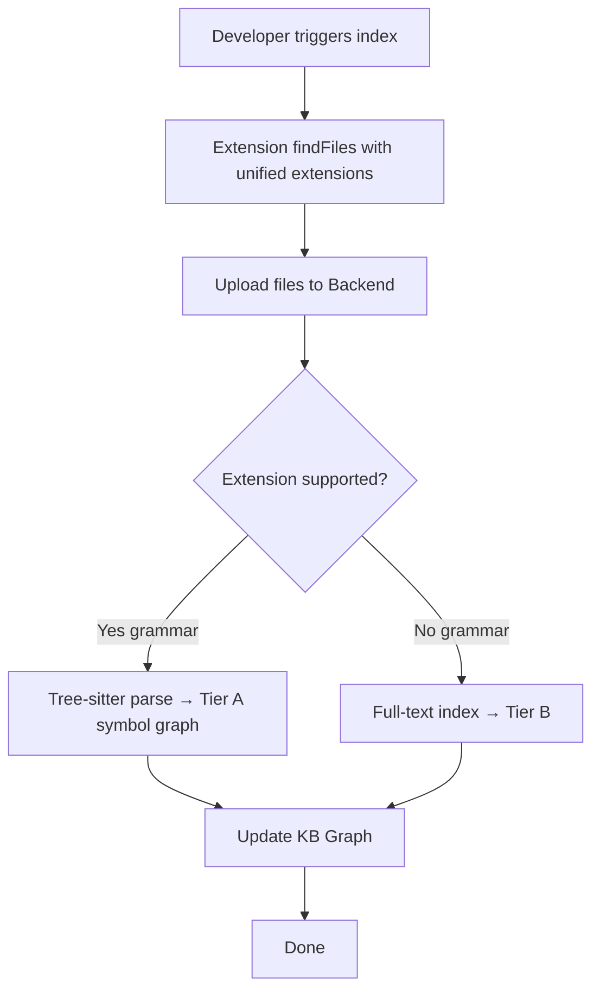
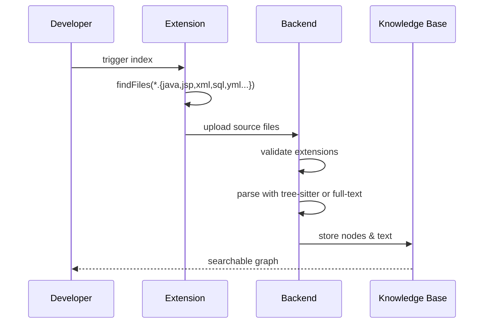
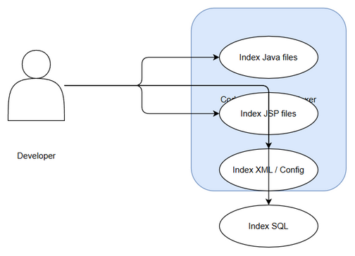
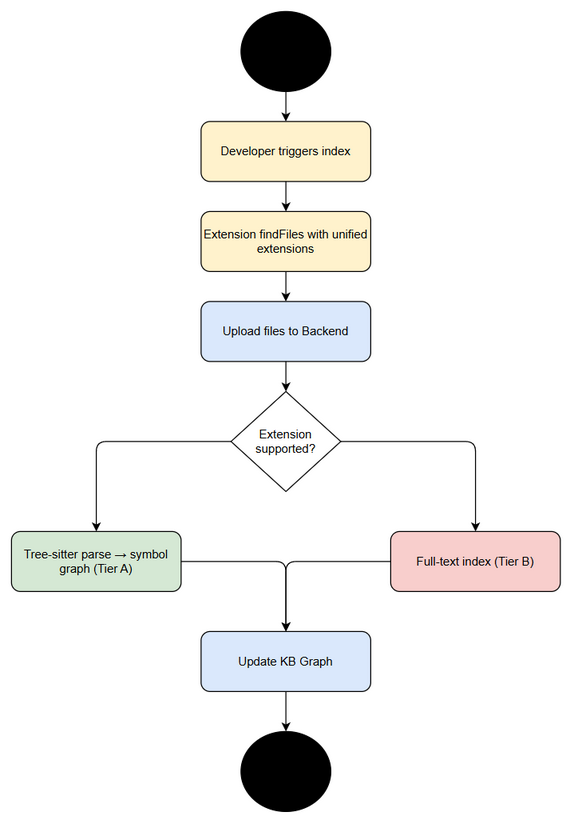

# Business Requirements Document (BRD)

## Code Intelligence Indexer — SA4E-261: Indexer skips non-Java source files (JSP/XML/SQL/config) - index all supported source artifacts

---

## Document Information

| Field | Value |
|-------|-------|
| Jira Ticket | SA4E-261 |
| Title | Indexer skips non-Java source files (JSP/XML/SQL/config) - index all supported source artifacts |
| Author | BA Agent |
| Version | 1.0 |
| Date | 2026-09-11 |
| Status | Draft |

---

## Author Tracking

| Role | Name - Position | Responsibility |
|------|-----------------|----------------|
| Author | BA Agent – Business Analyst | Create document |
| Peer Reviewer | — | Review document |

---

## Revision History

| Version | Date | Author | Changes |
|---------|------|--------|---------|
| 1.0 | 2026-09-11 | BA Agent | Initiate document — auto-generated from Jira ticket SA4E-261 and linked tickets |

---

## Sign-Off

| Name | Signature and date |
|------|--------------------|
| | ☐ I agree and confirm all criteria on this BRD as expected requirements |
| | ☐ I agree and confirm all criteria on this BRD as expected requirements |

---

## 1. Introduction

### 1.1 Scope

The Code Intelligence indexer currently indexes only a limited set of source file extensions, primarily *.java in Java/Spring Boot projects. Non-Java source artifacts essential to application understanding are silently skipped: *.jsp (views), *.xml (pom.xml, Spring/Hibernate config), *.sql, *.properties/*.yml, *.html/*.css/*.js under webapp/. This undermines the product goal of providing comprehensive application understanding and knowledge graph completeness.

Scope includes:
- Align extension whitelist between extension file selection and backend supported-extension list to a single source of truth.
- Extend indexing to Tier A (symbol graph via tree-sitter) for grammar-backed languages and Tier B (full-text search, no symbol graph) for JSP/XML/SQL/properties/yml/html/css.
- Ensure files without tree-sitter grammar are at least full-text searchable in KB.
- Enforce unified supported-extension contract test-guarded.

### 1.2 Out of Scope

- Full JSP-aware semantic parser in this phase; initial handling is reference extraction / full-text. Advanced JSP parsing may be follow-up.
- Changing core tree-sitter grammar integrations beyond enabling upload/acceptance.
- UI changes beyond indexer behavior.
- To be confirmed with stakeholders: performance impact thresholds for large XML/SQL files.

### 1.3 Preliminary Requirement

- Access to extension source `extension/src/services/IndexerHttpClient.ts` and backend resolver `backend/src/engine/indexer/project-type/resolver.ts`.
- Reproducible sample project e-commerce-project-springBoot (projectId 97c72f0c2366) available for validation.
- No additional preliminary requirements identified.

---

## 2. Business Requirements

### 2.1 High Level Process Map

Developers trigger workspace indexing. Extension discovers files based on glob whitelist, uploads to backend. Backend filters by supported extensions, parses with tree-sitter where grammar exists, otherwise stores full-text. KB graph is updated with code nodes and relationships.

*[Edit in draw.io](diagrams/use-case.drawio)*

*[Edit in draw.io](diagrams/business-flow.drawio)*

### 2.2 List of User Stories / Use Cases

| # | Story / Use Case / Epic | Priority | Source Ticket |
|---|-------------------------|----------|---------------|
| 1 | As a Developer, I want the indexer to pick up non-Java files (JSP/XML/SQL/config) so that the knowledge graph reflects the whole application | MUST HAVE | SA4E-261 |
| 2 | As a Developer, I want unsupported-grammar files to be full-text searchable so that I can find config/schema references quickly | SHOULD HAVE | SA4E-261 |
| 3 | As a Maintainer, I want a single source of truth for supported extensions so that extension and backend stay in sync | MUST HAVE | SA4E-261 |

---

### 2.3 Details of User Stories

---

#### Business Flow

**Step 1:** Developer initiates index via VS Code extension.

**Step 2:** Extension runs findFiles with unified extension pattern, excludes library/vendor dirs.

**Step 3:** Files uploaded to backend `/api/index/source`.

**Step 4:** Backend validates against unified supported-extension list.

**Step 5:** For grammar-backed extensions, tree-sitter parses symbols → CLASS/METHOD nodes.

**Step 6:** For non-grammar extensions, store full-text content for KB search (Tier B).

**Step 7:** KB knowledge graph updated and searchable.

> **Note:** JSP handling initially extracts references via regex/full-text; semantic JSP parsing is stretch.

---

#### STORY 1: Index non-Java source artifacts

> As a Developer, I want the indexer to pick up non-Java files (JSP/XML/SQL/config) so that the knowledge graph reflects the whole application

**Requirement Details:**

1. Extension file selection glob must include .jsp, .xml, .sql, .properties, .yml, .html, .css, .js for webapp contexts.
2. Backend supported-extension list must accept these extensions without silent drop.
3. Extension and backend lists must be identical single source of truth.

**Data Fields (if applicable):**

| Field | Type | Required | Description | Example |
|-------|------|----------|-------------|---------|
| file_path | string | Yes | Relative path of source file | `WEB-INF/views/adminHome.jsp` |
| file_extension | string | Yes | Extension without dot | `jsp` |
| content | text | Yes | File content for indexing | — |

**Acceptance Criteria:**

1. Given a Java/Spring Boot project, when I index the workspace, then .jsp/.xml/.sql/.properties/.yml are picked up by the extension AND accepted by the backend (no silent drop). Source: SA4E-261
2. Given supported files without a tree-sitter grammar, when indexed, then they are at least full-text searchable in the KB (Tier B). Source: SA4E-261
3. Given the supported-extension list, when compared between extension and backend, then they are identical (single source of truth), enforced by a test. Source: SA4E-261

**UI Specifications (if applicable):**

N/A

**Validation Rules (if applicable):**

- File extension must be in unified supported list.
- Upload size limit per file enforced by backend.

**Error Handling (if applicable):**

- Unsupported extension: file rejected with log entry.
- Parse error: file stored as full-text only.

---

#### STORY 2: Full-text indexing for non-grammar files

> As a Developer, I want unsupported-grammar files to be full-text searchable so that I can find config/schema references quickly

**Requirement Details:**

1. Files without tree-sitter grammar are indexed as content for KB search.
2. Search results include file path and snippet.

**Acceptance Criteria:**

1. Search for a string in pom.xml returns matching file in KB search results. Source: SA4E-261

---

#### STORY 3: Unified extension contract

> As a Maintainer, I want a single source of truth for supported extensions so that extension and backend stay in sync

**Requirement Details:**

1. Define shared constant for supported extensions.
2. Test guards extension glob vs backend list.

**Acceptance Criteria:**

1. Test fails if extension glob and backend FALLBACK_EXTENSIONS diverge. Source: SA4E-261

---

## 3. Dependencies

| Dependency | Type | Related Ticket | Description |
|------------|------|----------------|-------------|
| Extension File Selector | System | SA4E-261 | uploadSourceFiles glob pattern must be updated |
| Backend Resolver | System | SA4E-261 | FALLBACK_EXTENSIONS must be extended |
| Tree-sitter Grammars | Infrastructure | N/A | Determines Tier A vs Tier B capability |
| Sample Project | External | N/A | e-commerce-project-springBoot for validation |

---

## 4. Stakeholders

| Role | Name / Team | Responsibility | Source |
|------|-------------|----------------|--------|
| Reporter | Duc Nguyen Minh | Reported issue | SA4E-261 |
| Business Analyst | BA Agent | BRD creation | — |
| Developer / Maintainer | — | Implement extension/backend sync | SA4E-261 |

---

## 5. Risks and Assumptions

### 5.1 Risks

| Risk | Impact | Likelihood | Mitigation |
|------|--------|------------|------------|
| Large XML/SQL files increase index size/time | Medium | Medium | Tier B full-text, exclude huge logs via config |
| JSP parsing complexity | Medium | Medium | Phase 1 limits to reference extraction, defer semantic parse |
| Extension/backend drift reoccurs | High | Medium | Test guard + single source constant |

### 5.2 Assumptions

- Extension and backend can share extension list via config or contract test.
- Full-text search satisfies immediate discoverability need for config files.
- No performance regression beyond acceptable thresholds.

---

## 6. Non-Functional Requirements

| Category | Requirement | Details |
|----------|-------------|---------|
| Performance | Indexing time increase < 20% for sample project | Measured on e-commerce Spring Boot |
| Security | No new data exposure | Files already accessible in workspace |
| Scalability | Support projects with 10k+ files across extensions | Batch upload with retry |
| Availability | Indexer availability unchanged | No backend downtime introduced |

> No specific non-functional requirements identified beyond above.

---

## 7. Related Tickets

| Ticket Key | Summary | Status | Type | Relationship |
|------------|---------|--------|------|--------------|
| SA4E-261 | Indexer skips non-Java source files (JSP/XML/SQL/config) - index all supported source artifacts | In Progress | Story | Main ticket |

---

## 8. Appendix

### Glossary

| Term | Definition |
|------|------------|
| Tier A | Symbol graph indexing via tree-sitter grammar |
| Tier B | Full-text content indexing without symbol graph |
| FALLBACK_EXTENSIONS | Backend default supported extension list |

### Reference Documents

| Document | Link / Location |
|----------|-----------------|
| IndexerHttpClient | extension/src/services/IndexerHttpClient.ts |
| Project Type Resolver | backend/src/engine/indexer/project-type/resolver.ts |
