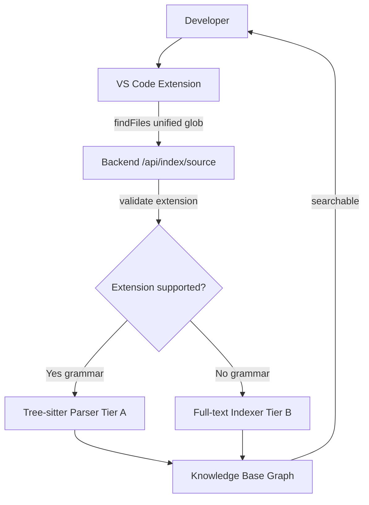
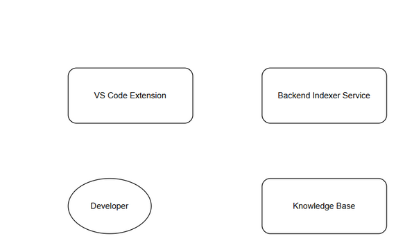
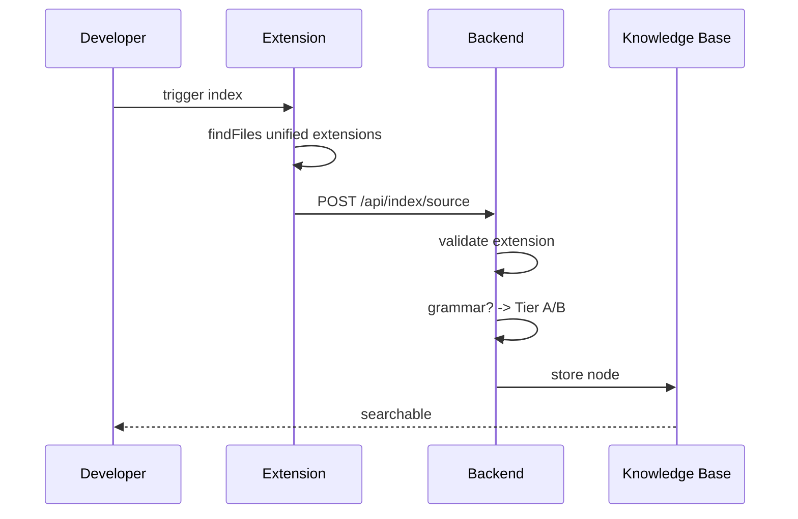
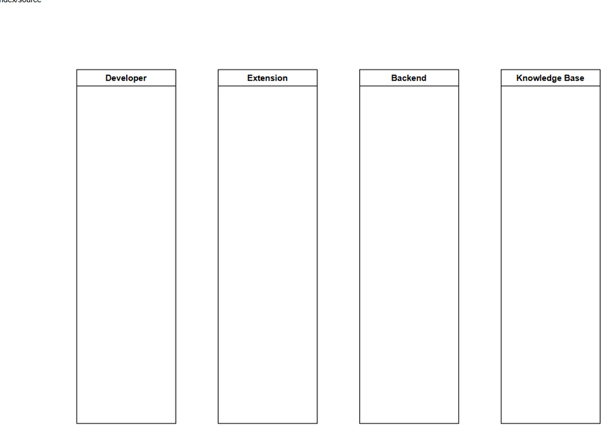

# Technical Design Document (TDD)

## SA4E-261 — Indexer skips non-Java source files (JSP/XML/SQL/config) - index all supported source artifacts

**Version:** 1.0  
**Date:** 2026-09-11  
**Author:** SA Agent  
**References:** BRD.md v1.0, FSD.md v1.0

---

## 1. Introduction
Purpose: Extend Code Intelligence indexer to handle non-Java source artifacts via unified extension whitelist, Tier A symbol graph vs Tier B full-text indexing.

Scope: Align extension whitelist between extension file selection and backend `FALLBACK_EXTENSIONS`. Extend indexing to Tier A for grammar-backed languages, Tier B for JSP/XML/SQL/properties/yml/html/css. Ensure single source of truth contract test.

## 2. Architecture
High-level components:
- VS Code Extension: file discovery via unified glob, upload to Backend `/api/index/source`
- Backend Indexer Service: validates extensions, routes to Tree-sitter parser or full-text indexer
- Knowledge Base: stores code nodes for Tier A and full-text documents for Tier B
- Indexer Contract Test: guards extension/backend sync

**Architecture diagram:**   
*[Edit in draw.io](diagrams/component.drawio)*

## 3. Components
### 3.1 Extension
- `extension/src/services/IndexerHttpClient.ts` — `uploadSourceFiles` uses `vscode.workspace.findFiles` with unified extension pattern. Currently hardcoded `**/*.{ts,tsx,kt,java,py,go,rs}`. Change to unified list.
- File discovery excludes `**/{node_modules,dist,.git,build,out,.opencode,vendor,packages,bower_components,.kilo,scratch,.code-intel,.analysis}/**`
- Batch upload size 20 files, 500ms delay, retry with exponential backoff.

### 3.2 Backend
- `backend/src/engine/indexer/project-type/resolver.ts` — `FALLBACK_EXTENSIONS` constant. Currently `.ts,.tsx,.js,.jsx,.kt,.java,.py,.go,.rs,.c,.cpp,.h,.hpp,.cs,.php,.rb,.scala,.swift,.cls,.trigger,.apex,.soql,.page,.component,.cmp,.app,.evt,.intf,.tokens,.pega,.html`
- `IndexingStrategyResolver.getFallback()` returns includeExtensions from FALLBACK_EXTENSIONS.
- API `POST /api/index/source` validates extension against unified list, writes temp, returns written/rejected.
- Auth: JWT `Authorization: Bearer`, `X-Project-Id` mandatory, `requireAuth` middleware.

### 3.3 Knowledge Base
- SQLite better-sqlite3 for metadata, MCP `mem_ingest` for Tier B full-text.
- Tier A nodes: CLASS/METHOD symbol graph via tree-sitter.
- Tier B nodes: full-text content with path, searchable via BM25.

## 4. Design Decisions
- **Single source of truth**: Unified extension list defined as shared constant; contract test fails if extension glob diverges from backend FALLBACK_EXTENSIONS.
- **Tier A/B strategy**: Grammar-backed → tree-sitter parse; non-grammar → full-text store. Parse error fallback to Tier B.
- **No semantic JSP parser**: Phase 1 limits to reference extraction via regex/full-text.
- **Batching & backpressure**: 20 files/batch, 500ms delay, concurrency limit 3 requests, 429 Retry-After.
- **Path safety**: Validate `file_path` no `..` traversal, reject with log.

## 5. Class / Sequence Diagrams Description
**Component Diagram**: Extension → Backend → KB. Extension discovers files, uploads; Backend validates & routes; KB stores.

**Sequence Upload**:
1. Developer triggers index
2. Extension findFiles with unified extensions
3. Extension POST files to `/api/index/source`
4. Backend validates extension
5. Backend checks grammar existence
6. Backend stores Tier A or Tier B
7. KB updated and searchable

**Sequence diagram:**   
*[Edit in draw.io](diagrams/sequence-upload.drawio)*

## 6. Data Model
Logical entity IndexedFile:
- file_path string Y
- file_extension string Y BR-02
- content text Y
- tier enum Y A/B
- project_id string Y

Physical storage:
- Backend temp files: `<workspace>/.code-intel/temp/<projectId>/<path>`
- KB nodes: `knowledge_entries` table with `tier` flag
- Full-text index via MCP memory entries with tags `code,source,{extension}`

## 7. Extension Changes
- Update `uploadSourceFiles` glob pattern:
  - Non-SFDX: `**/*.{ts,tsx,js,jsx,kt,java,py,go,rs,c,cpp,h,hpp,cs,php,rb,scala,swift,cls,trigger,apex,soql,page,component,cmp,app,evt,intf,tokens,pega,html,jsp,xml,sql,properties,yml,yaml,css}`
  - SFDX: keep existing plus `**/*-meta.xml`, `**/lwc/**/*.html`
- Ensure library excludes unchanged.
- Add unified constant `UNIFIED_EXTENSIONS` imported from shared config or duplicate with contract test.
- Update progress messages to reflect new extensions.

## 8. Backend Changes
- Extend `FALLBACK_EXTENSIONS` in `resolver.ts` to include `.jsp`, `.xml`, `.sql`, `.properties`, `.yml`, `.yaml`, `.html`, `.css`, `.js` for webapp contexts.
- Ensure `.js` already present, extend with `.jsp`.
- Update `IndexingStrategyResolver.getFallback()` to use unified list.
- In `/api/index/source` handler, derive extension from path, check `UNIFIED_EXTENSIONS.includes(ext)`, reject if not.
- On parse error, fallback to full-text store: write file to temp, ingest via MCP `mem_ingest` with type CONTEXT.
- Add contract test: compare extension glob regex extraction with `FALLBACK_EXTENSIONS`.

## 9. Unified Extension List
Single source of truth:
`ts,tsx,js,jsx,kt,java,py,go,rs,c,cpp,h,hpp,cs,php,rb,scala,swift,cls,trigger,apex,soql,page,component,cmp,app,evt,intf,tokens,pega,html,jsp,xml,sql,properties,yml,yaml,css`

Extension glob and backend `FALLBACK_EXTENSIONS` must match exactly. Test guard fails on divergence.

## 10. Tier A / B Strategy
**Tier A — Symbol Graph**:
- Extensions with tree-sitter grammar: java, ts,tsx,js,jsx,py,go,rs,c,cpp,kt,cs,php,rb,scala,swift
- Process: tree-sitter parse → AST → code symbols → KB graph nodes with relationships

**Tier B — Full-text**:
- Extensions without grammar: jsp, xml, sql, properties, yml, yaml, html, css
- Process: store content + path in KB, enable BM25 search, snippet results
- Parse error fallback: Tier A file parse fails → store as Tier B full-text

Performance: Tier B indexing avoids tree-sitter CPU cost. Large files >5MB excluded via config.

## 11. E2E Test Architecture
- Framework: vitest for API, Playwright for UI (if applicable)
- Tests location: `backend/tests/e2e/`
- Shared setup: server start, DB seed, JWT generation
- For SA4E-261: E2E-API test `indexer-unified-extensions.e2e.test.ts` validates upload of .jsp/.xml/.sql files, Tier B searchability, contract test.

## 12. Monitoring & Observability
- Logs: rejected files, parse errors, Tier B fallback
- Metrics: indexing time increase <20% for sample project
- Health: `/api/index/progress` status

---
**End of TDD**
