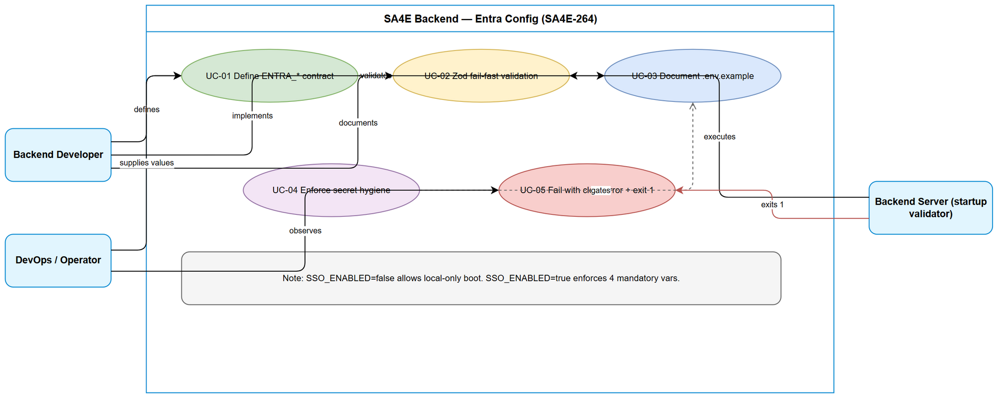
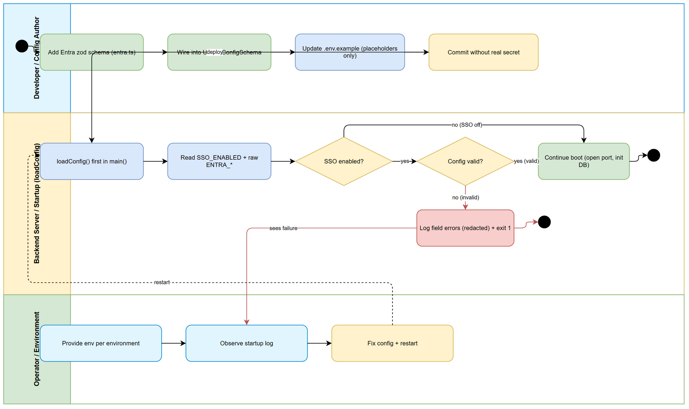

# Business Requirements Document (BRD)

## SA4E Backend — SA4E-264: [Config] Entra ID Configuration + env + validation

---

## Document Information

| Field | Value |
|-------|-------|
| Jira Ticket | SA4E-264 |
| Title | [Config] Cấu hình Entra ID + env + validation |
| Epic | SA4E-262 — [SSO] Tích hợp Microsoft Entra ID (OIDC + PKCE) với JIT provisioning, giữ local account song song |
| Author | BA Agent |
| Version | 1.0 |
| Date | 2026-09-14 |
| Status | Draft |
| Labels | sso, entra-id, backend, config |
| Type | Task |
| Priority | Medium |
| Jira Status at capture | In Progress |

---

## Author Tracking

| Role | Name - Position | Responsibility |
|------|-----------------|----------------|
| Author | BA Agent – Business Analyst | Create document from Jira SA4E-264 + Epic SA4E-262 + PROPOSED-TICKETS.md S1 + codebase evidence |
| Peer Reviewer | SA / DEV Lead – Solution Review | Review config contract, zod fail-fast approach, secret hygiene |
| Product Owner | Duc Nguyen Minh – Reporter | Confirm scope Wave 1 platform, no real secret committed |

---

## Revision History

| Version | Date | Author | Changes |
|---------|------|--------|---------|
| 1.0 | 2026-09-14 | BA Agent | Initiate document — from Jira SA4E-264, Epic SA4E-262, PROPOSED-TICKETS.md S1, backend/.env.example, backend/src/config/index.ts, backend/src/index.ts |

---

## Sign-Off

| Name | Signature and date |
|------|--------------------|
| Product Owner | ☐ I agree and confirm all criteria on this BRD as expected requirements |
| Tech Lead | ☐ I agree and confirm all criteria on this BRD as expected requirements |

---

## 1. Introduction

### 1.1 Scope

SA4E-264 (S1) is the Wave 1 platform foundation for the SSO Entra ID epic (SA4E-262). It introduces the complete Entra ID environment-variable contract for the backend, a zod-based fail-fast validation layer at startup, and documentation in `backend/.env.example`.

In scope:

1. Define 8 Entra variables: `ENTRA_TENANT_ID`, `ENTRA_CLIENT_ID`, `ENTRA_CLIENT_SECRET`, `ENTRA_REDIRECT_URI`, `ENTRA_AUTHORITY`, `ENTRA_ISSUER`, `ENTRA_JWKS_URI`, `ENTRA_SCOPES` (default `openid profile email offline_access`), plus an explicit SSO enable flag (`SSO_ENABLED`, default `false`) that gates whether Entra config is mandatory.
2. Implement a zod schema covering the full Entra env surface with precise format rules (GUID, HTTPS URL, redirect URI, scopes) and fail-fast behavior: when SSO is enabled and required config is missing or invalid, the backend must refuse to boot with a clear, actionable error and non-zero exit.
3. Update `backend/.env.example` with a dedicated Entra section using placeholder values only. No real secret is committed to the repo at any time.
4. Establish secret-hygiene rules enforced by `scripts/check-secrets.sh`: placeholders in example files, real values only via local `.env` (untracked) or secret manager per environment.

Source evidence: Jira SA4E-264 description and Acceptance Criteria; Epic SA4E-262 description; `documents/SA4E-SSO-Entra/PROPOSED-TICKETS.md` Section S1; `backend/.env.example` (no Entra section exists today); `backend/src/config/index.ts` (`UnifiedConfigSchema.parse`, zod 3.23.0); `backend/src/index.ts` (`main().catch` logs fatal and `process.exit(1)`); `code_search ENTRA` returns zero hits confirming greenfield.

### 1.2 Out of Scope

- Token verification (RS256 + JWKS + discovery) — belongs to SA4E-266 (S3). S1 only defines the config values that S3 will consume.
- OAuth2 Authorization Code + PKCE callback endpoints — belongs to SA4E-267 (S4).
- Database migration (`account_type`, `external_subject_id`) — belongs to SA4E-265 (S2, runs in parallel).
- JIT provisioning, account linking policy, unified UserRepository — SA4E-268 (S5) and SA4E-269 (S6).
- Extension PKCE wiring, Sign-in UI, security hardening checklist, STP/STC, full auth-sso docs — SA4E-270, SA4E-272, SA4E-273, SA4E-274, SA4E-275.
- Entra App Registration runbook and per-environment secret-store wiring — SA4E-271 (S12) consumes the S1 contract but owns the runbook.
- No change to existing local email/password login behavior in this ticket.

### 1.3 Preliminary Requirement

- Backend stack confirmed: TypeScript + Node 22, zod `^3.23.0` (backend/package.json), unified config entry `backend/src/config/index.ts` with `loadConfig()` called first in `backend/src/index.ts` `main()`.
- `backend/.env.example` is the canonical env template; `scripts/check-secrets.sh` exists and must keep passing.
- Epic SA4E-262 is In Progress; SA4E-264 is In Progress (Wave 1 kickoff comment 2026-09-14, parallel with S2 SA4E-265).
- No `ENTRA_*` variables exist in code today (verified by repository search) — S1 defines them for the first time.

---
## 2. Business Requirements

### 2.1 High Level Process Map

The S1 flow is a configuration lifecycle, not an end-user login flow. A developer declares the Entra contract in code and docs; an operator supplies values per environment; the backend validates fail-fast at startup before any module, DB adapter, or HTTP listener starts.

The authoritative startup order is: read raw env → determine `SSO_ENABLED` → if disabled, boot without requiring Entra values → if enabled, zod-validate the full Entra schema → on success continue boot → on failure log a field-level error (without printing secrets) and exit non-zero.

*[Edit in draw.io](diagrams/use-case.drawio)*

*[Edit in draw.io](diagrams/business-flow.drawio)*

The two diagrams above are the normative visuals for this BRD. The use-case diagram shows who owns each config responsibility. The swimlane business-flow diagram shows the startup validation path including the SSO-enabled gate and the fail-fast exit.

### 2.2 List of User Stories / Use Cases

| # | Story / Use Case / Epic | Priority | Source Ticket |
|---|-------------------------|----------|---------------|
| US-01 | As a backend developer, I want a complete ENTRA_* env contract with explicit types and defaults so that all downstream SSO work consumes one source of truth | MUST HAVE | SA4E-264 |
| US-02 | As a backend operator, I want the server to fail fast with a clear error when SSO is enabled but Entra config is missing or invalid so that misconfiguration is caught at startup instead of at login time | MUST HAVE | SA4E-264 |
| US-03 | As a DevOps engineer, I want the full Entra contract documented in backend/.env.example with safe placeholders and secret-hygiene rules so that no real secret is ever committed | MUST HAVE | SA4E-264 |

Traceability: US-01 covers Jira AC item 2 (zod schema for full Entra env, partially) plus description items (8 variables + default scopes). US-02 covers Jira AC item 1 (startup fails clearly when required config missing while SSO on). US-03 covers Jira AC item 3 (document in .env.example) plus the hard constraint KHONG commit secret that.

---

### 2.3 Details of User Stories

---

#### Business Flow

**Step 1:** Developer adds the Entra zod schema (new module, for example `backend/src/config/entra.ts`) and wires it into `UnifiedConfigSchema` in `backend/src/config/index.ts`.

**Step 2:** Developer adds the Entra section to `backend/.env.example` with placeholder values only (for example `<your-tenant-id>`, empty secret).

**Step 3:** Operator copies `.env.example` to local `.env` (untracked) or injects values via environment / secret manager per environment (dev, staging, prod). Real `ENTRA_CLIENT_SECRET` never enters git.

**Step 4:** On process start, `backend/src/index.ts` `main()` calls `loadConfig()` as the first statement before logger setup, DB adapters, and module registry.

**Step 5:** `loadConfig()` reads `SSO_ENABLED`. If `false` or unset (default `false`), Entra fields stay optional and boot continues for local-only operation.

**Step 6:** If `SSO_ENABLED=true`, the Entra schema becomes required. Zod parses and coerces (scopes string to list), checks formats (GUID, URL, redirect URI), and derives defaults (`ENTRA_AUTHORITY`, `ENTRA_ISSUER`, `ENTRA_JWKS_URI`, `ENTRA_SCOPES`) when an explicit value is absent but derivable from tenant.

**Step 7a (success):** Parsed config is returned; startup continues; effective non-sensitive values are logged at debug level (tenant id, authority, issuer, scopes) without secrets.

**Step 7b (failure):** Zod throws; the startup wrapper catches, logs each field error with expected format and remediation hint while redacting secret values, then exits with code 1. No HTTP port is opened and no DB migration runs.

> **Note:** Derivation must never mask an explicit mismatch. If the operator provides an explicit `ENTRA_ISSUER` that does not match the tenant-derived issuer, validation fails rather than silently overwriting. Secrets are never printed in full, even in error output.

---

#### STORY US-01: Define the complete ENTRA_* env contract

> As a backend developer, I want a complete ENTRA_* env contract with explicit types and defaults so that all downstream SSO work consumes one source of truth

**Requirement Details:**

1. Introduce 8 Entra variables plus one gating flag. Exact names are fixed by SA4E-264 and must not be renamed without an Epic-level decision: `ENTRA_TENANT_ID`, `ENTRA_CLIENT_ID`, `ENTRA_CLIENT_SECRET`, `ENTRA_REDIRECT_URI`, `ENTRA_AUTHORITY`, `ENTRA_ISSUER`, `ENTRA_JWKS_URI`, `ENTRA_SCOPES`, plus `SSO_ENABLED`.
2. `SSO_ENABLED` defaults to `false`. When `false`, all Entra fields are optional so existing local-only deployments keep booting unchanged. When `true`, `ENTRA_TENANT_ID`, `ENTRA_CLIENT_ID`, `ENTRA_CLIENT_SECRET`, and `ENTRA_REDIRECT_URI` are mandatory; authority, issuer, JWKS URI, and scopes fall back to deterministic defaults unless explicitly overridden.
3. Derivation rules (must be codified in zod transforms, not in ad-hoc code): `ENTRA_AUTHORITY` defaults to `https://login.microsoftonline.com/{tenantId}`; `ENTRA_ISSUER` defaults to `https://login.microsoftonline.com/{tenantId}/v2.0`; `ENTRA_JWKS_URI` defaults to `{authority}/discovery/v2.0/keys`; `ENTRA_SCOPES` defaults to `openid profile email offline_access`.
4. The schema lives alongside the unified config (extension of `UnifiedConfigSchema`), reuses the existing `envBool` / trim helpers pattern, and exports a typed `EntraConfig` for S3/S4 consumers. No other module reads `process.env.ENTRA_*` directly.
5. `code_search ENTRA` is empty today; after S1 the only writers of the contract are the new schema file and `backend/src/config/index.ts`. Any future direct `process.env` read of Entra vars outside the config layer is a violation.

**Data Fields:**

| Field | Type | Required | Description | Example |
|-------|------|----------|-------------|---------|
| SSO_ENABLED | boolean (env string `true`/`1`/`false`/`0`) | No (default `false`) | Master gate. When `true`, Entra required fields are enforced | `true` |
| ENTRA_TENANT_ID | string (GUID or `common`/`organizations`/`consumers` for multi-tenant) | Yes when SSO on | Entra directory tenant id | `11111111-2222-3333-4444-555555555555` |
| ENTRA_CLIENT_ID | string (GUID / UUID) | Yes when SSO on | Application (client) id from Entra App Registration (S12) | `aaaaaaaa-bbbb-cccc-dddd-eeeeeeeeeeee` |
| ENTRA_CLIENT_SECRET | string (secret, min 8 chars, no logging) | Yes when SSO on | Client secret for code-to-token exchange | `<set-via-secret-manager>` (never a real value in repo) |
| ENTRA_REDIRECT_URI | string (URL, `https://` or `http://localhost` with port + path) | Yes when SSO on | OAuth2 redirect registered in Entra, must match S4/S7 loopback | `http://localhost:48721/auth/entra/callback` |
| ENTRA_AUTHORITY | string (HTTPS URL) | No (derived) | Authority base, derived from tenant if absent | `https://login.microsoftonline.com/11111111-2222-3333-4444-555555555555` |
| ENTRA_ISSUER | string (HTTPS URL) | No (derived) | Expected `iss` claim for id_token validation in S3 | `https://login.microsoftonline.com/11111111-2222-3333-4444-555555555555/v2.0` |
| ENTRA_JWKS_URI | string (HTTPS URL) | No (derived) | JWKS endpoint for RS256 verification in S3 | `https://login.microsoftonline.com/11111111-2222-3333-4444-555555555555/discovery/v2.0/keys` |
| ENTRA_SCOPES | string (space-separated) parsed to string[] | No (default `openid profile email offline_access`) | OIDC scopes requested at authorize time; `offline_access` required for refresh | `openid profile email offline_access` |

**Acceptance Criteria:**

1. All 9 names exist in the zod schema and in `.env.example` with the exact spelling above; renaming any of them fails review.
2. With `SSO_ENABLED` unset or `false`, the backend boots with zero Entra vars set (local-only regression preserved).
3. With `SSO_ENABLED=true` and all 4 mandatory vars set, derived fields populate exactly per the derivation rules and are visible on the typed config object.
4. No module outside `backend/src/config/` reads `process.env.ENTRA_*` directly (verified by code search in review).

**Validation Rules:**

- `ENTRA_TENANT_ID` must match GUID regex or be one of `common`, `organizations`, `consumers`; empty string is rejected.
- `ENTRA_CLIENT_ID` must match GUID/UUID regex.
- `ENTRA_CLIENT_SECRET` must be at least 8 characters after trim; whitespace-only is rejected; value is marked sensitive (never logged, never included in error detail beyond `***REDACTED***`).
- `ENTRA_REDIRECT_URI` must be a valid URL; scheme must be `https` except `http://localhost` and `http://127.0.0.1` with explicit port are allowed for loopback dev; must not contain fragment.
- `ENTRA_AUTHORITY`, `ENTRA_ISSUER`, `ENTRA_JWKS_URI` when provided must be valid HTTPS URLs; when derived they must embed the effective tenant id verbatim.
- `ENTRA_SCOPES` when provided must be a non-empty space-separated list; each token must match `[A-Za-z0-9._:/-]+`; if `offline_access` is missing while SSO is on, validation warns explicitly (or fails if the team chooses strict mode — decision logged in FSD/TDD phase).

**Error Handling:**

- Missing mandatory var while SSO on: fail with `Missing required Entra config: {FIELD}. Set it in environment or .env (see backend/.env.example section SA4E-264).`
- Malformed GUID/URL: fail with field name, received kind (not the secret value), expected format, and one-line fix.
- Explicit issuer/authority mismatch with tenant: fail rather than overwrite, with both values identified (tenant-derived vs explicit).

---
#### STORY US-02: Fail fast at startup when SSO config is missing or invalid

> As a backend operator, I want the server to fail fast with a clear error when SSO is enabled but Entra config is missing or invalid so that misconfiguration is caught at startup instead of at login time

**Requirement Details:**

1. Validation runs synchronously inside `loadConfig()` (which already uses `UnifiedConfigSchema.parse` and throws on failure) and `loadConfig()` remains the first call in `backend/src/index.ts` `main()`. No listener, DB adapter, or background worker starts before validation passes.
2. On zod failure while `SSO_ENABLED=true`, the process must exit non-zero (`process.exit(1)` via the existing `main().catch` path) after logging a structured, human-readable error to stderr/log. The log lists every offending field, not just the first, so the operator fixes all issues in one restart cycle.
3. Error output must be actionable for an operator who has never seen Entra: each entry states field name, problem class (missing / bad format / mismatch), expected format, and where to set it (env name + `.env.example` section reference). Secret values are redacted in all paths including `cause` chains and debug dumps.
4. When `SSO_ENABLED=false`, validation must not block boot even if Entra vars are absent or partially set. Partially-set Entra vars while SSO is off produce a warning (not an error) directing the operator to either complete the set or keep SSO off.
5. Startup latency added by this validation is negligible (pure parsing, no network calls). No JWKS fetch, no discovery HTTP, no secret-manager round trip happens in S1 validation.

**Data Fields (if applicable):**

| Field | Type | Required | Description | Example |
|-------|------|----------|-------------|---------|
| SSO_ENABLED | boolean | No | Gate evaluated before Entra strictness is applied | `true` |
| Zod error list | structured log array | N/A (output) | One entry per failed field: field, code, expected, hint | `ENTRA_CLIENT_ID: invalid_string — expected UUID` |

**Acceptance Criteria:**

1. Given `SSO_ENABLED=true` and any of the 4 mandatory vars missing, `npm run dev` / `npm start` terminates within seconds with exit code 1 and names every missing field. Verified manually and later by automated test in DEV phase.
2. Given `SSO_ENABLED=true` and a malformed value (for example `ENTRA_TENANT_ID=not-a-guid` or `ENTRA_REDIRECT_URI=ftp://x`), startup fails with a field-level message stating the expected format. No stack-only output without explanation.
3. Given `SSO_ENABLED` unset and no Entra vars, startup succeeds exactly as before S1 (no regression for local-only installs).
4. No secret material appears in stdout, log files, or error payloads in any of the above cases (reviewed by grepping output for the canary secret used in test).

**Validation Rules (if applicable):**

- Strictness is conditional on `SSO_ENABLED=true` (case-insensitive `true`/`1` means on; everything else means off, reusing the existing `envBool` semantics).
- All Entra errors are collected (zod default abort-early is disabled or errors are flattened) so the operator sees the full list.
- Exit code is 1 on config failure; port binding and `initAdapters()` are never reached.

**Error Handling (if applicable):**

- Missing config while SSO on: `FATAL [config] SSO_ENABLED=true but missing required Entra config: ENTRA_TENANT_ID, ENTRA_CLIENT_SECRET. See backend/.env.example (SA4E-264).` then `process.exit(1)`.
- Invalid format while SSO on: `FATAL [config] Invalid Entra config — ENTRA_REDIRECT_URI: must be https:// or http://localhost with port; got <redacted-kind>.` then exit 1.
- Partial config while SSO off: `WARN [config] Entra vars partially set but SSO_ENABLED=false — SSO stays disabled. Complete the set or ignore.` then continue boot.
- Any unexpected exception in the config layer follows the existing `main().catch` fatal path (log + exit 1), never a silent hang.

---

#### STORY US-03: Document the contract in .env.example with secret hygiene

> As a DevOps engineer, I want the full Entra contract documented in backend/.env.example with safe placeholders and secret-hygiene rules so that no real secret is ever committed

**Requirement Details:**

1. Append a dedicated, clearly delimited section to `backend/.env.example` (header comment with ticket id `SA4E-264`, one block per variable with purpose comment, placeholder value, and format hint). Example placeholders: `ENTRA_TENANT_ID=<your-tenant-guid>`, `ENTRA_CLIENT_ID=<your-client-id-guid>`, `ENTRA_CLIENT_SECRET=` (empty), `ENTRA_REDIRECT_URI=http://localhost:48721/auth/entra/callback`, authority/issuer/JWKS commented as auto-derived with override examples, `ENTRA_SCOPES=openid profile email offline_access`, `SSO_ENABLED=false`.
2. The section documents: which vars are required when `SSO_ENABLED=true`, which are auto-derived, allowed redirect schemes, scopes default and why `offline_access` matters for refresh (S4/S7), and where real values live (local untracked `.env`, CI secret store, per-environment values owned by S12 runbook).
3. Hard rule restated in the file header and in this BRD: never commit a real `ENTRA_CLIENT_SECRET`, tenant guid of production, or any production redirect URI tied to a secret. `scripts/check-secrets.sh` must keep passing; the section includes only synthetic/canary values.
4. The docs in `.env.example` are the single human-readable mirror of the zod schema. Any future schema change must update the example in the same commit (review checklist item).

**Data Fields (if applicable):**

| Field | Type | Required | Description | Example |
|-------|------|----------|-------------|---------|
| .env.example Entra section | documentation block | N/A | 9 commented entries with placeholders | `ENTRA_SCOPES=openid profile email offline_access` |

**Acceptance Criteria:**

1. `backend/.env.example` contains all 9 names with comments explaining required-vs-derived, format, and the `SSO_ENABLED` gate; a fresh checkout can configure SSO by copying the file to `.env` and filling 4 mandatory values.
2. No real secret exists in `.env.example` or any committed file (verified by `scripts/check-secrets.sh` passing and by reviewer grep for GUID-like production values).
3. The section header references SA4E-264 and points to the zod schema file as the source of truth, so a reader can cross-check docs against code.

**Validation Rules (if applicable):**

- Placeholder for `ENTRA_CLIENT_SECRET` is empty or an obvious token like `<set-via-env-or-secret-manager>`; any string resembling a real secret (long base64/hex without angle brackets) fails review.
- Redirect example uses loopback with the backend default port (48721) and the agreed callback path prefix, consistent with S4/S7 expectations.

**Error Handling (if applicable):**

- If `check-secrets.sh` flags the new section, the commit is blocked until placeholders are fixed; no override without Security review.
- If docs and schema drift (name missing on either side), the DEV-phase checklist treats it as a defect against S1.

---

## 3. Dependencies

| Dependency | Type | Related Ticket | Description |
|------------|------|----------------|-------------|
| None (platform base) | Infrastructure | N/A | S1 has no ticket dependency by Epic plan; it is the foundation Wave 1 runs on. Confirmed in PROPOSED-TICKETS.md S1 Depends = none and Jira issuelinks empty |
| zod ^3.23.0 | System | N/A | Already in backend/package.json; S1 extends existing UnifiedConfigSchema pattern, no new runtime dep |
| backend/src/config/index.ts + backend/src/index.ts | System | N/A | Integration points: schema extension + first-call loadConfig + main().catch exit(1) fail-fast |
| backend/.env.example + scripts/check-secrets.sh | Compliance | N/A | Doc target + secret gate that must keep passing |
| S12 Entra App Registration (consumer) | External | SA4E-271 | S12 supplies real tenant/client/secret/redirect values that must satisfy the S1 contract; S1 does not wait for S12 |
| S3/S4 JWKS + callback (consumers) | System | SA4E-266, SA4E-267 | S3 consumes authority/issuer/JWKS/scopes; S4 consumes client/secret/redirect/scopes. They depend on S1, not the reverse |

---
## 4. Stakeholders

| Role | Name / Team | Responsibility | Source |
|------|-------------|----------------|--------|
| Reporter / Product Owner | Duc Nguyen Minh | Defined S1 scope, owns Epic SA4E-262 decisions (default group, linking policy context) | Jira SA4E-264 reporter + creator |
| Backend Developer | Backend team (implementer) | Implements zod schema, wires into UnifiedConfigSchema, updates .env.example | Jira labels backend, config |
| Solution Architect | SA agent (next phase) | Turns BRD into TDD: file layout, schema composition, strict-vs-warn choices | SDLC pipeline Phase 3 |
| QA | QA agent | Verifies fail-fast matrix (missing/invalid/off), secret-redaction, .env.example completeness | Future SA4E-274 (S10) |
| DevOps / Operator | Infra team | Supplies per-env values via secret manager, owns S12 runbook alignment | Labels config, S12 SA4E-271 |
| Security reviewer | Security track | Confirms no secret in repo/logs, redirect-scheme rules, check-secrets gate | Labels entra-id, sso |

No assignee is set on SA4E-264 at capture time; watcher count is 1 (reporter).

---

## 5. Risks and Assumptions

### 5.1 Risks

| Risk | Impact | Likelihood | Mitigation |
|------|--------|------------|------------|
| Real ENTRA_CLIENT_SECRET committed to git | High | Medium | Placeholders only in .env.example; empty default for secret; check-secrets.sh gate blocks commit; BRD hard rule + review grep |
| Secret leaks into startup logs on validation failure | High | Medium | Redact secret in every error path; log field name + kind, never value; QA canary-secret test |
| Authority/issuer/JWKS derivation masks explicit mismatch | High | Low | Fail on explicit-vs-derived mismatch; never silently overwrite; unit test for mismatch case |
| Redirect URI registered in Entra does not match S1 value (loopback port/path drift) | High | Medium | Pin example to 48721 + agreed callback prefix; S4/S7 must reuse the same constant; S12 runbook cross-checks |
| Scopes missing offline_access breaks refresh later (S4/S7) | Medium | Medium | Default includes offline_access; warn-or-fail when scopes override drops it; document why in .env.example |
| Zod error output too technical for operators | Medium | Medium | Flatten errors to field + expected + fix hint; keep raw zod issue in debug only |
| SSO_ENABLED semantics unclear (truthy variants) | Medium | Low | Reuse envBool semantics; document accepted values; test true/1/false/0/unset matrix |
| Docs drift from schema over time | Medium | Medium | Same-commit rule (schema + example); reviewer checklist: every schema key appears in example |

### 5.2 Assumptions

- `SSO_ENABLED` (default `false`) is accepted as the gating flag name. If SA/TDD prefers `ENTRA_ENABLED`, the rename is Epic-level and updates schema + example + this BRD together.
- Tenant model is single-tenant GUID by default; `common`/`organizations`/`consumers` are allowed for future multi-tenant but issuer validation for those modes is owned by S3, not S1.
- No network I/O belongs in S1 validation (no discovery fetch, no JWKS download). Derivations are pure string templates.
- Local `.env` is untracked and CI injects secrets via environment or secret manager; S12 owns per-environment mechanics.
- Existing `loadConfig()`-first + `main().catch → exit(1)` pattern remains the fail-fast vehicle; no new process manager is introduced.

---

## 6. Non-Functional Requirements

| Category | Requirement | Details |
|----------|-------------|---------|
| Reliability | Fail-fast blocks misconfigured boot 100% of the time when SSO on | No partial boot, no open port, no DB init before validation passes |
| Observability | Field-level actionable errors, secrets redacted | Each failure names field, problem class, expected format, remediation; secret shown only as REDACTED |
| Security | No real secret in repo, logs, or error payloads | check-secrets.sh passes; placeholders only; redirect allows https + localhost http only |
| Performance | Validation overhead negligible | Pure zod parse, no network; target under 500 ms added to startup |
| Maintainability | Single source of truth in config layer | Only backend/src/config/* reads ENTRA_*; typed EntraConfig exported for S3/S4 |
| Compatibility | Local-only boot unchanged when SSO off | Zero mandatory Entra vars when SSO_ENABLED=false; existing deployments unaffected |
| Operability | Copy-example-to-env onboarding | Fresh checkout configures SSO by filling 4 values after copying .env.example |

No specific scalability or availability targets beyond fail-fast apply to a config-only change.

---

## 7. Related Tickets

| Ticket Key | Summary | Status | Type | Relationship |
|------------|---------|--------|------|--------------|
| SA4E-264 | [Config] Cấu hình Entra ID + env + validation | In Progress | Task | Main ticket (this BRD, S1) |
| SA4E-262 | [SSO] Tích hợp Microsoft Entra ID (OIDC + PKCE) với JIT provisioning, giữ local account song song | In Progress | Epic | Parent epic of SA4E-264 |
| SA4E-265 | [DB] Migration account type + external subject id | To Do (per backlog) | Task | Parallel Wave 1 (S2); no dependency on S1 |
| SA4E-266 | [Backend] Verify RS256 + JWKS + discovery | To Do (per backlog) | Story | Consumes S1 (depends on SA4E-264) |
| SA4E-267 | [Backend] OAuth2 Auth Code + PKCE callback | To Do (per backlog) | Story | Consumes S1 (depends on SA4E-264) |
| SA4E-271 | [Config/DevOps] Đăng ký App Entra | To Do (per backlog) | Task | Consumes S1 contract (depends on SA4E-264) |

Jira `issuelinks` on SA4E-264 is empty at capture; Epic linkage is via `parent = SA4E-262`. Dependency direction above comes from PROPOSED-TICKETS.md Section 2-3. This BRD covers S1 only; no other ticket scope is implemented here.

---

## 8. Appendix

### 8.1 Acceptance-Criteria Coverage

| Jira AC (SA4E-264) | Covered by | How verified (BRD-level) |
|--------------------|------------|--------------------------|
| (AC-1) Khoi dong fail ro rang neu thieu config bat buoc khi bat SSO | US-02 AC-1, AC-2, AC-4 | Startup matrix: SSO on + missing/invalid → exit 1 with field list; SSO off → boots |
| (AC-2) Co schema zod cho toan bo env Entra | US-01 AC-1..AC-4 + US-02 validation rules | 9-key schema with types, derivation, conditional strictness; single config-layer source |
| (AC-3) Document trong .env.example | US-03 AC-1..AC-3 | Dedicated SA4E-264 section, placeholders only, required-vs-derived comments |
| (Hard constraint) KHONG commit secret that | US-01 validation + US-02 AC-4 + US-03 + Section 6 | Empty secret placeholder, redaction in all outputs, check-secrets.sh gate |

### 8.2 Key Decisions

| # | Decision | Rationale | Impact if changed |
|---|----------|-----------|-------------------|
| D-01 | Gate name `SSO_ENABLED` default `false`; Entra required only when `true` | Preserves local-only boot (no regression) while giving operators one explicit switch; matches AC wording bat SSO | Rename requires updating schema, example, S12 runbook, S3/S4 guards together |
| D-02 | 8 Entra names fixed verbatim; no aliasing | Jira description pins exact names; downstream S3/S4/S12 already reference them | Any rename is Epic-level breaking change |
| D-03 | Authority/issuer/JWKS auto-derived from tenant, explicit value wins only if consistent else fail | Reduces operator toil for standard single-tenant while catching copy-paste tenant mismatches early | Silent-overwrite alternative rejected for hiding misconfiguration |
| D-04 | Scopes default `openid profile email offline_access`; dropping `offline_access` warns (strict-fail decided in TDD) | Refresh flow in S4/S7 needs offline_access; default keeps S1 safe without forcing exotic scopes | Changing default breaks refresh assumptions in S4/S7 |
| D-05 | No network I/O in S1 validation | Keeps startup fast, deterministic, and testable offline; discovery/JWKS fetch belongs to S3 | Adding fetch here would couple config to network flakiness |
| D-06 | Secrets redacted everywhere; .env.example secret empty | Prevents the highest-impact risk (leak) at the cheapest layer | Any full-value logging is a security defect |

### 8.3 Out-of-scope Guard (S1 only)

Any request to add token verification, callback routes, DB columns, JIT logic, extension UI, or App-registration steps in this change must be rejected and redirected to its owning ticket (S2–S12). This BRD authorizes config + validation + example docs only.

### Glossary

| Term | Definition |
|------|------------|
| Entra ID | Microsoft Entra ID (formerly Azure AD), the OIDC identity provider for SSO in Epic SA4E-262 |
| Tenant ID | Directory identifier scoping the Entra application; single-tenant GUID by default |
| OIDC | OpenID Connect, identity layer on OAuth2 used for SSO login |
| PKCE (S256) | Proof Key for Code Exchange, SHA-256 challenge method securing the authorization-code flow; wired in S4/S7, not S1 |
| JWKS | JSON Web Key Set endpoint publishing RS256 public keys for token verification (S3 consumer) |
| Fail-fast | Startup refuses to boot on invalid config with clear error + non-zero exit instead of failing later at login |
| zod | TypeScript schema-validation library (v3.23.0) already used by UnifiedConfigSchema |
| SSO_ENABLED | Master boolean gate (default false) deciding whether Entra config is mandatory |
| check-secrets.sh | Repo script blocking commits that contain real secrets |

### Reference Documents

| Document | Link / Location |
|----------|-----------------|
| Jira SA4E-264 (Task, In Progress) | https://jiraassist.atlassian.net/rest/api/2/issue/14015 (key SA4E-264) |
| Jira SA4E-262 (Epic, In Progress) | key SA4E-262, parent of SA4E-264 |
| SSO backlog S1 definition | documents/SA4E-SSO-Entra/PROPOSED-TICKETS.md — Section S1 (SA4E-264) + dependency map Section 3 |
| Current env template (pre-S1, no Entra) | backend/.env.example |
| Unified config + zod pattern | backend/src/config/index.ts (UnifiedConfigSchema.parse) |
| Startup fail-fast path | backend/src/index.ts (loadConfig first, main().catch + exit 1) |
| Sandbox zod example | backend/src/config/SandboxConfig.ts |
| Secret gate | scripts/check-secrets.sh |
| BRD template | documents/templates/BRD-TEMPLATE.md |

### Diagram Index

| # | Diagram | Image | Source (editable) |
|---|---------|-------|-------------------|
| 1 | S1 Use Case — actors and config responsibilities | [use-case.png](diagrams/use-case.png) | [use-case.drawio](diagrams/use-case.drawio) |
| 2 | S1 Business Flow — startup validation swimlane | [business-flow.png](diagrams/business-flow.png) | [business-flow.drawio](diagrams/business-flow.drawio) |

*All diagrams are draw.io only. No Mermaid is used in this document by project rule.*
