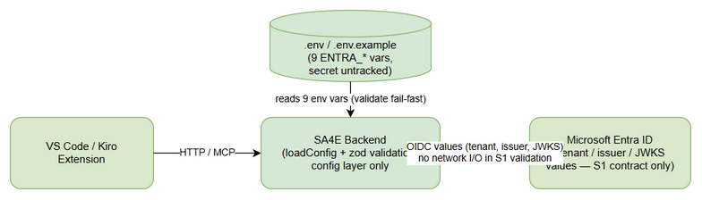
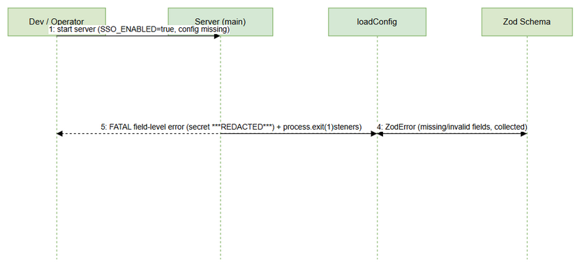
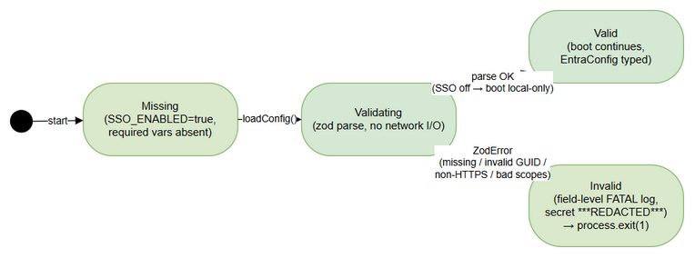

# Functional Specification Document (FSD) — Draft v1

## SA4E Backend — SA4E-264: [Config] Entra ID Configuration + env + validation

---

## Document Information

| Field | Value |
|-------|-------|
| Jira Ticket | SA4E-264 |
| Title | [Config] Cấu hình Entra ID + env + validation |
| Epic | SA4E-262 — [SSO] Tích hợp Microsoft Entra ID (OIDC + PKCE) với JIT provisioning, giữ local account song song |
| Author | BA Agent (draft) |
| Version | draft v1 — TA will enrich later (enrichment only, per role boundary) |
| Date | 2026-09-15 |
| Status | Draft |
| Source | BRD SA4E-264 v1.0 + PROPOSED-TICKETS.md S1 + backend evidence |
| Scope | S1 only — config + validation + .env.example docs. Không scope S2..S12 |

---

## 1. Introduction

SA4E-264 (S1) là nền tảng Wave 1 của Epic SSO Entra ID. Ticket này định nghĩa:
1. **Contract 8 biến ENTRA_***: `ENTRA_TENANT_ID`, `ENTRA_CLIENT_ID`, `ENTRA_CLIENT_SECRET`, `ENTRA_REDIRECT_URI`, `ENTRA_AUTHORITY`, `ENTRA_ISSUER`, `ENTRA_JWKS_URI`, `ENTRA_SCOPES` + gate flag `SSO_ENABLED` (default `false`).
2. **Zod fail-fast validation** tại startup: khi `SSO_ENABLED=true` mà thiếu/sai config → server từ chối boot, exit code 1, lỗi field-level, secret redacted.
3. **`backend/.env.example`** cập nhật section Entra với placeholder an toàn — KHÔNG commit secret thật.

Integration points (evidence từ codebase): `backend/src/config/index.ts` (`UnifiedConfigSchema.parse`, zod 3.23.0), `backend/src/index.ts` (`loadConfig()` first trong `main()`, `main().catch` → `process.exit(1)`), `scripts/check-secrets.sh`.

---

## 2. Use Cases

### UC-01: Bật SSO config đầy đủ → server start OK

| Field | Value |
|-------|-------|
| Actor | Backend Operator / Backend Process |
| Precondition | `.env` chứa đủ 4 biến bắt buộc (TENANT_ID, CLIENT_ID, CLIENT_SECRET, REDIRECT_URI), `SSO_ENABLED=true` |

| Flow | Step | Action | Expected Result |
|------|------|--------|-----------------|
| **Main** | 1 | Operator set đủ 4 biến bắt buộc vào `.env`/environment | 4 giá trị sẵn sàng, secret không vào git |
| Main | 2 | Chạy `npm run dev` / `npm start` | `main()` gọi `loadConfig()` đầu tiên |
| Main | 3 | `loadConfig()` đọc `SSO_ENABLED=true` → Entra schema required | Zod parse toàn bộ Entra surface |
| Main | 4 | Zod validate formats (GUID, URL, redirect) + derive defaults (AUTHORITY, ISSUER, JWKS_URI, SCOPES khi absent) | Parsed `EntraConfig` typed object |
| Main | 5 | Boot tiếp tục: logger, adapters, HTTP listener | Server start OK, không mở port trước khi validate |
| Main | 6 | Log debug giá trị non-sensitive (tenant, authority, issuer, scopes) | Secret KHÔNG xuất hiện trong log |

| Flow | Step | Action | Expected Result |
|------|------|--------|-----------------|
| **Alternative** | A1 | Operator override `ENTRA_ISSUER`/`ENTRA_AUTHORITY`/`ENTRA_JWKS_URI`/`ENTRA_SCOPES` | Giá trị explicit thắng nếu CONSISTENT với tenant; derived defaults bỏ qua |
| Alternative | A2 | Tenant = `common`/`organizations`/`consumers` (multi-tenant) | Tenant ID accepted; issuer validation chế độ này thuộc S3 |
| Alternative | A3 | `ENTRA_SCOPES` override thiếu `offline_access` | WARN rõ ràng (strict-fail quyết định ở TDD phase) |

| Flow | Step | Action | Expected Result |
|------|------|--------|-----------------|
| **Exception** | E1 | Explicit `ENTRA_ISSUER` KHÔNG khớp tenant-derived | Validation FAIL, không silently overwrite (ERR-04 family) |
| Exception | E2 | Secret < 8 ký tự sau trim | Validation FAIL field-level, value redacted |

### UC-02: Bật SSO thiếu config → fail-fast exit 1, field-level error, secret redacted

| Field | Value |
|-------|-------|
| Actor | Backend Operator / Backend Process |
| Precondition | `SSO_ENABLED=true`, ít nhất 1 trong 4 biến bắt buộc thiếu hoặc sai format |

| Flow | Step | Action | Expected Result |
|------|------|--------|-----------------|
| **Main** | 1 | Operator bật `SSO_ENABLED=true` nhưng thiếu config (vd chỉ set TENANT_ID) | Config ở trạng thái thiếu |
| Main | 2 | Chạy server → `main()` → `loadConfig()` | Zod parse gặp missing fields |
| Main | 3 | Zod collect TOÀN BỘ lỗi (không abort-early) | Danh sách đầy đủ mọi field lỗi, không chỉ field đầu |
| Main | 4 | Startup wrapper catch, log structured error: field name + problem class (missing/bad format) + expected format + hint nơi set | Operator tự fix trong 1 restart cycle |
| Main | 5 | Secret values redacted mọi path (kể cả cause chain, debug dump) | Chỉ hiện `***REDACTED***` |
| Main | 6 | `process.exit(1)` qua `main().catch` | Exit code 1; KHÔNG mở HTTP port, KHÔNG chạy DB init |

| Flow | Step | Action | Expected Result |
|------|------|--------|-----------------|
| **Alternative** | A1 | Thiếu nhiều biến cùng lúc (vd TENANT_ID + CLIENT_SECRET) | MỘT log liệt kê cả hai: `SSO_ENABLED=true but missing required Entra config: ENTRA_TENANT_ID, ENTRA_CLIENT_SECRET. See backend/.env.example (SA4E-264).` |
| Alternative | A2 | Sai format thay vì thiếu (vd `ENTRA_TENANT_ID=not-a-guid`) | Field-level message nêu expected format: `expected GUID` |

| Flow | Step | Action | Expected Result |
|------|------|--------|-----------------|
| **Exception** | E1 | `SSO_ENABLED` unset/false + Entra vars thiếu hoặc partial | KHÔNG block boot; WARN: `Entra vars partially set but SSO_ENABLED=false — SSO stays disabled` (nếu partial), boot tiếp local-only |
| Exception | E2 | Unexpected exception trong config layer | Theo `main().catch` fatal path (log + exit 1), không silent hang |

### UC-03: Dev đọc `.env.example` tự cấu hình

| Field | Value |
|-------|-------|
| Actor | Backend Developer / DevOps Engineer |
| Precondition | Fresh checkout, `backend/.env.example` có section Entra SA4E-264 |

| Flow | Step | Action | Expected Result |
|------|------|--------|-----------------|
| **Main** | 1 | Dev mở `backend/.env.example`, đọc section `SA4E-264` | 9 biến commented: purpose, placeholder, format hint |
| Main | 2 | Copy `.env.example` → `.env` (untracked) | Placeholder an toàn, secret để trống |
| Main | 3 | Điền 4 giá trị bắt buộc (tenant/client GUID lấy từ S12 App Registration runbook SA4E-271) | Giá trị thật chỉ tồn tại local `.env` / secret manager |
| Main | 4 | Bật `SSO_ENABLED=true`, start server | UC-01 main flow chạy, boot OK |

| Flow | Step | Action | Expected Result |
|------|------|--------|-----------------|
| **Alternative** | A1 | Dev CI/CD | Inject secrets qua environment / secret manager per environment; không file `.env` trong repo |
| Alternative | A2 | Dev muốn override derived fields | Uncomment dòng override example trong `.env.example` |

| Flow | Step | Action | Expected Result |
|------|------|--------|-----------------|
| **Exception** | E1 | Dev commit `.env` chứa secret thật | `scripts/check-secrets.sh` BLOCK commit; fix placeholder trước, không override nếu thiếu Security review |
| Exception | E2 | Schema thay đổi nhưng `.env.example` chưa cập nhật | treated như defect S1 (same-commit rule: schema + example cùng commit) |

---

## 3. Business Rules

| Rule ID | Rule | Rationale / Source |
|---------|------|--------------------|
| **BR-01** | 8 biến ENTRA_* (`ENTRA_TENANT_ID`, `ENTRA_CLIENT_ID`, `ENTRA_CLIENT_SECRET`, `ENTRA_REDIRECT_URI`, `ENTRA_AUTHORITY`, `ENTRA_ISSUER`, `ENTRA_JWKS_URI`, `ENTRA_SCOPES`) BẮT BUỘC khi `SSO_ENABLED=true` (tối thiểu 4 biến mandatory trực tiếp; AUTHORITY/ISSUER/JWKS_URI/SCOPES có derived defaults khi absent — explicit value chỉ thắng nếu consistent) | Jira SA4E-264 description pin exact names; PROPOSED-TICKETS.md S1; AC-1 |
| **BR-02** | `ENTRA_SCOPES` default `"openid profile email offline_access"`; `offline_access` cần cho refresh flow (S4/S7) | PROPOSED-TICKETS.md S1; BRD D-04 |
| **BR-03** | Secret (`ENTRA_CLIENT_SECRET`) KHÔNG commit vào repo — placeholder trống trong `.env.example`; giá trị thật chỉ qua local `.env` (untracked) hoặc secret manager; `scripts/check-secrets.sh` phải pass | Hard constraint "KHÔNG commit secret thật"; BRD D-06 |
| **BR-04** | `ENTRA_ISSUER` format `https://login.microsoftonline.com/{tenant}/v2.0` — derived từ tenant khi absent; explicit value phải khớp tenant-derived, mismatch → FAIL (không overwrite âm thầm) | BRD derivation rules + D-03; S3 consumer của `iss` claim |

Quy tắc bổ sung:
- `SSO_ENABLED` default `false`; `true`/`1` = on (case-insensitive, tái dùng `envBool`), mọi giá trị khác = off. Khi off: Entra fields optional, local-only boot không đổi.
- Chỉ `backend/src/config/*` được đọc `process.env.ENTRA_*`; module khác đọc trực tiếp = violation.
- Không network I/O trong S1 validation (no JWKS fetch, no discovery HTTP) — pure zod parse.

---

## 4. Data Specifications

### 4.1 Environment Variables (9)

| # | Name | Type | Required | Default | Validation | Example |
|---|------|------|----------|---------|------------|---------|
| 1 | `SSO_ENABLED` | boolean (env string) | No | `false` | `true`/`1` = on; khác = off (envBool) | `true` |
| 2 | `ENTRA_TENANT_ID` | string (GUID hoặc `common`/`organizations`/`consumers`) | Yes khi SSO on | — | GUID regex hoặc 1 trong 3 multi-tenant values; empty rejected | `11111111-2222-3333-4444-555555555555` |
| 3 | `ENTRA_CLIENT_ID` | string (GUID/UUID) | Yes khi SSO on | — | GUID/UUID regex | `aaaaaaaa-bbbb-cccc-dddd-eeeeeeeeeeee` |
| 4 | `ENTRA_CLIENT_SECRET` | string (secret, min 8 chars sau trim) | Yes khi SSO on | empty | whitespace-only rejected; SENSITIVE — không log, redacted trong mọi error | `<set-via-secret-manager>` (không bao giờ giá trị thật trong repo) |
| 5 | `ENTRA_REDIRECT_URI` | string (URL) | Yes khi SSO on | — | Scheme `https://` hoặc `http://localhost` / `http://127.0.0.1` (loopback dev, có port); KHÔNG chứa fragment | `http://localhost:48721/auth/entra/callback` |
| 6 | `ENTRA_AUTHORITY` | string (HTTPS URL) | No (derived) | `https://login.microsoftonline.com/{tenantId}` | HTTPS URL hợp lệ; khi derived phải nhúng tenant verbatim | `https://login.microsoftonline.com/11111111-2222-3333-4444-555555555555` |
| 7 | `ENTRA_ISSUER` | string (HTTPS URL) | No (derived) | `https://login.microsoftonline.com/{tenantId}/v2.0` | HTTPS URL; explicit phải khớp tenant-derived (BR-04) | `https://login.microsoftonline.com/11111111-2222-3333-4444-555555555555/v2.0` |
| 8 | `ENTRA_JWKS_URI` | string (HTTPS URL) | No (derived) | `{authority}/discovery/v2.0/keys` | HTTPS URL | `https://login.microsoftonline.com/11111111-2222-3333-4444-555555555555/discovery/v2.0/keys` |
| 9 | `ENTRA_SCOPES` | string (space-separated) → string[] | No | `openid profile email offline_access` | Non-empty space-separated; mỗi token match `[A-Za-z0-9._:/-]+`; thiếu `offline_access` khi SSO on → WARN (strict-fail quyết ở TDD) | `openid profile email offline_access` |

### 4.2 Derived Config Object (output)

| Field | Type | Consumers |
|-------|------|-----------|
| `EntraConfig` | typed object export từ config layer | S3 (SA4E-266: authority/issuer/JWKS/scopes), S4 (SA4E-267: client/secret/redirect/scopes) |

---

## 5. Error Catalog

| Error ID | Condition | Error Output | Behavior | UC |
|----------|-----------|--------------|----------|-----|
| **ERR-01** | Missing required var khi `SSO_ENABLED=true` | `FATAL [config] SSO_ENABLED=true but missing required Entra config: {FIELDS}. See backend/.env.example (SA4E-264).` | Log danh sách ĐẦY ĐỦ mọi field thiếu → `process.exit(1)`. Không mở port, không DB init | UC-02 |
| **ERR-02** | Invalid GUID (`ENTRA_TENANT_ID` hoặc `ENTRA_CLIENT_ID` không match GUID/UUID regex) | `FATAL [config] Invalid Entra config — {FIELD}: expected UUID/GUID; got <redacted-kind>.` | Field-level message với expected format → exit 1 | UC-02 |
| **ERR-03** | Non-HTTPS URL (`ENTRA_AUTHORITY`/`ENTRA_ISSUER`/`ENTRA_JWKS_URI` không phải https; redirect scheme không hợp lệ — chỉ https hoặc http://localhost/127.0.0.1 có port) | `FATAL [config] Invalid Entra config — {FIELD}: must be https:// or http://localhost with port; got <redacted-kind>.` | Field-level → exit 1 | UC-02 |
| **ERR-04** | Invalid scopes (empty list, token sai pattern, hoặc thiếu `offline_access` khi SSO on theo strict mode) | `FATAL [config] Invalid Entra config — ENTRA_SCOPES: ...` hoặc WARN tương ứng nếu warn mode | Warn hoặc fail theo quyết định TDD; default bao gồm `offline_access` | UC-01 A3, UC-02 |

Quy tắc chung mọi error: secret values redacted (`***REDACTED***`) trong tất cả output kể cả cause chain; zod errors collected/flattened (không abort-early) để operator thấy full list.

---

## 6. Traceability

| AC (SA4E-264) | Use Case | Business Rule | Verify |
|----------------|----------|---------------|--------|
| AC-1: Khởi động fail rõ ràng nếu thiếu config bắt buộc khi bật SSO | UC-02 (Main + Alternative) | BR-01, BR-03, BR-04 | Startup matrix: SSO on + missing/invalid → exit 1 + field list; SSO off → boot OK |
| AC-2: Có schema zod cho toàn bộ env Entra | UC-01 (Main + Exception) | BR-01, BR-02, BR-04 | 9-key schema với types, defaults, conditional strictness; single config-layer source |
| AC-3: Document trong `.env.example` | UC-03 (Main + Exception) | BR-02, BR-03 | Section SA4E-264 với placeholders only, required-vs-derived comments, `check-secrets.sh` pass |

Hard constraint "KHÔNG commit secret thật": UC-03 E1, BR-03, ERR quy tắc chung (redaction).

---

## 7. API Contracts

<!-- TA enrichment (SA4E-264): draft v1 để trống — nội dung dưới đây do TA bổ sung theo evidence backend/src/config/index.ts (zod 3.23.0, UnifiedConfigSchema + SandboxConfigSchema pattern), backend/src/index.ts (loadConfig() đầu main(), main().catch → exit 1). -->
<!-- TA Note: "API Contracts" ở S1 là CONFIG MODULE CONTRACT (interface + zod schema) — S1 KHÔNG thêm HTTP endpoint nào. -->

### 7.1 TypeScript Contract — `EntraConfig` [Implements: AC-2]

Export từ `backend/src/config/*` (đề xuất file riêng `backend/src/config/EntraConfig.ts`, pattern giống `SandboxConfig.ts` — quyết định cuối ở TDD phase). Consumers: S3 (SA4E-266), S4 (SA4E-267).

```typescript
// Typed contract cho 8 biến ENTRA_* (sau khi áp derived defaults — mọi field present)
export interface EntraConfig {
  /** Azure AD tenant GUID hoặc 'common' | 'organizations' | 'consumers' */
  tenantId: string;        // ENTRA_TENANT_ID
  /** App Registration (client) GUID */
  clientId: string;        // ENTRA_CLIENT_ID
  /** SENSITIVE — không log, redacted ***REDACTED*** trên mọi error path */
  clientSecret: string;    // ENTRA_CLIENT_SECRET
  /** Callback URL đăng ký trên App Registration (SA4E-271) */
  redirectUri: string;     // ENTRA_REDIRECT_URI
  /** Derived default: https://login.microsoftonline.com/{tenantId} */
  authority: string;       // ENTRA_AUTHORITY (optional env — derived khi absent)
  /** Derived default: https://login.microsoftonline.com/{tenantId}/v2.0 */
  issuer: string;          // ENTRA_ISSUER (optional env — BR-04 cross-check)
  /** Derived default: {authority}/discovery/v2.0/keys */
  jwksUri: string;         // ENTRA_JWKS_URI (optional env — derived khi absent)
  /** Parsed từ space-separated string; default 'openid profile email offline_access' (BR-02) */
  scopes: string[];        // ENTRA_SCOPES (optional env — derived khi absent)
}
```

### 7.2 Zod Schema — `EntraConfigSchema` [Implements: AC-2]

Extension point của `UnifiedConfigSchema` — thêm 1 dòng theo pattern hiện có (`sandbox: SandboxConfigSchema` tại `backend/src/config/index.ts:52`):

```typescript
// ---- SA4E-264: Entra surface (backend/src/config/EntraConfig.ts) ----
const GUID_REGEX = /^[0-9a-fA-F]{8}-[0-9a-fA-F]{4}-[0-9a-fA-F]{4}-[0-9a-fA-F]{4}-[0-9a-fA-F]{12}$/;
const MULTI_TENANT = ['common', 'organizations', 'consumers'] as const;
const SCOPE_TOKEN_REGEX = /^[A-Za-z0-9._:/-]+$/; // openid|profile|email|offline_access + custom API scopes

const httpsUrl = z.string().url().startsWith('https://');

export const EntraConfigSchema = z.object({
  tenantId: z.string().trim().min(1)
    .refine(v => GUID_REGEX.test(v) || (MULTI_TENANT as readonly string[]).includes(v),
      { message: 'expected GUID or common|organizations|consumers' }),        // ERR-02
  clientId: z.string().trim().regex(GUID_REGEX, 'expected UUID/GUID'),        // ERR-02
  clientSecret: z.string().trim().min(8, 'min 8 chars after trim'),           // ERR-02 / UC-02 E2
  redirectUri: z.string().url()
    .refine(v => v.startsWith('https://') || /^http:\/\/(localhost|127\.0\.0\.1)(:\d+)(\/|$)/.test(v),
      { message: 'must be https:// or http://localhost with port' })          // ERR-03
    .refine(v => !v.includes('#'), { message: 'fragment not allowed' }),      // ERR-03
  authority: httpsUrl.optional(),                                             // ERR-03 — derived khi absent
  issuer: httpsUrl.optional(),                                                // ERR-03 — BR-04 cross-check
  jwksUri: httpsUrl.optional(),                                               // ERR-03 — derived khi absent
  scopes: z.string()
    .transform(v => v.trim().split(/\s+/).filter(Boolean))
    .pipe(z.array(z.string().regex(SCOPE_TOKEN_REGEX)).min(1))                // ERR-04
    .optional(),                                                              // derived default khi absent
}).superRefine((cfg, ctx) => {
  // BR-04: explicit issuer phải khớp tenant-derived — KHÔNG silently overwrite
  if (cfg.issuer && GUID_REGEX.test(cfg.tenantId)) {
    const derived = `https://login.microsoftonline.com/${cfg.tenantId}/v2.0`;
    if (cfg.issuer !== derived) {
      ctx.addIssue({ code: z.ZodIssueCode.custom, path: ['issuer'],
        message: `explicit issuer mismatch with tenant-derived ${derived}` }); // UC-01 E1
    }
  }
});

// ---- Extension point trong UnifiedConfigSchema (backend/src/config/index.ts) ----
export const UnifiedConfigSchema = z.object({
  // ... existing fields ...
  sandbox: SandboxConfigSchema,
  entra: EntraSurfaceSchema,          // SA4E-264 — thêm dòng này
});

const EntraSurfaceSchema = z.object({
  ssoEnabled: z.boolean(),            // envBool('SSO_ENABLED', false)
  config: EntraConfigSchema.nullable().default(null), // null khi SSO off
});
```

**Derived defaults** (áp dụng sau parse, trước gắn vào `UnifiedConfig` — output thỏa mãn interface `EntraConfig` đầy đủ 8 field):

| Field | Derived value khi absent | Rule |
|-------|--------------------------|------|
| `authority` | `https://login.microsoftonline.com/{tenantId}` | §4.1 #6 |
| `issuer` | `https://login.microsoftonline.com/{tenantId}/v2.0` | BR-04 |
| `jwksUri` | `{authority}/discovery/v2.0/keys` | §4.1 #8 |
| `scopes` | `['openid', 'profile', 'email', 'offline_access']` | BR-02 |

### 7.3 Fail-Fast Behavior [Implements: AC-1]

- **`SSO_ENABLED=false`/unset** (tái dùng `envBool` — `val === '1' || val.toLowerCase() === 'true'`, `backend/src/config/index.ts:97`): Entra fields optional; nếu partial (1+ biến set nhưng chưa đủ) → WARN `Entra vars partially set but SSO_ENABLED=false — SSO stays disabled`, boot tiếp local-only (UC-02 E1). KHÔNG block boot.
- **`SSO_ENABLED=true`**: parse `EntraConfigSchema` — zod mặc định collect TOÀN BỘ issues (không abort-early) để operator thấy full field list (UC-02 Main step 3).
- **Parse fail** → throw `EntraConfigError` (custom error class) mang field-level issues đã flatten: `path` + `message` + expected format. `main().catch` (`backend/src/index.ts:194-196`) catch → log `FATAL [config] ...` với secret redacted `***REDACTED***` → `process.exit(1)`. KHÔNG mở HTTP port, KHÔNG DB init (UC-02 Main step 6; ERR-01..04).
- **Không network I/O trong S1** — pure zod parse, không JWKS fetch / discovery HTTP (§3 quy tắc bổ sung).
- **Chỉ `backend/src/config/*` được đọc `process.env.ENTRA_*`** — module khác đọc trực tiếp = violation (§3).

## 8. Integration

<!-- TA enrichment (SA4E-264): draft v1 để trống — wiring chi tiết do TA bổ sung theo evidence backend/src/index.ts (loadConfig() đầu main(), main().catch → exit 1) và backend/.env.example (section pattern SA4E-241). -->

### 8.1 Config Load Pipeline (dotenv → zod parse → singleton) [Implements: AC-2]

Luồng load config khi server start:

1. **dotenv**: entrypoint (`backend/src/index.ts`) nạp `backend/.env` vào `process.env` TRƯỚC khi `main()` chạy.
2. **Read raw env**: `loadConfig()` — ĐẦU TIÊN trong `main()` (`backend/src/index.ts:24`) — đọc `SSO_ENABLED` qua `envBool('SSO_ENABLED', false)` (helper hiện có) và 8 biến `ENTRA_*` qua `process.env`.
3. **Gate**: `SSO_ENABLED=true` → parse strict (collect-all issues); `false` → skip, fields optional (WARN nếu partial).
4. **Derived defaults**: áp authority/issuer/jwksUri/scopes khi absent (bảng 7.2).
5. **Compose vào UnifiedConfig**: gắn `raw.entra = { ssoEnabled, config }` trước `UnifiedConfigSchema.parse(raw)` (pattern giống `sandbox`).
6. **Singleton**: `UnifiedConfig` trả về 1 lần từ `loadConfig()`, truyền qua DI/module reads — consumers KHÔNG đọc lại `process.env.ENTRA_*` (violation, §3).

### 8.2 Start-up Sequence (evidence: `backend/src/index.ts`) [Implements: AC-1]

| # | Step | Code anchor | Failure behavior |
|---|------|-------------|------------------|
| 1 | dotenv nạp `.env` | entrypoint trước `main()` | Env trống → SSO off (nếu chưa set) |
| 2 | `main()` gọi `loadConfig()` ĐẦU TIÊN | `backend/src/index.ts:24` | Zod fail → throw trước mọi init |
| 3 | Entra surface parse + derived defaults | config layer (S1) | `EntraConfigError` với field-level list |
| 4 | logger / adapters / DB init / HTTP listener | sau `loadConfig()` | Chỉ chạy khi config hợp lệ |
| 5 | `main().catch` → log fatal → exit | `backend/src/index.ts:194-196` | `process.exit(1)` — không mở port, không DB init (ERR-01..04) |

**Invariants**: (a) không HTTP port mở / DB init trước khi config validate pass; (b) chỉ config layer đọc `process.env.ENTRA_*`; (c) secret không bao giờ xuất hiện trong log/error (redaction mọi path); (d) không network I/O trong S1.

### 8.3 `.env.example` Snippet (9 vars + placeholder) [Implements: AC-3]

Thêm section sau vào `backend/.env.example` (pattern theo section SA4E-241 hiện có — placeholders only, KHÔNG giá trị thật):

```bash
# =============================================================================
# SA4E-264 — Entra ID SSO config (env template — placeholders only)
# NEVER commit real values. Use local .env (untracked) or a secret manager.
# See FSD SA4E-264 §4.1 for validation rules.
# =============================================================================

# Gate flag: true/1 = enable SSO (Entra vars become REQUIRED at startup, fail-fast)
SSO_ENABLED=false

# --- Required when SSO_ENABLED=true (4 values from App Registration runbook SA4E-271) ---
ENTRA_TENANT_ID=<azure-ad-tenant-guid-or-common>
ENTRA_CLIENT_ID=<app-registration-client-guid>
ENTRA_CLIENT_SECRET=<set-via-secret-manager>   # min 8 chars; NEVER a real secret in repo
ENTRA_REDIRECT_URI=http://localhost:48721/auth/entra/callback

# --- Optional (derived defaults when absent — see FSD §7.2) ---
# ENTRA_AUTHORITY=https://login.microsoftonline.com/<tenant-guid>
# ENTRA_ISSUER=https://login.microsoftonline.com/<tenant-guid>/v2.0
# ENTRA_JWKS_URI=https://login.microsoftonline.com/<tenant-guid>/discovery/v2.0/keys
# ENTRA_SCOPES=openid profile email offline_access
```

**Secrets gate**: `scripts/check-secrets.sh` PHẢI pass — placeholder `<set-via-secret-manager>` không match pattern secret thật (BR-03, UC-03 E1). **Same-commit rule**: schema zod (`backend/src/config/*`) và section `.env.example` PHẢI cùng commit (UC-03 E2).

### 8.4 Pseudocode — `loadEntraConfig()` [Implements: AC-1, AC-2]

```typescript
// Pseudocode (TypeScript) — config layer, gọi từ loadConfig()
function loadEntraConfig(env: NodeJS.ProcessEnv): EntraConfig | null {
  const ssoEnabled = envBool('SSO_ENABLED', false);        // tái dùng helper hiện có
  const present = ENTRA_KEYS.filter(k => env[k]?.trim());  // 8 biến ENTRA_*

  if (!ssoEnabled) {                                       // UC-02 E1: gate off
    if (present.length > 0)
      logger.warn('Entra vars partially set but SSO_ENABLED=false — SSO stays disabled');
    return null;                                           // local-only boot, không đổi
  }

  const missing = REQUIRED_KEYS.filter(k => !env[k]?.trim()); // 4 biến bắt buộc
  if (missing.length > 0)                                  // ERR-01: full list, không abort-early
    throw new EntraConfigError(
      `SSO_ENABLED=true but missing required Entra config: ${missing.join(', ')}. ` +
      `See backend/.env.example (SA4E-264).`);

  const parsed = EntraConfigSchema.safeParse(buildRawFrom(env)); // collect-all issues
  if (!parsed.success)                                     // ERR-02..04: flatten + redact secret
    throw new EntraConfigError(flattenIssues(parsed.error));

  return applyDerivedDefaults(parsed.data);                // authority/issuer/jwksUri/scopes
}
```

Kết quả gắn vào `raw.entra` trước `UnifiedConfigSchema.parse(raw)` (8.1 step 5).

### 8.5 Data Flow — S12 → S1 → S3/S4

| Stage | System | Data | Mechanism |
|-------|--------|------|-----------|
| Cấp phát | S12 (SA4E-271 App Registration runbook) | tenantId, clientId, secret, redirectUri | Operator / secret manager — KHÔNG qua repo |
| Load | S1 (ticket này) | 9 env vars → `EntraConfig` typed | dotenv → zod parse → `UnifiedConfig.entra` (singleton) |
| Consume | S3 (SA4E-266 OIDC) | authority, issuer, jwksUri, scopes | đọc `config.entra` |
| Consume | S4 (SA4E-267 PKCE/auth code) | clientId, clientSecret, redirectUri, scopes | đọc `config.entra` |

---

## 9. Diagrams

### Diagram Index

| # | Diagram | Image | Source (editable) |
|---|---------|-------|-------------------|
| 1 | System Context — Extension / Backend / Entra ID / .env | [system-context.png](diagrams/system-context.png) | [system-context.drawio](diagrams/system-context.drawio) |
| 2 | Sequence — Fail-fast validation khi thiếu config | [sequence-fail-fast.png](diagrams/sequence-fail-fast.png) | [sequence-fail-fast.drawio](diagrams/sequence-fail-fast.drawio) |
| 3 | State — Config lifecycle: Missing → Validating → Valid/Invalid | [state-config.png](diagrams/state-config.png) | [state-config.drawio](diagrams/state-config.drawio) |


*[Edit in draw.io](diagrams/system-context.drawio)*


*[Edit in draw.io](diagrams/sequence-fail-fast.drawio)*


*[Edit in draw.io](diagrams/state-config.drawio)*

The three diagrams above are the normative visuals for this FSD draft: system context (4 actors/components), the fail-fast validation sequence, and the config lifecycle state machine.

*All diagrams are draw.io only. No Mermaid is used in this document by project rule.*
