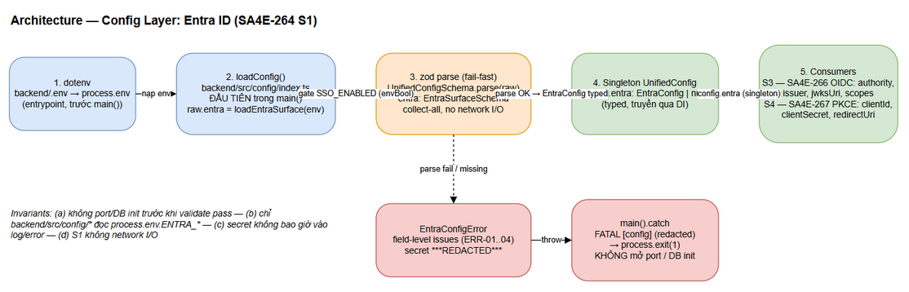
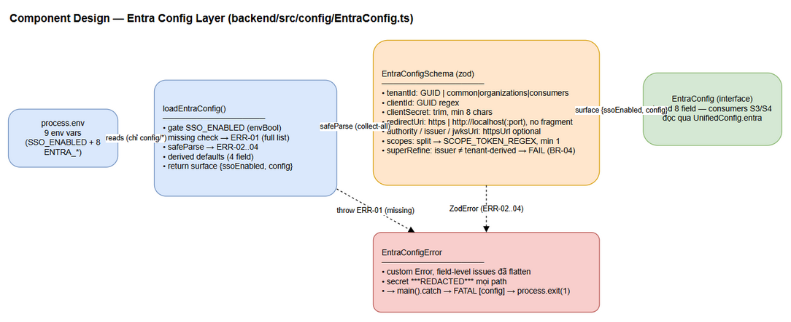

# Technical Design Document (TDD) — SA4E-264

## SA4E Backend — SA4E-264: [Config] Entra ID Configuration + env + validation

---

## Document Information

| Field | Value |
|-------|-------|
| Jira Ticket | SA4E-264 |
| Title | [Config] Cấu hình Entra ID + env + validation |
| Epic | SA4E-262 — [SSO] Tích hợp Microsoft Entra ID (OIDC + PKCE) với JIT provisioning, giữ local account song song |
| Author | SA Agent |
| Version | v1.0 |
| Date | 2026-09-15 |
| Status | Draft |
| Source | BRD SA4E-264 v1.0 + FSD SA4E-264 draft v1 + backend evidence |
| Code anchors | `backend/src/config/index.ts` (zod 3.23.0, `UnifiedConfigSchema`, `envBool`), `backend/src/index.ts` (`loadConfig()` first trong `main()`, `main().catch` → `process.exit(1)`), `scripts/check-secrets.sh` |
| Scope | S1 only — config + validation + `.env.example` docs. Không scope S2..S12 |

---

## 1. Architecture Overview

### 1.1 Config Layer — dotenv → loadConfig → zod parse → singleton

S1 KHÔNG thay đổi kiến trúc tổng thể — nó mở rộng tầng cấu hình hiện có của backend theo đúng pipeline đã vận hành: **dotenv → loadConfig() → raw compose → zod parse → singleton `UnifiedConfig`**. Surface Entra được gắn như 1 section mới (`entra`) cạnh section `sandbox` hiện có, parse cùng 1 lần trong `UnifiedConfigSchema.parse(raw)`.

Pipeline load config khi server start (verified: `backend/src/config/index.ts:134–170`, `backend/src/index.ts` `main()`):

| # | Step | Anchor | S1 change |
|---|------|--------|-----------|
| 1 | dotenv nạp `backend/.env` vào `process.env` | entrypoint, trước `main()` | Không đổi (chỉ thêm biến Entra vào `.env.example`) |
| 2 | `main()` gọi `loadConfig()` ĐẦU TIÊN | `backend/src/index.ts` main() | Không đổi |
| 3 | `loadConfig()` đọc raw env + compose `raw` object | `backend/src/config/index.ts:144–167` | **Thêm**: `raw.entra = loadEntraConfig(process.env)` — gate + parse Entra |
| 4 | `UnifiedConfigSchema.parse(raw)` — zod validate toàn bộ | `backend/src/config/index.ts:169` | **Thêm**: field `entra: EntraSurfaceSchema` vào schema |
| 5 | Singleton `UnifiedConfig` trả về, truyền qua DI | caller của `loadConfig()` | **Thêm**: consumers S3/S4 đọc `config.entra.config` (typed `EntraConfig \| null`) |

**Fail-fast invariant:** parse Entra chạy BÊN TRONG `loadConfig()` (step 3–4) — tức là trước logger setup, adapters, DB init, HTTP listener. Parse fail → throw `EntraConfigError` → `main().catch` (anchor `backend/src/index.ts` cuối main) log `FATAL [config] ...` secret-redacted → `process.exit(1)`. Không path nào mở port trước khi validate pass.

**Gate semantics (SSO_ENABLED):**
- `false`/unset (default — `envBool('SSO_ENABLED', false)`): Entra fields optional, `config.entra.config = null`, boot local-only KHÔNG đổi. Nếu 1+ biến `ENTRA_*` set nhưng chưa đủ → WARN, không block.
- `true`/`1` (case-insensitive): parse strict — thiếu 1 trong 4 biến bắt buộc → `EntraConfigError` ERR-01 (full list); sai format → ERR-02/03/04 (field-level, collect-all). Exit 1.

### 1.2 Design Principles & Constraints

| # | Principle | Áp dụng trong S1 |
|---|-----------|------------------|
| P-1 | **Fail-fast tại startup** | Config sai → từ chối boot trước mọi init (exit 1), không bao giờ boot state nửa vời |
| P-2 | **Single source of truth** | Chỉ `backend/src/config/*` được đọc `process.env.ENTRA_*`; consumers đọc `config.entra` typed |
| P-3 | **Collect-all errors** | Zod parse không abort-early — operator thấy ĐẦY ĐỦ mọi field lỗi trong 1 restart cycle |
| P-4 | **Secret never logged** | `ENTRA_CLIENT_SECRET` redacted `***REDACTED***` trên mọi log/error path |
| P-5 | **No network I/O trong S1** | Pure zod parse — không JWKS fetch, không discovery HTTP (thuộc S3) |
| P-6 | **Config-only scope** | Không DB migration, không endpoint mới, không artifact deployment mới (S2 owns DB) |

### 1.3 Deployment / Runtime Context

S1 là config-only change — không có deployment artifact mới. Runtime context:

- **Process**: cùng 1 Node process backend hiện có (`npm run dev` / `npm start`). Không process manager mới, không service mới (BRD §5.2 assumption).
- **Env supply**: dev = local `.env` (untracked); CI/staging/prod = environment variables / secret manager per environment (S12/SA4E-271 owns runbook).
- **Storage**: không DB mới, không table mới — S1 chỉ validate config. (DB migration `account_type` thuộc S2/SA4E-265 chạy song song.)
- **External system**: Microsoft Entra ID KHÔNG được gọi trong S1 (no network I/O — P-5). Entra chỉ là nguồn cấp giá trị cấu hình do operator nhập.

---

## 2. Component Design

### 2.1 Component Responsibilities

| Component | File | Responsibility |
|-----------|------|----------------|
| `EntraConfig` (interface) | backend/src/config/EntraConfig.ts | Typed contract 8 field cho consumers S3/S4 |
| `EntraConfigSchema` | backend/src/config/EntraConfig.ts | Zod validation: GUID, HTTPS URL, redirect scheme, scopes pattern, `.superRefine` issuer mismatch |
| `EntraSurfaceSchema` | backend/src/config/EntraConfig.ts | Wrapper: `ssoEnabled` + `config: EntraConfig \| null` |
| `loadEntraConfig()` | backend/src/config/EntraConfig.ts | Gate `SSO_ENABLED` → missing check (ERR-01) → `safeParse` → derived defaults → return surface |
| `EntraConfigError` | backend/src/config/EntraConfig.ts | Custom Error mang field-level issues đã flatten + secret-redacted |
| `UnifiedConfigSchema` (modified) | backend/src/config/index.ts | Thêm 1 dòng `entra: EntraSurfaceSchema` theo pattern `sandbox` |
| `loadConfig()` (modified) | backend/src/config/index.ts | Thêm `raw.entra = loadEntraConfig(process.env)` trước `.parse(raw)` |
| `main().catch` | backend/src/index.ts | Log FATAL (redacted) → `process.exit(1)` — path hiện có, không đổi |
| `.env.example` section | backend/.env.example | 9 biến commented placeholders — docs only |
| `check-secrets.sh` | scripts/ (hiện có) | Gate block commit chứa secret thật — giữ pass |
| Unit tests | backend/tests/unit/EntraConfig.test.ts | Verify matrix SSO on/off × missing/invalid × redaction × derived |

### 2.2 TypeScript Contract — `EntraConfig` (8 fields) [Implements: AC-2]

Export từ `backend/src/config/EntraConfig.ts` (file riêng, pattern giống `SandboxConfig.ts`). Consumers: S3 (SA4E-266), S4 (SA4E-267).

```typescript
// Typed contract cho 8 biến ENTRA_* (sau khi áp derived defaults — mọi field present)
export interface EntraConfig {
  /** Azure AD tenant GUID hoặc 'common' | 'organizations' | 'consumers' */
  tenantId: string;        // ENTRA_TENANT_ID
  /** App Registration (client) GUID */
  clientId: string;        // ENTRA_CLIENT_ID
  /** SENSITIVE — không log, redacted ***REDACTED*** trên mọi error path */
  clientSecret: string;    // ENTRA_CLIENT_SECRET
  /** Callback URL đăng ký trên App Registration (SA4E-271) */
  redirectUri: string;     // ENTRA_REDIRECT_URI
  /** Derived default: https://login.microsoftonline.com/{tenantId} */
  authority: string;       // ENTRA_AUTHORITY (optional env — derived khi absent)
  /** Derived default: https://login.microsoftonline.com/{tenantId}/v2.0 */
  issuer: string;          // ENTRA_ISSUER (optional env — BR-04 cross-check)
  /** Derived default: {authority}/discovery/v2.0/keys */
  jwksUri: string;         // ENTRA_JWKS_URI (optional env — derived khi absent)
  /** Parsed từ space-separated string; default 'openid profile email offline_access' (BR-02) */
  scopes: string[];        // ENTRA_SCOPES (optional env — derived khi absent)
}
```

### 2.3 Zod Schema — `EntraConfigSchema` [Implements: AC-2]

Validation rules: GUID tenant/client, HTTPS authority/issuer/jwks, redirect localhost/https (no fragment), scopes token pattern, `.superRefine` issuer mismatch (BR-04 — KHÔNG silently overwrite).

```typescript
// ---- SA4E-264: Entra surface (backend/src/config/EntraConfig.ts) ----
const GUID_REGEX = /^[0-9a-fA-F]{8}-[0-9a-fA-F]{4}-[0-9a-fA-F]{4}-[0-9a-fA-F]{4}-[0-9a-fA-F]{12}$/;
const MULTI_TENANT = ['common', 'organizations', 'consumers'] as const;
const SCOPE_TOKEN_REGEX = /^[A-Za-z0-9._:/-]+$/; // openid|profile|email|offline_access + custom API scopes

const httpsUrl = z.string().url().startsWith('https://');

export const EntraConfigSchema = z.object({
  tenantId: z.string().trim().min(1)
    .refine(v => GUID_REGEX.test(v) || (MULTI_TENANT as readonly string[]).includes(v),
      { message: 'expected GUID or common|organizations|consumers' }),        // ERR-02
  clientId: z.string().trim().regex(GUID_REGEX, 'expected UUID/GUID'),        // ERR-02
  clientSecret: z.string().trim().min(8, 'min 8 chars after trim'),           // ERR-02 / UC-02 E2
  redirectUri: z.string().url()
    .refine(v => v.startsWith('https://') || /^http:\/\/(localhost|127\.0\.0\.1)(:\d+)(\/|$)/.test(v),
      { message: 'must be https:// or http://localhost with port' })          // ERR-03
    .refine(v => !v.includes('#'), { message: 'fragment not allowed' }),      // ERR-03
  authority: httpsUrl.optional(),                                             // ERR-03 — derived khi absent
  issuer: httpsUrl.optional(),                                                // ERR-03 — BR-04 cross-check
  jwksUri: httpsUrl.optional(),                                               // ERR-03 — derived khi absent
  scopes: z.string()
    .transform(v => v.trim().split(/\s+/).filter(Boolean))
    .pipe(z.array(z.string().regex(SCOPE_TOKEN_REGEX)).min(1))                // ERR-04
    .optional(),                                                              // derived default khi absent
}).superRefine((cfg, ctx) => {
  // BR-04: explicit issuer phải khớp tenant-derived — KHÔNG silently overwrite
  if (cfg.issuer && GUID_REGEX.test(cfg.tenantId)) {
    const derived = `https://login.microsoftonline.com/${cfg.tenantId}/v2.0`;
    if (cfg.issuer !== derived) {
      ctx.addIssue({ code: z.ZodIssueCode.custom, path: ['issuer'],
        message: `explicit issuer mismatch with tenant-derived ${derived}` }); // UC-01 E1
    }
  }
});

// ---- Surface wrapper: gate + config ----
export const EntraSurfaceSchema = z.object({
  ssoEnabled: z.boolean(),            // envBool('SSO_ENABLED', false)
  config: EntraConfigSchema.nullable().default(null), // null khi SSO off
});

// ---- Extension point trong UnifiedConfigSchema (backend/src/config/index.ts) ----
// ... existing fields ...
sandbox: SandboxConfigSchema,
entra: EntraSurfaceSchema,          // SA4E-264 — thêm dòng này
```

**Derived defaults** (áp dụng sau parse, trước gắn vào `UnifiedConfig` — output thỏa mãn interface `EntraConfig` đầy đủ 8 field):

| Field | Derived value khi absent | Rule |
|-------|--------------------------|------|
| `authority` | `https://login.microsoftonline.com/{tenantId}` | FSD §4.1 #6 |
| `issuer` | `https://login.microsoftonline.com/{tenantId}/v2.0` | BR-04 |
| `jwksUri` | `{authority}/discovery/v2.0/keys` | FSD §4.1 #8 |
| `scopes` | `['openid', 'profile', 'email', 'offline_access']` | BR-02 |

### 2.4 `loadEntraConfig()` — Gate + Parse + Derived [Implements: AC-1, AC-2]

```typescript
// Pseudocode (TypeScript) — config layer, gọi từ loadConfig()
function loadEntraConfig(env: NodeJS.ProcessEnv): EntraConfig | null {
  const ssoEnabled = envBool('SSO_ENABLED', false);        // tái dùng helper hiện có
  const present = ENTRA_KEYS.filter(k => env[k]?.trim());  // 8 biến ENTRA_*

  if (!ssoEnabled) {                                       // UC-02 E1: gate off
    if (present.length > 0)
      logger.warn('Entra vars partially set but SSO_ENABLED=false — SSO stays disabled');
    return null;                                           // local-only boot, không đổi
  }

  const missing = REQUIRED_KEYS.filter(k => !env[k]?.trim()); // 4 biến bắt buộc
  if (missing.length > 0)                                  // ERR-01: full list, không abort-early
    throw new EntraConfigError(
      `SSO_ENABLED=true but missing required Entra config: ${missing.join(', ')}. ` +
      `See backend/.env.example (SA4E-264).`);

  const parsed = EntraConfigSchema.safeParse(buildRawFrom(env)); // collect-all issues
  if (!parsed.success)                                     // ERR-02..04: flatten + redact secret
    throw new EntraConfigError(flattenIssues(parsed.error));

  return applyDerivedDefaults(parsed.data);                // authority/issuer/jwksUri/scopes
}
```

Kết quả gắn vào `raw.entra` trước `UnifiedConfigSchema.parse(raw)` (pipeline §1.1 step 3).

### 2.5 `EntraConfigError` — collect-all field-level

```typescript
export class EntraConfigError extends Error {
  /** Field-level issues đã flatten: path + message + expected format */
  readonly issues: ReadonlyArray<{ path: string; message: string }>;

  constructor(
    message: string,
    issues: ReadonlyArray<{ path: string; message: string }> = [],
  ) {
    super(redactSecrets(message)); // secret redacted TRƯỚC khi vào message/cause chain
    this.name = 'EntraConfigError';
    this.issues = issues.map(i => ({ path: i.path, message: redactSecrets(i.message) }));
  }
}
```

Đặc điểm:
- **Collect-all**: mang TOÀN BỘ zod issues đã flatten (không chỉ field đầu) — UC-02 Main step 3–4.
- **Redacted tại constructor**: mọi message/issue đi qua `redactSecrets()` trước khi lưu — secret không bao giờ xuất hiện kể cả trong cause chain hay debug dump (UC-02 Main step 5).
- **Operator-friendly**: mỗi issue nêu field name + problem class (missing/bad format) + expected format + hint nơi set (`.env.example` SA4E-264).

---

## 3. API Design — Config Module Contract

> S1 KHÔNG thêm HTTP endpoint nào. "API" của S1 là **CONFIG MODULE CONTRACT**: 9 environment variables (input) + typed `EntraConfig` object (output) consumed bởi S3/S4 qua `config.entra`.

### 3.1 Environment Variables (9) [Implements: AC-2, BR-01]

| # | Name | Type | Required | Default | Validation | Example |
|---|------|------|----------|---------|------------|---------|
| 1 | `SSO_ENABLED` | boolean (env string) | No | `false` | `true`/`1` = on; khác = off (envBool) | `true` |
| 2 | `ENTRA_TENANT_ID` | string (GUID hoặc `common`/`organizations`/`consumers`) | Yes khi SSO on | — | GUID regex hoặc 1 trong 3 multi-tenant values; empty rejected | `11111111-2222-3333-4444-555555555555` |
| 3 | `ENTRA_CLIENT_ID` | string (GUID/UUID) | Yes khi SSO on | — | GUID/UUID regex | `aaaaaaaa-bbbb-cccc-dddd-eeeeeeeeeeee` |
| 4 | `ENTRA_CLIENT_SECRET` | string (secret, min 8 chars sau trim) | Yes khi SSO on | empty | whitespace-only rejected; SENSITIVE — không log, redacted trong mọi error | `<set-via-secret-manager>` (không bao giờ giá trị thật trong repo) |
| 5 | `ENTRA_REDIRECT_URI` | string (URL) | Yes khi SSO on | — | Scheme `https://` hoặc `http://localhost` / `http://127.0.0.1` (loopback dev, có port); KHÔNG chứa fragment | `http://localhost:48721/auth/entra/callback` |
| 6 | `ENTRA_AUTHORITY` | string (HTTPS URL) | No (derived) | `https://login.microsoftonline.com/{tenantId}` | HTTPS URL hợp lệ; khi derived phải nhúng tenant verbatim | `https://login.microsoftonline.com/11111111-2222-3333-4444-555555555555` |
| 7 | `ENTRA_ISSUER` | string (HTTPS URL) | No (derived) | `https://login.microsoftonline.com/{tenantId}/v2.0` | HTTPS URL; explicit phải khớp tenant-derived (BR-04) | `https://login.microsoftonline.com/11111111-2222-3333-4444-555555555555/v2.0` |
| 8 | `ENTRA_JWKS_URI` | string (HTTPS URL) | No (derived) | `{authority}/discovery/v2.0/keys` | HTTPS URL | `https://login.microsoftonline.com/11111111-2222-3333-4444-555555555555/discovery/v2.0/keys` |
| 9 | `ENTRA_SCOPES` | string (space-separated) → string[] | No | `openid profile email offline_access` | Non-empty space-separated; mỗi token match `[A-Za-z0-9._:/-]+`; thiếu `offline_access` khi SSO on → WARN | `openid profile email offline_access` |

### 3.2 Output Contract — Data Flow S12 → S1 → S3/S4

| Stage | System | Data | Mechanism |
|-------|--------|------|-----------|
| Cấp phát | S12 (SA4E-271 App Registration runbook) | tenantId, clientId, secret, redirectUri | Operator / secret manager — KHÔNG qua repo |
| Load | S1 (ticket này) | 9 env vars → `EntraConfig` typed | dotenv → zod parse → `UnifiedConfig.entra` (singleton) |
| Consume | S3 (SA4E-266 OIDC) | authority, issuer, jwksUri, scopes | đọc `config.entra` |
| Consume | S4 (SA4E-267 PKCE/auth code) | clientId, clientSecret, redirectUri, scopes | đọc `config.entra` |

### 3.3 `.env.example` Snippet (9 vars + placeholder) [Implements: AC-3]

Thêm section sau vào `backend/.env.example` (pattern theo section SA4E-241 hiện có — placeholders only, KHÔNG giá trị thật):

```bash
# =============================================================================
# SA4E-264 — Entra ID SSO config (env template — placeholders only)
# NEVER commit real values. Use local .env (untracked) or a secret manager.
# See FSD SA4E-264 §4.1 for validation rules.
# =============================================================================

# Gate flag: true/1 = enable SSO (Entra vars become REQUIRED at startup, fail-fast)
SSO_ENABLED=false

# --- Required when SSO_ENABLED=true (4 values from App Registration runbook SA4E-271) ---
ENTRA_TENANT_ID=<azure-ad-tenant-guid-or-common>
ENTRA_CLIENT_ID=<app-registration-client-guid>
ENTRA_CLIENT_SECRET=<set-via-secret-manager>   # min 8 chars; NEVER a real secret in repo
ENTRA_REDIRECT_URI=http://localhost:48721/auth/entra/callback

# --- Optional (derived defaults when absent — see FSD §7.2) ---
# ENTRA_AUTHORITY=https://login.microsoftonline.com/<tenant-guid>
# ENTRA_ISSUER=https://login.microsoftonline.com/<tenant-guid>/v2.0
# ENTRA_JWKS_URI=https://login.microsoftonline.com/<tenant-guid>/discovery/v2.0/keys
# ENTRA_SCOPES=openid profile email offline_access
```

**Same-commit rule**: schema zod (`backend/src/config/*`) và section `.env.example` PHẢI cùng commit (UC-03 E2).

---

## 4. Error Handling

### 4.1 Error Catalog [Implements: AC-1]

| Error ID | Condition | Error Output | Behavior | UC |
|----------|-----------|--------------|----------|-----|
| **ERR-01** | Missing required var khi `SSO_ENABLED=true` | `FATAL [config] SSO_ENABLED=true but missing required Entra config: {FIELDS}. See backend/.env.example (SA4E-264).` | Log danh sách ĐẦY ĐỦ mọi field thiếu → `process.exit(1)`. Không mở port, không DB init | UC-02 |
| **ERR-02** | Invalid GUID (`ENTRA_TENANT_ID`/`ENTRA_CLIENT_ID` không match GUID/UUID regex) hoặc secret < 8 chars sau trim | `FATAL [config] Invalid Entra config — {FIELD}: expected UUID/GUID; got <redacted-kind>.` | Field-level message với expected format → exit 1 | UC-02 |
| **ERR-03** | Non-HTTPS URL (`ENTRA_AUTHORITY`/`ENTRA_ISSUER`/`ENTRA_JWKS_URI` không phải https; redirect scheme không hợp lệ — chỉ https hoặc http://localhost/127.0.0.1 có port; chứa fragment) | `FATAL [config] Invalid Entra config — {FIELD}: must be https:// or http://localhost with port; got <redacted-kind>.` | Field-level → exit 1 | UC-02 |
| **ERR-04** | Invalid scopes (empty list, token sai pattern, hoặc thiếu `offline_access` khi SSO on) | `FATAL [config] Invalid Entra config — ENTRA_SCOPES: ...` hoặc WARN tương ứng nếu warn mode | Warn hoặc fail theo cấu hình; default bao gồm `offline_access` | UC-01 A3, UC-02 |

Quy tắc chung mọi error: secret values redacted (`***REDACTED***`) trong TẤT CẢ output kể cả cause chain; zod errors collected/flattened (không abort-early) để operator thấy full list.

### 4.2 Fail-Fast Behavior [Implements: AC-1]

- **`SSO_ENABLED=false`/unset** (tái dùng `envBool` — `val === '1' || val.toLowerCase() === 'true'`): Entra fields optional; nếu partial (1+ biến set nhưng chưa đủ) → WARN `Entra vars partially set but SSO_ENABLED=false — SSO stays disabled`, boot tiếp local-only (UC-02 E1). KHÔNG block boot.
- **`SSO_ENABLED=true`**: parse `EntraConfigSchema` — zod collect TOÀN BỘ issues (không abort-early) để operator thấy full field list (UC-02 Main step 3).
- **Parse fail** → throw `EntraConfigError` mang field-level issues đã flatten: `path` + `message` + expected format. `main().catch` (`backend/src/index.ts:194-196`) catch → log `FATAL [config] ...` secret redacted `***REDACTED***` → `process.exit(1)`. KHÔNG mở HTTP port, KHÔNG DB init (UC-02 Main step 6; ERR-01..04).
- **Không network I/O trong S1** — pure zod parse, không JWKS fetch / discovery HTTP (P-5).
- **Chỉ `backend/src/config/*` được đọc `process.env.ENTRA_*`** — module khác đọc trực tiếp = violation (P-2).

### 4.3 Start-up Sequence — Failure Behavior [Implements: AC-1]

| # | Step | Code anchor | Failure behavior |
|---|------|-------------|------------------|
| 1 | dotenv nạp `.env` | entrypoint trước `main()` | Env trống → SSO off (nếu chưa set) |
| 2 | `main()` gọi `loadConfig()` ĐẦU TIÊN | `backend/src/index.ts:24` | Zod fail → throw trước mọi init |
| 3 | Entra surface parse + derived defaults | config layer (S1) | `EntraConfigError` với field-level list |
| 4 | logger / adapters / DB init / HTTP listener | sau `loadConfig()` | Chỉ chạy khi config hợp lệ |
| 5 | `main().catch` → log fatal → exit | `backend/src/index.ts:194-196` | `process.exit(1)` — không mở port, không DB init (ERR-01..04) |

**Invariants**: (a) không HTTP port mở / DB init trước khi config validate pass; (b) chỉ config layer đọc `process.env.ENTRA_*`; (c) secret không bao giờ xuất hiện trong log/error (redaction mọi path); (d) không network I/O trong S1.

---

## 5. Security Design

### 5.1 Secret Redaction — mọi log output [P-4]

- `ENTRA_CLIENT_SECRET` là field SENSITIVE duy nhất. Mọi path xuất hiện giá trị (log, error message, cause chain, debug dump) phải đi qua `redactSecrets()` → thay bằng `***REDACTED***` (UC-02 Main step 5).
- Redaction áp dụng TẠI constructor `EntraConfigError` (§2.5) — secret không bao giờ được lưu vào error object.
- Log debug startup chỉ in giá trị non-sensitive: tenantId, authority, issuer, scopes (UC-01 Main step 6). `clientId` không phải secret (public identifier OIDC) — cho phép log.
- Cấm `console.log(process.env)` / dump raw env toàn phần ở bất kỳ đâu trong config layer.

### 5.2 Secret KHÔNG commit vào repo [BR-03]

- `.env.example` chứa placeholder `<set-via-secret-manager>` — KHÔNG BAO GIỜ giá trị thật.
- Giá trị thật chỉ tồn tại: local `.env` (untracked, `.gitignore`) hoặc secret manager per environment.
- Dev commit `.env` chứa secret thật → `scripts/check-secrets.sh` BLOCK commit (UC-03 E1); fix placeholder trước, không override nếu thiếu Security review.

### 5.3 check-secrets.sh Gate

- Gate hiện có tại `scripts/check-secrets.sh` — KHÔNG sửa, chỉ PHẢI giữ pass.
- Placeholder `<set-via-secret-manager>` không match pattern secret thật (BR-03) — an toàn với gate.
- CI/pre-commit chạy gate trước merge; fail = block commit.

### 5.4 Access Boundaries [P-2]

- Chỉ `backend/src/config/*` được đọc `process.env.ENTRA_*`. Module khác đọc trực tiếp = violation.
- `EntraConfig.clientSecret` chỉ được consume bởi S4 (SA4E-267 — token endpoint call). S3 (OIDC validate) KHÔNG cần secret.
- Không network I/O trong S1 — Entra ID không được gọi, không mở attack surface mới.

---

## 6. Implementation Checklist

### 6.1 Files

| # | File | Action | Content | Depends |
|---|------|--------|---------|---------|
| 1 | `backend/src/config/EntraConfig.ts` | **MỚI** | `EntraConfig` interface (8 fields), `EntraConfigSchema` + `EntraSurfaceSchema` (zod), `loadEntraConfig()`, `EntraConfigError` (§2.2–2.5) | — |
| 2 | `backend/src/config/index.ts` | SỬA | Thêm `entra` section: import từ EntraConfig.ts, `raw.entra = loadEntraConfig(process.env)` trước `.parse(raw)`, field `entra: EntraSurfaceSchema` trong `UnifiedConfigSchema` | #1 |
| 3 | `backend/.env.example` | SỬA | Thêm section SA4E-264 (9 biến placeholders — §3.3) | #2 (same-commit rule) |
| 4 | `backend/tests/unit/EntraConfig.test.ts` | **MỚI** | Test matrix §6.2 | #1 |

### 6.2 Unit Test Matrix — `backend/tests/unit/EntraConfig.test.ts`

| # | Case | Input | Expected |
|---|------|-------|----------|
| T-01 | **Valid** — full config | `SSO_ENABLED=true` + đủ 4 biến bắt buộc (GUID hợp lệ, redirect https) | Parse OK; `config.entra.config` typed đủ 8 fields |
| T-02 | **Valid** — derived defaults | 4 biến bắt buộc, KHÔNG set AUTHORITY/ISSUER/JWKS_URI/SCOPES | `authority = https://login.microsoftonline.com/{tenantId}`; `issuer = .../v2.0`; `jwksUri = {authority}/discovery/v2.0/keys`; `scopes = ['openid','profile','email','offline_access']` |
| T-03 | **Missing** — thiếu biến khi SSO on | `SSO_ENABLED=true`, chỉ set `ENTRA_TENANT_ID` | `EntraConfigError` ERR-01; message liệt kê ĐẦY ĐỦ `ENTRA_CLIENT_ID, ENTRA_CLIENT_SECRET, ENTRA_REDIRECT_URI`; hint `.env.example (SA4E-264)` |
| T-04 | **Invalid GUID** | `ENTRA_TENANT_ID=not-a-guid` (hoặc `ENTRA_CLIENT_ID` sai format) | ERR-02 field-level: `expected GUID or common|organizations|consumers` / `expected UUID/GUID` |
| T-05 | **Non-HTTPS** | `ENTRA_AUTHORITY=http://...` (hoặc JWKS_URI/ISSUER http; redirect `http://evil.com` không loopback) | ERR-03: `must be https:// or http://localhost with port` |
| T-06 | **Issuer mismatch** | `ENTRA_ISSUER=https://login.microsoftonline.com/{other-guid}/v2.0` với tenant GUID khác | `.superRefine` fail: `explicit issuer mismatch with tenant-derived ...` (UC-01 E1 — không silently overwrite) |
| T-07 | **Redaction** | secret `super-secret-value-123` đi qua mọi error path | Output chỉ chứa `***REDACTED***`; KHÔNG có secret trong message/issues/cause chain |
| T-08 | **Gate off** | `SSO_ENABLED=false` + partial Entra vars | `config.entra.config = null`; WARN (không throw); boot local-only OK |
| T-09 | **Multi-tenant tenant** | `ENTRA_TENANT_ID=common` | Accepted (GUID regex \| multi-tenant values) |
| T-10 | **Scopes validation** | `ENTRA_SCOPES=openid profile email` (thiếu `offline_access` → WARN); token chứa ký tự cấm → ERR-04 | WARN/ERR-04 theo cấu hình |

### 6.3 Traceability [Implements: AC]

| AC (SA4E-264) | Use Case | Business Rule | Verify (TDD artifact) |
|----------------|----------|---------------|------------------------|
| AC-1: Khởi động fail rõ ràng nếu thiếu config bắt buộc khi bật SSO | UC-02 | BR-01, BR-03, BR-04 | §4.1 ERR-01..04 + §4.2 fail-fast + §4.3 sequence; tests T-03..T-08 |
| AC-2: Có schema zod cho toàn bộ env Entra | UC-01 | BR-01, BR-02, BR-04 | §2.2 interface + §2.3 schema + §3.1 9 vars; tests T-01, T-02, T-09 |
| AC-3: Document trong `.env.example` | UC-03 | BR-02, BR-03 | §3.3 snippet + §5.2/5.3 secrets gate |

Hard constraint "KHÔNG commit secret thật": UC-03 E1, BR-03, §5.1 (redaction).

---

## 7. Diagrams

### Diagram Index

| # | Diagram | Image | Source (editable) |
|---|---------|-------|-------------------|
| 1 | Architecture — Config Layer Entra ID (dotenv → loadConfig → zod → singleton) | [architecture-config.png](diagrams/architecture-config.png) | [architecture-config.drawio](diagrams/architecture-config.drawio) |
| 2 | Component — Entra Config components & dependencies | [component-config.png](diagrams/component-config.png) | [component-config.drawio](diagrams/component-config.drawio) |


*[Edit in draw.io](diagrams/architecture-config.drawio)*


*[Edit in draw.io](diagrams/component-config.drawio)*

*All diagrams are draw.io only. No Mermaid is used in this document by project rule.*

---

*End of TDD — SA4E-264 v1.0*
