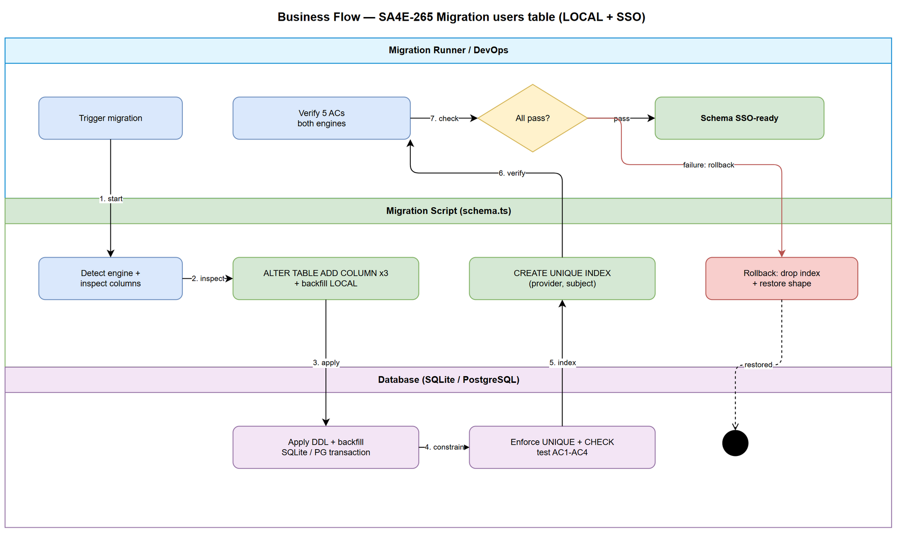
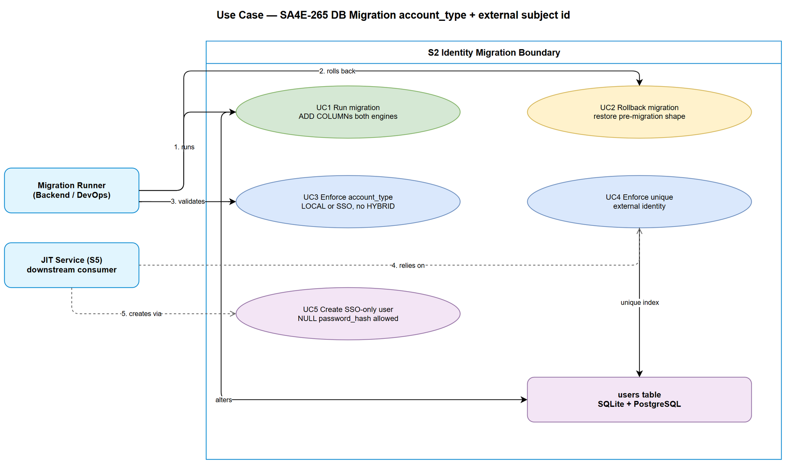

# Business Requirements Document (BRD)

## SA4E SSO Entra ID — SA4E-265: [DB] Migration account type + external subject id

---

## Document Information

| Field | Value |
|-------|-------|
| Jira Ticket | SA4E-265 |
| Title | [DB] Migration account type + external subject id |
| Epic | SA4E-262 — [SSO] Tich hop Microsoft Entra ID (OIDC + PKCE) voi JIT provisioning, giu local account song song |
| Type | Task |
| Author | BA Agent |
| Version | 1.0 |
| Date | 2026-09-14 |
| Status | Draft |

---

## Author Tracking

| Role | Name - Position | Responsibility |
|------|-----------------|----------------|
| Author | BA Agent – Business Analyst | Create document from SA4E-265 + Epic SA4E-262 + codebase evidence |
| Peer Reviewer | TBD – Tech Lead | Review DB migration scope and constraints |

---

## Revision History

| Version | Date | Author | Changes |
|---------|------|--------|---------|
| 1.0 | 2026-09-14 | BA Agent | Initiate document — from documents/SA4E-SSO-Entra/PROPOSED-TICKETS.md S2 (SA4E-265), Epic SA4E-262, backend/src/admin/db/schema.ts, backend/src/admin/db/users.ts, UserRepository |

---

## Sign-Off

| Name | Signature and date |
|------|--------------------|
| Product Owner | ☐ I agree and confirm all criteria on this BRD as expected requirements |
| Tech Lead | ☐ I agree and confirm all criteria on this BRD as expected requirements |

---

## 1. Introduction

### 1.1 Scope

SA4E-265 is the Wave 1 database foundation for SSO Microsoft Entra ID in Epic SA4E-262. It migrates the existing `users` table (SQLite + PostgreSQL) to support two account kinds running in parallel: LOCAL (email/password PBKDF2, current behavior) and SSO (Entra-backed, JIT-provisioned in SA4E-268). Source: PROPOSED-TICKETS.md S2 description and SA4E-262 Epic description.

In scope (CHOT, not negotiable per ticket):

1. Add `account_type` with allowed values LOCAL \| SSO only — explicitly NO HYBRID (per S2 description and Section 4 Quyet dinh da CHOT #3).
2. Add `external_provider` (e.g. `entra`) and `external_subject_id` (Entra `oid`/`sub`).
3. Add unique index `(external_provider, external_subject_id)` to prevent duplicate external identities.
4. Enforce email linking rule support (anti-duplicate): migration must not break existing email/username uniqueness and must allow downstream JIT linking policy (link only when `email_verified=true`, defined in S5/SA4E-268).
5. Make `password_hash` nullable so SSO-only users can exist without a password.
6. Update `backend/src/admin/db/schema.ts` (single source of DDL) with per-engine SQL for SQLite and PostgreSQL, idempotent and with rollback.
7. Labels: `sso`, `db`, `backend`, `auth`. Depends: none — runs parallel with S1 (SA4E-264), Wave 1.

### 1.2 Out of Scope

- Entra app configuration and env validation (S1 / SA4E-264).
- Token verification RS256 + JWKS (S3 / SA4E-266), OAuth2 callback + PKCE (S4 / SA4E-267).
- JIT provisioning service logic and account-linking decision flow (S5 / SA4E-268) — S2 only provides the columns/constraints JIT needs.
- Unification of the two auth entries into a single UserRepository (S6 / SA4E-269) — S6 consumes the migrated schema but is not part of S2.
- Extension PKCE wiring, UI, hardening, test planning, docs (S7–S11).
- Any HYBRID account type, automatic email merge without verification, or password removal for existing LOCAL users.

### 1.3 Preliminary Requirement

- Existing `users` table as defined in `backend/src/admin/db/schema.ts` function `schemaSql(engine)` and referenced in `backend/src/database/schema-registry/sa4e-215.ts` USERS_TABLE.
- `DatabaseAdapter` async API (`execAsync`, `runAsync`, `getAsync`) as the only migration path — sync methods throw on PostgreSQL (see `backend/src/database/adapters/DatabaseAdapter.ts`).
- Established migration pattern in `initSchema()`: idempotent `CREATE TABLE IF NOT EXISTS`, `ALTER TABLE ... ADD COLUMN` inside try/catch, `CREATE INDEX IF NOT EXISTS`.
- Empty production rollout window decision (migration runs on startup or via explicit migrate step — to be confirmed by SA/DEV, both engines tested).

---

## 2. Business Requirements

### 2.1 High Level Process Map

The migration upgrades every environment database from the LOCAL-only shape to the LOCAL + SSO shape without downtime for existing LOCAL logins. The runner checks current columns, applies additive idempotent DDL on the active engine (SQLite or PostgreSQL), creates the unique external-identity index, backfills existing rows as LOCAL, validates constraints, and only then declares the schema SSO-ready for downstream JIT (S5) and repository unification (S6). Any failure triggers rollback to the pre-migration shape.

*[Edit in draw.io](diagrams/business-flow.drawio)*

*[Edit in draw.io](diagrams/use-case.drawio)*

### Diagram Index

| # | Diagram | Image | Source (editable) |
|---|---------|-------|-------------------|
| 1 | Business Flow (swimlane) | [business-flow.png](diagrams/business-flow.png) | [business-flow.drawio](diagrams/business-flow.drawio) |
| 2 | Use Case Diagram | [use-case.png](diagrams/use-case.png) | [use-case.drawio](diagrams/use-case.drawio) |

### 2.2 List of User Stories / Use Cases

| # | Story / Use Case / Epic | Priority | Source Ticket |
|---|-------------------------|----------|---------------|
| US-1 | As a Backend Developer, I want the users table migrated with account_type, external_provider and external_subject_id so that Entra SSO identities can be stored alongside LOCAL accounts | MUST HAVE | SA4E-265 |
| US-2 | As a Backend Developer, I want strict data-integrity rules (account_type only LOCAL/SSO, unique external identity, nullable password_hash only for SSO, email anti-duplicate) so that no HYBRID or duplicate identity can exist | MUST HAVE | SA4E-265 |
| US-3 | As a DevOps/Backend Developer, I want an idempotent migration with verified rollback on both SQLite and PostgreSQL so that rollout is safe and repeatable | MUST HAVE | SA4E-265 |

---

### 2.3 Details of User Stories

---

#### Business Flow

**Step 1:** Migration runner detects engine via `db.getEngine()` (`sqlite` or `postgresql`) and inspects current `users` columns.

**Step 2:** If `account_type`, `external_provider`, `external_subject_id` are missing, runner executes per-engine `ALTER TABLE users ADD COLUMN` statements idempotently (try/catch if column exists, same pattern as `graph_nodes.project_id` migration in `schema.ts`).

**Step 3:** Runner creates unique index `(external_provider, external_subject_id)` with `CREATE UNIQUE INDEX IF NOT EXISTS`, using engine-appropriate syntax.

**Step 4:** Runner backfills existing rows: `account_type='LOCAL'`, `external_provider=NULL`, `external_subject_id=NULL` where null, preserving `password_hash`, `username`, `email`.

**Step 5:** Runner enforces `account_type IN ('LOCAL','SSO')` (CHECK constraint where supported, otherwise application-level guard + validation in repository layer) and alters `password_hash` to nullable.

**Step 6:** Runner verifies: insert SSO-only row without password succeeds; insert duplicate `(provider, subject)` fails; insert `account_type='HYBRID'` fails; existing LOCAL login still works.

**Step 7:** On any failure, runner executes rollback (drop index, drop added columns or restore from backup per engine capability) and reports the failing AC.

> **Note:** SQLite has limited `ALTER TABLE` (no DROP COLUMN in older versions, no enforced CHECK on alter in all builds) — BRD requires the FSD/TDD to define per-engine workarounds (e.g. table-rebuild for SQLite rollback, native `ALTER COLUMN DROP NOT NULL` for PostgreSQL). PostgreSQL supports transactional DDL — migration SHOULD run inside `transactionAsync` where possible.

---

#### STORY US-1: Migrate users table with SSO identity columns

> As a Backend Developer, I want the users table migrated with account_type, external_provider and external_subject_id so that Entra SSO identities can be stored alongside LOCAL accounts

**Requirement Details:**

1. Extend `users` in `backend/src/admin/db/schema.ts` `schemaSql(engine)` for both engines with three new columns (source: SA4E-265 description): [SA4E-265]
   - `account_type TEXT NOT NULL DEFAULT 'LOCAL'`
   - `external_provider TEXT` (nullable; e.g. `entra`)
   - `external_subject_id TEXT` (nullable; Entra `oid` preferred, fallback `sub`)
2. Provide idempotent online migration in `initSchema()` (or a dedicated `migrateUsersSso()` called from it) using `ALTER TABLE users ADD COLUMN` wrapped in try/catch, following the existing `project_id` / `created_by` precedent. [schema.ts lines 31-51]
3. Keep all existing columns and semantics unchanged: `user_id TEXT PK`, `username TEXT UNIQUE NOT NULL`, `email TEXT NOT NULL DEFAULT ''`, `status`, `access_group_id`, `force_password_change INTEGER 0/1`, `created_at`, `last_login`. [schema.ts lines 174-184; sa4e-215.ts USERS_TABLE]
4. Use only `DatabaseAdapter` async methods (`execAsync`/`runAsync`) so the same code runs on SQLite and PostgreSQL. Sync `prepare/run/get` MUST NOT be used in migration code (they throw on PostgreSQL). [DatabaseAdapter.ts]
5. Backfill rule: every pre-existing row becomes `account_type='LOCAL'` with NULL external columns.

**Data Fields (if applicable):**

| Field | Type | Required | Description | Example |
|-------|------|----------|-------------|---------|
| account_type | TEXT | Yes | Account kind. Only LOCAL or SSO | `LOCAL`, `SSO` |
| external_provider | TEXT | No (required when SSO) | Identity provider key | `entra` |
| external_subject_id | TEXT | No (required when SSO) | Stable subject from Entra (`oid`, fallback `sub`) | `a1b2c3d4-...-oid` |
| password_hash | TEXT (nullable after migration) | No for SSO-only, Yes for LOCAL | PBKDF2 salt:hash; NULL allowed only when account_type=SSO | `NULL` or `salt:hash` |
| username | TEXT UNIQUE | Yes | Unchanged, still unique | `nguyen.van.a` |
| email | TEXT | Yes | Unchanged; linking rule enforced downstream | `a@company.com` |

**Acceptance Criteria:**

1. Migration script runs successfully on a fresh SQLite database AND on a fresh PostgreSQL database. [SA4E-265 AC1]
2. Migration script runs successfully on existing databases that already contain LOCAL users (backfill verified). [derived from AC1 + schema.ts idempotency]
3. After migration, `SELECT` shows the three new columns on both engines.

**Validation Rules (if applicable):**

- `account_type` MUST default to `LOCAL` for backward compatibility.
- `external_provider`/`external_subject_id` MUST be NULL for all pre-existing rows after backfill.

**Error Handling (if applicable):**

- Column already exists: swallow and continue (idempotent), log at debug level — same as `[schema] column already exists` pattern.
- Engine detection failure: abort with explicit error naming the expected engines (`sqlite`, `postgresql`).

---

#### STORY US-2: Enforce integrity — no HYBRID, no duplicate external subject, safe nullable password

> As a Backend Developer, I want strict data-integrity rules so that no HYBRID or duplicate identity can exist

**Requirement Details:**

1. `account_type` MUST accept only `LOCAL` or `SSO`. `HYBRID` is explicitly forbidden (CHOT decision). Enforcement via CHECK constraint where the engine supports it plus repository-level validation that rejects any other value. [SA4E-265 description + AC3]
2. Unique index `uq_users_external_identity (external_provider, external_subject_id)` MUST exist; inserting two users with the same pair MUST fail on both engines. NULL pairs (LOCAL users) MUST NOT conflict with each other. [SA4E-265 AC4]
3. `password_hash` becomes nullable at DB level, but with rule: LOCAL rows MUST have non-null `password_hash`; SSO-only rows MAY have NULL. Application layer (repository/service) enforces this conditional rule because a plain column-level NOT NULL can no longer express it. [SA4E-265 description + AC2]
4. Email linking rule (anti-duplicate): migration MUST NOT weaken existing uniqueness expectations relied on by `user.service.ts` (`DUPLICATE_USERNAME`/`DUPLICATE_EMAIL` checks) and `users.ts` (`Username already exists`). The schema must support downstream JIT policy: link local-SSO only when Entra `email_verified=true` (S5 decision) — i.e. email alone is NOT a unique identity key after SSO; the unique key is `(provider, subject)`. Email duplicate across a LOCAL and an SSO row is therefore possible by design and MUST be resolved by S5 logic, not by a new UNIQUE(email) constraint in S2.

**Data Fields (if applicable):**

| Field | Type | Required | Description | Example |
|-------|------|----------|-------------|---------|
| uq_users_external_identity | UNIQUE INDEX on (external_provider, external_subject_id) | Yes | Prevents two users sharing one Entra subject | `(entra, oid-123)` unique |
| chk_users_account_type | CHECK (account_type IN ('LOCAL','SSO')) or app guard | Yes | Blocks HYBRID and typos | `HYBRID` rejected |

**Acceptance Criteria:**

1. SSO-only user can be created with NULL `password_hash`. [SA4E-265 AC2]
2. Any insert/update with `account_type` other than LOCAL/SSO (including HYBRID) is rejected. [SA4E-265 AC3]
3. Creating two users with the same `(external_provider, external_subject_id)` fails on both engines. [SA4E-265 AC4]

**Validation Rules (if applicable):**

- `account_type NOT IN ('LOCAL','SSO')` → reject with explicit error naming allowed values.
- SSO row with NULL `external_provider` or NULL `external_subject_id` → reject (both required together).
- LOCAL row with NULL `password_hash` → reject.
- `external_provider` SHOULD be lowercase normalized (`entra`).

**Error Handling (if applicable):**

- Duplicate external identity: surface unique-violation as a typed error (to be mapped by S5 JIT to link-or-reject flow), never silent overwrite.
- HYBRID attempt: reject before hitting DB with message `account_type must be LOCAL or SSO (HYBRID is not allowed)`.

---

#### STORY US-3: Idempotent migration with rollback on both engines

> As a DevOps/Backend Developer, I want an idempotent migration with verified rollback on both SQLite and PostgreSQL so that rollout is safe and repeatable

**Requirement Details:**

1. Migration MUST be re-runnable without error on an already-migrated database (all DDL uses `IF NOT EXISTS` / try-catch ADD COLUMN). [derived from SA4E-265 AC1 + initSchema precedent]
2. Rollback MUST be provided and tested: removes `uq_users_external_identity` index and the three added columns (or restores pre-migration shape per engine capability), leaving pre-existing LOCAL rows intact with their original `password_hash`. [SA4E-265 AC5]
3. SQLite specifics: use `CREATE UNIQUE INDEX IF NOT EXISTS`; rollback drops the index and — given SQLite ALTER limitations — documents the table-rebuild procedure if DROP COLUMN is unavailable in the target SQLite version.
4. PostgreSQL specifics: use `CREATE UNIQUE INDEX IF NOT EXISTS`; `ALTER TABLE ... ALTER COLUMN password_hash DROP NOT NULL`; CHECK constraint via `ALTER TABLE ... ADD CONSTRAINT`; rollback inside `transactionAsync` so partial DDL never persists.
5. `seedAdminUser()` and `seedDefaults()` MUST keep working after migration (admin seed inserts a LOCAL user with password hash; its INSERT column list must be reviewed for the new NOT NULL DEFAULT column). [schema.ts lines 127-138]
6. No secret, token, or PII beyond existing user rows is introduced by this migration. No new network calls.

**Acceptance Criteria:**

1. Running migration twice in a row succeeds on both engines (idempotency proof). [derived AC1]
2. Rollback after a successful migration restores the pre-migration `users` shape and existing LOCAL users can still log in with password. [SA4E-265 AC5]
3. Rollback after a FAILED migration leaves the database in a consistent state (no half-added columns without index, or vice versa).

**Validation Rules (if applicable):**

- Pre-migration check: abort rollback if the database was never migrated (nothing to undo) with a clear message.
- Post-rollback check: `account_type` columns absent, unique index absent, `password_hash NOT NULL` restored (PG) or documented (SQLite).

**Error Handling (if applicable):**

- Migration failure mid-way: stop, report the failed step and engine, attempt automatic rollback, never leave caller assuming success.
- Rollback failure: surface which object could not be dropped and require manual DBA follow-up; do not retry blindly.

---

## 3. Dependencies

| Dependency | Type | Related Ticket | Description |
|------------|------|----------------|-------------|
| DatabaseAdapter async API | Infrastructure | N/A | Migration must use execAsync/runAsync/transactionAsync; sync API throws on PostgreSQL |
| schema.ts single DDL source | System | N/A | All DDL lives in backend/src/admin/db/schema.ts schemaSql(engine) + initSchema(); no forked migration files |
| S1 Entra config (parallel, no blocking) | External | SA4E-264 | No code dependency — S2 runs song song S1 per backlog Wave 1 |
| Downstream JIT consumer | System | SA4E-268 (S5) | S5 depends on S2 columns + unique index; S2 must not assume JIT behavior beyond storing identity |
| Downstream repo unification | System | SA4E-269 (S6) | S6 depends on S2; S2 must keep UserRepository and users.ts queries working (SELECT * tolerant to new columns) |

---

## 4. Stakeholders

| Role | Name / Team | Responsibility | Source |
|------|-------------|----------------|--------|
| Product Owner | TBD | Confirm NO-HYBRID decision and email linking rule stay locked | PROPOSED-TICKETS.md Sec 4 |
| Backend team | TBD | Implement + test migration on SQLite and PostgreSQL | SA4E-265 labels backend/db |
| QA team | TBD | Verify 5 acceptance criteria on both engines incl. rollback | SA4E-265 AC; S10 SA4E-274 downstream |
| Security reviewer | TBD | Confirm nullable password_hash does not weaken LOCAL auth | SA4E-265 labels auth; S8 SA4E-272 downstream |
| DevOps | TBD | Run migration/rollback per environment | US-3 |

> Note: Jira assignee/reporter/watchers could not be read in this session — Jira tools are in-process in the extension runtime (per PROPOSED-TICKETS.md Sec 5) and are not exposed via the code-intel MCP backend (verified: orchestration_status shows only markitdown + markdown-exporter-local; 3x find_tools queries for jira/atlassian returned no Jira tool). Ticket fields above come from PROPOSED-TICKETS.md which records the real created Jira keys and content. To be refreshed from Jira SA4E-265 when extension Jira tools are available.

---

## 5. Risks and Assumptions

### 5.1 Risks

| Risk | Impact | Likelihood | Mitigation |
|------|--------|------------|------------|
| SQLite cannot DROP COLUMN / enforce CHECK on older builds, rollback incomplete | High | Medium | Define SQLite table-rebuild rollback in FSD/TDD; test on pinned SQLite version; document manual DBA steps |
| Partial NULL semantics: UNIQUE index treats NULLs as distinct (good for LOCAL) but behavior differs subtly between engines | Medium | Medium | Explicit per-engine verification test: many LOCAL NULL rows coexist; duplicate non-null pair rejected on both |
| Existing code does SELECT * / INSERT without column list and breaks on new NOT NULL column | Medium | Medium | Keep DEFAULT 'LOCAL' on account_type; audit seedAdminUser INSERT and users.ts createUser/insertPerms paths; add regression test |
| Someone inserts HYBRID via raw SQL bypassing app guard where CHECK unsupported | Medium | Low | Prefer native CHECK on PG; on SQLite add app-level guard in repository + code review rule; S8 hardening covers |
| Email collision between LOCAL and SSO rows confused as duplicate account | High | Medium | Explicit rule in this BRD: email is NOT the identity key; (provider, subject) is; S5 implements verified-link only |
| Migration run concurrently on two instances double-applies DDL | Low | Low | Rely on IF NOT EXISTS idempotency; PG transactional DDL; document single-runner deployment |

### 5.2 Assumptions

- Epic SA4E-262 decisions stay locked: default JIT group `grp-viewer`, link only when `email_verified=true`, NO HYBRID (PROPOSED-TICKETS.md Sec 4).
- `username` stays UNIQUE NOT NULL and is not reused as the SSO key; `email` keeps current nullability (NOT NULL DEFAULT '').
- Entra subject uses `oid` when present, fallback `sub` — mapping detail owned by S5, S2 only stores the resulting string opaquely.
- `external_provider` value for this Epic is `entra` (lowercase); multi-provider support is future-proofing, not S2 scope.
- Rollback is a DBA-supported operation, not an end-user feature; no UI.

---

## 6. Non-Functional Requirements

| Category | Requirement | Details |
|----------|-------------|---------|
| Performance | Migration completes fast on typical admin DB sizes | Additive ALTER + single index build; no full table rewrite on PG; SQLite rebuild (if needed) only on rollback path |
| Security | No weakening of LOCAL password auth | LOCAL rows keep PBKDF2 salt:hash; NULL password only reachable for SSO rows via app guard; no secrets in migration logs |
| Data integrity | Constraints hold on both engines | Unique (provider, subject); account_type whitelist; conditional password rule; verified by automated tests per engine |
| Availability | Zero loss of existing LOCAL accounts | Backfill preserves all rows; migration failure rolls back; rollback preserves LOCAL login |
| Maintainability | Single DDL source, per-engine branches isolated | schemaSql(engine) + nowExpr/autoIncPk/insertIgnore precedents; no raw sync API in migration |
| Portability | Identical logical outcome on SQLite and PostgreSQL | Same columns, same index name, same defaults; engine differences isolated to DDL syntax |

---

## 7. Related Tickets

| Ticket Key | Summary | Status | Type | Relationship |
|------------|---------|--------|------|--------------|
| SA4E-262 | [SSO] Tich hop Microsoft Entra ID (OIDC + PKCE) voi JIT provisioning, giu local account song song | To Do | Epic | Parent epic of SA4E-265 |
| SA4E-265 | [DB] Migration account type + external subject id | To Do | Task | Main ticket (this BRD = S2 only) |
| SA4E-264 | [Config] Cau hinh Entra ID + env + validation (S1) | To Do | Task | Parallel, no dependency (Wave 1) |
| SA4E-268 | [Backend] JIT Provisioning Service (S5) | To Do | Story | Depends on SA4E-265 (consumes columns/index) |
| SA4E-269 | [Backend] Hop nhat ve single UserRepository (S6) | To Do | Story | Depends on SA4E-265 (consumes schema) |

Statuses and summaries from PROPOSED-TICKETS.md backlog map (Jira live status to be re-verified via extension Jira tools).

---

## 8. Appendix

### A. Current vs target users shape (evidence)

Current (schema.ts schemaSql): `user_id TEXT PK, username TEXT UNIQUE NOT NULL, email TEXT NOT NULL DEFAULT '', password_hash TEXT NOT NULL, status, access_group_id, force_password_change INTEGER DEFAULT 0, created_at, last_login`. Password hashing PBKDF2 via `hashPassword()`; seeds insert explicit column lists.

Target delta (S2): ADD `account_type TEXT NOT NULL DEFAULT 'LOCAL'`, ADD `external_provider TEXT`, ADD `external_subject_id TEXT`, ALTER `password_hash` to nullable, ADD `CREATE UNIQUE INDEX IF NOT EXISTS uq_users_external_identity ON users(external_provider, external_subject_id)`, ADD CHECK or app guard `account_type IN ('LOCAL','SSO')`.

### B. Per-engine DDL sketch (for FSD/TDD to finalize, not executable here)

SQLite: sequential `ALTER TABLE users ADD COLUMN ...` (idempotent try/catch); `CREATE UNIQUE INDEX IF NOT EXISTS uq_users_external_identity ...`; CHECK enforced at CREATE TABLE for fresh DBs, app-guarded for altered DBs; rollback = DROP INDEX + documented rebuild for column removal.

PostgreSQL: same ADD COLUMNs; `ALTER TABLE users ALTER COLUMN password_hash DROP NOT NULL`; `ALTER TABLE users ADD CONSTRAINT chk_users_account_type CHECK (account_type IN ('LOCAL','SSO'))`; unique index identical; migration + rollback wrapped in `transactionAsync`.

### C. AC coverage traceability (SA4E-265, 5 criteria)

| # | Acceptance Criterion (ticket wording) | Covered in | Verification idea |
|---|----------------------------------------|------------|-------------------|
| AC1 | Migration chay duoc tren ca SQLite & PostgreSQL | US-1 (req 2,4; AC1, AC2), US-3 | Fresh + existing DB migrate on both engines |
| AC2 | User SSO khong can password_hash | US-2 (req 3; AC1) | Insert SSO row with NULL password succeeds; LOCAL NULL rejected |
| AC3 | account_type chi nhan LOCAL hoac SSO (khong HYBRID) | US-2 (req 1; AC2) | Insert HYBRID rejected on both engines |
| AC4 | Khong the tao 2 user cung external subject | US-2 (req 2; AC3) | Duplicate (provider, subject) rejected on both engines |
| AC5 | Co rollback | US-3 (req 2; AC2, AC3) | Migrate → rollback → shape restored, LOCAL login works |

Coverage: 5/5 ACs mapped to stories. No AC left uncovered. No HYBRID introduced anywhere in this BRD.

### Glossary (if applicable)

| Term | Definition |
|------|------------|
| account_type | LOCAL (password) or SSO (Entra-backed). No third value. |
| external_provider | Identity provider key, e.g. entra (lowercase). |
| external_subject_id | Stable Entra subject (oid preferred, sub fallback) uniquely identifying the user at the provider. |
| Unique external identity | The pair (external_provider, external_subject_id); the true SSO identity key. |
| Email linking rule | Downstream JIT policy: link LOCAL-SSO on equal email only when Entra email_verified=true; S2 only preserves the capability, S5 decides. |
| Idempotent migration | Re-runnable DDL with IF NOT EXISTS / try-catch; second run is a no-op success. |
| Rollback | Tested reversal of S2 DDL restoring pre-migration shape without losing LOCAL rows. |

### Reference Documents

| Document | Link / Location |
|----------|-----------------|
| Backlog + Jira key map (S2 source of truth this session) | documents/SA4E-SSO-Entra/PROPOSED-TICKETS.md (Sec S2, Sec 4 decisions, Sec 5 infra note) |
| Current users DDL | backend/src/admin/db/schema.ts (schemaSql, initSchema, seedAdminUser) |
| Current user CRUD | backend/src/admin/db/users.ts |
| Repository to keep compatible | backend/src/database/repositories/UserRepository.ts |
| Schema registry reference | backend/src/database/schema-registry/sa4e-215.ts (USERS_TABLE) |
| Adapter contract (async-only migration) | backend/src/database/adapters/DatabaseAdapter.ts |
| Epic SA4E-262 | Jira SA4E-262 (via extension Jira tools when available) |
| Ticket SA4E-265 | Jira SA4E-265 (via extension Jira tools when available) |
