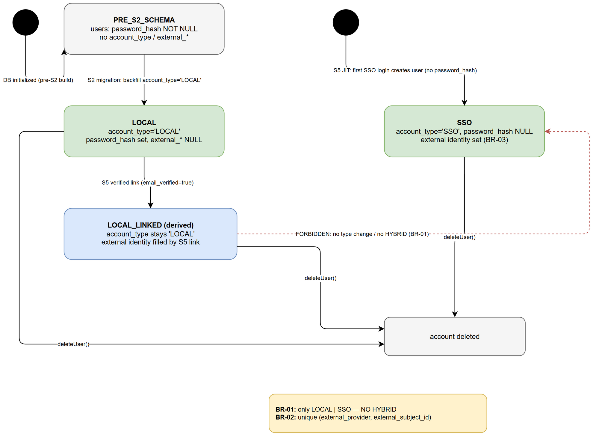
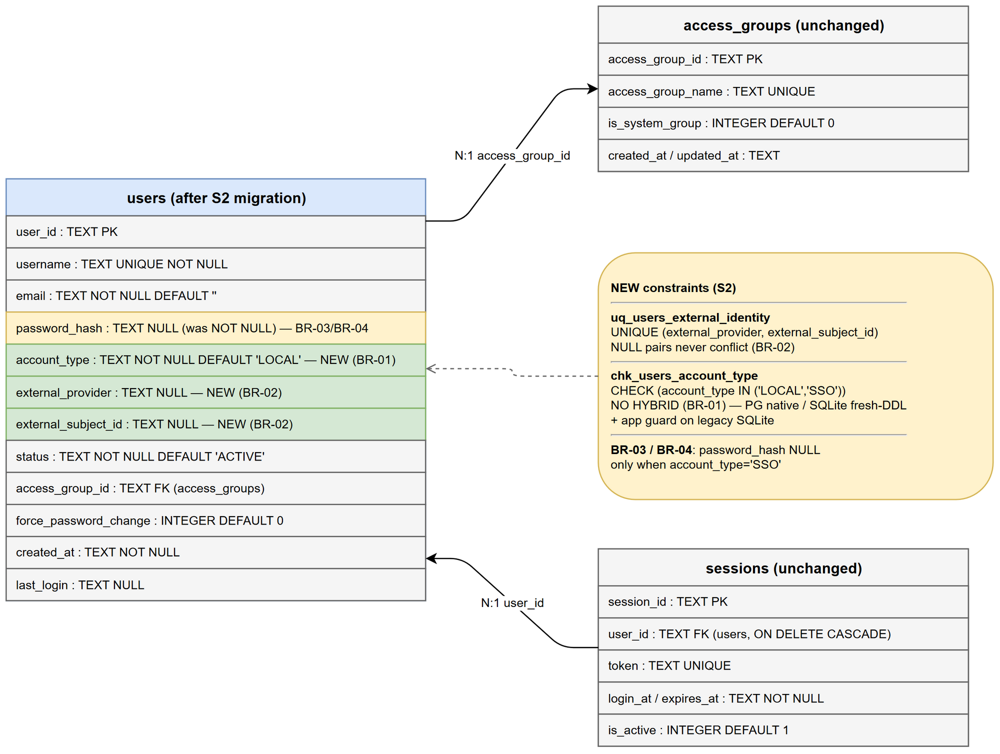
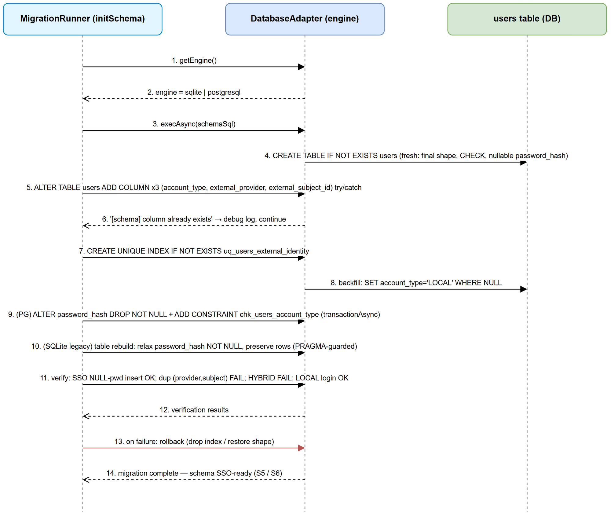

# Functional Specification Document (FSD)

## SA4E SSO Entra ID — SA4E-265 (S2): [DB] Migration account_type + external_subject_id

---

## Document Information

| Field | Value |
|-------|-------|
| Jira Ticket | SA4E-265 |
| Title | [DB] Migration: account_type (LOCAL/SSO) + external_subject_id + account linking support |
| Epic | SA4E-262 — [SSO] Tich hop Microsoft Entra ID (OIDC + PKCE) voi JIT provisioning, giu local account song song |
| Backlog Slice | S2 (Wave 1 — runs parallel with S1/SA4E-264, no dependency) |
| Author | BA Agent |
| Version | 1.0 (DRAFT — business portion) |
| Date | 2026-09-15 |
| Status | Draft — business/data portion only. Section 3.1.6 (API Contract) and Section 5 (Integration Specifications) are intentionally NOT written; TA enriches them in Phase 2 |
| Related BRD | documents/SA4E-265/BRD.md |

---

## Revision History

| Version | Date | Author | Changes |
|---------|------|--------|---------|
| 1.0 | 2026-09-15 | BA Agent | Initiate FSD draft for S2 scope only — UC-01..UC-04 (Main/Alternative/Exception flows), BR-01..BR-05, target data specs (SQLite + PostgreSQL), rollback steps table, error catalog ERR-01..ERR-08, diagrams (erd-users, sequence-migration, state-account). API Contracts + Integration left for TA enrichment |

---

## 1. Introduction

### 1.1 Purpose

This FSD specifies, at business level, HOW the SA4E-265 (S2) database migration changes the `users` table on SQLite and PostgreSQL so that two account kinds can coexist in parallel: **LOCAL** (email/password PBKDF2 — current behavior) and **SSO** (Microsoft Entra-backed, JIT-provisioned in SA4E-268/S5). It defines the use cases for running and rolling back the migration, the data-integrity business rules the new schema must enforce, the target data specification per engine, and the operator-facing error catalog.

Source inputs: documents/SA4E-265/BRD.md (US-1..US-3), documents/SA4E-SSO-Entra/PROPOSED-TICKETS.md (S2 = SA4E-265, Sec 4 locked decisions), backend/src/admin/db/schema.ts, backend/src/admin/db/users.ts.

### 1.2 Scope

In scope (S2 business portion, per ticket SA4E-265 — CHOT items):

1. UC-01..UC-04: migration on empty DB, migration with existing LOCAL users (backfill), rollback, insert of new SSO user without password_hash.
2. BR-01..BR-05: account_type whitelist (NO HYBRID), unique external identity, nullable password_hash only for SSO, mandatory password_hash for LOCAL, email linking rule (anti-duplicate).
3. Target data specification for the migrated `users` table — new columns, index, constraints — for both SQLite and PostgreSQL.
4. Rollback steps table (per engine).
5. Error catalog: duplicate external subject, constraint violation, rollback failure.
6. Diagrams: ERD (users after migration), migration sequence, account-type state lifecycle (Draw.io only).

Out of scope for THIS draft (TA enriches in Phase 2):

- Section 3.1.6 API Contract (Functional View) per use case — intentionally not written.
- Section 5 Integration Specifications — intentionally not written.
- Token verification RS256 + JWKS (S3/SA4E-266), OAuth2 callback + PKCE (S4/SA4E-267), JIT service logic (S5/SA4E-268), repository unification (S6/SA4E-269), extension PKCE/UI (S7–S9), test planning (S10), docs (S11), Entra app registration (S1/SA4E-264, S12/SA4E-271).
- Any HYBRID account type, any UNIQUE(email) constraint, any UI.

### 1.3 Definitions & Acronyms

| Term | Definition |
|------|------------|
| account_type | Account kind: `LOCAL` (password) or `SSO` (Entra-backed). No third value. |
| external_provider | Identity provider key, e.g. `entra` (lowercase). |
| external_subject_id | Stable Entra subject (`oid` preferred, fallback `sub`) uniquely identifying the user at the provider. |
| Unique external identity | The pair (external_provider, external_subject_id) — the true SSO identity key. |
| LOCAL_LINKED (derived state) | An `account_type='LOCAL'` row whose external_provider/external_subject_id have been filled by the S5 verified-email link. NOT a new account_type value — BR-01 forbids a third type. |
| Table rebuild (SQLite) | SQLite 12-step ALTER procedure: CREATE users_new → INSERT..SELECT → DROP users → RENAME → recreate indexes. Required because SQLite cannot relax a column's NOT NULL via ALTER. |
| Idempotent migration | Re-runnable DDL (`IF NOT EXISTS` / try-catch ADD COLUMN); second run is a no-op success. |
| JIT | Just-In-Time provisioning — create internal user on first SSO login (S5). |
| Operator | Backend Developer / DevOps-DBA who runs migration or rollback. Rollback is a DBA-supported operation, not an end-user feature (BRD §5.2). |

### 1.4 References

| Document | Location |
|----------|----------|
| BRD (primary input) | documents/SA4E-265/BRD.md |
| Backlog S2 source of truth | documents/SA4E-SSO-Entra/PROPOSED-TICKETS.md (S2/SA4E-265, Sec 4 locked decisions) |
| Current users DDL | backend/src/admin/db/schema.ts (schemaSql, initSchema, seedAdminUser) |
| Current user CRUD | backend/src/admin/db/users.ts |
| Adapter contract (async-only migration) | backend/src/database/adapters/DatabaseAdapter.ts |
| Schema registry reference | backend/src/database/schema-registry/sa4e-215.ts (USERS_TABLE) |
| Repository to keep compatible | backend/src/database/repositories/UserRepository.ts |

---

## 2. System Overview

### 2.1 System Context

SA4E-265 (S2) has NO external system integration: the migration executes inside the admin database bootstrap path (`initSchema()` in backend/src/admin/db/schema.ts) through the `DatabaseAdapter` async API against the active engine (`db.getEngine()` → `sqlite` | `postgresql`).

Actors:

| Actor | Role in S2 |
|-------|-----------|
| Operator (Backend Developer / DevOps-DBA) | Runs migration and rollback per environment (UC-01..UC-03) |
| System — admin bootstrap (initSchema) | Auto-applies migration on service startup |
| System — JIT Provisioning Service (S5/SA4E-268, downstream) | Consumes the migrated schema to insert SSO users / link LOCAL users (UC-04) |
| System — unified UserRepository (S6/SA4E-269, downstream) | Consumes the migrated schema; existing `users.ts` queries must keep working |

Downstream process context is covered by the BRD business-flow diagram (documents/SA4E-265/diagrams/business-flow.png). A separate FSD system-context diagram is intentionally omitted: S2 is DB-only scope with no external interfaces (see Section 5 note).

### 2.2 System Architecture (components involved)

| Component | Role | S2 Impact |
|-----------|------|-----------|
| backend/src/admin/db/schema.ts | Single source of DDL: `schemaSql(engine)` + `initSchema()` | S2 migration MUST live here (dedicated `migrateUsersSso()` called from `initSchema()` or inline) — no forked migration files |
| backend/src/database/adapters/DatabaseAdapter.ts | Only migration path: `execAsync` / `runAsync` / `getAsync` / `transactionAsync` | Sync `prepare/run/get` MUST NOT be used in migration code (they throw on PostgreSQL) |
| backend/src/admin/db/users.ts | Existing user CRUD that MUST keep working unchanged | `createUser` / `seedAdminUser` insert explicit column lists (compatible with new NOT NULL DEFAULT column); `getUsers` uses `SELECT u.*` (tolerant to new columns); `getUserByUsername` reads `password_hash` |
| backend/src/admin/db/password.ts | PBKDF2 `hashPassword()` — LOCAL only | Unchanged |
| backend/src/database/schema-registry/sa4e-215.ts | USERS_TABLE registry | Must stay consistent with migrated shape (SA/DEV to review) |
| Downstream: S5 JIT (SA4E-268), S6 repo unification (SA4E-269) | Consumers | Out of S2; S2 only provides columns + constraints |

---

## 3. Functional Requirements

### 3.1 Feature: users table SSO migration — account_type + external identity (DB)

**Source:** BRD US-1, US-2, US-3 (SA4E-265); PROPOSED-TICKETS.md S2.

#### 3.1.1 Description

The migration upgrades every environment database from the LOCAL-only `users` shape to the LOCAL + SSO shape: three new columns (`account_type`, `external_provider`, `external_subject_id`), a unique external-identity index, nullable `password_hash`, and an account_type whitelist. The migration runs on the active engine via `DatabaseAdapter` async methods only, is idempotent (re-runnable without error), backfills all pre-existing rows as LOCAL with NULL external columns, and ships a tested rollback that restores the pre-migration shape without losing any LOCAL account. All DDL lives in `backend/src/admin/db/schema.ts` (single source), following the existing `project_id` / `created_by` idempotent-migration precedent.

---

#### 3.1.2 Use Cases

---

**UC-01 — Run migration on an empty database**

**Use Case ID:** UC-01
**Actor:** Operator (Backend Developer / DevOps-DBA) — or System (`initSchema` on startup)
**Preconditions:** Fresh SQLite or PostgreSQL database; admin code with S2 deployed; `users` table empty (0 rows)
**Postconditions:** `users` has the target shape (3 new columns, nullable password_hash, unique external-identity index, account_type rule); schema is SSO-ready for S5/S6; seed data (`seedDefaults` / `seedAdminUser`) works

**Main Flow:**

| Step | Actor | System | Description |
|------|-------|--------|-------------|
| 1 | Operator starts service / runs migrate step | | `initSchema(db)` invoked on the active engine |
| 2 | | `db.getEngine()` returns `sqlite` or `postgresql` | Engine detected |
| 3 | | `execAsync(schemaSql(engine))` | `CREATE TABLE IF NOT EXISTS users` with the target shape — a fresh DB gets the final shape directly (password_hash nullable, account_type DEFAULT 'LOCAL' with CHECK) |
| 4 | | ADD COLUMN ×3 wrapped in try/catch | No-op on fresh DB (columns already exist from CREATE TABLE) — idempotent guard |
| 5 | | `CREATE UNIQUE INDEX IF NOT EXISTS uq_users_external_identity` | Unique external-identity index created |
| 6 | | `UPDATE users SET account_type='LOCAL' WHERE account_type IS NULL` | Defensive backfill — no-op (0 rows) |
| 7 | | (PG only) `ALTER COLUMN password_hash DROP NOT NULL` + `ADD CONSTRAINT chk_users_account_type` inside `transactionAsync` | SQLite fresh DB: rules already declared in CREATE TABLE (step 3) |
| 8 | | Verification probes | SSO insert with NULL password succeeds; duplicate (provider, subject) rejected; HYBRID rejected |
| 9 | | | Migration reports success — schema SSO-ready |

**Alternative Flows:**

| ID | Condition | Steps |
|----|-----------|-------|
| AF-1 | Engine = PostgreSQL | Steps 3–8 run with native ALTER/DDL inside `transactionAsync` — all-or-nothing (transactional DDL) |
| AF-2 | Engine = SQLite (fresh) | Target shape comes entirely from CREATE TABLE (CHECK + nullable password_hash included); no ALTER or rebuild needed |

**Exception Flows:**

| ID | Condition | Steps |
|----|-----------|-------|
| EF-1 | Engine detection returns an unknown engine | Abort with explicit error naming the expected engines (`sqlite`, `postgresql`) — ERR-04; no DDL executed |
| EF-2 | Any DDL or verification step fails | Stop, report the failed step + engine, attempt rollback (UC-03) — ERR-02/ERR-03; caller must never assume success |

---

**UC-02 — Run migration on a database with existing LOCAL users (backfill)**

**Use Case ID:** UC-02
**Actor:** Operator (Backend Developer / DevOps-DBA)
**Preconditions:** Existing database created by a pre-S2 build; `users` contains N ≥ 1 LOCAL users with non-null `password_hash`; admin code with S2 deployed
**Postconditions:** All N rows have `account_type='LOCAL'`, `external_provider=NULL`, `external_subject_id=NULL`; `password_hash`/`username`/`email` preserved; all existing LOCAL logins and CRUD keep working; re-run is a no-op

**Main Flow:**

| Step | Actor | System | Description |
|------|-------|--------|-------------|
| 1 | Operator starts service | | `initSchema(db)` on the active engine |
| 2 | | Inspect `users` columns (PRAGMA table_info on SQLite / information_schema on PG) | Detects missing `account_type`, `external_provider`, `external_subject_id` |
| 3 | | `ALTER TABLE users ADD COLUMN account_type TEXT NOT NULL DEFAULT 'LOCAL'` (try/catch) | Existing rows report 'LOCAL' via the column default (valid on both engines: NOT NULL + non-null default) |
| 4 | | `ADD COLUMN external_provider TEXT`; `ADD COLUMN external_subject_id TEXT` | Existing rows get NULL |
| 5 | | `CREATE UNIQUE INDEX IF NOT EXISTS uq_users_external_identity` | NULL pairs (unlinked LOCAL users) never conflict with each other (BR-02) |
| 6 | | `UPDATE users SET account_type='LOCAL' WHERE account_type IS NULL` | Defensive backfill (idempotent, re-runnable) |
| 7 | | Relax `password_hash` NOT NULL | PG: `ALTER COLUMN password_hash DROP NOT NULL`. SQLite legacy: table rebuild (12-step, inside a transaction, PRAGMA-guarded) — target shape with nullable password_hash + CHECK; rows copied preserving password_hash, username, email |
| 8 | | (PG) `ADD CONSTRAINT chk_users_account_type` | HYBRID blocked at DB level |
| 9 | | Verification probes + `SELECT` of the three new columns | Backfill verified: N rows LOCAL, external columns NULL, password_hash intact |
| 10 | | | Success — existing LOCAL logins unaffected |

**Alternative Flows:**

| ID | Condition | Steps |
|----|-----------|-------|
| AF-1 | Re-run on an already-migrated DB | All steps are no-ops (try/catch ADD COLUMN, IF NOT EXISTS, WHERE NULL backfill) — second run succeeds (idempotency proof) |
| AF-2 | SQLite legacy with a pinned version supporting DROP COLUMN (≥ 3.35) | DROP COLUMN does NOT relax a NOT NULL constraint — the table rebuild (step 7) is still required to make password_hash nullable; rebuild is the defined per-engine workaround |
| AF-3 | Engine = PostgreSQL | Whole forward migration (steps 3–8) runs inside `transactionAsync` — partial DDL never persists |

**Exception Flows:**

| ID | Condition | Steps |
|----|-----------|-------|
| EF-1 | Table rebuild fails mid-way (disk full, lock) | SQLite rebuild runs inside a transaction → automatic restore of the original table; if transaction cannot be used, documented manual DBA recovery — ERR-03 |
| EF-2 | An existing row would violate the target constraints | Abort migration, attempt rollback, report the offending row — ERR-02 |
| EF-3 | Engine detection failure | Abort with explicit error — ERR-04 |

---

**UC-03 — Rollback migration**

**Use Case ID:** UC-03
**Actor:** Operator (DevOps-DBA)
**Preconditions:** Database was migrated by S2 (fully or partially); single-runner instance (no concurrent writes); operator has DB access
**Postconditions:** `users` restored to the pre-S2 logical shape: unique index absent, added columns absent (or restored shape per engine), `password_hash NOT NULL` restored, all pre-existing LOCAL rows intact with their original `password_hash`; LOCAL login works

**Main Flow:**

| Step | Actor | System | Description |
|------|-------|--------|-------------|
| 1 | Operator initiates rollback | | Pre-check: was the DB migrated? (added columns / index present) — abort if never migrated (ERR-06) |
| 2 | | Stop accepting writes (single runner) | Prevents concurrent DDL |
| 3 | | `DROP INDEX IF EXISTS uq_users_external_identity` | Index removed (both engines) |
| 4 | | (PG) `DROP CONSTRAINT chk_users_account_type` / (SQLite) rebuild without CHECK | Account_type whitelist removed |
| 5 | | (PG) verify no NULL password_hash rows → `ALTER COLUMN password_hash SET NOT NULL` / (SQLite) rebuild with `password_hash TEXT NOT NULL` | NOT NULL restored |
| 6 | | (PG) `DROP COLUMN account_type, external_provider, external_subject_id` / (SQLite) rebuild without them | Pre-S2 shape restored |
| 7 | | Post-rollback verification | Shape = pre-S2; LOCAL login probe succeeds |
| 8 | | | Report success / any remaining objects |

**Alternative Flows:**

| ID | Condition | Steps |
|----|-----------|-------|
| AF-1 | Rollback after a FAILED (partial) migration | Same steps are idempotent (IF EXISTS / presence checks); DB left consistent — no half-added column without index or vice versa |
| AF-2 | Engine = PostgreSQL | Whole rollback inside `transactionAsync` — partial DDL never persists |

**Exception Flows:**

| ID | Condition | Steps |
|----|-----------|-------|
| EF-1 | Database was never migrated | Abort with clear message "nothing to undo" — ERR-06 |
| EF-2 | An object cannot be dropped/rebuilt (lock, dependency, permission) | Surface the object name + engine, stop, require manual DBA follow-up; do NOT retry blindly — ERR-03 |
| EF-3 | NULL password_hash rows exist at step 5 (SSO users created post-migration) | Rollback cannot restore NOT NULL without removing them: operator decision required — delete SSO rows with explicit data-loss confirmation, or abort rollback — ERR-07 |

---

**UC-04 — Insert new SSO user (no password_hash)**

**Use Case ID:** UC-04
**Actor:** System — JIT Provisioning Service (S5/SA4E-268, downstream consumer of the S2 schema); within S2 itself, exercised by the migration verification probes
**Preconditions:** Migration completed (schema SSO-ready); Entra identity (`provider='entra'`, `subject`, `email`) available from a verified token (S5)
**Postconditions:** A user row exists with `account_type='SSO'`, `password_hash=NULL`, external identity set; no duplicate external identity can exist; LOCAL users untouched

**Main Flow:**

| Step | Actor | System | Description |
|------|-------|--------|-------------|
| 1 | JIT (first SSO login) resolves identity (entra, subject) | | Lookup `users` by (external_provider, external_subject_id) |
| 2 | | No match found | Create path |
| 3 | | `INSERT INTO users (..., account_type='SSO', password_hash=NULL, external_provider='entra', external_subject_id=..., access_group_id='grp-viewer', ...)` | Row created without a password — valid per BR-03; group default `grp-viewer` is the S5 locked decision |
| 4 | | | Subsequent SSO logins reuse this row (update `last_login`) |

**Alternative Flows:**

| ID | Condition | Steps |
|----|-----------|-------|
| AF-1 (link existing LOCAL) | Identity not found by (provider, subject) but a LOCAL user with the same email exists AND Entra `email_verified=true` | S5 updates that LOCAL row: `external_provider` / `external_subject_id` filled, `account_type` STAYS 'LOCAL' (no type change — locked decision Sec 4 #3), `password_hash` stays (BR-04). The unique index now covers the linked identity |
| AF-2 | Email matches a LOCAL user but `email_verified=false` | S5 rejects — NO auto-link (locked decision Sec 4 #2); the S2 schema imposes nothing extra (BR-05) |

**Exception Flows:**

| ID | Condition | Steps |
|----|-----------|-------|
| EF-1 | A second insert uses the same (provider, subject) | Unique violation rejected on both engines — ERR-01; S5 maps it to the link-or-reject flow; never a silent overwrite |
| EF-2 | Insert with `account_type='HYBRID'` (or any value ∉ {LOCAL, SSO}) | Rejected: PG CHECK / SQLite fresh-DDL CHECK / app guard on legacy SQLite — ERR-02 (BR-01) |
| EF-3 | SSO row with NULL `external_provider` or NULL `external_subject_id` | Rejected — both fields are required together for SSO (pairing guard, BR-02) |
| EF-4 | Password login attempt against an SSO-only row (`password_hash=NULL`) | Auth layer rejects gracefully with a clear message (no crash); S2 keeps the row schema-valid; login-path behavior owned by S6 — ERR-08 |
| EF-5 | LOCAL row insert/update with NULL `password_hash` | Rejected by the application guard (BR-04) |

**Account type state lifecycle (LOCAL/SSO):**


*[Edit in draw.io](diagrams/state-account.drawio)*

---

#### 3.1.3 Business Rules

| Rule ID | Rule | Source | Enforcement |
|---------|------|--------|-------------|
| BR-01 | `account_type` accepts ONLY `LOCAL` or `SSO`. **HYBRID is explicitly forbidden** — no third value, no dual-type account. A linked LOCAL user keeps `account_type='LOCAL'`. | SA4E-265 description; PROPOSED-TICKETS.md Sec 4 #3; BRD US-2 req 1 | PostgreSQL: `CHECK chk_users_account_type`; SQLite fresh DB: CHECK inside CREATE TABLE; SQLite legacy DB: application-level guard in the repository layer + code review rule |
| BR-02 | Unique external identity: `uq_users_external_identity (external_provider, external_subject_id)`. Two rows with the same non-null pair MUST be rejected on both engines. NULL pairs (unlinked LOCAL users) MUST NOT conflict with each other. For SSO rows both fields are required together (NULL pairing enforced by app guard). | SA4E-265 AC4; BRD US-2 req 2 | UNIQUE INDEX on both engines; pairing guard in repository layer |
| BR-03 | `password_hash` is nullable at DB level ONLY for SSO rows: an SSO-only user with NULL `password_hash` is valid and MUST insert successfully. | SA4E-265 AC2; BRD US-2 req 3 | DB-level nullable + application guard for the conditional rule |
| BR-04 | A LOCAL user MUST have a non-null `password_hash`. Any insert/update setting `account_type='LOCAL'` with NULL `password_hash` is rejected. | BRD US-2 req 3 (validation rules) | Application guard in repository/service (a plain column-level NOT NULL can no longer express it); SQLite rebuild preserves existing hashes |
| BR-05 | Email linking rule (anti-duplicate): email is NOT the unique identity key once SSO exists — the identity key is (external_provider, external_subject_id). Duplicate email across a LOCAL and an SSO row is possible by design and is resolved by S5 verified-link (link only when Entra `email_verified=true`). S2 MUST NOT add UNIQUE(email), MUST NOT weaken `username UNIQUE`, and MUST NOT break the existing `DUPLICATE_USERNAME` / `DUPLICATE_EMAIL` checks (`users.ts` updateUser, `user.service.ts`). | SA4E-265 description; PROPOSED-TICKETS.md Sec 4 #2; BRD US-2 req 4 | No schema change to email/username uniqueness; JIT decision owned by S5 |

#### 3.1.4 Data Specifications

**Input Data (migration):** No external/business input — inputs are DDL constants and the existing `users` rows. Verification probes are synthetic rows (see Section 10).

**Output — target `users` table after migration (per engine):**

| # | Column | SQLite type | PostgreSQL type | Nullable | Default | Status | Constraint / Rule | Description |
|---|--------|-------------|-----------------|----------|---------|--------|-------------------|-------------|
| 1 | user_id | TEXT | TEXT | NO | — | unchanged | PRIMARY KEY | Unchanged |
| 2 | username | TEXT | TEXT | NO | — | unchanged | UNIQUE | Unchanged (BR-05) |
| 3 | email | TEXT | TEXT | NO | '' | unchanged | no new UNIQUE (BR-05) | Unchanged |
| 4 | password_hash | TEXT | TEXT | **YES ← was NO** | — | **changed** | BR-03 / BR-04 | PBKDF2 `salt:hash`; NULL only when account_type='SSO' |
| 5 | status | TEXT | TEXT | NO | 'ACTIVE' | unchanged | — | Unchanged |
| 6 | access_group_id | TEXT | TEXT | NO | — | unchanged | FK by convention | Unchanged |
| 7 | force_password_change | INTEGER | INTEGER | NO | 0 | unchanged | 0/1 | Unchanged |
| 8 | created_at | TEXT | TEXT | NO | — | unchanged | — | Unchanged |
| 9 | last_login | TEXT | TEXT | YES | — | unchanged | — | Unchanged |
| 10 | account_type | TEXT | TEXT | NO | 'LOCAL' | **NEW** | BR-01 (CHECK IN ('LOCAL','SSO')) | LOCAL \| SSO only — NO HYBRID |
| 11 | external_provider | TEXT | TEXT | YES | — | **NEW** | BR-02 (+ pairing guard) | e.g. `entra` (lowercase normalized) |
| 12 | external_subject_id | TEXT | TEXT | YES | — | **NEW** | BR-02 (+ pairing guard) | Entra `oid` (preferred) / `sub` (fallback) |

**Indexes:**

| Name | Definition | Engines | Status |
|------|-----------|---------|--------|
| uq_users_external_identity | UNIQUE (external_provider, external_subject_id) | SQLite + PostgreSQL | **NEW** |
| (username unique) | inline UNIQUE on username | both | unchanged |

**Constraints:**

| Name | Definition | SQLite | PostgreSQL |
|------|-----------|--------|------------|
| chk_users_account_type | CHECK (account_type IN ('LOCAL','SSO')) | Fresh DB: inside CREATE TABLE. Legacy DB: application guard (SQLite cannot ADD a CHECK to an existing table via ALTER) | `ALTER TABLE users ADD CONSTRAINT chk_users_account_type ...` (transactional) |
| password_hash NOT NULL (old) | removed by S2 | Legacy DB: table rebuild. Fresh DB: omitted from new DDL | `ALTER COLUMN password_hash DROP NOT NULL` |

**Compatibility notes (evidence from `users.ts` / `schema.ts`):**

- Existing INSERTs with explicit column lists (`createUser`, `seedAdminUser`) keep working because `account_type` has DEFAULT 'LOCAL' on both engines.
- `getUsers` (`SELECT u.*`) and `getUserById` (`SELECT *`) tolerate new columns without change.
- `getUserByUsername` keeps reading `password_hash` — LOCAL rows always non-null (BR-04).

Per-engine DDL sketches: Section 4.3.

#### 3.1.5 UI Specifications

**N/A — no UI.** SA4E-265 is a DB-layer migration with no user interface. Rollback is a DBA-supported operation, not an end-user feature (BRD §5.2 assumption). No wireframes.

#### 3.1.6 API Contract (Functional View)

> **NOT WRITTEN IN THIS DRAFT — INTENTIONALLY LEFT TO TA.** S2 adds no HTTP endpoints. This BA draft stops at the business/data level; TA enriches the API contracts for downstream consumers (S5 JIT insert/link data flow, S6 unified repository surface) during Phase 2 enrichment. See Section 5 note.

<!-- TA enrichment (Phase 2, TA Agent) — contracts below. BA placeholder preserved above. -->

> **TA enrichment:** Confirmed — S2 ships **no HTTP endpoints** (scope boundary §1.2 honored). The "API" of S2 is two **TypeScript in-process contracts**: **C1** — the migration contract (`up`/`down` + engine detection) consumed by `initSchema` (integration in §5.1); **C2** — the SSO repository extension consumed by S5 JIT (SA4E-268) and merged into the unified repository in S6 (SA4E-269). All functions are **async-only** via `DatabaseAdapter` — sync `prepare/run/get/exec` MUST NOT be used (they throw `UnsupportedOperationError` on PostgreSQL, §2.2). Authentication/Authorization: N/A (in-process; operator authorization per §7.1). Error translation follows the existing pattern: `translateError(err)` → typed `RepositoryError` (`backend/src/database/repositories/UserRepository.ts`).

##### Contract C1 — Users SSO Migration (up / down / engine detection)

Location: `backend/src/admin/db/schema.ts` (single DDL source, §2.2 — no forked migration files).

```ts
import type { DatabaseAdapter, DatabaseEngine } from '../../database/adapters/DatabaseAdapter.js';

export type MigrationStepName =
  | 'add-columns' | 'unique-index' | 'backfill-local'
  | 'relax-password-hash' | 'account-type-check' | 'verify-probes';

export interface MigrationStepResult {
  step: MigrationStepName;
  status: 'applied' | 'no-op' | 'failed';
  engine: DatabaseEngine;
  error?: string;              // step/object name ONLY — no data values, no secrets (§7.3)
}

export interface MigrationResult {
  engine: DatabaseEngine;
  status: 'applied' | 'no-op' | 'failed';   // 'no-op' = already-migrated re-run (TC-04)
  steps: MigrationStepResult[];
}

export interface UsersSsoMigration {
  /** Engine gate. Accepts ONLY 'sqlite' | 'postgresql'. Any other value — including
   *  'mysql' (typed on DatabaseEngine but unsupported by the admin schema) — throws
   *  ERR-04 BEFORE any DDL executes. */
  detectEngine(db: DatabaseAdapter): DatabaseEngine;
  /** Forward migration (UC-01 fresh DB, UC-02 existing DB backfill). Idempotent; safe to
   *  re-run; async-only. On failed verification probes attempts automatic down() (§5.3 H1). */
  up(db: DatabaseAdapter): Promise<MigrationResult>;
  /** Rollback (UC-03). Idempotent; operator-invoked or auto-invoked by up() on probe failure. */
  down(db: DatabaseAdapter): Promise<MigrationResult>;
}
```

Function behavior matrix:

| Function | Precondition | Success result | Error codes |
|----------|-------------|----------------|-------------|
| detectEngine | adapter connected | `'sqlite' \| 'postgresql'` | ERR-04 (abort; no DDL executed) |
| up — PG path | any | `status='applied'` (whole forward DDL inside one `transactionAsync`, all-or-nothing) or `'no-op'` | ERR-02 (constraint/verify), ERR-05 (column exists → step `'no-op'`, continue) |
| up — SQLite legacy path | `PRAGMA table_info(users)`: `password_hash` notnull=1, `account_type` absent | `status='applied'`; 12-step table rebuild inside a transaction, PRAGMA-guarded (§5.1) | ERR-02, ERR-03 (rebuild failure → manual DBA), ERR-05 |
| up — SQLite fresh path | table created by target `schemaSql` — nullable `password_hash` + CHECK present | `status='no-op'` for DDL (shape complete, UC-01 AF-2); probes still validate | ERR-02, ERR-05 |
| down | DB was migrated (else abort) | `status='applied'`; pre-S2 logical shape restored (§4.4 R0–R5) | ERR-06 (never migrated), ERR-07 (NULL password rows block NOT NULL restore), ERR-03 |

Caller obligations: `initSchema` MUST let `up()` errors propagate — startup fails loudly, never continues on a half-migrated schema (§5.3 H3). Callers MUST NOT assume success without inspecting `MigrationResult`.

##### Contract C2 — SSO repository extension of `IUserRepository`

Location (S6 merge target): `backend/src/database/repositories/interfaces.ts` — a new ISP-scoped interface alongside the existing small interfaces (`IGraphRepository`, `IUserRepository`, `IAuditRepository`); first caller is S5 JIT (SA4E-268). S2 delivers schema + columns (§4); S6 (SA4E-269) merges this into the unified repository. Existing `users.ts` CRUD is NOT changed by S2 (§2.2).

```ts
/** Full users-table row after migration (§3.1.4) — response schema for all C2 methods. */
export interface UserRow {
  user_id: string;
  username: string;
  email: string;
  password_hash: string | null;        // BR-03: NULL only for SSO rows
  status: string;
  access_group_id: string;
  force_password_change: 0 | 1;
  created_at: string;
  last_login: string | null;
  account_type: 'LOCAL' | 'SSO';       // BR-01 — no HYBRID
  external_provider: string | null;    // BR-02
  external_subject_id: string | null;  // BR-02
}

/** Input for a JIT-provisioned SSO user (UC-04 main flow). */
export interface CreateUserSSOInput {
  email: string;                 // verified Entra email (S5 gate, email_verified=true)
  name: string;                  // Entra display name — see username note below
  externalProvider: string;      // 'entra' — lowercase normalized (BR-02)
  externalSubjectId: string;     // Entra `oid` preferred / `sub` fallback (BR-02)
}

export interface ISSOUserRepository {
  /** Lookup by unique external identity (BR-02, UC-04 step 1).
   *  SQL: SELECT * FROM users WHERE external_provider = ? AND external_subject_id = ?
   *  Parameterized (no injection). NULL columns never match → unlinked LOCAL rows
   *  are unreachable by this lookup (by design). */
  findByExternalSubject(externalProvider: string, externalSubjectId: string): Promise<UserRow | null>;

  /** Create an SSO-only user (UC-04 step 3). Fixed values: account_type='SSO',
   *  password_hash=NULL (BR-03), status='ACTIVE', access_group_id='grp-viewer'
   *  (S5 locked decision), force_password_change=0. */
  createUserSSO(input: CreateUserSSOInput): Promise<UserRow>;

  /** Link a verified external identity onto an EXISTING LOCAL row (UC-04 AF-1).
   *  Updates ONLY external_provider/external_subject_id; account_type STAYS 'LOCAL'
   *  (BR-01) and password_hash is untouched (BR-04) → LOCAL_LINKED derived state (§1.3). */
  linkLocalAccount(userId: string, externalProvider: string, externalSubjectId: string): Promise<UserRow>;
}
```

Method contract matrix:

| Method | Semantics | Success | Error codes |
|--------|-----------|---------|-------------|
| findByExternalSubject | Exact-match on the unique pair (`uq_users_external_identity`) | `UserRow` or `null` | RepositoryError on DB failure |
| createUserSSO | Validate → duplicate pre-check → INSERT with explicit column list → re-read | `UserRow` with `account_type='SSO'`, `password_hash=null` | ERR-01 (duplicate pair — unique arbiter backstops the pre-check race), ERR-02 (missing provider/subject pairing, empty email) |
| linkLocalAccount | Pre-read target row: must exist AND `account_type='LOCAL'`; then `UPDATE users SET external_provider=?, external_subject_id=? WHERE user_id=?` | `UserRow` (LOCAL_LINKED) | ERR-02 (target row missing or already 'SSO' — never overwrite an SSO identity), ERR-01 (pair already held by another row) |

**username note (TA):** the `users` table has NO `name` column (§3.1.4). `CreateUserSSOInput.name` is consumed by S5 to derive `username` (recommended: email local-part, deduplicated against existing `DUPLICATE_USERNAME` semantics — BR-05); S2's contract persists `username`, not `name`. Final derivation rule is owned by S5 — SA to confirm in TDD.

**Downstream compatibility notes (evidence: `users.ts`):**
- `getUserByUsername` casts `r.password_hash as string`; on an SSO row the runtime value is `null` — the function does not crash, but callers MUST guard before the PBKDF2 compare (ERR-08, UC-04 EF-4). S6 (SA4E-269) changes the return type to `passwordHash: string | null`.
- `rowToUser` maps an explicit field list and `getUsers` uses `SELECT u.*` — both tolerant to the 3 new columns (matches §3.1.4 compatibility notes).

##### Pseudocode — createUserSSO

```ts
// Pseudocode for createUserSSO — [Implements: UC-04; BR-01, BR-02, BR-03; AC2, AC3, AC4]
async function createUserSSO(db: DatabaseAdapter, input: CreateUserSSOInput): Promise<UserRow> {
  // Step 1: Validate BEFORE hitting the DB (ERR-02)
  assertPairing(input.externalProvider, input.externalSubjectId);   // both required together (BR-02)
  assertNonEmpty(input.email);
  // Step 2: Duplicate-identity pre-check (typed error ahead of the arbiter)
  const existing = await findByExternalSubject(db, input.externalProvider, input.externalSubjectId);
  if (existing) throw typedError('ERR-01', 'duplicate external identity');
  // Step 3: INSERT with explicit columns — fixed SSO values, password_hash NULL (BR-03)
  await db.runAsync(
    `INSERT INTO users (user_id, username, email, password_hash, status, access_group_id,
                        force_password_change, created_at, account_type,
                        external_provider, external_subject_id)
     VALUES (?, ?, ?, NULL, 'ACTIVE', 'grp-viewer', 0, ?, 'SSO', ?, ?)`,
    [newUserId(), deriveUsernameFrom(input), input.email, nowIso(),
     input.externalProvider, input.externalSubjectId],
  );
  // Step 4: Re-read and return; unique arbiter backstops concurrent-race duplicates (ERR-01)
  return getByExternalSubjectOrThrow(db, input.externalProvider, input.externalSubjectId);
}
```

---

## 4. Data Model

> Physical implementation (final DDL scripts, query patterns) is finalized in TDD §4. This section pins the business-agreed target schema so SA/TA/DEV share one shape.

### 4.1 Entity Relationship Diagram


*[Edit in draw.io](diagrams/erd-users.drawio)*

The ERD shows the `users` table after migration (new columns `account_type`, `external_provider`, `external_subject_id` highlighted; `password_hash` relaxed to nullable), plus the two related entities that keep their shape (`access_groups`, `sessions`). Relationships are preserved: N:1 `users.access_group_id → access_groups`, N:1 `sessions.user_id → users` (ON DELETE CASCADE).

### 4.2 Logical Entities

#### Entity: users (after migration)

| Attribute | Type | Required | Business Rule | Description |
|-----------|------|----------|---------------|-------------|
| user_id | TEXT | Y | — | Primary key (e.g. `user-admin-001`, `user-<uuid8>`) |
| username | TEXT | Y | BR-05 (UNIQUE kept) | Login name; unchanged uniqueness |
| email | TEXT | Y | BR-05 (no new UNIQUE) | Default ''; linking decision owned by S5 |
| password_hash | TEXT | N (conditional) | BR-03 / BR-04 | PBKDF2 `salt:hash`; NULL only for SSO rows; LOCAL always non-null |
| status | TEXT | Y | — | e.g. 'ACTIVE' / 'DISABLED' |
| access_group_id | TEXT | Y | — | FK to access_groups (e.g. 'grp-admin') |
| force_password_change | INTEGER | Y | — | 0/1 |
| created_at | TEXT | Y | — | ISO timestamp |
| last_login | TEXT | N | — | ISO timestamp |
| account_type | TEXT | Y | BR-01 | 'LOCAL' \| 'SSO' only — NO HYBRID; default 'LOCAL' |
| external_provider | TEXT | N (required for SSO) | BR-02 | Provider key, e.g. 'entra' |
| external_subject_id | TEXT | N (required for SSO) | BR-02 | Entra `oid` (preferred) / `sub` |

**Relationships:**

| From Entity | To Entity | Cardinality | Description |
|-------------|-----------|-------------|-------------|
| users | access_groups | N:1 | `access_group_id` — role assignment, unchanged |
| sessions | users | N:1 | `user_id` with ON DELETE CASCADE — session lifecycle, unchanged |

#### Entity: access_groups (unchanged)

| Attribute | Type | Required | Description |
|-----------|------|----------|-------------|
| access_group_id | TEXT | Y | PK, e.g. 'grp-viewer' (S5 JIT default) |
| access_group_name | TEXT | Y | UNIQUE |
| is_system_group | INTEGER | Y | 0/1 |
| created_at / updated_at | TEXT | Y | Timestamps |

#### Entity: sessions (unchanged)

| Attribute | Type | Required | Description |
|-----------|------|----------|-------------|
| session_id | TEXT | Y | PK |
| user_id | TEXT | Y | FK → users (ON DELETE CASCADE) |
| token | TEXT | Y | UNIQUE |
| login_at / expires_at | TEXT | Y | Session window |
| is_active | INTEGER | Y | 0/1 |

### 4.3 Target Schema DDL — per engine (sketch for TDD to finalize)

**SQLite — fresh DB (target shape directly in `schemaSql`):**

```sql
CREATE TABLE IF NOT EXISTS users (
  user_id TEXT PRIMARY KEY,
  username TEXT UNIQUE NOT NULL,
  email TEXT NOT NULL DEFAULT '',
  password_hash TEXT,                          -- nullable (BR-03); BR-04 guarded in app layer
  status TEXT NOT NULL DEFAULT 'ACTIVE',
  access_group_id TEXT NOT NULL,
  force_password_change INTEGER NOT NULL DEFAULT 0,
  created_at TEXT NOT NULL,
  last_login TEXT,
  account_type TEXT NOT NULL DEFAULT 'LOCAL'
    CHECK (account_type IN ('LOCAL','SSO')),   -- BR-01 (fresh DBs)
  external_provider TEXT,                      -- BR-02
  external_subject_id TEXT                     -- BR-02
);

CREATE UNIQUE INDEX IF NOT EXISTS uq_users_external_identity
  ON users(external_provider, external_subject_id);
```

**SQLite — legacy DB (idempotent ALTER + table rebuild):**

```sql
-- 1) Additive columns (idempotent, try/catch per existing '[schema] column already exists' pattern)
ALTER TABLE users ADD COLUMN account_type TEXT NOT NULL DEFAULT 'LOCAL';
ALTER TABLE users ADD COLUMN external_provider TEXT;
ALTER TABLE users ADD COLUMN external_subject_id TEXT;

-- 2) Unique external-identity index (idempotent)
CREATE UNIQUE INDEX IF NOT EXISTS uq_users_external_identity
  ON users(external_provider, external_subject_id);

-- 3) Relax password_hash NOT NULL — SQLite CANNOT ALTER a NOT NULL constraint:
--    table rebuild, run inside a transaction; detect need via PRAGMA table_info (notnull flag)
PRAGMA table_info(users);
CREATE TABLE users_new ( ...same target shape as fresh DDL above, incl. CHECK... );
INSERT INTO users_new (user_id, username, email, password_hash, status, access_group_id,
                       force_password_change, created_at, last_login,
                       account_type, external_provider, external_subject_id)
SELECT user_id, username, email, password_hash, status, access_group_id,
       force_password_change, created_at, last_login,
       account_type, external_provider, external_subject_id
FROM users;
DROP TABLE users;
ALTER TABLE users_new RENAME TO users;

-- 4) Defensive backfill (idempotent)
UPDATE users SET account_type='LOCAL' WHERE account_type IS NULL;
```

> Note: legacy SQLite rows get no CHECK from ALTER (BR-01 relies on the app guard + fresh-DB CHECK); the rebuild re-applies CHECK because `users_new` carries it. The rebuild is REQUIRED on legacy SQLite — without it, AC2 (SSO insert without password_hash) fails against the old NOT NULL constraint (see Change Log from BRD #1).

**PostgreSQL (transactional):**

```sql
-- via transactionAsync (all-or-nothing)
ALTER TABLE users ADD COLUMN account_type TEXT NOT NULL DEFAULT 'LOCAL';
ALTER TABLE users ADD COLUMN external_provider TEXT;
ALTER TABLE users ADD COLUMN external_subject_id TEXT;
CREATE UNIQUE INDEX IF NOT EXISTS uq_users_external_identity
  ON users(external_provider, external_subject_id);
UPDATE users SET account_type='LOCAL' WHERE account_type IS NULL;
ALTER TABLE users ALTER COLUMN password_hash DROP NOT NULL;
ALTER TABLE users ADD CONSTRAINT chk_users_account_type
  CHECK (account_type IN ('LOCAL','SSO'));
```

> All statements are idempotent-guarded in code: try/catch ADD COLUMN (existing schema.ts pattern), `IF NOT EXISTS` for the index, `WHERE account_type IS NULL` for the backfill. Rollback statements mirror this (see §4.4).

### 4.4 Rollback Steps

Object-by-object rollback table (process narrative in §6.2):

| Step | Action — SQLite | Action — PostgreSQL | Verification |
|------|-----------------|---------------------|--------------|
| R0 | Pre-check: DB was migrated (columns/index present); stop writes (single runner) | Same | Rollback aborts with "nothing to undo" if never migrated (ERR-06) |
| R1 | `DROP INDEX IF EXISTS uq_users_external_identity` | Same | Index absent |
| R2 | Rebuild without CHECK (users_new w/o CHECK → copy → drop → rename) | `ALTER TABLE users DROP CONSTRAINT chk_users_account_type` | Constraint absent |
| R3 | Rebuild with `password_hash TEXT NOT NULL` (fails if NULL rows exist → ERR-07 decision point) | Verify `SELECT COUNT(*) WHERE password_hash IS NULL = 0` → `ALTER COLUMN password_hash SET NOT NULL` | NOT NULL restored; no NULL rows |
| R4 | Rebuild without `account_type`, `external_provider`, `external_subject_id` | `ALTER TABLE users DROP COLUMN account_type, external_provider, external_subject_id` (three statements) | Pre-S2 shape restored (9 columns) |
| R5 | Post-rollback verification + report | Same | LOCAL login probe OK; report success / remaining objects (ERR-03) |

> PG rollback SHOULD run inside `transactionAsync` so partial DDL never persists. SQLite rebuilds run inside a transaction per rebuild step.

---

## 5. Integration Specifications

> **NOT WRITTEN IN THIS DRAFT — INTENTIONALLY LEFT TO TA (Phase 2 enrichment).** S2 introduces no external integrations: no network calls, no secrets, no tokens beyond existing user rows (BRD US-3 req 6). TA will specify the integration views for downstream consumers — S5 JIT ↔ `users` table data flow (Entra claims → `external_subject_id` mapping), S6 unified repository surface — in the enriched FSD.

<!-- TA enrichment (Phase 2, TA Agent) — integration views below. BA placeholder preserved above. -->

> **TA enrichment:** Confirmed — S2 has **zero external/network integrations** (BRD US-3 req 6). Everything below is **in-process**: the migration runner ↔ `DatabaseAdapter` (§5.1), idempotency detection (§5.2), rollback hooks (§5.3), and the data-flow contract for downstream consumers S5/S6 (§5.4, contract only — out of S2 build scope). No secrets, tokens, or PII cross a process boundary in S2 (§7.3).

### 5.1 Migration runner integration (SQLite rebuild path + PostgreSQL ALTER path)

**Call site:** `initSchema(db)` in `backend/src/admin/db/schema.ts` — `migrateUsersSso()` (Contract C1 `up()`, §3.1.6) is invoked after `execAsync(schemaSql(engine))`, alongside the existing idempotent migrations (`project_id` / `created_by` precedent, §2.2). Single DDL source; no forked migration files. Request/response schema: the in-process `MigrationResult` contract (§3.1.6 C1) — no HTTP layer in S2.

**Per-engine forward paths:**

| Aspect | PostgreSQL (ALTER path) | SQLite legacy (REBUILD path) | SQLite fresh |
|--------|------------------------|------------------------------|--------------|
| Trigger state | `information_schema.columns`: `account_type` absent | `PRAGMA table_info(users)`: `account_type` absent AND `password_hash` notnull=1 | Target shape from CREATE TABLE |
| Column adds | `ALTER TABLE users ADD COLUMN` ×3 inside `transactionAsync` | `ALTER TABLE users ADD COLUMN` ×3, try/catch each (ERR-05 pattern) | none — CREATE TABLE carries the final shape |
| password_hash relax | `ALTER COLUMN password_hash DROP NOT NULL` (transactional) | **12-step table rebuild** inside a transaction — REQUIRED (Change Log #1: SQLite cannot ALTER away NOT NULL) | none — column declared nullable |
| account_type rule | `ADD CONSTRAINT chk_users_account_type` (transactional) | CHECK re-applied via the `users_new` DDL (§4.3) | CHECK in CREATE TABLE |
| Index | `CREATE UNIQUE INDEX IF NOT EXISTS` inside transaction | **(re)create AFTER the rebuild** — see TA ordering note below | `CREATE UNIQUE INDEX IF NOT EXISTS` |
| Atomicity | Whole forward migration in one `transactionAsync` — all-or-nothing (UC-02 AF-3) | Each rebuild (copy → drop → rename) in its own transaction; additive ALTERs individually atomic | Single statements |
| Data safety | Metadata-only default on PG 11+ — no table rewrite (§8) | `INSERT..SELECT` preserves every row (TC-14) | 0 rows |

> **TA Note (ordering fix for the §4.3 sketch):** in the §4.3 legacy-SQLite sketch the unique index is created (step 2) BEFORE the rebuild (step 3) — `DROP TABLE users` would silently drop `uq_users_external_identity` together with the table. The runner MUST create/recreate the index **after** the rebuild (or recreate it post-rename). Execution order pinned here for DEV: additive columns → rebuild (transaction) → recreate index → backfill. §4.3 sketch retained per TA rules (do not delete BA content); TDD must apply this order.

> **TA Note (foreign_keys guard for the rebuild):** `DROP TABLE users` targets the parent of `sessions.user_id` (ON DELETE CASCADE). With `PRAGMA foreign_keys=ON` the drop can cascade-delete live sessions (data loss) or fail. The runner MUST: (1) `PRAGMA foreign_keys=OFF` — executed **outside** the transaction (PRAGMA is a no-op inside one); (2) run the rebuild transaction; (3) re-enable `PRAGMA foreign_keys=ON`. On PostgreSQL, FK-safe ordering is inherent to the single transaction.

**Error handling per integration point:**

| Integration point | Error scenario | Handling |
|-------------------|----------------|----------|
| `initSchema` → `up()` | unknown engine | ERR-04 — abort before any DDL |
| `initSchema` → `up()` (PG) | any statement fails | `transactionAsync` auto-rollback; error propagates → startup fails loudly (never assume success) |
| `initSchema` → `up()` (SQLite) | rebuild fails mid-way (disk full, lock) | transaction restore of the original table; ERR-03 — manual DBA follow-up |
| `up()` verification probes | SSO insert / duplicate / HYBRID probe fails | ERR-02 — auto-rollback via `down()`, then rethrow (§5.3 H1) |
| `up()` re-run | columns already exist | ERR-05 — step `'no-op'`, continue (idempotency, TC-04) |

### 5.2 Idempotency check (schema state detection)

**Chosen mechanism: engine-native catalog inspection — NOT a `schema_version` table.** Rationale: S2 touches one table and keeps scope minimal; versioned migration history is an S6+ concern (SA to review). Detection is stateless and works on any DB age.

| Engine | Detection query | Fields read |
|--------|-----------------|-------------|
| SQLite | `PRAGMA table_info(users)` | `name` (presence of `account_type`), `notnull` flag on `password_hash` |
| PostgreSQL | `SELECT column_name, is_nullable FROM information_schema.columns WHERE table_name = 'users'` | presence of `account_type`; `is_nullable='NO'` on `password_hash` |

**Decision table (detected state → path):**

| Detected state | Forward path | Result |
|----------------|--------------|--------|
| `account_type` absent + `password_hash NOT NULL` | Legacy: full path — columns → rebuild [SQLite] / transactional ALTER [PG] → index (after rebuild) → backfill | `'applied'` |
| `account_type` absent + `password_hash` nullable | Partial: columns → index → backfill (no rebuild needed) | `'applied'` |
| `account_type` present + index present | No-op — skip DDL steps; probes still validate (transactional, zero-persist — see below) | `'no-op'` (TC-04) |
| `account_type` present + index absent | Repair: create index only (partial-migration recovery — UC-03 AF-1 symmetry) | `'applied'` |

Per-statement guards remain as backstops even if detection is bypassed: try/catch ADD COLUMN (ERR-05), `CREATE UNIQUE INDEX IF NOT EXISTS`, `UPDATE … WHERE account_type IS NULL` backfill — a second full run is still a no-op success. **Verification probes are transactional insert→verify→ROLLBACK** (SSO-probe row with NULL password → expect success; duplicate pair → expect ERR-01; HYBRID → expect ERR-02): zero persisted rows, safe on every startup, no synthetic-row pollution.

### 5.3 Rollback hooks

| Hook | Trigger | Behavior |
|------|---------|----------|
| H1 — auto-rollback on failed verification | `up()` probe failure (§6.1 step 7) | `down()` invoked automatically; result logged (engine, failed step — no data values); original error rethrown — never silent success |
| H2 — operator-invoked `down()` | DBA runbook / failed rollout (UC-03) | Pre-checks: never-migrated → ERR-06 abort; NULL `password_hash` rows at R3 → ERR-07 operator decision (delete SSO rows with explicit data-loss confirmation, or abort) |
| H3 — startup fail-loud guard | `initSchema` receives any `up()` failure | Error propagates; service refuses to start on a half-migrated schema — no half-added column without index (UC-03 AF-1) |
| H4 — SQLite per-rebuild transactions | each rollback rebuild (§4.4 R2–R4) | copy → drop → rename inside one transaction; `PRAGMA foreign_keys` guard as §5.1 |
| H5 — PG rollback transaction | whole `down()` | single `transactionAsync` — partial DDL never persists (§4.4 note) |

### 5.4 Downstream consumer data flow (S5 JIT / S6 repository) — contract only, out of S2 build scope

**S5 JIT (SA4E-268) → `users` table** — claims-to-columns mapping; the only sanctioned write path is Contract C2 (§3.1.6):

| Entra claim | Target column | Rule |
|-------------|---------------|------|
| `oid` (preferred) / `sub` (fallback) | `external_subject_id` | stable provider subject (BR-02) |
| issuer/tenant constant | `external_provider` | normalized `'entra'` lowercase |
| `email` (verified) | `email` | link gate: `email_verified=true` only (UC-04 AF-1/AF-2) |
| `name` | `username` (derived) | derivation owned by S5 — see §3.1.6 username note |
| — | `password_hash` | NULL on create (BR-03); untouched on link (BR-04) |
| — | `account_type` | `'SSO'` on create; STAYS `'LOCAL'` on link (BR-01, locked decision Sec 4 #3) |
| — | `access_group_id` | default `'grp-viewer'` (S5 locked decision) |

**S6 repo unification (SA4E-269):** merges `ISSOUserRepository` into the unified `IUserRepository` (ISP, `interfaces.ts`); S2 changes nothing in `users.ts` CRUD (§2.2 compatibility notes).

**No other integration points exist in S2** — no HTTP endpoints, no message queues, no external secrets. §5 scope boundary closed.

##### Pseudocode — runMigration(engine)

```ts
// Pseudocode for runMigration — [Implements: UC-01, UC-02, UC-03; AC1, AC5; Contract C1 up()]
async function runMigration(db: DatabaseAdapter): Promise<MigrationResult> {
  // Step 1: Engine gate — abort before any DDL (ERR-04)
  const engine = detectEngine(db);              // only 'sqlite' | 'postgresql' pass
  // Step 2: Idempotency detection (§5.2 — PRAGMA table_info / information_schema)
  const state = await detectSchemaState(db, engine);
  // Step 3: Forward path per engine
  if (engine === 'postgresql') {
    await db.transactionAsync(async () => {     // all-or-nothing (UC-02 AF-3)
      await addColumns(db); await backfillLocal(db);
      await relaxPasswordHashPg(db); await addAccountTypeCheckPg(db);
      await createUniqueIndex(db);
    });
  } else {
    await db.execAsync('PRAGMA foreign_keys = OFF');   // outside txn — §5.1 FK guard
    await addColumnsTryCatch(db);                // ERR-05: swallow + '[schema] column already exists' debug log
    if (state === 'legacy-not-null')
      await db.transactionAsync(() => rebuildUsersTable(db));  // 12-step rebuild (§4.3, Change Log #1)
    await createUniqueIndex(db);                 // AFTER rebuild — TA ordering note (§5.1)
    await backfillLocal(db);                     // UPDATE ... WHERE account_type IS NULL
    await db.execAsync('PRAGMA foreign_keys = ON');
  }
  // Step 4: Verification probes — transactional insert→verify→ROLLBACK, zero-persist (§5.2)
  const probes = await db.transactionAsync(() => runVerificationProbes(db, engine));
  if (!probes.ok) {
    await down(db);                              // Hook H1 — auto-rollback (§5.3)
    throw typedError('ERR-02', `verification failed: ${probes.failedStep}`);
  }
  return { engine, status: state === 'target-shape' ? 'no-op' : 'applied', steps: probes.steps };
}
```

---

## 6. Processing Logic

### 6.1 Migration execution (migrateUsersSso / initSchema path)

**Trigger:** Service startup bootstrap (`initSchema`) or an explicit migrate step run by the operator — final trigger to be confirmed by SA/DEV (BRD §1.3, both engines tested).
**Schedule:** On-demand / startup; not a recurring batch job.
**Input:** Active `DatabaseAdapter` (engine detected at runtime); existing `users` rows.
**Output:** Migrated `users` table; success/failure report naming the failed step + engine.

**Processing Steps:**

| Step | Description | Error Handling |
|------|-------------|----------------|
| 1 | Detect engine via `db.getEngine()`; abort if unknown | ERR-04 — abort naming expected engines (`sqlite`, `postgresql`) |
| 2 | `CREATE TABLE IF NOT EXISTS users` (target shape — fresh DBs get the final shape directly) | Idempotent |
| 3 | `ALTER TABLE users ADD COLUMN` ×3 in try/catch (existing `[schema] column already exists` pattern from `project_id` / `created_by`) | Idempotent — swallow + debug log (ERR-05) |
| 4 | `CREATE UNIQUE INDEX IF NOT EXISTS uq_users_external_identity` with engine-appropriate syntax | ERR-02 — abort + rollback on failure |
| 5 | Backfill `UPDATE users SET account_type='LOCAL' WHERE account_type IS NULL`; SQLite legacy: table rebuild to relax `password_hash` NOT NULL (inside a transaction, PRAGMA-guarded) | ERR-02/ERR-03 — abort + restore |
| 6 | (PG only) `ALTER COLUMN password_hash DROP NOT NULL` + `ADD CONSTRAINT chk_users_account_type` inside `transactionAsync` | ERR-02 — abort + rollback (transactional) |
| 7 | Verification probes: SSO insert with NULL password succeeds; duplicate (provider, subject) rejected; HYBRID rejected; existing LOCAL login still works | Any fail → ERR-02 + automatic rollback attempt (UC-03) |
| 8 | Report success — schema SSO-ready for S5 (JIT) and S6 (repo unification) | — |

**Sequence Diagram:**


*[Edit in draw.io](diagrams/sequence-migration.drawio)*

### 6.2 Rollback procedure

**Trigger:** Operator/DBA decision after a failed verification or a post-rollout issue. On migration failure the runner attempts automatic rollback and reports the failing AC; on rollback failure it surfaces the object and requires manual DBA follow-up — never blind retries (BRD US-3).

Steps follow the object-by-object table in §4.4 (R0–R5). Guard rails:

| Guard | Behavior |
|-------|----------|
| Never-migrated DB | Abort "nothing to undo" (ERR-06) |
| PostgreSQL | Whole rollback inside `transactionAsync` — partial DDL never persists |
| SQLite | Each rebuild step runs inside a transaction (copy → drop → rename) |
| Object cannot be dropped/rebuilt | Stop, surface object name + engine, manual DBA follow-up (ERR-03) |
| NULL password_hash rows present (SSO users created post-migration) | Operator decision: delete SSO rows with explicit data-loss confirmation, or abort rollback (ERR-07) |

---

## 7. Security Requirements

### 7.1 Authentication & Authorization

| Role | Permissions | Screens/Features |
|------|-------------|------------------|
| Operator (Backend Dev / DevOps-DBA) | Execute migration + rollback | DB bootstrap path; no HTTP surface in S2 |
| Application services (S5 JIT, S6 repo, admin CRUD) | Insert LOCAL (password required, BR-04) / SSO (password NULL, BR-03) users; link per BR-05 | `users` CRUD, JIT provisioning |

### 7.2 Data Sensitivity Classification

| Data Type | Classification | Business Requirement |
|-----------|---------------|---------------------|
| password_hash | Restricted | PBKDF2 `salt:hash`; never logged; NULL reachable only via the BR-03 path; LOCAL auth never weakened (BR-04) |
| external_subject_id | Internal | Pseudonymous provider identifier (Entra `oid`/`sub`); stored opaquely; no PII beyond linkage |
| external_provider | Internal | Lowercase provider key (`entra`) |
| email / username | Internal | Uniqueness semantics unchanged (BR-05) |

### 7.3 Audit Trail

| Event | Logged Fields | Retention | Business Reason |
|-------|--------------|-----------|-----------------|
| Migration start / steps / success | engine, steps applied (no data values, no secrets) | Server logs (pino/console) | Operator traceability (BRD US-3) |
| Migration failure + rollback result | failed step, engine, failing object (no secrets, no PII) | Server logs | DBA follow-up |
| (S5, out of S2) JIT create/link | `audit_log` rows per S5/S8 | Per S5/S8 | Account lifecycle audit |

No new secrets, tokens, or PII beyond existing user rows are introduced by this migration (BRD US-3 req 6).

---

## 8. Non-Functional Requirements

| Category | Business Requirement | Acceptance Criteria |
|----------|---------------------|---------------------|
| Performance | Additive ALTER + single index build; no full table rewrite on PG (PG 11+ metadata-only default); SQLite rebuild only where required (legacy NOT NULL relaxation / rollback path) | Migration completes on typical admin DB sizes (BRD §6) |
| Availability | Zero loss of existing LOCAL accounts | Backfill preserves all rows; failure → rollback; rollback → LOCAL login works (TC-13) |
| Data integrity | Constraints hold on both engines | TC-05..TC-09, TC-15 pass on SQLite AND PostgreSQL |
| Maintainability | Single DDL source (`schema.ts`), per-engine branches isolated, async-only API | No forked migration files; no sync API on the PG path |
| Portability | Identical logical outcome on both engines | Same columns, same index name, same defaults |
| Idempotency | Re-run without error on already-migrated DB | TC-04 passes on both engines |

---

## 9. Error Handling (Operator-Facing)

### 9.1 Error Catalog

| Code | Scenario | Severity | Message / Behavior | System Action | BR / UC Ref |
|------|----------|----------|--------------------|---------------|-------------|
| ERR-01 | Duplicate external identity — second row with the same (external_provider, external_subject_id) | High | Unique violation on `uq_users_external_identity` surfaced as a typed error; never a silent overwrite | Insert rejected on both engines; S5 maps to link-or-reject flow | BR-02 / UC-04 EF-1 |
| ERR-02 | Constraint violation — `account_type` ∉ {LOCAL, SSO} (incl. HYBRID); SSO row missing provider/subject; LOCAL row with NULL password_hash; legacy row violating target CHECK | High | Reject before hitting the DB where possible with message naming allowed values (`account_type must be LOCAL or SSO (HYBRID is not allowed)`); DB CHECK otherwise | Reject insert/update; migration aborts + rollback if during migration | BR-01/03/04 / UC-04 EF-2, EF-3, EF-5 / UC-02 EF-2 |
| ERR-03 | Rollback failure — object cannot be dropped/rebuilt (lock, dependency, permission, disk) | Critical | Surface object name + engine; stop; require manual DBA follow-up; do NOT retry blindly | Halt rollback; report inconsistent objects | UC-03 EF-2 / §6.2 |
| ERR-04 | Engine detection failure — `getEngine()` returns an unknown engine | Critical | Abort with explicit error naming the expected engines (`sqlite`, `postgresql`) | No DDL executed | UC-01 EF-1 / UC-02 EF-3 |
| ERR-05 | Column already exists (idempotent re-run) | Info (not an error) | `[schema] column already exists` debug log; continue | Swallow + continue (existing schema.ts pattern) | UC-02 AF-1 |
| ERR-06 | Rollback on a never-migrated DB | Warning | Abort with clear message "nothing to undo" | No DDL executed | UC-03 EF-1 |
| ERR-07 | Rollback blocked by post-migration SSO rows (NULL password_hash prevents NOT NULL restore) | Critical | Operator decision required: delete SSO rows (explicit data-loss confirmation) or abort rollback | Halt at rollback step R3 (§4.4) | UC-03 EF-3 |
| ERR-08 | Password login attempt against an SSO-only row (password_hash NULL) | Warning | Auth layer rejects gracefully with a clear message (no crash) | Row remains schema-valid; login-path behavior owned by S6 | UC-04 EF-4 |

### 9.2 Notification Requirements

| Event | Who is Notified | Channel | Timing |
|-------|----------------|---------|--------|
| Migration failure / rollback executed | Backend team, DevOps | Server logs (pino/console) — no email/SMS in S2 | Immediate |
| Rollback requiring manual DBA follow-up | DevOps-DBA | Server logs + deployment runbook follow-up | Immediate |

---

## 10. Testing Considerations

### 10.1 Test Scenarios (both engines unless noted)

| ID | Scenario | Input | Expected Output | Priority | AC |
|----|----------|-------|-----------------|----------|-----|
| TC-01 | Fresh SQLite migrate | Empty SQLite DB | Target shape; 3 new columns; unique index; probes pass | High | AC1 |
| TC-02 | Fresh PostgreSQL migrate | Empty PG DB | Same as TC-01 + CHECK constraint present | High | AC1 |
| TC-03 | Migrate existing DB with N LOCAL users | Pre-S2 DB, N ≥ 1 rows with password hashes | All rows `account_type='LOCAL'`, external NULL, password_hash preserved | High | AC1 |
| TC-04 | Idempotent re-run ×2 | Migrated DB | Second run no-op success, both engines | High | AC1 |
| TC-05 | SSO-only insert without password | `account_type='SSO'`, `password_hash=NULL` | Insert succeeds | High | AC2 |
| TC-06 | HYBRID rejected | `account_type='HYBRID'` | Rejected (CHECK / app guard) on both engines | High | AC3 |
| TC-07 | Duplicate external subject rejected | Two inserts with same (entra, subject) | Second insert rejected on both engines | High | AC4 |
| TC-08 | LOCAL with NULL password rejected | `account_type='LOCAL'`, `password_hash=NULL` | Rejected by app guard | High | AC2 / BR-04 |
| TC-09 | NULL pairs coexist | Multiple LOCAL rows with external NULL | No unique-index conflict | High | BR-02 |
| TC-10 | Rollback after successful migration | Migrated DB | Pre-S2 shape restored; LOCAL login works | High | AC5 |
| TC-11 | Rollback after FAILED migration | Partial DDL state | Consistent state (no half-added objects) | High | AC5 |
| TC-12 | seedAdminUser / seedDefaults after migration | Fresh + migrated DB | Admin seed works; explicit INSERT column list compatible | Medium | BRD US-3 req 5 |
| TC-13 | Existing LOCAL login post-migration & post-rollback | Valid credentials | Login OK; `getUserByUsername` returns hash | High | AC5 |
| TC-14 | SQLite legacy rebuild preserves data | Legacy DB with rows | Rows identical after rebuild (password_hash, username, email) | High | AC1 / AC2 |
| TC-15 | SSO row missing provider or subject | `external_provider=NULL`, subject set | Rejected (pairing guard) | Medium | BR-02 |

---

## 11. Appendix

### Diagram Index

| # | Diagram | Image | Source (editable) |
|---|---------|-------|-------------------|
| 1 | ERD — users after S2 migration | [erd-users.png](diagrams/erd-users.png) | [erd-users.drawio](diagrams/erd-users.drawio) |
| 2 | Migration sequence | [sequence-migration.png](diagrams/sequence-migration.png) | [sequence-migration.drawio](diagrams/sequence-migration.drawio) |
| 3 | Account type state lifecycle (LOCAL/SSO) | [state-account.png](diagrams/state-account.png) | [state-account.drawio](diagrams/state-account.drawio) |

### Change Log from BRD

1. **SQLite legacy forward path (key clarification):** BRD Step 2 described only "additive ALTER"; this FSD pins that relaxing `password_hash` NOT NULL on a legacy SQLite DB REQUIRES a table rebuild (SQLite cannot ALTER a NOT NULL constraint). Without it, AC2 (SSO insert without password_hash) fails on legacy SQLite DBs. SA/DEV to confirm the pinned SQLite version and implement the rebuild inside a transaction (TC-14).
2. **UC breakdown:** BRD's 3 user stories are elaborated into 4 use cases (UC-01 fresh DB, UC-02 existing DB/backfill, UC-03 rollback, UC-04 SSO insert) per FSD convention.
3. **LOCAL_LINKED derived state** introduced from locked decisions (PROPOSED-TICKETS Sec 4 #2–#3): linking fills `external_provider`/`external_subject_id` on the LOCAL row while `account_type` stays 'LOCAL'. Exact persistence to be confirmed by SA in TDD.
4. **Error codes** ERR-01..ERR-08 assigned (BRD had no catalog).
5. **API Contract (§3.1.6) and Integration (§5) intentionally not written** — TA enrichment; S2 scope boundary honored (no HTTP endpoints, no external integrations in S2).

### AC Traceability (SA4E-265 — 5 criteria)

| AC | Criterion (ticket wording) | UC | BR | TC |
|----|---------------------------|----|----|-----|
| AC1 | Migration chay duoc tren ca SQLite & PostgreSQL | UC-01, UC-02, UC-03 | BR-01, BR-02 | TC-01..TC-04, TC-14 |
| AC2 | User SSO khong can password_hash | UC-04 | BR-03, BR-04 | TC-05, TC-08, TC-14 |
| AC3 | account_type chi nhan LOCAL hoac SSO (khong HYBRID) | UC-04 | BR-01 | TC-06 |
| AC4 | Khong the tao 2 user cung external subject | UC-04 | BR-02 | TC-07, TC-09, TC-15 |
| AC5 | Co rollback | UC-03 | — | TC-10, TC-11, TC-13 |

Coverage: 5/5 ACs mapped to UCs/BRs/TCs. No AC left uncovered. No HYBRID anywhere in this FSD.
