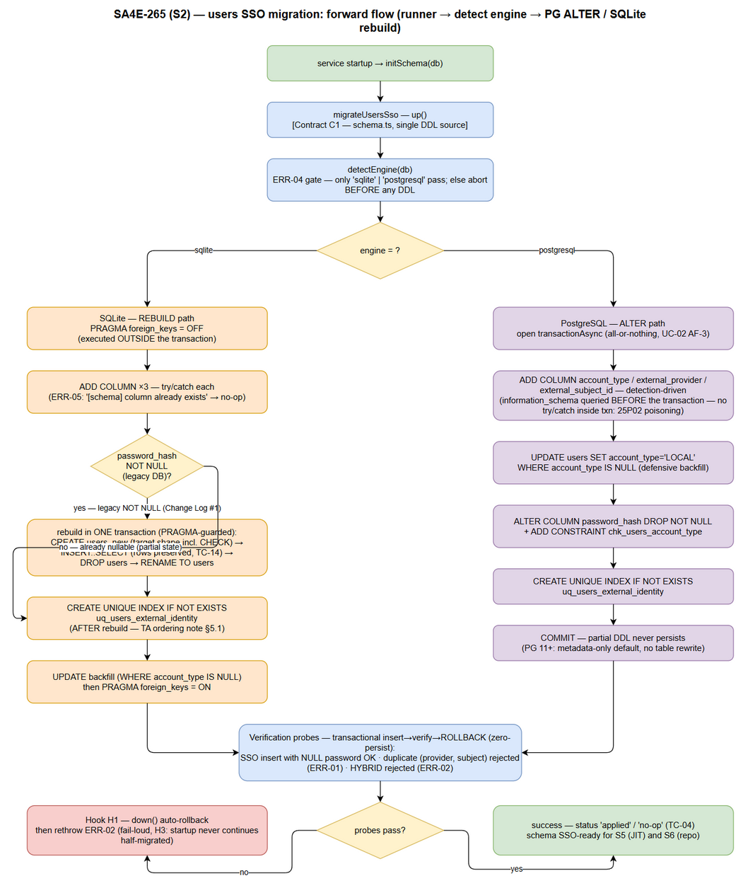
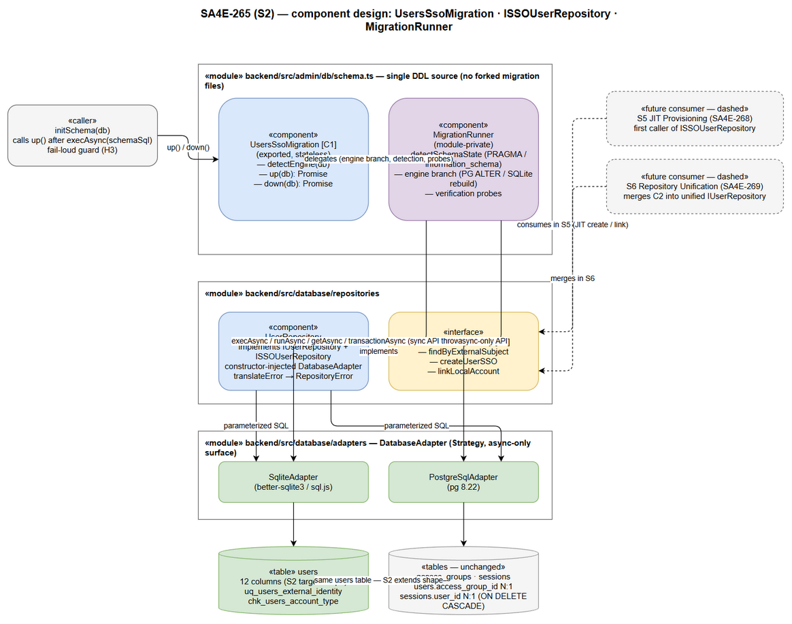

# TDD — SA4E-265 [DB] Migration: account type (LOCAL/SSO) + external subject id

| Field | Value |
|-------|-------|
| Ticket | SA4E-265 |
| Epic | SA4E-262 |
| Type | Task |
| Labels | sso, db, backend, auth |
| Version | 1.0 |
| Date | 2026-09-15 |
| References | FSD-v1 (920 lines), BRD-v1 |

---

## 1. Architecture Overview

- Migration layer targets the `users` table only; no other tables are altered in this task.
- Per-engine strategy is detected at runtime before any DDL is executed:
  - **PostgreSQL**: transactional `ALTER TABLE` — additive columns + unique index in one transaction.
  - **SQLite (legacy table)**: legacy table rebuild — `users_new` → `INSERT SELECT` → `DROP users` → `RENAME` → `CREATE INDEX`, wrapped in a transaction and guarded by `PRAGMA foreign_keys=OFF`.
  - **SQLite (fresh database)**: direct `CREATE TABLE` with the new schema — no rebuild needed.
- Runner call site: `initSchema` in `backend/src/admin/db/schema.ts` — the migration is registered as a named step (`users_sso`) and invoked during schema initialization.
- Design principles:
  - **Idempotent** — re-running `up()` on an already-migrated schema is a no-op (`ERR-05`).
  - **Fail-loud** — any precondition, probe, or DDL failure surfaces as a typed error (`ERR-02..ERR-07`); the process must not continue with a half-migrated schema.
  - **Auto-rollback** — transactional rollback on failure inside `up()` (hook H1), then rethrow.
  - **Engine-detect before DDL** — `detectEngine()` runs first; unknown engines abort with `ERR-04`.
- Down migration (`down()`) is provided for rollback in dev/staging; it restores the pre-migration `users` shape.

| Engine | Strategy | Transaction | Guard |
|--------|----------|-------------|-------|
| PostgreSQL | ALTER TABLE + CREATE UNIQUE INDEX | Yes | None needed |
| SQLite legacy | Table rebuild (create/insert/drop/rename) | Yes | PRAGMA foreign_keys=OFF |
| SQLite fresh | CREATE TABLE with new schema | N/A | None needed |

---

## 2. Component Design

- **UsersSsoMigration** — migration step class registered in the schema runner:
  - `detectEngine(): 'sqlite' | 'postgresql'` — inspects the DB client type; anything else → `ERR-04`.
  - `up(): Promise<MigrationResult>` — precondition check → engine-specific forward path → verification probes → result.
  - `down(): Promise<MigrationResult>` — inverse migration for rollback scenarios.
- **ISSOUserRepository** (merged into `interfaces.ts`) — SSO-aware user data access contract:
  - `findByExternalSubject(provider: string, subjectId: string): Promise<UserRow | null>` — unique-index lookup for SSO identity.
  - `createUserSSO({ email, name, externalProvider, externalSubjectId }): Promise<UserRow>` — insert with explicit columns, `password_hash` NULL.
  - `linkLocalAccount(userId: string, provider: string, subjectId: string): Promise<UserRow>` — promotes an existing LOCAL account to SSO (fills identity columns, flips `account_type`).
- **Types** (in `interfaces.ts`):
  - `MigrationResult` — overall migration outcome (`{ status, steps[], engine }`).
  - `MigrationStepResult` — per-step outcome (`{ step, ok, detail? }`).
  - `UserRow` — updated: `password_hash: string | null`, `account_type: 'LOCAL' | 'SSO'`, plus `external_provider`, `external_subject_id`.

| Component | Location | Responsibility |
|-----------|----------|----------------|
| UsersSsoMigration | backend/src/admin/db/schema.ts | Engine detect, up/down migration, probes |
| ISSOUserRepository | backend/src/admin/db/interfaces.ts | SSO user access contract |
| UserRepository | backend/src/admin/db/UserRepository.ts | Implements ISSOUserRepository |
| Types | backend/src/admin/db/interfaces.ts | MigrationResult, MigrationStepResult, UserRow |

---

## 3. Data Model

- `users` table after migration — 12 columns; 3 added by this migration:
  - `account_type TEXT NOT NULL DEFAULT 'LOCAL' CHECK (account_type IN ('LOCAL', 'SSO'))`
  - `external_provider TEXT` (nullable — NULL for LOCAL accounts)
  - `external_subject_id TEXT` (nullable — NULL for LOCAL accounts)
- Unique index `uq_users_external_identity (external_provider, external_subject_id)` — enforces one account per SSO identity.
- `password_hash` becomes **nullable** — NULL only allowed when `account_type = 'SSO'` (LOCAL accounts must always have a hash).
- **MANDATORY (TA Notes FSD §5.1):**
  - Indexes are created **AFTER** the table rebuild — `DROP TABLE` destroys existing indexes, so re-creating them before the drop is wasted work.
  - `PRAGMA foreign_keys=OFF` guard wraps the SQLite rebuild — prevents cascade-delete of `sessions` rows when `users` is dropped/recreated (data-loss risk).

| Column | Type | Constraint | Added by |
|--------|------|------------|----------|
| (existing 9 cols) | — | unchanged | — |
| account_type | TEXT | NOT NULL DEFAULT 'LOCAL' CHECK IN (LOCAL, SSO) | SA4E-265 |
| external_provider | TEXT | nullable | SA4E-265 |
| external_subject_id | TEXT | nullable | SA4E-265 |
| password_hash | TEXT | **nullable** (changed) | modified |

**DDL — PostgreSQL (inside transaction):**

```sql
ALTER TABLE users ADD COLUMN account_type TEXT NOT NULL DEFAULT 'LOCAL';
ALTER TABLE users ADD COLUMN external_provider TEXT;
ALTER TABLE users ADD COLUMN external_subject_id TEXT;
ALTER TABLE users DROP CONSTRAINT IF EXISTS users_password_hash_not_null;
CREATE UNIQUE INDEX uq_users_external_identity
  ON users (external_provider, external_subject_id);
```

**DDL — SQLite (legacy rebuild, inside transaction, PRAGMA-guarded):**

```sql
PRAGMA foreign_keys=OFF;
BEGIN;
CREATE TABLE users_new ( /* 12-column schema, password_hash NULL-able */ );
INSERT INTO users_new (id, username, email, name, password_hash, role, account_type, external_provider, external_subject_id, created_at, updated_at, last_login_at)
  SELECT id, username, email, name, password_hash, role, 'LOCAL', NULL, NULL, created_at, updated_at, last_login_at FROM users;
DROP TABLE users;
ALTER TABLE users_new RENAME TO users;
CREATE INDEX idx_users_username ON users(username);
CREATE INDEX idx_users_email ON users(email);
CREATE UNIQUE INDEX uq_users_external_identity ON users (external_provider, external_subject_id);
COMMIT;
PRAGMA foreign_keys=ON;
```

---

## 4. API Design

- `detectEngine()` — returns `'sqlite' | 'postgresql'`; any other engine string → `ERR-04 unsupported_engine`.
- `up()` — migration entry point flow:
  1. **Precondition check** — table exists, current column set matches expected pre/post state (else `ERR-06`).
  2. **Forward path per engine** — PostgreSQL ALTER path or SQLite rebuild path (Section 3).
  3. **Verification probes** — insert a synthetic SSO row → verify columns + unique index → rollback the probe insert (any probe failure → `ERR-07` + rollback).
  4. Returns `MigrationResult` with per-step `MigrationStepResult[]`.
- `createUserSSO()` — repository write path:
  1. Validate input (email format, provider + subjectId non-empty).
  2. Duplicate pre-check — `findByExternalSubject(provider, subjectId)`; hit → `ERR-01 duplicate_external_subject` (409).
  3. `INSERT` with **explicit column list**; `password_hash` set to NULL (never a sentinel string).
  4. Re-read the inserted row and return the canonical `UserRow`.

| Method | Input | Output | Errors |
|--------|-------|--------|--------|
| detectEngine() | — | `'sqlite' \| 'postgresql'` | ERR-04 |
| up() | — | MigrationResult | ERR-02, ERR-03, ERR-06, ERR-07 |
| down() | — | MigrationResult | ERR-02, ERR-03 |
| createUserSSO() | {email, name, externalProvider, externalSubjectId} | UserRow | ERR-01 |
| findByExternalSubject() | (provider, subjectId) | UserRow \| null | — |
| linkLocalAccount() | (userId, provider, subjectId) | UserRow | ERR-01 |

---

## 5. Error Handling

| Code | Name | HTTP / Behavior | Description |
|------|------|-----------------|-------------|
| ERR-01 | duplicate_external_subject | 409 | SSO identity already linked to an account |
| ERR-02 | constraint_violation | 500 + auto-rollback H1 | DDL/DML constraint failure inside transaction |
| ERR-03 | rollback_failed | 500 (fail-loud) | Rollback itself failed — process must halt |
| ERR-04 | unsupported_engine | 500 | detectEngine() returned an unknown engine |
| ERR-05 | idempotent_noop | 200 | Migration already applied — no-op success |
| ERR-06 | preconditions_failed | 500 | Table/column state does not match expectations |
| ERR-07 | probe_failed | 500 + rollback | Verification probe insert/verify failed |
| ERR-08 | sso_row_password_guard | caller-side guard | `getUserByUsername` returns a runtime-null password for SSO rows — callers must handle null safely |

- **Auto-rollback hook H1** — when a probe or forward-path step fails: rollback the open transaction → rethrow the typed error. No partial state is ever committed.
- **Fail-loud policy** — `ERR-03` (rollback failed) must abort startup; silently continuing would leave an inconsistent schema.
- **Idempotency** — re-invoking `up()` on a migrated schema short-circuits to `ERR-05` (logged as info, not error).

---

## 6. Security Design

- `PRAGMA foreign_keys` guard around the SQLite rebuild prevents cascade-delete of dependent rows (e.g., `sessions`) — protects against silent data loss during `DROP TABLE`.
- `password_hash` NULL **only** for `account_type = 'SSO'`; LOCAL accounts must always carry a hash — enforced by CHECK constraint plus application-side guard.
- Application guard (`ERR-08`): callers of `getUserByUsername` must treat null `password_hash` as "no local login" for SSO rows — never attempt hash comparison against null.
- No secrets or password hashes are logged — migration and repository logs contain column names and row counts only.
- `audit_log` records migration events (start, engine detected, steps, completion/rollback) for traceability.

---

## 7. Implementation Checklist

| # | File | Work |
|---|------|------|
| 1 | backend/src/admin/db/schema.ts | Register `users_sso` migration (detectEngine, up, down, SQLite rebuild path) |
| 2 | backend/src/admin/db/interfaces.ts | Add `ISSOUserRepository`; update `UserRow` (password_hash nullable, account_type, external_* fields); add MigrationResult/MigrationStepResult |
| 3 | backend/src/admin/db/UserRepository.ts | Implement `ISSOUserRepository`: createUserSSO, findByExternalSubject, linkLocalAccount |
| 4 | backend/tests/unit/migration.test.ts | SQLite fresh create / legacy rebuild / idempotency / rollback test cases |
| 5 | backend/tests/unit/userRepository.test.ts | createUserSSO (password NULL), findByExternalSubject, linkLocalAccount, duplicate reject (ERR-01) |

- Test focus: idempotency (run `up()` twice → ERR-05), rollback (probe failure leaves schema untouched), and uniqueness (two SSO rows with the same identity → constraint violation).
- All test code in TypeScript; SQLite in-memory databases for migration tests.

---

## 8. Diagrams



*[Edit in draw.io](diagrams/architecture-migration.drawio)*



*[Edit in draw.io](diagrams/component-migration.drawio)*

### Diagram Index

| # | Diagram | Image | Source (editable) |
|---|---------|-------|-------------------|
| 1 | Architecture Migration | [architecture-migration.png](diagrams/architecture-migration.png) | [architecture-migration.drawio](diagrams/architecture-migration.drawio) |
| 2 | Component Migration | [component-migration.png](diagrams/component-migration.png) | [component-migration.drawio](diagrams/component-migration.drawio) |

Draw.io only — Never Mermaid. 0 placeholder.
