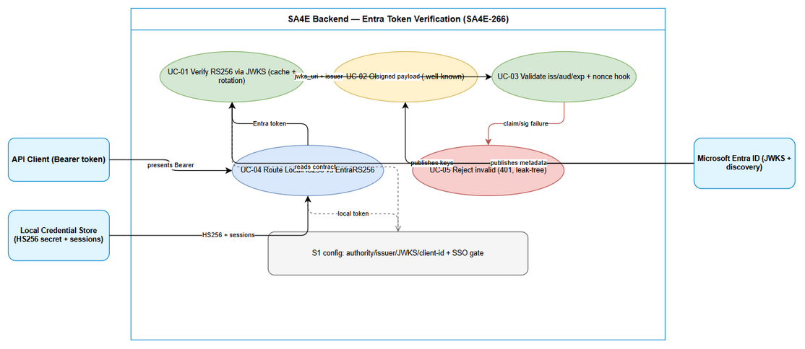
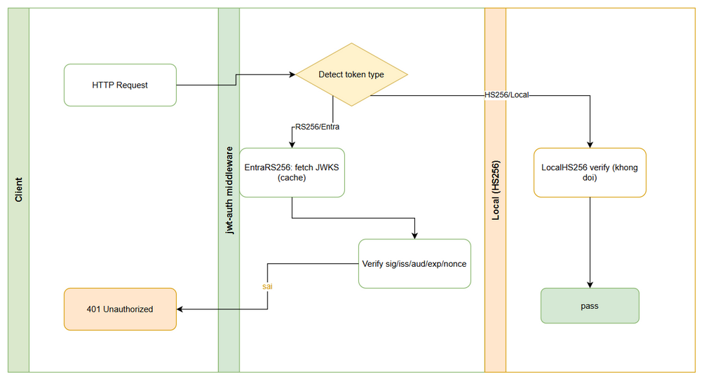

# Business Requirements Document (BRD)

## SA4E Backend — SA4E-266: [Backend] Verify RS256 + JWKS + discovery

---

## Document Information

| Field | Value |
|-------|-------|
| Jira Ticket | SA4E-266 |
| Title | [Backend] Verify RS256 + JWKS + discovery |
| Epic | SA4E-262 — [SSO] Tích hợp Microsoft Entra ID (OIDC + PKCE) với JIT provisioning, giữ local account song song |
| Author | BA Agent |
| Version | 1.0 |
| Date | 2026-09-14 |
| Status | Draft |
| Labels | sso, oidc, backend, security |
| Type | Story |
| Priority | High |
| Depends on | SA4E-264 (S1 — Entra config + env + validation) |

---

## Author Tracking

| Role | Name - Position | Responsibility |
|------|-----------------|----------------|
| Author | BA Agent – Business Analyst | Create document from PROPOSED-TICKETS.md S3 + Epic SA4E-262 + SA4E-264 BRD (S1 prereq) + jwt-auth.ts codebase evidence |
| Peer Reviewer | SA / DEV Lead – Solution Review | Review verifier strategy split, JWKS rotation design, claim-validation strictness |
| Product Owner | Duc Nguyen Minh – Reporter | Confirm S3-only scope, no callback/JIT/UI in this ticket |

---

## Revision History

| Version | Date | Author | Changes |
|---------|------|--------|---------|
| 1.0 | 2026-09-14 | BA Agent | Initiate document — from PROPOSED-TICKETS.md S3 (SA4E-266), Epic SA4E-262, documents/SA4E-264/BRD.md, backend/src/server/middleware/jwt-auth.ts |

---

## Sign-Off

| Name | Signature and date |
|------|--------------------|
| Product Owner | ☐ I agree and confirm all criteria on this BRD as expected requirements |
| Tech Lead | ☐ I agree and confirm all criteria on this BRD as expected requirements |

---

## 1. Introduction

### 1.1 Scope

SA4E-266 (S3) extends `backend/src/server/middleware/jwt-auth.ts` — which today verifies **HS256 only** (HMAC with `KB_TOKEN_SECRET` plus opaque admin-session fallback) — with a second verification path for Microsoft Entra ID tokens: **RS256 signature verification against the Entra JWKS**, **OIDC discovery** via `.well-known/openid-configuration`, and strict claim validation (`iss` / `aud` / `exp`, plus a `nonce` contract consumed by the S4 callback).

In scope:

1. RS256 verification of Entra `id_token`s using the Entra **JWKS** (`ENTRA_JWKS_URI` from S1), with **in-memory key cache + rotation handling** (unknown `kid` triggers exactly one refresh-and-retry before rejecting).
2. **OIDC discovery** fetch of `.well-known/openid-configuration` (derived from `ENTRA_AUTHORITY` from S1), cached with TTL, used to confirm `issuer` and `jwks_uri` instead of trusting token-embedded URLs.
3. Claim validation: `iss` must equal the configured `ENTRA_ISSUER` (exact match, no substring), `aud` must equal `ENTRA_CLIENT_ID`, `exp`/`nbf`/`iat` enforced with a small documented clock-skew tolerance, `alg` must be `RS256` (explicit allowlist — `none` and unexpected algorithms rejected before any crypto).
4. A **Strategy split** in the auth middleware: `LocalHS256` (existing HS256 + opaque session behavior, byte-for-byte preserved) vs `EntraRS256` (new path). Routing is deterministic and tested; local login is unaffected.
5. A `nonce` validation contract (verify `nonce` claim against the value S4 stored at authorize time) defined here and implemented against in S4 — S3 provides the verifier hook, S4 provides the stored value.

Source evidence: PROPOSED-TICKETS.md Section S3 (description + 4 acceptance criteria); Epic SA4E-262 AC item 5 (RS256+JWKS verify, forged/expired rejected); documents/SA4E-264/BRD.md (S1 config contract: `ENTRA_AUTHORITY`, `ENTRA_ISSUER`, `ENTRA_JWKS_URI`, `ENTRA_CLIENT_ID`, `SSO_ENABLED` gate); `backend/src/server/middleware/jwt-auth.ts` (current HS256-only implementation, 178 lines); `backend/package.json` (no `jose` / `jsonwebtoken` / `openid-client` / `jwks-rsa` dependency today — RS256 support is greenfield).

### 1.2 Out of Scope

- OAuth2 Authorization Code + PKCE callback endpoints (`/authorize`, `/callback`, code-to-token exchange, state storage) — belongs to SA4E-267 (S4). S3 verifies tokens; S4 obtains them.
- JIT provisioning, `account_type`, account-linking policy, default group `grp-viewer` — belongs to SA4E-268 (S5) on top of SA4E-265 (S2).
- Unifying the two local auth entries into a single UserRepository — belongs to SA4E-269 (S6).
- Extension PKCE wiring, "Sign in with Microsoft" UI, status bar — SA4E-270 (S7), SA4E-273 (S9).
- Full security-hardening checklist (session fixation rotation, log scrubbing audit, rate limits) — SA4E-272 (S8) consumes S3 but owns the checklist. S3 defines its own no-leak error behavior only for the verifier path.
- STP/STC test plans — SA4E-274 (S10). S3 states acceptance criteria in testable form for S10 to expand.
- Entra App Registration runbook and per-environment secret wiring — SA4E-271 (S12).
- Any change to local login semantics (PBKDF2 passwords, opaque session lifecycle, anonymous mode when auth not required). Local behavior is frozen by this ticket.

### 1.3 Preliminary Requirement

- S1 (SA4E-264) contract is the configuration prerequisite: `ENTRA_TENANT_ID`, `ENTRA_CLIENT_ID`, `ENTRA_AUTHORITY`, `ENTRA_ISSUER`, `ENTRA_JWKS_URI`, `ENTRA_SCOPES`, plus the `SSO_ENABLED` gate (default `false`). When `SSO_ENABLED=false`, the EntraRS256 path stays dormant and the middleware behaves exactly as today.
- Current middleware behavior confirmed in `backend/src/server/middleware/jwt-auth.ts`: `CODE_INTEL_REQUIRE_AUTH` gate, `KB_TOKEN_SECRET` HMAC check (`verifyHs256`), unverified `decodeJwtPayload` helper, `isExpired` check, opaque-token fallback via `validateSession` (fail-closed `safeValidateSession`), `createJwtAuth(alwaysRequire)` with anonymous-vs-401 branching, and `verifyJwtToken` with the SR-01 rule (reject JWT when no secret configured).
- No RS256/JWKS/OIDC library exists in `backend/package.json` today. The TDD phase (SA) chooses the library (`jose` preferred for JWKS + discovery support — decision, not mandate) and pins the version.
- Network egress from the backend to `login.microsoftonline.com` (discovery + JWKS endpoints) must be allowed in target environments; otherwise the Entra path cannot function and must fail closed with a clear error.

---

## 2. Business Requirements

### 2.1 High Level Process Map

Every request carrying `Authorization: Bearer <token>` passes through the existing middleware entry point. S3 inserts a deterministic router before the current HS256 logic: opaque tokens keep flowing to `validateSession`; JWTs whose header/claims indicate Entra (issuer claim or `kid` matching the Entra JWKS) flow to the new `EntraRS256` strategy (discovery → JWKS → signature → claims → nonce hook); all other JWTs keep flowing to the unchanged `LocalHS256` strategy. Invalid Entra tokens are rejected with `401` and a non-sensitive error code; nothing about the local path changes, including anonymous mode when auth is not required.

*[Edit in draw.io](diagrams/use-case.drawio)*

*[Edit in draw.io](diagrams/business-flow.drawio)*

The two diagrams above are the normative visuals for this BRD. The use-case diagram shows the actors (API client, Entra ID as key/issuer authority, local credential store) and the five verifier responsibilities. The swimlane business-flow diagram shows the request path through the router, the EntraRS256 verification chain with the JWKS-rotation retry, and the untouched local path converging on a single accept/reject sink.

### 2.2 List of User Stories / Use Cases

| # | Story / Use Case / Epic | Priority | Source Ticket |
|---|-------------------------|----------|---------------|
| US-01 | As a backend service, I want to verify Entra id_tokens with RS256 against the Entra JWKS (cached, rotation-aware) so that only genuinely Entra-signed tokens are accepted | MUST HAVE | SA4E-266 |
| US-02 | As a backend service, I want OIDC discovery plus strict iss/aud/exp validation (and a nonce hook for S4) so that forged, misissued, or expired tokens are rejected | MUST HAVE | SA4E-266 |
| US-03 | As a local-login user, I want HS256 + opaque session authentication to work exactly as before so that enabling SSO code never breaks local login | MUST HAVE | SA4E-266 |
| US-04 | As a backend operator, I want verifier failures to be observable (error codes, redacted logs, JWKS health) so that rotation/outage issues are diagnosable without leaking secrets | SHOULD HAVE | SA4E-266 |

Traceability: US-01 covers Jira AC items 1 (valid Entra token passes) and 3 (JWKS cache refreshes on rotation). US-02 covers Jira AC item 2 (wrong signature/issuer/aud/expired rejected) plus the Epic AC-5 rejection clause. US-03 covers Jira AC item 4 (local HS256 unaffected). US-04 is derived from operational necessity (rotation and outage diagnosability) and feeds S8/S10.

---

### 2.3 Details of User Stories

---

#### Business Flow

**Step 1:** Client sends a request with `Authorization: Bearer <token>` (or no header). The middleware evaluates `mustAuth` (`CODE_INTEL_REQUIRE_AUTH || alwaysRequire`) exactly as today.

**Step 2:** With no/empty Bearer and `mustAuth=false`, the request continues anonymously (unchanged). With no/empty Bearer and `mustAuth=true`, the middleware returns `401 AUTH_REQUIRED` (unchanged).

**Step 3:** With a Bearer value, the router classifies it: single opaque string (not 3 dot-segments) → local session path; 3-segment JWT → peek at untrusted header (`kid`, `alg`) and payload (`iss`) to decide Entra vs local. Peeking never confers trust; it only routes.

**Step 4 (Entra path):** The `EntraRS256` strategy ensures OIDC discovery metadata is available (cached per TTL, refreshed on expiry/failure with last-known-good fallback rules defined in TDD), then ensures the JWKS is available (cached; on unknown `kid`, exactly one forced refresh and retry).

**Step 5 (Entra path):** The strategy verifies the RS256 signature with the matched JWK, then validates claims in fixed order: `alg` allowlist → `iss` exact match → `aud` match → `exp`/`nbf`/`iat` with clock skew → `nonce` hook (delegates to the S4-provided expected value; absent S4 context, documented behavior applies — see US-02).

**Step 6 (Entra path success):** A project context is built from verified claims (`sub`/`oid` as user identity, `tid`/`wid`/`pid` mapping per TDD) and the request continues. Failures at any check return `401` with a stable machine-readable code and no secret/key material in the response or logs.

**Step 7 (Local path):** HS256 JWTs are verified with `KB_TOKEN_SECRET` and expiry exactly as today (`verifyHs256` + `isExpired` + SR-01 rule); opaque tokens go to `validateSession` via fail-closed `safeValidateSession`. Outcomes (accept / anonymous / `401`) are identical to pre-S3 behavior.

**Step 8:** When `SSO_ENABLED=false` (S1 gate), Steps 3–6 route every token to Step 7; the Entra strategy is never invoked and no discovery/JWKS network call is made.

> **Note:** Signature is always verified before claims are trusted, and claims are validated even when the signature is valid — a correctly signed token for a different audience/issuer must still be rejected. The router's untrusted peek exists only to choose a strategy; authorization decisions use verified claims exclusively.

---

#### STORY US-01: Verify Entra RS256 via JWKS with cache and rotation

> As a backend service, I want to verify Entra id_tokens with RS256 against the Entra JWKS (cached, rotation-aware) so that only genuinely Entra-signed tokens are accepted

**Requirement Details:**

1. Introduce an `EntraRS256` verifier used only for tokens routed as Entra. It accepts **only** `alg=RS256`. Any other `alg` (`none`, `HS256`, `RS384`, etc.) is rejected before key lookup — algorithm confusion with the local HS256 secret must be structurally impossible (separate code path, separate key material, no shared secret).
2. Key resolution uses the token's `kid` against the cached JWKS from `ENTRA_JWKS_URI`. On `kid` miss, the verifier performs **exactly one forced JWKS refresh** and retries the lookup once (covers Entra key rotation). A second miss rejects the token — no unbounded fetch loop.
3. The JWKS cache honors HTTP cache directives where present and otherwise a TDD-defined TTL (default proposal: 1 hour, jittered). Refresh failures keep serving the last-known-good set until TTL expiry; past expiry with no reachable JWKS, verification fails closed (reject Entra tokens, local path unaffected).
4. Signature verification uses constant-time comparison semantics provided by the chosen library; the implementation must not hand-roll RSA padding or base64url parsing beyond what exists. The current hand-rolled `verifyHs256` stays untouched on the local path.
5. A valid Entra token (correct signature, known `kid`, all claims valid) passes verification and yields its verified payload to the middleware for context creation. This is Jira AC-1.

**Data Fields:**

| Field | Type | Required | Description | Example |
|-------|------|----------|-------------|---------|
| kid | string (JWT header) | Yes | Key id selecting the JWK; miss triggers one refresh-and-retry | `lEBE5Q3G5W4lR5h8j2k9m0` |
| alg | string (JWT header) | Yes, must be `RS256` | Algorithm allowlist enforced before key lookup | `RS256` |
| JWKS cache entry | map kid → public JWK + fetchedAt + ttl | N/A (server state) | In-memory cache of the Entra key set | `{ kid: <JWK>, fetchedAt: 2026-09-14T00:00:00Z }` |
| jwks_uri | HTTPS URL (from S1/discovery) | Yes when SSO on | Only source of verification keys; never token-embedded URLs | `https://login.microsoftonline.com/{tenant}/discovery/v2.0/keys` |
| verified payload | object (verified claims) | Output | Trusted claims handed to context creation (see US-02 fields) | `{ iss, aud, exp, sub/oid, tid }` |

**Acceptance Criteria:**

1. Given a correctly signed Entra `id_token` (valid `kid`, all claims valid), verification passes and the request continues with identity from verified claims (AC-1).
2. Given a token with a tampered signature or signed by an unknown key (still unknown after one refresh), verification rejects with `401` and code `TOKEN_INVALID` (AC-2 signature clause).
3. Given Entra rotates its signing keys (new `kid` published at the JWKS URI), the next request with a new-key token succeeds after at most one background refresh, without restart or manual intervention (AC-3).
4. Given `kid` missing from the header or `alg` anything other than `RS256`, verification rejects without any network call to the JWKS endpoint.

**Validation Rules:**

- `alg` must equal `RS256` exactly (case-sensitive); `none` is rejected even if the token is otherwise well-formed.
- `kid` must be a non-empty string; absent `kid` fails before cache access.
- Only keys from the configured/discovered `jwks_uri` are usable; `jwk`/`jku`/`x5u` headers embedded in the token are ignored.
- Refresh-and-retry happens at most once per verification attempt; concurrent misses coalesce into a single refresh (thundering-herd guard, TDD-owned mechanism).

**Error Handling:**

- Unknown key after refresh: `401 { code: TOKEN_INVALID, message: 'Invalid or expired token' }`; log records `kid`, `jwks_uri` host, and refresh outcome — never key material.
- JWKS endpoint unreachable and cache expired: `401 TOKEN_INVALID` for Entra tokens with a distinct log reason (`jwks_unavailable`); local tokens continue normally.
- JWKS payload malformed: fail closed for Entra path, log `jwks_malformed` with HTTP status (not body), keep last-known-good if still within TTL.

---

#### STORY US-02: OIDC discovery plus strict claim validation (iss/aud/exp/nonce)

> As a backend service, I want OIDC discovery plus strict iss/aud/exp validation (and a nonce hook for S4) so that forged, misissued, or expired tokens are rejected

**Requirement Details:**

1. On Entra-path startup/first use, the verifier fetches `.well-known/openid-configuration` derived from `ENTRA_AUTHORITY`, caches it per TTL, and uses the document's `issuer` and `jwks_uri` as the authoritative values (cross-checked against the S1-configured `ENTRA_ISSUER` / `ENTRA_JWKS_URI` — mismatch fails closed and is logged; TDD defines whether config or discovery wins, default proposal: config wins for `iss`, discovery wins for `jwks_uri` only when config left derived).
2. Claim checks run in fixed order after a valid signature: (a) `iss` exact string equality with `ENTRA_ISSUER` (covers both `.../v2.0` and tenant-specific forms — no contains/startsWith matching); (b) `aud` equals `ENTRA_CLIENT_ID` (accept array-form `aud` only if it contains the client id — TDD decision logged); (c) `exp` in the future and `nbf` (if present) in the past within the clock-skew tolerance (default proposal: 120 seconds); (d) `iat` present and not unreasonably future-dated; (e) `nonce` hook (item 4).
3. Multi-tenant S1 values (`common` / `organizations` / `consumers` as tenant) are NOT silently accepted here: if the S1 tenant is non-GUID, `iss` validation must use the TDD-defined tenant-resolution rule (default proposal: reject unless S4 supplies the resolved tenant `iss` allowlist). This prevents `common`-issuer tokens from unintended tenants passing.
4. `nonce` contract: S3 exposes `verifyNonce(tokenNonce, expectedNonce)` semantics (constant-time compare, single-use expectation documented for S4). Until S4 stores nonces, the hook behavior is: if the token carries a `nonce` but no expected value is registered, verification **fails closed** on routes that require S4 context and **ignores** `nonce` on pure bearer-verification calls — exact split defined in TDD and consumed by S4. S3 never invents expected nonces.
5. Every rejection maps to a stable machine-readable reason for S10/S8: `bad_signature`, `unknown_kid`, `bad_alg`, `bad_issuer`, `bad_audience`, `expired`, `not_yet_valid`, `nonce_mismatch`, `discovery_mismatch`, `jwks_unavailable`. HTTP status stays `401` with the existing public envelope (`TOKEN_INVALID`); reasons go to server logs only.

**Data Fields:**

| Field | Type | Required | Description | Example |
|-------|------|----------|-------------|---------|
| iss | string (claim) | Yes | Must exactly equal ENTRA_ISSUER | `https://login.microsoftonline.com/11111111-2222-3333-4444-555555555555/v2.0` |
| aud | string or string[] (claim) | Yes | Must equal/must contain ENTRA_CLIENT_ID | `aaaaaaaa-bbbb-cccc-dddd-eeeeeeeeeeee` |
| exp / nbf / iat | number (seconds since epoch) | exp Yes; nbf/iat conditional | Lifetime checks with clock-skew tolerance | `exp: 1780000000` |
| nonce | string (claim) | Conditional (S4 flows) | Replay protection bound to S4 authorize request | `n-0S6_WzA2Mj` |
| oid / sub | string (claim) | Yes (one of) | Stable user key for S5 JIT (read here, used in S5) | `oid: 00000000-0000-0000-0000-000000000000` |
| tid | string (claim) | Yes | Tenant id of the issuer, cross-checked with S1 tenant | `11111111-2222-3333-4444-555555555555` |
| discovery doc | JSON (cached) | N/A (server state) | `.well-known` payload: issuer, jwks_uri, TTL | `{ issuer, jwks_uri, fetchedAt }` |

**Acceptance Criteria:**

1. Given a token with a wrong `iss` (different tenant, v1 vs v2 mismatch, `common` confusion), verification rejects (AC-2 issuer clause).
2. Given a token with a wrong `aud` (another app's client id), verification rejects even when the signature is valid (AC-2 audience clause).
3. Given an expired token (`exp` in the past beyond skew) or not-yet-valid (`nbf` in the future beyond skew), verification rejects (AC-2 expiry clause).
4. Given an S4 authorize flow with a stored `nonce`, a callback `id_token` with a mismatched/missing `nonce` is rejected via the S3 hook (`nonce_mismatch`); S4 owns storing and supplying the expected value.

**Validation Rules:**

- `iss` comparison is exact, case-sensitive, no trailing-slash normalization beyond the TDD-defined canonical form.
- `aud` comparison is exact against `ENTRA_CLIENT_ID`; wildcard or prefix matching is forbidden.
- Clock skew default 120 s, applied symmetrically to `exp`/`nbf`/`iat`, documented and configurable via TDD-defined constant (not per-request input).
- `exp` absent → reject (Entra always sends `exp`; missing means malformed for this path).

**Error Handling:**

- Each claim failure returns the public `401 TOKEN_INVALID` envelope; the log line carries the machine reason + claim name + expected-vs-received *kinds* (never secret values; `aud` mismatch logs both ids since they are non-secret identifiers).
- Discovery fetch failure with valid cache → proceed on cache and log `discovery_stale`; with no cache → fail closed (`discovery_unavailable`), Entra path rejects, local path unaffected.
- Discovery `issuer`/`jwks_uri` mismatch vs S1 config → fail closed with `discovery_mismatch`; never silently prefer the network value over operator config.

---

#### STORY US-03: Strategy split — LocalHS256 vs EntraRS256, local frozen

> As a local-login user, I want HS256 + opaque session authentication to work exactly as before so that enabling SSO code never breaks local login

**Requirement Details:**

1. Refactor `jwt-auth.ts` into a Strategy shape without changing local semantics: `LocalHS256` (current `verifyHs256` + `isExpired` + SR-01 + `safeValidateSession` + anonymous/`mustAuth` branching) and `EntraRS256` (US-01 + US-02), fronted by a pure `routeToken(token)` classifier. Shared helpers keep their names and behavior; new code lives in new module(s) (e.g. `entra-verifier.ts`), not inline in the middleware.
2. Routing rule (deterministic, unit-tested): not-3-segments → opaque/local-session; 3-segment JWT with Entra indicators (`iss` matching the Entra issuer pattern or `kid` present while SSO on and Entra configured) → `EntraRS256`; any other 3-segment JWT → `LocalHS256`. When `SSO_ENABLED=false` or Entra config incomplete, everything routes local (zero behavior change, zero network calls).
3. `verifyJwtToken` (used by the tools route for project binding) must preserve its current contract for local tokens (SR-01: reject when no secret) and additionally accept valid Entra tokens via `EntraRS256` when SSO is on — return shape `{ valid, payload }` unchanged; callers are not modified in S3.
4. Regression envelope: anonymous mode, `AUTH_REQUIRED` on missing header under `mustAuth`, `TOKEN_INVALID` on bad local JWT, opaque session accept/reject, `allowedProjectsFromClaims` behavior — all covered by pre/post unit tests asserting identical outcomes for local vectors. This is Jira AC-4.
5. No new required environment variable for local-only deployments. `KB_TOKEN_SECRET` / `CODE_INTEL_REQUIRE_AUTH` semantics are untouched; Entra variables are read only through the S1 config layer, never via ad-hoc `process.env.ENTRA_*` in the middleware.

**Data Fields:**

| Field | Type | Required | Description | Example |
|-------|------|----------|-------------|---------|
| route decision | enum `local-jwt` / `local-session` / `entra` | Output per request | Pure classifier result, logged at debug | `entra` |
| mustAuth | boolean | Input (existing) | `CODE_INTEL_REQUIRE_AUTH \|\| alwaysRequire`, unchanged | `false` |
| local JWT claims | object (existing: sub, wid, pid, exp) | Conditional | Unchanged claim set for local tokens | `{ sub: u1, pid: p1, exp: 1780000000 }` |

**Acceptance Criteria:**

1. With `SSO_ENABLED` unset/`false`, the full local matrix (valid HS256, bad signature, expired, opaque valid/invalid, missing header × `mustAuth` true/false) produces byte-identical outcomes to pre-S3 code (AC-4, verified by regression tests).
2. With `SSO_ENABLED=true`, local tokens still verify via `LocalHS256` only — an HS256 local token is never sent to the JWKS path and an Entra token is never verified with `KB_TOKEN_SECRET` (algorithm-confusion test: HS256 token with Entra `iss` claim forged locally is rejected by both paths).
3. `verifyJwtToken` returns `{ valid: true }` for a valid local JWT exactly as before and additionally for a valid Entra token when SSO is on; shape and callers unchanged.
4. No discovery/JWKS network traffic occurs for local-only requests (asserted by test with network stubbed to fail).

**Validation Rules:**

- Router peeks at untrusted header/payload for routing only; no authorization decision may use untrusted values.
- `SSO_ENABLED=false` short-circuits the router to local before any Entra code loads (no import-time side effects that require Entra config).
- Existing exported symbols (`jwtAuth`, `jwtAuthStrict`, `verifyJwtToken`, `allowedProjectsFromClaims`, `validateJwtConfig`, `isJwtAuthRequired`) keep their signatures.

**Error Handling:**

- Entra-path exceptions (network, parse, crypto) never fall through to local accept and never crash the middleware: they produce `401 TOKEN_INVALID` (or anonymous when `!mustAuth`, matching existing fail-open-for-anonymous convention) with a server-side reason code.
- Local-path error behavior is frozen: same codes (`AUTH_REQUIRED`, `TOKEN_INVALID`), same status, same anonymous fallback as today.

---

#### STORY US-04: Observable verifier failures (diagnosable, leak-free)

> As a backend operator, I want verifier failures to be observable (error codes, redacted logs, JWKS health) so that rotation/outage issues are diagnosable without leaking secrets

**Requirement Details:**

1. Every Entra verification outcome logs one structured line at the appropriate level: success at debug (with `kid`, `iss` host, `aud`-match boolean, latency ms), expected rejections at warn (with machine reason from US-02 item 5), infrastructure failures (`jwks_unavailable`, `discovery_unavailable`) at error. No token, signature, secret, or full JWK is ever logged.
2. Expose JWKS/discovery health for operators (mechanism owned by TDD — default proposal: debug log counters plus a `GET /auth/entra/health`-style internal check owned by S4 reusing the S3 health function; S3 provides `getEntraVerifierHealth()` returning `{ discoveryCached, jwksKids, lastRefresh, lastError }`).
3. The verifier records minimal counters (verifications, cache hits/misses, refreshes, rejections by reason) in a TDD-defined structure so S8/S10 can assert rotation and outage behavior without parsing log text.

**Data Fields:**

| Field | Type | Required | Description | Example |
|-------|------|----------|-------------|---------|
| verify outcome log | structured log line | Output | One line per Entra verification with reason + latency | `{ reason: bad_audience, kid: abc, latencyMs: 12 }` |
| verifier health | object (function result) | Output | Cache state snapshot for ops/S4 | `{ jwksKids: 3, lastRefresh: <ts>, lastError: null }` |

**Acceptance Criteria:**

1. Each of the 10 machine reasons is observable in server logs/tests without enabling secret-level debug.
2. No log line or error response in the S3 path contains a token, signature segment, secret, or key modulus/exponent (verified by canary-value grep in review).
3. An operator can determine JWKS rotation state (current kids, last refresh, last error) from the health snapshot without reading code.

**Validation Rules:**

- Log field allowlist: `kid`, reason codes, hosts (not full URLs with query), boolean match results, latency, cache ages. Everything else is denied by default.
- Health output contains key ids and timestamps only — never key material.

**Error Handling:**

- Logging itself never throws: the log call is wrapped so a stringify failure cannot turn a rejection into a 500 or an accept.
- Counter overflow/absence degrades to missing telemetry, never to changed auth decisions.

---

## 3. Dependencies

| Dependency | Type | Related Ticket | Description |
|------------|------|----------------|-------------|
| S1 Entra config contract (ENV + zod + SSO_ENABLED gate) | System | SA4E-264 | Prerequisite: authority/issuer/JWKS/client-id values and the SSO_ENABLED dormancy gate. S3 consumes; S1 must land (or be stubbed in tests) first |
| Current jwt-auth.ts local semantics (HS256 + opaque session + SR-01) | System | N/A | Frozen baseline: verifyHs256, isExpired, safeValidateSession, createJwtAuth branching, verifyJwtToken contract |
| RS256/JWKS/OIDC library (to be pinned in TDD) | System | N/A | No jose/jsonwebtoken/openid-client in backend/package.json today; SA chooses and pins version in TDD phase |
| Network egress to login.microsoftonline.com | Infrastructure | SA4E-271 (S12) | Discovery + JWKS fetches require HTTPS egress; S12 runbook must confirm redirect/tenant values consistent with S1 |
| S4 callback (nonce storage + code exchange) | System | SA4E-267 | S3 defines the nonce verification hook; S4 supplies stored nonces and calls it. No S4 route is built here |
| S5 JIT + S2 schema (claims consumers) | System | SA4E-268, SA4E-265 | oid/sub/email/name claims verified here are consumed by JIT; S3 does not create users |
| S8 hardening + S10 test planning (consumers) | Compliance | SA4E-272, SA4E-274 | S8 audits this verifier; S10 expands S3 ACs into STP/STC cases |

---

## 4. Stakeholders

| Role | Name / Team | Responsibility | Source |
|------|-------------|----------------|--------|
| Reporter / Product Owner | Duc Nguyen Minh | Defined S3 scope in backlog, owns Epic SA4E-262 decisions | PROPOSED-TICKETS.md S3 + Epic |
| Backend Developer | Backend team (implementer) | Implements EntraRS256 verifier, router split, regression tests | Jira labels backend |
| Solution Architect | SA agent (next phase) | Turns BRD into TDD: library choice, cache/TTL design, iss-resolution for common tenants | SDLC pipeline Phase 3 |
| QA | QA agent | Expands ACs into RS256/JWKS negative cases, rotation tests, local regression matrix | Future SA4E-274 (S10) |
| Security reviewer | Security track | Reviews alg-allowlist, exact-match iss/aud, no-leak logging, fail-closed behavior | Jira labels security, oidc |
| DevOps / Operator | Infra team | Allows JWKS/discovery egress, monitors verifier health, owns S12 values | S12 SA4E-271 |

---

## 5. Risks and Assumptions

### 5.1 Risks

| Risk | Impact | Likelihood | Mitigation |
|------|--------|------------|------------|
| Algorithm confusion (Entra token verified with HS256 secret or vice versa) | High | Low | Separate strategies + separate key material; alg allowlist per path; dedicated confusion unit test (US-03 AC-2) |
| `iss`/`aud` matched loosely (substring/prefix) letting cross-app or cross-tenant tokens pass | High | Medium | Exact-match rules in US-02; review checklist item; negative tests for neighbor-tenant and neighbor-app tokens |
| `common` tenant issuer accepted without tenant resolution | High | Medium | Non-GUID tenant rule (US-02 item 3); TDD must define resolution; default reject |
| JWKS rotation causes login outage (stale cache, no refresh-on-kid-miss) | High | Medium | Refresh-and-retry-once + TTL + last-known-good; rotation test in AC |
| Discovery/network failure fails open (accepting unverified tokens) | High | Low | Fail-closed rules everywhere in S3; no accept path without valid signature + claims |
| Secret/key/token material leaks into logs or 401 bodies | High | Medium | Log allowlist (US-04), public envelope fixed to existing shape, canary-grep review gate |
| Clock skew rejects legitimate tokens (or hides expired ones) | Medium | Medium | Documented 120 s default, symmetric, configurable constant; boundary tests at ±skew |
| Local regression (anonymous mode, opaque sessions, SR-01) broken by refactor | High | Low | US-03 frozen-behavior ACs + pre/post regression suite; SSO-off short-circuit |
| Hand-rolled crypto parsing extended to RSA by mistake | High | Low | Library mandate for RS256 path; local hand-rolled HS256 stays but is not reused for Entra |
| Nonce hook semantics drift between S3 definition and S4 use | Medium | Medium | Contract pinned in US-02 item 4; S4 must cite the hook; mismatch is a defect against S4 |

### 5.2 Assumptions

- S1 values (`ENTRA_AUTHORITY`, `ENTRA_ISSUER`, `ENTRA_JWKS_URI`, `ENTRA_CLIENT_ID`, `SSO_ENABLED`) are available through the typed config layer when S3 code runs; S3 reads no `process.env.ENTRA_*` directly.
- Entra issues RS256 `id_token`s with `kid` headers and a v2.0 issuer for single-tenant apps; any tenant/app profile deviation is handled in TDD, not by loosening BRD rules.
- Backend clock is NTP-synchronized (skew tolerance covers residual drift, not broken clocks).
- Outbound HTTPS to the Entra endpoints is permitted in dev/staging/prod (S12 confirms).
- `nonce` storage and single-use enforcement mechanics belong to S4; S3 only defines verification semantics.

---

## 6. Non-Functional Requirements

| Category | Requirement | Details |
|----------|-------------|---------|
| Security | Fail closed on every verifier/infra failure | No accept without valid RS256 signature + all claim checks; alg allowlist; exact iss/aud; no token-embedded key URLs |
| Security | Zero secret/key/token material in responses or logs | Fixed public 401 envelope; log allowlist (US-04); canary-grep review gate |
| Performance | Cached verification adds negligible latency | JWKS/discovery served from memory cache on steady state; target p95 overhead under 10 ms per request excluding one-time refresh |
| Performance | Rotation refresh is bounded | At most one forced JWKS refresh per miss, coalesced across concurrent requests; no per-request discovery fetch |
| Reliability | Rotation and transient outage do not break valid logins | Refresh-on-kid-miss, last-known-good within TTL, stale-discovery fallback; local path never shares the failure domain |
| Observability | Machine-readable reasons + health snapshot | 10 reason codes (US-02), outcome log line per verification, getEntraVerifierHealth() for ops/S4 |
| Maintainability | Local path frozen, new code isolated | New verifier module(s); existing exports/signatures unchanged; router is pure and unit-tested |
| Compatibility | SSO-off means zero change | SSO_ENABLED=false short-circuits to local before any Entra code or network activity |

---

## 7. Related Tickets

| Ticket Key | Summary | Status | Type | Relationship |
|------------|---------|--------|------|--------------|
| SA4E-266 | [Backend] Verify RS256 + JWKS + discovery | To Do | Story | Main ticket (this BRD, S3) |
| SA4E-262 | [SSO] Tích hợp Microsoft Entra ID (OIDC + PKCE) với JIT provisioning, giữ local account song song | In Progress | Epic | Parent epic of SA4E-266 |
| SA4E-264 | [Config] Cấu hình Entra ID + env + validation | In Progress | Task | Prerequisite (S1) — config contract S3 consumes |
| SA4E-267 | [Backend] OAuth2 Auth Code + PKCE callback | To Do | Story | Consumer (S4) — calls S3 verifier + nonce hook |
| SA4E-265 | [DB] Migration account type + external subject id | To Do | Task | Parallel (S2) — schema for S5 JIT reading S3-verified claims |
| SA4E-268 | [Backend] JIT Provisioning Service | To Do | Story | Consumer (S5) — creates users from S3-verified oid/sub/email |
| SA4E-269 | [Backend] Hợp nhất về single UserRepository | To Do | Story | Parallel refactor (S6) — must not conflict with S3 strategy split |
| SA4E-272 | [Security] Hardening | To Do | Story | Consumer/auditor (S8) — audits S3 verifier |
| SA4E-274 | [QA] Test Planning STP/STC | To Do | Task | Consumer (S10) — expands S3 ACs into test cases |

Dependency direction per PROPOSED-TICKETS.md Section 3: S3 depends on S1; S4 depends on S1+S3; S8/S10 depend on S3 among others. This BRD covers S3 only.

---

## 8. Appendix

### 8.1 Acceptance-Criteria Coverage

| Jira AC (SA4E-266) | Covered by | How verified (BRD-level) |
|--------------------|------------|--------------------------|
| Token Entra hợp lệ pass | US-01 AC-1 + US-02 (claims) + Business Flow Step 6 | Valid-signature + known-kid + all-claims-valid → context created, request continues |
| Token sai chữ ký / issuer / aud / expired bị reject | US-01 AC-2 + US-02 AC-1..AC-3 + 10 reason codes | Each vector maps to a reason (bad_signature, bad_issuer, bad_audience, expired) with 401 TOKEN_INVALID |
| JWKS cache có refresh khi key rotate | US-01 AC-3 + validation (refresh-once, coalesced) | New-kid token succeeds after one refresh, no restart |
| Local HS256 không bị ảnh hưởng | US-03 AC-1..AC-4 + frozen local semantics | Pre/post regression matrix identical; SSO-off short-circuit; no Entra network for local |
| Tách Strategy LocalHS256 vs EntraRS256 (description) | US-03 items 1–2 + Section 2.1 router | Pure routeToken classifier; isolated entra-verifier module; alg confusion structurally impossible |
| OIDC discovery .well-known (description) | US-02 item 1 + Business Flow Step 4 | Cached discovery confirms issuer/jwks_uri; mismatch fails closed |
| Validate iss/aud/exp/nonce (description) | US-02 items 2–4 | Fixed claim order, exact matches, skew default, nonce hook contract for S4 |

### 8.2 Key Decisions

| # | Decision | Rationale | Impact if changed |
|---|----------|-----------|-------------------|
| D-01 | Separate strategies; Entra accepts only alg=RS256, local keeps HS256 | Eliminates algorithm-confusion class at the structural level instead of relying on checks | Merging paths reintroduces confusion risk; forbidden without Security review |
| D-02 | JWKS refresh-on-unknown-kid exactly once per attempt, coalesced | Covers Entra rotation with bounded cost and no fetch loops | More retries add latency/DDoS surface; zero retries causes rotation outages |
| D-03 | iss/aud exact match; aud array only if it contains client id | Prevents cross-tenant/cross-app token acceptance | Loosening is a security defect, owned by S8 finding |
| D-04 | Non-GUID S1 tenant (common/orgs/consumers) defaults to reject in S3 | Avoids silently accepting unintended-tenant issuers before S4 tenant resolution exists | Accepting requires explicit TDD allowlist + Security sign-off |
| D-05 | Clock skew default 120 s symmetric for exp/nbf/iat | Balances NTP drift against expiry strictness; single documented constant | Changing shifts boundary-test expectations in S10 |
| D-06 | Public 401 envelope unchanged; reasons log-side only | Keeps error contract stable for clients while giving operators diagnosability | New public codes require client-impact review |
| D-07 | SSO_ENABLED=false short-circuits before any Entra code/network | Guarantees zero local-only regression and zero surprise egress | Removing the gate couples local boot to Entra availability |
| D-08 | RS256 via vetted library (jose-class), no hand-rolled RSA | Hand-rolled RSA padding/b64 parsing is a classic vulnerability source | Hand-rolling RSA is a Security blocker |

### 8.3 Out-of-scope Guard (S3 only)

Any request to add authorize/callback routes, code-to-token exchange, user creation, group assignment, account linking, extension UI, App-registration steps, or session-fixation rotation in this change must be rejected and redirected to its owning ticket (S2, S4–S12). This BRD authorizes the verifier + router + claim checks + observability hook only.

### Glossary

| Term | Definition |
|------|------------|
| Entra ID | Microsoft Entra ID (formerly Azure AD), the OIDC identity provider for Epic SA4E-262 |
| OIDC discovery | The `.well-known/openid-configuration` document publishing issuer, JWKS URI, and endpoint metadata |
| JWKS | JSON Web Key Set endpoint publishing the RS256 public keys used to verify Entra tokens |
| kid | Key ID header selecting which JWK verifies a token; rotation introduces new kids |
| RS256 | RSA PKCS#1 v1.5 signature with SHA-256, the Entra id_token algorithm for this epic |
| iss / aud / exp | Issuer / audience / expiry claims validated exactly per US-02 |
| nonce | Single-use value binding an id_token to one authorize request; stored by S4, verified by the S3 hook |
| LocalHS256 | Existing strategy: HMAC-SHA256 JWTs with KB_TOKEN_SECRET plus opaque admin sessions |
| EntraRS256 | New S3 strategy: RS256 + JWKS + discovery + claim validation for Entra tokens |
| Fail closed | Any verifier or infrastructure failure rejects the Entra token rather than accepting it |
| Algorithm confusion | Attack mixing asymmetric/symmetric algorithms across verification paths; prevented structurally by D-01 |

### Reference Documents

| Document | Link / Location |
|----------|-----------------|
| SSO backlog S3 definition | documents/SA4E-SSO-Entra/PROPOSED-TICKETS.md — Section S3 (SA4E-266) + dependency map Section 3 |
| Epic SA4E-262 | Parent epic: OIDC + PKCE + JIT + local-parallel scope, 6 acceptance criteria |
| S1 BRD (prereq, done) | documents/SA4E-264/BRD.md — Entra env contract, SSO_ENABLED gate, derivation rules |
| Current middleware (baseline) | backend/src/server/middleware/jwt-auth.ts — HS256-only + opaque session, SR-01 rule |
| Backend dependencies (no RS256 lib today) | backend/package.json — no jose/jsonwebtoken/openid-client/jwks-rsa |
| Session store (opaque fallback) | backend/src/admin/admin-db.ts — validateSession via safeValidateSession (fail-closed) |
| BRD template | documents/templates/BRD-TEMPLATE.md |

### Diagram Index

| # | Diagram | Image | Source (editable) |
|---|---------|-------|-------------------|
| 1 | S3 Use Case — verifier responsibilities and actors | [use-case.png](diagrams/use-case.png) | [use-case.drawio](diagrams/use-case.drawio) |
| 2 | S3 Business Flow — router + EntraRS256 + local swimlane | [business-flow.png](diagrams/business-flow.png) | [business-flow.drawio](diagrams/business-flow.drawio) |

*All diagrams are draw.io only. No Mermaid is used in this document by project rule.*
