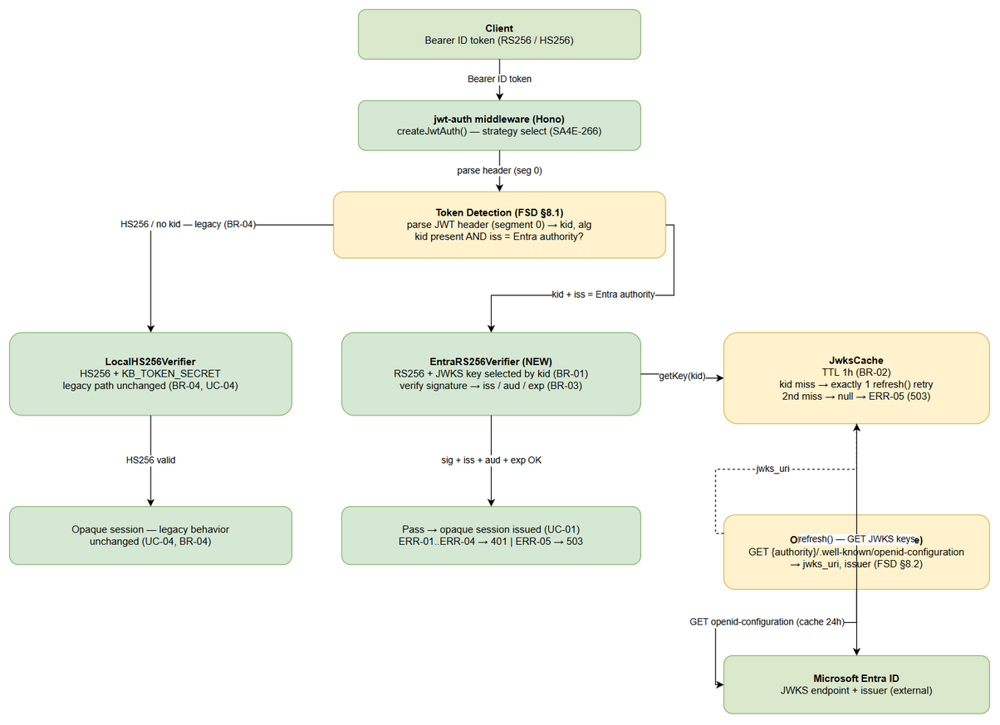
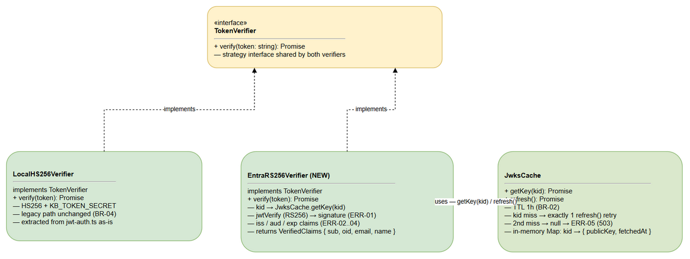

# TDD — SA4E-266 [Backend] Verify RS256 + JWKS + discovery

## Document Information

| Field | Value |
|-------|-------|
| Ticket | SA4E-266 |
| Epic | SA4E-262 |
| Type | Story |
| Labels | sso/oidc/backend/security |
| Version | v1.0 |
| Status | Final — for DEV implementation |
| Author | sa-agent |
| Inputs | documents/SA4E-266/FSD.md (v1, TA-enriched §7 API Contracts + §8 Integration), backend/src/server/middleware/jwt-auth.ts (actual code) |
| Consumers | dev-agent (implementation), qa-agent (STP/STC), DevOps-agent (DPG) |

---

## 1. Architecture Overview

Implements FSD UC-01..UC-04, BR-01..BR-04.

The `jwt-auth` middleware (`backend/src/server/middleware/jwt-auth.ts`) adopts the **Strategy pattern** for token verification. Two strategies share one interface (`TokenVerifier`, FSD §7.1):

- **LocalHS256Verifier** — existing HS256 verification against `KB_TOKEN_SECRET`. The legacy path is kept **unchanged** (BR-04, zero behavioral regression — FSD UC-04).
- **EntraRS256Verifier** — NEW in this story. Verifies Microsoft Entra ID ID tokens: RS256 signature validated against the Entra JWKS public key selected by `kid` from the token header (BR-01), then claim validation `iss`, `aud`, `exp` (BR-03).

**OIDC discovery (FSD §8.2)** — `GET {ENTRA_AUTHORITY}/.well-known/openid-configuration` is resolved and cached **24 hours** at config level (not per request). The discovered `jwks_uri` feeds `JwksCache`, which caches RSA public keys with **TTL 1h** and performs **exactly one refresh retry** on a `kid` miss (BR-02) before failing 503 ERR-05.

**Token-type detection (FSD §8.1)** — inside the existing `createJwtAuth()` middleware, after the existing `looksLikeJwt` check (`token.split('.').length === 3`):

1. Parse the JWT header (base64url segment 0, same `Buffer.from(parts[0], 'base64url')` technique as the existing `decodeJwtPayload`) → read `kid`, `alg`.
2. Header contains `kid` **AND** payload `iss` points to the configured Entra authority → route to `EntraRS256Verifier`.
3. Otherwise (HS256, no `kid`, local secret) → route to `LocalHS256Verifier` legacy path — unchanged.

**Reused error contract** — `jwt-auth.ts` already returns `{ data: null, error: { code, message } }` via its `unauthorized()` helper with HTTP 401. This exact response shape is reused; SA4E-266 adds a 503 variant with the same shape (ERR-05). No new response format is introduced.

Architecture diagram: see §7.1 (architecture-verifier).

---

## 2. Component Design

All new components live in `backend/src/server/middleware/verifiers/`. Conventions follow the actual `jwt-auth.ts` code: Hono `MiddlewareHandler` context, `import type` for type-only imports, async/await, Node `crypto` module, env-var config read at module load with startup validation (like the existing `validateJwtConfig()`).

### 2.1 TokenVerifier (interface) — FSD §7.1

```typescript
// backend/src/server/middleware/verifiers/TokenVerifier.ts
export interface VerifiedClaims {
  sub: string;    // Subject — propagated to session context
  oid: string;    // Entra object ID — propagated to session context
  email: string;  // User email — propagated to session context
  name: string;   // Display name — propagated to session context
  iss: string;    // Issuer (Entra tenant URL)
  aud: string;    // Audience (client ID)
  exp: number;    // Expiration (epoch seconds)
}

export interface TokenVerifier {
  verify(token: string): Promise<VerifiedClaims>;
}
```

### 2.2 JwksCache — BR-02

Responsibilities:

- `getKey(kid)` — cache hit returns the cached RSA public key (entry valid while `now - fetchedAt < TTL`); on `kid` miss trigger **exactly one** `refresh()` retry and re-check once; second miss → return `null` (caller maps to 503 ERR-05).
- `refresh()` — refetch the full JWKS set from `jwks_uri` and replace the in-memory map atomically (single pass build → swap reference).
- Storage: in-memory `Map<string, { publicKey, fetchedAt, TTL: 3600 }>` per FSD §4 (`kid → { publicKey, fetchedAt, TTL }`).

```typescript
// backend/src/server/middleware/verifiers/JwksCache.ts
export interface JwksCache {
  getKey(kid: string): Promise<CryptoKey | null>; // cache hit → key; TTL 1h
  refresh(): Promise<void>;                       // refetch full JWKS set
}
```

- Fetch failures inside `refresh()` are caught and never crash the process (§4.2).
- The single-retry cap on `kid` miss is enforced with a per-call guard flag (no per-request retry loop).

### 2.3 LocalHS256Verifier — BR-04

Thin extraction of the EXISTING logic in `jwt-auth.ts` into the strategy interface. Behavior MUST remain identical:

- HS256 signature check vs `KB_TOKEN_SECRET` using the existing `verifyHs256()` implementation (Node `crypto.createHmac('sha256')`, `base64url` digest, constant comparison semantics unchanged).
- `exp` check using existing `isExpired()` semantics (`Date.now() >= exp * 1000`).
- Failure semantics (`TOKEN_INVALID` 401 / anonymous fallback when auth not required) stay owned by `jwt-auth.ts` — the verifier reports validity; the middleware maps results to responses. Legacy failure codes/behavior unchanged (FSD UC-04 exception flow).

### 2.4 EntraRS256Verifier — BR-01, BR-03

Per FSD §8.3 pseudocode:

```text
async verify(token):
  1. header = parseJwtHeader(token)                 // base64url segment 0
  2. key    = await jwksCache.getKey(header.kid)    // miss → exactly 1 refresh retry
       key == null → fail ERR-05 (503 jwks_fetch_failed)
  3. claims = await jwtVerify(token, key, { algorithms: ['RS256'] })
       signature invalid → fail ERR-01 (401 invalid_signature)
  4. validate claims:
       claims.iss != configuredIssuer   → fail ERR-02 (401 issuer_mismatch)
       claims.aud != configuredAudience → fail ERR-03 (401 audience_mismatch)
       claims.exp <= now                → fail ERR-04 (401 token_expired)
  5. return VerifiedClaims { sub, oid, email, name, iss, aud, exp }
```

Implementation notes:

- RS256 verification via the `jose` library (`jwtVerify` with `CryptoKey` from imported JWK). **NEW DEPENDENCY**: `jose` — justified because manual RS256 + JWKS + claim-validation handling is error-prone (padding oracles, `alg` confusion attacks); `jose` is the de-facto standard, zero-config, WebCrypto-backed. Alternative rejected: hand-rolling `crypto.subtle.verify` + claim checks duplicates well-solved security-critical logic.
- Missing/malformed `kid` or unparsable header → treated as ERR-01 class failure (401), never a crash.
- `nonce` is NOT consumed in this middleware — it belongs to the S4 callback flow (state/nonce round-trip at authorization-code exchange), per FSD §8.4.

Component diagram: see §7.2 (component-verifier).

---

## 3. API Design

No new public HTTP endpoints — this story changes verification behavior inside the existing auth middleware on `/api/v1/*`. The contract surface is configuration + internal interfaces + HTTP error responses.

### 3.1 Configuration (from S1 OIDC discovery design, FSD §8.2)

| Env Var | Required | Purpose | Example |
|---------|----------|---------|---------|
| `ENTRA_AUTHORITY` | yes (for Entra path) | Authority base URL; base for OIDC discovery request | `https://login.microsoftonline.com/{tenant-id}` |
| `ENTRA_ISSUER` | yes | Expected `iss` claim value (ERR-02 check) | `https://login.microsoftonline.com/{tenant-id}/v2.0` |
| `ENTRA_JWKS_URI` | no | Optional override of the `jwks_uri` discovered from the authority | `https://login.microsoftonline.com/{tenant-id}/discovery/v2.0/keys` |

Startup validation follows the existing `validateJwtConfig()` pattern in `jwt-auth.ts`: if any `ENTRA_*` variable is set (Entra verification enabled) then `ENTRA_AUTHORITY` AND `ENTRA_ISSUER` MUST be set — otherwise throw at startup, same fail-fast posture as `KB_TOKEN_SECRET`. If `ENTRA_JWKS_URI` is set it bypasses discovery for key fetching; discovery is still used to confirm `issuer`.

### 3.2 VerifiedClaims (internal interface — FSD §4, §7.1)

| Claim | Type | Usage |
|-------|------|-------|
| `sub` | string | Propagated to session context |
| `oid` | string | Propagated to session context (Entra object ID) |
| `email` | string | Propagated to session context |
| `name` | string | Propagated to session context |
| `iss` | string | Validated against `ENTRA_ISSUER`; not logged (§5) |
| `aud` | string | Validated against configured audience |
| `exp` | number | Validated as future epoch seconds |

### 3.3 HTTP Responses (existing contract shape, unchanged)

| Scenario | HTTP | Body |
|----------|------|------|
| Verification pass | next() → opaque session issued downstream (UC-01) | — |
| ERR-01 invalid signature | 401 | `{ "data": null, "error": { "code": "invalid_signature", "message": "<detail>" } }` |
| ERR-02 issuer mismatch | 401 | `{ "data": null, "error": { "code": "issuer_mismatch", "message": "<detail>" } }` |
| ERR-03 audience mismatch | 401 | `{ "data": null, "error": { "code": "audience_mismatch", "message": "<detail>" } }` |
| ERR-04 token expired | 401 | `{ "data": null, "error": { "code": "token_expired", "message": "<detail>" } }` |
| ERR-05 JWKS fetch fail | 503 | `{ "data": null, "error": { "code": "jwks_fetch_failed", "message": "JWKS unavailable after refresh attempt" } }` |

Behavior matrix (FSD §7.3): valid RS256 token → pass; invalid signature → 401 ERR-01; `iss` mismatch → 401 ERR-02; `aud` mismatch → 401 ERR-03; `exp` in past → 401 ERR-04; JWKS fetch fail after 1 refresh attempt → 503 ERR-05. Local HS256 path responses unchanged (`TOKEN_INVALID` / anonymous fallback, BR-04).

---

## 4. Error Handling

### 4.1 Error Matrix — ERR-01..ERR-05

| ID | Code | HTTP | Condition | Raised by |
|----|------|------|-----------|-----------|
| ERR-01 | `invalid_signature` | 401 | RS256 signature does not verify against JWKS key | EntraRS256Verifier |
| ERR-02 | `issuer_mismatch` | 401 | `iss` does not match configured Entra issuer | EntraRS256Verifier |
| ERR-03 | `audience_mismatch` | 401 | `aud` does not match configured audience | EntraRS256Verifier |
| ERR-04 | `token_expired` | 401 | `exp` is in the past | both verifiers |
| ERR-05 | `jwks_fetch_failed` | 503 | JWKS endpoint unreachable/invalid after refresh attempt | JwksCache → EntraRS256Verifier |

### 4.2 JWKS fetch failure — 503, never crash

Follows the existing `safeValidateSession()` pattern in `jwt-auth.ts` (a dependency error must never crash auth — fail closed):

1. `JwksCache.refresh()` catches network errors, non-200 responses, and JWKS parse errors internally; on failure the cache simply stays empty/expired.
2. After exactly **1** refresh attempt (BR-02), `getKey()` returns `null` → `EntraRS256Verifier` raises `jwks_fetch_failed` → middleware returns **503** with the standard error body (§3.3). The process never crashes.
3. Subsequent requests may retry naturally: the cache remains expired, so the next `getKey()` triggers a fresh single refresh.
4. Any unexpected exception inside verification is wrapped into the ERR-05 class (503, fail closed) — never an unhandled 500 stack-trace leak.

---

## 5. Security Design

- **Key rotation safety (BR-01, BR-02)** — Entra rotates signing keys; the `kid` from each token header selects the verification key. On an unknown `kid` (post-rotation), `JwksCache` performs exactly one refresh so the new key is picked up within a single request; the single-retry cap prevents attackers forcing repeated outbound fetches with forged `kid` values (cache-stampede / SSRF-adjacent DoS guard).
- **Cache refresh = 1 attempt** — second miss → reject with 503 ERR-05. No unbounded retry loops, no per-request JWKS fetches beyond the capped retry.
- **Token secrecy** — tokens, headers, signatures, and full claims are NEVER logged (consistent with the existing `jwt-auth.ts`, which logs nothing). Audit logging records only: verification outcome, error code, `kid`, and issuer string — no credential material.
- **Fail closed** — missing JWKS, malformed discovery document, or any internal error results in 401/503, never an anonymous pass-through. This extends the SR-01 posture from SA4E-55 (never accept an unverified payload as trusted identity).
- **Discovery cache 24h (FSD §8.2)** — `issuer` and `jwks_uri` are pinned from the discovery document for 24 hours, preventing per-request redirect/SSRF churn; the discovery URL is derived only from the trusted `ENTRA_AUTHORITY` configuration value.
- **Local HS256 unchanged (BR-04)** — `LocalHS256Verifier` reuses the exact existing HMAC verification code; no behavioral or timing change. Opaque session path untouched.

---

## 6. Implementation Checklist

### 6.1 New files — `backend/src/server/middleware/verifiers/`

- [ ] `TokenVerifier.ts` — `TokenVerifier` + `VerifiedClaims` interfaces (§2.1, FSD §7.1)
- [ ] `LocalHS256Verifier.ts` — HS256 strategy extracted from `jwt-auth.ts`, behavior unchanged (§2.3, BR-04)
- [ ] `EntraRS256Verifier.ts` — RS256 + JWKS strategy per FSD §8.3 (§2.4, BR-01, BR-03)
- [ ] `JwksCache.ts` — TTL 1h cache, exactly 1 refresh retry on `kid` miss (§2.2, BR-02)

### 6.2 Modified — `backend/src/server/middleware/jwt-auth.ts`

- [ ] Wire strategy select inside `createJwtAuth()`: parse header segment 0 → `kid`, `alg`; `kid` present AND `iss` == configured Entra authority → `EntraRS256Verifier`; otherwise → `LocalHS256Verifier` legacy path (§1 detection rule, FSD §8.1)
- [ ] Startup validation for `ENTRA_AUTHORITY` / `ENTRA_ISSUER` / `ENTRA_JWKS_URI` (§3.1)
- [ ] Map verifier error codes to existing `{ data: null, error: { code, message } }` responses; add 503 variant for ERR-05 (§3.3, §4)
- [ ] Shared `verifyJwtToken()` export (SA4E-41 tools route) remains HS256-scoped — behavior unchanged for existing callers

### 6.3 Tests — `backend/src/server/middleware/verifiers/verifier.test.ts`

- [ ] valid RS256 token → returns `VerifiedClaims` (UC-01, BR-01, BR-03)
- [ ] invalid signature → ERR-01 401 (UC-02, BR-01)
- [ ] issuer mismatch → ERR-02 401 (UC-03, BR-03)
- [ ] audience mismatch → ERR-03 401 (UC-03, BR-03)
- [ ] expired token → ERR-04 401 (UC-03, BR-03)
- [ ] JWKS fetch failure → ERR-05 503, including assertion that exactly 1 refresh is attempted (BR-02)
- [ ] `kid` miss → refresh picks up rotated key and verification passes (key rotation, BR-01/BR-02)
- [ ] local HS256 path unchanged — existing failure codes and anonymous fallback intact (UC-04, BR-04)
- [ ] discovery document cached 24h — single discovery fetch across multiple verifications (FSD §8.2)

Traceability: UC-01..UC-04, BR-01..BR-04 → §1 (detection), §2 (components), §4 (errors), §6 (implementation). Full acceptance-criterion matrix in FSD §6.

---

## 7. Diagrams

### 7.1 Architecture — Verifier Strategy



*[Edit in draw.io](diagrams/architecture-verifier.drawio)*

Flow: request → jwt-auth → detect (kid + iss) → LocalHS256Verifier | EntraRS256Verifier → JwksCache → Entra ID JWKS + OIDC discovery (24h cache).

### 7.2 Component — TokenVerifier Strategy



*[Edit in draw.io](diagrams/component-verifier.drawio)*

4 components: TokenVerifier (interface), LocalHS256Verifier, EntraRS256Verifier, JwksCache.

### 7.3 Diagram Index

| # | Diagram | File |
|---|---------|------|
| 1 | Architecture — Verifier Strategy | diagrams/architecture-verifier.drawio |
| 2 | Component — TokenVerifier Strategy | diagrams/component-verifier.drawio |
