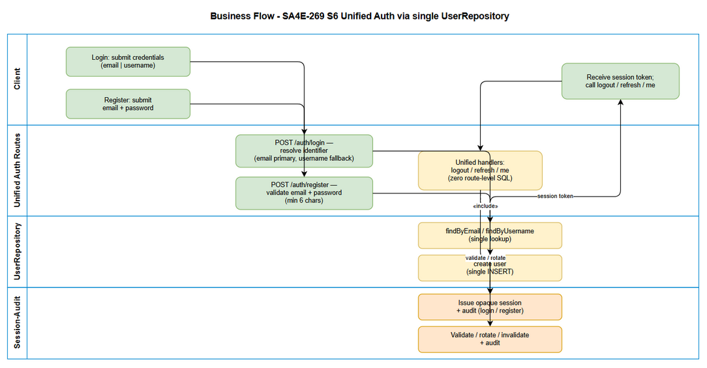
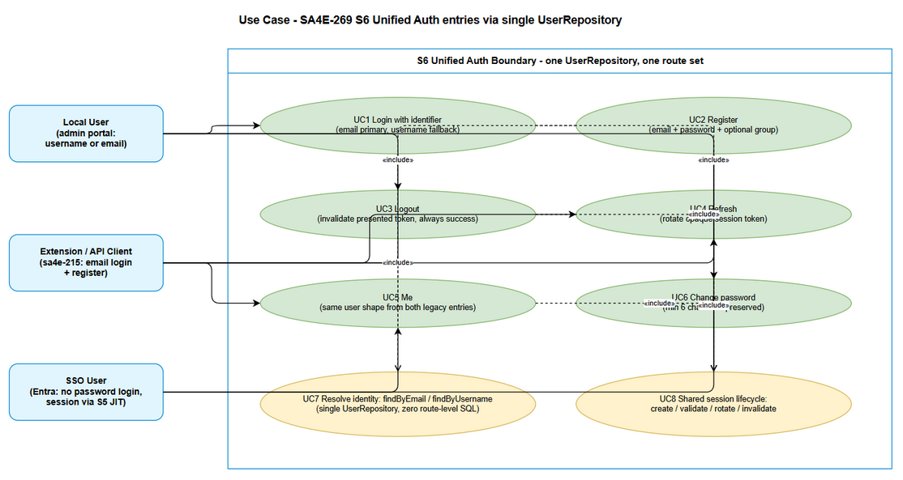

# Business Requirements Document (BRD)

## SA4E SSO Entra ID — SA4E-269: [Backend] Hop nhat 2 auth entry ve single UserRepository

---

## Document Information

| Field | Value |
|-------|-------|
| Jira Ticket | SA4E-269 |
| Title | [Backend] Hop nhat 2 auth entry ve single UserRepository |
| Epic | SA4E-262 — [SSO] Tich hop Microsoft Entra ID (OIDC + PKCE) voi JIT provisioning, giu local account song song |
| Type | Story |
| Author | BA Agent |
| Version | 1.0 |
| Date | 2026-09-14 |
| Status | Draft |

---

## Author Tracking

| Role | Name - Position | Responsibility |
|------|-----------------|----------------|
| Author | BA Agent – Business Analyst | Create document from SA4E-269 (live Jira) + SA4E-265 BRD + codebase evidence |
| Peer Reviewer | TBD – Tech Lead | Review unification scope and no-workaround compliance |

---

## Revision History

| Version | Date | Author | Changes |
|---------|------|--------|---------|
| 1.0 | 2026-09-14 | BA Agent | Initiate document — from live Jira SA4E-269 + documents/SA4E-SSO-Entra/PROPOSED-TICKETS.md S6 + documents/SA4E-265/BRD.md + backend/src/server/routes/admin/auth.ts + backend/src/server/routes/sa4e-215/auth.ts + UserRepository/users.ts/sessions.ts evidence |

---

## Sign-Off

| Name | Signature and date |
|------|--------------------|
| Product Owner | ☐ I agree and confirm all criteria on this BRD as expected requirements |
| Tech Lead | ☐ I agree and confirm all criteria on this BRD as expected requirements |

---

## 1. Introduction

### 1.1 Scope

SA4E-269 (S6, Epic SA4E-262) eliminates the two parallel local-auth code paths and replaces them with a single source of truth. Live Jira SA4E-269 description (verified 2026-09-14 via jira_get_issue): merge `backend/src/server/routes/admin/auth.ts` (username) and `backend/src/server/routes/sa4e-215/auth.ts` (email + /register) into a single UserRepository plus one set of login/logout/refresh/me. Standardize identity with email as primary and username as optional fallback. No two parallel code paths remain. Shared session lifecycle. [SA4E-269]

In scope (from ticket description + 5 Acceptance Criteria):

1. Single UserRepository owning ALL user data access for auth (find by id/email/username, create, update). Current `UserRepository` only has counts + updateEmail and must be extended; `admin/db/users.ts` `getUserByUsername` and raw `SELECT * FROM users WHERE email` in sa4e-215/auth.ts must converge into it. [SA4E-269 AC1]
2. Backward-compatible local login: existing username logins (admin portal) AND existing email logins (sa4e-215) both keep working after unification, with email as canonical identity and username as optional alias. [SA4E-269 AC2]
3. `/register` keeps working with identical contract (email + password + optional access_group_id, duplicate-email guard, audit REGISTER). [SA4E-269 AC3]
4. No duplicate routes: one canonical route set for login/logout/refresh/me (+ register); legacy aliases either removed or kept as thin deprecated delegates — never as second implementations. [SA4E-269 AC4]
5. Regression tests pass covering both old login shapes, register, session lifecycle, and duplicate-route scan. [SA4E-269 AC5]
6. Labels enforced: `auth`, `backend`, `refactor`, `no-workaround`. No temporary patch is acceptable — root-cause unification is mandatory.

### 1.2 Out of Scope

- S2 schema migration itself (new columns account_type/external_provider/external_subject_id, CHECK, unique index) — owned by SA4E-265. S6 consumes that schema but does not re-migrate. [SA4E-265]
- Entra config/env validation (S1/SA4E-264), RS256+JWKS verify (S3/SA4E-266), OAuth2 callback + PKCE (S4/SA4E-267), JIT provisioning + linking policy (S5/SA4E-268).
- Extension PKCE wiring/UI, hardening, STP/STC, docs, Entra app registration (S7–S12).
- SSO login flow itself (token verify, JIT create). S6 only guarantees the unified repository and session lifecycle that S5/S4 will reuse.
- New user-facing UI. This is a backend-only refactor; no screens added or changed.
- HYBRID account type or any change to the NO-HYBRID decision (locked in SA4E-265 BRD Section 5.2 and PROPOSED-TICKETS.md Sec 4).

### 1.3 Preliminary Requirement

- SA4E-265 (S2) migration completed: `users` has account_type (LOCAL/SSO, default LOCAL), external_provider, external_subject_id, nullable password_hash with conditional rule, unique (provider, subject). S6 code MUST be tolerant to both pre-migration rows (NULL externals) and post-migration rows. [SA4E-269 Depends on SA4E-265; SA4E-265 status In Progress]
- Existing session primitives in `backend/src/admin/db/sessions.ts` (createSession, validateSession, invalidateSession, refreshSession, invalidateUserSessions) remain the single session implementation — S6 reuses, does not fork. [sessions.ts]
- DatabaseAdapter async API is the only DB path (execAsync/runAsync/getAsync/allAsync); sync API throws on PostgreSQL. [SA4E-265 BRD Sec 1.3]
- Existing seed `seedAdminUser` (username admin) and sa4e-215 register default group grp-dev keep working.
---

## 2. Business Requirements

### 2.1 High Level Process Map

Today two auth entries coexist with overlapping responsibilities. `admin/auth.ts` logs in by username, serves login/logout/refresh/me/change-password, and even registers two extra aliases (`/api/auth/logout`, `/api/auth/refresh`). `sa4e-215/auth.ts` logs in by email, serves register/login/logout with a different response envelope (`{success, data}` vs bare `{token, user}`), and hits the DB with inline SQL instead of a repository. `UserRepository` exists but only exposes counts and updateEmail — it is NOT the auth data path. Result: two login semantics, two logout semantics (one tolerant to body refresh_token, one header-only), refresh only on one side, me only on one side, register only on one side.

After S6 there is exactly one UserRepository, one AuthService (or equivalent single use-case layer), and one canonical route set. Every login — whether the caller supplies an email or a legacy username — resolves through the same identity-resolution rule (email primary, username fallback), the same password check (PBKDF2 verifyPassword, LOCAL accounts only), the same session creation, the same last_login update, the same audit events, and the same permission load. Register funnels through the same repository with the same duplicate detection (username + email). Logout/refresh/me share one session lifecycle. A duplicate-route scan (grep for auth route registrations) returns exactly one implementation per operation.

*[Edit in draw.io](diagrams/business-flow.drawio)*

*[Edit in draw.io](diagrams/use-case.drawio)*

### Diagram Index

| # | Diagram | Image | Source (editable) |
|---|---------|-------|-------------------|
| 1 | Business Flow (swimlane: Client / Unified Auth / UserRepository / Session-Audit) | [business-flow.png](diagrams/business-flow.png) | [business-flow.drawio](diagrams/business-flow.drawio) |
| 2 | Use Case Diagram (actors + single-auth boundary) | [use-case.png](diagrams/use-case.png) | [use-case.drawio](diagrams/use-case.drawio) |
| 3 | Sequence — Unified Login (email-primary, username-fallback) | [sequence-login.png](diagrams/sequence-login.png) | [sequence-login.drawio](diagrams/sequence-login.drawio) |
| 4 | Sequence — Register + Logout/Refresh/Me via shared session lifecycle | [sequence-register.png](diagrams/sequence-register.png) | [sequence-register.drawio](diagrams/sequence-register.drawio) |

### 2.2 List of User Stories / Use Cases

| # | Story / Use Case / Epic | Priority | Source Ticket |
|---|-------------------------|----------|---------------|
| US-1 | As a Backend Developer, I want a single UserRepository owning all auth user data access so that no parallel user query path exists | MUST HAVE | SA4E-269 AC1 |
| US-2 | As an existing Local User, I want to log in with my old identifier (email or username) so that unification does not lock me out | MUST HAVE | SA4E-269 AC2 |
| US-3 | As a Backend Developer, I want one login/logout/refresh/me set plus preserved /register on a shared session lifecycle so that auth has exactly one code path | MUST HAVE | SA4E-269 AC3, AC4 |
| US-4 | As a QA Engineer, I want a regression suite proving single-repo, backward compat, no duplicate routes so that release is safe | MUST HAVE | SA4E-269 AC5 |

---
### 2.3 Details of User Stories

---

#### Business Flow

**Step 1:** Client calls the single canonical auth entry (login with identifier + password; register with email + password; logout/refresh/me with opaque session token).

**Step 2:** Unified auth layer resolves identity with one rule: if identifier looks like / matches an email, look up by email first; otherwise look up by username; if email lookup misses AND identifier could be a legacy username, fall back to username lookup. Exactly one repository method per lookup (findByEmail, findByUsername), both on the single UserRepository. [SA4E-269 description: email chinh, username tuy chon]

**Step 3:** Password path: if account_type is SSO-only with NULL password_hash, reject password login with a clear account-type error (never NPE on NULL hash). If LOCAL, verify with the single PBKDF2 verifyPassword. Disabled status rejects before password check outcome is revealed. [SA4E-265 conditional password rule]

**Step 4:** On success, shared session lifecycle creates one opaque session (createSession), updates last_login, records audit (LOGIN), loads permissions via getUserPermissions, and returns the unified session envelope.

**Step 5:** Register path reuses the same repository: check duplicate by email AND by username (register sets username=email today, so both guards fire consistently), hash with single hashPassword, insert with account_type=LOCAL, audit REGISTER.

**Step 6:** Logout invalidates the presented token; refresh rotates it (refreshSession); me validates it (validateSession) and returns the same user shape regardless of which legacy entry the caller used before.

**Step 7:** Duplicate-route elimination: the router registers exactly one handler per operation; any retained legacy URL is a thin delegate (no logic) marked deprecated, or is removed with a documented breaking-change note. A repo-wide route-registration scan is part of AC4 verification.

> **Note:** No-workaround is a hard gate: wrapping the two old implementations behind a facade while keeping both alive FAILS AC1/AC4. The old inline SQL (`SELECT * FROM users WHERE email`) and the old `getUserByUsername`-only path must be deleted or reduced to delegation calls into the single repository. Reviewers must reject any PR that leaves two live query paths.

---

#### STORY US-1: Single UserRepository as sole auth data path

> As a Backend Developer, I want a single UserRepository owning all auth user data access so that no parallel user query path exists

**Requirement Details:**

1. Extend `backend/src/database/repositories/UserRepository.ts` (currently only getUserCount/getUserCountByGroup/updateEmail) to own auth reads/writes: findById, findByEmail, findByUsername (with passwordHash for auth), findByExternalIdentity (provider, subject — forward-compat for S5 JIT), createLocalUser, updateLastLogin. All via DatabaseAdapter async methods. [SA4E-269 AC1; evidence: UserRepository.ts 68 lines, interfaces.ts IUserRepository thin]
2. Migrate `admin/db/users.ts` helpers (getUserById/getUserByUsername/createUser/updateLastLogin/...) to delegate into the single UserRepository — or be replaced by it. No second SQL text for the same query may remain live. The sa4e-215 inline `SELECT * FROM users WHERE email` MUST be deleted. [users.ts; sa4e-215/auth.ts lines 83-86]
3. Repository MUST be S2-aware: map account_type/external_provider/external_subject_id/password_hash-nullability; reject HYBRID at write; require (provider, subject) together for SSO rows; require password_hash for LOCAL rows. [SA4E-265 US-2 rules]
4. Single error vocabulary for identity failures: unknown identifier, disabled account, wrong password, SSO-only password attempt — identical regardless of entry URL.

**Data Fields (if applicable):**

| Field | Type | Required | Description | Example |
|-------|------|----------|-------------|---------|
| identifier | TEXT | Yes | Login input; email primary, username fallback | `a@company.com` or `nguyen.van.a` |
| email | TEXT | Yes | Canonical identity; normalized (trim + lowercase) | `a@company.com` |
| username | TEXT | No (optional alias) | Legacy identity; still unique, still required at row level for old rows | `nguyen.van.a` |
| password_hash | TEXT nullable | Conditional | PBKDF2 salt:hash; NULL only when account_type=SSO | `salt:hash` or `NULL` |
| account_type | TEXT | Yes | LOCAL or SSO only; NO HYBRID | `LOCAL` |
| external_provider | TEXT | SSO-only | Provider key, lowercase | `entra` |
| external_subject_id | TEXT | SSO-only | Entra oid preferred, sub fallback | `oid-uuid-123` |

**Acceptance Criteria:**

1. Codebase contains exactly one live UserRepository implementation used by all auth paths; old direct-SQL auth lookups are gone. [SA4E-269 AC1]
2. `code_search` / grep for `FROM users WHERE (username|email)` in auth paths returns only repository internals — zero route-level SQL.
3. SSO-only row (NULL password_hash) is readable via repository; password-login attempt on it fails cleanly (see US-2 error handling).

**Validation Rules (if applicable):**

- Identifier MUST be trimmed; email comparison MUST be case-insensitive (lowercase normalized).
- account_type outside LOCAL/SSO MUST be rejected with message naming allowed values and stating HYBRID is not allowed.
- SSO row with only one of (provider, subject) set MUST be rejected.

**Error Handling (if applicable):**

- Unknown identifier: generic `Invalid credentials` (no user-enumeration leak), plus LOGIN_FAILED audit with `unknown` userId — same as both legacy paths today.
- Disabled account: `Account disabled` 403 path preserved.
- Repository DB failure: translated RepositoryError, logged once, surfaced as `Internal error` / ERR_002 envelope per unified contract (contract choice owned by FSD, behavior parity required).

---

#### STORY US-2: Backward-compatible login (email-primary, username-fallback)

> As an existing Local User, I want to log in with my old identifier (email or username) so that unification does not lock me out

**Requirement Details:**

1. Unified login accepts a single `identifier` (plus password) and resolves via the email-primary rule. Legacy callers sending `{username, password}` (admin portal) and `{email, password}` (sa4e-215) MUST both succeed without client changes — the unified handler accepts both field names and maps them to identifier. [SA4E-269 AC2; evidence: admin/auth.ts lines 27-31 username path; sa4e-215/auth.ts lines 75-80 email path]
2. Username semantics: username remains a valid login alias (NOT removed). New registrations may default username=email (current sa4e-215 behavior) but the field stays optional-alias per ticket wording "username tuy chon". Admin seed `admin` username login MUST keep working.
3. Response envelope: FSD MUST pick ONE envelope (legacy admin bare `{token, user, expiresAt}` vs sa4e-215 `{success, data}`) and document the adapter for the other. BRD does not dictate which wins — only that behavior (token, userId, permissions, expiresAt) is identical for both identifier kinds.
4. change-password (`/api/admin/auth/change-password`) keeps working against the unified repository (it currently re-reads via getUserByUsername). [admin/auth.ts lines 97-108]

**Acceptance Criteria:**

1. Pre-unification username login (e.g. admin/admin-style LOCAL user) succeeds post-unification with same token + permissions shape. [SA4E-269 AC2]
2. Pre-unification email login (sa4e-215 user where username=email) succeeds post-unification. [SA4E-269 AC2]
3. Wrong-password and unknown-identifier cases return the same status codes as before for BOTH identifier kinds (no regression in 401/403 mapping).

**Validation Rules (if applicable):**

- Empty identifier or password MUST return 400 with a required-field message (both legacy paths already do; unify wording).
- New password rule (min 6 chars on change-password) is preserved unchanged.

**Error Handling (if applicable):**

- SSO-only user attempting password login: explicit `Password login not available for SSO account` (wording finalized in FSD), HTTP 401 or 403 consistently — never a null-hash crash, never a generic 500.
- Disabled LOCAL user: 403 disabled path takes precedence over password-mismatch response.

*[Edit in draw.io](diagrams/sequence-login.drawio)*

---

#### STORY US-3: One route set + preserved register + shared session lifecycle

> As a Backend Developer, I want one login/logout/refresh/me set plus preserved /register on a shared session lifecycle so that auth has exactly one code path

**Requirement Details:**

1. Canonical operations after S6: login, logout, refresh, me, register, change-password. Each has exactly ONE handler implementation. Route inventory today (evidence): admin/auth.ts registers `/api/admin/auth/login|logout|refresh|change-password|me` plus aliases `/api/auth/logout|refresh`; sa4e-215/auth.ts (mounted at `/api/sa4e-215`) registers `/auth/register|login|logout`. Refresh exists only on admin side; me only on admin side; register only on sa4e-215 side. S6 MUST close these gaps so every client can use the single set. [SA4E-269 AC3, AC4]
2. Register contract preserved: input email + password + optional access_group_id (default grp-dev today — keep default unless FSD justifies change); duplicate-email guard; INSERT sets username=email, status ACTIVE, force_password_change per current behavior; audit REGISTER; success envelope keeps userId/email/accessGroupId. [sa4e-215/auth.ts lines 33-70; SA4E-269 AC3]
3. Register duplicate detection MUST cover both email and username uniqueness (since username=email for these rows, a username collision IS an email collision). Surface as typed duplicate error, not silent overwrite — consistent with `users.ts` DUPLICATE checks referenced in SA4E-265 BRD.
4. Session lifecycle shared: createSession on login/register-auto-login (if specified — FSD decides; today register does NOT auto-login, preserve that unless changed explicitly); validateSession for me; invalidateSession for logout; refreshSession rotation for refresh; invalidateUserSessions on disable. No forked session table or second token format. [sessions.ts; SA4E-269 description]
5. Logout semantics unified: accept token from Authorization Bearer header AND (for compat) body refresh_token fallback that admin logout supports today; header-only sa4e-215 behavior becomes a subset. Always return success even for already-invalid tokens (both paths do today — preserve). [admin/auth.ts lines 63-76; sa4e-215/auth.ts lines 127-136]

**Data Fields (if applicable):**

| Field | Type | Required | Description | Example |
|-------|------|----------|-------------|---------|
| email (register) | TEXT | Yes | New account email, unique | `new@company.com` |
| password (register) | TEXT | Yes | Plain password, hashed server-side PBKDF2 | `S3cret!` |
| access_group_id (register) | TEXT | No | Defaults to grp-dev; must reference existing group | `grp-dev` |
| refresh_token (refresh/logout compat) | TEXT | Yes for refresh | Opaque session token | `tok_...` |
| Authorization Bearer (logout/me) | TEXT | Yes | Session token header | `Bearer tok_...` |

**Acceptance Criteria:**

1. `/register` with new email succeeds and the new user can immediately log in via unified login (email and username=email both work). [SA4E-269 AC3]
2. Duplicate register (same email) is rejected with the pre-existing duplicate message/code — no second account created. [SA4E-269 AC3]
3. Route scan shows no duplicate live handler: exactly one login implementation, one logout, one refresh, one me, one register (aliases, if any, are documented thin delegates). [SA4E-269 AC4]
4. Refresh rotates token and old token stops working; logout invalidates token and me with that token fails; behavior identical whether the session was created via email-login or username-login.

**Validation Rules (if applicable):**

- Register MUST validate email format + password presence before any DB write (400 paths preserved).
- access_group_id MUST reference an existing access_groups row; unknown group MUST fail explicitly (FSD decides 400 vs fallback-to-default — BRD requires the decision documented, default preserved as grp-dev).
- Refresh without token MUST return 400; invalid/expired token MUST return 401 (admin refresh semantics preserved).

**Error Handling (if applicable):**

- Register DB failure: `Registration failed` 500 path preserved; no partial user row without audit-or-rollback ambiguity (FSD defines transactional boundary).
- Refresh on expired/disabled session: 401 invalid-or-expired path; expired token is deactivated (sessions.ts background-expiry behavior preserved).

*[Edit in draw.io](diagrams/sequence-register.drawio)*

---

#### STORY US-4: Regression proof (single-repo, compat, no-duplicate, session parity)

> As a QA Engineer, I want a regression suite proving single-repo, backward compat, no duplicate routes so that release is safe

**Requirement Details:**

1. Regression MUST cover: (a) username login old fixture; (b) email login old fixture; (c) register + duplicate register; (d) logout invalidates; (e) refresh rotates; (f) me returns same shape for both login kinds; (g) change-password still works; (h) static route-duplication scan; (i) SSO-only NULL-password row login rejected cleanly (S2-shape tolerance). [SA4E-269 AC5 = regression tests pass]
2. Existing suites `backend/src/server/routes/__tests__/admin.test.ts` (admin login/me/logout) and `UserRepository.test.ts` + `admin-db.test.ts` (getUserById/getUserByUsername) MUST keep passing or be updated to the unified contract with documented diffs. No silent test deletion.
3. Duplication scan is automated, not manual: grep/AST check that route files contain no `FROM users` inline SQL and that auth route registration per operation resolves to one handler. FSD/TDD own the exact assertion; BRD requires its existence.

**Acceptance Criteria:**

1. Full regression run passes on SQLite AND PostgreSQL (S2 dual-engine requirement carries over — unification touches the same users/sessions tables). [SA4E-269 AC5]
2. Evidence attached: test report + route-scan output showing one handler per operation and zero route-level user SQL.
3. Every SA4E-269 AC (AC1–AC5) maps to at least one executed test (traceability in Section 8.C).

**UI Specifications (if applicable):**

- None — backend-only refactor. No screens added, removed, or restyled. No UI spec table required beyond this statement.

---
