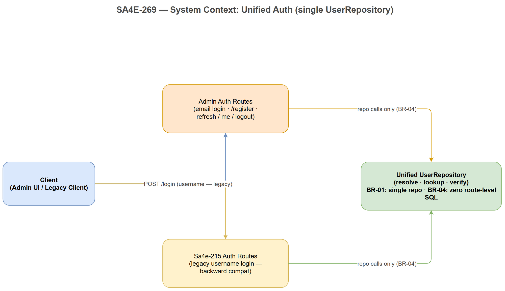
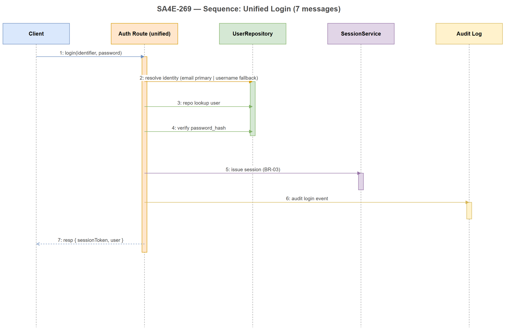
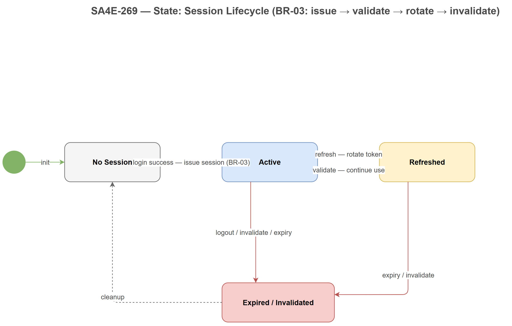

# FSD — SA4E-269 [Backend] Hợp nhất 2 auth entry về single UserRepository

## 1. Document Information

| Field | Value |
|---|---|
| Ticket | SA4E-269 |
| Epic | SA4E-262 |
| Type | Story |
| Labels | auth, backend, refactor, no-workaround |
| Document Version | draft v1 |
| Status | Draft — chờ TA enrich |
| Author | ba-agent |
| Created | 2026-09-15 |

## 2. Problem Statement

Hệ thống đang có **2 auth entry độc lập** (admin auth routes và Sa4e-215 legacy auth routes), mỗi entry có code path riêng: lookup user, verify password, issue session. Hậu quả:

- Logic xác thực trùng lặp, dễ drift (hành vi sai khác giữa 2 path).
- SQL nằm rải rác ở route layer, khó bảo trì và test.
- Session lifecycle không nhất quán giữa 2 entry.

Story này hợp nhất toàn bộ auth về **một UserRepository duy nhất** (no-workaround: fix tận gốc, không tạo wrapper song song).

## 3. Scope

| In Scope | Out of Scope |
|---|---|
| Unified login (email + username backward compat) | UI / Webview changes |
| /register email+password (giữ nguyên hành vi) | OAuth / SSO / MFA |
| refresh / me / logout dùng chung session lifecycle | Password reset flow |
| Identity mapping (email primary, username fallback) | Rate limiting / brute-force protection |
| Loại bỏ route-level SQL trong auth routes | DB schema migration (nếu không bắt buộc) |

## 4. Use Cases

### UC-01 — Login bằng email (unified path)

**Actor:** User (admin / client app)

| Flow | Steps |
|---|---|
| **Main** | 1. Client gọi `POST /login` với `{identifier: <email>, password}`. 2. Auth route gọi `UserRepository.resolve(identifier)` — email lookup trúng ngay (primary). 3. Repo trả user + `password_hash`; verify password thành công. 4. Issue session theo BR-03, trả `{sessionToken, user}` (200). |
| **Alternative** | 3a. Password không khớp `password_hash` → ERR-01 (401), ghi audit login failed. |
| **Exception** | E1. Email không tồn tại → ERR-02 (404). E2. Repo/DB lỗi → 500, không lộ chi tiết internals. |

### UC-02 — Login bằng username cũ (backward compat)

**Actor:** Legacy user (Sa4e-215)

| Flow | Steps |
|---|---|
| **Main** | 1. Client gọi `POST /login` với `{identifier: <username>, password}`. 2. `resolve()`: email lookup fail → **username fallback** (BR-02). 3. Lookup user theo username → verify password thành công. 4. Issue session, trả `{sessionToken, user}` (200) — cùng response shape với UC-01. |
| **Alternative** | 2a. Username trùng nhiều user (vi phạm unique) → ERR-02 (404), log cảnh báo data quality. |
| **Exception** | E1. Username không tồn tại → ERR-02 (404). E2. Password sai → ERR-01 (401). |

### UC-03 — /register email+password (giữ nguyên)

**Actor:** New user

| Flow | Steps |
|---|---|
| **Main** | 1. Client gọi `POST /register` với `{email, password}`. 2. Route kiểm tra email chưa tồn tại (qua repo). 3. Tạo user mới (username optional, để trống). 4. Trả user (201) — hành vi giữ nguyên so với hiện tại. |
| **Alternative** | 2a. Email đã tồn tại → ERR-03 (409), không tạo user. |
| **Exception** | E1. Payload thiếu/không hợp lệ (email sai format, password yếu) → 400 validation error. |

### UC-04 — refresh / me / logout (unified session)

**Actor:** Authenticated user

| Flow | Steps |
|---|---|
| **Main** | 1. Client gọi `POST /refresh` với sessionToken → validate → **rotate** token mới, trả `{sessionToken}` (200). 2. Client gọi `GET /me` → validate → trả user profile (200). 3. Client gọi `POST /logout` → **invalidate** session (200/204). |
| **Alternative** | 1a. Token sắp hết hạn nhưng vẫn hợp lệ → rotate bình thường, session cũ bị thu hồi ngay. |
| **Exception** | E1. Token hết hạn hoặc đã invalidate → ERR-04 (401). E2. Token không tồn tại/sai format → ERR-04 (401). |

## 5. Business Rules

| ID | Rule |
|---|---|
| **BR-01** | Chính xác **một** `UserRepository` duy nhất phục vụ mọi auth entry. KHÔNG được tồn tại 2 code path auth song song (no-workaround). |
| **BR-02** | Identity resolution: **email là primary**, **username là fallback**. Username optional nhưng unique khi tồn tại. |
| **BR-03** | Session lifecycle dùng chung cho mọi entry: `issue → validate → rotate → invalidate`. Không entry nào tự quản session riêng. |
| **BR-04** | **Zero route-level SQL** — auth routes KHÔNG viết SQL trực tiếp, chỉ gọi methods của UserRepository. |

## 6. Data Specifications

### 6.1 Unified Login — Request

```json
{
  "identifier": "user@example.com | legacy_username",
  "password": "string (plaintext over TLS, chỉ dùng lúc verify)"
}
```

### 6.2 Unified Login — Response (200)

```json
{
  "sessionToken": "string",
  "user": {
    "id": "string",
    "email": "string",
    "username": "string | null"
  }
}
```

### 6.3 Identity Mapping

| Field | Bắt buộc | Unique | Vai trò |
|---|---|---|---|
| email | Yes | Yes | Primary identity — lookup chính |
| username | No | Yes (khi tồn tại) | Fallback identity — backward compat UC-02 |

### 6.4 Session Record (conceptual)

| Field | Mô tả |
|---|---|
| sessionId | Định danh session |
| userId | Tham chiếu user |
| tokenHash | Hash của sessionToken (không lưu plaintext) |
| issuedAt / expiresAt | Vòng đời theo BR-03 |
| rotatedFrom | Vết rotate (refresh) |

## 7. Error Catalog

| ID | Error | HTTP | Điều kiện xảy ra | UC |
|---|---|---|---|---|
| ERR-01 | `invalid_credentials` | 401 | Identifier resolve được user nhưng password sai `password_hash` | UC-01, UC-02 |
| ERR-02 | `user_not_found` | 404 | Identifier (email + username fallback) không resolve được user | UC-01, UC-02 |
| ERR-03 | `duplicate_register` | 409 | `/register` với email đã tồn tại | UC-03 |
| ERR-04 | `session_expired` | 401 | SessionToken hết hạn hoặc đã bị invalidate | UC-04 |

## 8. Traceability — Acceptance Criteria

| AC | Mô tả | UC | BR |
|---|---|---|---|
| AC-1 | Codebase chỉ còn **1 UserRepository**; không còn 2 code path auth song song | UC-01..UC-04 | BR-01 |
| AC-2 | Login bằng **email** và **username cũ** đều chạy qua unified path, cùng response shape | UC-01, UC-02 | BR-02 |
| AC-3 | `/register` email+password giữ nguyên hành vi (201 / 409 / 400) | UC-03 | BR-01 |
| AC-4 | Không có duplicate route: không route-level SQL, không auth logic trùng lặp | UC-01..UC-04 | BR-04 |
| AC-5 | Regression pass: toàn bộ test auth hiện có (admin + Sa4e-215) xanh sau merge | UC-01..UC-04 | BR-03 |

## 9. API Contracts

<!-- TA enrichment -->

### 9.1 Unified UserRepository Interface

Merge từ 2 code path hiện có (`admin/db/users.ts` + `server/routes/sa4e-215/auth.ts`) về một interface tại `backend/src/database/repositories/UserRepository.ts` (extends `IUserRepository` hiện có, giữ pattern `DatabaseAdapter` + `translateError`):

```typescript
interface IAuthUserRepository {
  findByEmail(email: string): Promise<UserRow | null>;
  findByUsername(username: string): Promise<UserRow | null>;
  findById(id: string): Promise<UserRow | null>;
  createUser(data: {
    email: string;
    username?: string;          // optional — unique khi tồn tại (BR-02)
    passwordHash: string;       // PBKDF2, không bao giờ plaintext
    accountType: 'admin' | 'client';
  }): Promise<UserRow>;
  verifyCredentials(identifier: string, password: string): Promise<UserRow | null>;
  // resolve: email primary → username fallback (BR-02)
}
```

`UserRow` mapping: `user_id → id`, `username → string | null`, `email`, `password_hash → passwordHash`. Tất cả methods parameterized SQL, throw `RepositoryError` (qua `translateError`) — `[Implements: BR-01, BR-04]`.

### 9.2 Auth Routes Contract

Một bộ routes duy nhất (`server/routes/auth/`), gọi repo — không SQL ở route layer `[Implements: BR-04]`:

| Method | Path | Request Body | Success Response | Errors |
|---|---|---|---|---|
| POST | `/auth/login` | `{identifier, password}` (Zod: identifier non-empty, password non-empty) | 200 `{sessionToken, user{id,email,username}}` | 401 ERR-01, 404 ERR-02, 500 |
| POST | `/auth/register` | `{email, password, username?}` (Zod: email format, password min-8) | 201 `{user{id,email,username}}` | 400 validation, 409 ERR-03, 500 |
| POST | `/auth/refresh` | header `Authorization: Bearer <sessionToken>` | 200 `{sessionToken}` (rotated) | 401 ERR-04 |
| GET | `/auth/me` | header `Authorization: Bearer <sessionToken>` | 200 `{user{id,email,username}}` | 401 ERR-04 |
| POST | `/auth/logout` | header `Authorization: Bearer <sessionToken>` | 204 No Content | 401 ERR-04 |

Auth header: `Authorization: Bearer <opaque sessionToken>`. Session record không chứa plaintext token (chỉ `tokenHash` — §6.4).

### 9.3 Behavior Matrix — ERR-01..ERR-04

| ERR | HTTP | Trigger | Route | Response Body |
|---|---|---|---|---|
| ERR-01 | 401 | `verifyCredentials` resolve được user nhưng password sai `password_hash` | login | `{error: "invalid_credentials"}` + audit login-failed |
| ERR-02 | 404 | identifier (email + username fallback) không resolve được user | login | `{error: "user_not_found"}` |
| ERR-03 | 409 | `/auth/register` email đã tồn tại (repo check) | register | `{error: "duplicate_register"}` |
| ERR-04 | 401 | sessionToken hết hạn / invalidated / sai format | refresh, me, logout | `{error: "session_expired"}` |

500 (DB/repo failure): `{error: "internal_error"}` — không lộ internals.

## 10. Integration Specifications

<!-- TA enrichment -->

### 10.1 Route Consolidation (Existing Codebase Mapping)

| Hiện có | Hành vi | Sau hợp nhất |
|---|---|---|
| `backend/src/admin/db/users.ts` + admin auth routes | username lookup, verify, issue session | Gọi chung `UserRepository` (database/repositories/) |
| `backend/src/server/routes/sa4e-215/auth.ts` | email lookup + register (inline INSERT — route-level SQL) | Gọi chung `UserRepository`, xoá inline SQL |
| `backend/src/database/repositories/UserRepository.ts` | `getUserCount`, `updateEmail` (SA4E-50) | Mở rộng với auth methods (§9.1) — 1 class duy nhất |

Kết quả: **1 bộ routes** (`server/routes/auth/`) gọi **1 UserRepository** — zero route-level SQL, zero auth logic trùng lặp `[Implements: BR-01, BR-04, AC-4]`.

### 10.2 Shared Session Lifecycle

Giữ pattern opaque session hiện có — không entry nào tự quản session `[Implements: BR-03]`:

```
issue(user)     → tạo sessionToken, lưu tokenHash + expiresAt
validate(token) → hash-lookup + expiry check → user | ERR-04
rotate(token)   → validate → thu hồi session cũ → issue session mới (rotatedFrom = cũ)
invalidate(token) → đánh dấu expiresAt = now (logout)
```

Cả 2 entry cũ (admin + Sa4e-215) đều đi qua cùng 4 operations này.

### 10.3 verifyCredentials() — Pseudocode

```typescript
// [Implements: BR-02, ERR-01, ERR-02]
async verifyCredentials(identifier: string, password: string): Promise<UserRow | null> {
  // Step 1: Resolve identity — email primary, username fallback
  const isEmail = /^[^\s@]+@[^\s@]+\.[^\s@]+$/.test(identifier);
  const user = isEmail
    ? await this.findByEmail(identifier)
    : await this.findByUsername(identifier);
  if (!user) throw new UserNotFoundError(ERR-02);   // không resolve được
  // Step 2: Compare password_hash (PBKDF2 — pattern sa4e-215/auth.ts hiện có)
  const ok = verifyPassword(password, user.passwordHash);
  // Step 3: Return
  return ok ? user : null;   // null → route map ERR-01 (401) + audit
}
```

### 10.4 Backward Compatibility

- **Username login cũ (admin):** `identifier=<username>` → không khớp email regex → `findByUsername` — cùng path unified, response shape giống UC-01.
- **`/register` email cũ (Sa4e-215):** cùng `/auth/register` path, hành vi giữ nguyên (201 / 409 ERR-03 / 400).
- Không có route legacy song song; client cũ chỉ đổi base path. DB schema giữ nguyên — không migration bắt buộc.

## 11. Diagrams

### Diagram Index

| # | File | Nội dung |
|---|---|---|
| 1 | `diagrams/system-context-auth.drawio` | System context auth: Client → Admin routes + Sa4e-215 routes → Unified UserRepository |
| 2 | `diagrams/sequence-unified-login.drawio` | Sequence unified login 7 message: login → resolve → lookup → verify → issue session → audit → resp |
| 3 | `diagrams/state-session.drawio` | State session lifecycle: No Session → Active → Refreshed → Expired/Invalidated |







---
*Generated by ba-agent — draft v1. TA enrich sections 9–10 trước khi chuyển SA review.*
