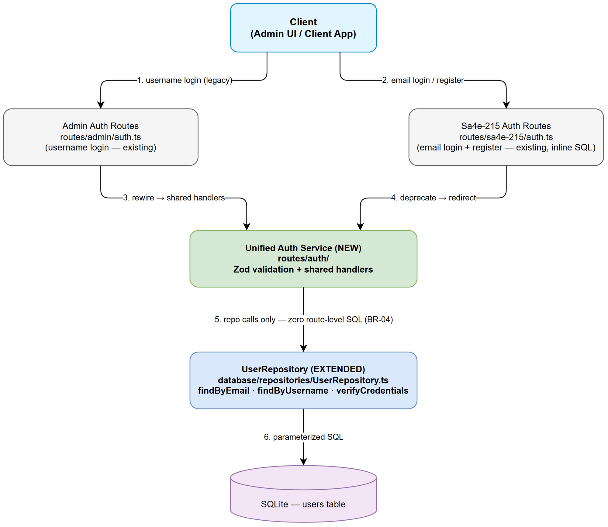
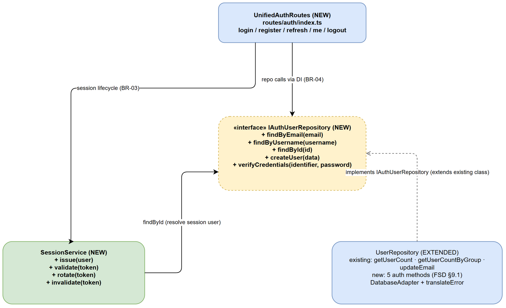

# TDD — SA4E-269 [Backend] Hợp nhất 2 auth entry về single UserRepository

Document Information: Ticket SA4E-269, Epic SA4E-262, Story, Labels auth/backend/refactor/no-workaround, v1.0, 2026-09-15. References: FSD-v1 (266 dòng), BRD-v1.

## 1. Architecture Overview
- Gộp 2 auth entry: backend/src/server/routes/admin/auth.ts (username) + backend/src/server/routes/sa4e-215/auth.ts (email + /register) → 1 bộ unified routes gọi chung UserRepository
- Zero route-level SQL — routes chỉ gọi repo (SRP)
- Identity: email làm chính, username tùy chọn (resolve: email primary, username fallback)
- Session lifecycle dùng chung: issue/validate/rotate/invalidate (opaque session, pattern hiện có)

## 2. Component Design
- IAuthUserRepository (interface, mở rộng từ IUserRepository hiện có): findByEmail(email), findByUsername(username), findById(id), createUser({email, username?, passwordHash, accountType}), verifyCredentials(identifier, password)
- UserRepository: mở rộng class hiện có tại backend/src/database/repositories/UserRepository.ts (implements IAuthUserRepository — KHÔNG tạo class mới, no-workaround)
- UnifiedAuthRoutes: 1 bộ login/register/refresh/me/logout, admin/auth.ts rewire, sa4e-215/auth.ts deprecate
- SessionService: issue (rotate sau login), validate, invalidate

## 3. API Design
- POST /auth/login {identifier, password} → 200 {sessionToken, user} | 401 ERR-01
- POST /auth/register {email, password, username?} → 201 {user} | 409 ERR-03
- POST /auth/refresh {sessionToken} → 200 {sessionToken} | 401 ERR-04
- GET /auth/me → 200 {user} | 401 ERR-04
- POST /auth/logout {sessionToken} → 204
- Zod schema cho mọi request body

## 4. Error Handling
- ERR-01 invalid_credentials 401, ERR-02 user_not_found 404, ERR-03 duplicate_register 409, ERR-04 session_expired 401
- Behavior matrix: identifier không match email/username → ERR-01; email trùng khi register → ERR-03; session hết hạn → ERR-04

## 5. Security Design
- PBKDF2 password compare (không plaintext)
- Opaque session, rotate sau login (chống session fixation)
- Không log password/hash; audit_log ghi login/register/logout

## 6. Implementation Checklist
- backend/src/database/repositories/UserRepository.ts: thêm verifyCredentials + createUser (accountType)
- backend/src/server/routes/admin/auth.ts: rewire sang unified routes
- backend/src/server/routes/sa4e-215/auth.ts: deprecate (giữ /register path cũ redirect nội bộ)
- backend/src/server/services/SessionService.ts: dùng chung lifecycle
- Tests: backend/tests/unit/auth-unified.test.ts (email login, username login cũ, register, dup reject, refresh, logout, regression cả 2 path cũ)

## 7. Diagrams

### Diagram Index
| # | Diagram | Image | Source (editable) |
|---|---------|-------|-------------------|
| 1 | Architecture Unified Auth | [architecture-unified-auth.png](diagrams/architecture-unified-auth.png) | [architecture-unified-auth.drawio](diagrams/architecture-unified-auth.drawio) |
| 2 | Component Unified Auth | [component-unified-auth.png](diagrams/component-unified-auth.png) | [component-unified-auth.drawio](diagrams/component-unified-auth.drawio) |

Draw.io only — Never Mermaid. 0 placeholder.
