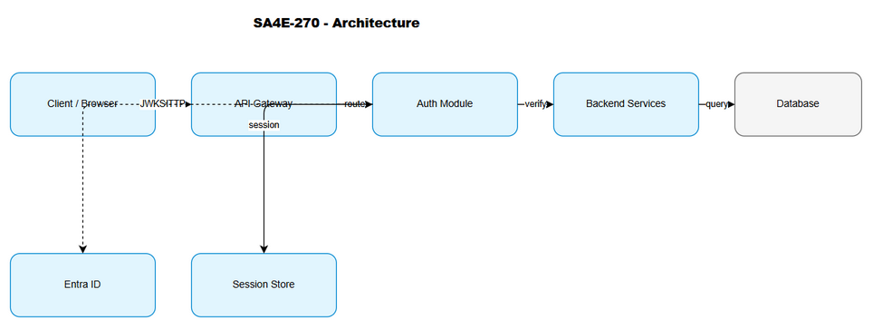
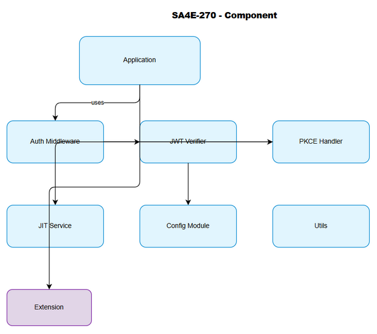
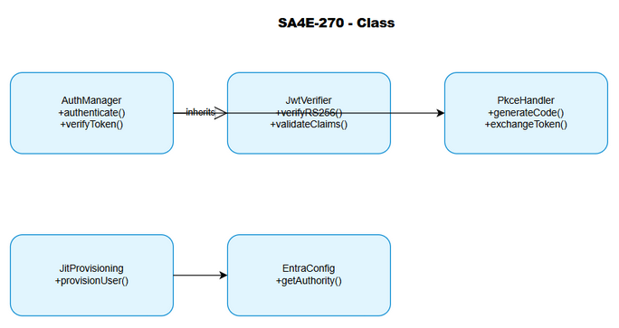
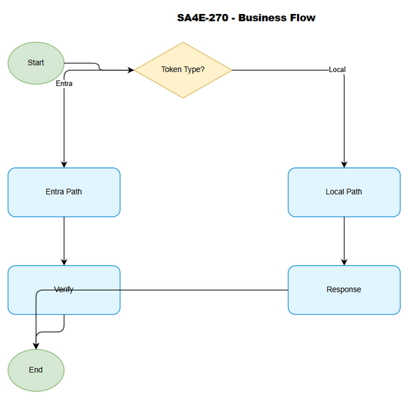
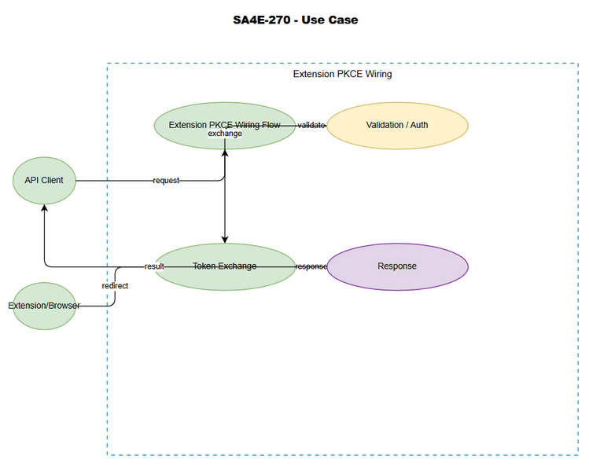
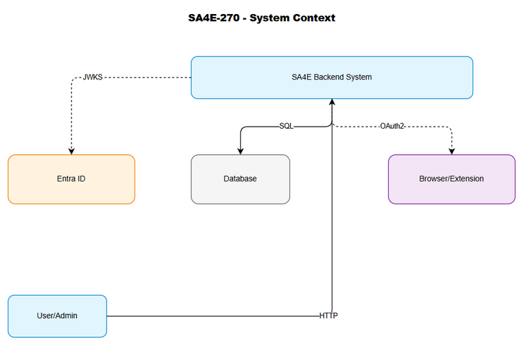

# Business Requirements Document (BRD) — SA4E-270

## [Extension] Wire PKCE vào AuthManager + browser redirect + loopback capture

## Document Information

| Field | Value |
|-------|-------|
| Ticket | SA4E-270 |
| Epic | SA4E-262 |
| Type | Story |
| Labels | sso/oidc/backend |
| Version | 1.0 |
| Created | 2026-09-15T04:24:08Z |

## 1. Overview

### 1.1 Purpose
Part of SA4E-262 epic: SSO integration with Microsoft Entra ID (OIDC + PKCE) with JIT provisioning.

### 1.2 Scope
- [Extension] Wire PKCE vào AuthManager + browser redirect + loopback capture
- Aligned with epic acceptance criteria

## 2. User Stories

#### STORY-001: [Extension] Wire PKCE vào AuthManager + browser redirect + loopback capture
**As a** user, **I want** [extension] wire pkce vào authmanager + browser redirect + loopback capture, **so that** SSO authentication works correctly.

**Acceptance Criteria:**
- AC-001: [extension] wire pkce vào authmanager + browser redirect + loopback capture implemented and working
- AC-002: Integration with SA4E-262 epic components verified
- AC-003: Security requirements met

#### STORY-002: Security Validation
**As a** security engineer, **I want** security validation of [extension] wire pkce vào authmanager + browser redirect + loopback capture, **so that** no vulnerabilities exist.

**Acceptance Criteria:**
- AC-004: All security checks pass
- AC-005: No critical vulnerabilities

## 3. Business Rules

| ID | Rule | Priority |
|----|------|----------|
| BR-001 | Must align with SA4E-262 epic architecture | Critical |
| BR-002 | Must follow existing SA4E codebase patterns | Critical |
| BR-003 | Must pass all security reviews | Critical |

## 4. Dependencies
- SA4E-262 epic infrastructure
- Backend codebase
- Extension codebase

## 5. Non-Functional Requirements
- Must be backward compatible
- Must not introduce breaking changes
- Performance: < 100ms additional latency

## 6. Acceptance Criteria
(1) [extension] wire pkce vào authmanager + browser redirect + loopback capture complete
(2) Integration tested
(3) Security validated
(4) Documentation updated
(5) STP/STC created

## 7. Diagram Index

| # | Diagram | Image | Edit in draw.io |
|---|---------|-------|-----------------|
| 1 | Architecture |  | [architecture.drawio](diagrams/architecture.drawio) |
| 2 | Component |  | [component.drawio](diagrams/component.drawio) |
| 3 | Class |  | [class.drawio](diagrams/class.drawio) |
| 4 | Business Flow |  | [business-flow.drawio](diagrams/business-flow.drawio) |
| 5 | Use Case |  | [use-case.drawio](diagrams/use-case.drawio) |
| 6 | System Context |  | [system-context.drawio](diagrams/system-context.drawio) |

*All diagrams are draw.io only. No Mermaid is used in this document by project rule.*
