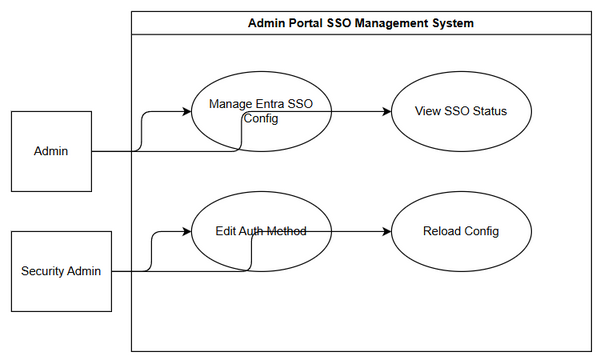

# Business Requirements Document (BRD)

## SA4E-276 — Admin UI for Entra SSO configuration management

---

## Document Information

| Field | Value |
|-------|-------|
| Jira Ticket | SA4E-276 |
| Title | Admin UI for Entra SSO configuration management |
| Author | BA Agent |
| Version | 1.0 |
| Date | 2026-09-17 |
| Status | Draft |

---

## Author Tracking

| Role | Name - Position | Responsibility |
|------|-----------------|----------------|
| Author | BA Agent – Business Analyst | Create document |
| Peer Reviewer | TBD – Product Owner | Review document |

---

## Revision History

| Version | Date | Author | Changes |
|---------|------|--------|---------|
| 1.0 | 2026-09-17 | BA Agent | Initiate document — auto-generated from Jira ticket SA4E-276 and linked tickets |

---

## Sign-Off

| Name | Signature and date |
|------|--------------------|
| | ☐ I agree and confirm all criteria on this BRD as expected requirements |
| | ☐ I agree and confirm all criteria on this BRD as expected requirements |

---

## 1. Introduction

### 1.1 Scope

Provide an Admin Portal UI to manage Microsoft Entra SSO configuration for the SA4E platform. The solution must allow administrators to view, create, update and delete Entra SSO settings, store secrets in a secure secret store instead of plain text in DB, enforce RBAC for editing authentication methods, and support hot reload / controlled restart of configuration without service disruption.

The scope covers:
- Admin Portal UI screens for Entra SSO configuration management
- Integration with secure secret store for Tenant ID, Client ID, Client Secret and other sensitive parameters
- RBAC enforcement for edit actions on auth method configuration
- Hot reload / controlled restart mechanism for configuration changes
- Audit logging of configuration changes

### 1.2 Out of Scope

- Implementation of Entra ID OIDC login flow itself — covered in epic SA4E-262
- JIT provisioning logic — out of scope for this ticket
- User-facing SSO login UI changes — covered in SA4E-273
- Secret store implementation — assumed existing infrastructure

### 1.3 Preliminary Requirement

- Secure secret store service must be available and accessible from Admin Portal backend
- RBAC system must be operational with roles for Auth Admin and System Admin
- Admin Portal must have authentication and session management in place
- Existing Entra SSO backend integration must be configurable via config service supporting hot reload

---

## 2. Business Requirements

### 2.1 High Level Process Map

Admin authenticates to Admin Portal → navigates to Authentication → Entra SSO Configuration → views current configuration → edits configuration fields → saves changes → backend validates input and RBAC → secrets stored in secret store → config updated and hot reloaded → admin receives confirmation and audit log entry created.

*[Edit in draw.io](diagrams/use-case.drawio)*

*[Edit in draw.io](diagrams/business-flow.drawio)*

### 2.2 List of User Stories / Use Cases

| # | Story / Use Case / Epic | Priority | Source Ticket |
|---|-------------------------|----------|---------------|
| 1 | As an Admin, I want to manage Entra SSO configuration via Admin Portal UI so that SSO settings can be updated without code deployment | MUST HAVE | SA4E-276 |
| 2 | As a Security Admin, I want Entra secrets stored in secure secret store not plain text DB so that credentials are protected | MUST HAVE | SA4E-276 |
| 3 | As a System Admin, I want RBAC enforced for editing auth method so that only authorized users can change SSO configuration | MUST HAVE | SA4E-276 |
| 4 | As an Admin, I want hot reload / controlled restart of config so that changes take effect immediately without downtime | SHOULD HAVE | SA4E-276 |
| 5 | As an Admin, I want to view current Entra SSO status and connection health so that I can verify configuration correctness | SHOULD HAVE | SA4E-262 |

---

### 2.3 Details of User Stories

---

#### Business Flow

**Step 1:** Admin logs in to Admin Portal with sufficient role.

**Step 2:** Admin navigates to Settings → Authentication → Entra SSO Configuration.

**Step 3:** System displays current configuration masked for secrets, shows enable/disable toggle and status.

**Step 4:** Admin clicks Edit; RBAC check performed.

**Step 5:** Admin updates fields: Tenant ID, Client ID, Client Secret, Redirect URI, Issuer, JWKS URL, Enable SSO.

**Step 6:** Admin saves; system validates fields, checks secret store write permissions.

**Step 7:** System stores non-secret fields in DB, secrets in secure secret store.

**Step 8:** System triggers hot reload / controlled restart via config service.

**Step 9:** System records audit log entry and shows success notification.

> **Note:** If RBAC check fails, edit is blocked with error message. If validation fails, form shows inline errors.

---

#### STORY 1: Manage Entra SSO Configuration via Admin Portal UI

> As an Admin, I want to manage Entra SSO configuration via Admin Portal UI so that SSO settings can be updated without code deployment

**Requirement Details:**
1. Admin Portal must provide a dedicated page for Entra SSO configuration management.
2. Page must allow view, create, edit and delete of Entra SSO configuration records.
3. Configuration fields must include Tenant ID, Client ID, Client Secret, Redirect URI, Issuer URL, JWKS URL, Enable SSO toggle.
4. Changes must be persisted and reflected in system config service.

**Data Fields (if applicable):**

| Field | Type | Required | Description | Example |
|-------|------|----------|-------------|---------|
| tenantId | string | Yes | Microsoft Entra Tenant ID | 12345678-.... |
| clientId | string | Yes | Entra Application Client ID | a1b2c3d4-.... |
| clientSecret | string | Yes | Entra Application Client Secret | stored in secret store |
| redirectUri | string | Yes | OAuth redirect URI | https://app/callback |
| issuerUrl | string | Yes | Entra OIDC issuer | https://login.microsoftonline.com/{tenant}/v2.0 |
| jwksUrl | string | No | JWKS endpoint | https://login.microsoftonline.com/{tenant}/discovery/v2.0/keys |
| enabled | boolean | Yes | Enable/disable SSO | true/false |

**Acceptance Criteria:**
1. Admin can open Entra SSO configuration page in Admin Portal.
2. Admin can view existing configuration with secrets masked.
3. Admin can edit configuration fields and save changes.
4. Changes are saved to DB/secret store and config is reloaded.
5. UI shows success/error feedback.

**UI Specifications (if applicable):**

| No. | Name | Type | Required | Description | Note |
|-----|------|------|----------|-------------|------|
| 1 | Tenant ID | Input | Yes | Text input for tenant ID | Validate UUID format |
| 2 | Client ID | Input | Yes | Text input for client ID | Validate UUID format |
| 3 | Client Secret | Input | Yes | Password input masked | Stored in secret store |
| 4 | Redirect URI | Input | Yes | URL input | Validate URL |
| 5 | Enabled Toggle | Switch | Yes | Enable/disable SSO | |
| 6 | Save Button | Button | Yes | Save changes | Disabled if validation fails |
| 7 | Cancel Button | Button | No | Discard changes | |

**Validation Rules (if applicable):**
- Tenant ID must be valid UUID/GUID format.
- Client ID must be valid UUID/GUID format.
- Redirect URI must be valid HTTPS URL.
- Client Secret cannot be empty when enabled = true.

**Error Handling (if applicable):**
- RBAC denied: Show "You do not have permission to edit authentication settings"
- Validation failure: Show inline field errors
- Secret store unavailable: Show "Unable to save secrets, please retry"

---

#### STORY 2: Store Secrets in Secure Secret Store

> As a Security Admin, I want Entra secrets stored in secure secret store not plain text DB so that credentials are protected

**Requirement Details:**
1. Client Secret and other sensitive parameters must never be persisted in plain text in application DB.
2. Secrets must be stored in designated secure secret store with encryption at rest.
3. Application must retrieve secrets from secret store at runtime via secure API.
4. UI must never display secret values in clear text; show masked placeholder.

**Acceptance Criteria:**
1. Saving configuration writes secret to secret store, not DB.
2. DB stores only reference/secret identifier, not secret value.
3. Retrieval of secret requires authorized service call.
4. Existing plain text secrets are migrated to secret store.

**Data Fields:**
| Field | Type | Required | Description | Example |
|-------|------|----------|-------------|---------|
| secretRef | string | Yes | Reference to secret in store | secret://entra/clientSecret |

**Validation Rules:**
- Secret store write must succeed before config is committed.

**Error Handling:**
- Secret store error: Rollback DB change and notify admin.

---

#### STORY 3: RBAC for Editing Auth Method

> As a System Admin, I want RBAC enforced for editing auth method so that only authorized users can change SSO configuration

**Requirement Details:**
1. Edit actions on Entra SSO configuration page must require specific role, e.g., Auth Admin or System Admin.
2. View action may be allowed for broader roles.
3. RBAC check must be performed on backend API, not only UI.

**Acceptance Criteria:**
1. Users without role cannot access Edit mode.
2. API rejects edit requests from unauthorized users with 403.
3. UI hides edit controls for unauthorized users.

**Validation Rules:**
- Role check enforced on every edit request.

**Error Handling:**
- Unauthorized access: Return 403 and log security event.

---

#### STORY 4: Hot Reload / Controlled Restart

> As an Admin, I want hot reload / controlled restart of config so that changes take effect immediately without downtime

**Requirement Details:**
1. After saving configuration, system must trigger hot reload of auth service configuration.
2. If hot reload not possible, perform controlled restart of affected service.
3. Admin must receive status of reload operation.

**Acceptance Criteria:**
1. Config change triggers reload within acceptable time.
2. No service downtime for users during reload.
3. Failed reload is reported to admin with rollback option.

---

## 3. Dependencies

| Dependency | Type | Related Ticket | Description |
|------------|------|----------------|-------------|
| Secure Secret Store Service | Infrastructure | SA4E-271 | Store Entra secrets securely |
| Admin Portal UI Framework | System | SA4E-273 | UI components for auth management |
| RBAC System | System | SA4E-262 | Role enforcement for auth edit |
| Config Reload Service | Infrastructure | SA4E-264 | Hot reload / controlled restart |
| Entra App Registration | External | SA4E-271 | App registration and redirect URI |

---

## 4. Stakeholders

| Role | Name / Team | Responsibility | Source |
|------|-------------|----------------|--------|
| Reporter | Duc Nguyen Minh | Requirement owner | SA4E-276 |
| Product Owner | TBD | Prioritization | Epic SA4E-262 |
| Security Team | TBD | Secret store & RBAC review | Epic SA4E-262 |
| DevOps | TBD | Config reload & deployment | SA4E-271 |

---

## 5. Risks and Assumptions

### 5.1 Risks

| Risk | Impact | Likelihood | Mitigation |
|------|--------|------------|------------|
| Secret leakage if stored in DB | High | Medium | Enforce secret store usage, audit |
| Misconfiguration causing SSO lockout | High | Medium | Validation, preview mode, rollback |
| RBAC misconfiguration allows unauthorized edit | High | Low | Backend enforcement, tests |
| Hot reload failure causes downtime | Medium | Low | Controlled restart fallback, monitoring |

### 5.2 Assumptions

- Secure secret store is available and accessible.
- RBAC roles are defined and enforced in Admin Portal.
- Config reload service supports hot reload for auth settings.
- Admin users are trained on SSO configuration.

---

## 6. Non-Functional Requirements

| Category | Requirement | Details |
|----------|-------------|---------|
| Security | Secrets must be encrypted at rest and in transit | Use secret store with encryption |
| Security | RBAC enforced on all edit operations | Backend check required |
| Performance | Config save and reload completes within 5 seconds | Acceptable admin UX |
| Availability | Admin Portal UI uptime 99.9% | Standard SLA |
| Audit | All config changes logged with user and timestamp | Compliance |

> No additional non-functional requirements identified beyond security and audit.

---

## 7. Related Tickets

| Ticket Key | Summary | Status | Type | Relationship |
|------------|---------|--------|------|--------------|
| SA4E-276 | Admin UI for Entra SSO configuration management | In Progress | Task | Main ticket |
| SA4E-262 | [SSO] Tích hợp Microsoft Entra ID (OIDC + PKCE) với JIT provisioning, giữ local account song song | In Progress | Epic | Parent epic |
| SA4E-271 | [Config/DevOps] Đăng ký App Entra + redirect URI + secrets management (môi trường) | In Review | Task | Relates to |
| SA4E-264 | [Config] Cấu hình Entra ID + env + validation | In Review | Task | Relates to |
| SA4E-273 | [Extension] UI: "Sign in with Microsoft" + provider selection + status bar + error handling | In Review | Task | Relates to |

---

## 8. Appendix

### Glossary

| Term | Definition |
|------|------------|
| Entra ID | Microsoft Entra ID, formerly Azure AD |
| OIDC | OpenID Connect |
| PKCE | Proof Key for Code Exchange |
| RBAC | Role-Based Access Control |
| Secret Store | Secure vault for storing sensitive credentials |
| Hot Reload | Apply configuration changes without full service restart |

### Reference Documents

| Document | Link / Location |
|----------|-----------------|
| Epic SA4E-262 Description | Jira SA4E-262 |
| BRD Template | documents/templates/BRD-TEMPLATE.md |
