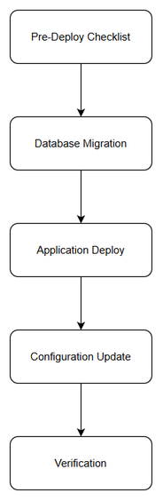
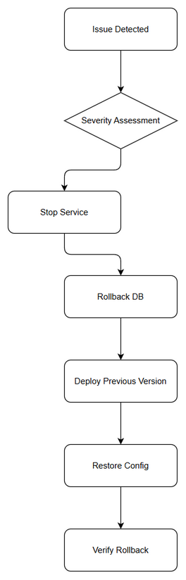

# Deployment Guide (DPG)

## SA4E — SA4E-276: Admin UI for Entra SSO configuration management

---

## Document Information

| Field | Value |
|-------|-------|
| Jira Ticket | SA4E-276 |
| Title | Admin UI for Entra SSO configuration management |
| Author | DevOps Agent |
| Version | 1.0 |
| Date | 2026-09-17 |
| Status | Draft |
| Related TDD | TDD-v1.0-SA4E-276.docx |

---

## Revision History

| Version | Date | Author | Changes |
|---------|------|--------|---------|
| 1.0 | 2026-09-17 | DevOps Agent | Initiate document — auto-generated from TDD and project context |

---

## Sign-Off

| Name | Role | Signature and date |
|------|------|--------------------|
| | Dev Lead | ☐ Approved for deployment |
| | QA Lead | ☐ Testing completed |
| | Ops Lead | ☐ Infrastructure ready |

---

## 1. Overview

### 1.1 Feature Summary

Admin Portal UI and backend services to manage Microsoft Entra SSO configuration with secure secret storage, RBAC enforcement, hot reload, and audit logging. Administrators can view, create, update and delete Entra SSO settings via Admin Portal without code deployment. Secrets are stored in Secret Store, DB stores only secretRef.

### 1.2 Deployment Scope

| Item | Type | Description |
|------|------|-------------|
| Admin API Module `/api/v1/entra-sso` | Modified | New CRUD endpoints for Entra SSO config with RBAC middleware |
| Admin Portal UI Svelte screens | New | Entra SSO Configuration page with masked secret input |
| Database `entra_sso_config` | New Table | Stores non-secret config + secretRef |
| Database `audit_log` | New Table | Audit trail for config changes |
| Configuration | Modified | SECRET_STORE_URL, CONFIG_SERVICE_URL, ENTRA_SSO_MANAGEMENT_ENABLED |

### 1.3 Target Environments

| Environment | URL | Deploy Order | Approval Required |
|-------------|-----|-------------|-------------------|
| DEV | https://admin-dev.sa4e.local | 1st | No |
| SIT | https://admin-sit.sa4e.local | 2nd | No |
| UAT | https://admin-uat.sa4e.local | 3rd | QA Sign-off |
| PROD | https://admin.sa4e.local | 4th | PM + Business Sign-off |

---

## 2. Prerequisites

### 2.1 Infrastructure

| Requirement | Status | Notes |
|-------------|--------|-------|
| Backend container available | Ready | Docker + docker-compose |
| PostgreSQL 15 instance | Ready | Existing SA4E DB |
| Secret Store Service reachable | Ready | SA4E-271 |
| Config Reload Service reachable | Ready | SA4E-264 |
| Network access for admin portal | Ready | Internal VPN |

### 2.2 Software Dependencies

| Dependency | Version | Status |
|-----------|---------|--------|
| Node.js | 22-alpine | Installed |
| TypeScript | 5.5 | Installed |
| Hono | 4.0 | Installed |
| PostgreSQL | 15 | Available |
| Docker | 24 | Available |

### 2.3 Access Requirements

| Access | Type | Who Needs It |
|--------|------|-------------|
| SSH to server | Key-based | DevOps team |
| Database admin | Credentials | DBA |
| CI/CD pipeline | Service account | Automated |
| Secret Store API token | Service token | Backend service |

### 2.4 Backup Requirements

- [ ] Database backup completed before deployment
- [ ] Application backup (previous version artifact saved)
- [ ] Configuration backup

---

## 3. Pre-Deployment Checklist

| # | Item | Responsible | Status |
|---|------|-------------|--------|
| 1 | Code merged to release branch | Developer | ☐ |
| 2 | All unit tests passed | Developer | ☐ |
| 3 | All integration tests passed | QA | ☐ |
| 4 | SIT/UAT sign-off obtained | QA + BA | ☐ |
| 5 | Database backup completed | DBA | ☐ |
| 6 | Configuration files prepared | DevOps | ☐ |
| 7 | Feature flags configured | Developer | ☐ |
| 8 | Monitoring/alerting configured | DevOps | ☐ |
| 9 | Rollback plan reviewed | Team | ☐ |
| 10 | Deployment window confirmed | PM | ☐ |

---

## 4. Database Migration

### 4.1 Migration Scripts

| Order | Script | Description | Estimated Time |
|-------|--------|-------------|----------------|
| 1 | V1__create_entra_sso_config.sql | Create entra_sso_config table with indexes | 30s |
| 2 | V2__create_audit_log.sql | Create audit_log table with indexes | 30s |

### 4.2 Execution Steps

```bash
# Step 1: Backup database
pg_dump -h postgres -U sa4e_user sa4e_db > backup_sa4e_20260917.sql

# Step 2: Run migration
psql -h postgres -U sa4e_user -d sa4e_db -f V1__create_entra_sso_config.sql
psql -h postgres -U sa4e_user -d sa4e_db -f V2__create_audit_log.sql

# Step 3: Verify migration
psql -h postgres -U sa4e_user -d sa4e_db -c "\dt entra_sso_config audit_log"
```

### 4.3 Verification Queries

```sql
-- Verify table created/modified
SELECT table_name FROM information_schema.tables WHERE table_name IN ('entra_sso_config','audit_log');

-- Verify indexes
SELECT indexname FROM pg_indexes WHERE tablename='entra_sso_config';
```

### 4.4 Rollback Scripts

```sql
-- Rollback migration
DROP TABLE IF EXISTS audit_log CASCADE;
DROP TABLE IF EXISTS entra_sso_config CASCADE;
```

---

## 5. Application Deployment

### 5.1 Deployment Flow



### 5.2 Deployment Steps

| Step | Action | Command | Verification |
|------|--------|---------|-------------|
| 1 | Stop existing service | docker compose stop backend | Container stopped |
| 2 | Pull new image | docker compose pull backend | Image updated |
| 3 | Update configuration | Copy env files with SECRET_STORE_URL etc | Config applied |
| 4 | Start service | docker compose up -d backend | Container running |
| 5 | Health check | curl http://localhost:48721/api/v1/health | 200 OK |

### 5.3 Docker Deployment

```bash
# Pull new image
docker pull registry.sa4e.local/backend:sa4e-276-v1.0

# Stop existing container
docker stop sa4e-backend

# Start new container
docker run -d --name sa4e-backend \
  -p 48721:48721 \
  -e DATABASE_URL=postgresql://... \
  -e SECRET_STORE_URL=https://secret-store.prod \
  registry.sa4e.local/backend:sa4e-276-v1.0

# Verify
docker logs sa4e-backend --tail 50
```

---

## 6. Configuration Changes

### 6.1 New Environment Variables

| Variable | Description | DEV | SIT | UAT | PROD |
|----------|-------------|-----|-----|-----|------|
| SECRET_STORE_URL | Secret Store endpoint | http://secret-store.dev | http://secret-store.sit | http://secret-store.uat | https://secret-store.prod |
| CONFIG_SERVICE_URL | Config reload service | http://config.dev | http://config.sit | http://config.uat | https://config.prod |
| ENTRA_SSO_MANAGEMENT_ENABLED | Feature flag | true | true | true | false — enable after verification |

### 6.2 Application Properties Changes

| Property | Old Value | New Value | File |
|----------|-----------|-----------|------|
| feature.entraSso.enabled | N/A | true | application.yml |
| auth.rbac.roles | ... | AuthAdmin,SystemAdmin | application.yml |

### 6.3 Feature Flags

| Flag | DEV | SIT | UAT | PROD |
|------|-----|-----|-----|------|
| ENTRA_SSO_MANAGEMENT_ENABLED | true | true | true | false — enable after verification |

---

## 7. Post-Deployment Verification

### 7.1 Health Checks

| Check | Endpoint/Command | Expected Result | Timeout |
|-------|-----------------|-----------------|---------|
| Application health | GET /api/v1/health | 200 OK, status: UP | 30s |
| DB connectivity | SELECT 1 | 1 | 10s |
| Secret Store reachable | GET /secrets/health | 200 OK | 10s |

### 7.2 Smoke Tests

| # | Scenario | Steps | Expected Result |
|---|----------|-------|-----------------|
| 1 | View config as Auth Admin | Navigate to Entra SSO page | Config displayed masked |
| 2 | Create config | POST /api/v1/entra-sso/config with valid data | 201 Created, secret stored |
| 3 | RBAC denied | PUT as Viewer | 403 Forbidden |

### 7.3 Log Verification

| Log Entry | Level | Expected | Location |
|-----------|-------|----------|----------|
| Application started | INFO | Within 60s of start | /app/logs/app.log |
| Feature initialized | INFO | After startup | /app/logs/app.log |

### 7.4 Monitoring Dashboard

- [ ] Application metrics visible in dashboard
- [ ] Error rate within normal range
- [ ] Response time within SLA
- [ ] No unexpected alerts triggered

---

## 8. Rollback Plan

### 8.1 Rollback Flow



### 8.2 Rollback Decision Criteria

| Condition | Action |
|-----------|--------|
| Critical defect found in production | Immediate rollback |
| Performance degradation > 50% | Immediate rollback |
| Data integrity issue | Immediate rollback + DBA investigation |
| Minor UI issue | Hotfix — no rollback |

### 8.3 Rollback Steps

| Step | Action | Command | Verification |
|------|--------|---------|-------------|
| 1 | Stop new version | docker stop sa4e-backend | Container stopped |
| 2 | Rollback database | psql -f rollback.sql | Tables dropped |
| 3 | Deploy previous version | docker run image:previous | Container running |
| 4 | Restore configuration | Copy previous env file | Config restored |
| 5 | Verify rollback | curl /health | 200 OK |

### 8.4 Rollback Time Estimate

| Action | Estimated Time |
|--------|---------------|
| Database rollback | 5 minutes |
| Application rollback | 3 minutes |
| Verification | 5 minutes |
| **Total** | **13 minutes** |

---

## 9. Environment-Specific Notes

### 9.1 DEV

DEV environment uses local Docker Compose with PostgreSQL and mock Secret Store.

### 9.2 SIT

SIT mirrors PROD infrastructure with test Secret Store.

### 9.3 UAT

UAT requires QA sign-off. Feature flag enabled for UAT testing.

### 9.4 PROD

- **Deployment Window:** Saturday 22:00-02:00
- **Approval Required From:** PM + Business Owner
- **Communication Plan:** Notify admins 24h before, Slack #releases after
- **On-Call Contact:** DevOps On-Call

---

## 10. Appendix

### Contacts

| Role | Name | Contact |
|------|------|---------|
| DevOps Lead | TBD | devops@sa4e.local |
| DBA | TBD | dba@sa4e.local |
| On-Call Dev | TBD | dev@sa4e.local |

### Related Tickets

| Ticket | Summary | Relationship |
|--------|---------|-------------|
| SA4E-276 | Admin UI for Entra SSO configuration management | Main ticket |
