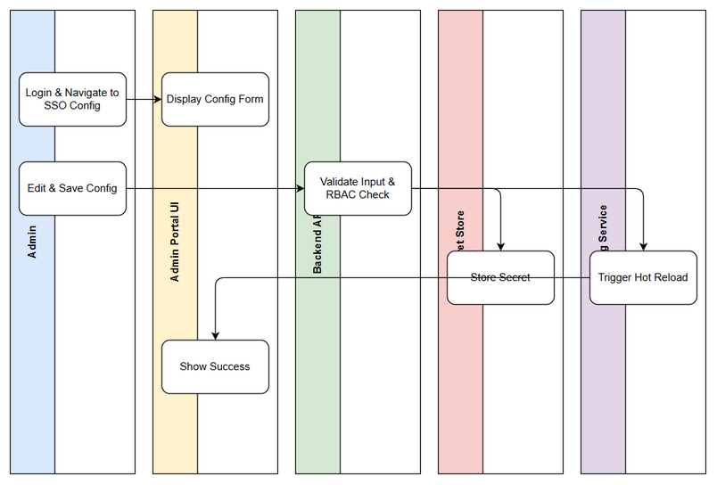

# Functional Specification Document (FSD)

## SA4E-276 — Admin UI for Entra SSO configuration management

---

## Document Information

| Field | Value |
|-------|-------|
| Jira Ticket | SA4E-276 |
| Title | Admin UI for Entra SSO configuration management |
| Author | TA Agent |
| Version | 1.0 |
| Date | 2026-09-17 |
| Status | Draft |
| Related BRD | documents/SA4E-276/BRD.md |

---

## Revision History

| Version | Date | Author | Changes |
|---------|------|--------|---------|
| 1.0 | 2026-09-17 | TA Agent | Enriched FSD from BRD with technical details, API contracts, data model, integration specs |

---

## 1. Introduction

### 1.1 Purpose
This FSD specifies the functional requirements, technical contracts, data model, integration points, security and non-functional specifications for the Admin UI to manage Microsoft Entra SSO configuration for SA4E platform. It translates BRD user stories into implementable specifications for backend Hono services and Svelte 4 Admin Portal frontend.

### 1.2 Scope
Technical scope covers:
- Admin Portal UI screens for Entra SSO configuration CRUD
- Backend REST API for config management with RBAC enforcement
- Secure secret store integration for Client Secret
- Config hot reload / controlled restart trigger via Config Service
- Audit logging of configuration changes
- Out of scope: OIDC login flow implementation, JIT provisioning, user-facing login UI, secret store implementation itself.

### 1.3 Definitions & Acronyms

| Term | Definition |
|------|------------|
| Entra ID | Microsoft Entra ID, formerly Azure AD |
| OIDC | OpenID Connect |
| RBAC | Role-Based Access Control |
| Secret Store | Secure vault for storing sensitive credentials |
| Hot Reload | Apply configuration changes without full service restart |
| FSD | Functional Specification Document |
| BRD | Business Requirements Document |

### 1.4 References

| Document | Location |
|----------|----------|
| BRD | documents/SA4E-276/BRD.md |
| FSD Template | documents/templates/FSD-TEMPLATE.md |
| Project Structure | .analysis/code-intelligence/project-structure.md |

---

## 2. System Overview

### 2.1 System Context Diagram


The Admin Portal frontend interacts with Admin Portal Backend API. Backend interfaces with Secret Store Service, Config Service for hot reload, Database for non-secret config, and Audit Log Service. External Microsoft Entra ID is referenced for validation but configuration is managed internally.

### 2.2 System Architecture
Architecture follows TypeScript Hono backend + Svelte 4 + Vite webview pattern.

**Components:**
- **Admin Portal Web UI** `extension/src/webview/components/` Svelte 4 components for Authentication → Entra SSO Configuration page.
- **Admin API Module** `backend/modules/auth/` Hono routes under `/api/v1/entra-sso`
- **Config Service** existing service supporting hot reload `SA4E-264`
- **Secret Store Service** `SA4E-271` — provides store/retrieve secret API
- **RBAC Middleware** JWT-based `server/jwt-auth.ts` with role claims
- **Audit Logger** writes to audit table/log service

Communication is REST JSON over HTTPS. Secrets never transit through DB; only `secretRef` stored.

---

## 3. Functional Requirements

### 3.1 Feature: Manage Entra SSO Configuration via Admin Portal UI

**Source:** BRD Story 1 [Implements: SA4E-276 Story 1]

#### 3.1.1 Description
Admin can view, create, update and delete Entra SSO configuration records via dedicated page. Secrets are masked. Changes persist to DB + Secret Store and trigger config reload.

#### 3.1.2 Use Case

**Use Case ID:** UC-001
**Actor:** Auth Admin / System Admin
**Preconditions:** User authenticated to Admin Portal with role Auth Admin or System Admin. Entra SSO backend integration exists.
**Postconditions:** Configuration persisted, secret stored securely, config reloaded, audit log created.

**Main Flow:**
| Step | Actor | System | Description |
|------|-------|--------|-------------|
| 1 | Admin | | Navigates to Settings → Authentication → Entra SSO Configuration |
| 2 | | System | Displays current config with secrets masked, shows enabled toggle and status |
| 3 | Admin | | Clicks Edit |
| 4 | | System | RBAC check, enables form editing |
| 5 | Admin | | Updates fields: tenantId, clientId, clientSecret, redirectUri, issuerUrl, jwksUrl, enabled |
| 6 | Admin | | Clicks Save |
| 7 | | System | Validates input, checks RBAC, writes secrets to Secret Store, writes non-secret to DB |
| 8 | | System | Triggers hot reload via Config Service |
| 9 | | System | Records audit log, shows success notification |

**Alternative Flows:**
| ID | Condition | Steps |
|----|-----------|-------|
| AF-1 | View only user | Edit controls hidden, read-only view displayed |
| AF-2 | Secret unchanged on update | System reuses existing secretRef, does not overwrite secret store |

**Exception Flows:**
| ID | Condition | Steps |
|----|-----------|-------|
| EF-1 | RBAC denied | Return 403, show "You do not have permission to edit authentication settings" |
| EF-2 | Validation failure | Show inline field errors, prevent save |
| EF-3 | Secret store unavailable | Rollback DB change, show "Unable to save secrets, please retry" |
| EF-4 | Hot reload failure | Notify admin, offer controlled restart option |

#### 3.1.3 Business Rules

| Rule ID | Rule | Source |
|---------|------|--------|
| BR-001 | Tenant ID must be valid UUID/GUID format | BRD 1.7 |
| BR-002 | Client ID must be valid UUID/GUID format | BRD 1.7 |
| BR-003 | Redirect URI must be valid HTTPS URL | BRD 1.7 |
| BR-004 | Client Secret cannot be empty when enabled=true | BRD 1.7 |
| BR-005 | Edit requires role Auth Admin or System Admin | BRD Story 3 |
| BR-006 | Secrets never stored in plain text DB | BRD Story 2 |

#### 3.1.4 Data Specifications

**Input Data:**
| Field | Type | Required | Validation | Description |
|-------|------|----------|------------|-------------|
| tenantId | string | Y | UUID v4 regex | Microsoft Entra Tenant ID |
| clientId | string | Y | UUID v4 regex | Entra Application Client ID |
| clientSecret | string | Y* | min 8 chars, masked input | Entra Application Client Secret |
| redirectUri | string | Y | valid HTTPS URL | OAuth redirect URI |
| issuerUrl | string | Y | valid HTTPS URL | Entra OIDC issuer |
| jwksUrl | string | N | valid URL | JWKS endpoint |
| enabled | boolean | Y | true/false | Enable/disable SSO |

*Required only when enabled=true

**Output Data:**
| Field | Type | Description |
|-------|------|-------------|
| id | string | Configuration record ID |
| tenantId | string | Tenant ID |
| clientId | string | Client ID |
| clientSecretMasked | string | Masked secret e.g. ******** |
| redirectUri | string | Redirect URI |
| issuerUrl | string | Issuer URL |
| jwksUrl | string | JWKS URL |
| enabled | boolean | Enabled flag |
| status | string | connection health status |
| updatedAt | string | ISO timestamp |
| updatedBy | string | User ID |

#### 3.1.5 UI Specifications

**Screen: Entra SSO Configuration**

| No. | Element | Type | Required | Behavior | Validation |
|-----|---------|------|----------|----------|------------|
| 1 | Tenant ID | Input | Y | Text input | UUID format |
| 2 | Client ID | Input | Y | Text input | UUID format |
| 3 | Client Secret | Password Input | Y | Masked, placeholder ******** | Non-empty if enabled |
| 4 | Redirect URI | Input | Y | URL input | Valid HTTPS URL |
| 5 | Issuer URL | Input | Y | URL input | Valid URL |
| 6 | JWKS URL | Input | N | URL input | Valid URL |
| 7 | Enabled Toggle | Switch | Y | Enable/disable | boolean |
| 8 | Save Button | Button | Y | Save changes | Disabled if validation fails |
| 9 | Cancel Button | Button | N | Discard changes | - |
|10 | Status Badge | Text | N | Shows connection health | Read only |

#### 3.1.6 API Contract (Functional View)

**Endpoint:** `GET /api/v1/entra-sso/config`
**Purpose:** Retrieve current Entra SSO configuration with secrets masked
**Auth:** JWT required
**Input Parameters:** None
**Output Data:** As per Output Data table above
**Business Error Scenarios:**
| Scenario | User Message | Trigger |
|----------|--------------|---------|
| Not found | No configuration exists | First time setup |
| Unauthorized | You do not have permission to view | Role missing |

**Endpoint:** `POST /api/v1/entra-sso/config`
**Purpose:** Create new configuration
**Auth:** JWT + RBAC Auth Admin/System Admin
**Input Parameters:** tenantId, clientId, clientSecret, redirectUri, issuerUrl, jwksUrl, enabled
**Business Error Scenarios:**
| Scenario | User Message | Trigger |
|----------|--------------|---------|
| Validation failed | Inline field errors | BR-001..004 |
| RBAC denied | You do not have permission to edit | Role check fail |
| Secret store error | Unable to save secrets | Secret Store unavailable |

**Endpoint:** `PUT /api/v1/entra-sso/config/{id}`
**Purpose:** Update existing configuration
**Auth:** JWT + RBAC
**Input Parameters:** Partial fields as above
**Business Error Scenarios:** Same as POST

**Endpoint:** `DELETE /api/v1/entra-sso/config/{id}`
**Purpose:** Delete configuration
**Auth:** JWT + RBAC
**Business Error Scenarios:** RBAC denied

<!-- TA enrichment -->
**Technical API Details for Implementation:**
```typescript
// GET
GET /api/v1/entra-sso/config
Headers: Authorization: Bearer <jwt>
Response 200:
{
  "id": "uuid",
  "tenantId": "string",
  "clientId": "string",
  "clientSecretMasked": "********",
  "secretRef": "secret://entra/clientSecret",
  "redirectUri": "string",
  "issuerUrl": "string",
  "jwksUrl": "string",
  "enabled": true,
  "status": "healthy|degraded|unknown",
  "updatedAt": "2026-09-17T00:00:00Z",
  "updatedBy": "user-id"
}

// POST
POST /api/v1/entra-sso/config
Body:
{
  "tenantId": "uuid",
  "clientId": "uuid",
  "clientSecret": "string",
  "redirectUri": "https://...",
  "issuerUrl": "https://...",
  "jwksUrl": "https://...",
  "enabled": true
}
Response 201: { config object }
Errors: 400 validation, 403 forbidden, 500 secret store error
```

### 3.2 Feature: Store Secrets in Secure Secret Store

**Source:** BRD Story 2 [Implements: SA4E-276 Story 2]

#### 3.2.1 Description
Client Secret must be stored in Secret Store, DB stores only secretRef. UI never displays clear text.

#### 3.2.2 Use Case
**Use Case ID:** UC-002
**Main Flow:** On save, backend extracts clientSecret, calls Secret Store API to create/update secret, receives secretRef, persists non-secret fields + secretRef to DB.

**Business Rules:**
- Secret store write must succeed before DB commit
- On update with empty clientSecret field, retain existing secretRef

#### 3.2.3 API Contract
Secret Store integration is internal. Public API contracts as above remain unchanged.

### 3.3 Feature: RBAC Enforcement

**Source:** BRD Story 3 [Implements: SA4E-276 Story 3]

**Use Case ID:** UC-003
Backend middleware checks JWT roles: `AuthAdmin` or `SystemAdmin`. View may be allowed for `AuthViewer`.

**Business Error:** 403 Forbidden with audit log entry.

### 3.4 Feature: Hot Reload / Controlled Restart

**Source:** BRD Story 4 [Implements: SA4E-276 Story 4]

**Use Case ID:** UC-004
After successful save, backend calls Config Service `POST /config/reload?service=auth`. If hot reload fails, fallback to controlled restart.

**Acceptance:** Reload completes within 5 seconds.

---

## 4. Data Model

> Note: Logical model. Physical DDL in TDD.

### 4.1 Entity Relationship Diagram


### 4.2 Logical Entities

#### Entity: EntraSsoConfig

| Attribute | Type | Required | Business Rule | Description |
|-----------|------|----------|---------------|-------------|
| id | UUID | Y | PK | Config record identifier |
| tenantId | string | Y | BR-001 | Entra Tenant ID |
| clientId | string | Y | BR-002 | Entra Client ID |
| secretRef | string | Y | - | Reference to secret store |
| redirectUri | string | Y | BR-003 | Redirect URI |
| issuerUrl | string | Y | - | OIDC Issuer |
| jwksUrl | string | N | - | JWKS URL |
| enabled | boolean | Y | - | Enable flag |
| status | string | N | - | Health status |
| updatedAt | timestamp | Y | - | Last update |
| updatedBy | string | Y | - | User ID |

**Relationships:**
| From Entity | To Entity | Cardinality | Description |
|-------------|-----------|-------------|-------------|
| EntraSsoConfig | AuditLog | 1:N | Config changes logged |

#### Entity: AuditLog
| Attribute | Type | Required | Description |
|-----------|------|----------|-------------|
| id | UUID | Y | |
| entityType | string | Y | 'EntraSsoConfig' |
| entityId | string | Y | |
| action | string | Y | CREATE/UPDATE/DELETE |
| userId | string | Y | |
| timestamp | timestamp | Y | |
| details | json | N | Changed fields |

Indexes: `idx_entra_config_updatedAt`, `idx_audit_entity`.

---

## 5. Integration Specifications

### 5.1 External System: Secure Secret Store Service

| Attribute | Value |
|-----------|-------|
| Purpose | Store Entra Client Secret securely |
| Direction | Outbound |
| Data Format | JSON |
| Frequency | On-demand |

**Data Exchange:**
| Our Data | External Data | Direction | Business Rule |
|----------|---------------|-----------|---------------|
| clientSecret | secretRef | Send | Store secret, receive reference |
| secretRef | secretValue | Receive | Retrieve secret at runtime for auth service |

**API Contract:**
`POST /secrets` body `{ name: "entra-client-secret", value: "..." }` → `{ secretRef }`
`GET /secrets/{secretRef}` → `{ value }` requires service token.

Retry policy: 3 attempts exponential backoff, circuit breaker after 5 failures.

### 5.2 External System: Config Reload Service

| Attribute | Value |
|-----------|-------|
| Purpose | Apply config changes without downtime |
| Direction | Outbound |
| Frequency | On-demand |

**API Contract:**
`POST /config/reload` body `{ service: "auth", configId: "..." }`
Response 200 `{ status: "reloaded", durationMs: 123 }`
Error 500 triggers controlled restart fallback.

### 5.3 External System: Audit Log Service

Write audit events on create/update/delete.

---

## 6. Processing Logic

### 6.1 Save Entra SSO Configuration Process

**Trigger:** Admin clicks Save on UI
**Input:** Config DTO + JWT
**Output:** Updated config + audit entry + reload status

**Processing Steps:**
| Step | Description | Error Handling |
|------|-------------|----------------|
| 1 | Authenticate JWT, check RBAC | 401/403 |
| 2 | Validate input fields per BR-001..004 | Return 400 with field errors |
| 3 | If clientSecret provided, write to Secret Store | Rollback if fails |
| 4 | Persist non-secret fields + secretRef to DB | Transactional |
| 5 | Trigger Config Reload Service | If fails, notify admin, log error |
| 6 | Write Audit Log | Best effort |
| 7 | Return success response | - |

Activity Diagram:


---

## 7. Security Requirements

### 7.1 Authentication & Authorization

| Role | Permissions | Screens/Features |
|------|-------------|-------------------|
| Auth Admin | Read/Write | Entra SSO Configuration full edit |
| System Admin | Read/Write | Entra SSO Configuration full edit |
| Auth Viewer | Read | View configuration masked |
| User | None | No access |

### 7.2 Data Sensitivity Classification

| Data Type | Classification | Business Requirement |
|-----------|----------------|----------------------|
| clientSecret | Restricted | Encrypted at rest in Secret Store, never in DB logs |
| tenantId/clientId | Confidential | Internal use only |
| audit logs | Confidential | Retain 1 year |

### 7.3 Audit Trail

| Event | Logged Fields | Retention | Business Reason |
|-------|--------------|-----------|-----------------|
| Config Create/Update/Delete | userId, timestamp, before/after diff | 1 year | Compliance |
| RBAC denied | userId, endpoint, timestamp | 1 year | Security monitoring |
| Secret store failure | error code, timestamp | 90 days | Ops troubleshooting |

---

## 8. Non-Functional Requirements

| Category | Business Requirement | Acceptance Criteria |
|----------|---------------------|---------------------|
| Performance | Config save and reload | Completes within 5 seconds p95 |
| Availability | Admin Portal UI | 99.9% uptime |
| Security | Secrets encryption | AES-256 at rest in Secret Store |
| Audit | Change logging | All changes logged with user and timestamp |

---

## 9. Error Handling & Logging

### 9.1 Error Scenarios

| Scenario | Severity | User Message | Expected Behavior |
|----------|----------|-------------|-------------------|
| RBAC denied | Warning | You do not have permission to edit authentication settings | Hide edit UI, return 403 |
| Validation failure | Info | Inline field errors | Prevent save |
| Secret store unavailable | Critical | Unable to save secrets, please retry | Rollback DB, log error |
| Hot reload failure | Warning | Configuration saved but reload failed, manual restart required | Notify admin |

### 9.2 Notification Requirements

| Event | Who is Notified | Channel | Timing |
|-------|----------------|---------|--------|
| Config changed | System Admins | In-app notification | Immediate |
| Reload failure | DevOps | Email + Slack | Immediate |

---

## 10. Testing Considerations

### 10.1 Test Scenarios

| ID | Scenario | Input | Expected Output | Priority |
|----|----------|-------|-----------------|----------|
| TC-01 | Valid config create | All fields valid | 201 created, secret stored | High |
| TC-02 | Invalid UUID tenantId | Bad format | 400 validation error | High |
| TC-03 | RBAC denied edit | User without role | 403 forbidden | High |
| TC-04 | Secret store failure | Secret Store down | Rollback, error message | High |
| TC-05 | Hot reload success | Valid config save | Config reloaded <5s | Medium |
| TC-06 | View masked secret | Existing config | Secret shown as ******** | High |

---

## 11. Appendix

### Diagrams

| Diagram | File |
|---------|------|
| Use Case | diagrams/use-case.png |
| Business Flow | diagrams/business-flow.png |
| System Context | diagrams/system-context.png |
| ER Diagram | diagrams/er-diagram.png |

### Change Log from BRD

- Added technical API contracts with request/response schemas for TypeScript Hono backend
- Added data model with EntraSsoConfig and AuditLog entities
- Added pseudocode for save process with secret store interaction
- Quantified NFR: config save <5s p95
- Specified RBAC roles and audit requirements

<!-- TA enrichment -->
